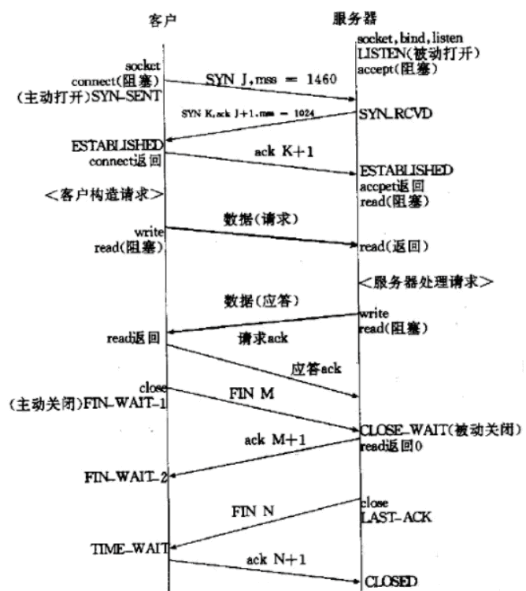

## TCP 11 种状态对应的 UNIX 套接字系统调用函数

来源 [TCP11种状态](https://blog.csdn.net/wk_bjut_edu_cn/article/details/82343939)

**CLOSED：**初始状态，表示TCP连接是“关闭着的”或“未打开的”。

**LISTEN ：**表示服务器端的某个SOCKET处于监听状态，可以接受客户端的连接。

**SYN_RCVD ：**表示服务器接收到了来自客户端请求连接的SYN报文。在正常情况下，这个状态是服务器端的SOCKET在建立TCP连接时的三次握手会话过程中的一个中间状态，很短暂，基本上用netstat很难看到这种状态，除非故意写一个监测程序，将三次TCP握手过程中最后一个ACK报文不予发送。当TCP连接处于此状态时，再收到客户端的ACK报文，它就会进入到ESTABLISHED 状态。

**SYN_SENT ：**这个状态与SYN_RCVD 状态相呼应，当客户端SOCKET执行connect()进行连接时，它首先发送SYN报文，然后随即进入到SYN_SENT 状态，并等待服务端的发送三次握手中的第2个报文。SYN_SENT 状态表示客户端已发送SYN报文。

**ESTABLISHED ：**表示TCP连接已经成功建立。

**FIN_WAIT_1 ：**这个状态得好好解释一下，其实FIN_WAIT_1 和FIN_WAIT_2 两种状态的真正含义都是表示等待对方的FIN报文。而这两种状态的区别是：FIN_WAIT_1状态实际上是当SOCKET在ESTABLISHED状态时，它想主动关闭连接，向对方发送了FIN报文，此时该SOCKET进入到FIN_WAIT_1 状态。而当对方回应ACK报文后，则进入到FIN_WAIT_2 状态。当然在实际的正常情况下，无论对方处于任何种情况下，都应该马上回应ACK报文，所以FIN_WAIT_1 状态一般是比较难见到的，而FIN_WAIT_2 状态有时仍可以用netstat看到。

**FIN_WAIT_2 ：**上面已经解释了这种状态的由来，实际上FIN_WAIT_2状态下的SOCKET表示半连接，即有一方调用close()主动要求关闭连接。注意：FIN_WAIT_2 是没有超时的（不像TIME_WAIT 状态），这种状态下如果对方不关闭（不配合完成4次挥手过程），那这个 FIN_WAIT_2 状态将一直保持到系统重启，越来越多的FIN_WAIT_2 状态会导致内核crash。

**TIME_WAIT ：**表示收到了对方的FIN报文，并发送出了ACK报文。 TIME_WAIT状态下的TCP连接会等待2*MSL（Max Segment Lifetime，最大分段生存期，指一个TCP报文在Internet上的最长生存时间。每个具体的TCP协议实现都必须选择一个确定的MSL值，RFC 1122建议是2分钟，但BSD传统实现采用了30秒，Linux可以cat /proc/sys/net/ipv4/tcp_fin_timeout看到本机的这个值），然后即可回到CLOSED 可用状态了。如果FIN_WAIT_1状态下，收到了对方同时带FIN标志和ACK标志的报文时，可以直接进入到TIME_WAIT状态，而无须经过FIN_WAIT_2状态。（这种情况应该就是四次挥手变成三次挥手的那种情况）

**CLOSING ：**这种状态在实际情况中应该很少见，属于一种比较罕见的例外状态。正常情况下，当一方发送FIN报文后，按理来说是应该先收到（或同时收到）对方的ACK报文，再收到对方的FIN报文。但是CLOSING 状态表示一方发送FIN报文后，并没有收到对方的ACK报文，反而却也收到了对方的FIN报文。什么情况下会出现此种情况呢？那就是**当双方几乎在同时close()一个SOCKET的话，就出现了双方同时发送FIN报文的情况**，这是就会出现CLOSING 状态，表示双方都正在关闭SOCKET连接。产生的原因是客户端和服务端同时关闭。

**CLOSE_WAIT ：**表示正在等待关闭。怎么理解呢？当对方close()一个SOCKET后发送FIN报文给自己，你的系统毫无疑问地将会回应一个ACK报文给对方，此时TCP连接则进入到CLOSE_WAIT状态。接下来呢，你需要检查自己是否还有数据要发送给对方，如果没有的话，那你也就可以close()这个SOCKET并发送FIN报文给对方，即关闭自己到对方这个方向的连接。有数据的话则看程序的策略，继续发送或丢弃。简单地说，当你处于CLOSE_WAIT 状态下，需要完成的事情是等待你去关闭连接。

**LAST_ACK ：**当被动关闭的一方在发送FIN报文后，等待对方的ACK报文的时候，就处于LAST_ACK 状态。当收到对方的ACK报文后，也就可以进入到CLOSED 可用状态了。