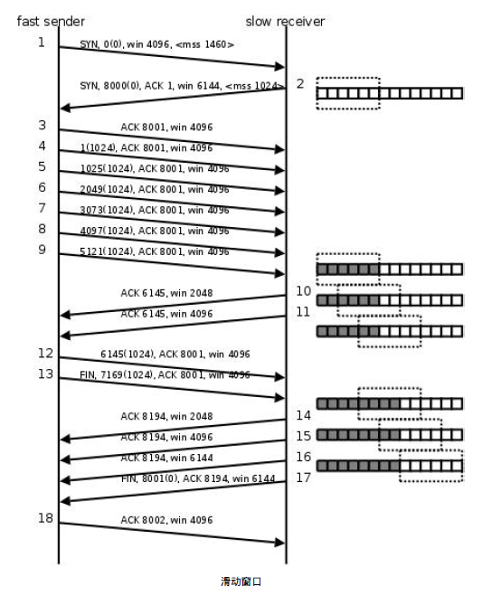

## TCP 滑动窗口

介绍UDP 时我们描述了这样的问题：如果发送端发送的速度较快，接收端接收到数据后处理的速度较慢，而
接收缓冲区的大小是固定的，就会丢失数据。TCP 协议通过“滑动窗口（Sliding Window）”机制解决这一问题。
看下图的通讯过程：

* 1. 发送端发起连接，声明最大段尺寸是1460，初始序号是0，窗口大小是4K，表示“我的接收缓冲区还有4K 字节空闲，你发的数据不要超过4K”。接收端应答连接请求，声明最大段尺寸是1024，初始序号是8000，窗口大小是6K。发送端应答，三方握手结束。
* 2. 发送端发出段4-9，每个段带1K 的数据，发送端根据窗口大小知道接收端的缓冲区满了，因此停止发送数据。
* 3. 接收端的应用程序提走2K 数据，接收缓冲区又有了2K 空闲，接收端发出段10，在应答已收到6K 数据的同时声明窗口大小为2K。
* 4. 接收端的应用程序又提走2K 数据，接收缓冲区有4K 空闲，接收端发出段11，重新声明窗口大小为4K。
* 5. 发送端发出段12-13，每个段带2K 数据，段13 同时还包含FIN 位。
* 6. 接收端应答接收到的2K 数据（6145-8192），再加上FIN 位占一个序号8193，因此应答序号是8194，连接处于半关闭状态，接收端同时声明窗口大小为2K。
* 7. 接收端的应用程序提走2K 数据，接收端重新声明窗口大小为4K。
* 8. 接收端的应用程序提走剩下的2K 数据，接收缓冲区全空，接收端重新声明窗口大小为6K。
* 9. 接收端的应用程序在提走全部数据后，决定关闭连接，发出段17 包含FIN 位，发送端应答，连接完全关闭。上图在接收端用小方块表示1K 数据，实心的小方块表示已接收到的数据，虚线框表示接收缓冲区，因此套在
虚线框中的空心小方块表示窗口大小，从图中可以看出，随着应用程序提走数据，虚线框是向右滑动的，因此称为
滑动窗口。

从这个例子还可以看出，发送端是一K 一K 地发送数据，而接收端的应用程序可以两K 两K 地提走数据，当然
也有可能一次提走3K 或6K 数据，或者一次只提走几个字节的数据。也就是说，应用程序所看到的数据是一个整
体，或说是一个流（stream），在底层通讯中这些数据可能被拆成很多数据包来发送，但是一个数据包有多少字
节对应用程序是不可见的，因此TCP 协议是面向流的协议。而UDP 是面向消息的协议，每个UDP 段都是一条消
息，应用程序必须以消息为单位提取数据，不能一次提取任意字节的数据，这一点和TCP 是很不同的。