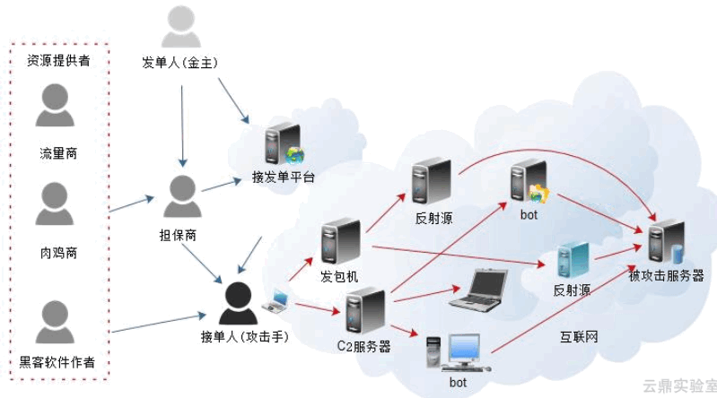
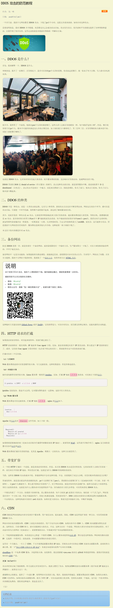

# 防控DDOS

以下资源来自知乎和阮一峰。

作者：腾讯安全联合实验室
链接：https://www.zhihu.com/question/19581905/answer/578131116
来源：知乎
著作权归作者所有。商业转载请联系作者获得授权，非商业转载请注明出处。

DDoS即分布式拒绝服务攻击，DDoS里面的 DoS是denial of service(停止服务)的缩写，表示这种攻击的目的，就是使得服务中断。最前面的那个D是 distributed(分布式)，表示攻击不是来自一个地方，而是来自四面八方，因此更难防御。

**什么是DDoS攻击？**

这是我见过最有趣、最直白、最好玩的解释，源自百度百科，一群恶霸试图让对面那家有着竞争关系的商铺无法正常营业，他们会采取什么手段呢？恶霸们扮作普通客户一直拥挤在对手的商铺，赖着不走，真正的购物者却无法进入；或者总是和营业员有一搭没一搭的东扯西扯，让工作人员不能正常服务客户；也可以为商铺的经营者提供虚假信息，商铺的上上下下忙成一团之后却发现都是一场空，最终跑了真正的大客户，损失惨重。此外恶霸们完成这些坏事有时凭单干难以完成，需要叫上很多人一起。嗯，网络安全领域中DoS和DDoS攻击就遵循着这些思路。

其实，以上提到的恶霸其实就是“肉鸡”，可谓是DDoS攻击的核心大杀器。这里提到一点，实践证明，目前并不是只有PC会成为“肉鸡”，现在可以这样说，只要是物联的设备都有可能成为肉鸡，比如：手机、服务器、智能音响等等。

**如何发起DDoS攻击的？** 

举例来说，基本分为以下三步：

**第一、搜集目标，刺探军情。**比如：搜集目标家有多少人，都使用哪些设备，家庭情况怎么样，值不值得攻击，然后找个机会顺便潜入目标家拿到开门的最高权限。

**第二、确定攻击时间段。**当目标一家人都在家或者有很多客人上门的时候是发动攻击的最佳时间段；

**第三、发动肉鸡攻击。**经过前2步的精心准备后，“鸡主”把这些肉鸡全引向盯梢已久的目标家门口，打开门，让肉鸡如洪水般涌入目标家里。

经过以上三步，便完成了一次完整的DDoS攻击过程。

**回到题主的问题，互联网创业公司如何防御一次DDoS攻击？防御方式如下：**

**1、采用高性能的网络设备**

首先需要保证路由器、交换机、硬件防火墙等网络设备的性能，当发生DDoS攻击的时候，用足够性能的机器、容量去承受攻击，充分利用网络设备保护网络资源是十分有效的应对策略。

**2、保证服务器系统的安全**

首先要确保服务器软件没有任何漏洞，防止攻击者入侵。确保服务器采用最新系统，并打上安全补丁。在服务器上删除未使用的服务，关闭未使用的端口。对于服务器上运行的网站，确保其打了最新的补丁，没有安全漏洞。

**3、充足的网络带宽保证**

网络带宽直接决定了能抗受攻击的能力，假若仅仅有10M带宽的话，无论采取什么措施都很难对抗现在的SYNFlood攻击，当前至少要选择100M的共享带宽，最好的当然是挂在1000M的主干上了。但需要注意的是，主机上的网卡是1000M的并不意味着它的网络带宽就是千兆的，若把它接在100M的交换机上，它的实际带宽不会超过100M，再就是接在100M的带宽上也不等于就有了百兆的带宽，因为网络服务商很可能会在交换机上限制实际带宽为10M，这点一定要搞清楚。

**4、把网站做成静态页面或者伪静态**

大量事实证明，把网站尽可能做成静态页面，不仅能大大提高抗攻击能力，而且还给黑客入侵带来不少麻烦，至少到现在为止关于HTML的溢出还没出现。如果非需要动态脚本调用，那就把它弄到另外一台单独主机去，免的遭受攻击时连累主服务器，当然，适当放一些不做数据库调用脚本还是可以的。 

**5、增强操作系统的TCP/IP栈**

Windows操作系统本身就具备一定的抵抗DDoS攻击的能力，只是默认状态下没有开启而已，若开启的话可抵挡约10000个SYN攻击包，若没有开启则仅能抵御数百个，具体怎么开启，还需自行去微软官网了解。

**6、HTTP 请求的拦截**

HTTP 请求的特征一般有两种：IP 地址和 User Agent 字段。比如，恶意请求都是从某个 IP 段发出的，那么把这个 IP 段封掉就行。或者，它们的 User Agent 字段有特征(包含某个特定的词语)，那就把带有这个词语的请求拦截。

**7、部署CDN**

CDN 指的是网站的静态内容分发到多个服务器，用户就近访问，提高速度。因此，CDN 也是带宽扩容的一种方法，可以用来防御 DDOS 攻击。

**8、隐藏服务器的真实IP地址**

服务器前端加CDN中转，如果资金充裕的话，可以购买高防的盾机，用于隐藏服务器真实IP，域名解析使用CDN的IP，所有解析的子域名都使用CDN的IP地址。此外，服务器上部署的其他域名也不能使用真实IP解析，全部都使用CDN来解析。

**9、定期检查**

企业网骨干需要定期检查主要的网络节点，清查可能会出现的问题，对于新出现的漏洞及时处理。主要因为是骨干节点本身就具有很高的带宽，这是黑客们可以利用的好位置，所以说要加强这些主机是十分必要的。

**10、利用专业的安全防护产品**

这里讲解一个案例，在2018年年末，腾讯云某知名互联网行业客户遭受了一次大型DDoS攻击，流量峰值一度逼近T级。客户遭受大流量DDoS攻击时,如何抗D维稳是当务之急，710Gbps大流量攻击对业界传统防护方案挑战不小。在快速分析完客户情况之后,腾讯云大禹团队立即响应，针对客户业务情况提供大禹高防IP专业版解决方案，智能调度防护节点,满足跨区域T级大流量抗D需求，攻击持续了一天，决战却只在一分钟内完成。截至目前，腾讯云大禹DDoS高防,还在江苏省公安厅、阅文集团、熊猫直播、携程、摩拜单车等各行各业的客户中守护企业网络安全。

 关于如何防御DDoS攻击，腾讯云发布的《2018上半年互联网DDoS攻击趋势分析报告》曾有明确阐述，需要的朋友可自寻搜索。另外在这里放一个彩蛋，关于DDoS攻击的新报告将于2019年第一季度发出来，敬请期待。

**写在最后：**

随着全球互联网业务和云计算的发展热潮，可以预见到，针对云数据中心的DDoS攻击频率还会大幅度增长，攻击手段也会更加复杂。安全工作是一个长期持续性而非阶段性的工作，所以需要时刻保持一种警觉，而且网络安全不仅仅是某家企业的责任，更是全社会的共同责任，需要大家共同努力。

