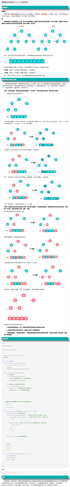

<!-- START doctoc generated TOC please keep comment here to allow auto update -->
<!-- DON'T EDIT THIS SECTION, INSTEAD RE-RUN doctoc TO UPDATE -->

- [常见排序算法](#%E5%B8%B8%E8%A7%81%E6%8E%92%E5%BA%8F%E7%AE%97%E6%B3%95)
  - [问题--海量数据如何去取最大的k个，当有相同元素时，还可以使用什么不同的方法求第k大的元素](#%E9%97%AE%E9%A2%98--%E6%B5%B7%E9%87%8F%E6%95%B0%E6%8D%AE%E5%A6%82%E4%BD%95%E5%8E%BB%E5%8F%96%E6%9C%80%E5%A4%A7%E7%9A%84k%E4%B8%AA%E5%BD%93%E6%9C%89%E7%9B%B8%E5%90%8C%E5%85%83%E7%B4%A0%E6%97%B6%E8%BF%98%E5%8F%AF%E4%BB%A5%E4%BD%BF%E7%94%A8%E4%BB%80%E4%B9%88%E4%B8%8D%E5%90%8C%E7%9A%84%E6%96%B9%E6%B3%95%E6%B1%82%E7%AC%ACk%E5%A4%A7%E7%9A%84%E5%85%83%E7%B4%A0)
- [查找算法](#%E6%9F%A5%E6%89%BE%E7%AE%97%E6%B3%95)
    - [堆排序过程](#%E5%A0%86%E6%8E%92%E5%BA%8F%E8%BF%87%E7%A8%8B)

<!-- END doctoc generated TOC please keep comment here to allow auto update -->

## 常见排序算法

算法 |平均时间复杂的| 最差时间复杂度| 空间复杂度| 数据稳定性
---|---|---|---|---
冒泡排序|O(n2)|O(n2)|O(1)|稳定
选择排序|O(n2)|O(n2)|O(1)|不稳定
插入排序|O(n2)|O(n2)|O(1)|稳定
快速排序|O(n*log2n)|O(n2)|O(n*log2n)|不稳定
归并排序|O(n*log2n)|O(n*log2n)|O(n)|稳定
堆排序|O(n*log2n)|O(n*log2n)|O(1)|不稳定
希尔排序|O(n*log2n)|O(n2)|O(1)|不稳定
计数排序|O(n + m)|O(n + m)|O(n + m)|稳定
桶排序|O(n)|O(n)|O(m)|稳定
基数排序|O(k*n)|O(n2)||稳定

* 均按从小到大排列
* k：代表数值中的 “数位” 个数
* n：代表数据规模
* m：代表数据的最大值减最小值（计数排序特点）

### 问题--海量数据如何去取最大的k个，当有相同元素时，还可以使用什么不同的方法求第k大的元素

* 1、直接全部排序（只适用于内存够的情况）

    当数据量较小的情况下，内存中可以容纳所有数据。则最简单也是最容易想到的方法是将数据全部排序，然后取排序后的数据中的前K个。

    这种方法对数据量比较敏感，当数据量较大的情况下，内存不能完全容纳全部数据，这种方法便不适应了。即使内存能够满足要求，该方法将全部数据都排序了，而题目只要求找出top K个数据，所以该方法并不十分高效，不建议使用。

* 2、快速排序的变形 （只使用于内存够的情况）

    这是一个基于快速排序的变形，因为第一种方法中说到将所有元素都排序并不十分高效，只需要找出前K个最大的就行。

    这种方法类似于快速排序，首先选择一个划分元，将比这个划分元大的元素放到它的前面，比划分元小的元素放到它的后面，此时完成了一趟排序。如果此时这个划分元的序号index刚好等于K，那么这个划分元以及它左边的数，刚好就是前K个最大的元素；如果index  > K，那么前K大的数据在index的左边，那么就继续递归的从index-1个数中进行一趟排序；如果index < K，那么再从划分元的右边继续进行排序，直到找到序号index刚好等于K为止。再将前K个数进行排序后，返回Top K个元素。这种方法就避免了对除了Top K个元素以外的数据进行排序所带来的不必要的开销。

* 3、最小堆法

    这是一种局部淘汰法。先读取前K个数，建立一个最小堆。然后将剩余的所有数字依次与最小堆的堆顶进行比较，如果小于或等于堆顶数据，则继续比较下一个；否则，删除堆顶元素，并将新数据插入堆中，重新调整最小堆。当遍历完全部数据后，最小堆中的数据即为最大的K个数。

* 4、分治法

    将全部数据分成N份，前提是每份的数据都可以读到内存中进行处理，找到每份数据中最大的K个数。此时剩下N*K个数据，如果内存不能容纳N*K个数据，则再继续分治处理，分成M份，找出每份数据中最大的K个数，如果M*K个数仍然不能读到内存中，则继续分治处理。直到剩余的数可以读入内存中，那么可以对这些数使用快速排序的变形或者归并排序进行处理。

* 5、Hash法

    如果这些数据中有很多重复的数据，可以先通过hash法，把重复的数去掉。这样如果重复率很高的话，会减少很大的内存用量，从而缩小运算空间。处理后的数据如果能够读入内存，则可以直接排序；否则可以使用分治法或者最小堆法来处理数据。

## 查找算法

查找算法|	平均时间复杂度|	空间复杂度|	查找条件
---|---|---|---
顺序查找|	O(n)|	O(1)|	无序或有序
二分查找（折半查找）|	O(log2n)|	O(1)|	有序
插值查找|	O(log2(log2n))|	O(1)|	有序
斐波那契查找|	O(log2n)|	O(1)|	有序
哈希查找|	O(1)|	O(n)|	无序或有序
二叉查找树（二叉搜索树查找）|	O(log2n)|		
红黑树|	O(log2n)		
2-3树|	O(log2n - log3n)		
B树/B+树|	O(log2n)		

#### 堆排序过程

来源 [图解排序算法(三)之堆排序](https://www.cnblogs.com/chengxiao/p/6129630.html)

