<!-- START doctoc generated TOC please keep comment here to allow auto update -->
<!-- DON'T EDIT THIS SECTION, INSTEAD RE-RUN doctoc TO UPDATE -->

- [MongoDB](#mongodb)
  - [一、MongoDB 相关概念](#%E4%B8%80mongodb-%E7%9B%B8%E5%85%B3%E6%A6%82%E5%BF%B5)
    - [1、业务应用场景](#1%E4%B8%9A%E5%8A%A1%E5%BA%94%E7%94%A8%E5%9C%BA%E6%99%AF)
    - [2、介绍和体系结构](#2%E4%BB%8B%E7%BB%8D%E5%92%8C%E4%BD%93%E7%B3%BB%E7%BB%93%E6%9E%84)
    - [3、数据模型](#3%E6%95%B0%E6%8D%AE%E6%A8%A1%E5%9E%8B)
    - [4、MongoDB 特点](#4mongodb-%E7%89%B9%E7%82%B9)
  - [二、单机部署](#%E4%BA%8C%E5%8D%95%E6%9C%BA%E9%83%A8%E7%BD%B2)
    - [1、Windows 安装](#1windows-%E5%AE%89%E8%A3%85)
    - [2、shell 连接](#2shell-%E8%BF%9E%E6%8E%A5)
    - [3、Compass 图形化界面客户端](#3compass-%E5%9B%BE%E5%BD%A2%E5%8C%96%E7%95%8C%E9%9D%A2%E5%AE%A2%E6%88%B7%E7%AB%AF)
    - [4、Linux环境安装](#4linux%E7%8E%AF%E5%A2%83%E5%AE%89%E8%A3%85)
  - [三、常用命令](#%E4%B8%89%E5%B8%B8%E7%94%A8%E5%91%BD%E4%BB%A4)
    - [1、案例需求](#1%E6%A1%88%E4%BE%8B%E9%9C%80%E6%B1%82)
    - [2、选择和创建数据库](#2%E9%80%89%E6%8B%A9%E5%92%8C%E5%88%9B%E5%BB%BA%E6%95%B0%E6%8D%AE%E5%BA%93)
    - [3、删除数据库](#3%E5%88%A0%E9%99%A4%E6%95%B0%E6%8D%AE%E5%BA%93)
    - [4、操作 Collection](#4%E6%93%8D%E4%BD%9C-collection)
    - [5、文档CRUD操作](#5%E6%96%87%E6%A1%A3crud%E6%93%8D%E4%BD%9C)
      - [（1）插入文档](#1%E6%8F%92%E5%85%A5%E6%96%87%E6%A1%A3)
      - [（2）文档查询](#2%E6%96%87%E6%A1%A3%E6%9F%A5%E8%AF%A2)
      - [（3）文档更新](#3%E6%96%87%E6%A1%A3%E6%9B%B4%E6%96%B0)
      - [（4）删除文档](#4%E5%88%A0%E9%99%A4%E6%96%87%E6%A1%A3)
    - [6、更多查询](#6%E6%9B%B4%E5%A4%9A%E6%9F%A5%E8%AF%A2)
      - [（1）counts 统计查询](#1counts-%E7%BB%9F%E8%AE%A1%E6%9F%A5%E8%AF%A2)
      - [（2）limit 分页查询](#2limit-%E5%88%86%E9%A1%B5%E6%9F%A5%E8%AF%A2)
      - [（3）排序查询](#3%E6%8E%92%E5%BA%8F%E6%9F%A5%E8%AF%A2)
      - [（4）正则查询](#4%E6%AD%A3%E5%88%99%E6%9F%A5%E8%AF%A2)
      - [（5）比较查询](#5%E6%AF%94%E8%BE%83%E6%9F%A5%E8%AF%A2)
      - [（6）包含查询](#6%E5%8C%85%E5%90%AB%E6%9F%A5%E8%AF%A2)
      - [（7）条件连接查询](#7%E6%9D%A1%E4%BB%B6%E8%BF%9E%E6%8E%A5%E6%9F%A5%E8%AF%A2)
    - [7、查询总结](#7%E6%9F%A5%E8%AF%A2%E6%80%BB%E7%BB%93)
  - [四、索引](#%E5%9B%9B%E7%B4%A2%E5%BC%95)
    - [1、介绍](#1%E4%BB%8B%E7%BB%8D)
    - [2、查看索引](#2%E6%9F%A5%E7%9C%8B%E7%B4%A2%E5%BC%95)
    - [3、创建索引](#3%E5%88%9B%E5%BB%BA%E7%B4%A2%E5%BC%95)
    - [4、移除索引](#4%E7%A7%BB%E9%99%A4%E7%B4%A2%E5%BC%95)
    - [5、explain](#5explain)
    - [6、涵盖查询](#6%E6%B6%B5%E7%9B%96%E6%9F%A5%E8%AF%A2)

<!-- END doctoc generated TOC please keep comment here to allow auto update -->

## MongoDB 

### 一、MongoDB 相关概念
#### 1、业务应用场景

#### 2、介绍和体系结构

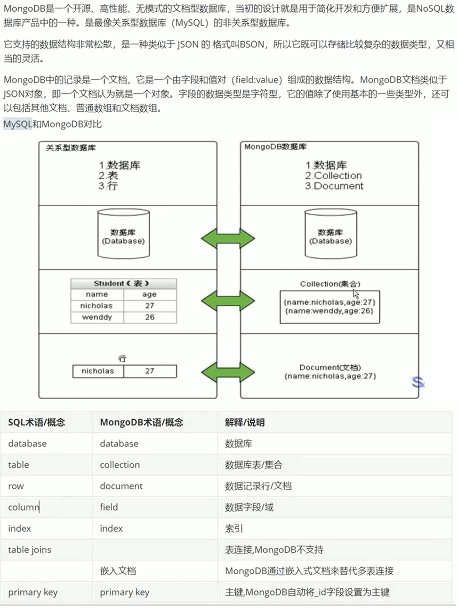

#### 3、数据模型

#### 4、MongoDB 特点

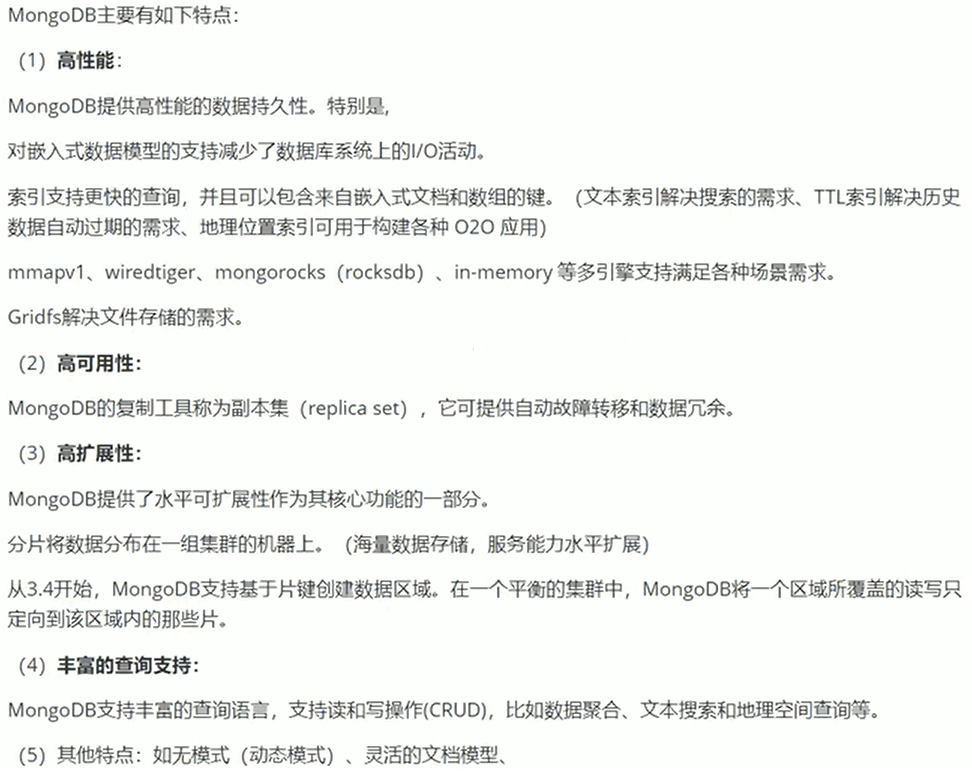

### 二、单机部署

#### 1、Windows 安装

#### 2、shell 连接

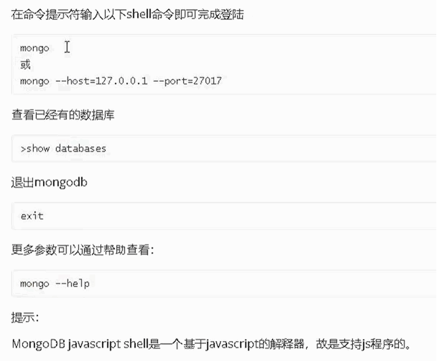

#### 3、Compass 图形化界面客户端

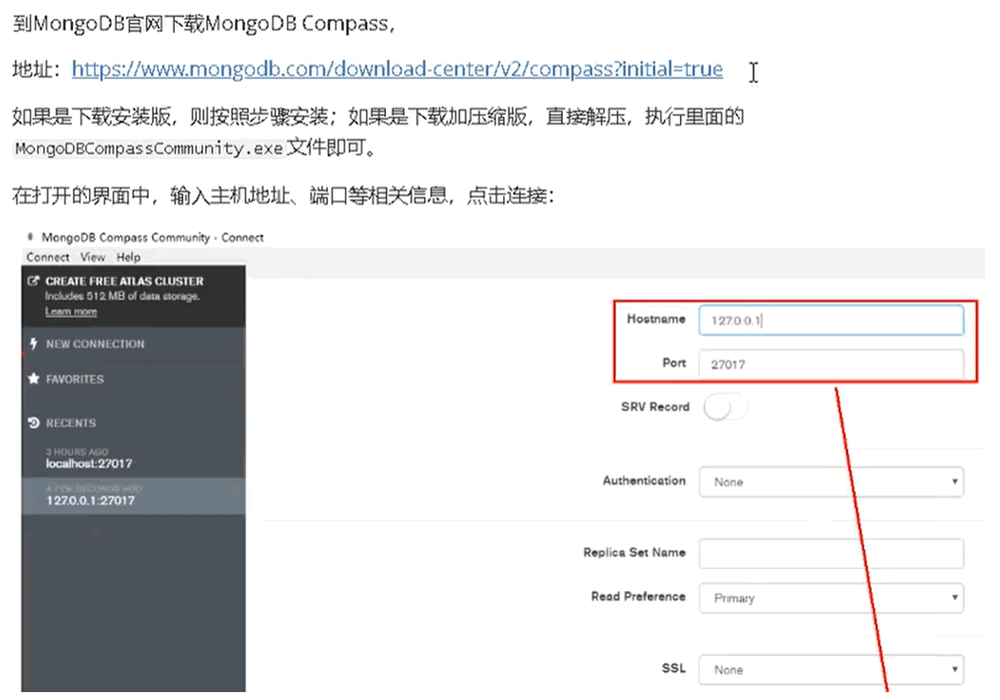

#### 4、Linux环境安装

### 三、常用命令

#### 1、案例需求

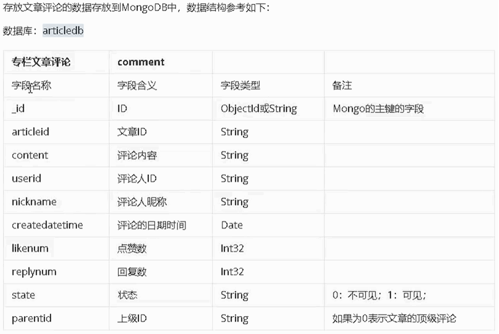

#### 2、选择和创建数据库

#### 3、删除数据库

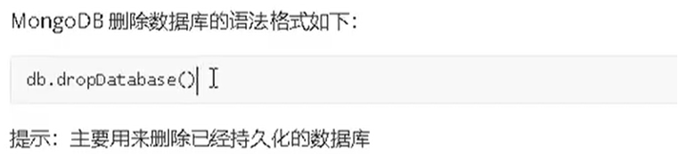

#### 4、操作 Collection

#### 5、文档CRUD操作

##### （1）插入文档

##### （2）文档查询

##### （3）文档更新

##### （4）删除文档

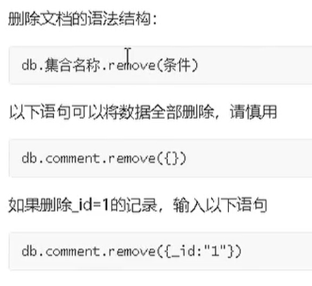

#### 6、更多查询

##### （1）counts 统计查询

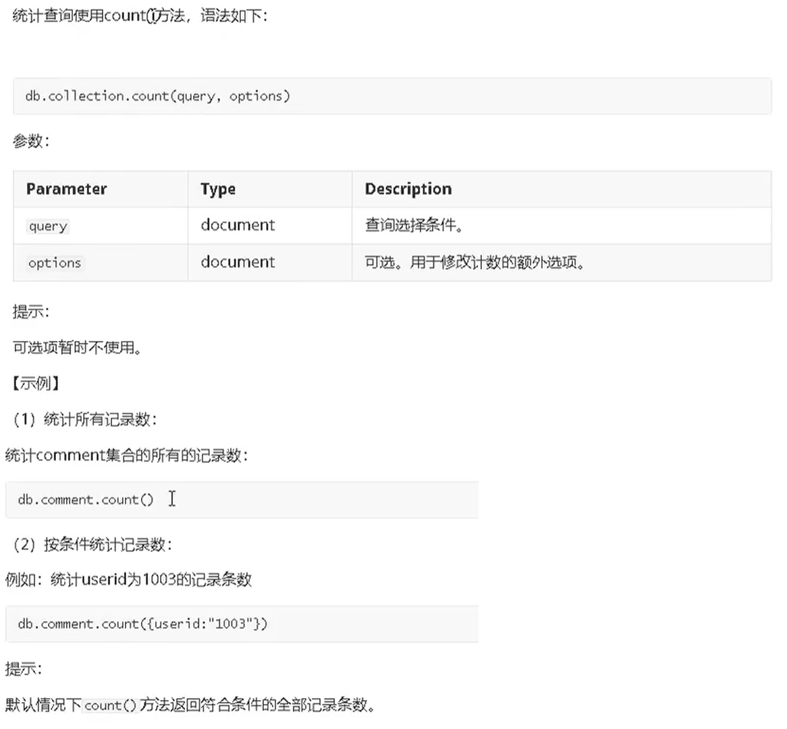

##### （2）limit 分页查询

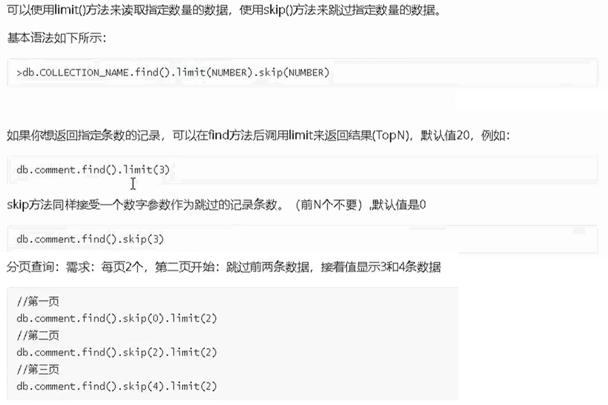

##### （3）排序查询

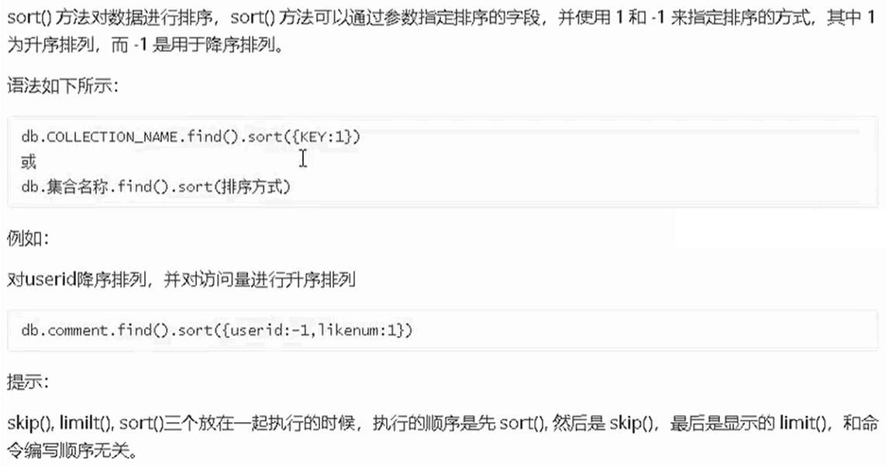

##### （4）正则查询

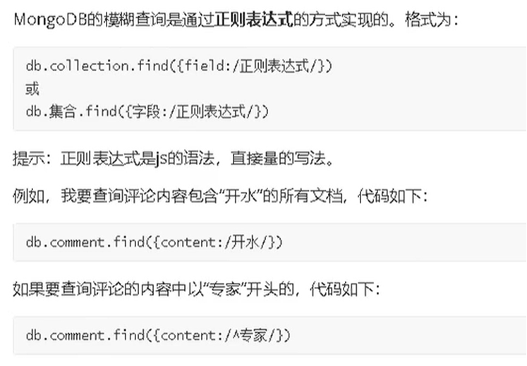

##### （5）比较查询

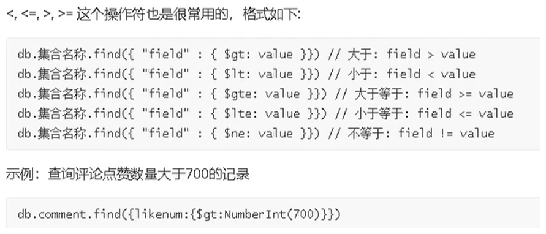

##### （6）包含查询

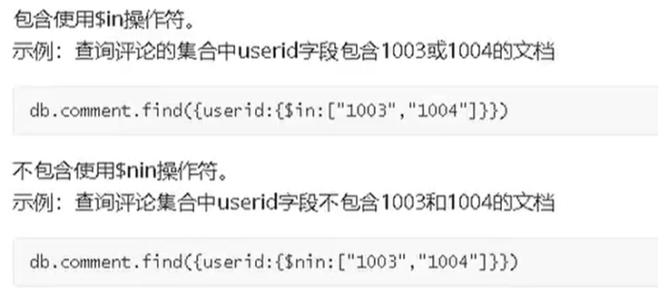

##### （7）条件连接查询

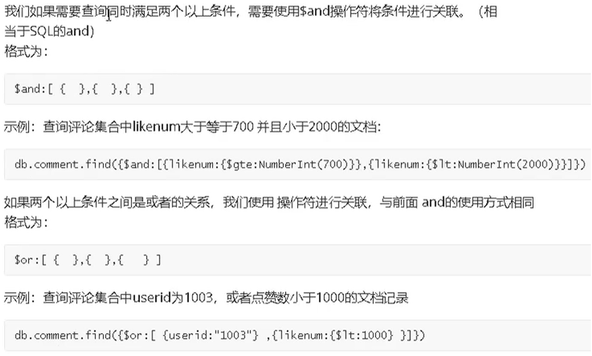

#### 7、查询总结

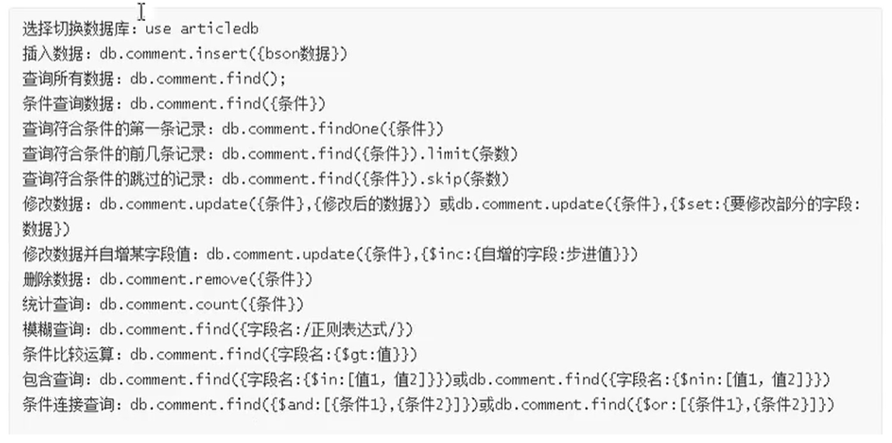

### 四、索引

#### 1、介绍

#### 2、查看索引

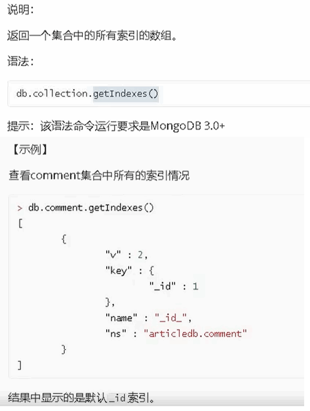

#### 3、创建索引

#### 4、移除索引

#### 5、explain 

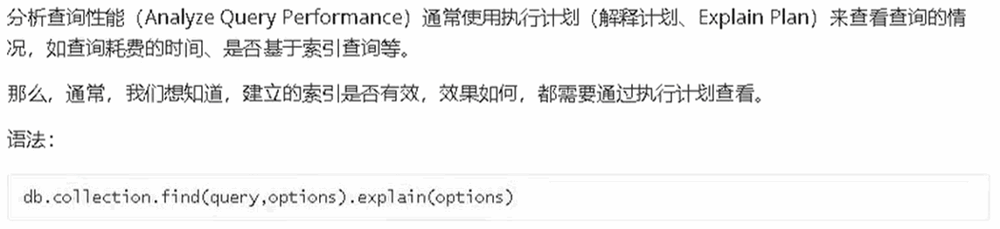

#### 6、涵盖查询

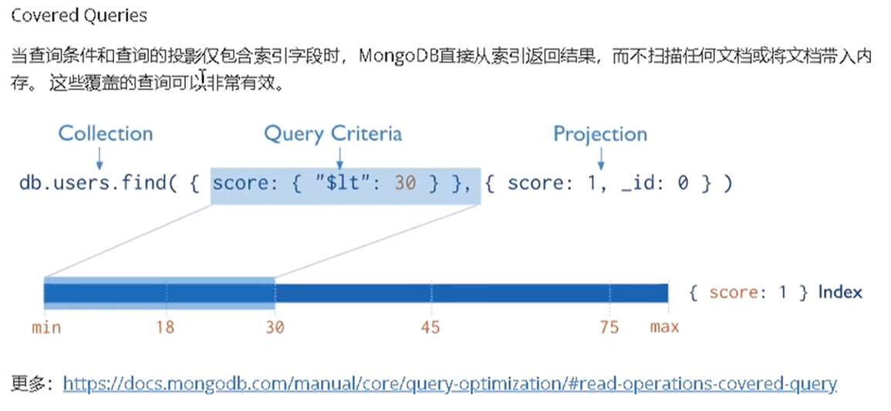