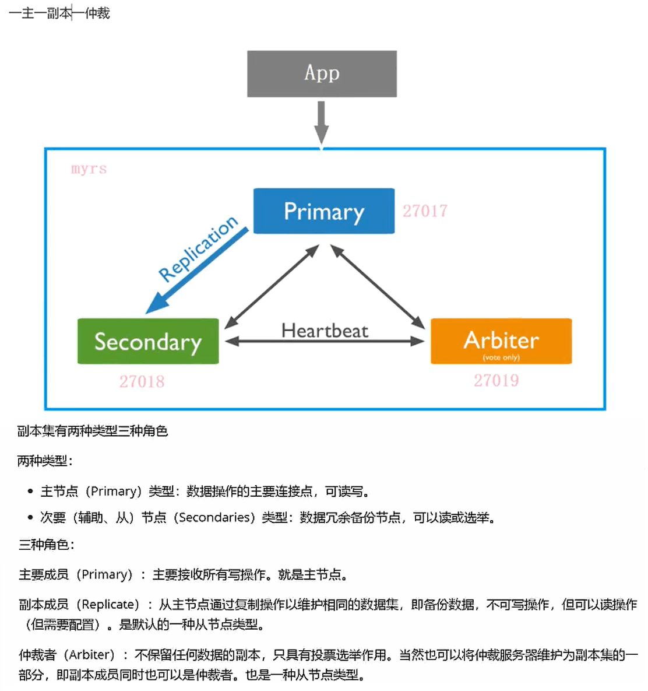
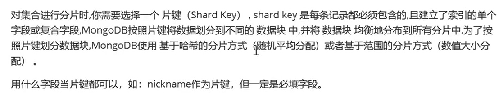
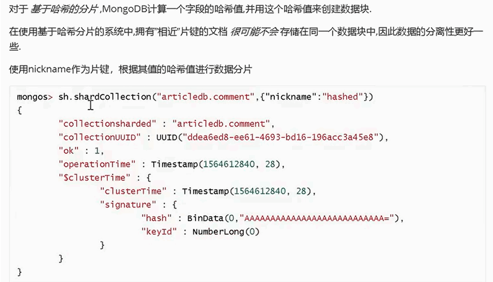
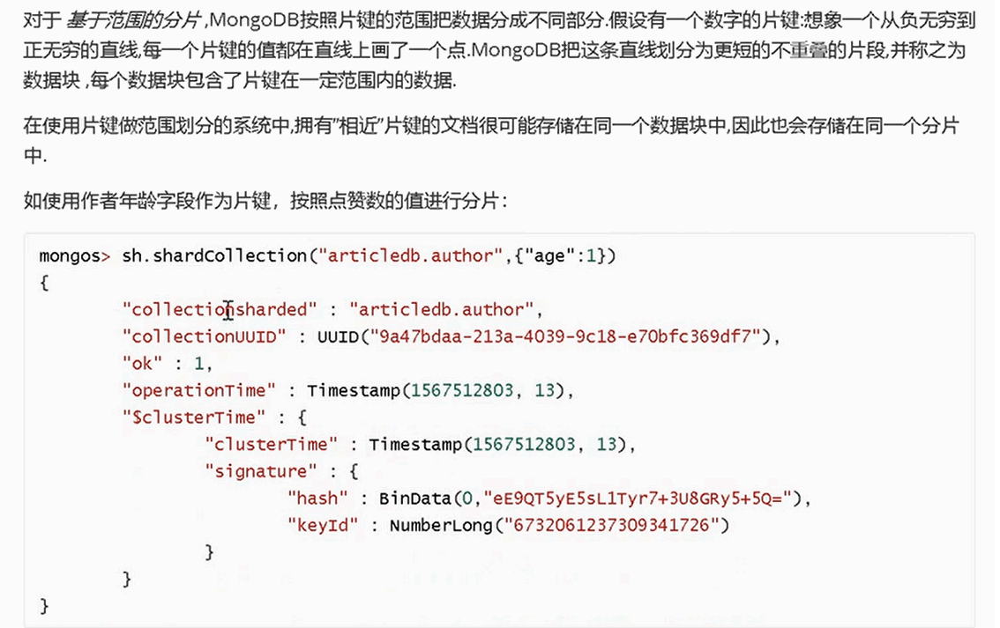

<!-- START doctoc generated TOC please keep comment here to allow auto update -->
<!-- DON'T EDIT THIS SECTION, INSTEAD RE-RUN doctoc TO UPDATE -->

- [MongoDB 高级](#mongodb-%E9%AB%98%E7%BA%A7)
  - [一、副本集](#%E4%B8%80%E5%89%AF%E6%9C%AC%E9%9B%86)
    - [1、介绍](#1%E4%BB%8B%E7%BB%8D)
    - [2、副本集架构](#2%E5%89%AF%E6%9C%AC%E9%9B%86%E6%9E%B6%E6%9E%84)
    - [3、构建副本集](#3%E6%9E%84%E5%BB%BA%E5%89%AF%E6%9C%AC%E9%9B%86)
    - [4、副本集的读写操作](#4%E5%89%AF%E6%9C%AC%E9%9B%86%E7%9A%84%E8%AF%BB%E5%86%99%E6%93%8D%E4%BD%9C)
    - [5、主节点的选取规则](#5%E4%B8%BB%E8%8A%82%E7%82%B9%E7%9A%84%E9%80%89%E5%8F%96%E8%A7%84%E5%88%99)
    - [6、故障测试](#6%E6%95%85%E9%9A%9C%E6%B5%8B%E8%AF%95)
  - [二、分片](#%E4%BA%8C%E5%88%86%E7%89%87)
    - [1、分片原理](#1%E5%88%86%E7%89%87%E5%8E%9F%E7%90%86)
    - [2、分片规则](#2%E5%88%86%E7%89%87%E8%A7%84%E5%88%99)
      - [（1）哈希规则](#1%E5%93%88%E5%B8%8C%E8%A7%84%E5%88%99)
      - [（2）范围规则](#2%E8%8C%83%E5%9B%B4%E8%A7%84%E5%88%99)
      - [（3）测试](#3%E6%B5%8B%E8%AF%95)
  - [三、安全认证](#%E4%B8%89%E5%AE%89%E5%85%A8%E8%AE%A4%E8%AF%81)

<!-- END doctoc generated TOC please keep comment here to allow auto update -->

## MongoDB 高级

### 一、副本集

#### 1、介绍

#### 2、副本集架构

#### 3、构建副本集

#### 4、副本集的读写操作

#### 5、主节点的选取规则

#### 6、故障测试

### 二、分片

#### 1、分片原理

#### 2、分片规则

##### （1）哈希规则

##### （2）范围规则

##### （3）测试

### 三、安全认证

