<!-- START doctoc generated TOC please keep comment here to allow auto update -->
<!-- DON'T EDIT THIS SECTION, INSTEAD RE-RUN doctoc TO UPDATE -->


- [二、数据库](#%E4%BA%8C%E6%95%B0%E6%8D%AE%E5%BA%93)
  - [1、服务器中的数据库](#1%E6%9C%8D%E5%8A%A1%E5%99%A8%E4%B8%AD%E7%9A%84%E6%95%B0%E6%8D%AE%E5%BA%93)
  - [2、数据库键空间](#2%E6%95%B0%E6%8D%AE%E5%BA%93%E9%94%AE%E7%A9%BA%E9%97%B4)
    - [（1）添加键](#1%E6%B7%BB%E5%8A%A0%E9%94%AE)
    - [（2）删除键](#2%E5%88%A0%E9%99%A4%E9%94%AE)
    - [（3）更新键](#3%E6%9B%B4%E6%96%B0%E9%94%AE)
    - [（4）获取键值](#4%E8%8E%B7%E5%8F%96%E9%94%AE%E5%80%BC)
  - [3、键的生存或过期时间](#3%E9%94%AE%E7%9A%84%E7%94%9F%E5%AD%98%E6%88%96%E8%BF%87%E6%9C%9F%E6%97%B6%E9%97%B4)
    - [（1）键的过期时间保存](#1%E9%94%AE%E7%9A%84%E8%BF%87%E6%9C%9F%E6%97%B6%E9%97%B4%E4%BF%9D%E5%AD%98)
    - [（2）移除一个过期键](#2%E7%A7%BB%E9%99%A4%E4%B8%80%E4%B8%AA%E8%BF%87%E6%9C%9F%E9%94%AE)
  - [4、过期键删除策略](#4%E8%BF%87%E6%9C%9F%E9%94%AE%E5%88%A0%E9%99%A4%E7%AD%96%E7%95%A5)
  - [5、总结](#5%E6%80%BB%E7%BB%93)
- [三、持久化](#%E4%B8%89%E6%8C%81%E4%B9%85%E5%8C%96)
  - [1、RDB 持久化](#1rdb-%E6%8C%81%E4%B9%85%E5%8C%96)
  - [2、AOF持久化](#2aof%E6%8C%81%E4%B9%85%E5%8C%96)

<!-- END doctoc generated TOC please keep comment here to allow auto update -->

### 二、数据库

#### 1、服务器中的数据库

Redis 服务器将所有数据库都保存在服务器状态 redis.h/redisServer 结构的 db数组中，db数组的每个项都是一个redis.h/redisDb结构，每个 redisDb结构代表一个数据库：
```c
struct redisServer{
    //...
    //一个数组，保存着服务器中的所有数据库
    redisDb db;
    //...
};
```
在初始化服务器时，程序会根据服务器状态的 dbnum属性来决定应该创建多少个数据库：
```c
struct redisServer {
    //...
    //服务器的数据库数量
    int dbnum;
    //...
}
```
dbnum属性的值由服务器配置的 database 选项决定，默认情况下，该选项的值为16。所以Redis服务器默认会创建16个数据库，如下图所示：

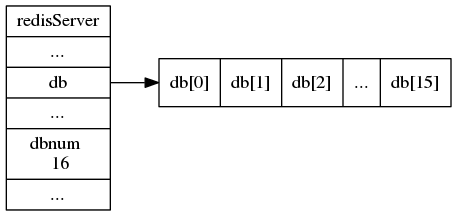

每个Redis客户端都有自己的目标数据库，每当客户端执行数据库写命令或者数据库读命令的时候，目标数据库就会成为这些命令的操作对象。默认情况下，Redis客户端的目标数据库为0号数据库，但客户端可以通过执行SELECT命令来切换目标数据库：

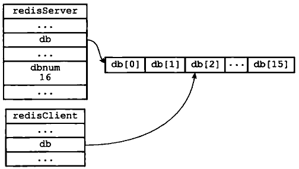

#### 2、数据库键空间

Redis是一个键值对（key-value pair）数据库服务器，服务器中的每个数据库都由一个 redis.h/redisDb结构表示，其中，redisDb结构的dict字典保存了数据库中的所有键值对，我们将这个字典称为键空间（key space）：
```c
typedef struct redisDb {
    //...
    //数据库键空间，保存着数据库中的所有健值对
    dict dict;
    //...
}redisDb;
```
键空间和用户所见的数据库是直接对应的:

* 键空间的键也就是数据库的键，每个键都是一个字符串对象。
* 键空间的值也就是数据库的值，每个值可以是字符串对象、列表对象、哈希表对象、集合对象和有序集合对象中的任意一种 Redis 对象。

例如：

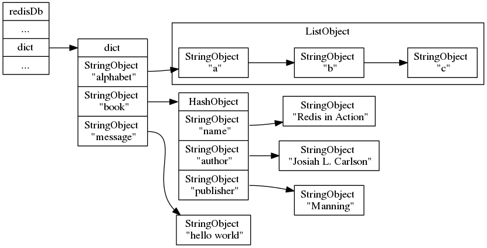

其中：
* alphabet是一个列表键，键的名字是一个包含字符串"alphabet"的字符串对象，键的值则是一个包含三个元素的列表对象。
* book是一个哈希表键，键的名字是一个包含字符串"book"的字符串对象，键的值则是一个包含三个键值对的哈希表对象。
* message是一个字符串键，键的名字是一个包含字符串"message"的字符串对象键的值则是一个包含字符串"hello world"的字符串对象。

##### （1）添加键

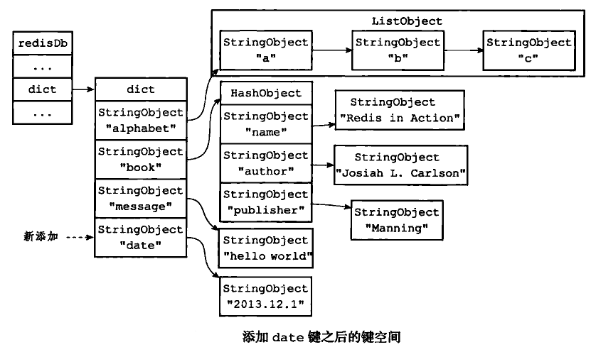

##### （2）删除键

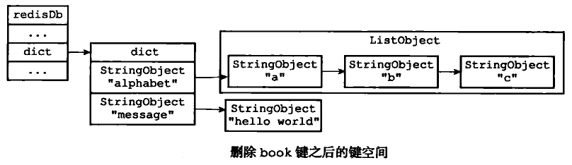

##### （3）更新键

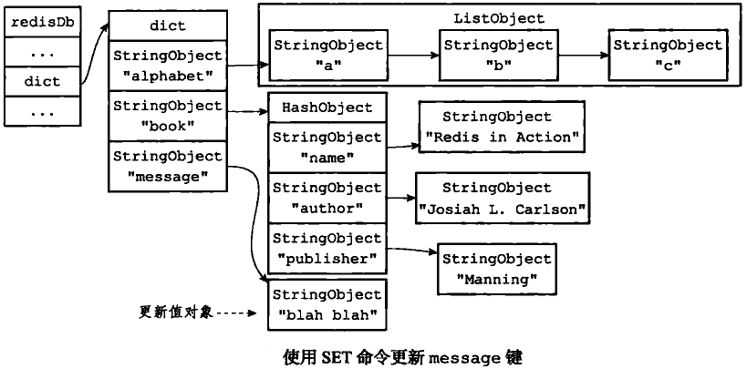

##### （4）获取键值

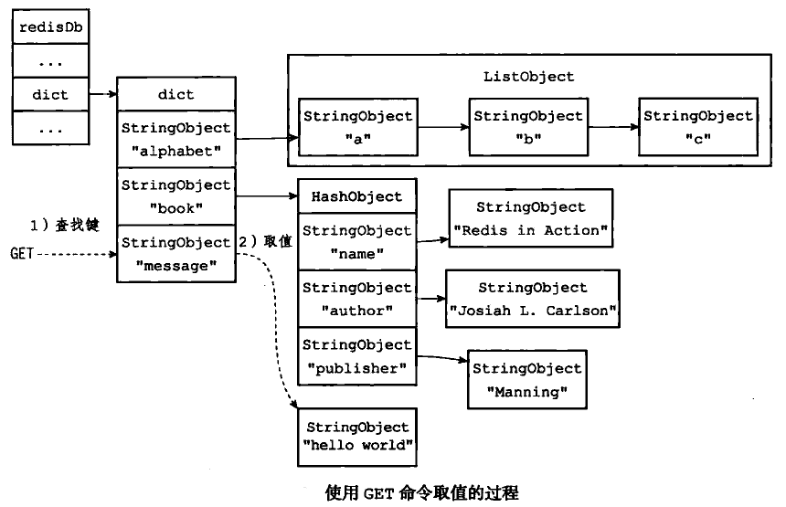

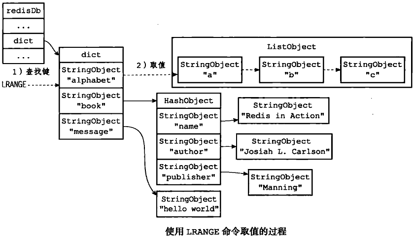

#### 3、键的生存或过期时间

Redis 有四个不同的命令可以用于设置键的生存时间（键可以存在多久）或过期时间（键什么时候会被删除）：
* EXPIRE<key><l命令用于将键key的生存时间设置为tt1秒。
* PEXPIRE<key><t1>命令用于将键 key 的生存时间设置为tt1毫秒。
* EXPIREAT<key><timestamp>命令用于将键 key的过期时间设置为timestamp所指定的秒数时间戳。
* PEXPIREAT <key><timestamp>命令用于将键 key的过期时间设置为timestamp所指定的毫秒数时间戳。

虽然有多种不同单位和不同形式的设置命令，但实际上EXPIRE、PEXPIRE、EXPIREAT三个命令都是使用 PEXPIREAT命令来实现的：无论客户端执行的是以上四个命令中的哪一个，经过转换之后，最终的执行效果都和执行PEXPIREAT命令一样：

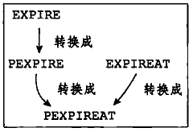

##### （1）键的过期时间保存

redisDb 结构的 expires 字典保存了数据库中所有键的过期时间，我们称这个字典为过期字典：

* 过期字典的键是一个指针，这个指针指向键空间中的某个键对象（也即是某个数据库键）。
* 过期字典的值是一个long long类型的整数，这个整数保存了键所指向的数据库键的过期时间--个毫秒精度的UNIX时间戳：
```c
typedef struct redisDb {
    //...
    //过期字典，保存着键的过期时间
    dict *expires;
    //...
} redisDb;
```
下图展示了一个带有过期字典的数据库例子，在这个例子中，键空间保存了数据库中的所有键值对，而过期字典则保存了数据库键的过期时间。

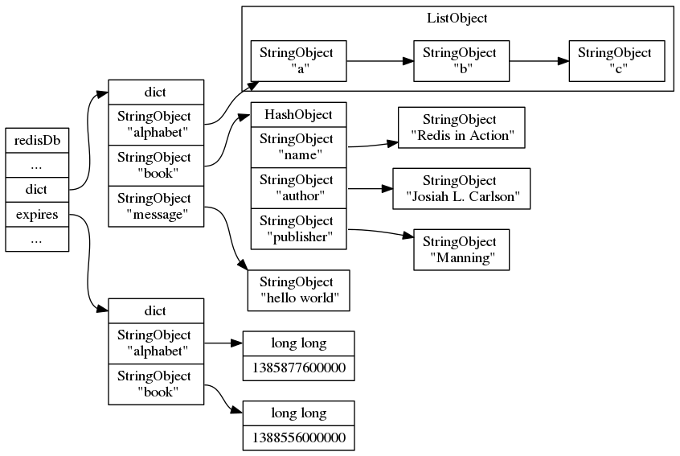

为了展示方便，上图的键空间和过期字典中重复出现了两次alphabet 键对象和book 键对象。在实际中，键空间的键和过期字典的键都指向同一个键对象，所以不会出现任何重复对象，也不会浪费任何空间。

上图中的过期字典保存了两个键值对：
* 第一个键值对的键为 alphabet键对象，值为1385877600000，这表示数据库自alphabet 的过期时间为1385877600000（2013年12月1日零时）。
* 第二个键值对的键为book键对象，值为1388556000000，这表示数据库键 book的过期时间为1388556000000(2014年1月1日零时）。

##### （2）移除一个过期键

PERSIST命令就是 PEXPIREAT命令的反操作：PERSIST命令在过期字典中查找给定的键，并解除键和值（过期时间）在过期字典中的关联。移除book键后：

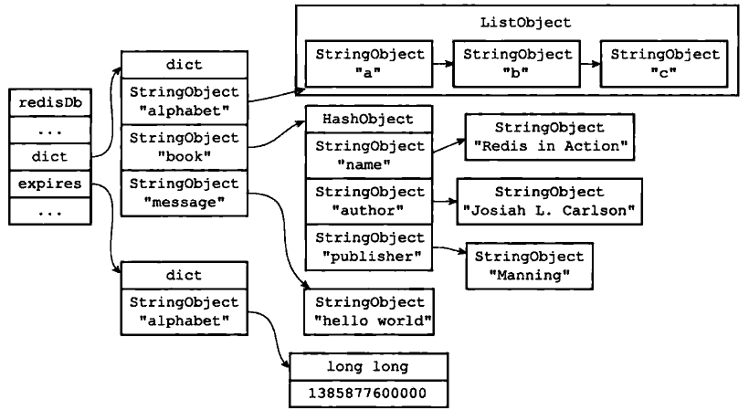

通过过期字典，程序可以用以下步骤检查一个给定键是否过期：

1）检查给定键是否存在于过期字典:如果存在，那么取得键的过期时间。

2）检查当前 UNIX 时间戳是否大于键的过期时间:如果是的话，那么键已经过期;否
则的话，键未过期。

#### 4、过期键删除策略

该部分内容较多，详见书籍的相关章节。

#### 5、总结

* Redis 服务器的所有数据库都保存在 redisServer.db数组中，而数据库的数量则由 redisServer.dbnum属性保存。
* 客户端通过修改目标数据库指针，让它指向 redisServer.db数组中的不同元素来切换不同的数据库。
* 数据库主要由 dict和 expires 两个字典构成，其中dict 字典负责保存键值对，而 expires 字典则负责保存键的过期时间。
* 因为数据库由字典构成，所以对数据库的操作都是建立在字典操作之上的。
* 数据库的键总是一个字符串对象，而值则可以是任意一种 Redis 对象类型，包括字符串对象、哈希表对象、集合对象、列表对象和有序集合对象，分别对应字符串键、哈希表键、集合键、列表键和有序集合键。
* expires 字典的键指向数据库中的某个键，而值则记录了数据库键的过期时间，过期时间是一个以毫秒为单位的 UN工x 时间戳。
* Redis使用惰性删除和定期删除两种策略来删除过期的键:惰性删除策略只在碰到过期键时才进行删除操作，定期删除策略则每隔一段时间主动查找并删除过期键。
* 执行SAVE命令或者BGSAPE命令所产生的新 RDB文件不会包含已经过期的键。
* 执行BGREWRITEAOF命令所产生的重写AOF 文件不会包含已经过期的键。
* 当一个过期键被删除之后，服务器会追加一条DEL命令到现有 AOF 文件的末尾，显式地删除过期键。
* 当主服务器删除一个过期键之后，它会向所有从服务器发送一条DEL命令，显式地删除过期键。
* 从服务器即使发现过期键也不会自作主张地删除它，而是等待主节点发来DEL命令，这种统一、中心化的过期键删除策略可以保证主从服务器数据的一致性。
* 当Redis 命令对数据库进行修改之后，服务器会根据配置向客户端发送数据库通知。

### 三、持久化

#### 1、RDB 持久化

Redis 是一个键值对数据库服务器，服务器中通常包含着任意个非空数据库，而每个非空数据库中又可以包含任意个键值对，为了方便起见，我们将服务器中的非空数据库以及它们的键值对统称为数据库状态。
举个例子，下图展示了一个包含三个非空数据库的 Redis 服务器，这三个数据库以及数据库中的键值对就是该服务器的数据库状态：

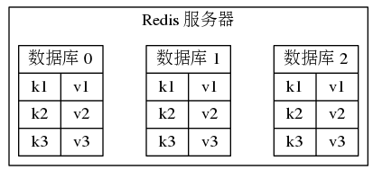

因为Redis是内存数据库，它将自己的数据库状态储存在内存里面，所以如果不想办法将储存在内存中的数据库状态保存到磁盘里面，那么一旦服务器进程退出，服务器中的数据库状态也会消失不见。

为了解决这个问题，Redis提供了RDB持久化功能，这个功能可以将Redis 在内存中的数据库状态保存到磁盘里面，避免数据意外丢失。RDB持久化既可以手动执行，也可以根据服务器配置选项定期执行，该功能可以将某个时间点上的数据库状态保存到一个RDB 文件中。RDB持久化功能所生成的RDB 文件是一个经过压缩的二进制文件，通过该文件可以还原生成RDB文件时的数据库状态：

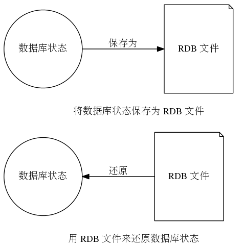

如果开启了AOF持久化，那么将不会载入RDB文件：

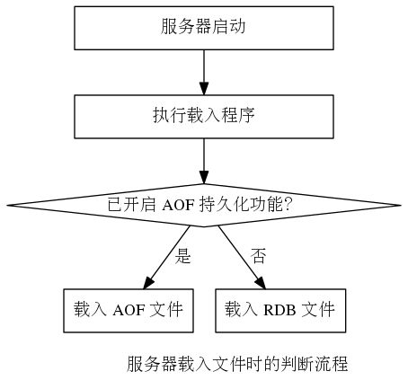

SAVE命令由服务器进程执行保存工作，BGSAVE命令则由子进程执行保存工作，所以SAVE命令会阻塞服务器，而BGSAPE命令则不会。因为 BGSAVE命令可以在不阻塞服务器进程的情况下执行，所以Redis 允许用户通过设置服务器配置的save 选项，让服务器每隔一段时间自动执行一次BGSAVE命令。

用户可以通过save选项设置多个保存条件，但只要其中任意一个条件被满足，服务器就会执行BGSAPE命令。举个例子，如果我们向服务器提供以下配置：

    save 900 1
    save 300 10
    save 60 10000

那么只要满足以下三个条件中的任意一个，BGSAVE命令就会被执行：

* 服务器在900秒之内，对数据库进行了至少1次修改。
* 服务器在300秒之内，对数据库进行了至少10次修改。
* 服务器在60秒之内，对数据库进行了至少10000次修改。

总结：

* RDB 文件用于保存和还原Redis服务器所有数据库中的所有键值对数据。
* SAVE命令由服务器进程直接执行保存操作，所以该命令会阻塞服务器。
* BGSAVE令由子进程执行保存操作，所以该命令不会阻塞服务器。
* 服务器状态中会保存所有用 save选项设置的保存条件，当任意一个保存条件被足时，服务器会自动执行BGSAVE 命令。
* RDB 文件是一个经过压缩的二进制文件，由多个部分组成。
* 对于不同类型的键值对，RDB文件会使用不同的方式来保存它们。

#### 2、AOF持久化

除了RDB持久化功能之外，Redis 还提供了AOF（Append Only File）持久化功能。与RDB 持久化通过保存数据库中的键值对来记录数据库状态不同，AOF持久化是通过保存Redis 服务器所执行的写命令来记录数据库状态的：

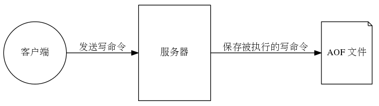

RDB持久化保存数据库状态的方法是将msg、fruits、numbers这些键的键值对保存到RDB文件中，而AOF持久化保存数据库状态的方法则是将服务器执行的SET、SADD、RPUSH三个命令保存到AOF 文件中。

被写人AOF 文件的所有命令都是以Redis的命令请求协议格式保存的，因为Redis 的命令请求协议是纯文本格式，所以我们可以直接打开一个AOF 文件，观察里面的内容。例如，对于之前执行的三个写命令来说，服务器将产生包含以下内容的 AOF 文件：

    *2\r\ns6\r\nSELECT\r\ns1\r\nO\r\n
    *3\r\n$3\r\nSET\r\ns3\r\nmsg\r\ns5\r\nhello\r\n
    *5\r\ns4\r\nSADD\r\n$6\r\nfruits\r\ns5\r\napple\r\ns6\r\nbanana\r\n$6\e\ncherry\r\n
    *5\r\ns5\r\nRPOSH\r\ns7\r\nnumbers\r\ns3\r\n128\r\n$3\r\n256\r\ns3\r\n512\r\n

服务器载入AOF文件流程如下：

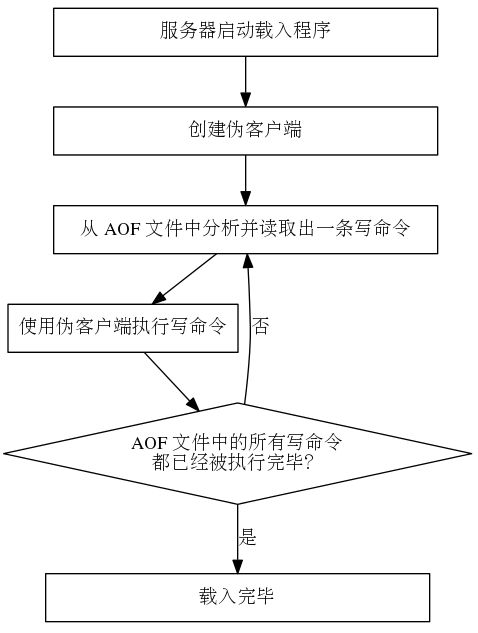

总结：

* AOF 文件通过保存所有修改数据库的写命令请求来记录服务器的数据库状态。
* AOF 文件中的所有命令都以Redis 命令请求协议的格式保存。
* 命令请求会先保存到 AOF 缓冲区里面，之后再定期写入并同步到AOF文件。
* appendfsync 选项的不同值对AOF持久化功能的安全性以及Redis服务器的性能有很大的影响。
* 服务器只要载人并重新执行保存在AOF 文件中的命令，就可以还原数据库本来的状态。
* AOF重写可以产生一个新的 AOF文件，这个新的AOF文件和原有的AOF文件所保存的数据库状态一样，但体积更小。
* AOF重写是一个有歧义的名字，该功能是通过读取数据库中的键值对来实现的，程序无须对现有AOF文件进行任何读人、分析或者写人操作。
* 在执行BGREWRITEAOF命令时，Redis 服务器会维护一个AOF重写缓冲区，该缓冲区会在子进程创建新 AOF 文件期间，记录服务器执行的所有写命令。当子进程完成创建新 AOF 文件的工作之后，服务器会将重写缓冲区中的所有内容追加到新AOF文件的末尾，使得新旧两个AOF文件所保存的数据库状态一致。最后，服务器用新的AOF 文件替换旧的AOF 文件，以此来完成AOF文件重写操作。

