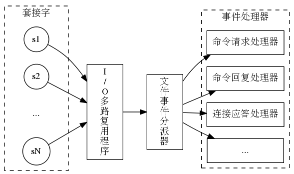
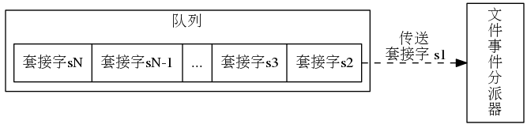
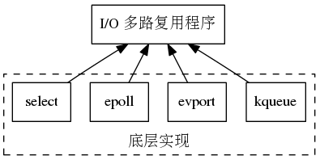
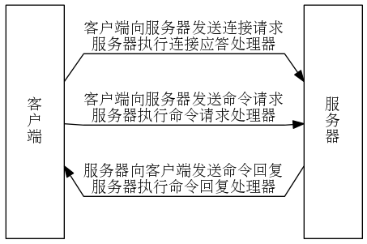
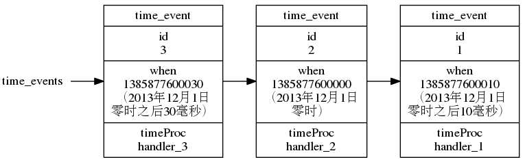
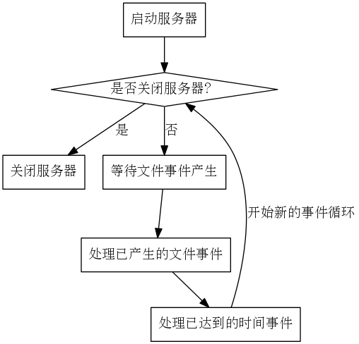

<!-- START doctoc generated TOC please keep comment here to allow auto update -->
<!-- DON'T EDIT THIS SECTION, INSTEAD RE-RUN doctoc TO UPDATE -->

- [四、事件](#%E5%9B%9B%E4%BA%8B%E4%BB%B6)
  - [1、文件事件](#1%E6%96%87%E4%BB%B6%E4%BA%8B%E4%BB%B6)
  - [2、时间事件](#2%E6%97%B6%E9%97%B4%E4%BA%8B%E4%BB%B6)
  - [3、事件的调度与执行](#3%E4%BA%8B%E4%BB%B6%E7%9A%84%E8%B0%83%E5%BA%A6%E4%B8%8E%E6%89%A7%E8%A1%8C)
  - [4、总结](#4%E6%80%BB%E7%BB%93)
- [五、客户端和服务器](#%E4%BA%94%E5%AE%A2%E6%88%B7%E7%AB%AF%E5%92%8C%E6%9C%8D%E5%8A%A1%E5%99%A8)

<!-- END doctoc generated TOC please keep comment here to allow auto update -->

### 四、事件

Redis服务器是一个事件驱动程序，服务器需要处理以下两类事件：

* 文件事件（file event）：Redis服务器通过套接字与客户端（或者其他Redis 服务器）进行连接，而文件事件就是服务器对套接字操作的抽象。服务器与客户端（或者其他服务器）的通信会产生相应的文件事件，而服务器则通过监听并处理这些事件来完成一系列网络通信操作。
* 时间事件（time event）：Redis 服务器中的一些操作（比如 serverCron函数）需要在给定的时间点执行，而时间事件就是服务器对这类定时操作的抽象。

#### 1、文件事件

Redis 基于 Reactor模式开发了自己的网络事件处理器:这个处理器被称为文件事件处理器(file event handler):
* 文件事件处理器使用 I/O多路复用（multiplexing）程序来同时监听多个套接字，并根据套接字目前执行的任务来为套接字关联不同的事件处理器。
* 当被监听的套接字准备好执行连接应答（accept）、读取（read)、写人（write)、关闭（close）等操作时，与操作相对应的文件事件就会产生，这时文件事件处理器就会调用套接字之前关联好的事件处理器来处理这些事件。

虽然文件事件处理器以单线程方式运行，但通过使用I/O多路复用程序来监听多个套接字，文件事件处理器既实现了高性能的网络通信模型，又可以很好地与Redis 服务器中其他同样以单线程方式运行的模块进行对接，这保持了Redis 内部单线程设计的简单性。

尽管多个文件事件可能会并发地出现，但I/O多路复用程序总是会将所有产生事件的套接字都放到一个队列里面，然后通过这个队列，以有序（sequentially）、同步（synchronously）、每次一个套接字的方式向文件事件分派器传送套接字。当上一个套接字产生的事件被处理完毕之后（该套接字为事件所关联的事件处理器执行完毕），I/O多路复用程序才会继续向文件事件分派器传送下一个套接字：

Redis的I/O多路复用程序的所有功能都是通过包装常见的select、epoll、evport和 kqueue 这些I/O多路复用函数库来实现的，Redis 为每个I/O多路复用函数库都实现了相同的API，所以I/O多路复用程序的底层实现是可以互换的：

Redis 的文件处理器有“连接应答处理器”、“命令请求处理器”和“命令回复处理器”，一次完整的客户端与服务器连接示例如下：

#### 2、时间事件

Redis 的时间事件分为以下两类：
* 定时事件：让一段程序在指定的时间之后执行一次。比如说，让程序X在当前田的30毫秒之后执行一次。
* 周期性事件：让一段程序每隔指定时间就执行一次。比如说，让程序Y每隔30毫秒就执行一次。

一个时间事件主要由以下三个属性组成：
* id：服务器为时间事件创建的全局唯一ID（标识号）。ID号按从小到大的顺序递增，新事件的ID号比旧事件的ID号要大。
* when：毫秒精度的UNIX时间截，记录了时间事件的到达（arrive）时间。
* timeProc：时间事件处理器，一个函数。当时间事件到达时，服务器就会调月应的处理器来处理事件。

一个时间事件是定时事件还是周期性事件取决于时间事件处理器的返回值：
* 如果事件处理器返回 ae.h/AE_NOMORE，那么这个事件为定时事件：该事件在达到一次之后就会被删除，之后不再到达。
* 如果事件处理器返回一个非AE_NOMORE的整数值，那么这个事件为周期性时间：当一个时间事件到达之后，服务器会根据事件处理器返回的值，对时间事件的when属性进行更新，让这个事件在一段时间之后再次到达，并以这种方式一直更新并运行下去。比如说，如果一个时间事件的处理器返回整数值30，那么服务器应该对这个时间事件进行更新，让这个事件在30毫秒之后再次到达。

服务器将所有时间事件都放在一个无序链表中，每当时间事件执行器运行时，它就遍历整个链表，查找所有已到达的时间事件，并调用相应的事件处理器。

下面展示了一个保存时间事件的链表的例子，链表中包含了三个不同的时间事件。因为新的时间事件总是插入到链表的表头，所以三个时间事件分别按ID逆序排序，表头事件的ID为3，中间事件的ID为2，表尾事件的ID为1：

需要注意的是，我们说保存时间事件的链表为无序链表，指的不是链表不按ID排序，而是说该链表不按 when 属性的大小排序。正因为链表没有按 when属性进行排序，所以当时间事件执行器运行的时候，它必须遍历链表中的所有时间事件，这样才能确保服务器中所有已到达的时间事件都会被处理。

持续运行的 Redis服务器需要定期对自身的资源和状态进行检查和调整，从而确保服务器可以长期、稳定地运行，这些定期操作由 redis.c/serverCron 函数负责执行，它的主要工作包括：
* 更新服务器的各类统计信息，比如时间、内存占用、数据库占用情况等。
* 清理数据库中的过期键值对。
* 关闭和清理连接失效的客户端。
* 尝试进行AOF或 RDB持久化操作。
* 如果服务器是主服务器，那么对从服务器进行定期同步。
* 如果处于集群模式，对集群进行定期同步和连接测试。

#### 3、事件的调度与执行

因为服务器中同时存在文件事件和时间事件两种事件类型，所以服务器必须对这两种事件进行调度，决定何时应该处理文件事件，何时又应该处理时间事件，以及花多少时间来处理它们等等。

从事件处理的角度来看，Redis 服务器的运行流程可以用如下流程图来概括：

以下是事件的调度和执行规则：

1）aeApiPoll函数的最大阻塞时间由到达时间最接近当前时间的时间事件决定，这个方法既可以避免服务器对时间事件进行频繁的轮询（忙等待)，也可以确保 aeApiPoll函数不会阻塞过长时间。

2）因为文件事件是随机出现的，如果等待并处理完一次文件事件之后，仍未有任何时间事件到达，那么服务器将再次等待并处理文件事件。随着文件事件的不断执行，时间会逐渐向时间事件所设置的到达时间逼近，并最终来到到达时间，这时服务器就可以开始处理到达的时间事件了。

3）对文件事件和时间事件的处理都是同步、有序、原子地执行的，服务器不会中途中断事件处理，也不会对事件进行抢占，因此，不管是文件事件的处理器，还是时间事件的处理器，它们都会尽可地减少程序的阻塞时间，并在有需要时主动让出执行权，从而降低造成事件饥饿的可能性。比如说，在命令回复处理器将一个命令回复写入到客户端套接字时，如果写入字节数超过了一个预设常量的话，命令回复处理器就会主动用break跳出写入循环，将余下的数据留到下次再写;另外，时间事件也会将非常耗时的持久化操作放到子线程或者子进程执行。

4）因为时间事件在文件事件之后执行，并且事件之间不会出现抢占，所以时间事件的实际处理时间，通常会比时间事件设定的到达时间稍晚一些。

#### 4、总结

* Redis服务器是一个事件驱动程序，服务器处理的事件分为时间事件和文件事件两类。
* 文件事件处理器是基于 Reactor模式实现的网络通信程序。
* 文件事件是对套接字操作的抽象:每次套接字变为可应答(acceptable）、（writable）或者可读（readable）时，相应的文件事件就会产生。
* 文件事件分为AEREADABLE事件（读事件）和AE_WRITABLE事件（写事件）两类。
* 时间事件分为定时事件和周期性事件:定时事件只在指定的时间到达一次，而周期性事件则每隔一段时间到达一次。
* 服务器在一般情况下只执行 serverCron函数一个时间事件，并且这个事件是周期性事件。
* 文件事件和时间事件之间是合作关系，服务器会轮流处理这两种事件，并且处理事件的过程中也不会进行抢占。
* 时间事件的实际处理时间通常会比设定的到达时间晚一些。

### 五、客户端和服务器

详见《Redis 设计与实现 第二版》相关章节。

* 服务器状态结构使用 clients 链表连接起多个客户端状态， 新添加的客户端状态会被放到链表的末尾。
* 客户端状态的 flags 属性使用不同标志来表示客户端的角色， 以及客户端当前所处的状态。
* 输入缓冲区记录了客户端发送的命令请求， 这个缓冲区的大小不能超过 1 GB 。
* 命令的参数和参数个数会被记录在客户端状态的 argv 和 argc 属性里面， 而 cmd 属性则记录了客户端要执行命令的实现函数。
* 客户端有固定大小缓冲区和可变大小缓冲区两种缓冲区可用， 其中固定大小缓冲区的最大大小为 16 KB ， 而可变大小缓冲区的最大大小不能超过服务器设置的硬性限制值。
* 输出缓冲区限制值有两种， 如果输出缓冲区的大小超过了服务器设置的硬性限制， 那么客户端会被立即关闭； 除此之外， 如果客户端在一定时间内， 一直超过服务器设置的软性限制， 那么客户端也会被关闭。
* 当一个客户端通过网络连接连上服务器时， 服务器会为这个客户端创建相应的客户端状态。 网络连接关闭、 发送了不合协议格式的命令请求、 成为 CLIENT_KILL 命令的目标、 空转时间超时、 输出缓冲区的大小超出限制， 以上这些原因都会造成客户端被关闭。
* 处理 Lua 脚本的伪客户端在服务器初始化时创建， 这个客户端会一直存在， 直到服务器关闭。
* 载入 AOF 文件时使用的伪客户端在载入工作开始时动态创建， 载入工作完毕之后关闭。

* 一个命令请求从发送到完成主要包括以下步骤： 1. 客户端将命令请求发送给服务器； 2. 服务器读取命令请求，并分析出命令参数； 3. 命令执行器根据参数查找命令的实现函数，然后执行实现函数并得出命令回复； 4. 服务器将命令回复返回给客户端。
* serverCron 函数默认每隔 100 毫秒执行一次， 它的工作主要包括更新服务器状态信息， 处理服务器接收的 SIGTERM 信号， 管理客户端资源和数据库状态， 检查并执行持久化操作， 等等。
* 服务器从启动到能够处理客户端的命令请求需要执行以下步骤： 1. 初始化服务器状态； 2. 载入服务器配置； 3. 初始化服务器数据结构； 4. 还原数据库状态； 5. 执行事件循环。