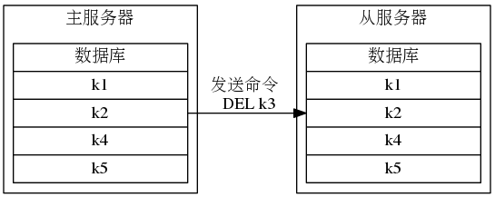

<!-- START doctoc generated TOC please keep comment here to allow auto update -->
<!-- DON'T EDIT THIS SECTION, INSTEAD RE-RUN doctoc TO UPDATE -->

- [六、复制](#%E5%85%AD%E5%A4%8D%E5%88%B6)
  - [1、旧版复制功能](#1%E6%97%A7%E7%89%88%E5%A4%8D%E5%88%B6%E5%8A%9F%E8%83%BD)
  - [2、新版复制功能](#2%E6%96%B0%E7%89%88%E5%A4%8D%E5%88%B6%E5%8A%9F%E8%83%BD)
  - [3、总结](#3%E6%80%BB%E7%BB%93)
- [七、Sentinel 哨兵](#%E4%B8%83sentinel-%E5%93%A8%E5%85%B5)
- [八、集群](#%E5%85%AB%E9%9B%86%E7%BE%A4)

<!-- END doctoc generated TOC please keep comment here to allow auto update -->

### 六、复制

在Redis中,用户可以通过执行SLAVEOF命令或者设置slaveof 选项,让一个服务器去复制（replicate）另一个服务器,我们称呼被复制的服务器为主服务器（master）,而对主服务器进行复制的服务器则被称为从服务器（slave）：

#### 1、旧版复制功能

Redis 的复制功能分为同步（sync）和命令传播（command propagate）两个操作：
* 同步操作用于将从服务器的数据库状态更新至主服务器当前所处的数据库状态。
* 命令传播操作则用于在主服务器的数据库状态被修改,导致主从服务器的数据库状
态出现不一致时,让主从服务器的数据库重新回到一致状态。

当客户端向从服务器发送 SLAPEOF命令,要求从服务器复制主服务器时,从服务器首先需要执行同步操作,也即是,将从服务器的数据库状态更新至主服务器当前所处的数据库状态。

从服务器对主服务器的同步操作需要通过向主服务器发送SYNC命令来完成,以下是SYNC命令的执行步骤：

1）从服务器向主服务器发送 SYWNC命令。

2）收到SYNC命令的主服务器执行BGSAVE命令,在后台生成一个RDB文件,并使用一个缓冲区记录从现在开始执行的所有写命令。

3）当主服务器的BGSAVE命令执行完毕时,主服务器会将BGSAVE命令生成的RDB文件发送给从服务器,从服务器接收并载人这个RDB 文件,将自己的数据库状态更新至主服务器执行BGSAVE命令时的数据库状态。

4）主服务器将记录在缓冲区里面的所有写命令发送给从服务器,从服务器执行这些写命令,将自己的数据库状态更新至主服务器数据库当前所处的状态。

下面是SYNC 命令执行期间， 主从服务器的通信过程：

在同步操作执行完毕之后,主从服务器两者的数据库将达到一致状态,但这种一致并不是一成不变的,每当主服务器执行客户端发送的写命令时,主服务器的数据库就有可能会被修改,并导致主从服务器状态不再一致举个例子,假设一个主服务器和一个从服务器刚刚完成同步操作,它们的数据库都保存了相同的五个键k1至k5：

如果这时，客户端向主服务器发送命令DEL k3 ，那么主服务器在执行完这个DEL 命令之后，主从服务器的数据库将出现不一致： 主服务器的数据库已经不再包含键 k3 ， 但这个键却仍然包含在从服务器的数据库里面：

在上面的例子中，主服务器因为执行了命令DEL k3 而导致主从服务器不一致，所以主服务器将向从服务器发送相同的命令 DEL k3：当从服务器执行完这个命令之后，主从服务器将再次回到一致状态——现在主从服务器两者的数据库都不再包含键 k3 了：

在Redis 中,从服务器对主服务器的复制可以分为以下两种情况：

* 初次复制：从服务器以前没有复制过任何主服务器,或者从服务器当前要复制的主
服务器和上一次复制的主服务器不同。
* 断线后重复制：处于命令传播阶段的主从服务器因为网络原因而中断了复制,但从
服务器通过自动重连接重新连上了主服务器,并继续复制主服务器。

对于初次复制来说,旧版复制功能能够很好地完成任务,但对于断线后重复制来说,旧版复制功能虽然也能让主从服务器重新回到一致状态,但效率却非常低，因为服务器要重新发送RDB文件给从服务器，哪怕只有几个命令没有同步。

SYNC命令是一个非常耗费资源的操作，每次执行SYNC命令,主从服务器需要执行以下动作：

1）主服务器需要执行 BGSAVE命令来生成RDB文件,这个生成操作会耗费主服务
器大量的 CPU、内存和磁盘I/O资源。

2）主服务器需要将自己生成的RDB文件发送给从服务器,这个发送操作会耗费主从服务器大量的网络资源（带宽和流量),并对主服务器响应命令请求的时间产生影响。

3）接收到RDB文件的从服务器需要载入主服务器发来的RDB文件,并且在载入间,从服务器会因为阻塞而没办法处理命令请求。

因为SYWC命令是一个如此耗费资源的操作,所以Redis有必要保证在真正有必要时才执行SYNC命令。

#### 2、新版复制功能

为了解决旧版复制功能在处理断线重复制情况时的低效问题,Redis 从2.8 版本开始,使用PSYNC命令代替SYNC命令来执行复制时的同步操作。

PSYNC命令具有完整重同步(full rsynchronization）和部分重同步（partial resynchronization）两种模式。

* 其中完整重同步用于处理初次复制情况：完整重同步的执行步骤和SYNC命令的执行步骤基本一样,它们都是通过让主服务器创建并发送 RDB 文件,以及向从服务器发送保存在缓冲区里面的写命令来进行同步。
* 而部分重同步则用于处理断线后重复制情况:当从服务器在断线后重新连接主服务器时,如果条件允许,主服务器可以将主从服务器连接断开期间执行的写命令发送给从服务器,从服务器只要接收并执行这些写命令,就可以将数据库更新至主服务器当前所处的状态。

PSYNC命令的部分重同步模式解决了旧版复制功能在处理断线后重复制时出现的低效情况,下面展示了如何使用PSYNC命令高效地处理上一节展示的断线后复制情况：

部分重同步功能由以下三个部分构成：
* 主服务器的复制偏移量（replication offset）和从服务器的复制偏移量
* 主服务器的复制积压缓冲区（replication backlog）
* 服务器的运行ID（run ID)

执行复制的双方——主服务器和从服务器会分别维护一个复制偏移量：
* 主服务器每次向从服务器传播N个字节的数据时,就将自己的复制偏移量的值加上 N
* 从服务器每次收到主服务器传播来的 N

下面是Redis 使用复制积压缓冲区来为断线的从服务器发送缺失数据的过程：

积压缓冲区：

Redis 为复制积压缓冲区设置的默认大小为1 MB，当然，这个值也是可以设置的。

下面是PSYNC 命令判断是执行部分重同步还是完整重同步的流程：

当然，在复制和同步的过程中还有主从服务器之间的连接握手、认证和心跳连接等操作。在发送数据过程中可能会有命令由于网络故障等原因出现主服务器给从服务器发送的命令在半路丢失情况，假设现在主从服务器处于一致状态：

如果这时主服务器执行了命令 SET key value（协议格式的长度为 33 字节），将自己的复制偏移量更新到了233 ，并尝试向从服务器传播命令SET key value ，但这条命令却因为网络故障而在传播的途中丢失，那么主从服务器之间的复制偏移量就会出现不一致：主服务器的复制偏移量会被更新为 233 ，而从服务器的复制偏移量仍然为 200：

在这之后，当从服务器向主服务器发送 REPLCONF ACK命令的时候，主服务器会察觉从服务器的复制偏移量依然为 200 ，而自己的复制偏移量为233 ， 这说明复制积压缓冲区里面复制偏移量为 201 至 233 的数据（也即是命令 SET key value ）在传播过程中丢失了，于是主服务器会再次向从服务器传播命令 SET key value ，从服务器通过接收并执行这个命令可以将自己更新至主服务器当前所处的状态：

#### 3、总结

* Redis 2.8 以前的复制功能不能高效地处理断线后重复制情况，但 Redis 2.8 新添加的部分重同步功能可以解决这个问题。
* 部分重同步通过复制偏移量、复制积压缓冲区、服务器运行 ID 三个部分来实现。
* 在复制操作刚开始的时候，从服务器会成为主服务器的客户端，并通过向主服务器发送命令请求来执行复制步骤，而在复制操作的后期，主从服务器会互相成为对方的客户端。
* 主服务器通过向从服务器传播命令来更新从服务器的状态，保持主从服务器一致，而从服务器则通过向主服务器发送命令来进行心跳检测，以及命令丢失检测。

### 七、Sentinel 哨兵

具体内容参考书籍《Redis 设计与实现第二版》。

* Sentinel 只是一个运行在特殊模式下的 Redis 服务器， 它使用了和普通模式不同的命令表， 所以 Sentinel 模式能够使用的命令和普通 Redis 服务器能够使用的命令不同。
* Sentinel 会读入用户指定的配置文件， 为每个要被监视的主服务器创建相应的实例结构， 并创建连向主服务器的命令连接和订阅连接， 其中命令连接用于向主服务器发送命令请求， 而订阅连接则用于接收指定频道的消息。
* Sentinel 通过向主服务器发送 INFO 命令来获得主服务器属下所有从服务器的地址信息， 并为这些从服务器创建相应的实例结构， 以及连向这些从服务器的命令连接和订阅连接。
* 在一般情况下， Sentinel 以每十秒一次的频率向被监视的主服务器和从服务器发送 INFO 命令， 当主服务器处于下线状态， 或者 Sentinel 正在对主服务器进行故障转移操作时， Sentinel 向从服务器发送 INFO 命令的频率会改为每秒一次。
* 对于监视同一个主服务器和从服务器的多个 Sentinel 来说， 它们会以每两秒一次的频率， 通过向被监视服务器的 __sentinel__:hello 频道发送消息来向其他 Sentinel 宣告自己的存在。
* 每个 Sentinel 也会从 __sentinel__:hello 频道中接收其他 Sentinel 发来的信息， 并根据这些信息为其他 Sentinel 创建相应的实例结构， 以及命令连接。
* Sentinel 只会与主服务器和从服务器创建命令连接和订阅连接， Sentinel 与 Sentinel 之间则只创建命令连接。
* Sentinel 以每秒一次的频率向实例（包括主服务器、从服务器、其他 Sentinel）发送 PING 命令， 并根据实例对 PING 命令的回复来判断实例是否在线： 当一个实例在指定的时长中连续向 Sentinel 发送无效回复时， * Sentinel 会将这个实例判断为主观下线。
当 Sentinel 将一个主服务器判断为主观下线时， 它会向同样监视这个主服务器的其他 Sentinel 进行询问， 看它们是否同意这个主服务器已经进入主观下线状态。
* 当 Sentinel 收集到足够多的主观下线投票之后， 它会将主服务器判断为客观下线， 并发起一次针对主服务器的故障转移操作。

### 八、集群

具体内容参考书籍《Redis 设计与实现第二版》。

* 节点通过握手来将其他节点添加到自己所处的集群当中。
* 集群中的 16384 个槽可以分别指派给集群中的各个节点， 每个节点都会记录哪些槽指派给了自己， 而哪些槽又被指派给了其他节点。
* 节点在接到一个命令请求时， 会先检查这个命令请求要处理的键所在的槽是否由自己负责， 如果不是的话， 节点将向客户端返回一个 MOVED 错误， MOVED 错误携带的信息可以指引客户端转向至正在负责相关槽的节点。
* 对 Redis 集群的重新分片工作是由客户端执行的， 重新分片的关键是将属于某个槽的所有键值对从一个节点转移至另一个节点。
如果节点 A 正在迁移槽 i 至节点 B ， 那么当节点 A 没能在自己的数据库中找到命令指定的数据库键时， 节点 A 会向客户端返回一个 ASK 错误， 指引客户端到节点 B 继续查找指定的数据库键。
* MOVED 错误表示槽的负责权已经从一个节点转移到了另一个节点， 而 ASK 错误只是两个节点在迁移槽的过程中使用的一种临时措施。
* 集群里的从节点用于复制主节点， 并在主节点下线时， 代替主节点继续处理命令请求。
* 集群中的节点通过发送和接收消息来进行通讯， 常见的消息包括 MEET 、 PING 、 PONG 、 PUBLISH 、 FAIL 五种。