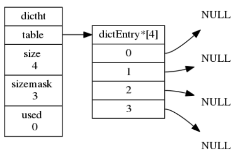

<!-- START doctoc generated TOC please keep comment here to allow auto update -->
<!-- DON'T EDIT THIS SECTION, INSTEAD RE-RUN doctoc TO UPDATE -->


- [Redis 设计与实现](#redis-%E8%AE%BE%E8%AE%A1%E4%B8%8E%E5%AE%9E%E7%8E%B0)
  - [一、基础数据结构](#%E4%B8%80%E5%9F%BA%E7%A1%80%E6%95%B0%E6%8D%AE%E7%BB%93%E6%9E%84)
    - [1、简单动态字符串](#1%E7%AE%80%E5%8D%95%E5%8A%A8%E6%80%81%E5%AD%97%E7%AC%A6%E4%B8%B2)
    - [2、链表](#2%E9%93%BE%E8%A1%A8)
    - [3、字典](#3%E5%AD%97%E5%85%B8)
      - [（1）哈希](#1%E5%93%88%E5%B8%8C)
      - [（2）字典](#2%E5%AD%97%E5%85%B8)
      - [（3）解决键冲突](#3%E8%A7%A3%E5%86%B3%E9%94%AE%E5%86%B2%E7%AA%81)
      - [（4）rehash](#4rehash)
      - [（5）渐进式rehash](#5%E6%B8%90%E8%BF%9B%E5%BC%8Frehash)
    - [4、跳跃表](#4%E8%B7%B3%E8%B7%83%E8%A1%A8)
    - [5、整数集合](#5%E6%95%B4%E6%95%B0%E9%9B%86%E5%90%88)
      - [升级](#%E5%8D%87%E7%BA%A7)
    - [6、压缩列表](#6%E5%8E%8B%E7%BC%A9%E5%88%97%E8%A1%A8)
  - [二、对象](#%E4%BA%8C%E5%AF%B9%E8%B1%A1)
    - [1、对象的编码和类型](#1%E5%AF%B9%E8%B1%A1%E7%9A%84%E7%BC%96%E7%A0%81%E5%92%8C%E7%B1%BB%E5%9E%8B)
      - [（1）类型](#1%E7%B1%BB%E5%9E%8B)
      - [（2）编码和底层实现](#2%E7%BC%96%E7%A0%81%E5%92%8C%E5%BA%95%E5%B1%82%E5%AE%9E%E7%8E%B0)
    - [2、字符串对象](#2%E5%AD%97%E7%AC%A6%E4%B8%B2%E5%AF%B9%E8%B1%A1)
    - [3、列表对象](#3%E5%88%97%E8%A1%A8%E5%AF%B9%E8%B1%A1)
    - [4、哈希对象](#4%E5%93%88%E5%B8%8C%E5%AF%B9%E8%B1%A1)
    - [5、集合对象](#5%E9%9B%86%E5%90%88%E5%AF%B9%E8%B1%A1)
    - [6、有序集合对象](#6%E6%9C%89%E5%BA%8F%E9%9B%86%E5%90%88%E5%AF%B9%E8%B1%A1)
    - [7、类型检查与命令多态](#7%E7%B1%BB%E5%9E%8B%E6%A3%80%E6%9F%A5%E4%B8%8E%E5%91%BD%E4%BB%A4%E5%A4%9A%E6%80%81)
    - [8、内存回收和对象共享](#8%E5%86%85%E5%AD%98%E5%9B%9E%E6%94%B6%E5%92%8C%E5%AF%B9%E8%B1%A1%E5%85%B1%E4%BA%AB)
    - [9、总结](#9%E6%80%BB%E7%BB%93)

<!-- END doctoc generated TOC please keep comment here to allow auto update -->

## Redis 设计与实现
本文深度参考《Redis 设计与实现 第二版》，章节具体相关内容请参考该书。
### 一、基础数据结构

Redis 中自定了“简单动态字符串”、“链表（双向）”、“字典”、“跳跃表”、“整数集合”和“压缩列表”这几种数据结构。

#### 1、简单动态字符串

Redis 中使用动态字符串SDS来保存字符串，该结构定义如下：
```c
/*
 * 保存字符串对象的结构
 */
struct sdshdr {
    
    // buf 中已占用空间的长度
    int len;

    // buf 中剩余可用空间的长度
    int free;

    // 数据空间
    char buf[];
};
```
下面是一个没有任何未使用空间的 SDS 示例：


下面是带有五字节使用空间的 SDS 示例：


C字符串和SDS区别如下：


总结：

* Redis只会使用C字符串作为字面量，在大多数情况下，Redis使用SDS(Simple Dynamic String，简单动态字符串）作为字符串表示。
* 比起C字符串，SDS具有以下优点:
    * 1）常数复杂度获取字符串长度。
    * 2）杜绝缓冲区溢出。
    * 3）减少修改字符串长度时所需的内存重分配次数。
    * 4）二进制安全。
    * 5)   兼容部分C字符串函数。

#### 2、链表

Redis 使用listNode保存一个链表节点，该节点定义如下：
```c
/*
 * 双端链表节点
 */
typedef struct listNode {

    // 前置节点
    struct listNode *prev;

    // 后置节点
    struct listNode *next;

    // 节点的值
    void *value;

} listNode;
```
由多个链表节点 listNode 组成的链表示意图如下：


链表定义如下：
```c
/*
 * 双端链表结构
 */
typedef struct list {

    // 表头节点
    listNode *head;

    // 表尾节点
    listNode *tail;

    // 节点值复制函数
    void *(*dup)(void *ptr);

    // 节点值释放函数
    void (*free)(void *ptr);

    // 节点值对比函数
    int (*match)(void *ptr， void *key);

    // 链表所包含的节点数量
    unsigned long len;

} list;
```
由 list 结构和 listNode 节点组成的链表示意图如下：


Redis 的链表实现的特性可以总结如下:

* 双端:链表节点带有 prev 和 next 指针，获取某个节点的前置节点和后置节点的复杂度都是O(1)。
* 无环:表头节点的 prev 指针和表尾节点的 next 指针都指向NULL，对链表的访问以NULL为终点。
* 带表头指针和表尾指针:通过list 结构的 head指针和tai1指针，程序获取链表的表头节点和表尾节点的复杂度为O(1)。
* 带链表长度计数器:程序使用1ist结构的len属性来对1ist持有的链表节点进行计数，程序获取链表中节点数量的复杂度为O(1)。
* 多态:链表节点使用void*指针来保存节点值，并且可以通过1ist 结构的 dup、free、match 三个属性为节点值设置类型特定函数，所以链表可以用于保存各种不同类型的值。

总结：

* 链表被广泛用于实现Redis 的各种功能，比如列表键、发布与订阅、慢查询、监视器等。
* 每个链表节点由一个1istNode 结构来表示，每个节点都有一个指向前置节点和后置节点的指针，所以Redis 的链表实现是双端链表。
* 每个链表使用一个1ist 结构来表示，这个结构带有表头节点指针、表尾节点指针，以及链表长度等信息。
* 因为链表表头节点的前置节点和表尾节点的后置节点都指向NULL，所以Redis的链表实现是无环链表。
* 通过为链表设置不同的类型特定函数，Redis的链表可以用于保存各种不同类型的值。

#### 3、字典

Redis 的字典使用哈希表作为底层实现，一个哈希表里面可以有多个哈希表节点，而每个哈希表节点就保存了字典中的一个键值对。

##### （1）哈希
一个哈希表的数据结构定义如下：
```c
/* This is our hash table structure. Every dictionary has two of this as we
 * implement incremental rehashing， for the old to the new table. */
/*
 * 哈希表
 *
 * 每个字典都使用两个哈希表，从而实现渐进式 rehash 。
 */
typedef struct dictht {
    
    // 哈希表数组
    dictEntry **table;

    // 哈希表大小
    unsigned long size;
    
    // 哈希表大小掩码，用于计算索引值
    // 总是等于 size - 1
    unsigned long sizemask;c

    // 该哈希表已有节点的数量
    unsigned long used;

} dictht;
```
table 属性是一个数组，数组中的每个元素都是一个指向dict.h/dictEntry结构的指针，一个dictEntry定义如下：
```c
/*
 * 哈希表节点
 */
typedef struct dictEntry {
    
    // 键
    void *key;

    // 值
    union {
        void *val;
        uint64_t u64;
        int64_t s64;
    } v;

    // 指向下个哈希表节点，形成链表
    struct dictEntry *next;

} dictEntry;
```
一个空的哈希表示意图如下所示：


Redis 使用“链地址法”来解决哈希碰撞问题(Collision)，下面展示了如何通过使用next指针将两个索引值相同的键k1和k0连接在一起：


##### （2）字典

Redis 中的字典定义如下：
```c
/*
 * 字典
 */
typedef struct dict {

    // 类型特定函数
    dictType *type;

    // 私有数据
    void *privdata;

    // 哈希表
    dictht ht[2];

    // rehash 索引
    // 当 rehash 不在进行时，值为 -1
    int rehashidx; /* rehashing not in progress if rehashidx == -1 */

    // 目前正在运行的安全迭代器的数量
    int iterators; /* number of iterators currently running */

} dict;
```
其中，ht属性是一个包含两个项的数组，数组中的每个项都是一个dictht 哈希表，一般情况下，字典只使用ht[0] 哈希表，ht[1]哈希表只会在对 ht[0]哈希表进行rehash时使用。除了ht[1]之外，另一个和 rehash有关的属性就是 rehashidx，它记录了rehash目前的进度，如果目前没有在进行rehash，那么它的值为-1。

一个普通状态下（没有进行rehash）的字典示意图如下所示：


当字典被用作数据库的底层实现，或者哈希键的底层实现时，Redis 使用MurmurHash2 算法来计算键的哈希值。MurmurHash算法最初由Austin Appleby 于2008年发明，这种算法的优点在于，即使输人的键是有规律的，算法仍能给出一个很好的随机分布性，并且算法的计算速度也非常快。MurmurHash 算法目前的最新版本为MurmurHash3，而Redis 使用的是MurmurHash2。Redis 会通过该算法计算key的哈希值，并以此判断将该元素放到哪个合适的位置：


##### （3）解决键冲突

当有两个或以上数量的键被分配到了哈希表数组的同一个索引上面时，我们称这些键发生了冲突（collision ）。

Redis 的哈希表使用链地址法（separate chaining）来解决键冲突，每个哈希表节点都有一个 next指针，多个哈希表节点可以用 next 指针构成一个单向链表，被分配到同一个索引上的多个节点可以用这个单向链表连接起来，这就解决了键冲突的问题。

举个例子，假设程序要将键值对 k2 和 v2添加到下图所示的哈希表里面：


并且计算得出 k2的索引值为2，那么键k1和k2将产生冲突，而解决冲突的办法就是使用next 指
针将键 k2和k1 所在的节点连接起来，如下图所示：


因为 dictEntry节点组成的链表没有指向链表表尾的指针，所以为了速度考虑，程序总是将新节点添加到链表的表头位置（复杂度为O(1)），排在其他已有节点的前面。

##### （4）rehash

随着操作的不断执行，哈希表保存的键值对会逐渐地增多或者减少，为了让哈希表的负载因子(load factor）维持在一个合理的范围之内，当哈希表保存的键值对数量太多或者太少时，程序需要对哈希表的大小进行相应的扩展和收缩。

扩展和收缩哈希表的工作可以通过执行 rehash（重新散列）操作来完成，Redis 对字典的哈希表执行 rehash的步骤如下:

1）为字典的ht[11 哈希表分配空间，这个哈希表的空间大小取决于要执行的操作，以及ht [0] 当前包含的键值对数量（也即是ht[0].used属性的值）:
* 如果执行的是扩展操作，那么ht[1]的大小为第一个大于等于ht[0].used*2
的2"（2的n次方幂）;
* 如果执行的是收缩操作，那么ht[1]的大小为第一个大于等于ht[0].used的2^n。

2）将保存在ht[0]中的所有键值对 rehash 到ht[1]上面: rehash指的是重新计算键的哈希值和索引值，然后将键值对放置到ht[1]哈希表的指定位置上。

3）当ht[0]包含的所有键值对都迁移到了ht[1]之后（ht[0]变为空表），释放ht[0]，将ht[1]设置为ht[0]，并在ht[1]新创建一个空白哈希表，为下一次 rehash做准备。

举个例子，假设程序要对下图所示字典的 ht[0]进行扩展操作，那么程序将执行以下步骤：


* 1）ht[0].used 当前的值为4，4*2=8而8(2^3)恰好是第一个大于等于4的2的n次方，所以程序会将ht[1]哈希表的大小设置为8。下面展示了ht[1]在分配空间之后字典的样子：


* 2）将ht[0]包含的四个键值对都rehash 到 ht[1]中：


* 3）释放ht[0]，并将ht[1]设置为ht[0]，然后为ht[1]分配一个空白哈希表。至此，对哈希表的扩展操作执行完毕，程序成功将哈希表的大小从原来的4改为了现在的8：


##### （5）渐进式rehash

扩展或收缩哈希表需要将ht[0]里面的所有键值对 rehash 到ht[1]里面，但是，这个rehash 动作并不是一次性、集中式地完成的，而是分多次、渐进式地完成的。

这样做的原因在于，如果 ht[0]里只保存着四个键值对，那么服务器可以在瞬间就将这些键值对全部 rehash 到ht[1];但是，如果哈希表里保存的键值对数量不是四个，而是四百万、四千万甚至四亿个键值对，那么要一次性将这些键值对全部rehash到ht[1]的话，庞大的计算量可能会导致服务器在一段时间内停止服务。

因此，为了避免 rehash 对服务器性能造成影响，服务器不是一次性将ht [0]里面的所有键值对全部 rehash 到 ht[1]，而是分多次、渐进式地将ht[0]里面的键值对慢慢地 rehash 到ht[1]。

以下是哈希表渐进式rehash 的详细步骤:
* 1）为ht[1]分配空间，让字典同时持有ht[0]和ht[1]两个哈希表。
* 2）在字典中维持一个索引计数器变量 rehashidx，并将它的值设置为0，表示 rehash工作正式开始.
* 3）在rehash 进行期间，每次对字典执行添加、删除、查找或者更新操作时，程序除了执行指定的操作以外，还会顺带将ht[0]哈希表在rehashidx索引上的所有键值对rehash 到ht[1]，当rehash工作完成之后，程序将 rehashidx属性的值增一。
* 4）随着字典操作的不断执行，最终在某个时间点上，ht[0]的所有键值对都会被rehash 至ht[1]，这时程序将rehashidx属性的值设为-1，表示 rehash操作已完成。

渐进式 rehash的好处在于它采取分而治之的方式，将rehash键值对所需的计算工作均摊到对字典的每个添加、删除、查找和更新操作上，从而避免了集中式rehash 而带来的庞大计算量。

下面展示了一次完整的渐进式rehash 过程，注意观察在整个 rehash过程中，字典的rehashidx属性是如何变化的：


因为在进行渐进式 rehash 的过程中，字典会同时使用ht[0]和 ht[1]两个哈希表，所以在渐进式rehash 进行期间，**字典的删除（delete）、查找（find)、更新（update）等操作会在两个哈希表上进行**。例如，要在字典里面查找一个键的话，程序会先在ht[0]里面进行查找，如果没找到的话，就会继续到ht[1]里面进行查找，诸如此类。

另外，在渐进式rehash执行期间，**新添加到字典的键值对一律会被保存到ht[1]里面**，而ht[0]则不再进行任何添加操作，这一措施保证了ht[0]包含的键值对数量会只减不增，并随着 rehash操作的执行而最终变成空表。

总结：

* 字典被广泛用于实现 Redis 的各种功能，其中包括数据库和哈希键。
* Redis 中的字典使用哈希表作为底层实现，每个字典带有两个哈希表，一个平时使用，另一个仅在进行 rehash 时使用。
* 当字典被用作数据库的底层实现，或者哈希键的底层实现时，Redis使用MurmurHash2算法来计算键的哈希值。
* 哈希表使用链地址法来解决键冲突，被分配到同一个索引上的多个键值对会连接成一个单向链表。
在对哈希表进行扩展或者收缩操作时，程序需要将现有哈希表包含的所有键值对 rehash 到新哈希表里面，并且这个rehash过程并不是一次性地完成的，而是渐进式地完成的。

#### 4、跳跃表

关于跳跃表的通俗解释，可参考该文 [以后有面试官问你「跳跃表」，你就把这篇文章扔给他 ](./img/skiptable.png)
>http://www.sohu.com/a/293236470_298038

有关跳跃表的详细内容可参考《Redis 设计与实现 第二版》

#### 5、整数集合

Redis使用下面这个结构来表示整数集合：
```c
typedef struct intset {
    
    // 编码方式
    uint32_t encoding;

    // 集合包含的元素数量
    uint32_t length;

    // 保存元素的数组
    int8_t contents[];

} intset;
```
下面是一个整数集合示例，包含五个 int16_t 类型的整数值：


下面是另一个整数集合示例，包含四个 int64_t 类型的整数值：


##### 升级

每当我们要将一个新元素添加到整数集合里面，并且新元素的类型比整数集合现有所有元素的类型都要长时，整数集合需要先进行升级（upgrade），然后才能将新元素添加到整数集合里面。

升级整数集合并添加新元素共分为三步进行:
* 1）根据新元素的类型，扩展整数集合底层数组的空间大小，并为新元素分配空间。
* 2）将底层数组现有的所有元素都转换成与新元素相同的类型，并将类型转换后的元素放置到正确的位上，而且在放置元素的过程中，需要intset继续维持底层数组的有序性质不变。
* 3）将新元素添加到底层数组里面。

举个例子，假设现在有一个INTSETENCINT16编码的整数集合，集合中包含三个int16_t类型的元素：


下面演示向一个包含三个 int16_t 类型的值的整数集合添加一个 int32_t 类型的值时， 整数集合的扩展和转换过程：


整数集合的升级策略有两个好处，一个是提升整数集合的灵活性，另一个是尽可能地节约内存。

* 提升灵活性

  因为C语言是静态类型语言，为了避免类型错误，我们通常不会将两种不同类型的值放在同一个数据结构里面。例如，我们一般只使用int16_t类型的数组来保存int16_t类型的值，只使用int32t类型的数组来保存 int32_t类型的值，诸如此类。但是，因为整数集合可以通过自动升级底层数组来适应新元素，所以我们可以随意地将int16_t、int32_t 或者int64_t类型的整数添加到集合中，而不必担心出现类型错误，这种做法非常灵活。

* 节约内存

  当然，要让一个数组可以同时保存int16_t、int32_t、int64_t三种类型的值，最简单的做法就是直接使用int64t类型的数组作为整数集合的底层实现。不过这样一来，即使添加到整数集合里面的都是int16_t类型或者int32_t类型的值，数组都需要使用int64 t类型的空间去保存它们，从而出现浪费内存的情况。而整数集合现在的做法既可以让集合能同时保存三种不同类型的值，又可以确保升级操作只会在有需要的时候进行，这可以尽量节省内存。

  例如，如果我们一直只向整数集合添加int16_t类型的值，那么整数集合的底层实现就会一直是int16_t类型的数组，只有在我们要将int32_t类型或者int64_t类型的值添加到集合时，程序才会对数组进行升级。

整数集合不支持降级操作，一旦对数组进行了升级，编码就会一直保持升级后的状态，即使我们将集合里唯一一个真正需要使用 int64_t类型来保存的元素4294967295删除了，整数集合的编码仍然会维持INTSETENC_INT64，底层数组也仍然会是int64_t类型的。

重点回顾：

* 整数集合是集合键的底层实现之一。
* 整数集合的底层实现为数组，这个数组以有序、无重复的方式保存集合元素，在需要时，程序会根据新添加元素的类型，改变这个数组的类型。
* 升级操作为整数集合带来了操作上的灵活性，并且尽可能地节约了内存。
* 整数集合只支持升级操作，不支持降级操作。

#### 6、压缩列表

一个压缩列表结构图如下所示：


压缩列表的各个组成部分详细说明如下：


下图展示了一个压缩列表示例:


* 列表zlbytes 属性的值为0x50（十进制 80)，表示压缩列表的总长为80字节。
* 列表 zltail属性的值为0x3c(十进制60），这表示如果我们有一个指向压缩列表起始地址的指针 p，那么只要用指针 p 加上偏移量60，就可以计算出表尾节点entry3的地址。
* 列表 zllen属性的值为0x3(十进制3)，表示压缩列表包含三个节点。

一个压缩列表节点示意图如下所示：


previous_entry_length 指的是该节点的前一个节点的长度，所以可以通过指针和该长度来计算前一个节点的地址。

下面演示使用压缩列表节点的 previous_entry_length 属性遍历整个压缩列表的过程：


下面是一个保存着 "hello world" 字符串的压缩列表节点示例：


重点回顾：

* 压缩列表是一种为节约内存而开发的顺序型数据结构。
* 压缩列表被用作列表键和哈希键的底层实现之一。
* 压缩列表可以包含多个节点，每个节点可以保存一个字节数组或者整数值。
* 添加新节点到压缩列表，或者从压缩列表中删除节点，可能会引发连锁更新操作，但这种操作出现的几率并不高。

### 二、对象

在前面的数个章节里，我们陆续介绍了Redis用到的所有主要数据结构，比如简单动态字符串（SDS)、双端链表、字典、压缩列表、整数集合等等。

Redis并没有直接使用这些数据结构来实现键值对数据库，而是基于这些数据结构创建了一个对象系统，这个系统包含字符串对象、列表对象、哈希对象、集合对象和有序集合对象这五种类型的对象，每种对象都用到了至少一种我们前面所介绍的数据结构。

通过这五种不同类型的对象，Redis 可以在执行命令之前，根据对象的类型来判断一个对象是否可以执行给定的命令。使用对象的另一个好处是，我们可以针对不同的使用场景，为对象设置多种不同的数据结构实现，从而优化对象在不同场景下的使用效率。

除此之外，Redis 的对象系统还实现了基于引用计数技术的内存回收机制，当程序不再使用某个对象的时候，这个对象所占用的内存就会被自动释放;另外，Redis还通过引用计数技术实现了对象共享机制，这一机制可以在适当的条件下，通过让多个数据库键共享同一个对象来节约内存。

最后，Redis 的对象带有访问时间记录信息，该信息可以用于计算数据库键的空转时长，在服务器启用了maxmemory 功能的情况下，空转时长较大的那些键可能会优先被服务器删除本章接下来将逐一介绍以上提到的Redis 对象系统的各个特性。

#### 1、对象的编码和类型

Redis 使用对象来表示数据库中的键和值，每次当我们在Redis 的数据库中新创建一个键值对时，我们至少会创建两个对象，一个对象用作键值对的键（键对象)，另一个对象用
作键值对的值（值对象）。

Redis 中的每个对象都由一个 redisObject 结构表示，该结构中和保存数据有关的三个属性分别是type属性、encoding属性和 ptr属性：
```c
typedef struct redisobject {
    //类型
    unsigned type:4;
    //编码
    unsigned encoding:4;
    //指向底层实现数据结构的指针
    void ptr;
    // ...
} robj;
```

##### （1）类型

对象的type属性记录了对象的类型，这个属性如下表所示：


对于Redis数据库保存的键值对来说，键总是一个字符串对象，而值则可以是字符串对象、列表对象、哈希对象、集合对象或者有序集合对象的其中一种，因此:

* 当我们称呼一个数据库键为"字符串键"时，我们指的是"这个数据库键所对应的值为字符串对象"
* 当我们称呼一个键为"列表键"时，我们指的是"这个数据库键所对应的值为列表对象"

##### （2）编码和底层实现

对象的 ptr指针指向对象的底层实现数据结构，而这些数据结构由对象的encoding属性决定。encoding属性记录了对象所使用的编码，也即是说这个对象使用了什么数据结构作为时象的底层实现，而且每种类型的对象都至少使用了两种不同的编码，具体对应关系可见下表：


#### 2、字符串对象

字符串对象的编码可以是int、raw或者embstr。

如果一个字符串对象保存的是整数值，并且这个整数值可以用long类型来表示，那么字符串对象会将整数值保存在字符串对象结构的 ptr属性里面（将void*转换成long)，并将字符串对象的编码设置为int。

一个int 编码的字符串对象示意如下：


如果字符串对象保存的是一个字符串值，并且这个字符串值的长度大于32字节，那么字符串对象将使用一个简单动态字符串（SDS）来保存这个字符串值，并将对象的编码设置为 raw。

一个raw 编码的字符串对象示意图如下所示：


如果字符串对象保存的是一个字符串值，并且这个字符串值的长度小于等于32字节，那么字符串对象将使用embstr 编码的方式来保存这个字符串值。

embstr 编码是专门用于保存短字符串的一种优化编码方式，这种编码和 raw编码一样，都使用 redisObject结构和sdshdr 结构来表示字符串对象，但 raw编码会调用两次内存分配函数来分别创建 redisObject结构和sdshdr 结构，而 embstr编码则通过调用一次内存分配函数来分配一块连续的空间，空间中依次包含 redisObject 和sdshdr两个结构，如下图所示：


使用 embstr 编码的字符串对象来保存短字符串值有以下好处：

* embstr 编码将创建字符串对象所需的内存分配次数从 raw 编码的两次降低为一次。
* 释放 embstr 编码的字符串对象只需要调用一次内存释放函数，而释放 raw 编码的字符串对象需要调用两次内存释放函数。
* 因为 embstr 编码的字符串对象的所有数据都保存在一块连续的内存里面，所以这种编码的字符串对象比起 raw 编码的字符串对象能够更好地利用缓存带来的优势。

最后需要注意的是，可以用long double类型表示的浮点数在Redis 中也是作为字符串值来保存的。如果我们要保存一个浮点数到字符串对象里面，那么程序会先将这个浮点数转换成字符串值，然后再保存转换所得的字符串值。在有需要的时候，程序会将保存在字符串对象里面的字符串值转换回浮点数值，执行某些操作，然后再将执行操作所得的浮点数值转换回字符串值，并继续保存在字符串对象里面。

#### 3、列表对象

列表对象的编码可以是 ziplist或者linkedlist。

ziplist编码的列表对象使用压缩列表作为底层实现，每个压缩列表节点（entry）保存了一个列表元素。如果 numbers键的值对象使用的是ziplist 编码，这个这个值对象将会如下图案例所示：


linkedlist 编码的列表对象使用双端链表作为底层实现，每个双端链表节点（node）都保存了一个字符串对象，而每个字符串对象都保存了一个列表元素。

举个例子，如果前面所说的numbers键创建的列表对象使用的不是ziplist 编码，而是linkedlist 编码，那么 numbers键的值对象将是下图所示的样子：


每个StringObject内部结构如下：


当列表对象可以同时满足以下两个条件时，列表对象使用ziplist 编码：
* 列表对象保存的所有字符串元素的长度都小于64字节;
* 列表对象保存的元素数量小于512个;不能满足这两个条件的列表对象需要使用
linkedlist编码。

#### 4、哈希对象

哈希对象的编码可以是ziplist或者 hashtable。

ziplist 编码的哈希对象使用压缩列表作为底层实现，每当有新的键值对要加入到哈希对象时，程序会先将保存了键的压缩列表节点推入到压缩列表表尾，然后再将保存了值的压缩列表节点推入到压缩列表表尾，因此：

* 保存了同一键值对的两个节点总是紧挨在一起，保存键的节点在前，保存值的节点在后。
* 先添加到哈希对象中的键值对会被放在压缩列表的表头方向，而后来添加到哈希对象中的键值对会被放在压缩列表的表尾方向。

 例如：


如果前面哈希对象的值对象使用的是ziplist编码，那么这个值对象将会是下图所示的样
子：


当哈希对象可以同时满足以下两个条件时，哈希对象使用ziplist编码：

* 哈希对象保存的所有键值对的键和值的字符串长度都小于64字节
* 哈希对象保存的键值对数量小于512个

不能满足这两个条件的哈希对象需要使用hashtable 编码。

#### 5、集合对象

集合对象的编码可以是intset或者 hashtable。

intset 编码的集合对象使用整数集合作为底层实现，集合对象包含的所有元素都被保存在整数集合里面。

一个intset 编码的集合对象示意图如下：


hashtable 编码的集合对象使用字典作为底层实现，字典的每个键都是一个字符串对象，每个字符串对象包含了一个集合元素，而字典的值则全部被设置为NULL。hashtable 编码的集合对象示意图如下所示：


当集合对象可以同时满足以下两个条件时，对象使用intset 编码：

* 集合对象保存的所有元素都是整数值
* 集合对象保存的元素数量不超过512个

不能满足这两个条件的集合对象需要使用hashtable 编码。

#### 6、有序集合对象

有序集合的编码可以是ziplist或者skiplist

ziplist 编码的压缩列表对象使用压缩列表作为底层实现，每个集合元素使用两个紧挨在一起的压缩列表节点来保存，第一个节点保存元素的成员（member），而第二个元素则保存元素的分值（score ）：


压缩列表内的集合元素按分值从小到大进行排序，分值较小的元素被放置在靠近表头的方向，而分值较大的元素则被放置在靠近表尾的方向。

skiplist编码的有序集合对象使用 zset 结构作为底层实现，一个zset 结构同时包含一个字典和一个跳跃表:
```c
typedef struct zset {
    zskiplist *zsl;
    dict *dict;
}zset;
```
zset结构中的zs1跳跃表按分值从小到大保存了所有集合元素，每个跳跃表节点都保存了一个集合元素；跳跃表节点的object属性保存了元素的成员，而跳跃表节点的score属性则保存了元素的分值。通过这个跳跃表，程序可以对有序集合进行范围型操作，比如ZRANK、ZRANGE等命令就是基于跳跃表API来实现的。

除此之外，zset 结构中的 dict 字典为有序集合创建了一个从成员到分值的映射，字典中的每个键值对都保存了一个集合元素:字典的键保存了元素的成员，而字典的值则保存了元素的分值。通过这个字典，程序可以用O(1)复杂度查找给定成员的分值，ZSCORE命令就是根据这一特性实现的，而很多其他有序集合命令都在实现的内部用到了这一特性。

有序集合每个元素的成员都是一个字符串对象，而每个元素的分值都是一个double类型的浮点数。值得一提的是，虽然 zset 结构同时使用跳跃表和字典来保存有序集合元素，但这两种数据结构都会通过指针来共享相同元素的成员和分值，所以同时使用跳跃表和字典来保存集合元素不会产生任何重复成员或者分值，也不会因此而浪费额外的内存。

那么，为什么有序集合需要同时使用跳跃表和字典来实现?

在理论上，有序集合可以单独使用字典或者跳跃表的其中一种数据结构来实现，但无论单独使用字典还是跳跃表，在性能上对比起同时使用字典和跳跃表都会有所降低。举个例子，如果我们只使用字典来实现有序集合，那么虽然以O(1)复杂度查找成员的分值这一特性会被保留，但是，因为字典以无序的方式来保存集合元素，所以每次在执行范围型操作——比如ZRANK、ZRANGE等命令时，程序都需要对字典保存的所有元素进行排序，完成这种排序需要至少O(WlogN)时间复杂度，以及额外的O(N)内存空间（因为要创建一个数组来保存排序后的元素）。

另一方面，如果我们只使用跳跃表来实现有序集合，那么跳跃表执行范围型操作的所有优点都会被保留，但因为没有了字典，所以根据成员查找分值这一操作的复杂度将从O(1)上升为O(logN)。因为以上原因，为了让有序集合的查找和范围型操作都尽可能快地执行，Redis选择了同时使用字典和跳跃表两种数据结构来实现有序集合。

举个例子，如果前面 创建的不是ziplist编码的有序集合对象，而是skiplist 编码的有序集合对象，那么这个有序集合对象将会是下图所示结构：


当有序集合对象可以同时满足以下两个条件时，对象使用ziplist 编码：

* 有序集合保存的元素数量小于128个
* 有序集合保存的所有元素成员的长度都小于64字节

不能满足以上两个条件的有序集合对象将使用 skiplist 编码。

#### 7、类型检查与命令多态

Redis会根据命令来执行对象的类型检查，检查对象是否可通过该命令操作：


即使该命令可以对该对象操作，但对象可以有多种实现方式，所以在具体对对象进行操作时，Redis还会检查对象的底层编码：


#### 8、内存回收和对象共享

因为C语言并不具备自动内存回收功能，所以Redis 在自己的对象系统中构建了一个引用计数（reference counting）技术实现的内存回收机制，通过这一机制，程序可以通过跟踪对象的引用计数信息，在适当的时候自动释放对象并进行内存回收。

每个对象的引用计数信息由redisObject 结构的 refcount属性记录：
```c
typedef struct redisObject {
    //..
    //引用计数
    int refcount;
    //..
} rob
```

对象的引用计数信息会随着对象的使用状态而不断变化：

* 在创建一个新对象时，引用计数的值会被初始化为1
* 当对象被一个新程序使用时，它的引用计数值会被增一
* 当对象不再被一个程序使用时，它的引用计数值会被减一
* 当对象的引用计数值变为0时，对象所占用的内存会被释放

除了用于实现引用计数内存回收机制之外，对象的引用计数属性还带有对象共享的作用。

假设键 A创建了一个包含整数值100的字符串对象作为值对象，如果这时键B也要创建一个同样保存了整数值100的字符串对象作为值对象，那么服务器让键A和键B共享同一个字符串对象，而不是重新创建新的对象：


共享对象机制对于节约内存非常有帮助，数据库中保存的相同值对象越多，对象共享机制就能节约越多的内存。

在Redis中，让多个键共享同一个值对象需要执行以下两个步骤：

1）将数据库键的值指针指向一个现有的值对象

2）将被共享的值对象的引用计数增一

除此之外，对象还有自己的空转时长。除了前面介绍过的type、encoding、ptr 和 refcount 四个属性之外，redisObject结构包含的最后一个属性为lru 属性，该属性记录了对象最后一次被命令程序访问的时间：
```c
typedef struct redisObject{
    //...
    unsigned lru:22
    //...
} rob;
```

#### 9、总结

* Redis 数据库中的每个键值对的键和值都是一个对象。
* Redis 共有字符串、列表、哈希、集合、有序集合五种类型的对象，每种类型的对象至少都有两种或以上的编码方式，不同的编码可以在不同的使用场景上优化对象的使用效率。
* 服务器在执行某些命令之前，会先检查给定键的类型能否执行指定的命令，而检查一个键的类型就是检查键的值对象的类型。
* Redis的对象系统带有引用计数实现的内存回收机制，当一个对象不再被使用时，该对象所占用的内存就会被自动释放。
* Redis 会共享值为0到9999的字符串对象。
* 对象会记录自己的最后一次被访问的时间，这个时间可以用于计算对象的空转时间。