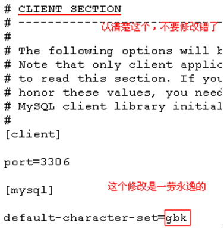
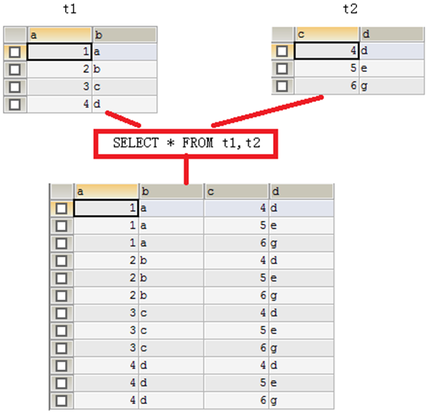

<!-- START doctoc generated TOC please keep comment here to allow auto update -->
<!-- DON'T EDIT THIS SECTION, INSTEAD RE-RUN doctoc TO UPDATE -->


- [mysql 基础](#mysql-%E5%9F%BA%E7%A1%80)
  - [一、基本命令](#%E4%B8%80%E5%9F%BA%E6%9C%AC%E5%91%BD%E4%BB%A4)
    - [1、启动和关闭mysql服务器：](#1%E5%90%AF%E5%8A%A8%E5%92%8C%E5%85%B3%E9%97%ADmysql%E6%9C%8D%E5%8A%A1%E5%99%A8)
    - [2、客户端登录退出mysql](#2%E5%AE%A2%E6%88%B7%E7%AB%AF%E7%99%BB%E5%BD%95%E9%80%80%E5%87%BAmysql)
  - [二、SQL语句](#%E4%BA%8Csql%E8%AF%AD%E5%8F%A5)
    - [1、概述](#1%E6%A6%82%E8%BF%B0)
    - [2、分类](#2%E5%88%86%E7%B1%BB)
    - [3、DDL](#3ddl)
      - [（1）基本操作](#1%E5%9F%BA%E6%9C%AC%E6%93%8D%E4%BD%9C)
      - [（2）操作数据库](#2%E6%93%8D%E4%BD%9C%E6%95%B0%E6%8D%AE%E5%BA%93)
      - [（3）数据类型](#3%E6%95%B0%E6%8D%AE%E7%B1%BB%E5%9E%8B)
      - [（4）操作表](#4%E6%93%8D%E4%BD%9C%E8%A1%A8)
    - [4、DML](#4dml)
      - [（1）插入数据](#1%E6%8F%92%E5%85%A5%E6%95%B0%E6%8D%AE)
      - [（2）修改数据](#2%E4%BF%AE%E6%94%B9%E6%95%B0%E6%8D%AE)
      - [（3）删除数据](#3%E5%88%A0%E9%99%A4%E6%95%B0%E6%8D%AE)
    - [5、DCL](#5dcl)
      - [（1）创建用户](#1%E5%88%9B%E5%BB%BA%E7%94%A8%E6%88%B7)
      - [（2）给用户授权](#2%E7%BB%99%E7%94%A8%E6%88%B7%E6%8E%88%E6%9D%83)
      - [（3）撤销授权](#3%E6%92%A4%E9%94%80%E6%8E%88%E6%9D%83)
      - [（4）查看用户权限](#4%E6%9F%A5%E7%9C%8B%E7%94%A8%E6%88%B7%E6%9D%83%E9%99%90)
      - [（5）删除用户](#5%E5%88%A0%E9%99%A4%E7%94%A8%E6%88%B7)
      - [（6）修改用户密码](#6%E4%BF%AE%E6%94%B9%E7%94%A8%E6%88%B7%E5%AF%86%E7%A0%81)
    - [6、数据查询语法（DQL）](#6%E6%95%B0%E6%8D%AE%E6%9F%A5%E8%AF%A2%E8%AF%AD%E6%B3%95dql)
      - [（1）基础查询](#1%E5%9F%BA%E7%A1%80%E6%9F%A5%E8%AF%A2)
      - [（2）条件查询](#2%E6%9D%A1%E4%BB%B6%E6%9F%A5%E8%AF%A2)
      - [（3）模糊查询](#3%E6%A8%A1%E7%B3%8A%E6%9F%A5%E8%AF%A2)
      - [（4）字段控制查询](#4%E5%AD%97%E6%AE%B5%E6%8E%A7%E5%88%B6%E6%9F%A5%E8%AF%A2)
      - [（5）排序](#5%E6%8E%92%E5%BA%8F)
      - [（6）聚合函数](#6%E8%81%9A%E5%90%88%E5%87%BD%E6%95%B0)
      - [（7）分组查询](#7%E5%88%86%E7%BB%84%E6%9F%A5%E8%AF%A2)
      - [（8）LIMIT](#8limit)
  - [三、完整性约束](#%E4%B8%89%E5%AE%8C%E6%95%B4%E6%80%A7%E7%BA%A6%E6%9D%9F)
    - [1、主键](#1%E4%B8%BB%E9%94%AE)
    - [2、主键自增长](#2%E4%B8%BB%E9%94%AE%E8%87%AA%E5%A2%9E%E9%95%BF)
    - [3、非空](#3%E9%9D%9E%E7%A9%BA)
    - [4、唯一](#4%E5%94%AF%E4%B8%80)
    - [5、外键](#5%E5%A4%96%E9%94%AE)
    - [6、表与表之间的关系](#6%E8%A1%A8%E4%B8%8E%E8%A1%A8%E4%B9%8B%E9%97%B4%E7%9A%84%E5%85%B3%E7%B3%BB)
  - [四、编码](#%E5%9B%9B%E7%BC%96%E7%A0%81)
    - [1、查看MySQL编码](#1%E6%9F%A5%E7%9C%8Bmysql%E7%BC%96%E7%A0%81)
    - [2、控制台编码](#2%E6%8E%A7%E5%88%B6%E5%8F%B0%E7%BC%96%E7%A0%81)
    - [3、MySQL工具](#3mysql%E5%B7%A5%E5%85%B7)
  - [五、备份和恢复数据](#%E4%BA%94%E5%A4%87%E4%BB%BD%E5%92%8C%E6%81%A2%E5%A4%8D%E6%95%B0%E6%8D%AE)
    - [1、生成SQL脚本](#1%E7%94%9F%E6%88%90sql%E8%84%9A%E6%9C%AC)
    - [2、执行SQL脚本恢复数据库](#2%E6%89%A7%E8%A1%8Csql%E8%84%9A%E6%9C%AC%E6%81%A2%E5%A4%8D%E6%95%B0%E6%8D%AE%E5%BA%93)
  - [六、多表查询](#%E5%85%AD%E5%A4%9A%E8%A1%A8%E6%9F%A5%E8%AF%A2)
    - [1、合并结果集](#1%E5%90%88%E5%B9%B6%E7%BB%93%E6%9E%9C%E9%9B%86)
    - [2、连接查询](#2%E8%BF%9E%E6%8E%A5%E6%9F%A5%E8%AF%A2)
      - [（1）内连接](#1%E5%86%85%E8%BF%9E%E6%8E%A5)
      - [（2）左连接](#2%E5%B7%A6%E8%BF%9E%E6%8E%A5)
      - [（3）右连接](#3%E5%8F%B3%E8%BF%9E%E6%8E%A5)
    - [3、自然连接](#3%E8%87%AA%E7%84%B6%E8%BF%9E%E6%8E%A5)
  - [七、子查询](#%E4%B8%83%E5%AD%90%E6%9F%A5%E8%AF%A2)
  - [八、事务](#%E5%85%AB%E4%BA%8B%E5%8A%A1)
    - [1、事务控制语句：](#1%E4%BA%8B%E5%8A%A1%E6%8E%A7%E5%88%B6%E8%AF%AD%E5%8F%A5)
    - [2、MYSQL 事务处理主要有两种方法](#2mysql-%E4%BA%8B%E5%8A%A1%E5%A4%84%E7%90%86%E4%B8%BB%E8%A6%81%E6%9C%89%E4%B8%A4%E7%A7%8D%E6%96%B9%E6%B3%95)
      - [（1）用 BEGIN、ROLLBACK、 COMMIT来实现](#1%E7%94%A8-beginrollback-commit%E6%9D%A5%E5%AE%9E%E7%8E%B0)
      - [（2）直接用 SET 来改变 MySQL 的自动提交模式](#2%E7%9B%B4%E6%8E%A5%E7%94%A8-set-%E6%9D%A5%E6%94%B9%E5%8F%98-mysql-%E7%9A%84%E8%87%AA%E5%8A%A8%E6%8F%90%E4%BA%A4%E6%A8%A1%E5%BC%8F)
    - [3、事务案例](#3%E4%BA%8B%E5%8A%A1%E6%A1%88%E4%BE%8B)
  - [九、索引](#%E4%B9%9D%E7%B4%A2%E5%BC%95)
    - [1、普通索引](#1%E6%99%AE%E9%80%9A%E7%B4%A2%E5%BC%95)
    - [2、查看索引](#2%E6%9F%A5%E7%9C%8B%E7%B4%A2%E5%BC%95)
    - [3、删除索引](#3%E5%88%A0%E9%99%A4%E7%B4%A2%E5%BC%95)
    - [4、唯一索引](#4%E5%94%AF%E4%B8%80%E7%B4%A2%E5%BC%95)
    - [5、聚簇索引和辅助索引](#5%E8%81%9A%E7%B0%87%E7%B4%A2%E5%BC%95%E5%92%8C%E8%BE%85%E5%8A%A9%E7%B4%A2%E5%BC%95)

<!-- END doctoc generated TOC please keep comment here to allow auto update -->

## mysql 基础

所有操作在windows 10上进行，Mysql版本为5.6，调试软件为SQLyog。

### 一、基本命令

#### 1、启动和关闭mysql服务器：

* 启动：net start mysql；
* 关闭：net stop mysql；

在启动mysql服务后，打开windows任务管理器，会有一个名为mysqld.exe的进程运行，所以mysqld.exe才是MySQL服务器程序。

#### 2、客户端登录退出mysql

在启动MySQL服务器后，我们需要使用管理员用户登录MySQL服务器，然后来对服务器进行操作。登录MySQL需要使用MySQL的客户端程序：mysql.exe

* 登录：mysql -u root -p 123 -h localhost；
* -u：后面的root是用户名，这里使用的是超级管理员root；
* -p：后面的123是密码，这是在安装MySQL时就已经指定的密码；
* -h：后面给出的localhost是服务器主机名，它是可以省略的，例如：mysql -u root -p 123；
* 退出：quit或exit；

在登录成功后，打开windows任务管理器，会有一个名为mysql.exe的进程运行，所以mysql.exe是客户端程序。

### 二、SQL语句

#### 1、概述

SQL（Structured Query Language）是“结构化查询语言”，它是对关系型数据库的操作语言。它可以应用到所有关系型数据库中，例如：MySQL、Oracle、SQL Server等。SQ标准（ANSI/ISO）有：

* SQL-92：1992年发布的SQL语言标准；
* SQL:1999：1999年发布的SQL语言标签；
* SQL:2003：2003年发布的SQL语言标签；

虽然SQL可以用在所有关系型数据库中，但很多数据库还都有标准之后的一些语法，我们可以称之为“方言”。例如MySQL中的LIMIT语句就是MySQL独有的方言，其它数据库都不支持！当然，Oracle或SQL Server都有自己的方言。

语法要求：

* SQL语句可以单行或多行书写，以分号结尾；
* 可以用空格和缩进来来增强语句的可读性；
* 关键字不区别大小写，建议使用大写；

#### 2、分类
* DDL（Data Definition Language）：数据定义语言，用来定义数据库对象：库、表、列等；
* DML（Data Manipulation Language）：数据操作语言，用来定义数据库记录（数据）；
* DCL（Data Control Language）：数据控制语言，用来定义访问权限和安全级别；
* DQL（Data Query Language）：数据查询语言，用来查询记录（数据）。

#### 3、DDL

##### （1）基本操作
* 查看所有数据库名称：SHOW DATABASES；　
* 切换数据库：USE exam，切换到exam数据库；

##### （2）操作数据库
* 创建数据库：
    ```sql
    CREATE DATABASE [IF NOT EXISTS] exam;
    ```
    创建数据库，例如：CREATE DATABASE exam，创建一个名为exam的数据库。如果这个数据已经存在，那么会报错。例如CREATE DATABASE IF NOT EXISTS exam，在名为exam的数据库不存在时创建该库，这样可以避免报错。

* 删除数据库：
    ```sql
    DROP DATABASE [IF EXISTS] exam;
    ```
    删除数据库，例如：DROP DATABASE exam，删除名为exam的数据库。如果这个数据库不存在，那么会报错。DROP DATABASE IF EXISTS exam，就算exam不存在，也不会的报错。

* 修改数据库编码：
    ```sql
    ALTER DATABASE exam CHARACTER SET utf8;
    ```
    修改数据库exam的编码为utf8。注意，在MySQL中所有的UTF-8编码都不能使用中间的“-”，即UTF-8要书写为UTF8。

##### （3）数据类型
MySQL与C++一样，也有数据类型。MySQL中数据类型主要应用在列上。

常用类型：

* int：整型
* double：浮点型，例如double(5,2)表示最多5位，其中必须有2位小数，即最大值为999.99；
* decimal：泛型型，在表单钱方面使用该类型，因为不会出现精度缺失问题；
* char：固定长度字符串类型；
* varchar：可变长度字符串类型；
* text：字符串类型；
* blob：字节类型；
* date：日期类型，格式为：yyyy-MM-dd；
* time：时间类型，格式为：hh:mm:ss
* timestamp：时间戳类型；

##### （4）操作表

* 创建表：
CREATE TABLE 表名(
  列名 列类型,
  列名 列类型,
  ......
);

例如：

```sql
CREATE TABLE stu(
	sid	    CHAR(6),
	sname	VARCHAR(20),
	age		INT,
	gender	VARCHAR(10) 
);

CREATE TABLE emp(
	eid		CHAR(6),
	ename	VARCHAR(50),
	age		INT,
	gender	VARCHAR(6),
	birthday	DATE,
	hiredate	DATE,
	salary	DECIMAL(7,2),
	resume	VARCHAR(1000)
);
```

* 查看当前数据库中所有表名称：
    ```sql
    SHOW TABLES;
    ```
* 查看指定表的创建语句：
    ```sql
    SHOW CREATE TABLE emp; // 查看emp表的创建语句
    ```
* 查看表结构：
    ```sql
    DESC emp // 查看emp表结构
    ```
* 删除表：
    ```sql
    DROP TABLE emp // 删除emp表
    ```
* 修改表：
    ```sql
    // 修改之添加列：给stu表添加classname列
    ALTER TABLE stu ADD (classname varchar(100));
    // 修改之修改列类型：修改stu表的gender列类型为CHAR(2)
    ALTER TABLE stu MODIFY gender CHAR(2);
    // 修改之修改列名：修改stu表的gender列名为sex
    ALTER TABLE stu change gender sex CHAR(2);
    // 修改之删除列：删除stu表的classname列
    ALTER TABLE stu DROP classname;
    // 修改之修改表名称：修改stu表名称为student
    ALTER TABLE stu RENAME TO student;
    ```

#### 4、DML

##### （1）插入数据
语法：
```sql
// INSERT INTO 表名(列名1,列名2, …) VALUES(值1, 值2)
INSERT INTO stu(sid, sname,age,gender) VALUES('s_1001', 'zhangSan', 23, 'male');
INSERT INTO stu(sid, sname) VALUES('s_1001', 'zhangSan'); 
```
语法：
```sql
// INSERT INTO 表名 VALUES(值1,值2,…)
因为没有指定要插入的列，表示按创建表时列的顺序插入所有列的值：
INSERT INTO stu VALUES('s_1002', 'liSi', 32, 'female');
```
注意：所有字符串数据必须使用单引用！

##### （2）修改数据

语法：
```sql
// UPDATE 表名 SET 列名1=值1, … 列名n=值n [WHERE 条件]
UPDATE stu SET sname=’zhangSanSan’, age=’32’, gender=’female’ WHERE sid=’s_1001’;
UPDATE stu SET sname=’liSi’, age=’20’ WHERE age>50 AND gender=’male’;
UPDATE stu SET sname=’wangWu’, age=’30’ WHERE age>60 OR gender=’female’;
UPDATE stu SET gender=’female’ WHERE gender IS NULL
UPDATE stu SET age=age+1 WHERE sname=’zhaoLiu’;
```

##### （3）删除数据

语法：
```sql
// DELETE FROM 表名 [WHERE 条件]
DELETE FROM stu WHERE sid=’s_1001’003B
DELETE FROM stu WHERE sname=’chenQi’ OR age > 30;
DELETE FROM stu; 
```

语法：
```sql
// TRUNCATE TABLE 表名
TRUNCATE TABLE stu; 
```
虽然TRUNCATE和DELETE都可以删除表的所有记录，但有原理不同。DELETE的效率没有TRUNCATE高。

TRUNCATE其实属性DDL语句，因为它是先DROP TABLE，再CREATE TABLE。而且TRUNCATE删除的记录是无法回滚的，但DELETE删除的记录是可以回滚的。


#### 5、DCL

##### （1）创建用户
语法：
```sql
// CREATE USER 用户名@地址 IDENTIFIED BY '密码';
CREATE USER user1@localhost IDENTIFIED BY ‘123’; 
CREATE USER user2@’%’ IDENTIFIED BY ‘123’; 
```
其中，user1用户只能在localhost这个IP登录mysql服务器，user2用户可以在任何电脑上登录mysql服务器。

##### （2）给用户授权
语法：
```sql
// GRANT 权限1, … , 权限n ON 数据库.* TO 用户名
GRANT CREATE,ALTER,DROP,INSERT,UPDATE,DELETE,SELECT ON mydb1.* TO user1@localhost;
GRANT ALL ON mydb1.* TO user2@localhost;
```

##### （3）撤销授权
语法：
```sql
// REVOKE权限1, … , 权限n ON 数据库.* FORM 用户名
REVOKE CREATE,ALTER,DROP ON mydb1.* FROM user1@localhost;
```
##### （4）查看用户权限
语法：
```sql
// SHOW GRANTS FOR 用户名
SHOW GRANTS FOR user1@localhost;
```

##### （5）删除用户
语法：
```sql
// DROP USER 用户名
DROP USER user1@localhost;
```

##### （6）修改用户密码
语法：
```sql
// USE mysql;
// UPDATE USER SET PASSWORD=PASSWORD(‘密码’) WHERE User=’用户名’ and Host=’IP’;
// FLUSH PRIVILEGES;
UPDATE USER SET PASSWORD=PASSWORD('1234') WHERE User='user2' and Host=’localhost’;
FLUSH PRIVILEGES;
```

#### 6、数据查询语法（DQL）

DQL就是数据查询语言，数据库执行DQL语句不会对数据进行改变，而是让数据库发送结果集给客户端。

语法：
```sql
SELECT selection_list /*要查询的列名称*/
  FROM table_list /*要查询的表名称*/
  WHERE condition /*行条件*/
  GROUP BY grouping_columns /*对结果分组*/
  HAVING condition /*分组后的行条件*/
  ORDER BY sorting_columns /*对结果分组*/
  LIMIT offset_start, row_count /*结果限定*/
```
创建表：

* 学生表：stu

字段名称	|字段类型	|说明
---|---|---
sid	|char(6)	|学生学号
sname|	varchar(50)|	学生姓名
age	|int|	学生年龄
gender|	varchar(50)	|学生性别

```sql
CREATE TABLE stu (
	sid	CHAR(6),
	sname		VARCHAR(50),
	age		INT,
	gender	VARCHAR(50)
);
INSERT INTO stu VALUES('S_1001', 'liuYi', 35, 'male');
INSERT INTO stu VALUES('S_1002', 'chenEr', 15, 'female');
INSERT INTO stu VALUES('S_1003', 'zhangSan', 95, 'male');
INSERT INTO stu VALUES('S_1004', 'liSi', 65, 'female');
INSERT INTO stu VALUES('S_1005', 'wangWu', 55, 'male');
INSERT INTO stu VALUES('S_1006', 'zhaoLiu', 75, 'female');
INSERT INTO stu VALUES('S_1007', 'sunQi', 25, 'male');
INSERT INTO stu VALUES('S_1008', 'zhouBa', 45, 'female');
INSERT INTO stu VALUES('S_1009', 'wuJiu', 85, 'male');
INSERT INTO stu VALUES('S_1010', 'zhengShi', 5, 'female');
INSERT INTO stu VALUES('S_1011', 'xxx', NULL, NULL);
```
* 雇员表：emp

字段名称|	字段类型	|说明
---|---|---
empno	|int|	员工编号
ename|	varchar(50)	|员工姓名
job	|varchar(50)|	员工工作
mgr	|int|	领导编号
hiredate|	date	|入职日期
sal|	decimal(7,2)|	月薪
comm|	decimal(7,2)|	奖金
deptno|	int	|部分编号

```sql
CREATE TABLE emp(
	empno		INT,
	ename		VARCHAR(50),
	job		VARCHAR(50),
	mgr		INT,
	hiredate	DATE,
	sal		DECIMAL(7,2),
	comm		decimal(7,2),
	deptno		INT
) ;
INSERT INTO emp values(7369,'SMITH','CLERK',7902,'1980-12-17',800,NULL,20);
INSERT INTO emp values(7499,'ALLEN','SALESMAN',7698,'1981-02-20',1600,300,30);
INSERT INTO emp values(7521,'WARD','SALESMAN',7698,'1981-02-22',1250,500,30);
INSERT INTO emp values(7566,'JONES','MANAGER',7839,'1981-04-02',2975,NULL,20);
INSERT INTO emp values(7654,'MARTIN','SALESMAN',7698,'1981-09-28',1250,1400,30);
INSERT INTO emp values(7698,'BLAKE','MANAGER',7839,'1981-05-01',2850,NULL,30);
INSERT INTO emp values(7782,'CLARK','MANAGER',7839,'1981-06-09',2450,NULL,10);
INSERT INTO emp values(7788,'SCOTT','ANALYST',7566,'1987-04-19',3000,NULL,20);
INSERT INTO emp values(7839,'KING','PRESIDENT',NULL,'1981-11-17',5000,NULL,10);
INSERT INTO emp values(7844,'TURNER','SALESMAN',7698,'1981-09-08',1500,0,30);
INSERT INTO emp values(7876,'ADAMS','CLERK',7788,'1987-05-23',1100,NULL,20);
INSERT INTO emp values(7900,'JAMES','CLERK',7698,'1981-12-03',950,NULL,30);
INSERT INTO emp values(7902,'FORD','ANALYST',7566,'1981-12-03',3000,NULL,20);
INSERT INTO emp values(7934,'MILLER','CLERK',7782,'1982-01-23',1300,NULL,10);
```

* 部分表：dept

字段名称|	字段类型|	说明
---|---|---
deptno|	int	|部分编码
dname|	varchar(50)|	部分名称
loc|	varchar(50)|	部分所在地点

##### （1）基础查询

* 查询所有列
```sql
SELECT * FROM stu;
```
* 查询指定列
```sql
SELECT sid, sname, age FROM stu;
```

##### （2）条件查询

条件查询就是在查询时给出WHERE子句，在WHERE子句中可以使用如下运算符及关键字：
* =、!=、<>、<、<=、>、>=；
* BETWEEN…AND；
* IN(set)；
* IS NULL；
* AND；
* OR；
* NOT；

* 查询性别为女，并且年龄50的记录
```sql
SELECT * FROM stu 
WHERE gender='female' AND ge<50;
```
* 查询学号为S_1001，或者姓名为liSi的记录
```sql
SELECT * FROM stu 
WHERE sid ='S_1001' OR sname='liSi';
```
* 查询学号为S_1001，S_1002，S_1003的记录
```sql
SELECT * FROM stu 
WHERE sid IN ('S_1001','S_1002','S_1003');
```
* 查询学号不是S_1001，S_1002，S_1003的记录
```sql
SELECT * FROM tab_student 
WHERE s_number NOT IN ('S_1001','S_1002','S_1003');
```
* 查询年龄为null的记录
```sql
SELECT * FROM stu
WHERE age IS NULL;
```
* 查询年龄在20到40之间的学生记录
```sql
SELECT * 
FROM stu
WHERE age>=20 AND age<=40;
```
或者
```sql
SELECT * 
FROM stu 
WHERE age BETWEEN 20 AND 40;
```
* 查询性别非男的学生记录
```sql 
SELECT * 
FROM stu
WHERE gender!='male';
```
或者
```sql
SELECT * 
FROM stu
WHERE gender<>'male';
```
或者
```sql
SELECT * 
FROM stu
WHERE NOT gender='male';
```
* 查询姓名不为null的学生记录
```sql
SELECT * 
FROM stu
WHERE NOT sname IS NULL;
```
或者
```sql
SELECT * 
FROM stu
WHERE sname IS NOT NULL;
```
##### （3）模糊查询
当想查询姓名中包含a字母的学生时就需要使用模糊查询了。模糊查询需要使用关键字LIKE。

* 查询姓名由5个字母构成的学生记录
```sql
SELECT * 
FROM stu
WHERE sname LIKE '_____';
```
模糊查询必须使用LIKE关键字。其中 “_”匹配任意一个字母，5个表示5个任意字母。

* 查询姓名由5个字母构成，并且第5个字母为“i”的学生记录
```sql
SELECT * 
FROM stu
WHERE sname LIKE '____i';
```
* 查询姓名以“z”开头的学生记录
```sql
SELECT * 
FROM stu
WHERE sname LIKE 'z%';
```
其中“%”匹配0~n个任何字母。

* 查询姓名中第2个字母为“i”的学生记录
```sql
SELECT * 
FROM stu
WHERE sname LIKE '_i%';
```
* 查询姓名中包含“a”字母的学生记录
```sql
SELECT * 
FROM stu
WHERE sname LIKE '%a%';
```

##### （4）字段控制查询

* 去除重复记录

去除重复记录（两行或两行以上记录中系列的上的数据都相同），例如emp表中sal字段就存在相同的记录。当只查询emp表的sal字段时，那么会出现重复记录，那么想去除重复记录，需要使用DISTINCT：
```sql
SELECT DISTINCT sal FROM emp;
```
* 查看雇员的月薪与佣金之和

因为sal和comm两列的类型都是数值类型，所以可以做加运算。如果sal或comm中有一个字段不是数值类型，那么会出错。
```sql
SELECT *,sal+comm FROM emp;
```
comm列有很多记录的值为NULL，因为任何东西与NULL相加结果还是NULL，所以结算结果可能会出现NULL。下面使用了把NULL转换成数值0的函数IFNULL：
```sql
SELECT *,sal+IFNULL(comm,0) FROM emp;
```
* 给列名添加别名

在上面查询中出现列名为sal+IFNULL(comm,0)，这很不美观，现在我们给这一列给出一个别名，为total：
```sql
SELECT *, sal+IFNULL(comm,0) AS total FROM emp;
```
给列起别名时，是可以省略AS关键字的：
```sql
SELECT *,sal+IFNULL(comm,0) total FROM emp;
```

##### （5）排序

* 查询所有学生记录，按年龄升序排序
```sql
SELECT *
FROM stu
ORDER BY sage ASC;
```
或者
```sql
SELECT *
FROM stu
ORDER BY sage;
```
* 查询所有学生记录，按年龄降序排序
```sql
SELECT *
FROM stu
ORDER BY age DESC;
```
* 查询所有雇员，按月薪降序排序，如果月薪相同时，按编号升序排序
```sql
SELECT * FROM emp
ORDER BY sal DESC,empno ASC;
```
##### （6）聚合函数

聚合函数是用来做纵向运算的函数：

* COUNT()：统计指定列不为NULL的记录行数；
* MAX()：计算指定列的最大值，如果指定列是字符串类型，那么使用字符串排序运算；
* MIN()：计算指定列的最小值，如果指定列是字符串类型，那么使用字符串排序运算；
* SUM()：计算指定列的数值和，如果指定列类型不是数值类型，那么计算结果为0；
* AVG()：计算指定列的平均值，如果指定列类型不是数值类型，那么计算结果为0；

COUNT

当需要纵向统计时可以使用COUNT()。

* 查询emp表中记录数：
```sql
SELECT COUNT(*) AS cnt FROM emp;
```
* 查询emp表中有佣金的人数：
```sql
SELECT COUNT(comm) cnt FROM emp;
```

注意，因为count()函数中给出的是comm列，那么只统计comm列非NULL的行数。

* 查询emp表中月薪大于2500的人数：
```sql
SELECT COUNT(*) FROM emp
WHERE sal > 2500;
```
* 统计月薪与佣金之和大于2500元的人数：
```sql
SELECT COUNT(*) AS cnt FROM emp WHERE sal+IFNULL(comm,0) > 2500;
```
* 查询有佣金的人数，以及有领导的人数：
```sql
SELECT COUNT(comm), COUNT(mgr) FROM emp;
```

SUM和AVG

当需要纵向求和时使用sum()函数。

* 查询所有雇员月薪和：
```sql
SELECT SUM(sal) FROM emp;
```
* 查询所有雇员月薪和，以及所有雇员佣金和：
```sql
SELECT SUM(sal), SUM(comm) FROM emp;
```
* 查询所有雇员月薪+佣金和：
```sql
SELECT SUM(sal+IFNULL(comm,0)) FROM emp;
```
* 统计所有员工平均工资：
```sql
SELECT SUM(sal), COUNT(sal) FROM emp;
```
或者
```sql
SELECT AVG(sal) FROM emp;
```

MAX和MIN

* 查询最高工资和最低工资：
```sql
SELECT MAX(sal), MIN(sal) FROM emp;
```

##### （7）分组查询

当需要分组查询时需要使用GROUP BY子句，例如查询每个部门的工资和，这说明要使用部分来分组。

分组查询：

* 查询每个部门的部门编号和每个部门的工资和：
```sql
SELECT deptno, SUM(sal)
FROM emp
GROUP BY deptno;
```
* 查询每个部门的部门编号以及每个部门的人数：
```sql
SELECT deptno,COUNT(*)
FROM emp
GROUP BY deptno;
```
* 查询每个部门的部门编号以及每个部门工资大于1500的人数：
```sql
SELECT deptno,COUNT(*)
FROM emp
WHERE sal>1500
GROUP BY deptno;
```
HAVING子句：

* 查询工资总和大于9000的部门编号以及工资和：
```sql
SELECT deptno, SUM(sal)
FROM emp
GROUP BY deptno
HAVING SUM(sal) > 9000;
```
注意，WHERE是对分组前记录的条件，如果某行记录没有满足WHERE子句的条件，那么这行记录不会参加分组；而HAVING是对分组后数据的约束。

##### （8）LIMIT

LIMIT用来限定查询结果的起始行，以及总行数。

* 查询5行记录，起始行从0开始
```sql
SELECT * FROM emp LIMIT 0, 5;
```
注意，起始行从0开始，即第一行开始！

* 查询10行记录，起始行从3开始
```sql
SELECT * FROM emp LIMIT 3, 10;
```
* 分页查询

如果一页记录为10条，希望查看第3页记录应该怎么查呢？

* 第一页记录起始行为0，一共查询10行；
* 第二页记录起始行为10，一共查询10行；
* 第三页记录起始行为20，一共查询10行；

### 三、完整性约束

完整性约束是为了表的数据的正确性！如果数据不正确，那么一开始就不能添加到表中。

#### 1、主键

当某一列添加了主键约束后，那么这一列的数据就不能重复出现。这样每行记录中其主键列的值就是这一行的唯一标识。例如学生的学号可以用来做唯一标识，而学生的姓名是不能做唯一标识的，因为学习有可能同名。主键列的值不能为NULL，也不能重复！指定主键约束使用PRIMARY KEY关键字

* 创建表：定义列时指定主键：
```sql
CREATE TABLE stu(
		sid	    CHAR(6) PRIMARY KEY,
		sname	VARCHAR(20),
		age		INT,
		gender	VARCHAR(10) 
);
```
* 创建表：定义列之后独立指定主键：
```sql
CREATE TABLE stu(
		sid	    CHAR(6),
		sname	VARCHAR(20),
		age		INT,
		gender	VARCHAR(10),
		PRIMARY KEY(sid)
);
```
* 修改表时指定主键：
```sql
ALTER TABLE stu
ADD PRIMARY KEY(sid);
```
* 删除主键（只是删除主键约束，而不会删除主键列）：
```sql
ALTER TABLE stu DROP PRIMARY KEY;
```

#### 2、主键自增长

MySQL提供了主键自动增长的功能！这样用户就不用再为是否有主键是否重复而烦恼了。当主键设置为自动增长后，在没有给出主键值时，主键的值会自动生成，而且是最大主键值+1，也就不会出现重复主键的可能了。

* 创建表时设置主键自增长（主键必须是整型才可以自增长）：
```sql
CREATE TABLE stu(
		sid INT PRIMARY KEY AUTO_INCREMENT,
		sname	VARCHAR(20),
		age		INT,
		gender	VARCHAR(10)
);
```
* 修改表时设置主键自增长：
```sql
ALTER TABLE stu CHANGE sid sid INT AUTO_INCREMENT;
```

* 修改表时删除主键自增长：
```sql
ALTER TABLE stu CHANGE sid sid INT;
```

#### 3、非空

指定非空约束的列不能没有值，也就是说在插入记录时，对添加了非空约束的列一定要给值；在修改记录时，不能把非空列的值设置为NULL。

* 指定非空约束：
```sql
CREATE TABLE stu(
		sid INT PRIMARY KEY AUTO_INCREMENT,
		sname VARCHAR(10) NOT NULL,
		age		INT,
		gender	VARCHAR(10)
);
```
当为sname字段指定为非空后，在向stu表中插入记录时，必须给sname字段指定值，否则会报错：
```sql
INSERT INTO stu(sid) VALUES(1);
```
插入的记录中sname没有指定值，所以会报错！

#### 4、唯一
还可以为字段指定唯一约束！当为字段指定唯一约束后，那么字段的值必须是唯一的。这一点与主键相似！例如给stu表的sname字段指定唯一约束：
```sql
CREATE TABLE tab_ab(
	sid INT PRIMARY KEY AUTO_INCREMENT,
	sname VARCHAR(10) UNIQUE
);

INSERT INTO sname(sid, sname) VALUES(1001, 'zs');
INSERT INTO sname(sid, sname) VALUES(1002, 'zs');
```
当两次插入相同的名字时，MySQL会报错！

#### 5、外键

主外键是构成表与表关联的唯一途径！

外键是另一张表的主键！例如员工表与部门表之间就存在关联关系，其中员工表中的部门编号字段就是外键，是相对部门表的外键。
我们再来看BBS系统中：用户表（t_user）、分类表（t_section）、帖子表（t_topic）三者之间的关系。


* 例如在t_section表中sid为1的记录说明有一个分类叫java，版主是t_user表中uid为1的用户，即zs！
* 例如在t_topic表中tid为2的记录是名字为“Java是咖啡”的帖子，它是java版块的帖子，它的作者是ww。

外键就是用来约束这一列的值必须是另一张表的主键值！！！

* 创建t_user表，指定uid为主键列：
```sql
CREATE TABLE t_user(
	uid	INT PRIMARY KEY AUTO_INCREMENT,
	uname	VARCHAR(20) UNIQUE NOT NULL
);
```
* 创建t_section表，指定sid为主键列，u_id为相对t_user表的uid列的外键：
```sql
CREATE TABLE t_section(
		sid	INT PRIMARY KEY AUTO_INCREMENT,
		sname	VARCHAR(30),
		u_id	INT,
		CONSTRAINT fk_t_user FOREIGN KEY(u_id) REFERENCES t_user(uid)
);
```
* 修改t_section表，指定u_id为相对t_user表的uid列的外键：
```sql
ALTER TABLE t_section 
ADD CONSTRAINT fk_t_user 
FOREIGN KEY(u_id) 
REFERENCES t_user(uid);
```
* 修改t_section表，删除u_id的外键约束：
```sql
ALTER TABLE t_section
DROP FOREIGN KEY fk_t_user;
```
#### 6、表与表之间的关系

* 一对一：例如t_person表和t_card表，即人和身份证。这种情况需要找出主从关系，即谁是主表，谁是从表。人可以没有身份证，但身份证必须要有人才行，所以人是主表，而身份证是从表。设计从表可以有两种方案：
* 在t_card表中添加外键列（相对t_user表），并且给外键添加唯一约束；
* 给t_card表的主键添加外键约束（相对t_user表），即t_card表的主键也是外键。
* 一对多（多对一）：最为常见的就是一对多！一对多和多对一，这是从哪个角度去看得出来的。t_user和t_section的关系，从t_user来看就是一对多，而从t_section的角度来看就是多对一！这种情况都是在多方创建外键！
* 多对多：例如t_stu和t_teacher表，即一个学生可以有多个老师，而一个老师也可以有多个学生。这种情况通常需要创建中间表来处理多对多关系。例如再创建一张表t_stu_tea表，给出两个外键，一个相对t_stu表的外键，另一个相对t_teacher表的外键。

### 四、编码

#### 1、查看MySQL编码
```sql
SHOW VARIABLES LIKE 'char%';
```


因为当初安装时指定了字符集为UTF8，所以所有的编码都是UTF8。

* character_set_client：你发送的数据必须与client指定的编码一致！！！服务器会使用该编码来解读客户端发送过来的数据；
* character_set_connection：通过该编码与client一致！该编码不会导致乱码！当执行的是查询语句时，客户端发送过来的数据会先转换成connection指定的编码。但只要客户端发送过来的数据与client指定的编码一致，那么转换就不会出现问题；
* character_set_database：数据库默认编码，在创建数据库时，如果没有指定编码，那么默认使用database编码；
* character_set_server：MySQL服务器默认编码；
* character_set_results：响应的编码，即查询结果返回给客户端的编码。这说明客户端必须使用result指定的编码来解码；

#### 2、控制台编码

修改character_set_client、character_set_results、character_set_connection为GBK，就不会出现乱码了。但其实只需要修改character_set_client和character_set_results。

控制台的编码只能是GBK，而不能修改为UTF8，这就出现一个问题。客户端发送的数据是GBK，而character_set_client为UTF8，这就说明客户端数据到了服务器端后一定会出现乱码。既然不能修改控制台的编码，那么只能修改character_set_client为GBK了。
服务器发送给客户端的数据编码为character_set_result，它如果是UTF8，那么控制台使用GBK解码也一定会出现乱码。因为无法修改控制台编码，所以只能把character_set_result修改为GBK。

* 修改character_set_client变量：set character_set_client=gbk;
* 修改character_set_results变量：set character_set_results=gbk;

设置编码只对当前连接有效，这说明每次登录MySQL提示符后都要去修改这两个编码，但可以通过修改配置文件来处理这一问题：配置文件路径：D:\Program Files\MySQL\MySQL Server 5.1\ my.ini



#### 3、MySQL工具
使用MySQL工具是不会出现乱码的，因为它们会每次连接时都修改character_set_client、character_set_results、character_set_connection的编码。这样对my.ini上的配置覆盖了，也就不会出现乱码了。

### 五、备份和恢复数据

#### 1、生成SQL脚本

在控制台使用mysqldump命令可以用来生成指定数据库的脚本文本，但要注意，脚本文本中只包含数据库的内容，而不会存在创建数据库的语句！所以在恢复数据时，还需要自已手动创建一个数据库之后再去恢复数据。
```sql
mysqldump –u用户名 –p密码 数据库名>生成的脚本文件路径
```


现在可以在C盘下找到mydb1.sql文件了。

注意，mysqldump命令是在Windows控制台下执行，无需登录mysql！！！

#### 2、执行SQL脚本恢复数据库

注意：执行SQL脚本需要登录mysql，然后进入指定数据库，才可以执行SQL脚本！！！

执行SQL脚本不只是用来恢复数据库，也可以在平时编写SQL脚本，然后使用执行SQL 脚本来操作数据库！大家都知道，在黑屏下编写SQL语句时，就算发现了错误，可能也不能修改了。所以建议大家使用脚本文件来编写SQL代码，然后执行之。

```sql
SOURCE C:\mydb1.sql //一定要先 select 某个数据库在执行该语句！！！
```


注意：在执行脚本时需要先行核查当前数据库中的表是否与脚本文件中的语句有冲突！例如在脚本文件中存在create table a的语句，而当前数据库中已经存在了a表，那么就会出错！

当然还可以通过下面的方式来执行脚本文件：
```sql
// mysql –u用户名 –p密码 数据库<要执行脚本文件路径
mysql -uroot -p123 mydb1<c:\mydb1.sql
```
**这种方式无需登录mysql，但目标数据库（这里是mydb1）一定要先创建！**

### 六、多表查询

多表查询有如下几种：
* 合并结果集；
* 连接查询
  * 内连接
  * 外连接
    * 左外连接
    * 右外连接
    * 全外连接（MySQL不支持）
  * 自然连接
* 子查询

#### 1、合并结果集

作用：合并结果集就是把两个select语句的查询结果合并到一起。

合并结果集有两种方式：

* UNION：去除重复记录，例如：SELECT * FROM t1 UNION SELECT * FROM t2；


* UNION ALL：不去除重复记录，例如：SELECT * FROM t1 UNION ALL SELECT * FROM t2。


#### 2、连接查询

连接查询就是求出多个表的乘积，例如t1连接t2，那么查询出的结果就是t1*t2。



连接查询会产生笛卡尔积，假设集合A={a,b}，集合B={0,1,2}，则两个集合的笛卡尔积为{(a,0),(a,1),(a,2),(b,0),(b,1),(b,2)}。可以扩展到多个集合的情况。

那么多表查询产生这样的结果并不是我们想要的，那么怎么去除重复的，不想要的记录呢，当然是通过条件过滤。通常要查询的多个表之间都存在关联关系，那么就通过关联关系去除笛卡尔积。

你能想像到emp和dept表连接查询的结果么？emp一共14行记录，dept表一共4行记录，那么连接后查询出的结果是56行记录。

也就你只是想在查询emp表的同时，把每个员工的所在部门信息显示出来，那么就需要使用主外键来去除无用信息了。


可以使用主外键关系做为条件来去除无用信息（在多表查询中，在使用列时必须指定列所从属的表，例如emp.deptno表示emp表的deptno列。）：

```sql
SELECT * FROM emp,dept WHERE emp.deptno=dept.deptno ;
```


上面查询结果会把两张表的所有列都查询出来，也许你不需要那么多列，这时就可以指定要查询的列了：

```sql
SELECT emp.ename,emp.sal,emp.comm,dept.dname 
FROM emp,dept 
WHERE emp.deptno=dept.deptno;
```


还可以为表指定别名，然后在引用列时使用别名即可（其中AS是可以省略的）：

```sql
SELECT e.ename,e.sal,e.comm,d.dname 
FROM emp AS e,dept AS d
WHERE e.deptno=d.deptno; 
```

##### （1）内连接

SQL标准的内连接为：

```sql
SELECT * 
FROM t1 t
INNER JOIN t2 k 
ON  t.a=k.c;
```
查询结果如下：


总而言之，内连接可以认为是两个集合的交集：


注意：

* 对于Mysql来说INNER可以省略，MySQL默认的连接方式就是内连接。
* 连接查询使用不使用WHERE，而是使用ON

##### （2）左连接

左连接可以认为是：


例如：
```sql
SELECT * 
FROM t1 t
LEFT  JOIN t2 k 
ON  t.a=k.c;
```


##### （3）右连接

右连接可以认为是：


例如：

```sql
SELECT * 
FROM t1 t
RIGHT  JOIN t2 k 
ON  t.a=k.c;
```


#### 3、自然连接

连接查询会产生无用笛卡尔积，我们通常使用主外键关系等式来去除它。而自然连接无需你去给出主外键等式，它会自动找到这一等式：

* 两张连接的表中名称和类型完成一致的列作为条件，例如emp和dept表都存在deptno列，并且类型一致，所以会被自然连接找到。

当然自然连接还有其他的查找条件的方式，但其他方式都可能存在问题。

新建一个t3表，表的内容如下：


```sql
SELECT * FROM t1 NATURAL JOIN t3;
```


```sql
SELECT * FROM t1 NATURAL LEFT JOIN t3;
```


```sql
SELECT * FROM t1 NATURAL RIGHT JOIN t3;
```


### 七、子查询

子查询就是嵌套查询，即SELECT中包含SELECT，如果一条语句中存在两个，或两个以上SELECT，那么就是子查询语句了。

* 子查询出现的位置：

  *	where后，作为条件的一部分；
  *	from后，作为被查询的一条表；

* 当子查询出现在where后作为条件时，还可以使用如下关键字：

  * any
  * all

* 子查询结果集的形式：

  * 单行单列（用于条件）
  * 单行多列（用于条件）
  * 多行单列（用于条件）
  * 多行多列（用于表）

案例：工资高于甘宁的员工。

查询条件：工资>甘宁工资，其中甘宁工资需要一条子查询。

第一步：查询甘宁的工资
```sql
SELECT sal FROM emp WHERE ename='甘宁'
```

第二步：查询高于甘宁工资的员工
```sql
SELECT * FROM emp WHERE sal > (${第一步})
```

结果：
```sql
SELECT * FROM emp WHERE sal > (SELECT sal FROM emp WHERE ename='甘宁')
```

* 子查询作为条件
* 子查询形式为单行单列

案例：工资高于30部门所有人的员工信息

查询条件：工资高于30部门所有人工资，其中30部门所有人工资是子查询。高于所有需要使用all关键字。

第一步：查询30部门所有人工资
```sql
SELECT sal FROM emp WHERE deptno=30;
```

第二步：查询高于30部门所有人工资的员工信息
```sql
SELECT * FROM emp WHERE sal > ALL (${第一步})
```

结果：
```sql
SELECT * FROM emp WHERE sal > ALL  (SELECT sal FROM emp WHERE deptno=30)
```

* 子查询作为条件
* 子查询形式为多行单列（当子查询结果集形式为多行单列时可以使用ALL或ANY关键字）

案例：查询工作和工资与殷天正完全相同的员工信息

查询条件：工作和工资与殷天正完全相同，这是子查询

第一步：查询出殷天正的工作和工资

```sql
SELECT job,sal FROM emp WHERE ename='殷天正'
```

第二步：查询出与殷天正工作和工资相同的人

```sql
SELECT * FROM emp WHERE (job,sal) IN (${第一步})
```

结果：
```sql
SELECT * FROM emp WHERE (job,sal) IN (SELECT job,sal FROM emp WHERE ename='殷天正')
```

### 八、事务

该部分参考 [MySQL 事务](https://www.runoob.com/mysql/mysql-transaction.html)

MySQL 事务主要用于处理操作量大，复杂度高的数据。比如说，在人员管理系统中，你删除一个人员，你既需要删除人员的基本资料，也要删除和该人员相关的信息，如信箱，文章等等，这样，这些数据库操作语句就构成一个事务。

* 在 MySQL 中只有使用了 Innodb 数据库引擎的数据库或表才支持事务。
事务处理可以用来维护数据库的完整性，保证成批的 SQL 语句要么全部执行，要么全部不执行。

* 事务用来管理 insert,update,delete 语句。

* 一般来说，事务是必须满足4个条件（ACID）：：原子性（Atomicity，或称不可分割性）、一致性（Consistency）、隔离性（Isolation，又称独立性）、持久性（Durability）：

  * 原子性：一个事务（transaction）中的所有操作，要么全部完成，要么全部不完成，不会结束在中间某个环节。事务在执行过程中发生错误，会被回滚（Rollback）到事务开始前的状态，就像这个事务从来没有执行过一样。

  * 一致性：在事务开始之前和事务结束以后，数据库的完整性没有被破坏。这表示写入的资料必须完全符合所有的预设规则，这包含资料的精确度、串联性以及后续数据库可以自发性地完成预定的工作。

  * 隔离性：数据库允许多个并发事务同时对其数据进行读写和修改的能力，隔离性可以防止多个事务并发执行时由于交叉执行而导致数据的不一致。事务隔离分为不同级别，包括读未提交（Read uncommitted）、读提交（read committed）、可重复读（repeatable read）和串行化（Serializable）。

  * 持久性：事务处理结束后，对数据的修改就是永久的，即便系统故障也不会丢失。

  注意：**在 MySQL 命令行的默认设置下，事务都是自动提交的**，即执行 SQL 语句后就会马上执行 COMMIT 操作。因此要显式地开启一个事务务须使用命令 BEGIN 或 START TRANSACTION，或者执行命令 SET AUTOCOMMIT=0，用来禁止使用当前会话的自动提交。

  **BEGIN 或 START TRANSACTION 显式地开启一个事务；**

#### 1、事务控制语句：

* COMMIT 也可以使用 COMMIT WORK，不过二者是等价的。COMMIT 会提交事务，并使已对数据库进行的所有修改成为永久性的；

* ROLLBACK 也可以使用 ROLLBACK WORK，不过二者是等价的。回滚会结束用户的事务，并撤销正在进行的所有未提交的修改；

* SAVEPOINT identifier，SAVEPOINT 允许在事务中创建一个保存点，一个事务中可以有多个 SAVEPOINT；

* RELEASE SAVEPOINT identifier 删除一个事务的保存点，当没有指定的保存点时，执行该语句会抛出一个异常；

* ROLLBACK TO identifier 把事务回滚到标记点；

* SET TRANSACTION 用来设置事务的隔离级别。InnoDB 存储引擎提供事务的隔离级别有READ UNCOMMITTED、READ COMMITTED、REPEATABLE READ 和 SERIALIZABLE。

#### 2、MYSQL 事务处理主要有两种方法

##### （1）用 BEGIN、ROLLBACK、 COMMIT来实现

* BEGIN 开始一个事务
* ROLLBACK 事务回滚
* COMMIT 事务确认

##### （2）直接用 SET 来改变 MySQL 的自动提交模式

* SET AUTOCOMMIT=0 禁止自动提交
* SET AUTOCOMMIT=1 开启自动提交

#### 3、事务案例

```sql
SELECT * FROM stu;
```


```sql
BEGIN; // 或者 START TRANSACTION;

INSERT INTO stu(sname,gender,classname) VALUES('yyy','man','no3');

ROLLBACK;

INSERT INTO stu(sname,gender,classname) VALUES('yyy','man','no4');

COMMIT;
```


### 九、索引

参考 [MySQL 索引](https://www.runoob.com/mysql/mysql-index.html)

MySQL索引的建立对于MySQL的高效运行是很重要的，索引可以大大提高MySQL的检索速度。

打个比方，如果合理的设计且使用索引的MySQL是一辆兰博基尼的话，那么没有设计和使用索引的MySQL就是一个人力三轮车。拿汉语字典的目录页（索引）打比方，我们可以按拼音、笔画、偏旁部首等排序的目录（索引）快速查找到需要的字。

索引分单列索引和组合索引。单列索引，即一个索引只包含单个列，一个表可以有多个单列索引，但这不是组合索引。组合索引，即一个索引包含多个列。创建索引时，你需要确保该索引是应用在 SQL 查询语句的条件(一般作为 WHERE 子句的条件)。

实际上，索引也是一张表，该表保存了主键与索引字段，并指向实体表的记录。

上面都在说使用索引的好处，但过多的使用索引将会造成滥用。因此索引也会有它的缺点：虽然索引大大提高了查询速度，同时却会降低更新表的速度，如对表进行INSERT、UPDATE和DELETE。因为更新表时，MySQL不仅要保存数据，还要保存一下索引文件。建立索引会占用磁盘空间的索引文件。

#### 1、普通索引

* 方法一：
```sql
CREATE INDEX indexName ON mytable(colName(length)); 
```
如果是CHAR，VARCHAR类型，length可以小于字段实际长度；如果是BLOB和TEXT类型，必须指定 length。

* 方法二--修改表结构(添加索引)
```sql
ALTER table tableName ADD INDEX indexName(columnName)
```

* 方法三--创建表的时候直接指定
```sql
CREATE TABLE mytable(  
  ID INT NOT NULL,   
  username VARCHAR(16) NOT NULL,  
  INDEX [indexName] (colName(length))  
);  
```

对于前面的stu表


添加sid和sname两个索引：

```sql
ALTER TABLE stu ADD INDEX idx_sid(sid);
CREATE INDEX idx_sname ON stu(sname);
```

#### 2、查看索引

语法：
```sql
SHOW INDEX FROM table_name;
```
查看前面建的两个索引：
```sql
SHOW INDEX FROM stu;
```


#### 3、删除索引

语法：

```sql
DROP INDEX [indexName] ON mytable; 
```
例如：
```sql
DROP INDEX idx_sid ON stu;
SHOW INDEX FROM stu;
```


当然也可以使用 ALTER 命令中使用 DROP 子句来删除索引：

```sql
ALTER TABLE stu DROP INDEX idx_sname;
SHOW INDEX FROM stu;
```


#### 4、唯一索引

它与前面的普通索引类似，不同的就是：索引列的值必须唯一，但允许有空值。如果是组合索引，则列值的组合必须唯一。它有以下几种创建方式：

* 创建索引
```sql
CREATE UNIQUE INDEX indexName ON mytable(colName(length)) 
```
* 修改表结构
```sql
ALTER table mytable ADD UNIQUE [indexName] (colName(length))
```
* 创建表的时候直接指定
```sql
CREATE TABLE mytable(  
  ID INT NOT NULL,   
  username VARCHAR(16) NOT NULL,  
  UNIQUE [indexName] (colName(length))  
);  
```

更多数据库索引的内容详见数据库高级部分。

#### 5、聚簇索引和辅助索引

参考 https://www.jianshu.com/p/fa8192853184

**聚簇索引**：将数据存储与索引放到了一块，找到索引也就找到了数据。由于聚簇索引是将数据跟索引结构放到一块，每张表只能建一个聚簇索引。

**非聚簇索引**：将数据存储于索引分开结构，索引结构的叶子节点指向了数据的对应行，myisam通过key_buffer把索引先缓存到内存中，当需要访问数据时（通过索引访问数据），在内存中直接搜索索引，然后通过索引找到磁盘相应数据，这也就是为什么索引不在key buffer命中时，速度慢的原因。

澄清一个概念：innodb中，在聚簇索引之上创建的索引称之为辅助索引，辅助索引访问数据总是需要二次查找，非聚簇索引都是辅助索引，像复合索引、前缀索引、唯一索引，辅助索引叶子节点存储的不再是行的物理位置，而是主键值。

**聚簇索引性能最好而且具有唯一性，所以非常珍贵**，必须慎重设置。**聚簇索引默认是主键**，如果表中没有定义主键，InnoDB 会选择一个唯一的非空索引代替。如果没有这样的索引，InnoDB 会隐式定义一个主键来作为聚簇索引。InnoDB 只聚集在同一个页面中的记录。包含相邻健值的页面可能相距甚远。

下面演示一个使用聚簇索引和辅助索引查询的案例：


InnoDB使用的是聚簇索引，将主键组织到一棵B+树中，而行数据就储存在叶子节点上，若使用"where id = 14"这样的条件查找主键，则按照B+树的检索算法即可查找到对应的叶节点，之后获得行数据。

若对Name列进行条件搜索，则需要两个步骤：**第一步**在辅助索引B+树中检索Name，到达其叶子节点获取对应的主键。**第二步**使用主键在主索引B+树种再执行一次B+树检索操作，最终到达叶子节点即可获取整行数据。（重点在于通过其他键需要建立辅助索引）

MyISM使用的是非聚簇索引，非聚簇索引的两棵B+树看上去没什么不同，节点的结构完全一致只是存储的内容不同而已，主键索引B+树的节点存储了主键，辅助键索引B+树存储了辅助键。表数据存储在独立的地方，这两颗B+树的叶子节点都使用一个地址指向真正的表数据，对于表数据来说，这两个键没有任何差别。由于索引树是独立的，通过辅助键检索无需访问主键的索引树。