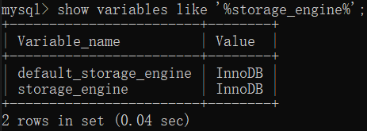
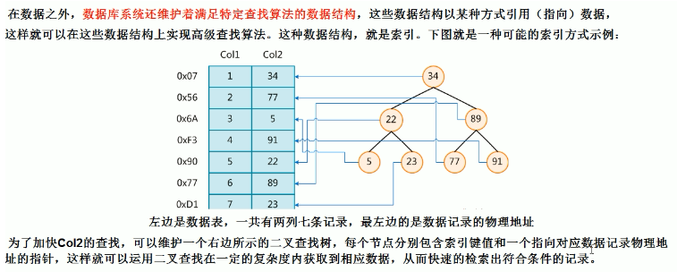
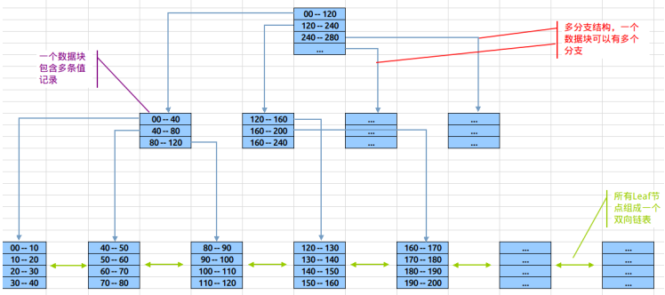
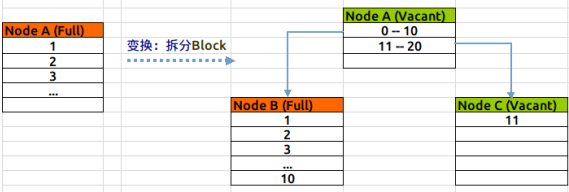
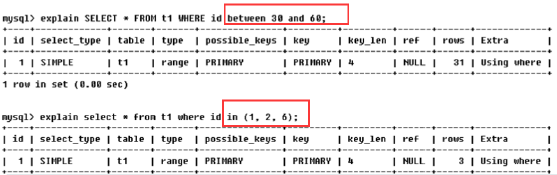
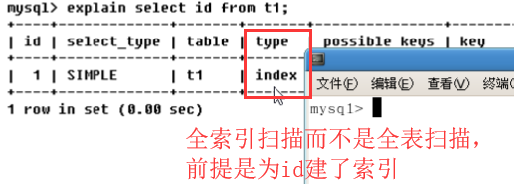
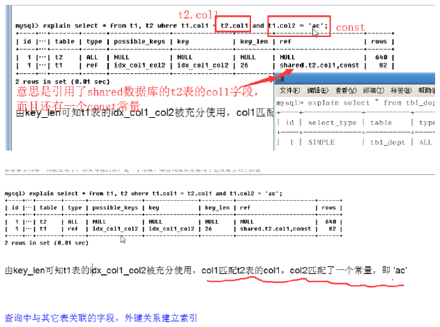
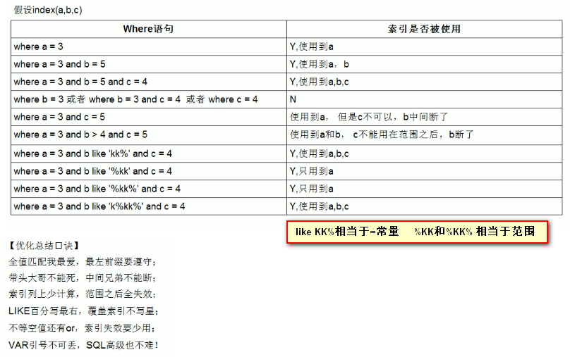
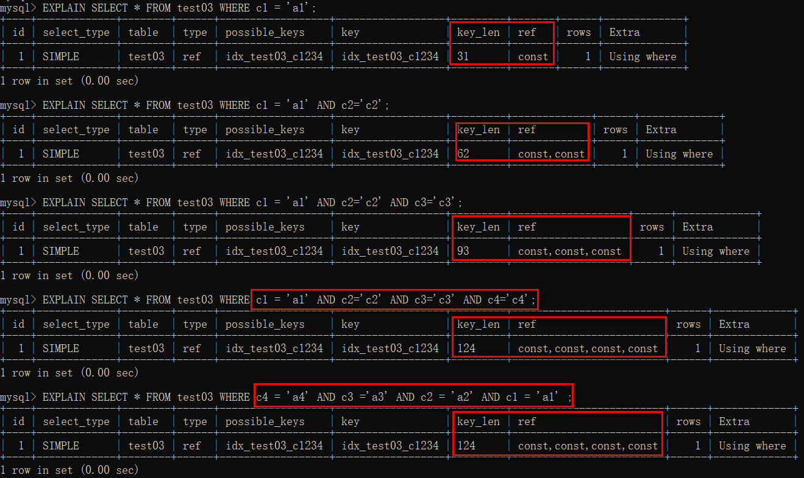

<!-- START doctoc generated TOC please keep comment here to allow auto update -->
<!-- DON'T EDIT THIS SECTION, INSTEAD RE-RUN doctoc TO UPDATE -->


- [MySQL 高级](#mysql-%E9%AB%98%E7%BA%A7)
  - [一、MySQL架构介绍](#%E4%B8%80mysql%E6%9E%B6%E6%9E%84%E4%BB%8B%E7%BB%8D)
    - [1、MySQ逻辑架构](#1mysq%E9%80%BB%E8%BE%91%E6%9E%B6%E6%9E%84)
    - [2、MySQL 存储引擎](#2mysql-%E5%AD%98%E5%82%A8%E5%BC%95%E6%93%8E)
      - [（1）查看](#1%E6%9F%A5%E7%9C%8B)
      - [（2）MyISAM vs InnoDB](#2myisam-vs-innodb)
      - [（3）淘宝使用案例](#3%E6%B7%98%E5%AE%9D%E4%BD%BF%E7%94%A8%E6%A1%88%E4%BE%8B)
  - [二、索引优化分析](#%E4%BA%8C%E7%B4%A2%E5%BC%95%E4%BC%98%E5%8C%96%E5%88%86%E6%9E%90)
    - [1、SQL性能下降原因](#1sql%E6%80%A7%E8%83%BD%E4%B8%8B%E9%99%8D%E5%8E%9F%E5%9B%A0)
      - [（1）单值索引](#1%E5%8D%95%E5%80%BC%E7%B4%A2%E5%BC%95)
      - [（2）复合索引](#2%E5%A4%8D%E5%90%88%E7%B4%A2%E5%BC%95)
    - [2、常见通用join查询](#2%E5%B8%B8%E8%A7%81%E9%80%9A%E7%94%A8join%E6%9F%A5%E8%AF%A2)
      - [（1）SQL执行顺序](#1sql%E6%89%A7%E8%A1%8C%E9%A1%BA%E5%BA%8F)
      - [（2）join图](#2join%E5%9B%BE)
      - [（3）建表语句](#3%E5%BB%BA%E8%A1%A8%E8%AF%AD%E5%8F%A5)
      - [（4）七种连接查询](#4%E4%B8%83%E7%A7%8D%E8%BF%9E%E6%8E%A5%E6%9F%A5%E8%AF%A2)
    - [3、索引](#3%E7%B4%A2%E5%BC%95)
      - [（1）索引介绍](#1%E7%B4%A2%E5%BC%95%E4%BB%8B%E7%BB%8D)
      - [（2）索引分类](#2%E7%B4%A2%E5%BC%95%E5%88%86%E7%B1%BB)
      - [（3）MySQL 索引结构](#3mysql-%E7%B4%A2%E5%BC%95%E7%BB%93%E6%9E%84)
      - [（4）需要创建索引的情况](#4%E9%9C%80%E8%A6%81%E5%88%9B%E5%BB%BA%E7%B4%A2%E5%BC%95%E7%9A%84%E6%83%85%E5%86%B5)
      - [（5）不需要创建索引的情况](#5%E4%B8%8D%E9%9C%80%E8%A6%81%E5%88%9B%E5%BB%BA%E7%B4%A2%E5%BC%95%E7%9A%84%E6%83%85%E5%86%B5)
    - [4、性能分析](#4%E6%80%A7%E8%83%BD%E5%88%86%E6%9E%90)
      - [（1）MySQL常见瓶颈](#1mysql%E5%B8%B8%E8%A7%81%E7%93%B6%E9%A2%88)
      - [（2）explain](#2explain)
        - [1）id](#1id)
        - [2）select_type](#2select_type)
        - [3）table](#3table)
        - [4）type](#4type)
        - [5）possible_key和key](#5possible_key%E5%92%8Ckey)
        - [6）key_len](#6key_len)
        - [7）ref](#7ref)
        - [8）rows](#8rows)
        - [9）extra](#9extra)
        - [10）案例](#10%E6%A1%88%E4%BE%8B)
    - [5、索引优化](#5%E7%B4%A2%E5%BC%95%E4%BC%98%E5%8C%96)
      - [（1）索引分析](#1%E7%B4%A2%E5%BC%95%E5%88%86%E6%9E%90)
        - [1）单表分析](#1%E5%8D%95%E8%A1%A8%E5%88%86%E6%9E%90)
        - [2）两表分析](#2%E4%B8%A4%E8%A1%A8%E5%88%86%E6%9E%90)
        - [3）三表分析](#3%E4%B8%89%E8%A1%A8%E5%88%86%E6%9E%90)
        - [4）结论](#4%E7%BB%93%E8%AE%BA)
    - [6、索引失效](#6%E7%B4%A2%E5%BC%95%E5%A4%B1%E6%95%88)
      - [（1）索引失效十种情况](#1%E7%B4%A2%E5%BC%95%E5%A4%B1%E6%95%88%E5%8D%81%E7%A7%8D%E6%83%85%E5%86%B5)
      - [（2）小总结](#2%E5%B0%8F%E6%80%BB%E7%BB%93)
      - [（3）相关面试题](#3%E7%9B%B8%E5%85%B3%E9%9D%A2%E8%AF%95%E9%A2%98)
      - [（4）一般性建议](#4%E4%B8%80%E8%88%AC%E6%80%A7%E5%BB%BA%E8%AE%AE)
  - [三、查询截取分析](#%E4%B8%89%E6%9F%A5%E8%AF%A2%E6%88%AA%E5%8F%96%E5%88%86%E6%9E%90)
    - [1、查询优化](#1%E6%9F%A5%E8%AF%A2%E4%BC%98%E5%8C%96)
      - [（1）小表驱动大表](#1%E5%B0%8F%E8%A1%A8%E9%A9%B1%E5%8A%A8%E5%A4%A7%E8%A1%A8)
      - [（2）ORDER BY关键字优化](#2order-by%E5%85%B3%E9%94%AE%E5%AD%97%E4%BC%98%E5%8C%96)
      - [（3）GROUP BY关键字优化](#3group-by%E5%85%B3%E9%94%AE%E5%AD%97%E4%BC%98%E5%8C%96)
    - [2、慢查询日志](#2%E6%85%A2%E6%9F%A5%E8%AF%A2%E6%97%A5%E5%BF%97)
  - [四、批量数据脚本](#%E5%9B%9B%E6%89%B9%E9%87%8F%E6%95%B0%E6%8D%AE%E8%84%9A%E6%9C%AC)
  - [五、show profile](#%E4%BA%94show-profile)
  - [六、全局查询日志](#%E5%85%AD%E5%85%A8%E5%B1%80%E6%9F%A5%E8%AF%A2%E6%97%A5%E5%BF%97)
  - [七、MySQL锁机制](#%E4%B8%83mysql%E9%94%81%E6%9C%BA%E5%88%B6)
    - [1、表锁（偏读）](#1%E8%A1%A8%E9%94%81%E5%81%8F%E8%AF%BB)
      - [（1）加读锁案例](#1%E5%8A%A0%E8%AF%BB%E9%94%81%E6%A1%88%E4%BE%8B)
      - [（2）加写锁案例](#2%E5%8A%A0%E5%86%99%E9%94%81%E6%A1%88%E4%BE%8B)
      - [（3）案例总结](#3%E6%A1%88%E4%BE%8B%E6%80%BB%E7%BB%93)
      - [（4）表锁分析](#4%E8%A1%A8%E9%94%81%E5%88%86%E6%9E%90)
    - [2、行锁（偏写）](#2%E8%A1%8C%E9%94%81%E5%81%8F%E5%86%99)
      - [（1）事务理论复习](#1%E4%BA%8B%E5%8A%A1%E7%90%86%E8%AE%BA%E5%A4%8D%E4%B9%A0)
        - [1）ACID](#1acid)
        - [2）并发事务处理带来的问题](#2%E5%B9%B6%E5%8F%91%E4%BA%8B%E5%8A%A1%E5%A4%84%E7%90%86%E5%B8%A6%E6%9D%A5%E7%9A%84%E9%97%AE%E9%A2%98)
        - [3）事务隔离级别](#3%E4%BA%8B%E5%8A%A1%E9%9A%94%E7%A6%BB%E7%BA%A7%E5%88%AB)
      - [（2）行锁案例](#2%E8%A1%8C%E9%94%81%E6%A1%88%E4%BE%8B)
      - [（3）索引失效行锁变表锁](#3%E7%B4%A2%E5%BC%95%E5%A4%B1%E6%95%88%E8%A1%8C%E9%94%81%E5%8F%98%E8%A1%A8%E9%94%81)
      - [（4）间隙锁](#4%E9%97%B4%E9%9A%99%E9%94%81)
      - [（5）锁定一行](#5%E9%94%81%E5%AE%9A%E4%B8%80%E8%A1%8C)
      - [（6）行锁总结](#6%E8%A1%8C%E9%94%81%E6%80%BB%E7%BB%93)
    - [3、页锁（了解）](#3%E9%A1%B5%E9%94%81%E4%BA%86%E8%A7%A3)
  - [八、主从复制](#%E5%85%AB%E4%B8%BB%E4%BB%8E%E5%A4%8D%E5%88%B6)
  - [扩充--MySQL MVCC机制详解](#%E6%89%A9%E5%85%85--mysql-mvcc%E6%9C%BA%E5%88%B6%E8%AF%A6%E8%A7%A3)

<!-- END doctoc generated TOC please keep comment here to allow auto update -->

# MySQL 高级

该教程来源于尚硅谷周阳资料。

## 一、MySQL架构介绍

### 1、MySQ逻辑架构


更细节的内容如下：

* Connectors

    指的是不同语言中与SQL的交互

* Management Serveices & Utilities

    系统管理和控制工具

* Connection Pool（连接池）

    * 管理缓冲用户连接，线程处理等需要缓存的需求。
    * 负责监听对 MySQL Server 的各种请求，接收连接请求，转发所有连接请求到线程管理模块。每一个连接上 MySQL Server 的客户端请求都会被分配（或创建）一个连接线程为其单独服务。而连接线程的主要工作就是负责 MySQL Server 与客户端的通信。
    * 接受客户端的命令请求，传递 Server 端的结果信息等。线程管理模块则负责管理维护这些连接线程。包括线程的创建，线程的 cache 等。

* SQL Interface（SQL接口）

    接受用户的SQL命令，并且返回用户需要查询的结果。比如select from就是调用SQL Interface。

* Parser（解析器）

    SQL命令传递到解析器的时候会被解析器验证和解析。解析器是由Lex和YACC实现的，是一个很长的脚本。

    在 MySQL中我们习惯将所有 Client 端发送给 Server 端的命令都称为 query ，在 MySQL Server 里面，连接线程接收到客户端的一个 Query 后，会直接将该 query 传递给专门负责将各种 Query 进行分类然后转发给各个对应的处理模块。七主要功能：

    * 将SQL语句进行语义和语法的分析，分解成数据结构，然后按照不同的操作类型进行分类，然后做出针对性的转发到后续步骤，以后SQL语句的传递和处理就是基于这个结构的。
    * 如果在分解构成中遇到错误，那么就说明这个sql语句是不合理的。

* Optimizer（查询优化器）

    SQL语句在查询之前会使用查询优化器对查询进行优化。就是优化客户端请求的 query（sql语句） ，根据客户端请求的 query 语句，和数据库中的一些统计信息，在一系列算法的基础上进行分析，得出一个最优的策略，告诉后面的程序如何取得这个 query 语句的结果。它使用的是“选取-投影-联接”策略进行查询。

    用一个例子就可以理解：select uid,name from user where gender = 1。这个select 查询先根据where 语句进行选取，而不是先将表全部查询出来以后再进行gender过滤；这个select查询先根据uid和name进行属性投影，而不是将属性全部取出以后再进行过滤；将这两个查询条件联接起来生成最终查询结果。

* Cache和Buffer（查询缓存）

    它的主要功能是将客户端提交 给MySQL 的 Select 类 query 请求的返回结果集 cache 到内存中，与该 query 的一个 hash 值 做一个对应。该 Query 所取数据的基表发生任何数据的变化之后， MySQL 会自动使该 query 的Cache 失效。在读写比例非常高的应用系统中， Query Cache 对性能的提高是非常显著的。当然它对内存的消耗也是非常大的。

    如果查询缓存有命中的查询结果，查询语句就可以直接去查询缓存中取数据。这个缓存机制是由一系列小缓存组成的。比如表缓存，记录缓存，key缓存，权限缓存等。

* 存储引擎接口

    存储引擎接口模块可以说是 MySQL 数据库中最有特色的一点了。目前各种数据库产品中，基本上只有 MySQL 可以实现其底层数据存储引擎的插件式管理。这个模块实际上只是 一个抽象类，但正是因为它成功地将各种数据处理高度抽象化，才成就了今天 MySQL 可插拔存储引擎的特色。

    从前面架构图还可以看出，MySQL区别于其他数据库的最重要的特点就是其插件式的表存储引擎。MySQL插件式的存储引擎架构提供了一系列标准的管理和服务支持，这些标准与存储引擎本身无关，可能是每个数据库系统本身都必需的，如SQL分析器和优化器等，而存储引擎是底层物理结构的实现，每个存储引擎开发者都可以按照自己的意愿来进行开发。

    注意：存储引擎是基于表的，而不是数据库。

### 2、MySQL 存储引擎

#### （1）查看

可以使用如下语句查看你的mysql所支持的存储引擎：

```sql
show engines;
```


使用如下命令查看当前使用的引擎：

```sql
show variables like '%storage_engine%';
```


#### （2）MyISAM vs InnoDB


#### （3）淘宝使用案例


## 二、索引优化分析

### 1、SQL性能下降原因

* 查询语句写得烂
* 索引失效（单值、复合）
* 关联查询太多join（设计缺陷或不得已的需求）
* 服务器调优及各个参数设置（缓冲、线程数等）

#### （1）单值索引


#### （2）复合索引

如果需要SQL查询语句包含了两个字段，可以为两个字段都建立索引
也就是复合索引：


索引名的列名采用驼峰命名。

### 2、常见通用join查询

#### （1）SQL执行顺序

* 手写


* 机读


* 总结


#### （2）join图


#### （3）建表语句

```sql
CREATE TABLE tbl_dept(
   id INT(11) NOT NULL AUTO_INCREMENT,
   deptName VARCHAR(30) DEFAULT NULL,
   locAdd VARCHAR(40) DEFAULT NULL,
   PRIMARY KEY(id)
)ENGINE=INNODB AUTO_INCREMENT=1 DEFAULT CHARSET=utf8;

CREATE TABLE tbl_emp(
   id INT(11) NOT NULL AUTO_INCREMENT,
   NAME VARCHAR(20) DEFAULT NULL,
   deptid INT(11) DEFAULT NULL,
   PRIMARY KEY(id),
   KEY fk_dept_id(deptid)
   # constraint fk_dept_id foreign key(deptid) references tbl_dept(id)
)ENGINE=INNODB AUTO_INCREMENT=1 DEFAULT CHARSET=utf8;

INSERT INTO tbl_dept(deptName,locAdd) VALUES('RD',11);
INSERT INTO tbl_dept(deptName,locAdd) VALUES('HR',12);
INSERT INTO tbl_dept(deptName,locAdd) VALUES('MK',13);
INSERT INTO tbl_dept(deptName,locAdd) VALUES('MIS',14);
INSERT INTO tbl_dept(deptName,locAdd) VALUES('FD',15);

INSERT INTO tbl_emp(NAME,deptid) VALUES('z3',1);
INSERT INTO tbl_emp(NAME,deptid) VALUES('z4',1);
INSERT INTO tbl_emp(NAME,deptid) VALUES('z5',1);
INSERT INTO tbl_emp(NAME,deptid) VALUES('w5',2);
INSERT INTO tbl_emp(NAME,deptid) VALUES('w6',2);
INSERT INTO tbl_emp(NAME,deptid) VALUES('s7',3);
INSERT INTO tbl_emp(NAME,deptid) VALUES('s8',4);
INSERT INTO tbl_emp(NAME,deptid) VALUES('s9',51);
```
两个数据库内容如下：


#### （4）七种连接查询

* Inner join

```sql
SELECT * FROM tbl_emp e INNER JOIN tbl_dept d ON e.deptid=d.id;
```


* 左连接

```sql
SELECT * FROM tbl_emp e LEFT JOIN tbl_dept d ON e.deptid=d.id;
```


* 右连接

```sql
SELECT * FROM tbl_emp e RIGHT JOIN tbl_dept d ON e.deptid=d.id;
```


* 左连接，左表独有

```sql
SELECT * FROM tbl_emp e LEFT JOIN tbl_dept d ON e.deptid=d.id WHERE d.id IS NULL;
```


* 右连接，右表独有

```sql
SELECT * FROM tbl_emp e RIGHT JOIN tbl_dept d ON e.deptid=d.id WHERE e.deptid IS NULL;
```


* FULL OUTER JOIN

oracle支持full outer join 但是mysql不支持，如果要到达该效果，需要使用uinio连接查询：

```sql
SELECT * FROM tbl_emp e LEFT JOIN tbl_dept d ON e.deptid=d.id
UNION
SELECT * FROM tbl_emp e RIGHT JOIN tbl_dept d ON e.deptid=d.id;
```


其结果是：左右表的共有 + 左表独有 + 右表独有。

* 左右两表独有

```sql
SELECT * FROM tbl_emp e LEFT JOIN tbl_dept d ON e.deptid=d.id WHERE d.id IS NULL
UNION
SELECT * FROM tbl_emp e RIGHT JOIN tbl_dept d ON e.deptid=d.id WHERE e.deptid IS NULL;
```


### 3、索引

#### （1）索引介绍

MySQL 官方对索引的定义为：索引(Index)是帮助MySQL高效获取数据的数据结构。

索引的本质就是数据结构。索引的目的在于提高查询效率，可类比字典。如果查询mysql这个单词，我们肯定需要定位到m字母，然后依次找到y字母和剩下的sql。

这种排好序的数据结构可以有如下的方式实现：



结论：除了数据本身之外，数据库还维护着一个满足特定查找算法的数据结构，这些数据结构以某种方式指向数据，这样就可以在这些数据结构的基础上实现高级查找算法，这种数据结构就是索引。

一般来说，索引本身也很大，不可能全部存储在内存中，因此索引往往以文件形式存储在硬盘中。我们平时说的索引，如果没有特别声明，都是指B树（多路搜索树，并不一定是二叉树）。其中聚集索引、次要索引、复合索引、前缀索引和唯一索引默认都是使用B+树索引，统称索引。当然除了B+树这种类型的索引之外，还有哈希索引(hash index)等。表删数据，索引要重建。

索引的优势如下：

* 类似大学图书馆建书目索引，提高数据检索效率，降低数据库的IO成本

* 通过索引列队数据进行排序，降低数据排序成本，降低了CPU的消耗

索引的劣势如下：

* 实际上索引也是一张表，该表保存了主键和索引字段并指向实体表的记录，所以索引列也是要占用空间的

* 虽然索引大大提高了查询速度，同时却会降低更新表的速度，如果对表INSERT、UPDATE和DELETE。mysql不仅要存储数据，还要保存索引文件每次更新添加了的索引列的字段，这些都会调整，因为更新带来的键值变化后的索引信息。

* 索引只是提高效率的一个因素，如果你的mysql有大量数据的表，就需要花时间研究建立优秀的索引或优化查询语句。

#### （2）索引分类

* 单值索引

一个索引只包含单个列，一个表可以有多个单列索引。建议一张表索引不要超过5个
优先考虑复合索引。

* 唯一索引

索引列的值必须唯一，但允许有空值。

* 复合索引

一个索引包含多个列。

基本语法如下：

* 创建索引
```sql
CREATE [UNIQUE] INDEX indexName ON mytable(columnName(length));
```
如果是CHAR、VARCHAR类型，length可以小于字段的实际长度；如果是BLOB和TEXT类型，必须指定length。

当然也可以通过ALTER 命令创建：

```sql
ALTER TABLE mytable ADD [UNIQUE] INDEX indexName(column_list);
```

* 查看索引
```sql
SHOW INDEX FROM table_name;
```

* 删除索引

```sql
DROP INDEX [indexName] ON mytable; 
```

* 使用ALTER 命令

    * ALTER TABLE tbl_name ADD PRIMARY KEY (column_list): 该语句添加一个主键，这意味着索引值必须是唯一的，且不能为NULL。
    * ALTER TABLE tbl_name ADD UNIQUE index_name (column_list): 这条语句创建索引的值必须是唯一的（除了NULL外，NULL可能会出现多次）。
    * ALTER TABLE tbl_name ADD INDEX index_name (column_list): 添加普通索引，索引值可出现多次。
    * ALTER TABLE tbl_name ADD FULLTEXT index_name (column_list):该语句指定了索引为 FULLTEXT ，用于全文索引。

#### （3）MySQL 索引结构

常见的索引结构有BTree+索引、Hash索引、full-text全文索引和R-Tree索引，这里主要探讨BTree+索引。


Btree+索引(或Balanced Tree)，是一种很普遍的数据库索引结构，oracle默认的索引类型（本文也主要依据oracle来讲）。其特点是定位高效、利用率高、自我平衡，特别适用于高基数字段，定位单条或小范围数据非常高效。理论上，使用Btree在亿条数据与100条数据中定位记录的花销相同。

为什么说B+树比B树更适合数据库索引：

* B+树的磁盘读写代价更低：B+树的内部节点并没有指向关键字具体信息的指针，因此其内部节点相对B树更小，如果把所有同一内部节点的关键字存放在同一盘块中，那么盘块所能容纳的关键字数量也越多，一次性读入内存的需要查找的关键字也就越多，相对IO读写次数就降低了。
* B+树的查询效率更加稳定：由于非终结点并不是最终指向文件内容的结点，而只是叶子结点中关键字的索引。所以任何关键字的查找必须走一条从根结点到叶子结点的路。所有关键字查询的路径长度相同，导致每一个数据的查询效率相当。
* 由于B+树的数据都存储在叶子结点中，分支结点均为索引，方便扫库，只需要扫一遍叶子结点即可，但是B树因为其分支结点同样存储着数据，我们要找到具体的数据，需要进行一次中序遍历按序来扫，所以B+树更加适合在区间查询的情况，所以通常B+树用于数据库索引。

该数据结构利用率高、定位高效，B+树索引的数据结构如下：



结构看起来B+树索引与B树相似，但在细节上有所不同，上图中用不同颜色的标示出了B+树索引的几个主要特点：

* 树形结构：由根节(root)、分支(branches)、叶(leaves)三级节点组成，其中分支节点可以有多层。
* 多分支结构：与binary tree不相同的是，b+树索引中单root/branch可以有多个子节点(超过2个)。
* 双向链表：整个叶子节点部分是一个双向链表(后面会描述这个设计的作用)
单个数据块中包括多条索引记录。

这里先把几个特点罗列出来，后面会说到各自的作用。

结构上Btree+与Binary Tree的区别，在于binary中每节点代表一个数值，而balanced中root和Btree+节点中记录了多条”值范围”条目(如:[60-70][70-80])，这些”值范围”条目分别指向在其范围内的叶子节点。既root与branch可以有多个分支，而不一定是两个，对数据块的利用率更高。

在Leaf节点中，同样也是存放了多条索引记录，这些记录就是具体的索引列值，和与其对应的rowid。另外，在叶节点层上，所有的节点在组成了一个双向链表。

了解基本结构后，下图展示定位数值82的过程：


演算如下：

读取root节点，判断82大于在0-120之间，走左边分支；读取左边branch节点，判断82大于80且小于等于120，走右边分支；读取右边leaf节点，在该节点中找到数据82及对应的rowid；使用rowid去物理表中读取记录数据块(如果是count或者只select rowid，则最后一次读取不需要)。

在整个索引定位过程中，数据块的读取只有3次。既三次I/O后定位到rowid。

而由于Btree+索引对结构的利用率很高，定位高效。当1千万条数据时，Btree+索引也是三层结构(依稀记得亿级数据才是3层与4层的分水岭)。定位记录仍只需要三次I/O，这便是开头所说的，100条数据和1千万条数据的定位，在btree索引中的花销是一样的。

平衡扩张。除了利用率高、定位高效外，Btree+的另一个特点是能够永远保持平衡，这与它的扩张方式有关。(unbalanced和hotspot是两类问题，之前我一直混在一起)，先描述下Btree索引的扩张方式：

新建一个索引，索引上只会有一个leaf节点，取名为Node A，不断的向这个leaf节点中插入数据后，直到这个节点满，这个过程如下图（绿色表示新建/空闲状态，红色表示节点没有空余空间）：


当Node A满之后，我们再向表中插入一条记录，此时索引就需要做拆分处理：会新分配两个数据块NodeB & C，如果新插入的值，大于当前最大值，则将Node A中的值全部插入Node B中，将新插入的值放到Node C中；否则按照5-5比例，将已有数据分别插入到NodeB与C中。

无论采用哪种分割方式，之前的leaf节点A，将变成一个root节点，保存两个范围条目，指向B与C，结构如下图（按第一种拆分形式）：



当Node C满之后，此时 Node A仍有空余空间存放条目，所以不需要再拆分，而只是新分配一个数据块Node D，将在Node A中创建指定到Node D的条目：


如果当根节点Node A也满了，则需要进一步拆分：新建Node E&F&G，将Node A中范围条目拆分到E&F两个节点中，并建立E&F到BCD节点的关联，向Node G插入索引值。此时E&F为branch节点，G为leaf节点，A为Root节点：


在整个扩张过程中，Btree+自身总能保持平衡，Leaf节点的深度能一直保持一致。

前面说完了Btree+索引的结构与扩张逻辑，接下来讲一些Btree+索引在应用中的一些问题：

* 单一方向扩展引起的索引竞争(Index Contention)

    若索引列使用sequence或者timestamp这类只增不减的数据类型。这种情况下Btree+索引的增长方向总是不变的，不断的向右边扩展，因为新插入的值永远是最大的。
    
    当一个最大值插入到leaf block中后，leaf block要向上传播，通知上层节点更新所对应的“值范围”条目中的最大值，因此所有靠右边的block(从leaf 到branch甚至root)都需要做更新操作，并且可能因为块写满后执行块拆分。
    
    如果并发插入多个最大值，则最右边索引数据块的的更新与拆分都会存在争抢，影响效率。在AWR报告中可以通过检测enq: TX – index contention事件的时间来评估争抢的影响。解决此类问题可以使用Reverse Index解决，不过会带来新的问题。

* Index Browning 索引枯萎(不知道该怎么翻译这个名词，就是指leaves节点”死”了，树枯萎了)

    其实oracle针对这个问题有优化机制，但优化的不彻底，所以还是要拿出来的说。
    
    我们知道当表中的数据删除后，索引上对应的索引值是不会删除的，特别是在一性次删除大批量数据后，会造成大量的dead leaf挂到索引树上。考虑以下示例，如果表100以上的数据会部被删除了，但这些记录仍在索引中存在，此时若对该列取max()：

    

    通过与之前相同演算，找到了索引树上最大的数据块，按照记录最大的值应该在这里，但发现这数据块里的数据已经被清空了，与是利用Btree索引的另一个特点：leaves节点是一个双向列表，若数据没有找到就去临近的一个数据块中看看，在这个数据块中发现了最大值99。

    在计算最大值的过程中，这次的定位多加载了一个数据块，再极端的情况下，大批量的数据被删除，就会造成大量访问这些dead leaves。
    
    针对这个问题的一般解决办法是重建索引，但记住! 重建索引并不是最优方案。使用coalesce语句来整理这些dead leaves到freelist中，就可以避免这些问题。理论上oracle中这步操作是可以自动完成的，但在实际中一次性大量删除数据后，oracle在短时间内是反应不过来的。

#### （4）需要创建索引的情况

* 主键自动建立唯一索引
* 频繁作为查询的条件的字段应该创建索引
* 查询中与其他表关联的字段、外键关系建立索引
* 频发更新的字段不适合创建索引（因为每次更新不单单是更新了记录，还会更新索引，增加负担）
* where条件里用不到的字段不需要创建索引
* 单词/组合索引的选择问题（在高并发下倾向创建组合索引）
* 查询中排序的字段，排序字段如果通过索引去访问将大大提高排序的速度
* 插叙中统计或者分组字段

#### （5）不需要创建索引的情况

* 表记录太少
* 经常增删改的表（虽然提高了查询速度，但是却会降低更新表的速度，如对表进行INSERT、UPDATE，更新表时，MySQL不仅要保存数据，还要保存下索引文件）
* 数据重复且分布平均的表字段，因此应该只为经常查询和经常排序的数据列建立索引（注意，如果某个数据列包含许多重复的内容，为它建立索引就没有太大的实际效果）

    

### 4、性能分析


#### （1）MySQL常见瓶颈

* CPU：CPU在饱和的时候一般发生在数据装入在内存或从磁盘上读取数据时候

* IO：磁盘I/O瓶颈发生在装入数据远大于内存容量时

* 服务器硬件性能瓶颈：top,free,iostat和vmstat来查看系统的性能状态

#### （2）explain

使用EXPLAIN关键字可以模拟优化器执行SQL语句，从而知道MySQL是如何处理SQL语句的，并以此分析查询语句或者结构的性能瓶颈。

EXPLAIN 可用于分析表的读取顺序、数据读取操作的操作类型、哪些索引可以使用、哪些索引被实际使用、表之间的引用和每张表有多少行被优化器查询。

使用EXPLAIN + SQL语句可观察执行计划包含的信息：


下面将具体分析每个字段的作用。

##### 1）id

select查询的序列号包含一组数字，表示查询中执行select子句或操作表的顺序。这里有三种情况：

* id相同，执行顺序由上至下


上面，id相同，都是1，执行顺序是从上到下，也就是先加载t1表，再加载t3，最后是t2，而不是我们写的sql那样（t1,t2,t3）。

* id不同，id值越大，优先级越高，越先被执行


* id相同不同


##### 2）select_type

查询的类型，主要用于区别普通查询、联合查询、子查询等复杂查询。select_type有以下几种类型：


* SIMPLE

    简单的select查询，查询中不包含子查询或者UNION。

* PRIMARY

    查询中若包含任何复杂的子部分，最外层查询则被标记为该值。

* SUBQUERY

    在SELECT或者WHERE列表中包含了子查询

* DERIVED

    在FROM列表中包含的子查询被标记为DERIVED（衍生），MySQL会递归执行这些子查询，把结果放在临时表里。

* UNION

    若第二个SELECT出现在UNION之后，则被标记为UNION；若UNION包含在FROM子句的子查询中，外层SELECT将被标记为DERIVERD。

* UNION RESULT 

    从UNION表获取结果的SELECT。

对于先前创建的tbl_dept和tbl_emp两张表的全连接查询使用EXPLAIN：

```sql
EXPLAIN
SELECT * FROM tbl_emp e LEFT JOIN tbl_dept d ON e.deptid=d.id
UNION
SELECT * FROM tbl_emp e RIGHT JOIN tbl_dept d ON e.deptid=d.id;
```
结果如下：


##### 3）table

显示这一行的数据是属于那张表的。

##### 4）type

type代表查询用了何种类型，type有如下几种类型：


从最好到最差依次是：
system>const>eq_ref>ref>range>index>ALL

一般来说，得保证查询至少达到range级别，最好能达到ref。

下面将具体介绍各个type。

* system

    表只有一行记录（等于系统表），这是const类型的特列，平时不会出现，这个可以忽略不计。

* const

    表示通过索引一次就找到了，const用于比较Primary key或者unique索引。因为只匹配到一行数据，所以很快。如将主键置于where列表中，MySQL就能将该查询转换为一个常量。换言之就是单表单行查询，这样速度的确最快：

    

* eq_ref

    唯一性索引，对于每个索引键，表中只有一条记录与之匹配，常见于主键或者唯一索引扫描：

    

* ref

    非唯一索引扫描，返回匹配某个单独值的所有行。本质上也是一种索引访问，它返回所有匹配某个单独值的行，然而，它可能会找到多个符合条件的行，所以他应该属于查找和扫描的混合体。

    

* range

    只检索给定范围的行，使用一个索引来选择行。key列显示使用了哪个索引。一般就是在你的where语句中出现了between、<、>和in等查询，这种范围扫描索引比全表扫描要好，因为他只需要开始索引的某一点，而结束语的另一点，不用扫描全部索引。

    

* index

    Scan和Index与ALL的区别是，index类型只遍历索引树。这通常比ALL快，因为索引文件通常比数据文件小（也就是说，虽然all和index都是读全表，但index是从索引中读取的，而all是从硬盘中读取的）。

    

* all

    Full table scan，将遍历全表以找到匹配的行：

    

##### 5）possible_key和key

possible_key显示可能应用在这张表中的索引，一个或者多个。查询涉及的字段上若存在索引，则该索引将被列出，但不一定被查询实际使用。


key是实际使用的索引，如果为null则没有使用索引。查询中如果使用了覆盖索引，则索引和查询的select字段重叠。

覆盖索引：select 后面接的字段(下面为col1,col2)和创建的复合索引的个数和顺序一模一样。


理论上，应该用不到索引(possible_keys为null)；实际上，select的列刚好合复合索引一样，就扫描索引了（key为idx_col_col2）。

##### 6）key_len

表示索引中使用的字节数，可以通过该列计算查询中使用的索引的长度。在不损失精度的情况下，长度越短越好。

key_len显示的值为索引最大可能长度，并非实际使用的长度，即key_len是根据表定义计算而得，不是通过表内检索出的。


##### 7）ref

显示索引的哪一列被使用了，如果可能的话，是一个常数。哪些列或者常量被用于查找索引列上的值。




##### 8）rows

根据表统计信息及索引选用情况，大致估算出找到所需的记录所需要读取的行数（越少越好）。


##### 9）extra

包含不适合在其他列中显示但十分重要的额外信息。

* Using filesort（九死一生）

    说明mysql会对数据使用一个外部的索引排序，而不是按照表内的索引顺序迸行读取。MySQL中无法利用索引完成的排序操作称为“文件排序”。

    如果出现了using filesort 其实不是一件好事情：

    

    上面的查询，where是col1，order by 是col3，中间col2没有用到，被抽掉了，而索引建立的规则是 col1 col2 和col3 因此查询用到了索引，但是排序的时候用不到索引了。

    将order的字段改为 col2、col3：

    

* Using temorary（十死无生，用不上索引，还产生了临时表）

    使用了临时表保存中间结果，MySQL在对查询结果排序时使用临时表。常见于排序order by和分组查询group by：

    

* using index（不错）

    表示相应的select操作中使用了覆盖索引(Coveing Index)，避免访问了表的数据行，效率不错。如果同时出现了using where，表明索引被用来执行索引键的查找；如果没有同时出现using where，表明索引用来读取数据而非执行查找动作。

    

    

* using where 

    表面使用了where过滤

* using join buffer

    使用了连接缓存

* impossible where

    where子句的值总是false，不能用来获取任何元组：

    

* select tables optimized away

    在没有GRPUP BY子句的情况下，基于索引优化MIN/MAX操作或者对于MyISAM存储引擎优化COUNT(*)操作，不必等到执行阶段再进行计算，查询执行计划生成的阶段即完成优化。

* distinct 

    优化DISTINCT ，在找到第一匹配的元组后即停止查找同样值的工作。

##### 10）案例


根据explain的信息，sql 执行的顺序如下：


### 5、索引优化

#### （1）索引分析

##### 1）单表分析

建表sql：
```sql
CREATE TABLE IF NOT EXISTS article(
	id INT(10) UNSIGNED NOT NULL PRIMARY KEY AUTO_INCREMENT,
	author_id INT(10) UNSIGNED NOT NULL,
	category_id INT(10) UNSIGNED NOT NULL,
	views INT(10) UNSIGNED NOT NULL,
	comments INT(10) UNSIGNED NOT NULL,
	title VARBINARY(255) NOT NULL,
	content TEXT NOT NULL
);

INSERT INTO article(author_id,category_id,views,comments,title,content) 
VALUES
(1,1,1,1,'1','1'),
(2,2,2,2,'2','2'),
(1,1,3,3,'3','3');
```


下面需要查询category_id为1，且comments大于1的情况下views最多的id和author_id：
```sql
SELECT id, author_id FROM article WHERE category_id=1 AND comments>1 ORDER BY views DESC;
```


使用EXPLAIN分析该语句：

```sql
EXPLAIN SELECT id, author_id FROM article WHERE category_id=1 AND comments>1 ORDER BY views DESC;
```


出现了Using filesort，这样的语句很不好，需要优化。


于是创建索引，最基本思路，where后面的涉及字段全加上索引：

```sql
CREATE INDEX idx_article_ccv ON article(category_id,comments,views);
SHOW INDEX FROM article;
```


索引已经排好序了，于是再次查询：


虽然type变成了range，但是并没有用到索引，同样地，Using filesort问题还是没有解决。comments>1 这个会导致索引失效，下面是原因：


解决办法：既然comments字段是一个范围，因此加索引的时候不加上这个字段即可：
```sql
# 先删除这个索引 
DROP INDEX idx_article_ccv on article;
# 重新创建索引
create index idx_article_cv on article(category_id,views);
```


再次查询：


索引得到使用，而且消除了Using filesort。

##### 2）两表分析

建表语句：

```sql
CREATE TABLE IF NOT EXISTS class(
	id INT(10) UNSIGNED NOT NULL AUTO_INCREMENT,
	card INT(10) UNSIGNED NOT NULL,
	PRIMARY KEY(id)
);

CREATE TABLE IF NOT EXISTS book(
	bookid INT(10) UNSIGNED NOT NULL AUTO_INCREMENT,
	card INT(10) UNSIGNED NOT NULL,
	PRIMARY KEY(bookid)
);

INSERT INTO class(card) VALUES(FLOOR(1+RAND()*20));
INSERT INTO class(card) VALUES(FLOOR(1+RAND()*20));
INSERT INTO class(card) VALUES(FLOOR(1+RAND()*20));
INSERT INTO class(card) VALUES(FLOOR(1+RAND()*20));
INSERT INTO class(card) VALUES(FLOOR(1+RAND()*20));
INSERT INTO class(card) VALUES(FLOOR(1+RAND()*20));
INSERT INTO class(card) VALUES(FLOOR(1+RAND()*20));
INSERT INTO class(card) VALUES(FLOOR(1+RAND()*20));
INSERT INTO class(card) VALUES(FLOOR(1+RAND()*20));
INSERT INTO class(card) VALUES(FLOOR(1+RAND()*20));
INSERT INTO class(card) VALUES(FLOOR(1+RAND()*20));
INSERT INTO class(card) VALUES(FLOOR(1+RAND()*20));
INSERT INTO class(card) VALUES(FLOOR(1+RAND()*20));
INSERT INTO class(card) VALUES(FLOOR(1+RAND()*20));
INSERT INTO class(card) VALUES(FLOOR(1+RAND()*20));
INSERT INTO class(card) VALUES(FLOOR(1+RAND()*20));
INSERT INTO class(card) VALUES(FLOOR(1+RAND()*20));
INSERT INTO class(card) VALUES(FLOOR(1+RAND()*20));
INSERT INTO class(card) VALUES(FLOOR(1+RAND()*20));
INSERT INTO class(card) VALUES(FLOOR(1+RAND()*20));

INSERT INTO book(card) VALUES(FLOOR(1+RAND()*20));
INSERT INTO book(card) VALUES(FLOOR(1+RAND()*20));
INSERT INTO book(card) VALUES(FLOOR(1+RAND()*20));
INSERT INTO book(card) VALUES(FLOOR(1+RAND()*20));
INSERT INTO book(card) VALUES(FLOOR(1+RAND()*20));
INSERT INTO book(card) VALUES(FLOOR(1+RAND()*20));
INSERT INTO book(card) VALUES(FLOOR(1+RAND()*20));
INSERT INTO book(card) VALUES(FLOOR(1+RAND()*20));
INSERT INTO book(card) VALUES(FLOOR(1+RAND()*20));
INSERT INTO book(card) VALUES(FLOOR(1+RAND()*20));
INSERT INTO book(card) VALUES(FLOOR(1+RAND()*20));
INSERT INTO book(card) VALUES(FLOOR(1+RAND()*20));
INSERT INTO book(card) VALUES(FLOOR(1+RAND()*20));
INSERT INTO book(card) VALUES(FLOOR(1+RAND()*20));
INSERT INTO book(card) VALUES(FLOOR(1+RAND()*20));
INSERT INTO book(card) VALUES(FLOOR(1+RAND()*20));
INSERT INTO book(card) VALUES(FLOOR(1+RAND()*20));
INSERT INTO book(card) VALUES(FLOOR(1+RAND()*20));
INSERT INTO book(card) VALUES(FLOOR(1+RAND()*20));
INSERT INTO book(card) VALUES(FLOOR(1+RAND()*20));
```
   

class表和book表都有20条记录，且都有card字段，join表时都用上card字段：
```sql
EXPLAIN SELECT * FROM class left join book on class.card = book.card;
```


从结果看，该语句需要优化，于是尝试建索引：
```sql
# book表建了索引Y，用在card字段
alter table book add index Y(card);
SHOW INDEX FROM book;
```


再次查询，发现效果提高不少：


大致的结论：A表left joinB表，索引加在B表的字段上。

于是
```sql
drop index Y on book; 
```
再把索引加在class试一试：
```sql
ALTER TABLE class ADD INDEX Y(card);
SHOW INDEX FROM class;
```


执行查询结果如下：


虽然用上了索引，但是效果没那么好。所以，结论如下：


右连接同理，索引加在左表上：


##### 3）三表分析

在前一节数据库表的基础上再建立一张表（注意删除所有创建的索引）：
```sql
CREATE TABLE IF NOT EXISTS phone(
	phoneid INT(10) UNSIGNED NOT NULL PRIMARY KEY AUTO_INCREMENT,
	card INT(10) UNSIGNED NOT NULL
);

INSERT INTO phone(card) VALUES(FLOOR(1+RAND()*20));
INSERT INTO phone(card) VALUES(FLOOR(1+RAND()*20));
INSERT INTO phone(card) VALUES(FLOOR(1+RAND()*20));
INSERT INTO phone(card) VALUES(FLOOR(1+RAND()*20));
INSERT INTO phone(card) VALUES(FLOOR(1+RAND()*20));
INSERT INTO phone(card) VALUES(FLOOR(1+RAND()*20));
INSERT INTO phone(card) VALUES(FLOOR(1+RAND()*20));
INSERT INTO phone(card) VALUES(FLOOR(1+RAND()*20));
INSERT INTO phone(card) VALUES(FLOOR(1+RAND()*20));
INSERT INTO phone(card) VALUES(FLOOR(1+RAND()*20));
INSERT INTO phone(card) VALUES(FLOOR(1+RAND()*20));
INSERT INTO phone(card) VALUES(FLOOR(1+RAND()*20));
INSERT INTO phone(card) VALUES(FLOOR(1+RAND()*20));
INSERT INTO phone(card) VALUES(FLOOR(1+RAND()*20));
INSERT INTO phone(card) VALUES(FLOOR(1+RAND()*20));
INSERT INTO phone(card) VALUES(FLOOR(1+RAND()*20));
INSERT INTO phone(card) VALUES(FLOOR(1+RAND()*20));
INSERT INTO phone(card) VALUES(FLOOR(1+RAND()*20));
INSERT INTO phone(card) VALUES(FLOOR(1+RAND()*20));
INSERT INTO phone(card) VALUES(FLOOR(1+RAND()*20));
```
执行下面查询语句：
```sql
EXPLAIN SELECT * FROM class left join book on class.card=book.card left join phone on book.card=phone.card;
```


于是再book表和phone表的card 字段加索引：
```sql
ALTER TABLE book ADD INDEX Y(card);
ALTER TABLE phone ADD INDEX Z(card);
```
再次查询，结果如下：


效果好很多，索引最好设置在需要经常查询的字段中。

##### 4）结论


### 6、索引失效

建表语句如下：

```sql
CREATE TABLE staffs(
	id INT PRIMARY KEY AUTO_INCREMENT,
	NAME VARCHAR(24) NOT NULL DEFAULT '' COMMENT '姓名',
	age INT NOT NULL DEFAULT 0 COMMENT '年龄',
	pos VARCHAR(20) NOT NULL DEFAULT '' COMMENT '职位',
	add_time TIMESTAMP NOT NULL DEFAULT CURRENT_TIMESTAMP
)CHARSET utf8 COMMENT '员工记录表';

INSERT INTO staffs(NAME,age,pos,add_time) VALUES('z3','22','manager',NOW());
INSERT INTO staffs(NAME,age,pos,add_time) VALUES('July','23','dev',NOW());
INSERT INTO staffs(NAME,age,pos,add_time) VALUES('2000','23','dev',NOW());

SELECT * FROM staffs;

ALTER TABLE staffs ADD INDEX idx_staffs_nameAgePos(NAME,age,pos);

SHOW INDEX FROM staffs;
```


#### （1）索引失效十种情况

* 1）全值匹配我最爱

    语句
    ```sql
    EXPLAIN SELECT * FROM staffs WHERE name = 'July'; 
    ```
    能用到索引：

    

    语句
    ```sql
    EXPLAIN SELECT * FROM staffs WHERE name = 'July' AND age=23;
    ```
    也能用到索引：

    

    语句
    ```sql
    EXPLAIN SELECT * FROM staffs WHERE name = 'July' AND age=23 AND pos = 'dev';
    ```
    也能用到索引：

    

* 2）最佳左前缀法则

    如果索引了多列，要遵守最左前缀法则，指的是查询从索引的最左前缀开始并且不跳过索引的列。

    下面这几个案例都没有用到索引：
    ```sql
    EXPLAIN SELECT * FROM staffs WHERE age=23 AND pos = 'dev';
    ```
    

    ```sql
    EXPLAIN SELECT * FROM staffs WHERE pos = 'dev';
    ```
    

    如果把索引的3个字段中间拆掉，也能用到索引，但只有部分索引：

    ```sql
    EXPLAIN SELECT * FROM staffs WHERE name = 'July' AND pos = 'dev';
    ```
    

    只用到了name部分的索引。

* 3）不要在索引列上做任何操作（计算、函数、(自动或者手动)类型转换），避免导致索引失效转向全表扫描

    下面这条语句用到了索引：
    ```sql
    EXPLAIN SELECT * FROM staffs WHERE name = 'July';
    ```
    

    其中name是索引列，接下来对name进行函数操作：
    ```sql
    EXPLAIN SELECT * FROM staffs WHERE LEFT(name,4) = 'July';
    ```
    

    使用了LEFT函数（left是一个函数，就是字符串截取的作用）后，索引失效了。

* 4）存储引擎不能使用索引中范围条件右边的列

    看下面这几个案例：

    ```sql
    EXPLAIN SELECT * FROM staffs WHERE name = 'July';
    EXPLAIN SELECT * FROM staffs WHERE name = 'July' AND age=23;
    EXPLAIN SELECT * FROM staffs WHERE name = 'July' AND age=23 AND pos = 'dev';
    EXPLAIN SELECT * FROM staffs WHERE name = 'July' AND age>23 AND pos = 'dev';
    ```
    结果如下：

    

    将age的查询条件为定值改为>后，只用到了name和age部分索引，pos部分没有用到。

    剧透：把上面的select * 改为select xxx会好一点(type=ref)

* 5）减少select * 的使用

    尽量使用覆盖索引(只访问索引的查询(索引列和查询列一致))，减少select *。

    将上一节的
    ```sql
    EXPLAIN SELECT * FROM staffs WHERE name = 'July' AND age>23 AND pos = 'dev';
    ```
    修改为：
    ```sql
    EXPLAIN SELECT name,age,pos FROM staffs WHERE name = 'July' AND age>23 AND pos = 'dev';
    ```
    效果如下：

    

    效果稍微有些提升，接下来做一系列对比试验：

    ```sql
    EXPLAIN SELECT * FROM staffs WHERE name = 'July';
    EXPLAIN SELECT name,age,pos FROM staffs WHERE name = 'July';
    EXPLAIN SELECT * FROM staffs WHERE name = 'July' AND age=23;
    EXPLAIN SELECT name,age,pos FROM staffs WHERE name = 'July' AND age=23;
    EXPLAIN SELECT * FROM staffs WHERE name = 'July' AND age=23 AND pos = 'dev';
    EXPLAIN SELECT name,age,pos FROM staffs WHERE name = 'July' AND age=23 AND pos = 'dev';
    ```
    

    将具体的列取代*之后，不仅使用了Using where，而且还用到了Using index，效果有提升。

* 6）mysql在使用不等于(!=或者<>)的时候无法使用索引会导致全表扫描

    可以看下面这组对比试验：
    ```sql
    EXPLAIN SELECT * FROM staffs WHERE name = 'July';
    EXPLAIN SELECT * FROM staffs WHERE name != 'July';
    EXPLAIN SELECT * FROM staffs WHERE name <> 'July';
    ```
    结果如下：

    

 * 7）is null && is not null 也无法使用索引

    看下面这个案例：

    ```sql
    EXPLAIN SELECT * FROM staffs WHERE name is NULL;
    EXPLAIN SELECT * FROM staffs WHERE name is not NULL;
    ```
    

* 8）like以通配符开头，索引会失效

    like以通配符开头（'$abc'），mysql索引会失效，会变成全表扫描操作。

    看下面这组对比实验：

    ```sql
    EXPLAIN SELECT * FROM staffs WHERE name like '%July%';
    EXPLAIN SELECT * FROM staffs WHERE name like '%July';
    EXPLAIN SELECT * FROM staffs WHERE name like 'July%';
    ```
    结果如下：
    

    只有第三条语句的索引没有失效，前面两条查询以%开头的都变成了全表扫描，说明通配符只有写在右边才不会失效。

    下面要详细探寻这个问题，究竟是什么原因导致全表索引。

    首先建表，建表语句如下所示：
    ```sql
    CREATE TABLE tbl_user(
        id INT(11) NOT NULL AUTO_INCREMENT,
        NAME VARCHAR(20) DEFAULT NULL,
        age INT(11) DEFAULT NULL,
        email VARCHAR(20) DEFAULT NULL,
        PRIMARY KEY(id)
    )ENGINE=INNODB AUTO_INCREMENT=1 DEFAULT CHARSET=utf8;

    INSERT INTO tbl_user(NAME,age,email) VALUES('1aa1',21,'b@163.com');
    INSERT INTO tbl_user(NAME,age,email) VALUES('2aa2',222,'a@163.com');
    INSERT INTO tbl_user(NAME,age,email) VALUES('3aa3',265,'c@163.com');
    INSERT INTO tbl_user(NAME,age,email) VALUES('4aa4',21,'d@163.com');
    INSERT INTO tbl_user(NAME,age,email) VALUES('aa',121,'e@163.com');
    ```
    

    在建索引前执行下面这些操作：
    ```sql
    EXPLAIN SELECT NAME,age FROM tbl_user WHERE NAME LIKE '%aa%';

    EXPLAIN SELECT id FROM tbl_user WHERE NAME LIKE '%aa%';
    EXPLAIN SELECT NAME FROM tbl_user WHERE NAME LIKE '%aa%';
    EXPLAIN SELECT NAME,age FROM tbl_user WHERE NAME LIKE '%aa%';

    EXPLAIN SELECT id,NAME FROM tbl_user WHERE NAME LIKE '%aa%';
    EXPLAIN SELECT id,NAME,age FROM tbl_user WHERE NAME LIKE '%aa%';

    EXPLAIN SELECT * FROM tbl_user WHERE NAME LIKE '%aa%';
    EXPLAIN SELECT id,NAME,age,email FROM tbl_user WHERE NAME LIKE '%aa%';
    ```
    结果全部都是全表查询：

    

    接下来建立索引：
    ```sql
    CREATE INDEX idx_user_nameAge ON tbl_user (NAME,age);
    ```
    再查询：
    ```sql
    EXPLAIN SELECT NAME,age FROM tbl_user WHERE NAME LIKE '%aa%';
    EXPLAIN SELECT id FROM tbl_user WHERE NAME LIKE '%aa%';
    EXPLAIN SELECT NAME FROM tbl_user WHERE NAME LIKE '%aa%';
    EXPLAIN SELECT age FROM tbl_user WHERE NAME LIKE '%aa%';
    ```
    全部用到索引：

    

    id,name也一样；id,name,age也一样；name,age也一样。

    但是这样做便失效了：
    ```sql
    EXPLAIN SELECT * FROM tbl_user WHERE NAME LIKE '%aa%';
    EXPLAIN SELECT email FROM tbl_user WHERE NAME LIKE '%aa%';
    EXPLAIN SELECT age,email FROM tbl_user WHERE NAME LIKE '%aa%';
    EXPLAIN SELECT id,age,email FROM tbl_user WHERE NAME LIKE '%aa%';
    ```
    

    原因是查询列中多了个email，而email没有建立索引，所以会导致索引失效，检索全部。

* 9）字符串不加单引号索引失效

    不加单引号，会引起数据类型的转换而导致全表扫描。

    例如下面的staffs表：

    

    name列中的2000是一个字符串，采取如下两种方式查询该字段都没问题：

    ```sql
    SELECT * FROM staffs WHERE name = '2000';
    SELECT * FROM staffs WHERE name = 2000;
    ```

    

    但效果明显不一样：

    ```sql
    EXPLAIN SELECT * FROM staffs WHERE name = '2000';
    EXPLAIN SELECT * FROM staffs WHERE name = 2000;
    ```

    

    不加单引号，会引起数据类型的转换而导致全表扫描。

* 10）少用or，用它来连接时会索引失效
    ```sql
    SELECT * FROM staffs WHERE name = 'July' or name = 'z3';
    EXPLAIN SELECT * FROM staffs WHERE name = 'July' or name = 'z3';
    ```
    

#### （2）小总结



#### （3）相关面试题

建表语句：
```sql
CREATE TABLE test03(
	id INT PRIMARY KEY NOT NULL AUTO_INCREMENT,
	c1 CHAR(10),
	c2 CHAR(10),
	c3 CHAR(10),
	c4 CHAR(10),
	c5 CHAR(10)
);

INSERT INTO test03(c1,c2,c3,c4,c5) VALUES('a1','a2','a3','a4','a5');
INSERT INTO test03(c1,c2,c3,c4,c5) VALUES('b1','b2','b3','b4','b5');
INSERT INTO test03(c1,c2,c3,c4,c5) VALUES('c1','c2','c3','c4','c5');
INSERT INTO test03(c1,c2,c3,c4,c5) VALUES('d1','d2','d3','d4','d5');
INSERT INTO test03(c1,c2,c3,c4,c5) VALUES('e1','e2','e3','e4','e5');
```


创建索引：
```sql
CREATE INDEX idx_test03_c1234 on test03(c1,c2,c3,c4);
show INDEX FROM test03;
```


* 题目一

    分析下面sql运行情况：

    ```sql
    EXPLAIN SELECT * FROM test03 WHERE c1 = 'a1';
    EXPLAIN SELECT * FROM test03 WHERE c1 = 'a1' AND c2='c2';
    EXPLAIN SELECT * FROM test03 WHERE c1 = 'a1' AND c2='c2' AND c3='c3';
    EXPLAIN SELECT * FROM test03 WHERE c1 = 'a1' AND c2='c2' AND c3='c3' AND c4='c4';
    EXPLAIN SELECT * FROM test03 WHERE c4 = 'a4' AND c3 ='a3' AND c2 = 'a2' AND c1 = 'a1' ;
    ```
    先看执行结果：

    

    最后两句，查询顺序颠倒结果也一样，这是因为mysql对查询语句优化 特别是常量,因此才会内部进行了顺序的调整从而用上了索引。

* 题目二

    ```sql
    EXPLAIN SELECT * FROM test03 WHERE c1 = 'a1' and c2 = 'a2' and c3>'a3' and c4='a4';
    ```
    c1和c2用上了索引，从c3开始就是range了，c4就没法用索引了，可以查看执行结果：

    

* 题目三

    ```sql
    EXPLAIN SELECT * FROM test03 WHERE c1 = 'a1' and c2 = 'a2'and c4>'a4' and c3='a3';
    ```
    

    mysql自己会调整顺序，c1,c2,c3,c4都用到了索引，c4被调整到了最后,key_len说明c4被调整了到了最后面。

* 题目四

    ```sql
    EXPLAIN SELECT * FROM test03 WHERE c1 = 'a1' and c2 = 'a2'and c4='a4' ORDER BY c3;
    ```
    用上了order by。本来c2和c4中间断了c3，如果order by c3会怎样？

    

    原因：索引两大功能，查找和排序。c1，c2用到了索引，用于查找；c3也用到了索引，但是是用于排序。

* 题目五

    在前面的基础上去掉c4：
    ```sql
    EXPLAIN SELECT * FROM test03 WHERE c1 = 'a1' and c2 = 'a2'ORDER BY c3;
    ```
    结果一样：

    

* 题目六

    把order by c3 改为c4：
    ```sql
    EXPLAIN SELECT * FROM test03 WHERE c1 = 'a1' and c2 = 'a2'ORDER BY c4;
    ```

    

    用到了索引，但出现了Using filesort。

* 题目七

    ```sql
    EXPLAIN SELECT * FROM test03 WHERE c1 = 'a1' and c5 = 'a5'ORDER BY c2,c3;
    ```

    

    c1用到了索引 ，c2，c3用在了排序。

* 题目八

    在前面基础上，将order by后的c3,c2顺序颠倒：
    ```sql
    EXPLAIN SELECT * FROM test03 WHERE c1 = 'a1' and c5 = 'a5'ORDER BY c3,c2;
    ```

    

    出现了Using filesort，我们创建的索引是1234，但查询语句没有按照顺序来，3和2颠倒了。

* 题目九

    ```sql
    EXPLAIN SELECT * FROM test03 WHERE c1 = 'a1' and c2 = 'a2' ORDER BY c2,c3;
    ```

    

* 题目十

    在前面的基础上多了个c5：
    ```sql
    EXPLAIN SELECT * FROM test03 WHERE c1 = 'a1' and c2 = 'a2' and c5 = 'a5' ORDER BY c2,c3;
    ```

    

    对结果没有影响。

* 题目十一

    ```sql
    EXPLAIN SELECT * FROM test03 WHERE c1 = 'a1' and c2 = 'a2' and c5 = 'a5' ORDER BY c3,c2;
    ```

    

    这次颠倒c3和c2对结果没有影响。order byc3,c2不出现filesort的特殊原因就是因为排序字段c2已经是一个常量(c2='a2')了，所以相当于 order by c3,'a2常量'。

* 题目十二

    对比下面两条语句的查询结果：

    ```sql
    EXPLAIN SELECT * FROM test03 WHERE c1 = 'a1' and c4 = 'a4' GROUP BY c2,c3;
    EXPLAIN SELECT * FROM test03 WHERE c1 = 'a1' GROUP BY c2,c3;
    EXPLAIN SELECT * FROM test03 WHERE c1 = 'a1' and c4 = 'a4' GROUP BY c3,c2;
    ```

    

    c4是干扰项，分组之前，肯定是先排序。对于索引优化来说，其实都差不多。

#### （4）一般性建议

* 对于单键索引，尽量选择针对当前query过滤性更好的索引。
* 在选择组合索引时，当前query中过滤性最好的字段在索引字段顺序中的位置越靠前越好。
* 在选择组合索引是，尽量选择可以能够包含当前query中的where字句中更多字段的索引。
* 尽可能通过分析统计信息和调整query的写法来达到选择适合索引的目的。

## 三、查询截取分析

### 1、查询优化


总结：

* 1.慢查询的开启并捕获
* 2.explain+慢SQL分析
* 3.show profile 查询SQL在Mysql服务器里面的执行细节和生命周期情况
* 4.SQL数据库服务器的参数调优

其实，还有第0步，查询优化。

#### （1）小表驱动大表

更多可见 [MySQL高级知识（十六）——小表驱动大表](https://www.cnblogs.com/developer_chan/p/9247185.html)

为什么要小表驱动大表呢，这类似循环嵌套
```c
for(int i=5;.......)
{
     for(int j=1000;......)
     {}
}
```
如果小的循环在外层，对于数据库连接来说就只连接5次，进行5000次操作，如果1000在外，则需要进行1000次数据库连接，从而浪费资源，增加消耗。这就是为什么要小表驱动大表。


exists 可以认为是将主查询的数据，放到子查询中做条件验证，根据验证结果来决定主查询的数据结果是否得以保留。而in 则相反，先执行子查询，在进行主查询。

所以先进行查询的表一定要是小表，所以in后面永远跟小表，exists后永远跟大表。

#### （2）ORDER BY关键字优化

* 尽量使用index排序，避免FileSort排序。

建表sql：
```sql
CREATE TABLE tblA(
	id INT  AUTO_INCREMENT,
	age INT,
	birth TIMESTAMP NOT NULL,
	PRIMARY KEY(id)
);

INSERT INTO tblA(age,birth) VALUES(22, NOW());
INSERT INTO tblA(age,birth) VALUES(23, NOW());
INSERT INTO tblA(age,birth) VALUES(24, NOW());

CREATE INDEX idx_A_ageBirth ON tblA(age,birth);

SHOW INDEX FROM tblA;
```


看下面这组对比实验：

```sql
EXPLAIN SELECT * FROM tbla WHERE age>20 ORDER BY age;
EXPLAIN SELECT * FROM tbla WHERE age>20 ORDER BY age,birth;
EXPLAIN SELECT * FROM tbla WHERE age>20 ORDER BY birth;
EXPLAIN SELECT * FROM tbla WHERE age>20 ORDER BY birth,age;
```


当order by后索引顺序不对时，将导致Using filesort。

MySQL支持两种方式排序--FileSort和Index，其中，Index的效率较高，它指MySQL扫描索引本身完成排序。FileSort效率较低。

更多例子：


ORDER BY满足下面两种情况时MySQL会使用Index方式排序：

* ORDER BY语句使用索引最左前列。
* 使用where子句和OrderBy子句条件组合满足索引最左前列。

所以尽可能在索引列上完成排序操作，遵照索引建立时的最佳左前缀。

如果不在索引列上，fileSort有两种算法，Mysql就要启动双路排序或者单路排序。

* 双路排序

    MySQL4.1之前是使用双路排序，字面意思是两次扫描磁盘，最终获得数据。读取行指针和orderby列，对它们进行排序，然后扫描其他已经排好序的列表，按照列表中的值重新从列表中读取对应的数据传输。

* 单路排序

    取一批数据，要对磁盘进行两次扫描，总所周知，I/O是很耗时间的，所以在MySQL4.1之后，出现了第二种改进的算法，这就是单路排序。

    从磁盘读取查询需要的所有列，按照order by列在buffer对它们进行排序，然后扫描排序后的列表进行输出。它的效率更快一些，避免了第二次读取数据，并且把随机10变成了顺序1O，但是它会使用更多的空间，因为它把每一行都保存在内存中了。

但是用单路也会有它的问题：


下面是优化策略

* Order by时select *是一个大忌只Query需要的字段，这点非常重要。在这里的影响是：

    * 当Query的字段大小总和小于maxlength-for-sort-data而且排序字段不是TEXTIBLOB类型时，会用改进后的算法-单路排序，否则用老算法--多路排序。
    * 两种算法的数据都有可能超出sort buffer的容量，超出之后，会创建tmp文件进行合并排序，导致多次I/O，但是用单路排序算法的风险会更大一些,所以要提高sort-buffer-size。
* 尝试提高sort buffer size

    不管用哪种算法，提高这个参数都会提高效。当然，要根据系统的能力去提高，因为这个参数是针对每个进程的。

* 尝试提高max-length-for-sort data

    提高这个参数，会增加用改进算法的概率。但是如果设的太高，数据总容量超出sort buffer size的概率就增大，明显情况是高的磁盘I/O活动和低的处理器使用率。

小总结


#### （3）GROUP BY关键字优化

* GROUP BY的实质是先排序后进行分组，遵照索引键的最佳左前缀。

* 当无法使用索引列时，增大max_length_for_sort_data参数的设置+增大sort_buff_size参数的设置。

* where高于having，能写在where限定的条件就不要用having限定。

### 2、慢查询日志

MySQL的慢查询日志是MySQL提供的一种日志记录，它用来记录在MySQL中响应时间超过阀值的语句，具体指运行时间超过long_query_time值的SQL，则会被记录到慢查询日志中。

具体指运行时间超过long_query_time值的SQL，则会被记录到慢查询日志中。long_query_time的默认值为10，意思是运行10秒以上的语句。

通过慢查询日志来查看哪些SQL超出了我们的最大忍耐时间值，比如一条sql执行超过5秒钟，我们就算慢SQL，希望能收集超过5秒的sql，结合之前explain进行全面分析。

默认情况下，MySQL数据库没有开启慢查询日志，需要我们手动来设置这个参数。

当然，如果不是调优需要的话，一般不建议启动该参数，因为开启慢查询日志会或多或少带来一定的性能影响。慢查询日志支持将日志记录写入文件。

使用
```sql
show VARIABLES LIKE '%slow_query_log%';
```
查看慢查询日志是否开启：


可通过 
```sql
set global slow_query_log=1;
```
来开启慢日志查询，效果如下：


需要注意的是使用set global slow_query_log=1;开启慢查询日志只对当前数据库生效，如果MySQL重启后则会失效。一般不建议永久开启慢查询日志，如果一定要做，只能修改配置文件：


开启之后，还需要设置其它参数。可通过下面命令查看当前多少秒算慢：

```sql
show VARIABLES LIKE '%long_query_time%';
```


long_query_time默认是10秒。也就是大于10秒的sql会记录在慢查询日志中，而非大于等于。

可通过下面这个命令来设置这个时间：
```sql
set global long_query_time=3;
```
然而效果：


还是10s，没有变化。

这里需要重新开启一个会话，或者在当前会话中使用：
```sql
show GLOBAL VARIABLES LIKE '%long_query_time%';
```
来查看，结果如下：


为了测试该日志功能，重新开启一个会话，这里输入如下命令：
```sql
show VARIABLES LIKE '%long_query_time%';
select sleep(4);
```


结果如下：


通过下面这条命令查看当前有多少条慢查询记录：
```sql
show GLOBAL STATUS LIKE '%Slow_queries%';
```


如果想要让前面设置永久失效，需要在配置文件配置：


在生产环境中，如果要手工分析日志，查找和分析SQL，这显然是个体力活，MySQL提供了日志分析工具mysqldumpslow。下面介绍下日志分析工具mysqldumpslow，让人奇怪的是，该工具在windows下报错：


于是盗图：


工作常用参考：


## 四、批量数据脚本

--如何往表里插入数百万条数据。

函数和存储过程的区别：函数有返回值，存储过程没有（可以认为存储过程是返回值为void的函数）。

下面是建表语句：
```sql
CREATE DATABASE bigData;

USE bigData;

CREATE TABLE dept(
	id INT UNSIGNED PRIMARY KEY AUTO_INCREMENT,
	deptno MEDIUMINT UNSIGNED NOT NULL DEFAULT 0,
	dname VARCHAR(20) NOT NULL DEFAULT '',
	loc VARCHAR(13) NOT NULL DEFAULT ''
)ENGINE=INNODB DEFAULT CHARSET=utf8;

CREATE TABLE emp(
	id INT UNSIGNED PRIMARY KEY AUTO_INCREMENT,
	empno MEDIUMINT UNSIGNED NOT NULL DEFAULT 0,/*编号*/
	empname VARCHAR(20) NOT NULL DEFAULT '',/*名字*/
	job VARCHAR(9) NOT NULL DEFAULT '',/*工作*/
	mgr MEDIUMINT UNSIGNED NOT NULL DEFAULT 0,/*上级编号*/
	hiredate DATE NOT NULL,/*入职时间*/
	sal DECIMAL(7,2) NOT NULL,/*薪水*/
	comm DECIMAL(7,2) NOT NULL,/*红利*/
	deptno MEDIUMINT UNSIGNED NOT NULL DEFAULT 0 /*部门编号*/
)ENGINE=INNODB DEFAULT CHARSET=utf8;
```
dept表信息如下：


emp表信息如下：


然后设置参数log_bin_trust_function_creators（由于在创建函数时，可能会报：This function has none of DETERMINISTIC.....因此我们需开启函数创建的信任功能）。

然后通过
```sql
set global log_bin_trust_function_creators=1;
```
开启该功能：


上面这种做法是临时的，也可通过在my.cnf中永久配置的方式开启该功能，在[mysqld]下配置log_bin_trust_function_creators=1。

接下来创建随机生成字符串的函数：

```sql
DELIMITER $$
CREATE FUNCTION rand_string(n INT) RETURNS VARCHAR(255)
# drop function if exists rand_string;
BEGIN
	DECLARE chars_str VARCHAR(52) DEFAULT 'abcdefghijklmnopqrstuvwxyzABCDEFGHIJKLMNOPQRSTUVWXYZ';
	DECLARE return_str VARCHAR(255) DEFAULT '';
	DECLARE i INT DEFAULT 0;
	WHILE i<n DO
		SET return_str=CONCAT(return_str,SUBSTRING(chars_str,FLOOR(1+RAND()*52),1));
		SET i=i+1;
	END WHILE;
	RETURN return_str;
END $$
```

创建随机生成编号的函数：
```sql
DELIMITER $$
# drop function if exists rand_num;
CREATE FUNCTION rand_num() RETURNS INT(5)
BEGIN
	DECLARE i INT DEFAULT 0;
	SET i=FLOOR(100+RAND()*100);
	RETURN i;
END $$
```

往dept表中插入数据的存储过程：

```sql
DELIMITER $$
    # drop procedure if exists insert_dept;
    CREATE PROCEDURE insert_dept(IN START INT(10),IN max_num INT(10))
    BEGIN
        DECLARE i INT DEFAULT 0;
        SET autocommit=0;
        REPEAT
            SET i=i+1;
            INSERT INTO dept (deptno,dname,loc) VALUES(rand_num(),rand_string(10),rand_string(8));
            UNTIL i=max_num
        END REPEAT;
    COMMIT;
END $$
```

往emp表中插入数据的存储过程：

```sql
DELIMITER $$
    # drop procedure if exists insert_emp;
    CREATE PROCEDURE insert_emp(IN START INT(10),IN max_num INT(10))
    BEGIN
        DECLARE i INT DEFAULT 0;
        SET autocommit=0;
        REPEAT
            SET i=i+1;
            INSERT INTO emp(empno,empname,job,mgr,hiredate,sal,comm,deptno) VALUES((START+i),rand_string(6),'developer',0001,CURDATE(),2000,400,rand_num());
            UNTIL i=max_num
        END REPEAT;
    COMMIT;
END $$
```

产看函数和过程状态：

```sql
SHOW FUNCTION STATUS;
SHOW PROCEDURE STATUS;
```


然后执行两个存储过程：

```sql
CALL insert_dept(100,100);
SELECT COUNT(*) FROM dept;

CALL insert_emp(100, 300);
SELECT COUNT(*) FROM emp;
```
两语句分别往dept和emp中插入了100和300条记录：


最后删除函数和存储过程：

```sql
DROP FUNCTION rand_num;
DROP FUNCTION rand_string;

DROP PROCEDURE insert_dept;
DROP PROCEDURE insert_emp;
```

## 五、show profile

mysql用来分析当前会话中语句执行的资源消耗情况，可以用于SQL的调优测量：

```sql
SHOW VARIABLES LIKE 'profiling';
```


默认情况下该参数处于关闭状态，并保存最近15次的运行结果。

如果是OFF，那么 
```sql
set profiling=on;
```


接下来准备使用show profile，使用的表是前面创建的emp的dept表，这两张表里面已经插入了上百条数据：

```sql
SELECT * FROM emp ORDER BY deptno;
SELECT * FROM dept ORDER BY dname;
SHOW profiles;
```


找到目标query的query id后：
```
show profile cpu,block io for query 58;
```


show profile 后面还可以有其它的参数：


那么如何查看show profile + 参数 查询出来的结果呢？如果在status出现了以下内容，证明sql可能有问题：

* converting HEAP to MYISAM
* Creating tmp table // 创建临时表
* Copying to tmp table on disk
* locked


## 六、全局查询日志

生产环境不要开启这个功能。

* 启用配置

    

* 启用编码

    

## 七、MySQL锁机制


从数据操作的类型（读、写）分类：

* 读锁（共享锁）

    针对同一份数据，多个读操作可以同时进行而不会相互影响。

* 写锁（排它锁）

    当前写操作没有完成之前，它会阻断其它写锁和读锁。

从对数据操作的颗粒度分类可分为表锁和行锁。

### 1、表锁（偏读）

特点：偏向MyISAM存储引擎，开销小、加锁快、无死锁、锁定粒度大、发生锁冲突的概率最高、并发最低。

下面是实验的建表语句：

```sql
CREATE TABLE mylock(
	id INT NOT NULL PRIMARY KEY AUTO_INCREMENT,
	NAME VARCHAR(20)
)ENGINE MYISAM;

INSERT INTO mylock(NAME) VALUES('a');
INSERT INTO mylock(NAME) VALUES('b');
INSERT INTO mylock(NAME) VALUES('c');
INSERT INTO mylock(NAME) VALUES('d');
INSERT INTO mylock(NAME) VALUES('e');
```


需要注意的是，建表的时候要指定数据库引擎为MyISAM，因为加下来要试验的是表锁，而MyISAM就是使用表锁。

使用：
```sql
SHOW OPEN TABLES;
```
查看表锁的情况：


当前数据库mysql1中的book和mylock表都没有用到锁。于是给这两个表加锁：

```sql
LOCK TABLE mylock READ,book WRITE;
```


上面操作后给mylock表加读锁（共享锁），给book表加写锁（排它锁）。

使用
```sql
unlock tables;
```
释放锁：


#### （1）加读锁案例

接下来开两个session（左边是session1，右边是session2），模拟场景。

对mylock表加读锁（在session1加），两个session都能读：


在session1尝试进行写操作(update)：


session1 update失败。此外，能不能读其它的表？book表没有加锁，于是在session2中，读book表：


session1只给mylock加了锁，没有给book加锁，但是book也读不了。

下面在session2进行mylock表的写操作。可以看到，session2在执行update mylock表的操作后在阻塞：


接下来对seesion1中的表解锁，session2中阻塞解除：


总结：


session1对mylock加锁后就一直关注于mylock表，在没有释放锁之前无法对mylock表之外的任何表进行任何操作；而session2只能对加锁的mylock表进行读操作，在解锁前无法对该表进行任何修改操作，session2可以对其他没有加锁的表进行读写操作。

#### （2）加写锁案例

在session1 执行
```sql
lock table mylock write;
```


session1给mylock表加锁之后，session1 的mylock表能读能写，但是session1仍然不能读其它的表。

接下来看session2：


session2 能读其它的表，mylock表的查询，结果是阻塞，update操作也是阻塞。

总结：


session1对mylock加写锁后，mylock就被session1独占，session1也无法访问其他表，直到解锁；其他session无法访问mylock表，但其他session仍可访问其他为加锁表。

#### （3）案例总结


结论:

结合上表，所以对MyISAM表进行操作，会有以下情况：

* 对MyISAM表的读操作(加读锁)，不会阻塞其他进程对同一表的读请求，但会阻塞对同一表的写请求。只有当读锁释放后，才会执行其它进程的写操作。
* 对MyISAM表的写操作(加写锁)，会阻塞其他进程对同一表的读和写操作，只有当写锁释放后，才会执行其它进程的读写操作。

简而言之，就是读锁会阻塞写，但是不会堵塞读。而写锁则会把读和写都堵塞。

#### （4）表锁分析


### 2、行锁（偏写）

偏向InnoDB存储引擎，开销大、加锁慢、会出现死锁、锁定粒度最小、发生锁冲突概率最低、并发度最高。

InnoDB与MyISAM的最大不同有两点：一是支持事务，而是采用了行级锁。

#### （1）事务理论复习

##### 1）ACID


##### 2）并发事务处理带来的问题

* 更新丢失(Lost Update)

    

* 脏读(Difty Reads)

    

* 不可重复读(Non-Repeatable Reads)

    

* 幻读(Phantom Reads)

    

##### 3）事务隔离级别


例如：
```sql
show variables like 'tx_isolation';
```


#### （2）行锁案例

建表语句：

```sql
CREATE TABLE test_innodb_lock (a INT(11),b VARCHAR(16)) ENGINE=INNODB;

INSERT INTO test_innodb_lock VALUES(1,'b2');
INSERT INTO test_innodb_lock VALUES(3,'3');
INSERT INTO test_innodb_lock VALUES(4,'4000');
INSERT INTO test_innodb_lock VALUES(5,'5000');
INSERT INTO test_innodb_lock VALUES(6,'6000');
INSERT INTO test_innodb_lock VALUES(7,'7000');
INSERT INTO test_innodb_lock VALUES(8,'8000');
INSERT INTO test_innodb_lock VALUES(9,'9000');
INSERT INTO test_innodb_lock VALUES(1,'b1');

CREATE INDEX test_innodb_a_ind ON test_innodb_lock(a);
ALTER TABLE test_innodb_lock ADD INDEX test_innodb_lock_b_ind(b);
```

为了演示方便，先把session1的auto_commit关了：
```sql
set autocommit=0;
```
同样地，开启两个session，让session1 update一行记录(但并不会自动提交)：


session1可以立刻查出update了的内容，但是另外一个session2并没有读取到update后的内容，原因是session1没有提交。接下来提交，让session2再查一次：


session1提交后，session2读到了提交后的数据。

两个session都把auto_commit关了后，如果两个session update同一行，会造成阻塞，直到先修改一方commit：


如果两个session update不同的行，则没有问题：


#### （3）索引失效行锁变表锁

varchar字段不加' ' 将导致系统自动转换类型，行锁变表锁。


#### （4）间隙锁

当前我们数据库里的内容如下：


数据库的字段a里没有为2的记录，于是开始下面的演示：


commit提交后解锁：


下面介绍间歇锁的概念：


简单来说，session1使用了范围条件检索数据，比如id范围在3到10，那么即便id为6的数据不存在，这不存在的一行也会被锁。如果另一个session想要插入id为6的数据的时候，就会阻塞。

#### （5）锁定一行
```sql
begin;
select * from test_innodb_lock where a=8 for update;# 这时候其实已经锁定了某一行
commit; # 提交后就解锁了
```


#### （6）行锁总结


优化建议：


### 3、页锁（了解）

开销和加锁时间介于表锁和行锁之间，会出现死锁，锁定粒度介于表锁和行锁之间，并发度一般。

## 八、主从复制


每个slave只有一个master，每个slave只能有一个唯一的服务器ID，每个master可以有多个slave。主从复制最大的问题就是延时。

主从复制常见配置：


更多内容详见附录pdf最后一节。

## 扩充--MySQL MVCC机制详解

需要静下心来参考:

[正确的理解MySQL的事务和隔离级别](./reference/mvcc0.png)

>https://blog.csdn.net/SnailMann/article/details/88299127

[正确的理解MySQL的乐观锁，悲观锁与MVCC](./reference/mvcc.png)
> https://blog.csdn.net/SnailMann/article/details/88388829

[正确的理解MySQL的MVCC及实现原理](./reference/mvcc2.png)

> https://blog.csdn.net/SnailMann/article/details/94724197

[MySQL如何解决幻读？](./reference/next-key-lock.png)

> https://www.cnblogs.com/JMrLi/p/12705188.html