<!-- START doctoc generated TOC please keep comment here to allow auto update -->
<!-- DON'T EDIT THIS SECTION, INSTEAD RE-RUN doctoc TO UPDATE -->


- [一、常见关键字专题](#%E4%B8%80%E5%B8%B8%E8%A7%81%E5%85%B3%E9%94%AE%E5%AD%97%E4%B8%93%E9%A2%98)
  - [volatile 关键字](#volatile-%E5%85%B3%E9%94%AE%E5%AD%97)
  - [register关键字](#register%E5%85%B3%E9%94%AE%E5%AD%97)
  - [const关键字](#const%E5%85%B3%E9%94%AE%E5%AD%97)
    - [1、用法及理解](#1%E7%94%A8%E6%B3%95%E5%8F%8A%E7%90%86%E8%A7%A3)
    - [2、C与C++的const区别](#2c%E4%B8%8Ec%E7%9A%84const%E5%8C%BA%E5%88%AB)
    - [3、const 和 #define](#3const-%E5%92%8C-define)
    - [4、const 修饰类的成员函数](#4const-%E4%BF%AE%E9%A5%B0%E7%B1%BB%E7%9A%84%E6%88%90%E5%91%98%E5%87%BD%E6%95%B0)
  - [字符串常量存放地址](#%E5%AD%97%E7%AC%A6%E4%B8%B2%E5%B8%B8%E9%87%8F%E5%AD%98%E6%94%BE%E5%9C%B0%E5%9D%80)
  - [mutable关键字](#mutable%E5%85%B3%E9%94%AE%E5%AD%97)
  - [static 关键字](#static-%E5%85%B3%E9%94%AE%E5%AD%97)
  - [typename 关键字](#typename-%E5%85%B3%E9%94%AE%E5%AD%97)
  - [=delete](#delete)
    - [1、禁止使用编译器默认生成的函数](#1%E7%A6%81%E6%AD%A2%E4%BD%BF%E7%94%A8%E7%BC%96%E8%AF%91%E5%99%A8%E9%BB%98%E8%AE%A4%E7%94%9F%E6%88%90%E7%9A%84%E5%87%BD%E6%95%B0)
    - [2、delete 关键字可用于任何函数，不仅仅局限于类的成员函数](#2delete-%E5%85%B3%E9%94%AE%E5%AD%97%E5%8F%AF%E7%94%A8%E4%BA%8E%E4%BB%BB%E4%BD%95%E5%87%BD%E6%95%B0%E4%B8%8D%E4%BB%85%E4%BB%85%E5%B1%80%E9%99%90%E4%BA%8E%E7%B1%BB%E7%9A%84%E6%88%90%E5%91%98%E5%87%BD%E6%95%B0)
    - [3、在模板特例化中，可以用delete来过滤一些特定的形参类型](#3%E5%9C%A8%E6%A8%A1%E6%9D%BF%E7%89%B9%E4%BE%8B%E5%8C%96%E4%B8%AD%E5%8F%AF%E4%BB%A5%E7%94%A8delete%E6%9D%A5%E8%BF%87%E6%BB%A4%E4%B8%80%E4%BA%9B%E7%89%B9%E5%AE%9A%E7%9A%84%E5%BD%A2%E5%8F%82%E7%B1%BB%E5%9E%8B)
  - [=defalut](#defalut)
  - [extern "C"](#extern-c)
  - [转换函数与explicit](#%E8%BD%AC%E6%8D%A2%E5%87%BD%E6%95%B0%E4%B8%8Eexplicit)
  - [final 关键字与不可继承类](#final-%E5%85%B3%E9%94%AE%E5%AD%97%E4%B8%8E%E4%B8%8D%E5%8F%AF%E7%BB%A7%E6%89%BF%E7%B1%BB)
  - [指针和引用的本质区别](#%E6%8C%87%E9%92%88%E5%92%8C%E5%BC%95%E7%94%A8%E7%9A%84%E6%9C%AC%E8%B4%A8%E5%8C%BA%E5%88%AB)
- [二、函数专题](#%E4%BA%8C%E5%87%BD%E6%95%B0%E4%B8%93%E9%A2%98)
  - [iostream 的线程安全性](#iostream-%E7%9A%84%E7%BA%BF%E7%A8%8B%E5%AE%89%E5%85%A8%E6%80%A7)
  - [inline内联函数](#inline%E5%86%85%E8%81%94%E5%87%BD%E6%95%B0)
  - [构造函数初始化](#%E6%9E%84%E9%80%A0%E5%87%BD%E6%95%B0%E5%88%9D%E5%A7%8B%E5%8C%96)
  - [构造函数重载](#%E6%9E%84%E9%80%A0%E5%87%BD%E6%95%B0%E9%87%8D%E8%BD%BD)
  - [派生类的构造函数与析构函数调用顺序](#%E6%B4%BE%E7%94%9F%E7%B1%BB%E7%9A%84%E6%9E%84%E9%80%A0%E5%87%BD%E6%95%B0%E4%B8%8E%E6%9E%90%E6%9E%84%E5%87%BD%E6%95%B0%E8%B0%83%E7%94%A8%E9%A1%BA%E5%BA%8F)
  - [移动构造函数与右值](#%E7%A7%BB%E5%8A%A8%E6%9E%84%E9%80%A0%E5%87%BD%E6%95%B0%E4%B8%8E%E5%8F%B3%E5%80%BC)
  - [常成员函数](#%E5%B8%B8%E6%88%90%E5%91%98%E5%87%BD%E6%95%B0)
  - [函数参数传递](#%E5%87%BD%E6%95%B0%E5%8F%82%E6%95%B0%E4%BC%A0%E9%80%92)
  - [函数返回引用](#%E5%87%BD%E6%95%B0%E8%BF%94%E5%9B%9E%E5%BC%95%E7%94%A8)
  - [友元](#%E5%8F%8B%E5%85%83)
  - [拷贝构造函数](#%E6%8B%B7%E8%B4%9D%E6%9E%84%E9%80%A0%E5%87%BD%E6%95%B0)
  - [重载等号运算符](#%E9%87%8D%E8%BD%BD%E7%AD%89%E5%8F%B7%E8%BF%90%E7%AE%97%E7%AC%A6)
  - [重载前置++和后置++](#%E9%87%8D%E8%BD%BD%E5%89%8D%E7%BD%AE%E5%92%8C%E5%90%8E%E7%BD%AE)
  - [虚函数](#%E8%99%9A%E5%87%BD%E6%95%B0)
  - [仿函数](#%E4%BB%BF%E5%87%BD%E6%95%B0)
  - [main函数执行前后](#main%E5%87%BD%E6%95%B0%E6%89%A7%E8%A1%8C%E5%89%8D%E5%90%8E)
- [三、内存管理专题](#%E4%B8%89%E5%86%85%E5%AD%98%E7%AE%A1%E7%90%86%E4%B8%93%E9%A2%98)
  - [栈、堆、全局变量和静态变量](#%E6%A0%88%E5%A0%86%E5%85%A8%E5%B1%80%E5%8F%98%E9%87%8F%E5%92%8C%E9%9D%99%E6%80%81%E5%8F%98%E9%87%8F)
  - [探索new和delete](#%E6%8E%A2%E7%B4%A2new%E5%92%8Cdelete)
  - [探索delete释放数组资源是否导致内存泄漏](#%E6%8E%A2%E7%B4%A2delete%E9%87%8A%E6%94%BE%E6%95%B0%E7%BB%84%E8%B5%84%E6%BA%90%E6%98%AF%E5%90%A6%E5%AF%BC%E8%87%B4%E5%86%85%E5%AD%98%E6%B3%84%E6%BC%8F)
    - [1、探索POD动态数组内存释放](#1%E6%8E%A2%E7%B4%A2pod%E5%8A%A8%E6%80%81%E6%95%B0%E7%BB%84%E5%86%85%E5%AD%98%E9%87%8A%E6%94%BE)
    - [2、探究动态对象内存释放](#2%E6%8E%A2%E7%A9%B6%E5%8A%A8%E6%80%81%E5%AF%B9%E8%B1%A1%E5%86%85%E5%AD%98%E9%87%8A%E6%94%BE)
    - [3、总结](#3%E6%80%BB%E7%BB%93)
  - [new和malloc的区别](#new%E5%92%8Cmalloc%E7%9A%84%E5%8C%BA%E5%88%AB)
  - [探索创建对象的内存分配情况](#%E6%8E%A2%E7%B4%A2%E5%88%9B%E5%BB%BA%E5%AF%B9%E8%B1%A1%E7%9A%84%E5%86%85%E5%AD%98%E5%88%86%E9%85%8D%E6%83%85%E5%86%B5)
  - [为什么array new 一定要搭配 array delete](#%E4%B8%BA%E4%BB%80%E4%B9%88array-new-%E4%B8%80%E5%AE%9A%E8%A6%81%E6%90%AD%E9%85%8D-array-delete)
  - [智能指针原理](#%E6%99%BA%E8%83%BD%E6%8C%87%E9%92%88%E5%8E%9F%E7%90%86)
  - [五种分配内存的调用方式](#%E4%BA%94%E7%A7%8D%E5%88%86%E9%85%8D%E5%86%85%E5%AD%98%E7%9A%84%E8%B0%83%E7%94%A8%E6%96%B9%E5%BC%8F)
    - [1、malloc 和 free](#1malloc-%E5%92%8C-free)
    - [2、new 和 delete](#2new-%E5%92%8C-delete)
    - [3、::operator new 和 ::operator delete](#3operator-new-%E5%92%8C-operator-delete)
    - [4、placement new 和 placement delete](#4placement-new-%E5%92%8C-placement-delete)
    - [5、allocator 分配器](#5allocator-%E5%88%86%E9%85%8D%E5%99%A8)
    - [6、new 和 delete的内部调用过程](#6new-%E5%92%8C-delete%E7%9A%84%E5%86%85%E9%83%A8%E8%B0%83%E7%94%A8%E8%BF%87%E7%A8%8B)
  - [重载::operator new 和 ::operator delete](#%E9%87%8D%E8%BD%BDoperator-new-%E5%92%8C-operator-delete)
  - [重载delete()和new()操作符](#%E9%87%8D%E8%BD%BDdelete%E5%92%8Cnew%E6%93%8D%E4%BD%9C%E7%AC%A6)
  - [malloc(0)](#malloc0)
  - [malloc的底层实现](#malloc%E7%9A%84%E5%BA%95%E5%B1%82%E5%AE%9E%E7%8E%B0)
  - [allocator内存分配器原理](#allocator%E5%86%85%E5%AD%98%E5%88%86%E9%85%8D%E5%99%A8%E5%8E%9F%E7%90%86)
- [四、模板专题](#%E5%9B%9B%E6%A8%A1%E6%9D%BF%E4%B8%93%E9%A2%98)
  - [模板](#%E6%A8%A1%E6%9D%BF)
    - [类模板](#%E7%B1%BB%E6%A8%A1%E6%9D%BF)
    - [继承中的类模板语法](#%E7%BB%A7%E6%89%BF%E4%B8%AD%E7%9A%84%E7%B1%BB%E6%A8%A1%E6%9D%BF%E8%AF%AD%E6%B3%95)
    - [在类外部声明模板](#%E5%9C%A8%E7%B1%BB%E5%A4%96%E9%83%A8%E5%A3%B0%E6%98%8E%E6%A8%A1%E6%9D%BF)
    - [类模板中的static关键字](#%E7%B1%BB%E6%A8%A1%E6%9D%BF%E4%B8%AD%E7%9A%84static%E5%85%B3%E9%94%AE%E5%AD%97)
    - [函数模板](#%E5%87%BD%E6%95%B0%E6%A8%A1%E6%9D%BF)
    - [成员模板](#%E6%88%90%E5%91%98%E6%A8%A1%E6%9D%BF)
    - [模板偏化](#%E6%A8%A1%E6%9D%BF%E5%81%8F%E5%8C%96)
    - [个数偏特化](#%E4%B8%AA%E6%95%B0%E5%81%8F%E7%89%B9%E5%8C%96)
    - [范围偏特化](#%E8%8C%83%E5%9B%B4%E5%81%8F%E7%89%B9%E5%8C%96)
  - [模板模板参数](#%E6%A8%A1%E6%9D%BF%E6%A8%A1%E6%9D%BF%E5%8F%82%E6%95%B0)
- [五、对象与类型专题](#%E4%BA%94%E5%AF%B9%E8%B1%A1%E4%B8%8E%E7%B1%BB%E5%9E%8B%E4%B8%93%E9%A2%98)
  - [结构体](#%E7%BB%93%E6%9E%84%E4%BD%93)
  - [共用体](#%E5%85%B1%E7%94%A8%E4%BD%93)
  - [枚举](#%E6%9E%9A%E4%B8%BE)
  - [结构体、共用体在内存单元占用字节数的计算](#%E7%BB%93%E6%9E%84%E4%BD%93%E5%85%B1%E7%94%A8%E4%BD%93%E5%9C%A8%E5%86%85%E5%AD%98%E5%8D%95%E5%85%83%E5%8D%A0%E7%94%A8%E5%AD%97%E8%8A%82%E6%95%B0%E7%9A%84%E8%AE%A1%E7%AE%97)
    - [union 的字节数计算](#union-%E7%9A%84%E5%AD%97%E8%8A%82%E6%95%B0%E8%AE%A1%E7%AE%97)
    - [struct 的字节数计算](#struct-%E7%9A%84%E5%AD%97%E8%8A%82%E6%95%B0%E8%AE%A1%E7%AE%97)
  - [访问级别](#%E8%AE%BF%E9%97%AE%E7%BA%A7%E5%88%AB)
  - [隐含的this指针](#%E9%9A%90%E5%90%AB%E7%9A%84this%E6%8C%87%E9%92%88)
  - [virtual 继承](#virtual-%E7%BB%A7%E6%89%BF)
  - [多态](#%E5%A4%9A%E6%80%81)
  - [bind1st 和 bind2nd](#bind1st-%E5%92%8C-bind2nd)
  - [虚指针和虚函数表](#%E8%99%9A%E6%8C%87%E9%92%88%E5%92%8C%E8%99%9A%E5%87%BD%E6%95%B0%E8%A1%A8)
  - [虚析构函数](#%E8%99%9A%E6%9E%90%E6%9E%84%E5%87%BD%E6%95%B0)
  - [虚函数常见问题](#%E8%99%9A%E5%87%BD%E6%95%B0%E5%B8%B8%E8%A7%81%E9%97%AE%E9%A2%98)
    - [1、虚函数表中放什么，子类和父类是否共用一份虚函数表](#1%E8%99%9A%E5%87%BD%E6%95%B0%E8%A1%A8%E4%B8%AD%E6%94%BE%E4%BB%80%E4%B9%88%E5%AD%90%E7%B1%BB%E5%92%8C%E7%88%B6%E7%B1%BB%E6%98%AF%E5%90%A6%E5%85%B1%E7%94%A8%E4%B8%80%E4%BB%BD%E8%99%9A%E5%87%BD%E6%95%B0%E8%A1%A8)
    - [2、构造函数可以是虚函数吗](#2%E6%9E%84%E9%80%A0%E5%87%BD%E6%95%B0%E5%8F%AF%E4%BB%A5%E6%98%AF%E8%99%9A%E5%87%BD%E6%95%B0%E5%90%97)
    - [3、虚函数表存放地址](#3%E8%99%9A%E5%87%BD%E6%95%B0%E8%A1%A8%E5%AD%98%E6%94%BE%E5%9C%B0%E5%9D%80)
  - [this指针和动态绑定](#this%E6%8C%87%E9%92%88%E5%92%8C%E5%8A%A8%E6%80%81%E7%BB%91%E5%AE%9A)
  - [对象的存储空间](#%E5%AF%B9%E8%B1%A1%E7%9A%84%E5%AD%98%E5%82%A8%E7%A9%BA%E9%97%B4)
    - [1、空类占用的存储空间](#1%E7%A9%BA%E7%B1%BB%E5%8D%A0%E7%94%A8%E7%9A%84%E5%AD%98%E5%82%A8%E7%A9%BA%E9%97%B4)
    - [2、有成员变量类占用的存储空间](#2%E6%9C%89%E6%88%90%E5%91%98%E5%8F%98%E9%87%8F%E7%B1%BB%E5%8D%A0%E7%94%A8%E7%9A%84%E5%AD%98%E5%82%A8%E7%A9%BA%E9%97%B4)
    - [3、有静态变量类占用的存储空间](#3%E6%9C%89%E9%9D%99%E6%80%81%E5%8F%98%E9%87%8F%E7%B1%BB%E5%8D%A0%E7%94%A8%E7%9A%84%E5%AD%98%E5%82%A8%E7%A9%BA%E9%97%B4)
    - [4、只有成员函数类占用的存储空间](#4%E5%8F%AA%E6%9C%89%E6%88%90%E5%91%98%E5%87%BD%E6%95%B0%E7%B1%BB%E5%8D%A0%E7%94%A8%E7%9A%84%E5%AD%98%E5%82%A8%E7%A9%BA%E9%97%B4)
    - [5、类中构造函数、析构函数占用空间](#5%E7%B1%BB%E4%B8%AD%E6%9E%84%E9%80%A0%E5%87%BD%E6%95%B0%E6%9E%90%E6%9E%84%E5%87%BD%E6%95%B0%E5%8D%A0%E7%94%A8%E7%A9%BA%E9%97%B4)
    - [6、类中含有虚析构函数占用空间](#6%E7%B1%BB%E4%B8%AD%E5%90%AB%E6%9C%89%E8%99%9A%E6%9E%90%E6%9E%84%E5%87%BD%E6%95%B0%E5%8D%A0%E7%94%A8%E7%A9%BA%E9%97%B4)
    - [7、子类占用存储空间大小](#7%E5%AD%90%E7%B1%BB%E5%8D%A0%E7%94%A8%E5%AD%98%E5%82%A8%E7%A9%BA%E9%97%B4%E5%A4%A7%E5%B0%8F)
    - [8、总结](#8%E6%80%BB%E7%BB%93)
  - [C++类型转换](#c%E7%B1%BB%E5%9E%8B%E8%BD%AC%E6%8D%A2)
    - [static_cast 静态类型转换](#static_cast-%E9%9D%99%E6%80%81%E7%B1%BB%E5%9E%8B%E8%BD%AC%E6%8D%A2)
    - [dynamic_cast 子类与父类之间的多态类型准换](#dynamic_cast-%E5%AD%90%E7%B1%BB%E4%B8%8E%E7%88%B6%E7%B1%BB%E4%B9%8B%E9%97%B4%E7%9A%84%E5%A4%9A%E6%80%81%E7%B1%BB%E5%9E%8B%E5%87%86%E6%8D%A2)
    - [const_cast 去掉const属性转换](#const_cast-%E5%8E%BB%E6%8E%89const%E5%B1%9E%E6%80%A7%E8%BD%AC%E6%8D%A2)
    - [reinterpret_cast 重新解释类型转换](#reinterpret_cast-%E9%87%8D%E6%96%B0%E8%A7%A3%E9%87%8A%E7%B1%BB%E5%9E%8B%E8%BD%AC%E6%8D%A2)
  - [RTTI](#rtti)
  - [RAII](#raii)
- [六、STL 相关](#%E5%85%ADstl-%E7%9B%B8%E5%85%B3)
  - [vector的push_back()方法的实现](#vector%E7%9A%84push_back%E6%96%B9%E6%B3%95%E7%9A%84%E5%AE%9E%E7%8E%B0)
  - [vector 与 list，删除元素后指针和迭代器的变化](#vector-%E4%B8%8E-list%E5%88%A0%E9%99%A4%E5%85%83%E7%B4%A0%E5%90%8E%E6%8C%87%E9%92%88%E5%92%8C%E8%BF%AD%E4%BB%A3%E5%99%A8%E7%9A%84%E5%8F%98%E5%8C%96)
  - [map和set有什么区别](#map%E5%92%8Cset%E6%9C%89%E4%BB%80%E4%B9%88%E5%8C%BA%E5%88%AB)
  - [multiset和multimap插入重复元素原理](#multiset%E5%92%8Cmultimap%E6%8F%92%E5%85%A5%E9%87%8D%E5%A4%8D%E5%85%83%E7%B4%A0%E5%8E%9F%E7%90%86)
  - [有了vector为什么还要stack](#%E6%9C%89%E4%BA%86vector%E4%B8%BA%E4%BB%80%E4%B9%88%E8%BF%98%E8%A6%81stack)
  - [STL迭代器模板萃取](#stl%E8%BF%AD%E4%BB%A3%E5%99%A8%E6%A8%A1%E6%9D%BF%E8%90%83%E5%8F%96)
  - [STL 线程安全](#stl-%E7%BA%BF%E7%A8%8B%E5%AE%89%E5%85%A8)
  - [vector 的resize和reserve](#vector-%E7%9A%84resize%E5%92%8Creserve)
  - [如何释放vector占用内存](#%E5%A6%82%E4%BD%95%E9%87%8A%E6%94%BEvector%E5%8D%A0%E7%94%A8%E5%86%85%E5%AD%98)

<!-- END doctoc generated TOC please keep comment here to allow auto update -->

**该部分代码测试环境为VS2013**

## 一、常见关键字专题

### volatile 关键字

volatile的本意是“易变的” 因为访问寄存器要比访问内存单元快的多,所以编译器一般都会作减少存取内存的优化，但有可能会读脏数据。当要求使用volatile声明变量值的时候，系统总是重新从它所在的内存读取数据，即使它前面的指令刚刚从该处读取过数据。精确地说就是，遇到这个关键字声明的变量，编译器对访问该变量的代码就不再进行优化，从而可以提供对特殊地址的稳定访问；如果不使用volatile，则编译器将对所声明的语句进行优化。（简洁的说就是：volatile关键词影响编译器编译的结果，用volatile声明的变量表示该变量随时可能发生变化，与该变量有关的运算，不要进行编译优化，以免出错）

当两个线程都要用到某一个变量且该变量的值会被改变时，应该用volatile声明，该关键字的作用是防止优化编译器把变量从内存装入CPU寄存器中。如果变量被装入寄存器，那么两个线程有可能一个使用内存中的变量，一个使用寄存器中的变量，这会造成程序的错误执行。volatile的意思是让编译器每次操作该变量时一定要从内存中真正取出，而不是使用已经存在寄存器中的值。

总结下来：

- 将当前处理器缓存行的数据会写回到系统内存。
- 这个写回内存的操作会引起在其他CPU里缓存了该内存地址的数据无效。

### register关键字

使用register关键字可请求编译器让被修饰的变量直接放在寄存器里面，速度快。在c语言中 register修饰的变量 不能取地址，但是在c++里面做了内容。

* register关键字请求“编译器”将局部变量存储于寄存器中，但C语言中无法取得register变量地址；在C++中依然支持register关键字，C++编译器有自己的优化方式，不使用register也可能做优化。

* C++中可以取得register变量的地址。C++编译器发现程序中需要取register变量的地址时，register对变量的声明变得无效。

早期C语言编译器不会对代码进行优化，因此register变量是一个很好的补充。

下面这段代码：

```cpp
#include <stdio.h>

int main()
{
	register int a = 0;
	printf("register : &a = %x\n", &a); 

	return 0;
}
```

如果文件后缀名为.c而非.cpp（使用c编译器），则会报如下错误：

```
error C2103: 寄存器变量上的“&”
```

但如果采用c++编译器则正常运行：

```
register : &a = 8ffdf0
```

### const关键字

#### 1、用法及理解

```cpp
const int a; // 代表一个常整形数

int const b; // 代表一个常整形数

const int *c;// c是一个指向常整形数的指针(所指向的内存数据不能被修改，但是本身可以修改)

int * const d;// d是常指针（指针变量不能被修改，但是它所指向内存空间可以被修改）

const int * const e ;// e是一个指向常整形的常指针（指针和它所指向的内存空间，均不能被修改）
```

#### 2、C与C++的const区别

下面这段代码：

```cpp
#include <stdio.h>

int main()
{
	const int a = 10;
	int *p = (int*)&a;
	printf("a===>%d\n", a);
	*p = 11;
	printf("a===>%d\n", a);
	return 0;
}
```

如果采用.cpp作为文件后缀名，打印结果如下：

```
a===>10
a===>10
```

采用.c作为文件后缀名，打印结果如下：

```
a===>10
a===>11
```

c语言中的const是个“冒牌货”，是只读变量，有自己的存储空间，通过指针即可对其指向内容修改。

#### 3、const 和 #define

C++中的const修饰的，是一个真正的常量，而不是C中变量（只读）。在const修饰的常量编译期间，就已经确定下来了。

const常量是由编译器处理的，提供类型检查和作用域检查。

宏定义由预处理器处理，单纯的文本替换。

#### 4、const 修饰类的成员函数

const修饰的成员函数表明函数调用不会对对象做出任何更改，事实上，如果确认不会对对象做更改，就应该为函数加上const限定，这样无论const对象还是普通对象都可以调用该函数。

对于下面这个类：

```cpp
class complex
{ 
public:
	complex (double r = 0, double i = 0): re (r), im (i){ }
	complex& operator += (const complex&);
	double real () const { return re; }
	double imag () const { return im; }
private:
	double re, im;
	friend complex& __doapl (complex*, const complex&);
};
```

其中的real和imag函数使用了const来修饰，所以可以这样调用：

```cpp
{
	complex c1(2,1);
	cout << c1.real();
	cout << c1.imag();
}
```

也可以这样调用：

```cpp
{
	const complex c1(2,1);
	cout << c1.real();
	cout << c1.imag();
}
```

需要注意的是，上面的c1对象使用了const修饰，然后再调用real和imag函数。如果real和imag函数不使用const修饰，那么将会报错。

如果同时定义了两个函数，一个带const，一个不带，那么将视为函数重载，不会有二义性。

### 字符串常量存放地址

参考[C语言中字符串常量存储在哪里](https://www.jianshu.com/p/21b5b720fb75)

`"hello world!"`是一个字符串常量，存放在静态数据区， 但是把一个字符串常量赋值给了一个局部变量(char []型数组)，该局部变量存放在栈中， 这样就有两块内容一样的内存，也就是说`char p[]="hello world!";`这条语句让`"hello world!"`这个字符串在内存中有两份拷贝，一份在动态分配的栈中，另一份在静态存储区。这是与前者最本质的区别。

字符串常量，之所以称之为常量，因为它可一看作是一个没有命名的字符串且为常量，存放在静态数据区。
 这里说的静态数据区，是相对于堆、栈等动态数据区而言的。静态数据区存放的是全局变量和静态变量，从这一点上来说，字符串常量又可以称之为一个无名的静态变量。

案例：

```cpp
#include <stdio.h>  
#include <stdlib.h>  
#include <math.h>  
int main() 
{ 
    char *b; 
    char *c; 
    char a[]="hello world"; 
    b="hello world"; 
    c="hello world"; 
    printf("%d,%d,%d,%d\n",b,a,c,&("hello world")); // 4282272,1244988,4282272,4282272
} 
```

### mutable关键字

来自：https://blog.csdn.net/aaa123524457/article/details/80967330

mutable的中文意思是“可变的，易变的”，跟constant（既C++中的const）是反义词。

在C++中，mutable也是为了突破const的限制而设置的。被mutable修饰的变量，将永远处于可变的状态，即使在一个const函数中。

我们知道，如果类的成员函数不会改变对象的状态，那么这个成员函数一般会声明成const的。但是，有些时候，我们需要在const的函数里面修改一些跟类状态无关的数据成员，那么这个数据成员就应该被mutalbe来修饰。

下面是一个小例子：

```c++
class ClxTest
{
　public:
　　void Output() const;
};
 
void ClxTest::Output() const
{
　cout << "Output for test!" << endl;
}
 
void OutputTest(const ClxTest& lx)
{
　lx.Output();
}
```

类ClxTest的成员函数Output是用来输出的，不会修改类的状态，所以被声明为const的。

函数OutputTest也是用来输出的，里面调用了对象lx的Output输出方法，为了防止在函数中调用其他成员函数修改任何成员变量，所以参数也被const修饰。

如果现在，我们要增添一个功能：计算每个对象的输出次数。如果用来计数的变量是普通的变量的话，那么在const成员函数Output里面是不能修改该变量的值的；而该变量跟对象的状态无关，所以应该为了修改该变量而去掉Output的const属性。这个时候，就该我们的mutable出场了——只要用mutalbe来修饰这个变量，所有问题就迎刃而解了。下面是修改过的代码：

```c++
#include <iostream>
#define USING_MUTABLE
using namespace std;

class ClxTest
{
public:
	ClxTest();
	~ClxTest();

	void Output() const;
	int GetOutputTimes() const;

private:
#ifdef USING_MUTABLE
	mutable int m_iTimes;
#else
	int m_iTimes;
#endif
};

ClxTest::ClxTest()
{
	m_iTimes = 0;
}

ClxTest::~ClxTest()
{}

void ClxTest::Output() const
{
	cout << "Output for test!" << endl;
	m_iTimes++; // 	如果不加mutalbe则报错:  表达式必须是可修改的左值
}

int ClxTest::GetOutputTimes() const
{
	return m_iTimes;
}

void OutputTest(const ClxTest& lx)
{
	cout << lx.GetOutputTimes() << endl;
	lx.Output();
	cout << lx.GetOutputTimes() << endl;
}
```

在 `void ClxTest::Output() const`函数中，如果m_iTimes没有被mutable修饰，那么将会报错：*表达式必须是可修改的左值*。

### static 关键字

* 全局静态变量

  在全局变量前加上关键字static，全局变量就定义成一个全局静态变量，该变量静态存储区，在整个程序运行期间一直存在。

  未经初始化的全局静态变量会被自动初始化为0（自动对象的值是任意的，除非他被显式初始化）。

  全局静态变量在声明他的文件之外是不可见的，准确地说是从定义之处开始，到文件结尾。

* 局部静态变量

  在局部变量之前加上关键字static，局部变量就成为一个局部静态变量。该变量内存中的位置在静态存储区。

  未经初始化的全局静态变量会被自动初始化为0（自动对象的值是任意的，除非他被显式初始化）。

  作用域仍为局部作用域，当定义它的函数或者语句块结束的时候，作用域结束。但是当局部静态变量离开作用域后，并没有销毁，而是仍然驻留在内存当中，只不过我们不能再对它进行访问，直到该函数再次被调用，并且值不变。

  ```cpp
  #include<iostream>
  using namespace std;
  
  void change()
  {
  	static int a = 0;
  	++a;
  	cout << a << endl;
  }
  
  int main(void)
  {
  	change(); // 1
  	change(); // 2
  	change(); // 3
  	change(); // 4
  	return 0;
  }
  ```

* 静态函数

  在函数返回类型前加static，函数就定义为静态函数。函数的定义和声明在默认情况下都是extern的，但静态函数只是在声明他的文件当中可见，不能被其他文件所用。

  函数的实现使用static修饰，那么这个函数只可在本cpp内使用，不会同其他cpp中的同名函数引起冲突。

  不要在头文件中声明static的全局函数，不要在cpp内声明非static的全局函数，如果你要在多个cpp中复用该函数，就把它的声明提到头文件里去，否则cpp内部声明需加上static修饰。

  虽然在代码中好像使用了相同的变量，但是实际上使用的是不同的变量，在每个源文件中都有单独的变量。所以，在头文件中定义static变量会造成变量多次定义，造成内存空间的浪费，而且也不是真正的全局变量。应该避免使用这种定义方式。

  可参考该文 [勿在头文件中定义static变量](./img/static.png)

  > https://blog.csdn.net/yockie/article/details/50768753

* 类的静态成员

  在类中，静态成员可以实现多个对象之间的数据共享，并且使用静态数据成员还不会破坏隐藏的原则，即保证了安全性。因此，静态成员是类的所有对象中共享的成员，而不是某个对象的成员。对多个对象来说，静态数据成员只存储一处，供所有对象共用。

* 类的静态函数

  静态成员函数和静态数据成员一样，它们都属于类的静态成员，它们都不是对象成员。因此，对静态成员的引用不需要用对象名。

  在静态成员函数的实现中不能直接引用类中说明的非静态成员，可以引用类中说明的静态成员（这点非常重要）。如果静态成员函数中要引用非静态成员时，可通过对象来引用。从中可看出，调用静态成员函数使用如下格式：<类名>::<静态成员函数名>(<参数表>);

```cpp
#include<iostream>
using namespace std;
class  counter
{
private:
	static  int  num; //声明与定义静态数据成员
public:
	void  setnum(int i) { num = i; }	 //成员函数访问静态数据成员
	void  shownum() { cout << num << endl; }
	void  setnum2(int i) { num2 = i; }	 //成员函数访问静态数据成员
	void  shownum2() { cout << num2 << endl; }
	static int num2;
};
int  counter::num = 0;//声明与定义静态数据成员
int  counter::num2 = 0;

void main()
{
	counter  a, b;
	cout << "---------test private static----------" << endl;
	//调用成员函数访问私有静态数据成员
	a.shownum(); // 0
	b.shownum(); // 0
	a.setnum(10);
	a.shownum();// 10
	b.shownum();// 10

	cout << "---------test public static----------" << endl;
	// counter::num = 5; // error ! 私有static成员变量不可如此访问
	counter::num2 = 12;
	a.shownum2(); // 12
	b.shownum2(); // 12
	b.setnum2(18);
	a.shownum2(); // 18
	b.shownum2(); // 18
	a.num2 = 23;
	a.shownum2(); // 23
	b.shownum2(); // 23
}
```

### typename 关键字

来源 [C++模板之typename和class关键字的区别](https://www.cnblogs.com/cthon/p/9201649.html)

STL中基本上都使用了模板类的声明，即template。两种方式声明模板类：

```cpp
template <class T>
template <typename T>
```

在这里，class和typename是相同的。也就是说，在声明一个template type parameter(模板类型参数)的时候，class和typename的作用是等价的。

但是，在C++中，有的时候必须要使用typename，关键字typename被用来作为型别之前的标识符号（嵌套类型定义）：

```cpp
template <class T>
class MyClass{
    typename T::SubType * ptr;
    ...
};
```

在这里，typename指出SubType是class T中定义的一个类别，因此ptr是一个指向T::SubType型别的指针。如果没有关键字typename，SubType会被当成一个static成员，于是

```cpp
T::SubType * ptr
```

会被解释为型别T内的数值SubType与ptr的乘积。

SubType成为一个型别的条件是，任何一个用来取代T的型别，其内部必须有一个内部型别(inner type)SubType的定义。例如：

```cpp
class Q{
    typedef int SubType;
    ...
};
```

如果要把一个template中的某个标识符号指定为一种类别，就算是意图显而易见，关键字typename也是不能省略的，因此C++的一般规则是，除了使用typename修饰之外，template内的任何标识符号都被视为一个值而不是一个类别(对象)。

再如typename在“模板萃取”技术中的使用：

```cpp
template <>
class SigmaTraits<unsigned int>{
public:
	typedef unsigned long ReturnType;
};

template <>
class SigmaTraits<float>{
public:
	typedef double ReturnType;
};

template<class T>
inline typename SigmaTraits<T>::ReturnType Sigma(const T const * start, const T const * end)
{
	typedef typename SigmaTraits<T>::ReturnType ReturnType;
	ReturnType s = ReturnType();
	while (start != end)
	{
		s += *start++;
	}
	return s;
}
```

总结：

* template<typename T>与template<class T>一般情况下这两个通用，但有一个特例，就是当 T 是一个类，而这个类又有子类(假设名为 innerClass) 时，应该用 template<typename>。
* typename T::innerClass myInnerObject;这里的 typename 告诉编译器，T::innerClass 是一个类，程序要声明一个 T::innerClass 类的对象，而不是声明 T 的静态成员，而 typename 如果换成 class 则语法错误。

### =delete

参考 [C++中 =default 和 =delete 使用](https://www.cnblogs.com/Malphite/p/11601414.html)

假设有这样一个类：

```cpp
class DataOnly {
public:
    DataOnly ()                  // default constructor
    ~DataOnly ()                 // destructor

    DataOnly (const DataOnly & rhs)         　 　  // copy constructor
    DataOnly & operator=(const DataOnly & rhs)    // copy assignment operator

    DataOnly (const DataOnly && rhs)         // C++11, move constructor
    DataOnly & operator=(DataOnly && rhs)    // C++11, move assignment operator
};
```

其内部提供了一系列函数，接下来将通过该类讨论=delete的用法。

#### 1、禁止使用编译器默认生成的函数

假如上面的几个函数中，不想使用其中某个，可以将其定义为private，或者使用=delete：

```cpp
#include <iostream>
using namespace std;

class DataOnly {
public:
	DataOnly() {}
	~DataOnly() {}

	DataOnly(const DataOnly & rhs) = delete; //禁止使用该函数
	DataOnly & operator=(const DataOnly & rhs) = delete; //禁止使用该函数

	DataOnly(const DataOnly && rhs) {}
	DataOnly & operator=(DataOnly && rhs) {}
};

int main(int argc, char *argv[]) {
	DataOnly data1;
	DataOnly data2(data1); // 	1	IntelliSense:  无法引用 函数 "DataOnly::DataOnly(const DataOnly &rhs)" (已声明 所在行数:9) -- 它是已删除的函数
	DataOnly data3 = data1; // 1	IntelliSense:  无法引用 函数 "DataOnly::DataOnly(const DataOnly &rhs)" (已声明 所在行数:9) -- 它是已删除的函数
	return 0;
}
```

#### 2、delete 关键字可用于任何函数，不仅仅局限于类的成员函数

```cpp
#include <iostream>
using namespace std;

class DataOnly 
{
public:
	void fun(int a) {}
	void fun(float a) = delete;
};

int main(int argc, char *argv[]) 
{
	DataOnly data1;
	data1.fun(1); // OK
	data1.fun(0.5); // 1	IntelliSense:  有多个 重载函数 "DataOnly::fun" 实例与参数列表匹配
	return 0;
}
```

#### 3、在模板特例化中，可以用delete来过滤一些特定的形参类型

例如：Widget 类中声明了一个模板函数，当进行模板特化时，要求禁止参数为 void* 的函数调用。下面将特例化的函数声明为私有型：

```cpp
#include <iostream>
using namespace std;

class Widget {
public:
	template<typename T>
	void ProcessPointer(T* ptr) {
		cout << typeid (T).name() << endl;
	}
private:
	void ProcessPointer(void*) {
		cout << "void" << endl;
	}
};

int main(int argc, char *argv[]) {
	Widget w;
	int* ip = NULL;
	w.ProcessPointer(ip);

	void* vp = NULL;
	w.ProcessPointer(vp); //1	IntelliSense:  函数 "Widget::ProcessPointer(void *)" (已声明 所在行数:11) 不可访问

	return 0;
}
```

当然也可以使用=delete来解决：

```cpp
#include <iostream>
using namespace std;

class Widget {
public:
	template<typename T>
	void ProcessPointer(T* ptr) {
		cout << typeid (T).name() << endl;
	}
	void ProcessPointer(void*) = delete;
};

int main(int argc, char *argv[]) {
	Widget w;
	int* ip = NULL;
	w.ProcessPointer(ip);

	void* vp = NULL;
	w.ProcessPointer(vp); //	1	IntelliSense:  无法引用 函数 "Widget::ProcessPointer(void *)" (已声明 所在行数:10) -- 它是已删除的函数
	return 0;
}
```

### =defalut

在程序员重载了自己上面提到的C++编译器默认生成的函数之后，C++编译器将不在生成这些函数的默认形式,但是C++允许我们使用=default来要求编译器生成一个默认函数，如：

```cpp
struct Point {
    Point()=default;
    Point(int _x, int _y) : x(_x), y(_y) {}
    int x = 0;
    int y = 0;
}
```

这样相当于无参的构造函数也是可以使用的。

### extern "C"

参考 [extern “C”的作用详解](https://www.cnblogs.com/xiangtingshen/p/10980055.html)

extern "C"的主要作用就是为了能够正确实现C++代码调用其他C语言代码。加上extern "C"后，会指示编译器这部分代码按C语言（而不是C++）的方式进行编译。由于C++支持函数重载，因此编译器编译函数的过程中会将函数的参数类型也加到编译后的代码中，而不仅仅是函数名；而C语言并不支持函数重载，因此编译C语言代码的函数时不会带上函数的参数类型，一般只包括函数名。

这个功能十分有用处，因为在C++出现以前，很多代码都是C语言写的，而且很底层的库也是C语言写的，为了更好的支持原来的C代码和已经写好的C语言库，需要在C++中尽可能的支持C，而extern "C"就是其中的一个策略。

这个功能主要用在下面的情况：

* C++代码调用C语言代码
* 在C++的头文件中使用
* 在多个人协同开发时，可能有的人比较擅长C语言，而有的人擅长C++，这样的情况下也会有用到

例如：

```cpp
#ifndef __INCvxWorksh /*防止该头文件被重复引用*/
#define __INCvxWorksh
#ifdef __cplusplus             //告诉编译器，这部分代码按C语言的格式进行编译，而不是C++的
extern "C"{
#endif
 
/*…*/
 
#ifdef __cplusplus
}
 
#endif
#endif /*end of __INCvxWorksh*/
```

```cpp
extern "C" double sqrt(double);
```

```cpp
extern "C"
{
      double sqrt(double);
      int min(int, int);
}
```

```cpp
extern "C"
{
    ＃include <cmath>
}　
```

由于C、C++编译器对函数的编译处理是不完全相同的，尤其对于C++来说，支持函数的重载，编译后的函数一般是以函数名和形参类型来命名的。

例如函数void fun(int, int)，编译后的可能是_fun_int_int(不同编译器可能不同，但都采用了类似的机制，用函数名和参数类型来命名编译后的函数名)；而C语言没有类似的重载机制，一般是利用函数名来指明编译后的函数名的，对应上面的函数可能会是_fun这样的名字。

由于C++支持函数重载，而C语言不支持，因此函数被C++编译后在符号库中的名字是与C语言不同的；C++编译后的函数需要加上参数的类型才能唯一标定重载后的函数，而加上extern "C"后，是为了向编译器指明这段代码按照C语言的方式进行编译。

下面看一个典型的反面案例，假设现在有三个文件：

参考  https://github.com/hokein/Wiki/wiki/extern-%22C%22

```cpp
//cExample.h
#ifndef C_EXAMPLE_H
#define C_EXAMPLE_H
int add(int x,int y);
#endif

//cExample.c
#include "cExample.h"
int add( int x, int y ) {
  return x + y;
}

//cppExample.cpp
extern "C" {
  #include "cExample.h"
}

int main(int argc, char* argv[]) {
  add(2,3); 
  return 0;
}
```

cppExample.cpp中调用了cExample.h中的内容，而cExample.c是使用C语言写的库，所以代码中使用了extern "C"来修饰#include "cExample.h"，下面开始编译cppExample.cpp，使其生成可执行文件，执行下面几行命令：

```
gcc -c cExample.c
g++ -c cppExample.cpp
g++ cppExample.cpp cExample.o -o main
```

一切安好。但是如果把cppExample.cpp中的extern "C"部分去掉，再次编译，那么链接时将发生错误：

```
/tmp/ccfsa21L.o: In function `main':
cppExample.cpp:(.text+0x1a): undefined reference to `add(int, int)'
collect2: error: ld returned 1 exit status
```

链接器表示找不到对应的add函数，因为add函数是使用C编译器编译生成的，其符号表可以认为是_add这种，但cppExample.cpp是使用c++编译器生成的，里面调用的add函数要求链接时找到_add_int_int这类函数。很明显，这不可能找到，所以使用extern "C"可以告诉连接器去找_add这类函数。

### 转换函数与explicit 

下面这个例子：
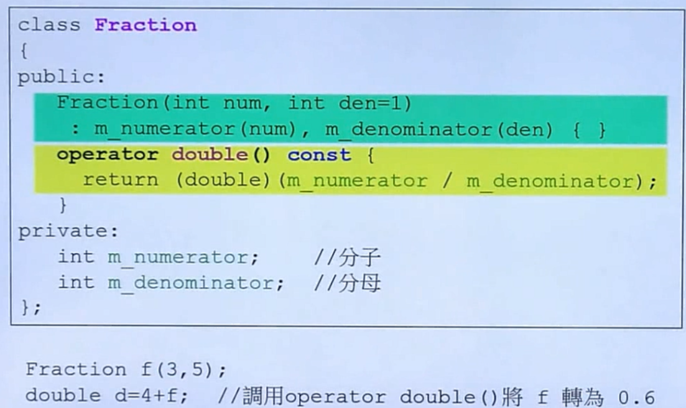

任何Fraction需要被转换为double类型的时候，自动调用double()函数进行转换。如上图所示，编译器在分析double d = 4 + f过程中判断4为整数，然后继续判断f，观察到f提供了double()函数，然后会对f进行double()操作，计算得到0.6，再与4相加，最后得到double类型的4.6。

C++中，一个参数的构造函数(或者除了第一个参数外其余参数都有默认值的多参构造函数)， 承担了两个角色。 1 是个构造器 ，2 是个默认且隐含的类型转换操作符。

所以， 有时候在我们写下如 AAA = XXX， 这样的代码， 且恰好XXX的类型正好是AAA单参数构造器的参数类型， 这时候编译器就自动调用这个构造器， 创建一个AAA的对象。

这样看起来好象很酷， 很方便。 但在某些情况下（见下面权威的例子）， 却违背了我们（程序员）的本意。 这时候就要在这个构造器前面加上explicit修饰， 指定这个构造器只能被明确的调用/使用， 不能作为类型转换操作符被隐含的使用。

explicit构造函数是用来防止隐式转换的。请看下面的代码：

```c
class Test1
{
public:
    Test1(int n)
    {
        num=n;
    }//普通构造函数
private:
    int num;
};
class Test2
{
public:
    explicit Test2(int n)
    {
        num=n;
    }//explicit(显式)构造函数
private:
    int num;
};
int main()
{
    Test1 t1=12;//隐式调用其构造函数,成功
    Test2 t2=12;//编译错误,不能隐式调用其构造函数
    Test2 t2(12);//显式调用成功
    return 0;
}
```

编译器报错如下：

```
错误	1	error C2440: “初始化”: 无法从“int”转换为“Test2”
```

Test1的构造函数带一个int型的参数，代码23行会隐式转换成调用Test1的这个构造函数。而Test2的构造函数被声明为explicit（显式），这表示不能通过隐式转换来调用这个构造函数，因此代码24行会出现编译错误。

普通构造函数能够被隐式调用。而explicit构造函数只能被显式调用。

### final 关键字与不可继承类

可见 [076.nocopyable.cpp](./src/076.nocopyable.cpp)

c++11推荐将一个类修饰为final类：

```cpp
class nocopyable2 final 
{
public:
	nocopyable2();
	~nocopyable2();
};
```

### 指针和引用的本质区别

- 指针传递参数本质上是 **值传递**的方式，它所传递的是一个地址值。值传递过程中，被调函数的形式参数作为被调函数的局部变量处理，即在栈中开辟了内存空间以存放由主调函数放进来的 实参的值，从而成为了实参的一个副本。值传递的特点是被调函数对形式参数的任何操作都是作为局部变量进行，不会影响主调函数的实参变量的值。（**这里是在说实参指针本身的地址值不会变**）
- 而在引用传递过程中， 被调函数的形式参数虽然也作为局部变量在栈中开辟了内存空间，但是这时存放的是由主调函数放进来的实参变量的地址。被调函数对形参的任何操作都被处理成间 接寻址，即通过栈中存放的地址访问主调函数中的实参变量。正因为如此，被调函数对形参做的任何操作都影响了主调函数中的实参变量。
- 引用传递和指针传递是不同的，虽然它们都是在被调函数栈空间上的一个局部变量，但是任何对于引用参数的处理都会通过一个间接寻址的方式操作到主调函数中的相关变量。而对于指针 传递的参数，如果改变被调函数中的指针地址，它将影响不到主调函数的相关变量。如果想通过指针参数传递来改变主调函数中的相关变量，那就得使用指向指针的 指针，或者指针引用。

为了进一步加深大家对指针和引用的区别，下面从编译的角度来阐述它们之间的区别：

程序在编译时分别将指 针和引用添加到**符号表**上，符号表上记录的是变量名及变量所对应地址。指针变量在符号表上对应的地址值为指针变量的地址值，而引用在符号表上对应的地址值为 引用对象的地址值。符号表生成后就不会再改，因此指针可以改变其指向的对象（指针变量中的值可以改），而引用对象则不能修改。换言之，指针变量的符号表地址指向的是一个“变量”，而引用变量符号表指向的是对象的地址，而该地址是不可变的，**可以理解为指针是个变量（int* p），而引用是个指针常量（int* const p）**，**引用只能在定义时被初始化一次，之后不可变。指针可变，引用“从一而终”，指针可以“见异思迁”**。**指针指向一块内存，它的内容是所指内存的地址；而引用则是某块内存的别名。**

## 二、函数专题

### iostream 的线程安全性

到现在，stdio函数是线程安全的，但是iostream在线程安全方面没有保证，就算单个operator<<是线程安全的，也不能保证原子性。cout << a << b;是两次函数调用，相当于cout.operator<<(a).operator<<(b)。两次调用中间可能会被打断进程上下文切换，造成输出内容不连续，会插入其他线程打印的字符。而fprintf(stdout, "%s %d", a, b);则是一次函数调用，而且是线程安全的，打印内容不会受到其他线程影响。所以iostream并不适合在多线程程序中做logging。

### inline内联函数

```c
inline double
imag(const complex& x)
{
  return x.imag ();
}
```

1、inline关键字用来定义一个类的内联函数，引入它的主要原因是用它替代C中表达式形式的宏定义,解决一些频繁调用的小函数大量消耗栈空间（栈内存）的问题。

2、inline的使用是有所限制的，inline只适合函数体内代码简单的函数使用，不能包含复杂的结构控制语句例如while、switch，并且不能内联函数本身不能是直接递归函数（即，自己内部还调用自己的函数）。

3、inline函数仅仅是一个对编译器的建议，所以最后能否真正内联，看编译器的意思，它如果认为函数不复杂，能在调用点展开，就会真正内联，并不是说声明了内联就会内联，声明内联只是一个建议而已。

4、定义在类中的成员函数缺省都是内联的，如果在类定义时就在类内给出函数定义，那当然最好。如果在类中未给出成员函数定义，而又想内联该函数的话，那在类外要加上inline，否则就认为不是内联的。例如下面这个例子：

```c
class complex
{ 
public:
    complex (double r = 0, double i = 0)
    : re (r), im (i)
    { }
    complex& operator += (const complex&);
    double real () const { return re; }
    double imag () const { return im; }
private:
    double re, im;
    friend complex& __doapl (complex*, const complex&);
};
```

其中构造函数、real和imag函数默认会成为inlien候选。

### 构造函数初始化

该部分参考 [C++类成员变量初始化顺序问题](./img/ctor_init_list.png)

> https://blog.csdn.net/no_sying_nothing/article/details/51958547

以前面的代码为例，改代码在构造函数初始化列表中给两个成员变量赋值：

```c
complex (double r = 0, double i = 0) : re (r), im (i)
```

当然也可以这样在构造函数体中初始化：

```c
complex (double r = 0, double i = 0)
{
    this.re = r;
    this.im = i;
}
```

这样做看似可以达到相同的效果，都给两个成员变量赋值了，但其实两者还是有本质区别的。使用构造函数参数赋值方式比在函数体内赋值效率要高。

类对象的构造顺序显示，进入构造函数体后，进行的是计算，是对成员变量的赋值操作，显然，赋值和初始化是不同的，这样就体现出了效率差异。如果不用成员初始化类表，那么类对自己的类成员分别进行的是一次隐式的默认构造函数的调用，和一次赋值操作符的调用，如果是类对象，这样做效率就得不到保障。

此外，构造函数需要初始化的数据成员，不论是否显式地出现在构造函数的成员初始化列表中，都会在该处完成初始化，并且初始化的顺序和其在类中声明时的顺序是一致的，与列表的先后顺序无关，所以要特别注意，保证两者顺序一致才能真正保证其效率和准确性。

总结：

* 成员变量在使用初始化列表初始化时，与构造函数中初始化成员列表的顺序无关，只与定义成员变量的顺序有关。因为成员变量的初始化次序是根据变量在内存中次序有关，而内存中的排列顺序早在编译期就根据变量的定义次序决定了。

* 如果不使用初始化列表初始化，在构造函数内初始化时，此时与成员变量在构造函数中的位置有关。

* 类中const成员常量必须在构造函数初始化列表中初始化。

* 静态成员是类所有的对象的共享的成员，而不是某个对象的成员。它在对象中不占用存储空间，这个属性为整个类所共有，不属于任何一个具体对象。所以静态成员不能在类的内部初始化，只能在类的外部初始化。比如声明一个学生类，其中一个成员为学生总数，则这个变量就应当声明为静态变量，应该根据实际需求来设置成员变量。

下面是C++类成员变量初始化顺序：

* 1、基类的静态变量或全局变量
* 2、派生类的静态变量或全局变量
* 3、基类的成员变量
* 4、派生类的成员变量

### 构造函数重载

下面是某类的两个构造函数：

```c
complex (double r = 0, double i = 0) : re (r), im (i){}
complex () : re(0), im(0) {}
```

这两个构造函数定义是没有问题的，但是在无参初始化该类对象时将产生冲突，因为第一个构造函数已经有参数默认初始化列表了，定义该类对象时可以不加入参数，这就产生了冲突。试想如下初始化对象，调用的是对象的哪个构造函数：

```
complex c1
```

### 派生类的构造函数与析构函数调用顺序

构造函数和析构函数的调用顺序是先构造的后析构，后构造的先析构。

构造函数的调用顺序规则如下所述：

1）	基类构造函数。如果有多个基类，则构造函数的调用顺序是某类在类派生表中出现的顺序，而不是它们在成员初始化表中的顺序。

2）	成员类对象构造函数。如果有多个成员类对象，则构造函数的调用顺序是对象在类中被声明的顺序，而不是它们出现在成员初始化表中的顺序。

3）	派生类构造函数。

而析构函数的调用顺序与构造函数的调用顺序正好相反，将上面3点内容中的顺序反过来用就可以了，即：首先调用派生类的析构函数；其次再调用成员类对象的析构函数；最后调用基类的析构函数。析构函数在下面3种情况时被调用：

1）对象生命周期结束被销毁时（一般类成员的指针变量与引用都不自动调用析构函数）。

2）delete指向对象的指针时，或delete指向对象的基类类型指针，而其基类虚构函数是虚函数时。

3）对象 i 是对象 o 的成员，o 的析构函数被调用时，对象 i 的析构函数也被调用。

### 移动构造函数与右值

先看下面这段代码：

```cpp
#include <iostream>
#include <stdlib.h>
using namespace std;

class Object
{
public:
	Object() {
		std::cout << "Object()" << std::endl;
	}
	~Object(){
	}

	Object(const Object& object) {
		std::cout << "Object(const Object&)" << std::endl;
	}
    
	Object getObject(void) {
		Object obj;
		return obj;
	}
};

int main(void)
{
	Object o1;
	Object o2 = o1.getObject();

	return 0;
}
```

代码中有一个Object类，object提供了无参和拷贝构造函数，除此之外还定义了一个getObject函数，在该函数中会创建一个Object临时对象，然后将其返回。在main函数中创建了一个Object o1，然后调用o1的getObject函数返回一个临时对象（右值），使用该临时对象来初始化Object o2。输出结果如下：

```
Object()
Object()
Object(const Object&)
```

可以看到，o1和obj临时对象的构造函数输出了，除此之外，o2的拷贝构造函数也调用了。其实在执行**Object o2 = o1.getObject();** 时，o1.getObject()返回右值时会创建一个临时对象，本应该再次调用一次构造函数，但是这里由于编译器的优化，这个临时对象就是函数中的obj 本身。所以本应该打印四次构造函数，但由于编译器的优化只打印了三次。

下面对代码进行改动，在Object类中添加移动构造函数：

```cpp
Object(const Object&& object) {
	std::cout << "Object(const Object&&)" << std::endl;
}
```

执行结果如下：

```
Object()
Object()
Object(const Object&&)
```

这次调用的是o2的移动构造函数，也就是说创建的临时对象obj的值直接赋值给了o2，中间不会再有临时对象产生，这就达到了我们想要的效果，**相当于临时对象obj的生命被延续到o2了**。

有了上面的基础之后就可以介绍move函数了，这个函数可以将一个左值转换为右值，下面修改测试代码，看看效果如何：

```cpp
int main(void)
{
	Object o1;
	Object o3 = move(o1);
    
	return 0;
}
```

运行结果如下：

```
Object()
Object(const Object&&)
```

调用的是o3对象的移动构造函数，换言之就是将o1对象的所有权转让给了o3，没有生成中间对象。

测试代码可见src/128.moveCopy.cpp。

### 常成员函数

在一个类中，如果成员函数中没有改变成员函数操作（例如get操作），那么建议在该方法声明处加入const关键字，如果不加入const关键字，那么c++编译器将认为该函数可能会修改类的成员变量，下面这个例子就演示了该现象，测试代码如下所示：00.const_member_func.cpp

```c
#include <iostream>
using namespace std;

class complex
{
public:
	complex(double r = 0, double i = 0)
		: re(r), im(i)
	{ }
	complex& operator += (const complex&);
	double real() const { return re; }
	double imag() const { return im; }
private:
	double re, im;
};

int main(void)
{
	const complex c1(2, 1);
	cout << c1.real() << endl;
	cout << c1.imag() << endl;
	return 0;
}
```

在类complex中，real和imag函数都使用了const修饰，在main函数中初始化了一个const修饰的complex对象c1，现在编译运行没有问题，输出结果如下：

```
2
1
```

但是如果去掉那两个函数的const修饰：

```c
double real()  { return re; }
double imag()  { return im; }
```

编译报错如下：

```
错误	1	error C2662: “double complex::real(void)”: 不能将“this”指针从“const complex”转换为“complex &”

错误	2	error C2662: “double complex::imag(void)”: 不能将“this”指针从“const complex”转换为“complex &”
```

### 函数参数传递

推荐传递引用，而非指针。一个对象的引用可以认为是给该对象起了个“别名”，对形参的操作其实就是对实参的操作。它们名字不一样，但指向的地址空间却是一样的，所以使用引用不会有函数列表中的“对象创建”开销：

```c
complex& operator += (const complex&);
```

如果采用该方法赋值：

```c
complex& operator += (const complex*);
```

那么进入函数时还需要为complex指针分配一些空间，在32位系统上指针是一个变量，会额外分配4 bytes空间（两个不同指针，但指向同一块地址）。

函数参数传递，如果不需要改变参数值，建议使用const reference减小开销。

### 函数返回引用

返回值建议使用引用，但如果返回引用的是该函数的一个局部变量，那么不能使用引用，因为该局部变量在函数调用后就以及销毁了，引用可以认为是给当前对象换了个别名，如果当前对象已经被销毁，那么该“别名”也就失去了意义，不存在了。例如下面这些函数绝不可return by reference，因为，它们返回的必定是local object：

```c
inline complex
operator + (const complex& x, const complex& y)
{
    return complex (real (x) + real (y),
imag (x) + imag (y));
}

inline complex
operator + (const complex& x, double y)
{
    return complex (real (x) + y, imag (x));
}
```

### 友元

相同class的各个objects互为friends（友元）：01.friends.cpp

```c
#include <iostream>
using namespace std;

class complex
{
public:
	complex(double r = 0, double i = 0)
		: re(r), im(i)
	{ }
	int func(const complex& param)
	{
		return param.re + param.im;
	}
private:
	double re, im;
};

int main(void)
{
	complex c1(2, 1);
	complex c2;
	cout << c2.func(c1) << endl;
	return 0;
}
```

### 拷贝构造函数

当一个类中存在指针类型的成员变量时，该类必须要提供拷贝构造函数和重载=运算符，通过这种方法可以避免“浅拷贝”问题（只是拷贝了指向某区间的地址，但没有拷贝其实际的内容，如果那个区间被释放了，该类析构时调用析构函数时将报错）。

例如：

```c
class String
{
public:
    String(const char* cstr = 0);
    String(const String& str);
    String& operator=(const String& str);
    ~String();
    char* get_c_str() const { return m_data; }
private:
    char* m_data;
};

inline
String::String(const char* cstr = 0)
{
    if (cstr) {
        m_data = new char[strlen(cstr)+1];
        strcpy(m_data, cstr);
    } else {
        // 未指定初值 
        m_data = new char[1];
        *m_data = '\0';
    }
}

inline
String::String(const String& str)
{
    m_data = new char[ strlen(str.m_data) + 1 ];//同类互为友元，故可以调用私有成员
    strcpy(m_data, str.m_data);
}

inline
String::~String()
{
    delete[] m_data;
}

```

可以这样调用：

```c
String s1(),
String s2("hello");
String* p = new String("hello");
delete p;
```

### 重载等号运算符

还是前面的String案例，这里给String类编写一个“=”重载函数：

```cpp
inline
String& String::operator=(const String& str)
{
    if (this == &str)
        return *this;

    delete[] m_data;
    m_data = new char[ strlen(str.m_data) + 1 ];
    strcpy(m_data, str.m_data);
    return *this;
}
```

从代码中可以看到，在正式进行拷贝操作前，代码通过一个

```c
if (this == &str)
    return *this;
```

判断是否是对象自身给自身赋值，这样做非常有必要，因为代码的下一行调用delete[]操作符清空了缓存区m_data的内容，然后再进行拷贝，如果不进行自检，那么如果是给自身赋值，那么麻烦就大了，该m_data中的内容已经清空了，无法赋值，这将导致错误。

### 重载前置++和后置++

看下面这个案例：

```cpp
class Complex
{
private:
	int a;
	int b;
public:
	Complex(int a, int b)
	{
		this->a = a;
		this->b = b;
	}
	// 前置++
	Complex& operator++()
	{
		this->a++;
		this->b++;
		return *this;
	}
	// 后置++
	Complex operator++(int)
	{
		Complex temp(a, b);
		this->a++;
		this->b++;
		return temp;
	}

	void printc()
	{
		cout << a << "+" << b << "i" << endl;
	}
};

int main(void)
{
	Complex c3(1,1);
	(c3++).printc(); // 1+1i
	c3.printc(); // 2+2i
	++c3;
	c3.printc(); // 3+3i
	return 0;
}
```

### 虚函数


### 仿函数


从上图可以看到，每个仿函数都是某个类重载“()”运算符，然后变成了“仿函数”，实质还是一个类，但看起来具有函数的属性。

### main函数执行前后

* main结束不代表整个进程结束。

* 全局对象的构造函数会在main 函数之前执行。

* 全局对象的析构函数会在main函数之后执行。

* 用atexit注册的函数也会在main之后执行。

* 一些全局变量、对象和静态变量、对象的空间分配和赋初值就是在执行main函数之前，而main函数执行完后，还要去执行一些诸如释放空间、释放资源使用权等操作。

* 进程启动后，要执行一些初始化代码（如设置环境变量等），然后跳转到main执行。全局对象的构造也在main之前。

* main()之后执行的代码，用atexit注册的函数也会在main之后执行。

* C++中，全局对象的构造函数会在main 函数之前执行。

在大多数的实现方式里，核心会运行专门的启动代码，启动代码会在启动main()之前完成所有的初始化工作，这其中当然包括了全局对象的初始化。这个所谓的启动代码就是Runtime函数库的Startup代码。在程序执行时，系统会先调用Startup，完成函数库初始化、进程信息设立、I/O stream产生，以及对static对象的初始化等动作。然后Startup调用main()函数，把控制权交给main()函数。main()函数执行完毕，控制权交回给Startup，进行反初始化动作。

## 三、内存管理专题

### 栈、堆、全局变量和静态变量

* Stack 是存在于某作用域（scope）的一块内存空间。例如当你调用函数，函数本身就会形成一个stack来放置它所接收的参数以及返回地址。在函数体内部声明的任何变量其所使用的内存块都来自上述stack。

* Heap ，或者称system heap，是指操作系统提供的一块global内存空间，程序可动态分配并从中获取若干区块。

下面这个例子中，c1所占用的空间来自stack，Complex(3)是个零时对象，其所占用的空间是以new从heap中动态分配而得，并由p指向：

```c
class Complex { … };
...
{
  Complex c1(1,2);
  Complex* p = new Complex(3);
}
```

c1是栈中分配内存的，其生命周期在作用域结束之时便结束了，这种作用域内的object又称auto object，因为它会被“自动”清理。

* static object生命在作用域之后仍然存在，直到整个程序结束：

```c
class Complex { … };
...
{
    static Complex c2(1,2);
}
```

* global object的生命周期

例如：

```c++
class Complex { … };
...
Complex c3(1,2);

int main()
{
    ...
}
```

上述案例中的c3便是golbal object，其生命周期在整个程序结束后才结束，可以视为是一种static object。

heap objects 的生命期是在object被delete后才结束：

```c
class Complex { … };
...
{
    Complex* p = new Complex;
    ...
    delete p;
}
```

下面这个案例是个错误案例，一个典型的内存泄露（memory leak）：

```c
class Complex { … };
...
{
    Complex* p = new Complex;
}
```

当作用域结束后，p所指向的heap的heap object仍然存在，但指针p的生命却结束了，作用域之外将再也看不到p（也就没有机会delete p）。

### 探索new和delete

* new操作可以看作是“先分配memory，再调用构造函数ctor”

例如：

```c
Complex* pc == new Complex(1,2);
```

这一过程可以认为是：

```c
void* mem = operator new( sizeof(Complex) ); //分配內存，内部调用malloc
pc = static_cast<Complex*>(mem); // 转型
pc->Complex::Complex(1,2);//调用构造函数
```

* delete操作可以认为是先调用析构函数，在释放memory

下面这个操作：

```c
Complex* pc = new Complex(1,2);
...
delete pc;
```

可以认为是：

```c
Complex::~Complex(pc); // 调用析构函数
operator delete(pc); // 释放内存，内部调用了free函数
```

### 探索delete释放数组资源是否导致内存泄漏

#### 1、探索POD动态数组内存释放

**首先看这段代码：**

```cpp
int main(void)
{
    int* array = new int[10];
    return 0;
}
```

new了10个int类型变量数组，但是没有释放，这很明显会导致内存泄漏，下面编译并使用valgrind工具查看下：

```shell
$ g++ delete.cpp -o del -g
$ valgrind ./del
==48504== Memcheck, a memory error detector
==48504== Copyright (C) 2002-2013, and GNU GPL'd, by Julian Seward et al.
==48504== Using Valgrind-3.10.1 and LibVEX; rerun with -h for copyright info
==48504== Command: ./del
==48504== 
==48504== 
==48504== HEAP SUMMARY:
==48504==     in use at exit: 40 bytes in 1 blocks
==48504==   total heap usage: 1 allocs, 0 frees, 40 bytes allocated
==48504== 
==48504== LEAK SUMMARY:
==48504==    definitely lost: 40 bytes in 1 blocks
==48504==    indirectly lost: 0 bytes in 0 blocks
==48504==      possibly lost: 0 bytes in 0 blocks
==48504==    still reachable: 0 bytes in 0 blocks
==48504==         suppressed: 0 bytes in 0 blocks
==48504== Rerun with --leak-check=full to see details of leaked memory
==48504== 
==48504== For counts of detected and suppressed errors, rerun with: -v
==48504== ERROR SUMMARY: 0 errors from 0 contexts (suppressed: 0 from 0)
```

LEAK SUMMARY 显示 *definitely lost: 40 bytes in 1 blocks*，一个块，总共40字节内存泄漏了。

**修改上面代码：**

```cpp
int main(void)
{
    int* array = new int[10];
    delete[] array;
    return 0;
}
```

同样地：

```shell
$ g++ delete.cpp -o del -g
$ valgrind ./del
==48583== Memcheck, a memory error detector
==48583== Copyright (C) 2002-2013, and GNU GPL'd, by Julian Seward et al.
==48583== Using Valgrind-3.10.1 and LibVEX; rerun with -h for copyright info
==48583== Command: ./del
==48583== 
==48583== 
==48583== HEAP SUMMARY:
==48583==     in use at exit: 0 bytes in 0 blocks
==48583==   total heap usage: 1 allocs, 1 frees, 40 bytes allocated
==48583== 
==48583== All heap blocks were freed -- no leaks are possible
==48583== 
==48583== For counts of detected and suppressed errors, rerun with: -v
==48583== ERROR SUMMARY: 0 errors from 0 contexts (suppressed: 0 from 0)
```

这个是正常的，没有内存泄漏： *All heap blocks were freed -- no leaks are possible*

**修改代码，使用delete释放内存**：

```shell
int main(void)
{
    int* array = new int[10];
    delete array;
    return 0;
}
```

结果如下：

```shell
$ g++ delete.cpp -o del -g
$ valgrind ./del
==48669== Memcheck, a memory error detector
==48669== Copyright (C) 2002-2013, and GNU GPL'd, by Julian Seward et al.
==48669== Using Valgrind-3.10.1 and LibVEX; rerun with -h for copyright info
==48669== Command: ./del
==48669== 
==48669== Mismatched free() / delete / delete []
==48669==    at 0x4C2C2BC: operator delete(void*) (in /usr/lib/valgrind/vgpreload_memcheck-amd64-linux.so)
==48669==    by 0x40077E: main (delete.cpp:15)
==48669==  Address 0x5a1c040 is 0 bytes inside a block of size 40 alloc'd
==48669==    at 0x4C2B800: operator new[](unsigned long) (in /usr/lib/valgrind/vgpreload_memcheck-amd64-linux.so)
==48669==    by 0x40076E: main (delete.cpp:13)
==48669== 
==48669== 
==48669== HEAP SUMMARY:
==48669==     in use at exit: 0 bytes in 0 blocks
==48669==   total heap usage: 1 allocs, 1 frees, 40 bytes allocated
==48669== 
==48669== All heap blocks were freed -- no leaks are possible
==48669== 
==48669== For counts of detected and suppressed errors, rerun with: -v
==48669== ERROR SUMMARY: 1 errors from 1 contexts (suppressed: 0 from 0)

```

*All heap blocks were freed -- no leaks are possible*，是的，没有看错使用delete释放动态数组内存不会导致内存泄漏，但是valgrind检测出了操作的错误：*Mismatched free() / delete / delete []*

#### 2、探究动态对象内存释放

先看这段代码：

```cpp
class Foo
{
public:
    Foo(){ cout << "call ctor" << endl; }
    ~Foo(){ cout << "call dtor" << endl; }
};

int main(void)
{
    Foo* array = new Foo[10];
    delete[] array;
    return 0;
}
```

有一个对象类Foo，然后在main函数中new了十个，最后使用delete[]释放这部分内存，使用valgrind测试结果如下：

```shell
$ g++ delete2.cpp -o del -g
$ valgrind ./del
==49036== Memcheck, a memory error detector
==49036== Copyright (C) 2002-2013, and GNU GPL'd, by Julian Seward et al.
==49036== Using Valgrind-3.10.1 and LibVEX; rerun with -h for copyright info
==49036== Command: ./del
==49036== 
call ctor
call ctor
call ctor
call ctor
call ctor
call ctor
call ctor
call ctor
call ctor
call ctor
call dtor
call dtor
call dtor
call dtor
call dtor
call dtor
call dtor
call dtor
call dtor
call dtor
==49036== 
==49036== HEAP SUMMARY:
==49036==     in use at exit: 0 bytes in 0 blocks
==49036==   total heap usage: 1 allocs, 1 frees, 18 bytes allocated
==49036== 
==49036== All heap blocks were freed -- no leaks are possible
==49036== 
==49036== For counts of detected and suppressed errors, rerun with: -v
==49036== ERROR SUMMARY: 0 errors from 0 contexts (suppressed: 0 from 0)
```

一切安好，创建十个对象，调用十次构造函数，使用delete[]后调用了十次析构函数，没有内存泄露，没有任何问题。

**接下来将delete[]修改为delete：**

```cpp
class Foo
{
public:
    Foo(){ cout << "call ctor" << endl; }
    ~Foo(){ cout << "call dtor" << endl; }
};

int main(void)
{
    Foo* array = new Foo[10];
    delete array;
    return 0;
}
```

做同样的测试：

```shell
$ g++ delete2.cpp -o del -g
$ valgrind ./del
==49185== Memcheck, a memory error detector
==49185== Copyright (C) 2002-2013, and GNU GPL'd, by Julian Seward et al.
==49185== Using Valgrind-3.10.1 and LibVEX; rerun with -h for copyright info
==49185== Command: ./del
==49185== 
call ctor
call ctor
call ctor
call ctor
call ctor
call ctor
call ctor
call ctor
call ctor
call ctor
call dtor
==49185== Invalid free() / delete / delete[] / realloc()
==49185==    at 0x4C2C2BC: operator delete(void*) (in /usr/lib/valgrind/vgpreload_memcheck-amd64-linux.so)
==49185==    by 0x400A95: main (delete2.cpp:21)
==49185==  Address 0x5a1c048 is 8 bytes inside a block of size 18 alloc'd
==49185==    at 0x4C2B800: operator new[](unsigned long) (in /usr/lib/valgrind/vgpreload_memcheck-amd64-linux.so)
==49185==    by 0x400A45: main (delete2.cpp:20)
==49185== 
==49185== 
==49185== HEAP SUMMARY:
==49185==     in use at exit: 18 bytes in 1 blocks
==49185==   total heap usage: 1 allocs, 1 frees, 18 bytes allocated
==49185== 
==49185== LEAK SUMMARY:
==49185==    definitely lost: 18 bytes in 1 blocks
==49185==    indirectly lost: 0 bytes in 0 blocks
==49185==      possibly lost: 0 bytes in 0 blocks
==49185==    still reachable: 0 bytes in 0 blocks
==49185==         suppressed: 0 bytes in 0 blocks
==49185== Rerun with --leak-check=full to see details of leaked memory
==49185== 
==49185== For counts of detected and suppressed errors, rerun with: -v
==49185== ERROR SUMMARY: 1 errors from 1 contexts (suppressed: 0 from 0)
```

调用了十次构造函数但只调用了一次析构函数。

不出所料，valgrind检查到了两个错误：*Invalid free() / delete / delete[] / realloc()*   和   *definitely lost: 18 bytes in 1 blocks*  。

如果直接运行这个程序，还会导致core dump：

```shell
*** Error in `./del': munmap_chunk(): invalid pointer: 0x0000000000903018 ***
Aborted (core dumped)
```

#### 3、总结

1、动态分配的对象调用delete时首先会调用析构函数，然后再释放内存，如果析构函数没有调用，那么说明该部分内存没有释放

2、普通的int类型值没有析构函数，所以使用delete释放动态数组也不会出现内存泄漏

3、对象类型释放内存前需要调用析构函数，使用delete处理一个动态数组只能析构首对象，其他的对象都无法被析构，这就导致了内存泄漏。

### new和malloc的区别

1、new分配内存按照数据类型进行分配，malloc分配内存按照指定的大小分配。

2、new返回的是指定对象的指针，而malloc返回的是void*，因此malloc的返回值一般都需要进行类型转化。

3、new不仅分配一段内存，而且会调用构造函数，malloc不会。

4、new分配的内存要用delete销毁，malloc要用free来销毁；delete销毁的时候会调用对象的析构函数，而free则不会。

5、new是一个操作符可以重载，malloc是一个库函数。

6、malloc分配的内存不够的时候，可以用realloc扩容。new没用这样操作。

7、new如果分配失败了会抛出bad_malloc的异常，而malloc失败了会返回NULL。

8、申请数组时： new[]一次分配所有内存，多次调用构造函数，搭配使用delete[]，delete[]多次调用析构函数，销毁数组中的每个对象。而malloc则只能sizeof(int) * n。

### 探索创建对象的内存分配情况

对于下面的complex类：

```c
class complex
{
	public:
		complex (double r = 0, double i = 0)
		: re (r), im (i)
		{ }
		complex& operator += (const complex&);
		double real () const { return re; }
		double imag () const { return im; }
	private:
		double re, im;
		friend complex& __doapl (complex*,
		const complex&);
};

class String
{
	public:
		String(const char* cstr = 0);
		String(const String& str);
		String& operator=(const String& str);
		~String();
		char* get_c_str() const { return m_data; }
	private:
		char* m_data;
};
```

在VC中动态分配的内存块情况如下：

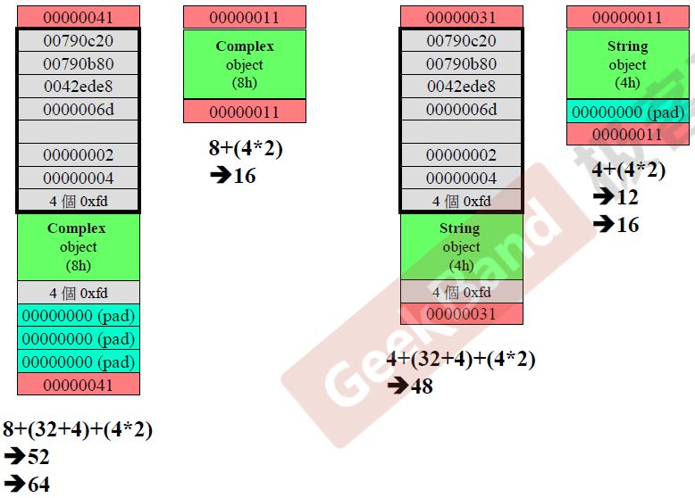

左边两个是类complex在调试模式和release模式下的编译器内存分配。在debug模式下，编译器给complex对象内存插入了头和尾（红色部分），4*8 + 4大小的信息部分（灰色部分），绿色部分是complex对象实际占用的空间.计算后只有52字节，但VC以16字节对齐，所以52最近的16倍数是64，还应该填补12字节的空缺（青色pad部分）。对于release部分的complex对象，只添加了信息头和尾部分（cookie，标记块大小)。string类的分析基本一样。

接下来看对于数组对象，VC编译器是如何分配的： 

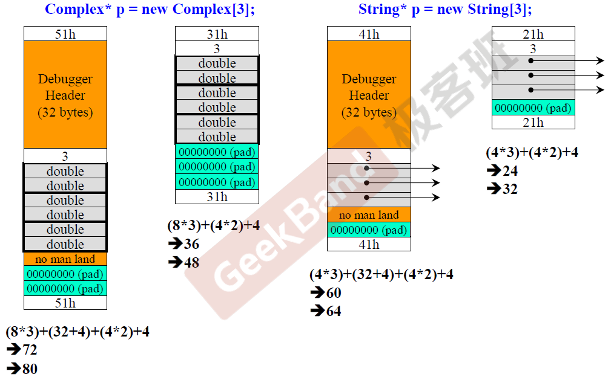

类似的，编译器给对象增加了一些冗余信息部分，对于complex类对象，由于数组有三个对象，则存在8个double，然后编译器在3个complex对象前插入“3”用于标记对象个数，通过cookie标记块大小。String类的分析方法也类似。

### 为什么array new 一定要搭配 array delete

更多内存分配内容详见内存分配专题。

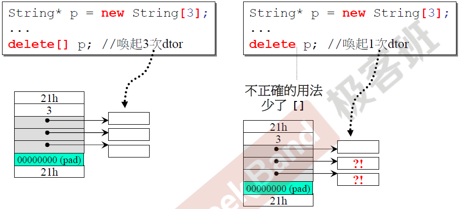

### 智能指针原理

下面这张图很好地说明了智能指针的内部结构和使用方法：

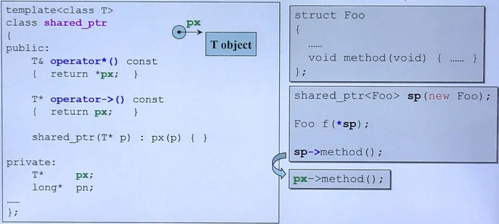

智能指针在语法上有三个很关键的地方，第一个是保存的外部指针，对应于上图的T* px，这个指针将代替传入指针进行相关传入指针的操作；第二个是重载'*'运算符，解引用，返回一个指针所指向的对象；第三个是重载“->”运算符，返回一个指针，对应于上图就是px。

迭代器也是一种智能指针，这里也存在上面提到的智能指针的三个要素，分别对应于下图的红色字体和黄色标注部分：


下面将仔细分析迭代器重载的“*”和“->”重载符：


创建一个list迭代器对象，list::iterator ite;这里的list用于保存Foo对象，也就是list模板定义里的class T，operator*()返回的是一个(*node).data对象，node是__link_type类型，然而__link_type又是__list_node<T>*类型，这里的T是Foo，所以node是__list_node<Foo>*类型,所以(*node).data得到的是Foo类型的一个对象，而&(operator*())最终得到的是该Foo对象的一个地址，即返回Foo* 类型的一个指针。

### 五种分配内存的调用方式

#### 1、malloc 和 free

```cpp
void* p1 = malloc(512);
free(p1);
```

#### 2、new 和 delete

```cpp
int* p1 = new int;
delete p1;
```

#### 3、::operator new 和 ::operator delete

```cpp
void* p1 = ::operator new(512);
operator delete(p1);
```

#### 4、placement new 和 placement delete

所谓placement new就是在用户指定的内存位置上构建新的对象，这个构建过程不需要额外分配内存，只需要调用对象的构造函数即可。

下面这段代码：

```cpp
class foo{};
foo* pfoo = new foo;
```

pfoo指向的对象的地址你是不能决定的，因为new已经为你做了这些工作。第一步分配内存，第二步调用类的构造函数。而placement new是怎么做的呢，说白了就是把原本new做的两步工作分开来。第一步你自己分配内存，第二步你调用类的构造函数在自己分配的内存上构建新的对象。

例如：

```cpp
// 1、分配内存
char* buff = new char[ sizeof(Foo) * N ];
memset( buff, 0, sizeof(Foo)*N );

// 2|构建对象
Foo* pfoo = new (buff)Foo;

// 3、使用对象
pfoo->print();
pfoo->set_f(1.0f);
pfoo->get_f();

// 4、析构对象，显式的调用类的析构函数。
pfoo->~Foo();

// 5、销毁内存
delete [] buff;
```

上面5个步骤是标准的placement new的使用方法。

placement new的好处：

* 在已分配好的内存上进行对象的构建，构建速度快。
* 已分配好的内存可以反复利用，有效的避免内存碎片问题。

究其本质，placement new的底层操作也是调用了operator new函数，但是是另一个重载后的operator new函数，该函数返回的是传入的指针地址：

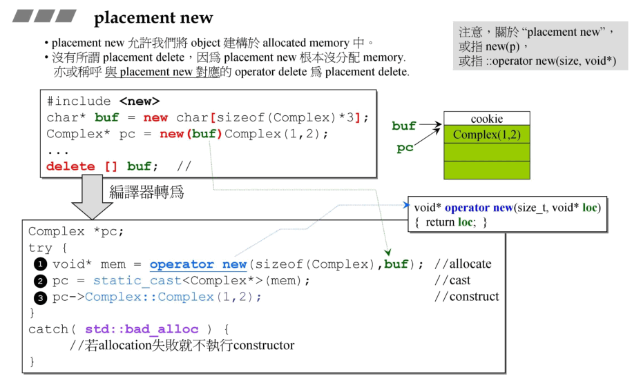

#### 5、allocator 分配器

```cpp
#ifdef _MSC_VER
	int* p1 = allocator<int>().allocate(3, (int*)0);// (int*)0 无用
	allocator<int>().deallocate(p1, 3);
#endif

#ifdef __GNUC__
	void* p2 = alloc::allocate(512);
	alloc::deallocate(p2, 512);
#endif
```

#### 6、new 和 delete的内部调用过程

new的底层调用了operator new，而operator new底层调用了malloc：

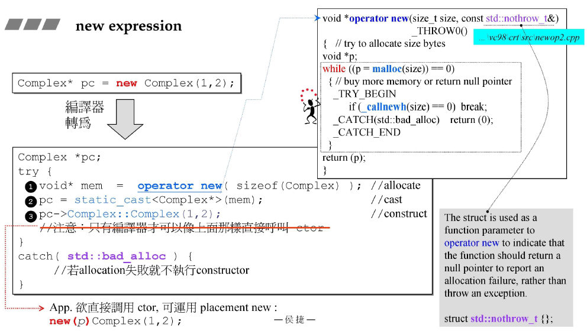

delete 操作内部调用了operator delete，而operator delete 内部调用了free：

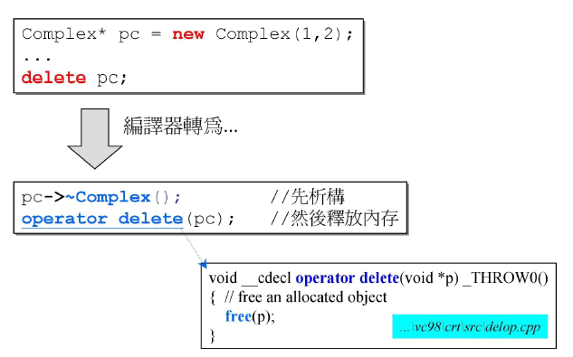

### 重载::operator new 和 ::operator delete

看下面这张图：


上图中重载了operator new、operator new[]、operator delete 和 operator delete[]四个函数。但是这四个函数的重载会对对象的这些操作有着相当深远的影响，因为这些操作会覆盖c++原生提供的这些操作。

所有的new或者delete等操作在内部其实也是调用了operator new这类重载操作：


下面是一个重载这些操作的案例：


对于该案例的使用情况：


需要注意的是，对象的析构函数是否是虚析构函数对内存的分配是有影响的，前面说过，如果一个类的内部有虚函数，那么c++会给该类额外分配一块空间用于保存虚函数表，虚析构函数也同样遵循这样的原理。

如果在使用new或delete时使用::new等方式，那么还是使用c++提供的原生global操作：


### 重载delete()和new()操作符


### malloc(0)

在C99的标准里面解释到，如果给malloc传递0参数，其返回值是依赖于编译器的实现，但是不管返回何值，该指针指向的对象是不可以访问的。在VC6编译环境下，输出“got a Valid pointer”。

linux系统中malloc(0)是允许的，并且返回一个非NULL的指针。

当malloc分配内存时它除了分配我们指定SIZE的内存块，还会分配额外的内存来存储我们的内存块信息，用于维护该内存块。因此，malloc（0）返回一个合法的指针并指向存储内存块信息的额外内存，我们当然可以在该内存上进行读写操作，但是这样做了会破坏该内存块的维护信息，因此当我们调用free(ptr)时就会出现错误。

即使该内存可以读写内容，这块内存它并不属于当前用户，所以没有当前用户没有权限调用free来释放该资源，所以会报错；换言之，如果哪天这块内存被malloc内存池分配器分配给其他程序，那么看到的内容可能就不一样了。

### malloc的底层实现

请务必看这两篇文章 ：

[linux-malloc底层实现原理](./img/malloc.png)   https://blog.csdn.net/wz1226864411/article/details/77934941

[malloc底层实现原理](./img/malloc2.png)   https://www.cnblogs.com/zpcoding/p/10808969.html#_label3

​		在已经映射的内存空间结尾有一个break指针，这个指针下面是映射好的内存，可以访问，上面则是未映射的访问，不能访问。可以通过系统调用sbrk(位移量)来移动brk指针的位置，同时返回brk指针的位置，达到申请内存目的。brk(void *addr)系统调用可以直接将brk设置为某个地址，成功返回0，不成功返回-1。而rlimit则是限制进程堆内存容量的指针。
​		在操作系统角度来看，分配内存有两种方式，一种是采用推进brk指针来增加堆的有效区域来申请内存空间，还有一种是采用mmap是在进程的虚拟地址空间中（堆和栈中间，称为文件映射区域的地方）找一块空闲的虚拟内存。这两种方式都是分配虚拟内存，只有当第一次访问虚拟地址空间时，操作系统给分配物理内存空间。
malloc**默认采用brk**的方式来动态分配内存。然而**请求内存大于128K（可由M_MMAP_THRESHOLD选项调节），那就不是去推_edata指针了，而是利用mmap系统调用，从堆和栈的中间分配一块虚拟内存**。这样做主要是因为brk分配的内存需要等到高地址内存释放以后才能释放，而mmap分配的内存可以单独释放。

​		那么来谈一下空间内配的实现问题。其中一种是隐式链表，实际上是数组，malloc分配空间必然有一个数据结构，允许它来区分边界，区分已分配和空间的空间，数据结构中包含一个头部信息和有效载荷，有效载荷的首地址就是malloc返回的地址，可能在尾部还有填充，为了保持内存对齐。头部相当于该数据结构的元数据，其中包含了块大小和是否是空闲空间的信息，这样可以根据头地址和块大小的地址推出下一个内存块的地址，这就是隐式链表。

### allocator内存分配器原理

​		对于当下流行的STL allocator分配器，其本质上也是调用了malloc函数。

​		SGI STL和GCC2.9，对于大于128B的空间直接就是malloc()和free()了，没有什么特殊的；不过它还是仿造C++的new handler形式设置了一个malloc exception handler；这样就和C++的new行为相一致了，你可以设置malloc失败时的exception handler。

​		对于小于128B的请求采用了次级分配器；说白了就是SGI维护一个内存池来处理这些请求，以保证效率。它会将请求的字节数n圆整到8的倍数，比如如果请求的是14B的空间，其实获得的是16B；从这也可以得出SGI一共有16个链表需要维护，每个链表对应一个分配级别，对应的内存块大小分别是：8、16、24、…、128。

​		前面的SGI分配器的目的其实是为了减少cookie，malloc分配的空间头尾都有带有一块cookie，用于标记该块的长度，malloc内存块越多，那么cookie也越多，这对程序员来说是一笔没有必要的开销和浪费，所以SGI打算自己管理这块空间，通过一次性malloc大块内存的方式来减少cookie。但是当下流行的STL allocator并没有采用该方案，而是简单地封装了malloc函数。个人认为，当下的计算机内存和资源都非常充足，这些cookie带来的额外的开销几乎可以忽略，malloc内部其实也做了类似的“内存池”管理，如果使用SGI的方法显得有些多余，毕竟带来了复杂。

## 四、模板专题

### 模板

#### 类模板


#### 继承中的类模板语法

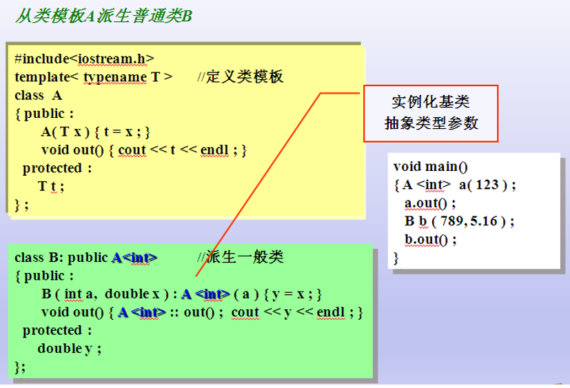

结论: 子类从模板类继承的时候,需要让编译器知道 父类的数据类型具体是什么(数据类型的本质:固定大小内存块的别名)。

#### 在类外部声明模板

一个类模板的案例如下：

```c
template<class T>//声明一个模板，虚拟类型名为T
class Operation {
public:
    Operation (T a, T b):x(a),y(b){}
    T add(){
        return x+y;
    }
    T subtract(){
        return x-y;
    }
private:
    T x,y;
};
```

Operation类的成员函数是写在该类内部的，但很多情况下.h文件和.cpp文件会分离开写，成员函数会在.h文件中定义，在.cpp文件中实现，这时就需要注意了，以add函数为例，如果该函数写在类的外部，那么：

```c
template<class T>
T Operation<T>::add(){
    return x+y;
}
```

#### 类模板中的static关键字

* 从类模板实例化的每个模板类有自己的类模板数据成员，该模板类的所有对象共享一个static数据成员。
* 和非模板类的static数据成员一样，模板类的static数据成员也应该在文件范围定义和初始化。
* 每个模板类有自己的类模板的static数据成员副本。

看下面的例子，观察类模板中的static 变量是如何初始化的：

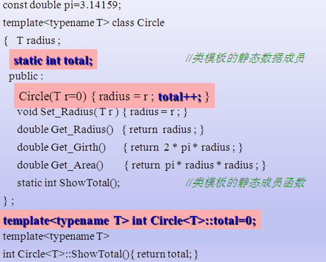

看下面例子，观察类模板中的static 变量是如何被调用的：

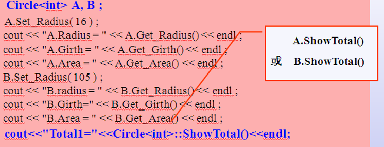

#### 函数模板


与类模板不同的是，函数模板在使用是不需要显式地声明传入参数类型，编译器将自动推导类型。

下面看这个例子，注意观察输出结果：

```c
#include <iostream>
using namespace std;

int Max(int a, int b)
{
	cout << "int Max(int a, int b)" << endl;
	return a > b ? a : b;
}

template<typename T>
T Max(T a, T b)
{
	cout << "T Max(T a, T b)" << endl;
	return a > b ? a : b;
}

template<typename T>
T Max(T a, T b, T c)
{
	cout << "T Max(T a, T b, T c)" << endl;
	return Max(Max(a, b), c);
}


void main()
{
	int a = 1;
	int b = 2;

	cout << Max(a, b) << endl; //当函数模板和普通函数都符合调用时,优先选择普通函数 int Max(int a, int b)
	cout << Max<>(a, b) << endl; //若显示使用函数模板,则使用<> 类型列表 T Max(T a, T b)

	cout << Max(3.0, 4.0) << endl; //如果 函数模板产生更好的匹配 使用函数模板 T Max(T a, T b)

	cout << Max(5.0, 6.0, 7.0) << endl; //重载 T Max(T a, T b, T c)

	cout << Max('a', 100) << endl;  //调用普通函数 可以隐式类型转换  int Max(int a, int b)
	system("pause");
	return;
}
```

运行结果如下：

```
int Max(int a, int b)
2
T Max(T a, T b)
2
T Max(T a, T b)
4
T Max(T a, T b, T c)
T Max(T a, T b)
T Max(T a, T b)
7
int Max(int a, int b)
100
```

那么，为什么函数模板可以和函数重载放在一块。C++编译器是如何提供函数模板机制的？

* 编译器并不是把函数模板处理成能够处理任意类的函数。
* 编译器从函数模板通过具体类型产生不同的函数。
* 编译器会对函数模板进行两次编译，在声明的地方对模板代码本身进行编译；在调用的地方对参数替换后的代码进行编译，一份模板函数最终会生成多个对应类型的函数。如果该编译器认为该函数可以被inline，那么将会被inline展开（g++ -O2 优化选项）。

#### 成员模板


成员模板在泛型编程里用得较多，为了有更好的可扩展性，以上图为例，T1往往是U1的基类，T2往往是U2的基类，可以看下面这个例子：


通过这种方法，只要传入的U1和U2的父类或者祖类是T1和T2，那么通过这样的方式可以实现继承和多态的巧妙利用，但反之就不行了。这样的方式在STL中用得很多：


#### 模板偏化

正如其名，模板偏化指的是模板中指定特定的数据类型，这和泛化是不同的：


当然，模板偏化也有程度之分，可以部分类型指定，称之为偏特化。

#### 个数偏特化


#### 范围偏特化


### 模板模板参数


## 五、对象与类型专题


### 结构体
这里只放出一个案例：
```c
#define _CRT_SECURE_NO_WARNINGS

#include<iostream>
#include<string.h>
#include<cstring>

using namespace std;
struct student{ //声明一个结构体类型student
	int num;
	char name[20];
	int age;
};//最后有一个分号
int main(){
	struct student stu1;//定义一个student类型的变量stu1
	student stu2;//定义时也可以不用struct
	stu1.num = 1;//单独对st1的num元素赋值
	char temp[20] = "Xiao ming";
	strncpy(stu1.name, temp, strlen(temp));
	stu1.age = 10;
	cout << stu1.num << " " << stu1.name << " " << stu1.age << endl;
	student *stu3 = &stu1;//stu3是结构体的指针，指向stu1
	(*stu3).num = 2;//stu1的num值被修改成了2；
	cout << stu1.num << " " << stu1.name << " " << stu1.age << endl;
	return 0;
}
```
运行结果如下：
```
1 Xiao ming烫烫烫烫烫
 10
2 Xiao ming烫烫烫烫烫
 10
```
这里需要注意的是，如果结构体内部使用了字符数组，要使用strcpy或者strncpy函数来复制。

### 共用体
共用体用关键字union来定义，它是一种特殊的类。在一个共用体里可以定义多种不同的数据类型，这些数据共享一段内存，在不同的时间里保存不同的数据类型和长度的变量，以达到节省空间的目的。但同一时间只能存储其中一个成员变量的值。

下面是用unino判断系统是大端还是小端对齐：
```c
#include<iostream>
using namespace std;
union TEST{
	short a;
	char b[sizeof(short)];
};
int main(){
	TEST test;
	test.a = 0x0102;// 不能引用共用体变量，只能引用共用体变量中的成员。
	if (test.b[0] == 0x01 && test.b[1] == 0x02){
		cout << "big endian." << endl;
	}
	else if (test.b[0] == 0x02 && test.b[1] == 0x01){
		cout << "small endian." << endl;
	}
	else{
		cout << "unknown" << endl;
	}
	return 0;
}
```
### 枚举

在实际问题中，有些变量的取值被限定在一个有限的范围内。例如，一个星期只有7 天，一年只有12个月，一个班每周有6门课程等。如果把这些量说明为整型，字符型或其他类型显然是不妥当的。为此，c语言提供了一种称为“枚举"的类型，枚举类型在C++中也同样适用。在“枚举"类型的定义中列举出所有可能的取值，用来说明该“枚举"类型的变量取值不能超过定义的范围。应该说明的是，枚举类型是一种基本数据类型，而不是一种构造类型，因为它不能再分解为任何其他基本类型。

枚举的声明方式为：
```c
enum 枚举类型 { 枚举常量表列 };
```
枚举元素不是字符常量也不是字符串常量，使用时不要加单、双引号。
```c
#include<iostream>
using namespace std;
int main(){
	enum weather{ sunny, cloudy, rainy, windy };
	/*其中sunny=0,cloudy=1,rainy=2,windy=3,
	默认地，第一个枚举子被赋值为0*/
	enum fruits{ apple = 3, orange, banana = 7, bear };
	/*也可以显式地赋值，接下来的枚举子取值是前面一个枚举子的取值+1，即orange=4，bear=8*/
	cout << orange << endl;
	enum big_cities{ guangzhou = 1, shenzhen = 3, beijing = 1, shanghai = 2 };
	/*同一枚举中的枚举子的取值不需要唯一*/
	return 0;
}
```
### 结构体、共用体在内存单元占用字节数的计算

机器上各个数据类型所占的存储空间如下所述。
* char：8bit=1 byte
* short：16bit=2 byte
* int：32bit=4 byte
* long：64bit=8 byte
* float：32bit=4 byte
* double：64bit=8 byte
* long long：64bit=8 byte

其中，long类型在32位机器上只占4Byte,其他类型在32位机器和64位机器都是占同样的大小空间。

#### union 的字节数计算
```c
#include<iostream>
using namespace std; 
union A{
   int a[5];
   char b;
   double c;
};
int main(){
   cout<<sizeof(A)<<endl;
   return 0;
}
```
union中变量共用内存，应以最长的为准，可是程序的执行结果却不是预想的20（int a[5]，5 *4 =20Byte）,这是因为在共用体内变量的默认内存对齐方式，必须以最长的double （8Byte）对齐，也就是说应该**是sizeof(A)=24**。所以将共用体中的int a[5]修改成int a[6]后，结果仍然不变；但如果将int a[6]修改成int a[7]，结果就将变成32。

#### struct 的字节数计算

在默认对齐方式下，结构体成员的内存分配满足下面三个条件

* 结构体第一个成员的地址和结构体的首地址相同。
* 结构体每个成员地址相对于结构体首地址的偏移量（offset）是该成员大小的整数倍（即该变量前面所有变量字节数之和是该变量类型的整数倍），如果不是则编译器会在成员之间添加填充字节（internal adding）。
* 结构体总的大小要是其成员中最大size的整数倍，如果不是编译器会在其末尾添加填充字节（trailing padding）。
* static修饰的结构体成员不占用结构体字节数，因为静态变量的存储地址跟结构体的实例地址无关。
* 空结构体的字节数为1，因为必须保证结构体的实例地址唯一。

```c
#include<iostream>
using namespace std;
struct B{
	char a;
	double b;
	int c;
}test_struct_b;
int main(){
	cout << sizeof(test_struct_b) << endl;
	return 0;
}
```
执行结果是24。这是因为char a的偏移量为0，占用1 Byte；double b指的是下一个可用的地址的偏移量为1，不是sizeof(double)=8，需要补足7 Byte才能使偏移量变为8；int c指的是下一个可用的地址的偏移量为16，是sizeof(int)=4的倍数，满足int的对齐方式。

故所有成员变量都分配了空间，空间总的大小为1+7+8+4：20，不是结构的节边界数（即结构中占用最大空间的类型所占用的字节数sizeof(doub1e)=8）的倍数，所以需要填充 4 Byte，以满足结构的大小为sizeof(double)=8的倍数，即**24**。

当然，也有方法可以改变这一规则，那就是是公用#pragma pack设置字节对齐大小，这部分了解即可：

```cpp
struct F
{
	char a;
	short b;
	double c;
	float d;
	char e;
};


#pragma back(push)
#pragma pack(2) // 2 bytes对齐
struct E
{
	char a;
	short b;
	double c;
	float d;
	char e;
};
#pragma back(pop)


int main(void)
{
	int FCount = sizeof(F);
	cout << "F count = " << FCount << endl;  //F count = 24

	int ECount = sizeof(E);
	cout << "E count = " << ECount << endl;  //E count = 18

	return 0;
}
```


### 访问级别
C++中继承方式包括public（公用的）、private（私有的）和protected（受保护的），此项是可选的，如果不写此项，则默认为private（私有的）。

派生类的成员函数访问基类的成员和在派生类外访问基类的成员涉及如何确定基类的成员在派生类中的访问属性的问题，不仅要考虑对基类成员所声明的访问属性，还要考虑派生类所声明的对基类的继承方式，根据这两个因素共同决定基类成员在派生类中的访问属性。在派生类中，对基类的继承方式可以有public(公用的）、private(私有的）和protected(保护的）3种 不同的继承方式决定了基类成员在派生类中的访问属性。简单地说可以总结为以下几点。

* 公用继承(public inheritance)：基类的公用成员和保护成员在派生类中保持原有访问属性，其私有成员仍为基类私有。

* 私有继承（private inheritance)：基类的公用成员和保护成员在派生类中成了私有成员，其私有成员仍为基类私有。

* 受保护的继承（protected inheritance)：基类的公用成员和保护成员在派生类中成了保护成员，其私成员仍为基类私有。保护成员的意思是，不能被外界引用，但可以被派生类的成员引用。

C++中子类对外访问属性表：

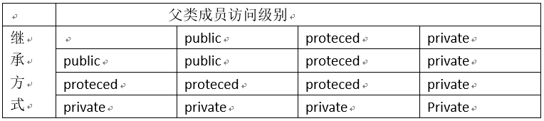


### 隐含的this指针

每个成员函数都有一个指针形参，它的名字是固定的，叫做this指针。this指针是隐式的，并且它是成员函数的第一个参数。以运算符重载为例：
```c
inline complex&
__doapl(complex* ths, const complex& r)
{
    ths->re += r.re;
    ths->im += r.im;
    return *ths;
}

inline complex&
complex::operator += (const complex& r)
{
    return __doapl (this, r);
}
```
其中加号运算符重载函数等价于：
```c
inline complex&
complex::operator += (this, const complex& r)
{
    return __doapl (this, r);
}
```

this指针有如下特点：

（1）只能在成员函数中使用（构造函数也可，但不推荐），在全局函数、静态成员函数中都不能使用this。

（2）this指针是在成员函数的开始前构造，并在成员函数的结束后清除。

（3）this指针会因编译器不同而有不同的存储位置，可能是栈、寄存器或全局变量。

（4）this是类的指针。

（5）因为this指针只有在成员函数中才有定义，所以获得一个对象后，不能通过对象使用this指针，所以也就无法知道一个对象的this指针的位置。不过，可以在成员函数中指定 this指针的位置。

（6）普通的类函数（不论是非静态成员函数，还是静态成员函数）都不会创建一个函数表来保存函数指针，只有虚函数才会被放到函数表中。


### virtual 继承

虚拟继承是多重继承特有的概念。虚拟基类是为了解决多重继承而出现的。例如A继承了Y,Z。而Y,Z继承自X，因此A两次出现了类x中的变量和函数，可以将Y,Z定义为虚拟继承。而x则变成了虚拟继承的基类

class X{ }；

class Y： public virtual X{ }；

class Z： public virtual X{ }；

class A ：public Y， public Z{ }；

上述的X,Y,Z,A中都没有任何一个class中含有明显的数据，只表明了之间的继承关系。所以认为每个的大小都为0？当然不对。即使是class X的大小也不为0。

```cpp
#include <iostream>
using namespace std;

class A{
public:
	void doIt(){ cout << "A ..." << endl;  }
};
class B :public virtual A{};
class C : public virtual A{};
class D :public B, public C{};

int main()
{
	int a, b, c, d;

	a = sizeof(A);
	b = sizeof(B);
	c = sizeof(C);
	d = sizeof(D);

	cout << a << b << c << d << endl; // 1448

	A aa;
	B bb;
	C cc;
	D dd;

	aa.doIt(); // A ...
	bb.doIt(); // A ...
	cc.doIt(); // A ...
	dd.doIt(); // A ...

	return 0;
}

```

### 多态

C++中使用virtual函数可以实现多态。多态简单说就是“父类指针指向子类，并可以调用子类的函数（virtual函数）”。下面是一个多态的使用案例：
```c
#include<iostream>
using namespace std;
class Father{
public:
	virtual void print()
	{
		cout << "Father's print ...." << endl;
	}

	void printX()
	{
		cout << "Father's printX ...." << endl;
	}
};
class Son : public Father
{
public:
	virtual void print()
	{
		cout << "Son's print ...." << endl;
	}

	void printX()
	{
		cout << "Son's printX ...." << endl;
	}

	void prntY()
	{
		cout << "Son's printY ...." << endl;
	}
};
int main()
{
	Father father;
	father.print();
	father.printX();
	cout << "------------------------------------" << endl;
	Son son;
	son.print();
	son.printX();
	son.prntY();
	cout << "------------------------------------" << endl;
	Father* fa = &son;
	fa->print();
	fa->printX();
	//fa->printY(); //error !!!
	return 0;
}
```
在该案例中定义了一个Father类，该类在案例中作为父类出现。在Father类中定义了两个函数，一个是print函数，该函数定义为virtual函数；另一个是printX函数，没有带上virtual关键字。这里这样设置的目的是为了测试virtual多态和关键字virtual之间的联系。

子类为Son，public继承与父类Father，在子类中还重写了父类中的print和printX函数，除此之外，子类中还定义了一个printY函数。

在测试代码中的第一部分：
```c
Father father;
father.print();
father.printX();
```
测试父类的两个函数，输出结果如下：
```
Father's print ....
Father's printX ....
```
接下类是子类的函数测试：
```c
Son son;
son.print();
son.printX();
son.prntY();
```
输出结果如下：
```
Son's print ....
Son's printX ....
Son's printY ....
```
接下来测试多态：
```c
Father* fa = &son;
fa->print();
fa->printX();
//fa->printY(); //error !!!
```
输出结果如下：
```
Son's print ....
Father's printX ....
```
定义为virtual函数的print函数打印结果是子类实现的，但没有设置为virtual函数的printX则调用的还是父类的函数。所以要实现多态，一个关键还在于virtual函数。在多态部分的测试中尝试使用fa对象调用子类特有的printY函数，但这样做会报错，毕竟fa对象是Father类型的，这里需要特别注意。


### bind1st 和 bind2nd

标准库提供一组函数适配器，用来特殊化或者扩展一元和二元函数对象。常用适配器是：

绑定器（binder）: binder通过把二元函数对象的一个实参绑定到一个特殊的值上，将其转换成一元函数对象。C＋＋标准库提供两种预定义的binder适配器：bind1st和bind2nd，前者把值绑定到二元函数对象的第一个实参上，后者绑定在第二个实参上。

例如：

```cpp
#include <iostream>
#include <algorithm>
#include <functional>
#include <vector>
using namespace std;

template<class T>
struct Mygreater : public binary_function<T, T, bool> // 一定要继承该类： public binary_function<T, T, bool>
{	
	bool operator()(const T& _Left, const T& _Right) const
	{	
		return (_Left > _Right);
	}
};

int main(void)
{
	vector<int>  v1;
	for (int i = 0; i<5; i++)
	{
		v1.push_back(i + 1);
	}
	// 打印数组内容
	for (vector<int>::iterator it = v1.begin(); it != v1.end(); it++)
	{
		cout << *it << " "; // 1 2 3 4 5
	}
	cout << endl;

	int num1 = count_if(v1.begin(), v1.end(), bind1st(Mygreater<int>(), 2));// 绑定Mygreater函数的第一个参数（2 > v1[i]），结果是得到比2小的数量
	cout << "bind1st result :" << num1 << endl; // bind1st result : 1

	int num2 = count_if(v1.begin(), v1.end(), bind2nd(Mygreater<int>(), 2));// 绑定Mygreater函数的第二个参数（v1[i] > 2），结果是得到比2大的数量  
	cout << "bind2nd result :" << num2 << endl; // bind2nd result : 3

	return 0;
}
```


### 虚指针和虚函数表


如上图所示，定义了三个类，A、B和C，B继承于A,C继承于B，A中有两个虚函数，B中有一个，C中也有一个。编译器将A的对象a在内存中分配如上图所示，只有两个成员变量m_data1和m_data2，与此同时，由于A类有虚函数，编译器将给a对象分配一个空间用于保存虚函数表，这张表维护着该类的虚函数地址（动态绑定），由于A类有两个虚函数，于是a的虚函数表中有两个空间（黄蓝空间）分别指向A::vfunc1()和A::vfunc2()；同样的，b是B类的一个对象，由于B类重写了A类的vfunc1()函数，所以B的虚函数表（青色部分）将指向B::vfunc1()，同时B继承了A类的vfunc2()，所以B的虚函数表（蓝色部分）将指向父类A的A::vfunc2()函数；同样的，c是C类的一个对象，由于C类重写了父类的vfunc1()函数，所以C的虚函数表（黄色部分）将指向C::vfunc1()，同时C继承了超类A的vfunc2()，所以B的虚函数表（蓝色部分）将指向A::vfunc2()函数。同时上图也用C语言代码说明了编译器底层是如何调用这些函数的，这便是面向对象继承多态的本质。

下面做一个实验，实验代码在src/116.vptr.cpp：

```cpp
using namespace std;

class Base
{
public:
	virtual void fun1()
	{
		cout << "Base func1...." << endl;
	}
	virtual void fun2()
	{
		cout << "Base func2...." << endl;
	}
	void func3()
	{
		cout << "Base func3...." << endl;
	}
};

class Son : public Base
{
public:
	virtual void fun1()
	{
		cout << "Son func1...." << endl;
	}
	virtual void fun2()
	{
		cout << "Son func2...." << endl;
	}
	void func3()
	{
		cout << "Son func3...." << endl;
	}
	void func4()
	{
		cout << "Son func4..." << endl;
	}
};

int main(void)
{
	Base* base = new Base;
	base->func3(); // Base func3....

	cout << "----------------" << endl;

	Son* son = new Son;
	son->fun1(); // Son func1....
	son->fun2(); // Son func2....
	son->func3(); // Son func3....
	son->func4(); // Son func4...

	cout << "------------------" << endl;

	base = son;
	base->fun1(); // Son func1....
	base->fun2(); // Son func2....
	base->func3(); // Base func3....
	//base->func4(); // error

	cout << "----------------" << endl;

	Son* son2 = dynamic_cast<Son*>(base);
	son2->fun1(); // Son func1....
	son2->fun2(); // Son func2....
	son2->func3(); // son func3....
	son2->func4(); // Son func4...

	cout << "----------------" << endl;

	Base* base2 = nullptr;
	base2 = dynamic_cast<Base*>(son);
	base2->fun1(); // Son func1....
	base2->fun2(); // Son func2....
	base2->func3(); // Base func3....
	//base2->func4(); // error

	return 0;
}
```

该实验中有Base父类和Son子类，然后使用了多态，让父类指针指向子类。从结果可以看到：

1、父类指向子类后，如果调用子类中的虚函数，则调用的是子类虚函数；

2、如果调用和父类同名的非虚函数，那么还是使用父类的函数（例如func3函数）；

3、父类不能调用子类自己定义的函数（例如func3），任何妄图使用父类指针想调用子类中的未覆盖父类的成员函数的行为都会被编译器视为非法。

至于这是为什么，深入探索可参考：

[C++虚函数表解析](./img/vptr.png)

> https://www.cnblogs.com/findumars/p/6358207.html?utm_source=itdadao&utm_medium=referral

前面提到，如果调用和父类同名的非虚函数，那么还是使用父类的函数，详见参考文献中的“一般继承”部分中的子类函数表。

### 虚析构函数

C++中，构造函数不能声明时为虚函数，这是因为编译器在构造对象时，必须知道确切类型，才能正确地生成对象；其次，在构造函数执行之前，对象并不存在，无法使用指向此对象的指针来调用构造函数。然而，析构函数可以声明为虚函数；c++明确指出，当 derived class对象经由一个base class指针被删除、而该base class带着一个non-virtual析构函数，会导致对象的derived成分没被销毁掉，如下所示，析构函数不是虚函数容易引发内存泄漏：
```c
#include<iostream>
using namespace std;
class Base{
public:
	Base(){ std::cout << "Base::Base()" << std::endl; }
	~Base(){ std::cout << "Base::~Base()" << std::endl; }
};
class Derive :public Base{
public:
	Derive(){ std::cout << "Derive::Derive()" << std::endl; }
	~Derive(){ std::cout << "Derive::~Derive()" << std::endl; }
};
int main(){
	Base* pBase = new Derive();
	/*这种base classed的设计目的是为了用来"通过base class接口处理derived class对象"*/
	delete pBase;
	return 0;
}
```
运行结果如下：
```
Base::Base()
Derive::Derive()
Base::~Base()
```
要解决该问题很简单，只需要将父类析构函数设置为虚析构函数即可：
```c
virtual ~Base(){ std::cout << "Base::~Base()" << std::endl; }
```
运行结果如下：
```
Base::Base()
Derive::Derive()
Derive::~Derive()
Base::~Base()
```
### 虚函数常见问题

#### 1、虚函数表中放什么，子类和父类是否共用一份虚函数表

- 虚函数表属于类，类的所有对象共享这个类的虚函数表。
- 不同对象虚函数表是一样的（虚函数表的第一个函数地址相同）。
- 每个对象内部都保存一个指向该类虚函数表的指针vptr，每个对象的vptr的存放地址都不一样，但是都指向同一虚函数表。
- 虽然这个虚函数表为所有类共享，但每个对象的vptr指针却是不相同的，每个对象vptr指向的一些虚函数也会不同，换言之，**不同对象vptr指向的该表中的内容会有所不同**。

子类先是从父类复制了一个虚函数表，如果子类对父类的虚函数进行了覆盖，则在子类的虚函数表将会用子类重写的虚函数地址覆盖父类的，如果没有覆盖，则还是使用父类的函数地址，这样就实现了多态。

**虚函数表指针一般放在一个类的起始位置**，该部分的实验代码可见src/116.vptr2.cpp：

```cpp
#include <iostream>
using namespace std;

class Base{
public:
	int x;
	char c;
	Base(){};               //构造函数
	virtual ~Base(){};      //析构函数

	virtual void func(void){
		cout << "virtual func" << endl;
	};
};

class Son1 : public Base
{

};

class Son2 : public Base
{
	virtual void func(void){
		cout << "son2 's virtual func" << endl;
	};
};

int main()
{
	Base* base = new Base;
	cout << "对象的起始地址为：" << base << endl; // 对象的起始地址为：00956848
	cout << "对象obj的大小为:  " << sizeof(*base) << endl; // 虚函数表指针地址：00956848

	typedef void(*Fun)(void);  //定义函数指针类型
	Fun pFun = NULL;           //定义函数指针
	cout << "虚函数表指针地址：" << (int*)base << endl;  // 虚函数表指针地址：00956848
	cout << "虚函数表 — 第一个函数地址：" << *((int*)*(int*)base + 1) << endl; // 虚函数表 — 第一个函数地址：2167456
	pFun = (Fun)*((int*)*(int*)base + 1);
	pFun(); // virtual func

	cout << "------------------------------------------" << endl;

	Son1* son1 = new Son1;
	cout << "对象的起始地址为：" << son1 << endl; // 对象的起始地址为：0095C658
	cout << "对象obj的大小为:  " << sizeof(*son1) << endl; // 对象obj的大小为 : 12

	typedef void(*Fun)(void);  //定义函数指针类型
	Fun pFun2 = NULL;           //定义函数指针
	cout << "虚函数表指针地址：" << (int*)son1 << endl; // 虚函数表指针地址：0095C658
	cout << "虚函数表 — 第一个函数地址：" << *((int*)*(int*)son1 + 1) << endl; // 虚函数表 — 第一个函数地址：2167456
	pFun2 = (Fun)*((int*)*(int*)son1 + 1);
	pFun2(); // virtual func

	cout << "------------------------------------------" << endl;

	base = son1;

	cout << "对象的起始地址为：" << base << endl; // 对象的起始地址为：0095C658
	cout << "对象obj的大小为:  " << sizeof(*base) << endl; // 对象obj的大小为 : 12

	typedef void(*Fun)(void);  //定义函数指针类型
	Fun pFun3 = NULL;           //定义函数指针
	cout << "虚函数表指针地址：" << (int*)base << endl; // 虚函数表指针地址：0095C658
	cout << "虚函数表 — 第一个函数地址：" << *((int*)*(int*)base + 1) << endl; // 虚函数表 — 第一个函数地址：2167456
	pFun3 = (Fun)*((int*)*(int*)base + 1);
	pFun3(); // virtual func

	cout << "------------------------------------------" << endl;

	Son2* son2 = new Son2;
	cout << "对象的起始地址为：" << son2 << endl; // 对象的起始地址为：0095C670
	cout << "对象obj的大小为:  " << sizeof(*son2) << endl; // 对象obj的大小为 : 12

	typedef void(*Fun)(void);  //定义函数指针类型
	Fun pFun4 = NULL;           //定义函数指针
	cout << "虚函数表指针地址：" << (int*)(&son2) << endl; // 虚函数表指针地址：0073FEE0
	cout << "虚函数表 — 第一个函数地址：" << *((int*)*(int*)son2 + 1) << endl; // 虚函数表 — 第一个函数地址：2167536
	pFun4 = (Fun)*((int*)*(int*)son2 + 1);
	pFun4(); // virtual func

	cout << "------------------------------------------" << endl;

	base = son2;

	cout << "对象的起始地址为：" << base << endl; // 对象的起始地址为：0095C670
	cout << "对象obj的大小为:  " << sizeof(*base) << endl; // 对象obj的大小为 : 12

	typedef void(*Fun)(void);  //定义函数指针类型
	Fun pFun5 = NULL;           //定义函数指针
	cout << "虚函数表指针地址：" << (int*)base << endl; // 虚函数表指针地址：0095C670
	cout << "虚函数表 — 第一个函数地址：" << *((int*)*(int*)base + 1) << endl; // 虚函数表 — 第一个函数地址：2167536
	//pFun5 = (Fun)*((int*)*(int*)base + 1);
	pFun5 = (Fun)((int*)*(int*)base)[1];

	pFun5(); // virtual func

	delete base;
	delete son1;
	return 0;
}
```

注意，可以通过：

```cpp
pFun5 = (Fun)*((int*)*(int*)base + 1);
pFun5 = (Fun)((int*)*(int*)base)[1];
```

两种方式来调用虚函数，虚函数在虚函数表的位置和定义的顺序相关，下面这张图很好地表示了其虚函数指针和虚函数表的内存分配：

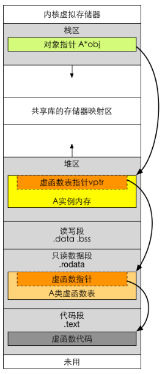

#### 2、构造函数可以是虚函数吗

从C++之父Bjarne的回答我们应该知道C++为什么不支持构造函数是虚函数了，简单讲就是没有意义。虚函数的作用在于通过子类的指针或引用来调用父类的那个成员函数。而构造函数是在创建对象时自己主动调用的，不可能通过子类的指针或者引用去调用。

网络上还有一个很普遍的解释是这样的：虚函数相应一个指向vtable虚函数表的指针，但是这个指向vtable的指针事实上是存储在对象的内存空间的。假设构造函数是虚的，就须要通过 vtable来调用，但是对象还没有实例化，也就是内存空间还没有，怎么找vtable呢？所以构造函数不能是虚函数。

#### 3、虚函数表存放地址

* 微软的编译器将虚函数表存放在了目标文件或者可执行文件的常量段中

* gcc编译器的实现中虚函数表vtable存放在可执行文件的只读数据段.rodata中

### this指针和动态绑定

this指针其实可以认为是指向当前对象内存地址的一个指针，如上图所示，由于基类和子类中有虚函数，this->Serialize()将动态绑定，等价于(*(this->vptr)[n])(this)。可以结合上节虚指针和虚函数表来理解，至于最后为什么这样写是正确的，下面将解释。

先看下面这张图：


图中有一个层次的继承关系C->B->A，首先看这部分代码：
```c
B b;
A a = (A)b;
a.vfunc1();
```
这部分代码中a.vfunc1()不是动态绑定的，因为a的初始化不是通过指针指向子类对象来实现的，只是使用强制转换b实现，没有用到“多态”的特性。所以在编译成汇编语言后是调用call指令到一个确定的地址执行vfunc1函数，而且这个vfunc1函数是属于A类的，并非子类的（上图蓝色部分）。

在看下面这张图：


接下来继续看这部分代码：
```c
A* pa = new B;
pa->vfunc1();

pa = &b;
pa->vfunc1();
```
这部分中，pa是一个A类型的指针，但都是通过指向子类B对象来初始化的，这里就用到了多态。这样初始化后pa调用vfunc1函数便是动态绑定的，调用的是子类B的vfunc1。

### 对象的存储空间

#### 1、空类占用的存储空间

```c
#include<iostream>
using namespace std;
class CBox{
};
int main(){
	CBox boxobj;
	cout << sizeof(boxobj) << endl;//1
}

```
程序执行结果是1。空类型对象中不包含任何信息，应该大小为0但是当声明该类型的对象的时候，它必须在内存中占有一定的空间，否则无法使用这些对象。至于占用多少内存，由编译器决定。C++中每个空类型的实例占1Byte空间。

#### 2、有成员变量类占用的存储空间
```c
#include<iostream>
using namespace std;
class CBox{
	int length, width, height;
};
int main(){
	CBox boxobj;
	cout << sizeof(boxobj) << endl;
	return 0;
}
```
程序运行结果为12。类CBox中只有3个成员变量，由于整型变量占4Byte，所以对象所占的空间就是12Byte。

#### 3、有静态变量类占用的存储空间
```c
#include<iostream>
using namespace std;
class CBox{
	int length, width, height;
	static int count;
};
int main(){
	CBox boxobj;
	cout << sizeof(boxobj) << endl;
	return 0;
}
```
类CBox中有3个普通数据成员和1个静态数据成员，比前面例子中多了一个静态数据成员，但是程序的执行结果还是12，也就证明了静态数据成员是不占对象的内存空间的。

#### 4、只有成员函数类占用的存储空间
```c
#include<iostream>
using namespace std;
class CBox{
	int foo();
};
int main(){
	CBox boxobj;
	cout << sizeof(boxobj) << endl;
	return 0;
}
```
结果是1。类CBox中只有一个成员函数，类CBox的对象boxobj的大小却只有1 Byte, 和空类对象是一样的，所以可以得出，成员函数是不占空间的。

#### 5、类中构造函数、析构函数占用空间
```c
#include<iostream>
using namespace std;
class CBox{
public:
	CBox(){};
	~CBox(){};
};
int main(){
	CBox boxobj;
	cout << sizeof(boxobj) << endl;
	return 0;
}
```
运行结果是1。类CBox中只有构造函数和析构函数，类CBox的对象boxobj的大小也只有 1Byte,和空类对象是一样的，所以可以得出，构造函数和析构函数也是不占空间的。

#### 6、类中含有虚析构函数占用空间
```c
#include<iostream>
using namespace std;
class CBox{
public:
	CBox(){};
	virtual ~CBox(){};
};
int main(){
	CBox boxobj;
	cout << sizeof(boxobj) << endl;//4
	return 0;
}
```
输出结果是4。类CBox中有1个构造函数和1个虚的析构函数，程序的执行结果是4。事实上，编译器为了支持虚函数，会产生额外的负担，这正是指向虚函数表的指针的大小。（指针变量在32位的机器上占4 Byte）如果一个类中有一个或者多个虚函数，没有成员变量，那么类相当于含有一个指向虚函数表的指针，占用4 Byte。

#### 7、子类占用存储空间大小
```c
#include<iostream>
using namespace std;
class A{
};
class B{
};
class C :public A{
};
class D :public virtual B{
};
class E :public A, public B{
};
int main(){
	A a;
	B b;
	C c;
	D d;
	E e;
	cout << "sizeof(a):" << sizeof(a) << endl;
	cout << "sizeof(b):" << sizeof(b) << endl;
	cout << "sizeof(c):" << sizeof(c) << endl;
	cout << "sizeof(d):" << sizeof(d) << endl;
	cout << "sizeof(e):" << sizeof(e) << endl;
	return 0;
}
```
输出结果为：
```
sizeof(a):1
sizeof(b):1
sizeof(c):1
sizeof(d):4
sizeof(e):1
```
上面案例定义了一个空类A和B，类C继承了类A，类D继承了虚基类B，类E继承了类A和类B。这些类的对象所占的空间都是1Byte。由此可见，单一继承的空类空间也是 1，多重继承的空类空间还是1，但是虚继承涉及虚表（虚指针），所以sizeof(d)=4。

#### 8、总结

综上所述，每个对象所占用的存储空间只是该对象的非静态数据成员的总和，其他都不占用存储空间，包括成员函数和静态数据成员。函数代码是存储在对象空间之外的，而且，函数代码段是公用的，即如果对同一个类定义了10个对象，这些对象的成员函数对应的是同一个函数代码段，而不是10个不同的函数代码段。

### C++类型转换

参考 [c++类型转换](https://blog.csdn.net/qq_40421919/article/details/90677220)

类型转换有c 风格的,当然还有c++风格的。c风格的转换的格式很简单(TYPE) EXPRESSION,但是 c 风格的类型转换有不少的缺点,有的时候用c 风格的转换是不合适的,因为它可以在任意类型之间转换,比如你可以把一个指向const 对象的指针转换成指向非const 对象的指针,把一个指向基类对象的指针转换成指向一个派生类对象的指针,这两种转换之间的差别是巨大的,但是传统的c 语言风格的类型转换没有区分这些。还有一个缺点就是,c 风格的转换不容易查找,他由一个括号加上一个标识符组成,而这样的东西在c++程序里有不少。所以c++为了克服这些缺点,引进了4种新的类型转换操作符：

类型|作用
---|---
static_cast|静态类型转换
reinterpreter_cast|	重新解释类型转换。
dynamic_cast|	子类和父类之间的多态类型转换。
const_cast|	去掉const属性转换

下面将逐一介绍它们的用法。

####  static_cast 静态类型转换

* static_cast<目标类型>（标识符）
* 所谓的静态,即在编译期内即可决定其类型的转换,用的也是最多的一种
* 该方法在编译期间会做类型检查，但c风格的强制类型转换不会，相对安全

```c
#include <iostream>
using namespace std;

int main(void)
{
	double dPi = 3.1415926;
	int num1 = (int)dPi;    //c语言的旧式类型转换
	int num2 = dPi;         //隐式类型转换
	// 静态的类型转换:   
	// 在编译的时 进⾏行基本类型的转换 能替代c⻛风格的类型转换 可以进⾏行⼀一部分检查     
	int num3 = static_cast<int> (dPi); //c++的新式的类型转换运算符   
	cout << "num1:" << num1 << " num2:" << num2 << " num3:" << num3 << endl;// num1:3 num2:3 num3:3
	return 0;
}
```

#### dynamic_cast 子类与父类之间的多态类型准换

* dynamic_cast<目标类型>（标识符）
* 用于多态中父子类之间的多态转换

```c
#include<iostream>

class Animal {
public:
	virtual void cry() = 0;
};

class Dog : public Animal
{
public:
	virtual void cry()
	{
		std::cout << "旺旺" << std::endl;
	}
	void dohome()
	{
		std::cout << "看家" << std::endl;
	}
};

class Cat : public Animal
{
public:
	virtual void cry()
	{
		std::cout << "喵喵" << std::endl;
	}
	void dohome()
	{
		std::cout << "抓老鼠" << std::endl;
	}
};

int main()
{
	Animal* base = NULL;
	base = new Cat();
	base->cry();// 喵喵

	std::cout << "--------------------" << std::endl;
	//⽤用于将⽗父类指针转换成⼦子类，
	Dog	*pDog = dynamic_cast<Dog*>(base); //此时转换时失败的，因为父类指针现在指向的对象是猫，所以转换狗是失败的。
	//转换失败返回空（NULL）
	if (pDog != NULL)
	{
		pDog->cry();
		pDog->dohome();
	}
	std::cout << "--------------------" << std::endl;
	Cat* pCat = dynamic_cast<Cat*>(base); //此时转换成功，成功将父类指针转换成子类指针
	if (pCat != NULL)
	{
		pCat->cry();// 喵喵
		pCat->dohome();// 抓老鼠
	}

	system("pause");
	return 0;
}
```
运行结果如下：
```
喵喵
--------------------
--------------------
喵喵
抓老鼠
```
#### const_cast 去掉const属性转换

* const_cast<目标类型>（标识符）:目标类型只能是指针或者引用

```c
#include<iostream>

class A {
public:
	int data;
};

int main()
{
	const A a = { 200 };
	//A a1 = const_cast<A>(a);    //错误，const_cast 目标类型只能是引用或者指针
	//a1.data = 100;

	A& a2 = const_cast<A&>(a);
	a2.data = 100;
	std::cout << a.data << ' ' << a2.data << std::endl;

	A* a3 = const_cast<A*>(&a);
	a3->data = 100;
	std::cout << a.data << ' ' << a3->data << std::endl;

	const int x = 3;

	int& x1 = const_cast<int&>(x);
	x1 = 200;
	std::cout << x << ' ' << x1 << std::endl;

	int* x2 = const_cast<int*>(&x);
	*x2 = 300;
	std::cout << x << ' ' << *x2 << std::endl;

	system("pause");
	return 0;
}
```
运行结果如下：
```
100 100
100 100
3 200
3 300
```

#### reinterpret_cast 重新解释类型转换

* reinterpret_cast<目标类型>（标识符）
* 数据的二进制重新解释，但是不改变其值

```c
#include<iostream>

class Animal {
public:
	void cry()
	{
		std::cout << "Animal cry" << std::endl;
	}
};

class Book {
public:
	void look()
	{
		std::cout << "Book look " << std::endl;
	}
};

int main()
{
	Animal* a = new Animal();
	a->cry();
	Book* b = reinterpret_cast<Book*>(a);  //强制类型的转换
	b->look();
	system("pause");
	return 0;
}
```
运行结果如下：
```
Animal cry
Book look
```


### RTTI

RTTI是运行阶段类型识别(Runtime Type Identification)的简称。这是新添加到c++中的特性之一，很多老式实现不支持。另一些实现可能包含开关RTTI的编译器设置。RTTI旨在为程序在运行阶段确定对象类型提供一种标准方式。很多类库已经成为其父类对象提供了实现这种方式的功能。但由于c++内部并不支持，因此各个厂商的机制通常互不兼容。创建一种RTTI语言标准将使得未来的库能够彼此兼容。

C++有3个支持RTTI的元素：

* 如果可能的话，dynamic_cast 运算符将使用一个指向基类的指针来生成一个指向派生类的指针；否则，该运算符返回0——空指针。

* typeid 运算符返回一个指出对象的类型的值。

* type_info 结构存储了有关特定类型的信息。

typeid和dynamic_cast都会去查询type_info

更多内容务必参考该文章 [C++ 中的RTTI机制详解](./img/RTTI.png)

> https://www.cnblogs.com/xuelisheng/p/9479288.html

### RAII

RAII是Resource Acquisition Is Initialization（资源获取即初始化）的简称，是C++语言的一种管理资源、避免泄漏的惯用法。利用的就是C++构造的对象最终会被销毁的原则。RAII的做法是使用一个对象，在其构造时获取对应的资源，在对象生命期内控制对资源的访问，使之始终保持有效，最后在对象析构的时候，释放构造时获取的资源。

RAII是用来管理资源、避免资源泄漏的方法。在计算机系统中，资源是数量有限且对系统正常运行具有一定作用的元素。比如：网络套接字、互斥锁、文件句柄和内存等等，它们属于系统资源。由于系统的资源是有限的，就好比自然界的石油，铁矿一样，不是取之不尽，用之不竭的，所以，我们在编程使用系统资源时，都必须遵循一个步骤：

* 1、申请资源
* 2、使用资源
* 3、释放资源

第一步和第三步缺一不可，因为资源必须要申请才能使用的，使用完成以后，必须要释放，如果不释放的话，就会造成资源泄漏。

下面是muduo网络库中的MutexLockGuard案例：

```cpp
class MutexLockGuard : boost::noncopyable
{
 public:
  explicit MutexLockGuard(MutexLock& mutex)
    : mutex_(mutex)
  {
    mutex_.lock();
  }

  ~MutexLockGuard()
  {
    mutex_.unlock();
  }

 private:

  MutexLock& mutex_;
};

}
```

在使用多线程时，经常会涉及到共享数据的问题，C++中通过实例化std::mutex创建互斥量，通过调用成员函数lock()进行上锁，unlock()进行解锁。不过这意味着必须记住在每个函数出口都要去调用unlock()，也包括异常的情况，这非常麻烦，而且不易管理。muduo网络库通过MutexLockGuard封装了这一系列操作。同样地，C++11为互斥量提供了一个RAII语法的模板类std::lock_guard，其会在构造函数的时候提供已锁的互斥量，并在析构的时候进行解锁，从而保证了一个已锁的互斥量总是会被正确的解锁。

## 六、STL 相关

### vector的push_back()方法的实现

需要注意如下几点：

* push_back()函数是浅拷贝，会将对象的复制到vector中。
* push_back()函数调用过程中，如果当前vector的长度等于其容量，那么会导致扩容，容量变为之前的两倍。
* 在新增数据的时候，就要分配一块更大的内存，将原来的数据复制过来，释放之前的内存，在插入新增的元素。
* 对vector的任何操作，**一旦引起空间重新配置，指向原vector的所有迭代器就都失效了**。

### vector 与 list，删除元素后指针和迭代器的变化

* vector和list都是左闭又开区间 **[**begin, end**)**；
* 删除末尾元素，返回end()位置迭代器位置；
* 删除中间元素，返回该元素的下一个元素位置迭代器。

### map和set有什么区别

map和set都是C++的关联容器，其底层实现都是红黑树（RB-Tree）。由于 map 和set所开放的各种操作接口，RB-tree 也都提供了，所以几乎所有的 map 和set的操作行为，都只是转调 RB-tree 的操作行为。

map和set区别在于：

（1）map中的元素是key-value（关键字—值）对：关键字起到索引的作用，值则表示与索引相关联的数据；Set与之相对就是关键字的简单集合，set中每个元素只包含一个关键字。

（2）**set的迭代器是const的，不允许修改元素的值；map允许修改value，但不允许修改key。**其原因是因为map和set是根据关键字排序来保证其有序性的，如果允许修改key的话，那么首先需要删除该键，然后调节平衡，再插入修改后的键值，调节平衡，如此一来，严重破坏了map和set的结构，导致iterator失效，不知道应该指向改变前的位置，还是指向改变后的位置。所以STL中将set的迭代器设置成const，不允许修改迭代器的值；而map的迭代器则不允许修改key值，允许修改value值。

（3）**map支持下标操作，set不支持下标操作。**map可以用key做下标，map的下标运算符[ ]将关键码作为下标去执行查找，如果关键码不存在，则插入一个具有该关键码和mapped_type类型默认值的元素至map中，因此下标运算符[ ]在map应用中需要慎用，const_map不能用，只希望确定某一个关键值是否存在而不希望插入元素时也不应该使用，mapped_type类型没有默认值也不应该使用。如果find能解决需要，尽可能用find。

### multiset和multimap插入重复元素原理

multiset和multimap的底层数据结构是红黑树，其中set的key和value是同一个值。

STL中的rb_tree提供了**insert_unique()**和**insert_equal()**两个函数。前者表示节点的Key一定在整个tree中独一无二，否则插入失败；后者表示节点的key可以重复。

### 有了vector为什么还要stack

* stack默认使用的容器是deque，stack的底层容器可以使用vector和list

* stack不提供迭代器

stack下可以使用vector做容器，是zero-overhead abstraction。 屏蔽了一些vector不必要的接口，充分维护了stack这一先入后出容器的概念。 容器配接器(container adapter)和容器分离是STL做的比较好的一点，这给予了我们根据不同需要切换内部容器的自由。

### STL迭代器模板萃取

因为迭代器需要知道该序列中的元素是否是class类型的。

STL中算法需要传入迭代器，由于是泛型编程，所以可以传入各种不同的迭代器。

然而，不同类型的迭代器里面的数据和类型（int类型或者class类型）是不相同的，操作方式也是不相同的（例如前向、后向迭代器）。算法需要迭代器声明它到底是哪种类型，长度多少，指向元素的类型：

```cpp
typedef Category category ; // 迭代器的类型
typedef Value value_type ; // 迭代器指向元素类型
typedef Distance difference_type ; // 迭代器指向空间长度
typedef Pointer pointer ;
typedef Reference reference ;
```

对于一个正统的Iterator来说，提供这些是非常容易的，Iterator是一个类，可以在类中定义这些东西。但是对于Int*这类指针来说就不好处理了，原生的指针也是一种迭代器，也可以遍历和访问。要解决这个问题就要采取模板萃取的方法了，通过萃取方式来获取到迭代器的类型：


**这里的*class iterators*指的是普通的类似于vector<int>::iterator这种迭代器，而*no-class iterators*指的是int* 这种迭代器，因为指针也可以看作是一种弱化的迭代器。**

算法algorithm需要知道迭代器指向元素类型，但int*这类指针无法提供value_type，于是使用模板特化的方式来间接获取到其类型，经过萃取后可以直接拿到int类型。

这便是萃取的作用。

### STL 线程安全

一般说来，stl对于多线程的支持仅限于下列两点：

1、多个读取者是安全的。即多个线程可以同时读取一个容器中的内容。 即此时多个线程调用 容器的不涉及到写的接口都可以 eg find, begin, end 等.

2、对不同容器的多个写入者是安全的。即多个线程对不同容器的同时写入合法。 但是对于同一容器当有线程写,有线程读时,如何保证正确? 需要程序员自己来控制，比如：线程A读容器某一项时，线程B正在移除该项。这会导致一下无法预知的错误。 通常的解决方式是用开销较小的临界区（CRITICAL_SECTION）来做同步。

### vector 的resize和reserve

* resize不会引起迭代器失效，但reserve会

* resize只是改变容器中元素数量，如果resize大小比先前大，那么将填充新元素，否则将截断后面元素

* 在添加新元素（例如push_back）时可能会导致扩容，引起迭代器失效

实验可见 [](./src/121.vector_resize_reverse.cpp)

### 如何释放vector占用内存

参考 [vector释放内存之swap方法](https://www.cnblogs.com/xiaobingqianrui/p/9092051.html)

一般，我们都会通过vector中成员函数clear进行一些清除操作，但它清除的是所有的元素，使vector的大小减少至0，却不能减小vector占用的内存。要避免vector持有它不再需要的内存，这就需要一种方法来使得它从曾经的容量减少至它现在需要的容量，这样减少容量的方法被称为“收缩到合适（shrink to fit）”。（节选自《Effective STL》）如果做到“收缩到合适”，就要使用“swap”，即通过如下代码进行释放过剩的容量，详细代码见[](./src/123.vector_swap.cpp)：

```c++
...
vec.reserve(16);
cout << vec.size() << "----" << vec.capacity() << endl; // 7----16

//vector<int>().swap(vec); // 释放vector内存
//cout << vec.size() << "----" << vec.capacity() << endl; // 0----0

vector<int>(vec).swap(vec);
cout << vec.size() << "----" << vec.capacity() << endl; // 7----7
```

swap交换技巧实现内存释放思想：vector()使用vector的默认构造函数建立临时vector对象，再在该临时对象上调用swap成员，swap调用之后对象myvector占用的空间就等于一个默认构造的对象的大小，临时对象就具有原来对象v的大小，而该临时对象随即就会被析构，从而其占用的空间也被释放。就前面案例而言，vector<int>(vec)临时对象拷贝构造函数拷贝了vec的size和元素，该部分的size和capacity都是7，然后该临时对象和vec交换，vec的size和capacity变成7，临时对象的size为7，capacity为16，然后被析构了。

注意：并不是所有的STL容器的clear成员函数的行为都和vector一样。事实上，其他容器的clear成员函数都会释放其内存。比如另一个和vector类似的顺序容器deque。