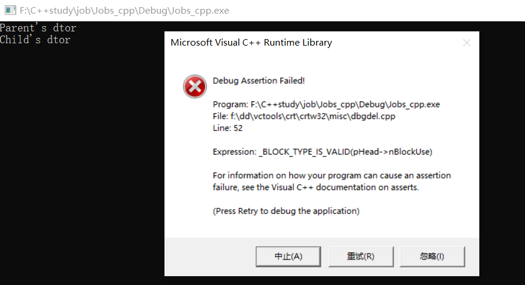

<!-- START doctoc generated TOC please keep comment here to allow auto update -->
<!-- DON'T EDIT THIS SECTION, INSTEAD RE-RUN doctoc TO UPDATE -->

- [智能指针](#%E6%99%BA%E8%83%BD%E6%8C%87%E9%92%88)
  - [一、shared_ptr](#%E4%B8%80shared_ptr)
  - [二、unique_ptr](#%E4%BA%8Cunique_ptr)
  - [三、weak_ptr](#%E4%B8%89weak_ptr)
  - [四、循环引用](#%E5%9B%9B%E5%BE%AA%E7%8E%AF%E5%BC%95%E7%94%A8)
    - [1、背景](#1%E8%83%8C%E6%99%AF)
    - [2、循环引用内存泄露的问题](#2%E5%BE%AA%E7%8E%AF%E5%BC%95%E7%94%A8%E5%86%85%E5%AD%98%E6%B3%84%E9%9C%B2%E7%9A%84%E9%97%AE%E9%A2%98)
    - [3、问题解决](#3%E9%97%AE%E9%A2%98%E8%A7%A3%E5%86%B3)
  - [五、智能指针的实现](#%E4%BA%94%E6%99%BA%E8%83%BD%E6%8C%87%E9%92%88%E7%9A%84%E5%AE%9E%E7%8E%B0)

<!-- END doctoc generated TOC please keep comment here to allow auto update -->

## 智能指针

本文参考 [C++11中智能指针的原理、使用、实现](https://www.cnblogs.com/wxquare/p/4759020.html)   和 [c++11&14-智能指针专题](https://www.jianshu.com/p/a6b00fcb92e7)

智能指针在C++11版本之后提供，包含在头文件<memory>中，其中常用的有shared_ptr、unique_ptr和weak_ptr。

### 一、shared_ptr

shared_ptr多个指针指向相同的对象。shared_ptr使用引用计数，每一个shared_ptr的拷贝都指向相同的内存。每使用他一次，内部的引用计数加1，每析构一次，内部的引用计数减1，减为0时，自动删除所指向的堆内存。shared_ptr内部的引用计数是线程安全的，但是对象的读取需要加锁。

* 初始化。智能指针是个模板类，可以指定类型，传入指针通过构造函数初始化。也可以使用make_shared函数初始化。不能将指针直接赋值给一个智能指针，一个是类，一个是指针。例如std::shared_ptr<int> p4 = new int(1);的写法是错误的。
* 拷贝和赋值。拷贝使得对象的引用计数增加1，赋值使得原对象引用计数减1，当计数为0时，自动释放内存。后来指向的对象引用计数加1，指向后来的对象。
* get函数获取原始指针，use_count函数获取引用计数。
* 注意不要用一个原始指针初始化多个shared_ptr，否则会造成二次释放同一内存
* 注意避免循环引用，shared_ptr的一个最大的陷阱是循环引用，循环，循环引用会导致堆内存无法正确释放，导致内存泄漏。循环引用在weak_ptr中介绍。

下面将介绍shared_ptr的常用用法，看懂这些代码即可掌握shared_ptr的用法。

案例一--基本类型：
```c
#include <iostream>
#include <memory>

int main() {
	{
		int a = 10;
		std::shared_ptr<int> ptra = std::make_shared<int>(a);
		std::shared_ptr<int> ptra2(ptra); //copy
		std::cout << ptra.use_count() << std::endl; // 2
		
		std::cout << "-----------------------------------" << std::endl;

		int b = 20;
		int *pb = &a;
		//std::shared_ptr<int> ptrb = pb;  //error
		std::shared_ptr<int> ptrb = std::make_shared<int>(b);
		ptra2 = ptrb; //assign
		pb = ptrb.get(); //获取原始指针

		std::cout << ptra.use_count() << std::endl; // 1
		std::cout << ptrb.use_count() << std::endl; // 2

		std::cout << "-----------------------------------" << std::endl;

		std::shared_ptr<int> temp(new int(10));
		std::cout << *(temp.get()) << std::endl;
	}
}
```
编译运行结果如下：
```
2
-----------------------------------
1
2
-----------------------------------
10
```

案例二--自定义类型

```c
#include <memory>
#include <iostream>
class Test
{
public:
	Test()
	{
		std::cout << "Test()" << std::endl;
	}
	void print(void)
	{
		std::cout << "----------Test::print(void)----------" << std::endl;
	}
	~Test()
	{
		std::cout << "~Test()" << std::endl;
	}
};
int main()
{
	std::shared_ptr<Test> p1 = std::make_shared<Test>();
	std::cout << "1 ref:" << p1.use_count() << std::endl; // 1 ref:1
	{
		std::shared_ptr<Test> p2 = p1;
		std::cout << "2 ref:" << p1.use_count() << std::endl; // 2 ref:2
	}
	std::cout << "3 ref:" << p1.use_count() << std::endl; // 3 ref:1

	std::cout << "--------------------------" << std::endl;

	std::shared_ptr<Test> temp(new Test());
	temp->print();

	Test* temp2 = temp.get();
	temp2->print();

	return 0;
}
```
运行结果如下：
```
Test()
1 ref:1
2 ref:2
3 ref:1
--------------------------
Test()
----------Test::print(void)----------
----------Test::print(void)----------
~Test()
~Test()
```

### 二、unique_ptr

uniqut_ptr是一种对资源具有排他性拥有权的智能指针，即一个对象资源只能同时被一个unique_ptr指向。

和shared_ptr类似，unipue_ptr有三种初始化方式。

* 使用new
```c
T *pT = new T();
std::unique_ptr<T> up1(pT);
```
* 通过make_unique
```c
auto pT = make_unique<T>();
```
* 通过move()函数
```c
//up也是一个std::unique_ptr<T>指针
unique_ptr<T> up1 = std::move(up); 
```
需要注意的是，unique_ptr不能被复制或者拷贝，下面这些做法都是错误的：
```c
unique_ptr<T> up(new T()); //ok
unique_ptr<T> up1(up); //error, can not be copy
unique_ptr<T> up2 = up; //error, can not be assigned
```
虽然unique_ptr不能被复制或者拷贝，但是unique_ptr可以移动赋值或者移动拷贝，通过这种方法来重新指定所指对象的所有权：
```c
unique_ptr<T> pT(new T());
unique_ptr<T> pT2 = std::move(pT);  //移动赋值，此时pT被销毁，为空
unique_ptr<T> pT3(std::move(pt2)); //移动拷贝，此时pT2被销毁，为空
```
当然，unique_ptr可以作为函数的返回值：
```c
unique_ptr<T> GetPtr(); //function getthe unique pointer
unique_ptr<T> pT = GetPtr(); // ok
```

unique_ptr可以通过reset方法重新指定、通过release方法释放所有权、通过移动语义转移所有权。

下面是一个unique_ptr的使用案例：
```c
#include <iostream>
#include <memory>

int main()
{
	std::unique_ptr<int> pInt;
	pInt.reset(new int());
	int *p = pInt.release(); //释放所有权
	//由于unique_ptr有std::unique_ptr<T[]>的重载函数，所以它可以用来管理数组资源
	std::unique_ptr<int[]> pArray(new int[3]{1, 3, 3});

	std::cout << "-------------------------------" << std::endl;

	std::unique_ptr<int> uptr(new int(10));  //绑定动态对象
	//std::unique_ptr<int> uptr2 = uptr;  //不能赋值
	//std::unique_ptr<int> uptr2(uptr);  //不能拷贝
	std::unique_ptr<int> uptr2 = std::move(uptr); //转换所有权
	std::cout << *(uptr2.get()) << std::endl;
	uptr2.release(); //释放所有权
}
```

### 三、weak_ptr

weak_ptr是为了配合shared_ptr而引入的一种智能指针，因为它不具有普通指针的行为，没有重载operator*和->,它的最大作用在于协助shared_ptr工作，像旁观者那样观测资源的使用情况。

* weak_ptr可以从一个shared_ptr或者另一个weak_ptr对象构造，获得资源的观测权。但weak_ptr没有共享资源，它的构造不会引起指针引用计数的增加。

* 使用weak_ptr的成员函数use_count()可以观测资源的引用计数，另一个成员函数expired()的功能等价于use_count()==0,但更快，表示被观测的资源(也就是shared_ptr的管理的资源)已经不复存在。

* weak_ptr可以使用一个非常重要的成员函数lock()从被观测的shared_ptr获得一个可用的shared_ptr对象， 从而操作资源。但当expired()==true的时候，lock()函数将返回一个存储空指针的shared_ptr。

下面是一个weak_ptr使用的案例：
```c
#include <iostream>
#include <memory>

int main() {
	{
		std::shared_ptr<int> sh_ptr = std::make_shared<int>(10);
		std::cout << sh_ptr.use_count() << std::endl; // 1

		std::weak_ptr<int> wp(sh_ptr);
		std::cout << wp.use_count() << std::endl; // 1

		if (!wp.expired()){
			std::shared_ptr<int> sh_ptr2 = wp.lock(); //get another shared_ptr
			*sh_ptr = 100;
			std::cout << wp.use_count() << std::endl; // 2
		}
	}
	//release memory
}
```
std::weak_ptr支持如下调用：
```c
weak_ptr<T> w;  //空weak_ptr可以指向类型为T的对象
weak_ptr<T> w(shared_ptr sp);   //与sp指向相同对象的weak_ptr, T必须能转换为sp指向的类型
w = p;  //p可以是shared_ptr或者weak_ptr，赋值后w和p共享对象
w.reset();  //weak_ptr置为空
w.use_count();  //与w共享对象的shared_ptr的计数
w.expired();    //w.use_count()为0则返回true，否则返回false
w.lock();   //w.expired()为true，返回空的shared_ptr;否则返回指向w的shared_ptr
```
### 四、循环引用

#### 1、背景

试考虑如下场景：
```c++
public class Parent
{
　　private Child* myChild;
}
public class Child
{
　　private Parent* myParent;
}
```
有两个类，Parent和Child，两个类中分别持有对方的指针，然后有了下面的测试场景：
```c++
#include <iostream>
#include <memory>

class Child;
class Parent;

class Parent 
{
private:
	Child* myChild;
public:
	void setChild(Child* ch) 
	{
		this->myChild = ch;
	}

	void doSomething() 
	{
		if (this->myChild) 
		{

		}
	}

	~Parent() 
	{
		delete myChild;
		std::cout << "Parent's dtor" << std::endl;
	}
};

class Child 
{
private:
	Parent* myParent;
public:
	void setPartent(Parent* p) 
	{
		this->myParent = p;
	}
	void doSomething() 
	{
		if (this->myParent) 
		{

		}
	}
	~Child() 
	{
		delete myParent;
		std::cout << "Child's dtor" << std::endl;
	}
};

int main() 
{
	{
		Parent* p = new Parent;
		Child* c = new Child;
		p->setChild(c);
		c->setPartent(p);
		delete c;  //only delete one
	}
	return 0;
}
```
在测试代码中也分别给Parent和Child对象赋值对应的指针对象，最后delete掉一个Child对象c，运行结果如下：


在delete Child的时候调用了Child的析构函数，在Child的析构函数中又调用了delete释放Parent，然后进一步调用Parent的析构函数，在Parent析构函数中又delete了Child一次。这整个过程中Child被delete了两次，所以就会报错。

#### 2、循环引用内存泄露的问题
下面尝试使用智能指针来解决该问题：
```c
#include <iostream>
#include <memory>

class Child;
class Parent;

class Parent {
private:
	std::shared_ptr<Child> ChildPtr;
public:
	void setChild(std::shared_ptr<Child> child) {
		this->ChildPtr = child;
	}

	void doSomething() {
		if (this->ChildPtr.use_count()) {

		}
	}

	~Parent() {
		std::cout << "Parent's dtor" << std::endl;
	}
};

class Child {
private:
	std::shared_ptr<Parent> ParentPtr;
public:
	void setPartent(std::shared_ptr<Parent> parent) {
		this->ParentPtr = parent;
	}
	void doSomething() {
		if (this->ParentPtr.use_count()) {

		}
	}
	~Child() {
		std::cout << "Child's dtor" << std::endl;
	}
};

int main() {
	std::weak_ptr<Parent> wpp;
	std::weak_ptr<Child> wpc;
	{
		std::shared_ptr<Parent> p(new Parent);
		std::shared_ptr<Child> c(new Child);
		p->setChild(c);
		c->setPartent(p);
		wpp = p;
		wpc = c;
		std::cout << p.use_count() << std::endl; // 2
		std::cout << c.use_count() << std::endl; // 2
	}
	std::cout << wpp.use_count() << std::endl;  // 1
	std::cout << wpc.use_count() << std::endl;  // 1
	return 0;
}
```
运行结果如下：
```
2
2
1
1
```
至始至终只存在一个Child和Parent对象，但是却没有调用其析构函数。两个shared_ptr销毁的条件是要先销毁对方，那么哪个对象先销毁呢？这里有点像“死锁”。要解决这个问题，可以将其中一个类的shared_ptr换成weak_ptr。

#### 3、问题解决

```c
#include <iostream>
#include <memory>

class Child;
class Parent;

class Parent {
private:
	//std::shared_ptr<Child> ChildPtr;
	std::weak_ptr<Child> ChildPtr;
public:
	void setChild(std::shared_ptr<Child> child) {
		this->ChildPtr = child;
	}

	void doSomething() {
		//new shared_ptr
		if (this->ChildPtr.lock()) {

		}
	}

	~Parent() {
		std::cout << "Parent's dtor" << std::endl;
	}
};

class Child {
private:
	std::shared_ptr<Parent> ParentPtr;
public:
	void setPartent(std::shared_ptr<Parent> parent) {
		this->ParentPtr = parent;
	}
	void doSomething() {
		if (this->ParentPtr.use_count()) {

		}
	}
	~Child() {
		std::cout << "Child's dtor" << std::endl;
	}
};

int main() {
	std::weak_ptr<Parent> wpp;
	std::weak_ptr<Child> wpc;
	{
		std::shared_ptr<Parent> p(new Parent);
		std::shared_ptr<Child> c(new Child);
		p->setChild(c);
		c->setPartent(p);
		wpp = p;
		wpc = c;
		std::cout << p.use_count() << std::endl; // 2
		std::cout << c.use_count() << std::endl; // 1
	}
	std::cout << wpp.use_count() << std::endl;  // 0
	std::cout << wpc.use_count() << std::endl;  // 0
	return 0;
}
```
运行结果如下：
```
2
1
Child's dtor
Parent's dtor
0
0
```
### 五、智能指针的实现

下面是一个简单智能指针的demo。智能指针类将一个计数器与类指向的对象相关联，引用计数跟踪该类有多少个对象共享同一指针。每次创建类的新对象时，初始化指针并将引用计数置为1；当对象作为另一对象的副本而创建时，拷贝构造函数拷贝指针并增加与之相应的引用计数；对一个对象进行赋值时，赋值操作符减少左操作数所指对象的引用计数（如果引用计数为减至0，则删除对象），并增加右操作数所指对象的引用计数；调用析构函数时，构造函数减少引用计数（如果引用计数减至0，则删除基础对象）。智能指针就是模拟指针动作的类。所有的智能指针都会重载 -> 和 * 操作符。智能指针还有许多其他功能，比较有用的是自动销毁。这主要是利用栈对象的有限作用域以及临时对象（有限作用域实现）析构函数释放内存。

```c++
#include <iostream>
//#include <memory>

template<typename T>
class SmartPointer {
private:
	T* _ptr;
	size_t* _count;
public:
	SmartPointer(T* ptr = nullptr) :
		_ptr(ptr) {
		if (_ptr) {
			_count = new size_t(1);
		}
		else {
			_count = new size_t(0);
		}
	}

	SmartPointer(const SmartPointer& ptr) {
		this->_ptr = ptr._ptr;
		this->_count = ptr._count;
		(*this->_count)++;
	}

	SmartPointer& operator=(const SmartPointer& ptr) {
		if (this->_ptr == ptr._ptr) {
			return *this;
		}

		if (this->_ptr) {
			(*this->_count)--;
			if (this->_count == 0) {
				delete this->_ptr;
				delete this->_count;
			}
		}

		this->_ptr = ptr._ptr;
		this->_count = ptr._count;
		(*this->_count)++;
		return *this;
	}

	T& operator*() {
		assert(this->_ptr == nullptr);
		return *(this->_ptr);

	}

	T* operator->() {
		assert(this->_ptr == nullptr);
		return this->_ptr;
	}

	~SmartPointer() {
		(*this->_count)--;
		if (*this->_count == 0) {
			delete this->_ptr;
			delete this->_count;
		}
	}

	size_t use_count(){
		return *this->_count;
	}
};

int main() {
	{
		SmartPointer<int> sp(new int(10));
		std::cout << sp.use_count() << std::endl; // 1


		{
			SmartPointer<int> sp2(sp);
			std::cout << sp.use_count() << std::endl; // 2
			std::cout << sp2.use_count() << std::endl; // 2

			SmartPointer<int> sp3(new int(20));
			std::cout << sp3.use_count() << std::endl; // 1

			//sp2 = sp3;
			std::cout << sp.use_count() << std::endl;// 2
			std::cout << sp2.use_count() << std::endl; // 2
			std::cout << sp3.use_count() << std::endl;// 1
		}

		std::cout << sp.use_count() << std::endl;// 1
	}
	//delete operator
}
```