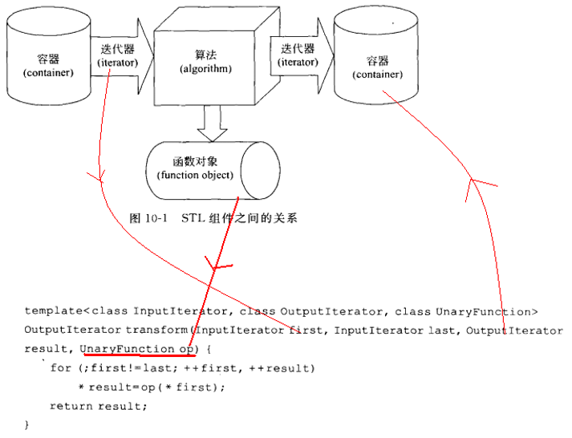

<!-- START doctoc generated TOC please keep comment here to allow auto update -->
<!-- DON'T EDIT THIS SECTION, INSTEAD RE-RUN doctoc TO UPDATE -->

- [STL -- 算法](#stl----%E7%AE%97%E6%B3%95)
  - [一、概述](#%E4%B8%80%E6%A6%82%E8%BF%B0)
    - [1、STL 中算法分类](#1stl-%E4%B8%AD%E7%AE%97%E6%B3%95%E5%88%86%E7%B1%BB)
    - [2、常用算法汇总](#2%E5%B8%B8%E7%94%A8%E7%AE%97%E6%B3%95%E6%B1%87%E6%80%BB)
  - [二、函数对象和谓词](#%E4%BA%8C%E5%87%BD%E6%95%B0%E5%AF%B9%E8%B1%A1%E5%92%8C%E8%B0%93%E8%AF%8D)
    - [1、函数对象和谓词定义](#1%E5%87%BD%E6%95%B0%E5%AF%B9%E8%B1%A1%E5%92%8C%E8%B0%93%E8%AF%8D%E5%AE%9A%E4%B9%89)
      - [函数对象](#%E5%87%BD%E6%95%B0%E5%AF%B9%E8%B1%A1)
      - [谓词](#%E8%B0%93%E8%AF%8D)
    - [2、一元函数对象案例](#2%E4%B8%80%E5%85%83%E5%87%BD%E6%95%B0%E5%AF%B9%E8%B1%A1%E6%A1%88%E4%BE%8B)
    - [3、一元谓词案例](#3%E4%B8%80%E5%85%83%E8%B0%93%E8%AF%8D%E6%A1%88%E4%BE%8B)
    - [4、二元函数案例](#4%E4%BA%8C%E5%85%83%E5%87%BD%E6%95%B0%E6%A1%88%E4%BE%8B)
    - [5、二元谓词案例](#5%E4%BA%8C%E5%85%83%E8%B0%93%E8%AF%8D%E6%A1%88%E4%BE%8B)
    - [6、预定义函数对象和函数适配器](#6%E9%A2%84%E5%AE%9A%E4%B9%89%E5%87%BD%E6%95%B0%E5%AF%B9%E8%B1%A1%E5%92%8C%E5%87%BD%E6%95%B0%E9%80%82%E9%85%8D%E5%99%A8)
      - [（1）预定义函数对象](#1%E9%A2%84%E5%AE%9A%E4%B9%89%E5%87%BD%E6%95%B0%E5%AF%B9%E8%B1%A1)
      - [（2）算术函数对象](#2%E7%AE%97%E6%9C%AF%E5%87%BD%E6%95%B0%E5%AF%B9%E8%B1%A1)
      - [（3）关系函数对象](#3%E5%85%B3%E7%B3%BB%E5%87%BD%E6%95%B0%E5%AF%B9%E8%B1%A1)
      - [（4）逻辑函数对象](#4%E9%80%BB%E8%BE%91%E5%87%BD%E6%95%B0%E5%AF%B9%E8%B1%A1)
  - [三、函数适配器](#%E4%B8%89%E5%87%BD%E6%95%B0%E9%80%82%E9%85%8D%E5%99%A8)
  - [四、STL的容器算法迭代器的设计理念](#%E5%9B%9Bstl%E7%9A%84%E5%AE%B9%E5%99%A8%E7%AE%97%E6%B3%95%E8%BF%AD%E4%BB%A3%E5%99%A8%E7%9A%84%E8%AE%BE%E8%AE%A1%E7%90%86%E5%BF%B5)
  - [五、常用算法](#%E4%BA%94%E5%B8%B8%E7%94%A8%E7%AE%97%E6%B3%95)
    - [1、常用的遍历算法](#1%E5%B8%B8%E7%94%A8%E7%9A%84%E9%81%8D%E5%8E%86%E7%AE%97%E6%B3%95)
      - [（1）for_each()](#1for_each)
      - [（2）transform()](#2transform)
    - [2、常用的查找算法](#2%E5%B8%B8%E7%94%A8%E7%9A%84%E6%9F%A5%E6%89%BE%E7%AE%97%E6%B3%95)
      - [（1）adjacent_find()](#1adjacent_find)
      - [（2）binary_search](#2binary_search)
      - [（3）count()](#3count)
      - [（4）count_if()](#4count_if)
      - [（5）find()](#5find)
      - [（6）find_if()](#6find_if)
    - [3、常用的排序算法](#3%E5%B8%B8%E7%94%A8%E7%9A%84%E6%8E%92%E5%BA%8F%E7%AE%97%E6%B3%95)
      - [（1）merge()](#1merge)
      - [（2）sort()](#2sort)
      - [（3）random_shuffle()](#3random_shuffle)
      - [（4）reverse()](#4reverse)
    - [4、常用的拷贝和替换算法](#4%E5%B8%B8%E7%94%A8%E7%9A%84%E6%8B%B7%E8%B4%9D%E5%92%8C%E6%9B%BF%E6%8D%A2%E7%AE%97%E6%B3%95)
      - [（1）copy()](#1copy)
      - [（2）replace()](#2replace)
      - [（3）replace_if()](#3replace_if)
      - [（4）swap()](#4swap)
    - [5、常用的算术和生成算法](#5%E5%B8%B8%E7%94%A8%E7%9A%84%E7%AE%97%E6%9C%AF%E5%92%8C%E7%94%9F%E6%88%90%E7%AE%97%E6%B3%95)
      - [（1）accumulate()](#1accumulate)
      - [（2）fill()](#2fill)
    - [6、常用的集合算法](#6%E5%B8%B8%E7%94%A8%E7%9A%84%E9%9B%86%E5%90%88%E7%AE%97%E6%B3%95)

<!-- END doctoc generated TOC please keep comment here to allow auto update -->

## STL -- 算法

### 一、概述

STL提供了大量实现算法的模版函数，只要我们熟悉了STL之后，许多代码可以被大大的化简，只需要通过调用一两个算法模板，就可以完成所需要的功能，从而大大地提升效率。

STL 的算法部分主要由头文件<algorithm>，<numeric>和<functional>组成：

* <algorithm>是所有STL头文件中最大的一个，其中常用到的功能范围涉及到比较、交换、查找、遍历操作、复制、修改、反转、排序、合并等等。
* <numeric>体积很小，只包括几个在序列上面进行简单数学运算的模板函数，包括加法和乘法在序列上的一些操作。
* <functional>中则定义了一些模板类，用以声明函数对象。

#### 1、STL 中算法分类

操作对象型算法：
* 直接改变容器的内容
* 将原容器的内容复制一份,修改其副本,然后传回该副本

功能型算法：
* 非可变序列算法 指不直接修改其所操作的容器内容的算法
    * 计数算法	 count、count_if
    * 搜索算法	 search、find、find_if、find_first_of、…
    * 比较算法	 equal、mismatch、lexicographical_compare
* 可变序列算法 指可以修改它们所操作的容器内容的算法
    * 删除算法	 remove、remove_if、remove_copy、…
    * 修改算法	 for_each、transform
    * 排序算法	 sort、stable_sort、partial_sort、
* 排序算法 包括对序列进行排序和合并的算法、搜索算法以及有序序列上的集合操作
* 数值算法 对容器内容进行数值计算

#### 2、常用算法汇总

算法分类|操作函数
---|---
查找算法|adjacent_find()、binary_search()、count()、count_if()、equal_range()、find()、find_if()
排序算法|merge(),sort()、random_shuffle()、reverse()
拷贝和替换算法|copy()、 replace()、replace_if()、swap()
算术和生成算法|accumulate()、fill()
集合算法|set_union()、set_intersection()、set_difference()。
遍历算法|for_each()、transform()

### 二、函数对象和谓词

#### 1、函数对象和谓词定义

##### 函数对象

重载函数调用操作符的类，其对象常称为函数对象（function object），即它们是行为类似函数的对象。一个类对象，表现出一个函数的特征，就是通过“对象名+(参数列表)”的方式使用一个类对象，如果没有上下文，完全可以把它看作一个函数对待。这是通过重载类的operator()来实现的。“在标准库中，函数对象被广泛地使用以获得弹性”，标准库中的很多算法都可以使用函数对象或者函数来作为自定的回调行为。

##### 谓词

一元谓词的函数参数1个，函数返回值是bool类型，可以作为一个判断式。谓词可以是一个仿函数，也可以是一个回调函数。二元谓词的函数参数2个，函数返回值是bool类型。

一元谓词函数举例如下：

* 判断给出的string对象的长度是否小于6
    ```c
    bool GT6(const string &s)
    {
        return s.size() >= 6;
    }
    ```
* 判断给出的int是否在3到8之间
    ```c
    bool Compare( int i )
    {
        return ( i >= 3 && i <= 8 );
    }
    ```
二元谓词举例如下：

* 比较两个string对象，返回一个bool值，指出第一个string是否比第二个短

    ```c
    bool isShorter(const string &s1, const string &s2)
    {
        return s1.size() < s2.size();
    }
    ```

#### 2、一元函数对象案例

```c
#include <iostream>
#include <string>
#include <algorithm>
#include <functional>
using namespace std;

template <typename T>
void FuncShowElemt(T &t)  //普通函数 不能像 仿函数那样记录状态
{
	cout << t << " ";
};

void showChar(char &t)
{
	cout << t << " ";
}

//函数模板 重载 函数调用操作符
template <typename T>
class ShowElemt
{
public:
	ShowElemt()
	{
		n = 0;
	}
	void operator()(T &t)
	{
		n++;
		cout << t << " ";
	}
	void printCount()
	{
		cout << n << endl;
	}
public:
	int n;
};

// 函数对象 基本使用
void main()
{
	int a = 100;
	FuncShowElemt<int>(a); //普通的函数调用
	ShowElemt<int> showElemt; //函数对象 
	showElemt(a); //函数对象调用 
}
```

#### 3、一元谓词案例

```c
#include <iostream>
#include <string>
#include <vector>
#include <algorithm>
#include <functional>
using namespace std;

//1元谓词 例子
template <typename T>
class Isdiv
{
public:
	Isdiv(const T &divisor) //
	{
		this->divisor = divisor;
	}
	bool operator()(T &t)
	{
		return (t%divisor == 0);
	}
protected:
private:
	T divisor;
};

void main()
{
	vector<int> v2;
	for (int i = 10; i<33; i++)
	{
		v2.push_back(i);
	}
	vector<int>::iterator it;
	int a = 4;
	Isdiv<int> mydiv(a);
	// _InIt find_if(_InIt _First, _InIt _Last, _Pr _Pred)   //返回的是迭代器
	it = find_if(v2.begin(), v2.end(), Isdiv<int>(4));
	if (it != v2.end())
	{
		cout << "第一个被4整除的数是：" << *it << endl;
	}
}
```

#### 4、二元函数案例

```c
#include <iostream>
#include <string>
#include <vector>
#include <algorithm>
#include <functional>
using namespace std;

template <typename T>
struct SumAdd
{
	T operator()(T &t1, T &t2)
	{
		return t1 + t2;
	}
};

template <typename T>
void printE(T &t)
{
	for (vector<int>::iterator it = t.begin(); it != t.end(); it++)
	{
		cout << *it << " ";
	}
}

void printVector(vector<int> &v)
{
	for (vector<int>::iterator it = v.begin(); it != v.end(); it++)
	{
		cout << *it << " ";
	}
}

void  main()
{
	vector<int> v1, v2;
	vector<int> v3;
	v1.push_back(1);
	v1.push_back(2);
	v1.push_back(3);

	v2.push_back(4);
	v2.push_back(5);
	v2.push_back(6);

	v3.resize(10);

	//transform(v1.begin(), v1.end(), v2.begin(),v3.begin(), SumAdd<int>());
	/*
	template<class _InIt1,
	class _InIt2,
	class _OutIt,
	class _Fn2> inline
	_OutIt transform(_InIt1 _First1, _InIt1 _Last1,
	_InIt2 _First2, _OutIt _Dest, _Fn2 _Func)
	*/
	vector<int>::iterator it = transform(v1.begin(), v1.end(), v2.begin(), v3.begin(), SumAdd<int>());
	cout << *it << endl;
	printE(v3);
}
```

#### 5、二元谓词案例

```c
#include <iostream>
#include <string>
#include <vector>
#include <algorithm>
#include <functional>
using namespace std;

void current(int &v)
{
	cout << v << " ";
}

bool MyCompare(const int &a, const int &b)
{
	return a < b;
}
void main()
{
	vector<int> v(10);

	for (int i = 0; i<10; i++)
	{
		v[i] = rand() % 100;
	}

	for_each(v.begin(), v.end(), current);
	printf("\n");
	sort(v.begin(), v.end(), MyCompare);

	printf("\n");
	for (int i = 0; i<10; i++)
	{
		printf("%d ", v[i]);
	}
	printf("\n");
}
```

#### 6、预定义函数对象和函数适配器

##### （1）预定义函数对象

标准模板库STL提前定义了很多预定义函数对象，#include<functional> 必须被包含。

使用方法：

```c
#include <iostream>
#include <string>
#include <vector>
#include <algorithm>
#include <functional>
using namespace std;

void main()
{
	plus<int> intAdd;
	int x = 10;
	int y = 20;
	int z = intAdd(x, y); //等价于 x + y 
	cout << z << endl;

	plus<string> stringAdd;
	string myc = stringAdd("aaa", "bbb");
	cout << myc << endl;

	vector<string> v1;
	v1.push_back("bbb");
	v1.push_back("aaa");
	v1.push_back("ccc");
	v1.push_back("zzzz");

	//缺省情况下，sort()用底层元素类型的小于操作符以升序排列容器的元素。
	//为了降序，可以传递预定义的类模板greater,它调用底层元素类型的大于操作符：
	cout << "sort()函数排序" << endl;;
	sort(v1.begin(), v1.end(), greater<string>()); //从大到小
	for (vector<string>::iterator it = v1.begin(); it != v1.end(); it++)
	{
		cout << *it << endl;
	}
}
```
运行结果：
```
30
aaabbb
sort()函数排序
zzzz
ccc
bbb
aaa
```

##### （2）算术函数对象

预定义的函数对象支持加、减、乘、除、求余和取反。调用的操作符是与type相关联的实例。

* 加法：plus<Types>
	```c
	plus<string> stringAdd;
	sres = stringAdd(sva1,sva2);
	```
* 减法：minus<Types>
* 乘法：multiplies<Types>
* 除法：divides<Tpye>
* 求余：modulus<Tpye>
* 取反：negate<Type>
	```c
	negate<int> intNegate;
	ires = intNegate(ires);
	Ires= UnaryFunc(negate<int>(),Ival1);
	```

##### （3）关系函数对象

* 等于：equal_to<Tpye>
	```c
	equal_to<string> stringEqual;
	sres = stringEqual(sval1,sval2);
	```
* 不等于：not_equal_to<Type>
* 大于：greater<Type>
* 大于等于：greater_equal<Type>
* 小于：less<Type>
* 小于等于：less_equal<Type>

使用案例：
```c
#include <iostream>
#include <string>
#include <vector>
#include <algorithm>
#include <functional>
using namespace std;

void main()
{
	vector<string> v1;
	v1.push_back("bbb");
	v1.push_back("aaa");
	v1.push_back("ccc");
	v1.push_back("zzzz");
	v1.push_back("ccc");
	string s1 = "ccc";
	//int num = count_if(v1.begin(),v1.end(), equal_to<string>(),s1);
	int num = count_if(v1.begin(), v1.end(), bind2nd(equal_to<string>(), s1));
	cout << num << endl;
}
```

##### （4）逻辑函数对象

* 逻辑与 logical_and<Type>
	```c
	logical_and<int> indAnd;
	ires = intAnd(ival1,ival2);
	dres=BinaryFunc( logical_and<double>(),dval1,dval2);
	```
* 逻辑或logical_or<Type>
* 逻辑非logical_not<Type>
	```c
	logical_not<int> IntNot;
	Ires = IntNot(ival1);
	Dres=UnaryFunc(logical_not<double>,dval1);
	```

### 三、函数适配器

标准库提供一组函数适配器，用来特殊化或者扩展一元和二元函数对象。常用适配器是：
* 绑定器（binder）: binder通过把二元函数对象的一个实参绑定到一个特殊的值上，将其转换成一元函数对象。C＋＋标准库提供两种预定义的binder适配器：bind1st和bind2nd，前者把值绑定到二元函数对象的第一个实参上，后者绑定在第二个实参上。
* 取反器(negator) : negator是一个将函数对象的值翻转的函数适配器。标准库提供两个预定义的ngeator适配器：not1翻转一元预定义函数对象的真值,而not2翻转二元谓词函数的真值。
常用函数适配器列表如下：

	* bind1st(op, value)
	* bind2nd(op, value)
	* not1(op)
	* not2(op)
	* mem_fun_ref(op)
	* mem_fun(op)
	* ptr_fun(op)

常用函数适配器案例：

```c
#include <iostream>
#include <string>
#include <vector>
#include <algorithm>
#include <functional>
using namespace std;

class IsGreat
{
public:
	IsGreat(int i)
	{
		m_num = i;
	}
	bool operator()(int &num)
	{
		if (num > m_num)
		{
			return true;
		}
		return false;
	}
protected:
private:
	int m_num;
};

void main()
{
	vector<int>  v1;
	for (int i = 0; i<5; i++)
	{
		v1.push_back(i + 1);
	}

	for (vector<int>::iterator it = v1.begin(); it != v1.end(); it++)
	{
		cout << *it << " ";
	}

	int num1 = count(v1.begin(), v1.end(), 3);
	cout << "num1:" << num1 << endl;

	//通过谓词求大于2的个数
	int num2 = count_if(v1.begin(), v1.end(), IsGreat(2));
	cout << "num2:" << num2 << endl;

	//通过预定义函数对象求大于2的个数   greater<int>() 有2个参数 
	//												param > 2
	int num3 = count_if(v1.begin(), v1.end(), bind2nd(greater<int>(), 2));
	cout << "num3:" << num3 << endl;

	int num3x = count_if(v1.begin(), v1.end(), bind1st(greater<int>(), 2));
	cout << "num3x:" << num3x << endl;

	//取模 能被2整除的数 求奇数
	int num4 = count_if(v1.begin(), v1.end(), bind2nd(modulus <int>(), 2));
	cout << "奇数num4:" << num4 << endl;

	int num5 = count_if(v1.begin(), v1.end(), not1(bind2nd(modulus <int>(), 2)));
	cout << "偶数num5:" << num5 << endl;
}
```

### 四、STL的容器算法迭代器的设计理念



* STL的容器通过类模板技术，实现数据类型和容器模型的分离。
* STL的迭代器技术实现了遍历容器的统一方法；也为STL的算法提供了统一性奠定了基础。
* STL的算法，通过函数对象实现了自定义数据类型的算法运算；所以说：STL的算法也提供了统一性。
* 核心思想：其实函数对象本质就是回调函数，回调函数的思想：就是任务的编写者和任务的调用者有效解耦合。函数指针做函数参数。

具体例子：transform算法的输入，通过迭代器first和last指向的元算作为输入；通过result作为输出；通过函数对象来做自定义数据类型的运算。

### 五、常用算法

#### 1、常用的遍历算法

##### （1）for_each()

* for_each:  用指定函数依次对指定范围内所有元素进行迭代访问。该函数不得修改序列中的元素。
* 函数定义：for_each(begin, end, func);
```c
template<class _InIt, class _Fn1> inline _Fn1 
for_each(_InIt _First, _InIt _Last, _Fn1 _Func)
{	// perform function for each element
	_DEBUG_RANGE(_First, _Last);
	_DEBUG_POINTER(_Func);
	return (_For_each(_Unchecked(_First), _Unchecked(_Last), _Func));
}
```
* 注意for_each的第三个参数 函数对象做函数参数，函数对象做返回值

使用方法：
```c
#include <iostream>
#include <string>
#include <vector>
#include <algorithm>
#include <functional>
using namespace std;

class CMyShow
{
public:
	CMyShow()
	{
		num = 0;
	}
	void operator()(const int &iItem)
	{
		num++;
		cout << iItem;
	}

	void printCount()
	{
		cout << "num:" << num << endl;
	}

private:
	int num;
};

void show(const int &iItem)
{
	cout << iItem;
}
void main()
{
	int iArray[] = { 0, 1, 2, 3, 4 };
	vector<int> vecInt(iArray, iArray + sizeof(iArray) / sizeof(iArray[0]));
	for_each(vecInt.begin(), vecInt.end(), show);

	//结果打印出0 1 2 3 4
	CMyShow show1 = for_each(vecInt.begin(), vecInt.end(), CMyShow());
	cout << endl;
	show1.printCount(); //显示对象被调用的次数
}
```

##### （2）transform()

* transform：与for_each类似，遍历所有元素，但可对容器的元素进行修改
* transform()算法有两种形式: 	
	* transform(b1, e1, b2, op)
	* transform(b1, e1, b2, b3, op)
	```c
	template<class _InIt,
	class _OutIt,
		class _Fn1> inline
		_OutIt transform(_InIt _First, _InIt _Last, _OutIt _Dest, _Fn1 _Func)
	```
* transform()的作用 

例如：可以一个容器的元素，通过op，变换到另一个容器中（同一个容器中）	，也可以把两个容器的元素，通过op，变换到另一个容器中。

注意：	
* 如果目标与源相同，transform()就和for_each()一样。
* 如果想以某值替换符合规则的元素，应使用replace()算法。

```c
#include <iostream>
#include <string>
#include <vector>
#include <algorithm>
#include <functional>
using namespace std;

int increase(int i)
{
	return i + 1;
}

void main()
{
	vector<int> vecIntA;
	vecIntA.push_back(1);
	vecIntA.push_back(3);
	vecIntA.push_back(5);
	vecIntA.push_back(7);
	vecIntA.push_back(9);
	transform(vecIntA.begin(), vecIntA.end(), vecIntA.begin(), increase);		//vecIntA : {2,4,6,8,10}
	transform(vecIntA.begin(), vecIntA.end(), vecIntA.begin(), negate<int>());
}
```

#### 2、常用的查找算法

##### （1）adjacent_find()

在iterator对标识元素范围内，查找一对相邻重复元素，找到则返回指向这对元素的第一个元素的迭代器。否则返回past-the-end：
```c
vector<int> vecInt;
vecInt.push_back(1);
vecInt.push_back(2);
vecInt.push_back(2);
vecInt.push_back(4);
vecInt.push_back(5);
vecInt.push_back(5);

vector<int>::iterator it = adjacent_find(vecInt.begin(), vecInt.end());		//*it == 2
```

##### （2）binary_search

在有序序列中查找value,找到则返回true。注意：在无序序列中，不可使用：
```c
set<int> setInt;
setInt.insert(3);
setInt.insert(1);
setInt.insert(7);
setInt.insert(5);
setInt.insert(9);

bool bFind = binary_search(setInt.begin(),setInt.end(),5);
```

##### （3）count()  

利用等于操作符，把标志范围内的元素与输入值比较，返回相等的个数：
```c
vector<int> vecInt;
vecInt.push_back(1);
vecInt.push_back(2);
vecInt.push_back(2);
vecInt.push_back(4);
vecInt.push_back(2);
vecInt.push_back(5);
int iCount = count(vecInt.begin(),vecInt.end(),2);	//iCount==3
```

##### （4）count_if() 

假设vector<int> vecIntA，vecIntA包含1,3,5,7,9元素：
```c
//先定义比较函数
bool GreaterThree(int iNum)
{
	if(iNum>=3)
	{
		return true;
	}
	else
	{
		return false;
	}
}

int iCount = count_if(vecIntA.begin(), vecIntA.end(), GreaterThree);
//此时iCount == 4
```

##### （5）find() 

* find:  利用底层元素的等于操作符，对指定范围内的元素与输入值进行比较。当匹配时，结束搜索，返回该元素的迭代器。
* equal_range:    返回一对iterator，第一个表示lower_bound,第二个表示upper_bound。

```c
vector<int> vecInt;
vecInt.push_back(1);
vecInt.push_back(3);
vecInt.push_back(5);
vecInt.push_back(7);
vecInt.push_back(9);

vector<int>::iterator it = find(vecInt.begin(), vecInt.end(), 5);		//*it == 5
```

##### （6）find_if() 

find_if，使用输入的函数代替等于操作符执行find。返回被找到的元素的迭代器。

假设vector<int> vecIntA，vecIntA包含1,3,5,3,9元素 ：
```c
vector<int>::it = find_if(vecInt.begin(),vecInt.end(),GreaterThree);
```
此时 *it==3, *(it+1)==5, *(it+2)==3, *(it+3)==9

#### 3、常用的排序算法

##### （1）merge() 
合并两个有序序列，存放到另一个序列。

例如：vecIntA,vecIntB,vecIntC是用vector<int>声明的容器，vecIntA已包含1,3,5,7,9元素，vecIntB已包含2,4,6,8元素：
```c
vecIntC.resize(9);  //扩大容量
merge(vecIntA.begin(),vecIntA.end(),vecIntB.begin(),vecIntB.end(),vecIntC.begin());
```
此时vecIntC就存放了按顺序的1,2,3,4,5,6,7,8,9九个元素

##### （2）sort() 

以默认升序的方式重新排列指定范围内的元素。若要改排序规则，可以输入比较函数。

案例如下：
```c
//学生类
Class CStudent:
{
public:
        CStudent(int iID, string strName)
		{
m_iID=iID;  
m_strName=strName; 
}
public:            
	int m_iID;
	string m_strName;
}

//学号比较函数
bool Compare(const CStudent &stuA,const CStudent &stuB)
{
 		 return (stuA.m_iID<strB.m_iID);
}
void main()
{
vector<CStudent> vecStu;
vecStu.push_back(CStudent(2,"老二"));
vecStu.push_back(CStudent(1,"老大"));
vecStu.push_back(CStudent(3,"老三"));
vecStu.push_back(CStudent(4,"老四"));

sort(vecStu.begin(),vecStu.end(),Compare);
//  此时，vecStu容器包含了按顺序的"老大对象","老二对象","老三对象","老四对象"
}
```

##### （3）random_shuffle() 
对指定范围内的元素随机调整次序。

```c
srand(time(0));			//设置随机种子

vector<int> vecInt;
vecInt.push_back(1);
vecInt.push_back(3);
vecInt.push_back(5);
vecInt.push_back(7);
vecInt.push_back(9);

string str("itcastitcast ");

random_shuffle(vecInt.begin(), vecInt.end());   //随机排序，结果比如：9,7,1,5,3
random_shuffle(str.begin(), str.end());		   //随机排序，结果比如：" itstcasticat "
```

##### （4）reverse() 

反转序列：
```c
vector<int> vecInt;
vecInt.push_back(1);
vecInt.push_back(3);
vecInt.push_back(5);
vecInt.push_back(7);
vecInt.push_back(9);

reverse(vecInt.begin(), vecInt.end());		//{9,7,5,3,1}
```

#### 4、常用的拷贝和替换算法

##### （1）copy() 
```c
vector<int> vecIntA;
vecIntA.push_back(1);
vecIntA.push_back(3);
vecIntA.push_back(5);
vecIntA.push_back(7);
vecIntA.push_back(9);

vector<int> vecIntB;
vecIntB.resize(5);			//扩大空间

copy(vecIntA.begin(), vecIntA.end(), vecIntB.begin());	//vecIntB: {1,3,5,7,9}
```
##### （2）replace() 

replace(beg,end,oldValue,newValue):    将指定范围内的所有等于oldValue的元素替换成newValue：
```c
vector<int> vecIntA;
vecIntA.push_back(1);
vecIntA.push_back(3);
vecIntA.push_back(5);
vecIntA.push_back(3);
vecIntA.push_back(9);

replace(vecIntA.begin(), vecIntA.end(), 3, 8);		//{1,8,5,8,9}
```
##### （3）replace_if() 
将指定范围内所有操作结果为true的元素用新值替换。

用法举例：
```c
replace_if(vecIntA.begin(),vecIntA.end(),GreaterThree,newVal)
```
其中 vecIntA是用vector<int>声明的容器，GreaterThree 函数的原型是 bool GreaterThree(int iNum)
```c
//把大于等于3的元素替换成8
vector<int> vecIntA;
vecIntA.push_back(1);
vecIntA.push_back(3);
vecIntA.push_back(5);
vecIntA.push_back(3);
vecIntA.push_back(9);

replace_if(vecIntA.begin(), vecIntA.end(), GreaterThree, 8);		// GreaterThree的定义在上面。
```
##### （4）swap() 
交换两个容器的元素：
```c
vector<int> vecIntA;
vecIntA.push_back(1);
vecIntA.push_back(3);
vecIntA.push_back(5);

vector<int> vecIntB;
vecIntB.push_back(2);
vecIntB.push_back(4);

swap(vecIntA, vecIntB);  //交换
```

#### 5、常用的算术和生成算法

##### （1）accumulate() 
对指定范围内的元素求和，然后结果再加上一个由val指定的初始值。
```c
#include<numeric>

vector<int> vecIntA;
vecIntA.push_back(1);
vecIntA.push_back(3);
vecIntA.push_back(5);
vecIntA.push_back(7);
vecIntA.push_back(9);
int iSum = accumulate(vecIntA.begin(), vecIntA.end(), 100);		//iSum==125
```

##### （2）fill() 

将输入值赋给标志范围内的所有元素。
```c
vector<int> vecIntA;
vecIntA.push_back(1);
vecIntA.push_back(3);
vecIntA.push_back(5);
vecIntA.push_back(7);
vecIntA.push_back(9);
fill(vecIntA.begin(), vecIntA.end(), 8);		//8, 8, 8, 8, 8
```

#### 6、常用的集合算法

集合算法包括：set_union(),set_intersection(),set_difference()，其中：
* set_union:  构造一个有序序列，包含两个有序序列的并集。
* set_intersection:  构造一个有序序列，包含两个有序序列的交集。
* set_difference:  构造一个有序序列，该序列保留第一个有序序列中存在而第二个有序序列中不存在的元素。

使用案例：
```c
vector<int> vecIntA;
vecIntA.push_back(1);
vecIntA.push_back(3);
vecIntA.push_back(5);
vecIntA.push_back(7);
vecIntA.push_back(9);

vector<int> vecIntB;
vecIntB.push_back(1);
vecIntB.push_back(3);
vecIntB.push_back(5);
vecIntB.push_back(6);
vecIntB.push_back(8);

vector<int> vecIntC;
vecIntC.resize(10);

//并集
set_union(vecIntA.begin(), vecIntA.end(), vecIntB.begin(), vecIntB.end(), vecIntC.begin());		//vecIntC : {1,3,5,6,7,8,9,0,0,0}

//交集
fill(vecIntC.begin(),vecIntC.end(),0);
set_intersection(vecIntA.begin(), vecIntA.end(), vecIntB.begin(), vecIntB.end(), vecIntC.begin());		//vecIntC: {1,3,5,0,0,0,0,0,0,0}

//差集
fill(vecIntC.begin(),vecIntC.end(),0);
set_difference(vecIntA.begin(), vecIntA.end(), vecIntB.begin(), vecIntB.end(), vecIntC.begin());			//vecIntC: {7,9,0,0,0,0,0,0,0,0}
```