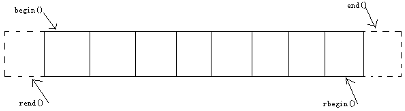

<!-- START doctoc generated TOC please keep comment here to allow auto update -->
<!-- DON'T EDIT THIS SECTION, INSTEAD RE-RUN doctoc TO UPDATE -->

- [STL -- vector](#stl----vector)
  - [1、介绍](#1%E4%BB%8B%E7%BB%8D)
  - [2、默认构造函数](#2%E9%BB%98%E8%AE%A4%E6%9E%84%E9%80%A0%E5%87%BD%E6%95%B0)
  - [3、带参数构造函数](#3%E5%B8%A6%E5%8F%82%E6%95%B0%E6%9E%84%E9%80%A0%E5%87%BD%E6%95%B0)
  - [4、赋值方法](#4%E8%B5%8B%E5%80%BC%E6%96%B9%E6%B3%95)
  - [5、vector大小](#5vector%E5%A4%A7%E5%B0%8F)
  - [6、vector末尾添加移除操作](#6vector%E6%9C%AB%E5%B0%BE%E6%B7%BB%E5%8A%A0%E7%A7%BB%E9%99%A4%E6%93%8D%E4%BD%9C)
  - [7、vector数据存取](#7vector%E6%95%B0%E6%8D%AE%E5%AD%98%E5%8F%96)
  - [8、迭代器基本原理](#8%E8%BF%AD%E4%BB%A3%E5%99%A8%E5%9F%BA%E6%9C%AC%E5%8E%9F%E7%90%86)
  - [9、vector与迭代器](#9vector%E4%B8%8E%E8%BF%AD%E4%BB%A3%E5%99%A8)
  - [10、vector的插入](#10vector%E7%9A%84%E6%8F%92%E5%85%A5)
  - [11、vector的删除](#11vector%E7%9A%84%E5%88%A0%E9%99%A4)
  - [12、使用案例](#12%E4%BD%BF%E7%94%A8%E6%A1%88%E4%BE%8B)

<!-- END doctoc generated TOC please keep comment here to allow auto update -->

## STL -- vector

### 1、介绍

* vector是将元素置于一个动态数组中加以管理的容器。
* vector可以随机存取元素（支持索引值直接存取， 用[]操作符或at()方法，这个等下会详讲）。
* vector尾部添加或移除元素非常快速。但是在中部或头部插入元素或移除元素比较费时。

### 2、默认构造函数

vector采用模板类实现，vector对象的默认构造形式：
```c
vector<T> vecT; 
```
使用方法：
```c
vector<int> vecInt;        	//一个存放int的vector容器。
vector<float> vecFloat;     	//一个存放float的vector容器。
vector<string> vecString;   	//一个存放string的vector容器。
...				    //尖括号内还可以设置指针类型或自定义类型。
Class CA{};
vector<CA*> vecpCA;	  	//用于存放CA对象的指针的vector容器。
vector<CA> vecCA;     	//用于存放CA对象的vector容器。由于容器元素的存放是按值复制的方式进行的，所以此时CA必须提供CA的拷贝构造函数，以保证CA对象间拷贝正常。
```

###  3、带参数构造函数

带参构造函数定义如下：
```c
vector(beg,end);    //构造函数将[beg, end)区间中的元素拷贝给本身。注意该区间是左闭右开的区间。
vector(n,elem);   //构造函数将n个elem拷贝给本身。
vector(const vector &vec);  //拷贝构造函数
```

使用方法：
```c
int  iArray[] = {0,1,2,3,4};
vector<int>  vecIntA( iArray,  iArray+5 );

vector<int> vecIntB (  vecIntA.begin() , vecIntA.end()  );   //用构造函数初始化容器vecIntB 
vector<int> vecIntB (  vecIntA.begin() , vecIntA.begin()+3  );  
vector<int> vecIntC(3,9); //此代码运行后，容器vecIntB就存放3个元素，每个元素的值是9。

vector<int> vecIntD(vecIntA);
```

### 4、赋值方法

可通过如下几种方式对vector进行赋值：
```c
vector.assign(beg,end);    //将[beg, end)区间中的数据拷贝赋值给本身。注意该区间是左闭右开的区间。
vector.assign(n,elem);  //将n个elem拷贝赋值给本身。
vector& operator=(const vector  &vec);	//重载等号操作符
vector.swap(vec);  // 将vec与本身的元素互换。
```

使用方法：
```c
vector<int> vecIntA, vecIntB, vecIntC, vecIntD;
int  iArray[] = {0,1,2,3,4};
vecIntA.assign(iArray,iArray+5);

vecIntB.assign( vecIntA.begin(),  vecIntA.end() );    //用其它容器的迭代器作参数。

vecIntC.assign(3,9);

vector<int> vecIntD;
vecIntD = vecIntA;

vecIntA.swap(vecIntD);
```

### 5、vector大小

可通过下面这些函数来获取一个vector对象的容量和大小，或者改变vector对象容量：
```c
vector.size();	   //返回容器中元素的个数
vector.empty();	   //判断容器是否为空
vector.resize(num);   //重新指定容器的长度为num，若容器变长，则以默认值填充新位置。如果容器变短，则末尾超出容器长度的元素被删除。
vector.resize(num, elem);  //重新指定容器的长度为num，若容器变长，则以elem值填充新位置。如果容器变短，则末尾超出容器长度的元素被删除。
```

假设vecInt是vector<int>  声明的容器，现已包含1,2,3元素，下面对vecInt进行一系列操作：
```c
int iSize = vecInt.size();		//iSize == 3;
bool bEmpty = vecInt.empty();	// bEmpty == false;
vecInt.resize(5);  //此时里面包含1,2,3,0,0元素。
vecInt.resize(8,3);  //此时里面包含1,2,3,0,0,3,3,3元素。
vecInt.resize(2);  //此时里面包含1,2元素。
```

### 6、vector末尾添加移除操作

案例如下：
```c
vector<int> vecInt;
vecInt.push_back(1);  //在容器尾部加入一个元素
vecInt.push_back(3);  //移除容器中最后一个元素
vecInt.push_back(5);  
vecInt.push_back(7); 
vecInt.push_back(9); 
vecInt.pop_back();    
vecInt.pop_back();
//{5 ,7 ,9}  
```

### 7、vector数据存取

可通过下面两种方式获取vector对象某个索引位置的值：
```c
vec.at(idx);  	//返回索引idx所指的数据，如果idx越界，抛出out_of_range异常。
vec[idx];  	//返回索引idx所指的数据，越界时，运行直接报错
```

使用方法：
```c
vector<int> vecInt;    //假设包含1 ,3 ,5 ,7 ,9
vecInt.at(2) == vecInt[2]	;		//5
vecInt.at(2) = 8;  // 或  vecInt[2] = 8;
// vecInt 就包含 1, 3, 8, 7, 9值

int iF = vector.front();	//iF==1
int iB = vector.back();	//iB==9
vector.front() = 11;	//vecInt包含{11,3,8,7,9}
vector.back() = 19;	//vecInt包含{11,3,8,7,19}
```

### 8、迭代器基本原理

* 迭代器是一个“可遍历STL容器内全部或部分元素”的对象。
* 迭代器指出容器中的一个特定位置。
* 迭代器就如同一个指针。
* 迭代器提供对一个容器中的对象的访问方法，并且可以定义了容器中对象的范围。

下面大概介绍一下迭代器的类别：

* 输入迭代器：也有叫法称之为“只读迭代器”，它从容器中读取元素，只能一次读入一个元素向前移动，只支持一遍算法，同一个输入迭代器不能两遍遍历一个序列。
* 输出迭代器：也有叫法称之为“只写迭代器”，它往容器中写入元素，只能一次写入一个元素向前移动，只支持一遍算法，同一个输出迭代器不能两遍遍历一个序列。
* 正向迭代器：组合输入迭代器和输出迭代器的功能，还可以多次解析一个迭代器指定的位置，可以对一个值进行多次读/写。
* 双向迭代器：组合正向迭代器的功能，还可以通过--操作符向后移动位置。
* 随机访问迭代器：组合双向迭代器的功能，还可以向前向后跳过任意个位置，可以直接访问容器中任何位置的元素。

### 9、vector与迭代器



```c
vector<int>  vecInt; //假设包含1,3,5,7,9元素
vector<int>::iterator it;		//声明容器vector<int>的迭代器。
it = vecInt.begin();    // *it == 1
++it;				//或者it++;  *it == 3  ，前++的效率比后++的效率高，前++返回引用，后++返回值。
it += 2;		//*it == 7
it = it+1;		//*it == 9
++it;				// it == vecInt.end();  此时不能再执行*it,会出错!
```

正向遍历：
```c
// 打印出1 3 5 7 9
for(vector<int>::iterator it=vecInt.begin(); it!=vecInt.end(); ++it)
{
    int iItem = *it; 
    cout << iItem;    //或直接使用  cout << *it;
}
```

逆向遍历：
```c
// 此时将打印出9,7,5,3,1
for(vector<int>::reverse_iterator rit=vecInt.rbegin(); rit!=vecInt.rend(); ++rit)    //注意，小括号内仍是++rit
{
	int iItem  = *rit;
    cout << iItem;	//或直接使用cout << *rit;
}
```
需要注意的是，这里迭代器的声明采用vector<int>::reverse_iterator，而非vector<int>::iterator。

迭代器还有其它两种声明方法：vector<int>::const_iterator 与 vector<int>::const_reverse_iterator。

以上两种分别是vector<int>::iterator 与vector<int>::reverse_iterator 的只读形式，使用这两种迭代器时，不会修改到容器中的值。不过容器中的insert和erase方法仅接受这四种类型中的iterator，其它三种不支持。《Effective STL》建议我们尽量使用iterator取代const_iterator、reverse_iterator和const_reverse_iterator。

### 10、vector的插入

插入函数有如下几种：
```c
vector.insert(pos,elem);   //在pos位置插入一个elem元素的拷贝，返回新数据的位置。
vector.insert(pos,n,elem);   //在pos位置插入n个elem数据，无返回值。
vector.insert(pos,beg,end);   //在pos位置插入[beg,end)区间的数据，无返回值 
```

使用案例：
```c
vector<int> vecA;
vector<int> vecB;

vecA.push_back(1);
vecA.push_back(3);
vecA.push_back(5);
vecA.push_back(7);
vecA.push_back(9);

vecB.push_back(2);
vecB.push_back(4);
vecB.push_back(6);
vecB.push_back(8);

vecA.insert(vecA.begin(), 11);		//{11, 1, 3, 5, 7, 9}
vecA.insert(vecA.begin()+1,2,33);		//{11,33,33,1,3,5,7,9}
vecA.insert(vecA.begin() , vecB.begin() , vecB.end() );	//{2,4,6,8,11,33,33,1,3,5,7,9}
```

### 11、vector的删除

可使用下面三组函数对vector对象的某些元素进行删除操作：
```c
vector.clear();	//移除容器的所有数据
vec.erase(beg,end);  //删除[beg,end)区间的数据，返回下一个数据的位置。
vec.erase(pos);    //删除pos位置的数据，返回下一个数据的位置。
```

假设vecInt是用vector<int>声明的容器，现已包含按顺序的1,3,5,6,9元素，然后精选下面操作：
```
vector<int>::iterator itBegin=vecInt.begin()+1;
vector<int>::iterator itEnd=vecInt.begin()+2;
vecInt.erase(itBegin,itEnd);
//此时容器vecInt包含按顺序的1,6,9三个元素。
```

再假设 vecInt 包含1,3,2,3,3,3,4,3,5,3，现在要删除容器中等于3的元素：
```c
for(vector<int>::iterator it=vecInt.being(); it!=vecInt.end(); )//小括号里不需写  ++it
{
   if(*it == 3)
   {
        it  =  vecInt.erase(it); //以迭代器为参数，删除元素3，并把数据删除后的下一个元素位置返回给迭代器。
         //此时，不执行  ++it；  
   }
   else
   {
       ++it;
   }
}
```

下面这个操作将删除vecInt的所有元素：
```c
vecInt.clear();			//容器为空
```

### 12、使用案例

具体使用案例详见src下源码。
