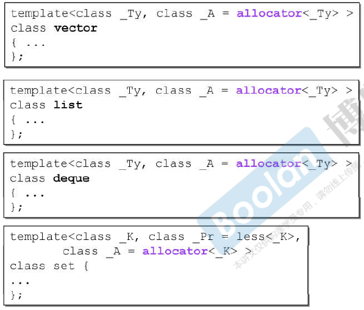
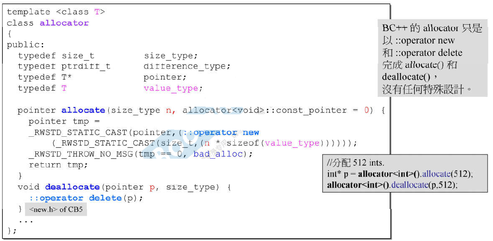
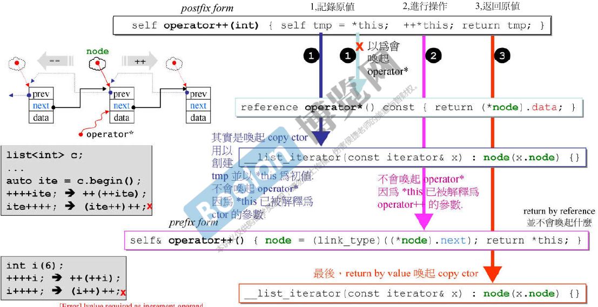
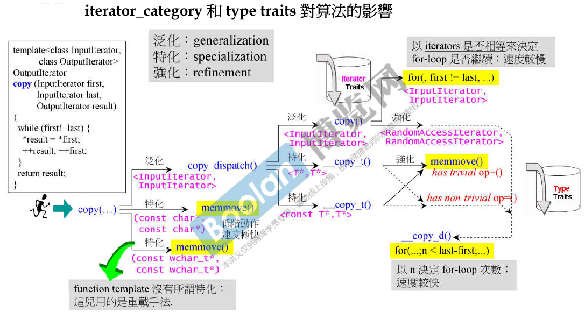

<!-- START doctoc generated TOC please keep comment here to allow auto update -->
<!-- DON'T EDIT THIS SECTION, INSTEAD RE-RUN doctoc TO UPDATE -->


- [深入理解 STL](#%E6%B7%B1%E5%85%A5%E7%90%86%E8%A7%A3-stl)
  - [一、STL组件](#%E4%B8%80stl%E7%BB%84%E4%BB%B6)
  - [二、容器使用](#%E4%BA%8C%E5%AE%B9%E5%99%A8%E4%BD%BF%E7%94%A8)
    - [1、使用 array](#1%E4%BD%BF%E7%94%A8-array)
    - [2、使用 vector](#2%E4%BD%BF%E7%94%A8-vector)
    - [3、使用 list](#3%E4%BD%BF%E7%94%A8-list)
    - [4、使用 forward_list](#4%E4%BD%BF%E7%94%A8-forward_list)
    - [5、使用 deque](#5%E4%BD%BF%E7%94%A8-deque)
    - [6、使用 queue](#6%E4%BD%BF%E7%94%A8-queue)
    - [7、使用 stack](#7%E4%BD%BF%E7%94%A8-stack)
    - [8、使用 multiset](#8%E4%BD%BF%E7%94%A8-multiset)
    - [9、使用 multimap](#9%E4%BD%BF%E7%94%A8-multimap)
    - [10、使用 unordered_multiset](#10%E4%BD%BF%E7%94%A8-unordered_multiset)
    - [11、使用 unordered_multimap](#11%E4%BD%BF%E7%94%A8-unordered_multimap)
    - [12、使用 set](#12%E4%BD%BF%E7%94%A8-set)
    - [13、使用 map](#13%E4%BD%BF%E7%94%A8-map)
    - [其他容器使用](#%E5%85%B6%E4%BB%96%E5%AE%B9%E5%99%A8%E4%BD%BF%E7%94%A8)
  - [三、allocators 分配器](#%E4%B8%89allocators-%E5%88%86%E9%85%8D%E5%99%A8)
    - [1、operator new 和 malloc](#1operator-new-%E5%92%8C-malloc)
    - [2、VC6.0 STL 中allocators的使用](#2vc60-stl-%E4%B8%ADallocators%E7%9A%84%E4%BD%BF%E7%94%A8)
    - [3、BC5 STL 中allocators的使用](#3bc5-stl-%E4%B8%ADallocators%E7%9A%84%E4%BD%BF%E7%94%A8)
    - [4、GCC2.9 STL 中allocators的使用](#4gcc29-stl-%E4%B8%ADallocators%E7%9A%84%E4%BD%BF%E7%94%A8)
    - [5、GCC4.9 STL 中allocators的使用](#5gcc49-stl-%E4%B8%ADallocators%E7%9A%84%E4%BD%BF%E7%94%A8)
  - [四、iterator 迭代器](#%E5%9B%9Biterator-%E8%BF%AD%E4%BB%A3%E5%99%A8)
    - [1、list iterator](#1list-iterator)
    - [2、Traits技术](#2traits%E6%8A%80%E6%9C%AF)
    - [3、iterator需要遵循的原则](#3iterator%E9%9C%80%E8%A6%81%E9%81%B5%E5%BE%AA%E7%9A%84%E5%8E%9F%E5%88%99)
  - [五、容器内部实现](#%E4%BA%94%E5%AE%B9%E5%99%A8%E5%86%85%E9%83%A8%E5%AE%9E%E7%8E%B0)
    - [1、vector](#1vector)
    - [2、array](#2array)
    - [3、forward_list](#3forward_list)
    - [4、deque](#4deque)
    - [5、queue 和 stack](#5queue-%E5%92%8C-stack)
      - [（1）queue](#1queue)
      - [（2）stack](#2stack)
      - [（3）底层数据结构](#3%E5%BA%95%E5%B1%82%E6%95%B0%E6%8D%AE%E7%BB%93%E6%9E%84)
    - [6、其他](#6%E5%85%B6%E4%BB%96)
  - [六、算法](#%E5%85%AD%E7%AE%97%E6%B3%95)
    - [1、iterator_cagegory](#1iterator_cagegory)
    - [2、iterator_cagegory 对算法的影响](#2iterator_cagegory-%E5%AF%B9%E7%AE%97%E6%B3%95%E7%9A%84%E5%BD%B1%E5%93%8D)
    - [3、常见算法分析](#3%E5%B8%B8%E8%A7%81%E7%AE%97%E6%B3%95%E5%88%86%E6%9E%90)
      - [（1）accumulate](#1accumulate)
      - [（2）for_each](#2for_each)
      - [（3）replace_*](#3replace_)
      - [（4）count_*](#4count_)
      - [（5）find_*](#5find_)
      - [（6）sort](#6sort)
      - [（7）binary_search](#7binary_search)
  - [七、adapter适配器](#%E4%B8%83adapter%E9%80%82%E9%85%8D%E5%99%A8)
    - [1、仿函数](#1%E4%BB%BF%E5%87%BD%E6%95%B0)
    - [2、容器适配器](#2%E5%AE%B9%E5%99%A8%E9%80%82%E9%85%8D%E5%99%A8)
    - [3、函数适配器](#3%E5%87%BD%E6%95%B0%E9%80%82%E9%85%8D%E5%99%A8)
      - [（1）bind2nd](#1bind2nd)
      - [（2）not1](#2not1)
    - [4、迭代器适配器](#4%E8%BF%AD%E4%BB%A3%E5%99%A8%E9%80%82%E9%85%8D%E5%99%A8)

<!-- END doctoc generated TOC please keep comment here to allow auto update -->

## 深入理解 STL

本文内容全部来自博览网侯杰大师的录制视频，向大师致敬！！！

### 一、STL组件

STL 由以下六大组件构成：

* 容器(Containers)
* 分配器(Allocators)
* 算法(Algorithms)
* 迭代器(Iterators)
* 适配器(Adapters)
* 仿函数(Functors)

它们之间的关系可以用下面这张图表示：


STL 中的迭代器遵循“前闭后开”区间：


### 二、容器使用

STL 容及其内部结构可以用下面这张图表示：


#### 1、使用 array

array的结构如下所示：


测试代码详见 src/01.test_array.cpp

#### 2、使用 vector

vector的结构如下所示：


测试代码详见 src/02.test_vector.cpp

#### 3、使用 list

list 的结构如下所示：


测试代码详见 src/03.test_list.cpp

#### 4、使用 forward_list

forward_list 的结构如下所示：


测试代码详见 src/04.test_forward_list

#### 5、使用 deque

deque 的结构如下所示：


测试代码详见 src/05.test_deque.cpp

#### 6、使用 queue

deque 的结构如下所示：


测试代码详见 src/06.test_queue.cpp

#### 7、使用 stack

stack 的结构如下所示：


测试代码详见 src/07.test_stack.cpp

#### 8、使用 multiset

multiset 的结构如下所示：


测试代码详见 src/08.test_multiset.cpp

#### 9、使用 multimap

multimap 的结构如下所示：


测试代码详见 src/09.test_multimap.cpp

#### 10、使用 unordered_multiset

unordered_multiset 的结构如下所示：


测试代码详见 src/10.test_unordered_multiset.cpp

#### 11、使用 unordered_multimap

unordered_multimap 的结构如下所示：


测试代码详见 src/11.test_unordered_multimap.cpp

#### 12、使用 set

set 的结构如下所示：


测试代码详见 src/12.test_set.cpp

#### 13、使用 map

map 的结构如下所示：


测试代码详见 src/13.test_map.cpp

#### 其他容器使用

详见src下代码。

### 三、allocators 分配器

STL 通过allocator来给容器分配内存，有些allocator实现只是调用了operator new()，本质上还是调用了malloc；但有些则是实现了一个“内存池”，通过该内存池来给容器分配空间，效率较高。

#### 1、operator new 和 malloc

对于很多编译器，operator new的内部其实也是调用了malloc：


#### 2、VC6.0 STL 中allocators的使用

在使用容器时，我们通常需要按照这样方式来定义一个集合：
```c
vector<int> vec;
```
需要在泛型模板中填入容器的数据类型。但是其实容器可以填入两个数据，另一个数据便是分配器，只不过默认情况下编译器已经为我们使用了默认的allocator，不需要我们自己手动指定：



VC6.0的allocator设计如下：


其本质也是调用了operator new()。

#### 3、BC5 STL 中allocators的使用


其内部实现也是调用了operator new()，并没有其他特殊设计：



#### 4、GCC2.9 STL 中allocators的使用


内部实现如下：


虽然看起来该版本使用的allocator只是调用了operator new()，但其实内部并没有使用该套分配器，其内部是实现了一个内存池，该内存池结构如下所示（该实现可参考内存管理专题内容）：


#### 5、GCC4.9 STL 中allocators的使用


内部实现：


看起来没有什么特殊设计，也抛弃了GCC2.9中的优秀设计，只是封装了operator new()。但是GCC4.9中有相当多extends allocators，其中有一个__pool__alloc，这个分配器便和GCC2.9中的alloc是一样的：


### 四、iterator 迭代器

#### 1、list iterator


从上图可以看到，STL的list结构是一个循环双向链表，list类模板里有两个较为重要的成员，一个是link_type类型的node，一个是__list_iterator<T, T&, T*>类型的iterator，其中link_type的本质是__list_node*结构，此结构体详见上图。下面将分析__list_iterator结构：


__list_iterator是一个重载了多种操作符的指针。



值得注意的是iterator的前置和后置++操作。C++11标准为了标识后置++采取了operator++(int)方式。后置++操作后先获取node节点(__list_node*指针类型)的下一个节点地址，然后将该地址转化为__list_node*指针类型，最后返回*this的引用。总体上看就是该迭代器指针指向了传入链表节点的下一个节点。后置++操作先保存该迭代器到tmp中，然后调用前置++，并返回临时变量tmp，返回时由于不是返回引用故调用了迭代器的拷贝构造函数。这里不能返回引用，主要是为了避免后置连续++，例如i++++，这在C++中是不允许的。这个迭代器的设计真的十分精妙。


关于重载*和->运算符，重载*运算符相当于返回节点的data域,此时返回的是引用，然后假设data中有method()何field，此时就可以利用data.method()和data.field来调用属性和方法，也就是说(*it)最后返回的是node的data成员，(*it) == data。

重载->运算符将调用operator*()函数，先返回data对象的引用，然后取data的地址并返回一个指向data地址的指针，所以it->method()等价于(&(*it))->method()，即通过data的地址（this指针）来访问data的方法和属性。

下面是GCC2.9和GCC4.9 STL中list的一些区别：


从上面可见，G4.9较G2.9__list_iterator<>泛型模板列表只有一个元素_Tp，更加简洁，但从整个list容器设计来看，结构其实更加复杂。

#### 2、Traits技术


测试代码详见src。

#### 3、iterator需要遵循的原则


迭代器是沟通容器和算法的桥梁，但是一个算法需要迭代器提供iterator_category、difference_type和value_type（reference和pointer没用到），所以一个迭代器中需要提供这五种类型：


但是iterator有可能不是一个类，只是普通的指针，所以需要判断迭代器的类型，于是：


STL使用Traits来分离class iterators和no-class iterators：


### 五、容器内部实现

#### 1、vector

vector的定义如下所示：


当向vector中push_back数据时，如果vector的容量如果无法再容纳新加入的元素，那么将会进行扩容操作：


扩容的过程中会生成一个新的vector，该vector的容量是之前vector的两倍，然后将旧的vector里面的元素拷贝到新的vector中，并释放旧的vector空间：


同样地，vector的iterator也提供了Traits：


#### 2、array


#### 3、forward_list


#### 4、deque

deque其实不是大多人想象中的所谓“双向队列”，STL中的deque设计十分复杂精巧：


deque的内部是一个由多个逻辑连续的缓冲区所构成的map，每个map的节点便是一个缓冲区。迭代器指针中的node便指向其中正在访问的一个缓冲区，first和last分别指向该缓冲区的首位元素，cur指向正在访问的缓冲区元素。


deque的iterator定义如下：


deque的插入元素操作：


deque空间上不连续，但是在逻辑上是连续的，这得益于iterator，iterator会切换到正确的缓冲区，并访问正确的节点：


#### 5、queue 和 stack

##### （1）queue


##### （2）stack


##### （3）底层数据结构

stack和queue都不允许遍历，也不提供iterator。stack和queue的底层实现可以使用list或者deque：


stack可以使用vector作为底层实现，但queue不可以：


stack和queue都不能使用map/set作为底层实现：


#### 6、其他

详见附录pdf文件。

### 六、算法

#### 1、iterator_cagegory

算法通过容器提供的迭代器来访问容器元素，并调用相关算法，但是容器元素类型并不知道，至于是哪种元素类型，需要迭代器告诉算法：


下面是各种容器的iterator_cagegory：


下面有两个迭代器案例，以istream_iterator 和 ostream_iterator的iterator_category为例，它们内部的iterator_category定义如下：


#### 2、iterator_cagegory 对算法的影响


从上面可见，farward_iterator_tag、bidirectional_iterator_tag和random_access_iterator_tag都继承自input_iterator_tag。当调用distance()函数时，在该函数内部会根据InputIterator获取到对应的iterator_category，然后进一步调用__distance函数，并将Traits出来的iterator_category类型传入。而__distance函数使用了函数重载和模板特化技术，根据传入的iterator_category类型调用不同的__distance()函数。

下面这个例子也类似：


上面讲到，算法函数通过迭代器及其Traits技术获取到迭代器的类型，并通过重载和模板特化技术来调用最终的目标函数，下面便是这一过程的细节展示：




#### 3、常见算法分析

##### （1）accumulate


使用方法见src/16.test_accumulate.cpp

##### （2）for_each


使用方法见src/17.test_for_each.cpp

##### （3）replace_*


##### （4）count_*


##### （5）find_*


##### （6）sort


##### （7）binary_search


### 七、adapter适配器


#### 1、仿函数

自己写的仿函数要是想要融入到STL中，那么必须要继承binary_function：


#### 2、容器适配器


#### 3、函数适配器

##### （1）bind2nd


##### （2）not1


#### 4、迭代器适配器

详见附录pdf。

