<!-- START doctoc generated TOC please keep comment here to allow auto update -->
<!-- DON'T EDIT THIS SECTION, INSTEAD RE-RUN doctoc TO UPDATE -->

- [Makefile编写](#makefile%E7%BC%96%E5%86%99)
  - [1、Level1](#1level1)
  - [2、Level2](#2level2)
  - [3、Level3](#3level3)
  - [4、Level4](#4level4)
  - [5、Level5](#5level5)
  - [6、Level6](#6level6)

<!-- END doctoc generated TOC please keep comment here to allow auto update -->

## Makefile编写

### 1、Level1

首先，有这么一个文件夹，里面的内容如下：

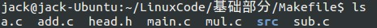

main.c 内容如下：

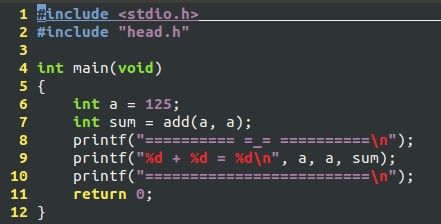

现在编译运行这个程序，于是编写简单的 Makefile 如下：

然后编译运行程序：

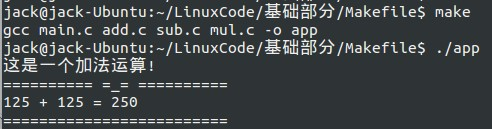

### 2、Level2

上面的方法似乎很完美，但是缺点是，效率低，修改一个文件，全部文件需要重新编译。于是，将 Makefile 修改如下：

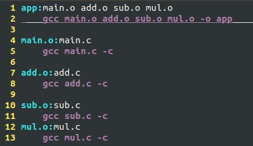

重新编译运行：

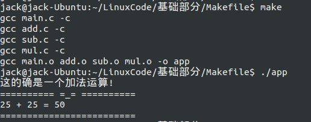

然后修改下 add.c 文件，再次编译运行：

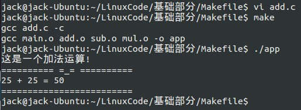

可见，只重新编译修改过的文件，其他的没有再次编译！

### 3、Level3

然而，上一级的 Makefile 重复度太多了，我们可以采用变量的方法来降低冗余。修改 Makefile 如下：

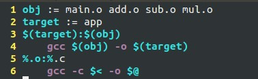

编译运行结果如下：

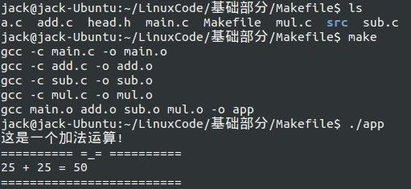

现在解释下关于 Makefile 中的变量与规则：

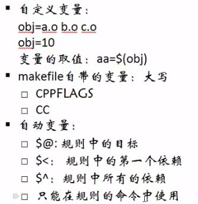

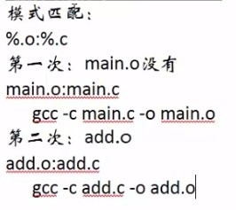

### 4、Level4

当然，没有最简单，只有更简单，这样也是可以的：

### 5、Level5

也许上面的也很完美了，但很不灵活，移植到其他项目中比较麻烦，于是引入了Makefile 中的函数：

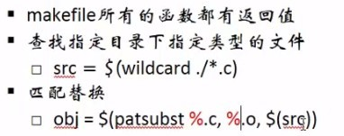

修改 Makefile 如下：

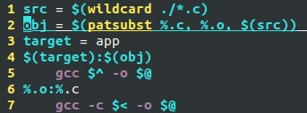

编译运行结果如下：

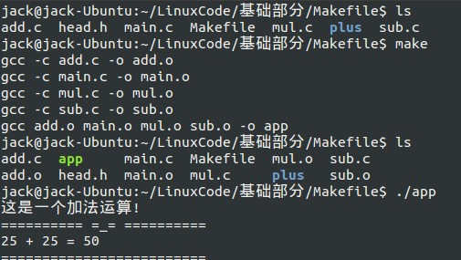

### 6、Level6

Makefile 还需要有清理工程的功能，所以有：

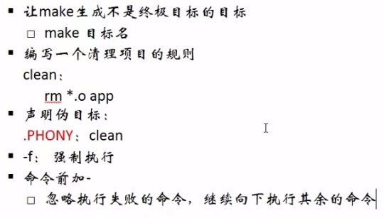

修改代码如下：

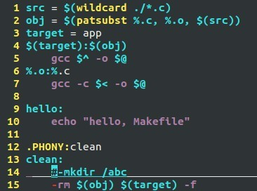

运行结果如下：

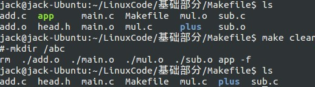