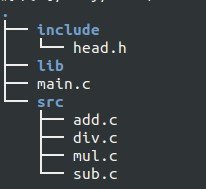
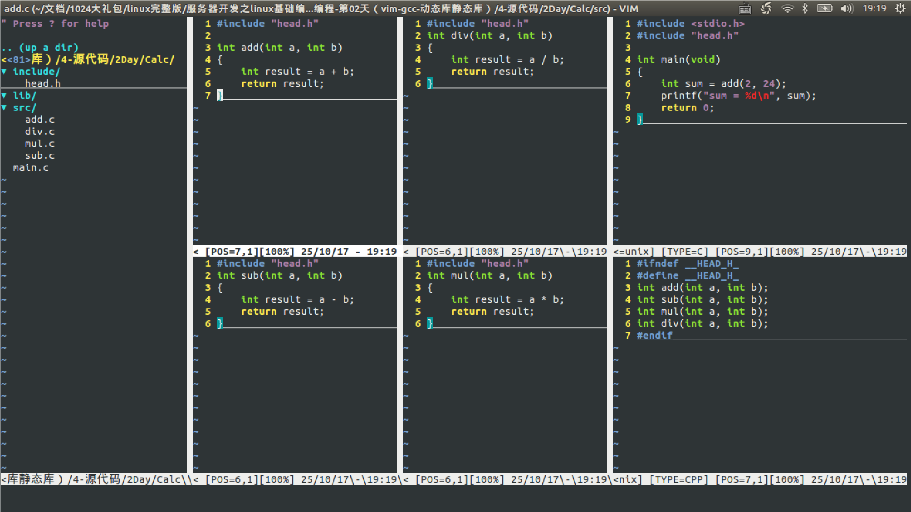
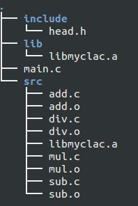
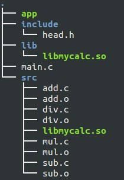

<!-- START doctoc generated TOC please keep comment here to allow auto update -->
<!-- DON'T EDIT THIS SECTION, INSTEAD RE-RUN doctoc TO UPDATE -->

- [静态库与动态库的制作与使用](#%E9%9D%99%E6%80%81%E5%BA%93%E4%B8%8E%E5%8A%A8%E6%80%81%E5%BA%93%E7%9A%84%E5%88%B6%E4%BD%9C%E4%B8%8E%E4%BD%BF%E7%94%A8)
  - [一、静态库的制作与使用](#%E4%B8%80%E9%9D%99%E6%80%81%E5%BA%93%E7%9A%84%E5%88%B6%E4%BD%9C%E4%B8%8E%E4%BD%BF%E7%94%A8)
  - [二、动态库的制作与使用](#%E4%BA%8C%E5%8A%A8%E6%80%81%E5%BA%93%E7%9A%84%E5%88%B6%E4%BD%9C%E4%B8%8E%E4%BD%BF%E7%94%A8)
    - [第一种--临时设置环境变量](#%E7%AC%AC%E4%B8%80%E7%A7%8D--%E4%B8%B4%E6%97%B6%E8%AE%BE%E7%BD%AE%E7%8E%AF%E5%A2%83%E5%8F%98%E9%87%8F)
    - [第二种--设置永久环境变量](#%E7%AC%AC%E4%BA%8C%E7%A7%8D--%E8%AE%BE%E7%BD%AE%E6%B0%B8%E4%B9%85%E7%8E%AF%E5%A2%83%E5%8F%98%E9%87%8F)
      - [（1）设置系统环境变量：](#1%E8%AE%BE%E7%BD%AE%E7%B3%BB%E7%BB%9F%E7%8E%AF%E5%A2%83%E5%8F%98%E9%87%8F)
      - [（2）设置用户环境变量：](#2%E8%AE%BE%E7%BD%AE%E7%94%A8%E6%88%B7%E7%8E%AF%E5%A2%83%E5%8F%98%E9%87%8F)

<!-- END doctoc generated TOC please keep comment here to allow auto update -->

## 静态库与动态库的制作与使用

### 一、静态库的制作与使用

首先，有如下工作环境和目录：

可以查看文件内容如下：

接下来：

    cd src
    gcc  -c *.c  -I ../include
    ar -rcs libmyclac.a *.o

然后可以在src目录下看到libmycalc.a静态库文件。

接下来将这个库文件拷贝到 lib 中，到时发布时就直接把 lib 文件夹和 include 文件夹发布给用户即可：

    cp libmyclac.a ../lib

调整后目录结构如下图所示：

现在编译测试下制作的库，在main.c所在目录下输入：

    gcc main.c -I ./include/ -L ./lib/ -lmyclac -o app

其中-I选项指的是指定静态库的头文件目录，这里是./include/；-L指定静态库的路径，这里是./lib/；-lmyclac链接静态库。测试结果如下：

    sum = 26

至此，静态库的制作与测试到此结束了。

### 二、动态库的制作与使用

在上节 src 目录下敲入如下命令以生成动态库libmycalc.so：

    gcc  -c *.c  -I ../include
    gcc -shared *.o -o libmycalc.so

然后将该动态库拷贝到lib目录下：

    cp libmycalc.so ../lib

文件夹结构如下图所示：

接下来编译测试程序：

    gcc main.c -I ./include/ -L ./lib/ -lmycalc -o app
    ./app

结果出错：

    ./app: error while loading shared libraries: libmycalc.so: cannot open shared object file: No such file or directory

接着敲入如下命令:ldd app

	linux-vdso.so.1 =>  (0x00007fff319c6000)
	libmycalc.so => not found
	libc.so.6 => /lib/x86_64-linux-gnu/libc.so.6 (0x00007fa64f4a2000)
	/lib64/ld-linux-x86-64.so.2 (0x000055dd8fd8a000)

可以看到，无法找到依赖libmycalc.so。要找到依赖就需要设置环境变量，查看环境变量:

    echo $PATH

输出：

    /usr/local/java/jdk1.8.0_191/bin:/usr/local/sbin:/usr/local/bin:/usr/sbin:/usr/bin:/sbin:/bin:/usr/games:/usr/local/games

可见，没有依赖库的环境路径。所以需要设置环境变量，这里有两种方法设置。

#### 第一种--临时设置环境变量

输入如下命令：

    export LD_LIBRARY_PATH=./lib
    ./app

运行结果如下：

    sum = 26

然后用ldd命令查看app相关依赖：

	linux-vdso.so.1 =>  (0x00007ffd46fd4000)
	libmycalc.so => ./lib/libmycalc.so (0x00007f7dfa238000)
	libc.so.6 => /lib/x86_64-linux-gnu/libc.so.6 (0x00007f7df9e5e000)
	/lib64/ld-linux-x86-64.so.2 (0x00005575acd41000)

这次就找到libmycalc.so的地址了。然而问题是关闭终端后，环境失效，每次重启终端都需要重新设置该临时环境变量。

#### 第二种--设置永久环境变量

环境变量有系统环境变量和用户环境变量之分，下面举例说明，但我们的例子不采用这个方法。

##### （1）设置系统环境变量：

* a.  打开终端并输入：sudo gedit /etc/environment

* b. 在 PATH="...."的末尾处添加：/opt/EmbedSky/4.3.3/bin 其中/opt/EmbedSky/4.3.3/bin 为你自己需要设置的环境变量路径

* c.  使其立即生效，在终端执行：source /etc/environment

##### （2）设置用户环境变量：

* a. 打开终端并输入：sudo gedit ~/.bashrc

* b. 前面的步骤会打开.bashrc 文件，在其末尾添加：

    export PATH=/opt/EmbedSky/4.3.3/bin:$PATH

    其中/opt/EmbedSky/4.3.3/bin 为你自己需要设置的环境变量路径

* c.  使其立即生效，在终端执行：source ~/.bashrc

通过设置永久环境变量，问题可以得到比较好的解决。当然，除了上面的修改环境变量方法以外还有一种方法，就是：修改/etc/ld.so.conf文件内容，将库的绝对路径添加到文件里面。

    sudo vi /etc/ld.so.conf

向文件中添加：

    /mnt/hgfs/vmshared/LinuxCodeMaster/基础部分/Calc/lib

将.so库的路径添加进入，保存退出，然后使用ldd命令查看链接信息，结果如下：

	linux-vdso.so.1 =>  (0x00007ffecb66d000)
	libmycalc.so => /mnt/hgfs/vmshared/LinuxCodeMaster/基础部分/Calc/lib/libmycalc.so (0x00007fd3e00bf000)
	libc.so.6 => /lib/x86_64-linux-gnu/libc.so.6 (0x00007fd3dfcfa000)
	/lib64/ld-linux-x86-64.so.2 (0x0000562e7a905000)

最后运行也没毛病，完美解决该问题。