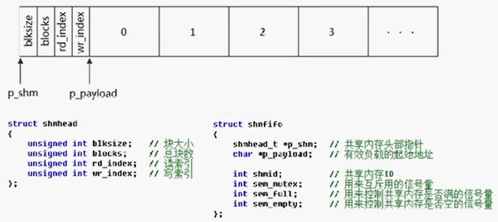

## System V 信号量和共享内存实现消息队列

信号量可用于实现同步和消费者生产者模型，消息队列也是生产者消费者模型。消息队列发送和取走消息需要拷贝操作，如果使用共享内存实现将提高效率，所以就有了该案例。

设计思想是，创建一个队列，该队列中保存了发送和接收的数据缓冲区，该缓冲区采用共享内存，也就是说发送和接收消息都是从该缓冲区中取走数据，该消息队列模型如下所示：



消息队列相关结构定义如下：

```cpp
struct shmread
{
    unsigned int blocksize; // 块大小
    unsigned int blocks;    // 总块数
    unsigned int rd_index;  // 读索引
    unsigned int wr_index;  // 写索引
};

struct shmfifo
{
    shmhead_t *p_shm;   // 共享内存头部指针
    char* p_payloadd;   // 有效负载的起始地址

    int shmid;          // 共享内存ID
    int sem_mutex;      // 用来互斥用的信号量
    int sem_full;       // 用来控制共享内参是否满的信号量
    int sem_empty;       // 用来控制共享内参是否空的信号量
};
```

这里还用到了三个信号量，sem_mutex用于互斥操作，由于读写都是在同一块共享内存中，所以必须要加锁保护；sem_full 用于标记当前共享内存长度是否越界，该案例中共享内存默认只创建十个槽位，所以sem_full初始化为10，每次向共享内存中加数据前将其执行P操作，即减少一个可写槽位，然后移动设置新的写索引(shmread.wr_index)；sem_empty也用于标记可读槽位是否为空，初始化时为0，每次读操作前需要对其P操作，然后设置读索引。

在初始化队列函数shmfifo_init中，有一段设置p_playloadd 有效负载的起始地址的代码：
```cpp
shmfifo1->p_payloadd = (char*)(shmfifo1->p_shm + 1);
```
由于共享内存区映射的是fifo头和内存块大小：
```cpp
int size = sizeof(shmhead_t) + blocks * blocksize;
```
结合前面的图该fifo的大小等于shmread结构体大小加上每个块大小乘以块的数量。shmfifo1->p_shm为shmfifo的起始地址，由于结构体字节对齐，对其加一操作将跨越直接跨越fifo的头部，指向blocks * blocksize的首地址。

下面是发送消息的代码：

```cpp
void shmfifo_put(shmfifo_t* fifo, const void* buf)
{
    sem_p(fifo->sem_full);
    sem_p(fifo->sem_mutex);
    memcpy((fifo->p_shm->wr_index)*fifo->p_shm->blocksize + fifo->p_payloadd, buf, fifo->p_shm->blocksize);
    fifo->p_shm->wr_index = (fifo->p_shm->wr_index + 1) % fifo->p_shm->blocks;
    sem_v(fifo->sem_mutex);
    sem_v(fifo->sem_empty);
}
```
逻辑很好理解，在前面也大致分析过了，首先对sem_full进行P操作，判断是否还有槽位可写，如果有，那么尝试sem_mutex加锁，如果加锁成功那么直接将buf里的数据拷贝到当前wr_index槽位，然后让wr_index加以（相当于移动指针），但是，代码中却是(fifo->p_shm->wr_index + 1) % fifo->p_shm->blocks，多了%后的东西，这样做的原因是，如果该队列中wr_index加一超过了10，那么将从队列缓冲区头部开始重新计算新的wr_index位置。在往消息队列中写入数据后，对sem_mutex进行V操作，释放锁，并对sem_empty进行V操作，接触消费者进程的阻塞，消费者从队列中取走数据代码如下：

```cpp
void shmfifo_get(shmfifo_t* fifo, char* buf)
{
    sem_p(fifo->sem_empty);
    sem_p(fifo->sem_mutex);
    memcpy(buf, (fifo->p_shm->rd_index)*fifo->p_shm->blocksize + fifo->p_payloadd, fifo->p_shm->blocksize);
    fifo->p_shm->rd_index = (fifo->p_shm->rd_index + 1) % fifo->p_shm->blocks;
    sem_v(fifo->sem_mutex);
    sem_v(fifo->sem_full);
}
```
分析和前面shmfifo_put函数类似。
