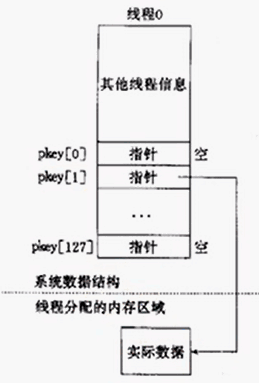

<!-- START doctoc generated TOC please keep comment here to allow auto update -->
<!-- DON'T EDIT THIS SECTION, INSTEAD RE-RUN doctoc TO UPDATE -->


- [线程](#%E7%BA%BF%E7%A8%8B)
  - [一、创建线程](#%E4%B8%80%E5%88%9B%E5%BB%BA%E7%BA%BF%E7%A8%8B)
  - [二、向创建线程中传递参数](#%E4%BA%8C%E5%90%91%E5%88%9B%E5%BB%BA%E7%BA%BF%E7%A8%8B%E4%B8%AD%E4%BC%A0%E9%80%92%E5%8F%82%E6%95%B0)
  - [三、线程退出--pthread_exit](#%E4%B8%89%E7%BA%BF%E7%A8%8B%E9%80%80%E5%87%BA--pthread_exit)
  - [四、阻塞等待子线程退出--pthread_join](#%E5%9B%9B%E9%98%BB%E5%A1%9E%E7%AD%89%E5%BE%85%E5%AD%90%E7%BA%BF%E7%A8%8B%E9%80%80%E5%87%BA--pthread_join)
  - [五、线程分离](#%E4%BA%94%E7%BA%BF%E7%A8%8B%E5%88%86%E7%A6%BB)
  - [六、线程属性](#%E5%85%AD%E7%BA%BF%E7%A8%8B%E5%B1%9E%E6%80%A7)
  - [七、pthread_once](#%E4%B8%83pthread_once)
  - [八、线程特定数据](#%E5%85%AB%E7%BA%BF%E7%A8%8B%E7%89%B9%E5%AE%9A%E6%95%B0%E6%8D%AE)
  - [九、pthread_yield](#%E4%B9%9Dpthread_yield)
  - [十、pthread_atfork](#%E5%8D%81pthread_atfork)
  - [十一、pthread_kill](#%E5%8D%81%E4%B8%80pthread_kill)
  - [十二、线程在Linux中的实现](#%E5%8D%81%E4%BA%8C%E7%BA%BF%E7%A8%8B%E5%9C%A8linux%E4%B8%AD%E7%9A%84%E5%AE%9E%E7%8E%B0)

<!-- END doctoc generated TOC please keep comment here to allow auto update -->

## 线程


### 一、创建线程


下面这个案例将创建一个线程，线程只是打印自己的线程ID后退出。

pthread_create.c

```c
#include <stdio.h>
#include <unistd.h>
#include <stdlib.h>
#include <sys/types.h>
#include <sys/stat.h>
#include <string.h>
#include <pthread.h>

void* myfunc(void* arg)
{
    printf("child pthread id: %lu\n", pthread_self());
    return NULL;
}

int main(int argc, const char* argv[])
{
    // 创建子线程
    pthread_t thid;
    // 返回错误号
    int ret = pthread_create(&thid, NULL, myfunc, NULL);
    if(ret != 0)
    {
        printf("error number: %d\n", ret);
        // 根据错误号打印错误信息
        printf("error information: %s\n", strerror(ret));
    }
    printf("parent pthread id: %lu\n", pthread_self());

    sleep(1);

    return 0;
}
```
运行结果如下：

    parent pthread id: 140598483212096
    child pthread id: 140598474909440

### 二、向创建线程中传递参数

下面这个程序将演示创建多个线程并向其传递创建顺序的编号

loop_pthread_create.c
```c
#include <stdio.h>
#include <unistd.h>
#include <stdlib.h>
#include <sys/types.h>
#include <sys/stat.h>
#include <string.h>
#include <pthread.h>

void* myfunc(void* arg)
{
    int num = *(int*)arg;
    printf("%dth child pthread id: %lu\n", num, pthread_self());
    return NULL;
}

int main(int argc, const char* argv[])
{
    // 创建子线程
    pthread_t thid[5];
    // 返回错误号
    for(int i=0; i<5; ++i)
    {
        int ret = pthread_create(&thid[i], NULL, myfunc, (void*)&i);
        if(ret != 0)
        {
            printf("error number: %d\n", ret);
            // 根据错误号打印错误信息
            printf("error information: %s\n", strerror(ret));
        }
    }
    printf("parent pthread id: %lu\n", pthread_self());

    sleep(1);

    return 0;
}
```
输出结果如下：

    0th child pthread id: 139758982747904
    parent pthread id: 139758991050560
    5th child pthread id: 139758957569792
    5th child pthread id: 139758949177088
    5th child pthread id: 139758974355200
    5th child pthread id: 139758965962496

很明显，传入的i值基本都变成5了。分析程序，程序在一个for循环中创建了5个线程，并传递了同一个变量的地址，当一个线程创建后如果没有立刻执行打印，但其他某个线程在执行打印，这样就改变了i的值，也就是说先创建的线程的i是动态变化的，已经不是开始那个传入的i值了，这里可以传值而不是地址来解决这问题，将

```c
int ret = pthread_create(&thid[i], NULL, myfunc, (void*)&i);
```
修改为：

```c
int ret = pthread_create(&thid[i], NULL, myfunc, (void*)i);
```

再将
```c
int num = *(int*)arg;
```
修改为：
```c
int num = (int)arg;
```
运行结果如下：

    parent pthread id: 140292495243072
    0th child pthread id: 140292486940416
    1th child pthread id: 140292478547712
    2th child pthread id: 140292470155008
    3th child pthread id: 140292461762304
    4th child pthread id: 140292453369600

可见方法有效，但问题是这种强制类型转换很容易出现精度丢失或者截断的异常或者错误，不是很提倡。

### 三、线程退出--pthread_exit


下面这个程序创建了一个线程，在线程中循环打印i值，在主线程中使用pthread_exit函数退出，子线程还是继续执行，所以可以使用phtead_exit退出一个线程，而且不会影响其他的线程。需要注意的是这里不能用exit函数退出线程，因为子线程和主线程在同一个进程中，如果使用exit函数将导致所以线程都退出。不推荐使用该函数，因为异常退出可能会导致线程中某些资源没有释放（例如互斥锁，容易导致死锁）。

pthread_exit.c

```c
#include <stdio.h>
#include <unistd.h>
#include <stdlib.h>
#include <sys/types.h>
#include <sys/stat.h>
#include <string.h>
#include <pthread.h>

void* myfunc(void* arg)
{
    printf("child pthread id: %lu\n", pthread_self());
    printf("child thread .....\n");
    for(int i=0; i<5; ++i)
    {
        printf("child i = %d\n", i);
    }
    return NULL;
}

int main(int argc, const char* argv[])
{
    // 创建子线程
    pthread_t thid;
    // 返回错误号
    int ret = pthread_create(&thid, NULL, myfunc, NULL);
    if(ret != 0)
    {
        printf("error number: %d\n", ret);
        // 根据错误号打印错误信息
        printf("error information: %s\n", strerror(ret));
    }
    printf("parent pthread id: %lu\n", pthread_self());

    // 退出主线程，子线程不受影响
    pthread_exit(NULL);

    printf("parent thread .....\n");
    for(int i=0; i<3; ++i)
    {
        printf("i = %d\n", i);
    }

    return 0;
}
```
运行结果如下：

    parent pthread id: 139832570156864
    child pthread id: 139832561854208
    child thread .....
    child i = 0
    child i = 1
    child i = 2
    child i = 3
    child i = 4

### 四、阻塞等待子线程退出--pthread_join

pthread_join()即是子线程合入主线程，主线程阻塞等待子线程结束，然后回收子线程资源。


下面程序创建了一个子线程，使用number变量作为线程退出传递给主线程的资源，在主线程中使用pthread_join函数阻塞等待子线程退出，并获取ptr指针内容。在子线程退出后主线程才执行后面的打印操作。

pthread_join.c

```c
#include <stdio.h>
#include <unistd.h>
#include <stdlib.h>
#include <sys/types.h>
#include <sys/stat.h>
#include <string.h>
#include <pthread.h>

int number = 100;
void* myfunc(void* arg)
{
    
    printf("child pthread id: %lu\n", pthread_self());
    printf("child thread .....\n");
    for(int i=0; i<5; ++i)
    {
        printf("child i = %d\n", i);
    }
        
    return &number;
}

int main(int argc, const char* argv[])
{
    // 创建子线程
    pthread_t thid;
    // 返回错误号
    int ret = pthread_create(&thid, NULL, myfunc, NULL);
    if(ret != 0)
    {
        printf("error number: %d\n", ret);
        // 根据错误号打印错误信息
        printf("error information: %s\n", strerror(ret));
    }
    printf("parent pthread id: %lu\n", pthread_self());

    // 退出主线程，子线程不受影响
    int *ptr;
    pthread_join(thid, (void**)&ptr);
    printf("++++++++++ number = %d\n", *ptr);

    printf("parent thread .....\n");
    for(int i=0; i<3; ++i)
    {
        printf("i = %d\n", i);
    }
    return 0;
}
```
运行结果如下：

    arent pthread id: 140455127037760
    child pthread id: 140455118735104
    child thread .....
    child i = 0
    child i = 1
    child i = 2
    child i = 3
    child i = 4
    ++++++++++ number = 100
    parent thread .....
    i = 0
    i = 1
    i = 2

### 五、线程分离

在任何一个时间点上，线程是可结合的（joinable），或者是分离的（detached）。一个可结合的线程能够被其他线程收回其资源和杀死；在被其他线程回收之前，它的存储器资源（如栈）是不释放的。相反，一个分离的线程是不能被其他线程回收或杀死的，它的存储器资源在它终止时由系统自动释放。

线程的分离状态决定一个线程以什么样的方式来终止自己。在默认情况下线程是非分离状态的，这种情况下，原有的线程等待创建的线程结束。只有当pthread_join（）函数返回时，创建的线程才算终止，才能释放自己占用的系统资源。而分离线程不是这样子的，它没有被其他的线程所等待，自己运行结束了，线程也就终止了，马上释放系统资源。程序员应该根据自己的需要，选择适当的分离状态。所以如果我们在创建线程时就知道不需要了解线程的终止状态，则可以pthread_attr_t结构中的detachstate线程属性，让线程以分离状态启动。

默认情况下，线程被创建成可结合的。为了避免存储器泄漏，每个可结合线程都应该要么被显示地回收，即调用pthread_join；要么通过调用pthread_detach函数被分离。如果一个可结合线程结束运⾏行但没有被join，则它的状态类似于进程中的Zombie Process， 即还有一部分资源没有被回收，所以创建线程者应该调用pthread_join来等待线程运行结束，并可得到线程的退出代码，回收其资源。 由于调用pthread_join后，如果该线程没有运行结束，调用者会被阻塞，在有些情况下我们并不希望如此。例如，在Web服务器中当主线程为每个新来的连接请求创建一个子线程进 行处理的时候，主线程并不希望因为调用pthread_join而阻塞（因为还要继续处理之后到来 的连接请求）， 这时可以在子线程中加入代码：

```c
pthread_detach(pthread_self());
```
或者父线程调用时加入：
```c
pthread_detach(thread_id);
```
这将该子线程的状态设置为分离的（detached），如此一来，该线程运⾏行结束后会自动释 放所有资源。

pthread_detach.c

```c
#include<stdio.h>
#include<pthread.h>
#include<unistd.h>
#include<sys/types.h>

void* pthread_running(void *_val)
{ 
    pthread_detach(pthread_self());
    printf("%s\n", (char*)_val);
    return NULL;
}

int main()
{ 
    pthread_t tid;
    int ret = pthread_create(&tid, NULL, pthread_running, "main thread is running");

    if(ret != 0)
    { 
        printf("create thread error! info is:%s\n", strerror(ret));
        return ret;
    }

    int temp = 0;
    sleep(1);
    if(0 == pthread_join(tid, NULL))
    { 
        printf("pthread wait success!\n");
        temp = 0;
    }
    else
    { 
        printf("pthread wait failed!\n");
        temp = 1;
    }

    return temp;
}
```
运行结果如下：

    main thread is running
    pthread wait failed!

父进程企图使用pthread_join等待子进程退出，然而失败了。分离后的子线程已经和父进程没有任何关系了，它的资源由系统回收。

### 六、线程属性


下面这个案例使用线程属性来实现线程分离：

pthread_attr.c

```c
#include <stdio.h>
#include <unistd.h>
#include <stdlib.h>
#include <sys/types.h>
#include <sys/stat.h>
#include <string.h>
#include <pthread.h>

void* myfunc(void* arg)
{
    printf("hello, i am child thread , thid = %lu\n", pthread_self());
    return NULL;
}

int main(int argc, const char* argv[])
{
    pthread_attr_t arrt;
    pthread_attr_init(&arrt);
    pthread_attr_setdetachstate(&arrt, PTHREAD_CREATE_DETACHED);
    pthread_t thid;
    pthread_create(&thid, &arrt, myfunc, NULL);

    sleep(1);
    if(0 == pthread_join(thid, NULL))
    { 
        printf("pthread wait success!\n");
    }
    else
    { 
        printf("pthread wait failed!\n");
    }


    pthread_attr_destroy(&arrt);
     
    return 0;
}
```
运行结果如下:

    hello, i am child thread , thid = 140623999129344
    pthread wait failed!

### 七、pthread_once

pthread_once函数使用初值为PTHREAD_ONCE_INIT的once_control变量保证init_routine()函数在本进程执行序列中仅执行一次。

函数原型如下：
```cpp
int pthread_once(pthread_once_t *once_control, void (*init_routine) (void))；
```
使用该函数前需要定义pthread_once_t 变量，一般设置为PTHREAD_ONCE_INIT。

下面是具体用法：
```cpp
#include <semaphore.h>
#include <sys/types.h>
#include <dirent.h>
#include <pthread.h>
#include <errno.h>
#include <signal.h>
#include <time.h>
#include <stdio.h>

pthread_once_t once = PTHREAD_ONCE_INIT;

void once_run(void)
{
    printf("once_run in thread %u\n", pthread_self());
}

void* task1(void* arg)
{
    int tid = pthread_self();
    printf("thread1 enter %u\n", tid);
    pthread_once(&once, once_run);
    printf("thread1 returns %u\n", tid);
}

void* task2(void* arg)
{
    int tid = pthread_self();
    printf("thread2 enter %u\n", tid);
    pthread_once(&once, once_run);
    printf("thread2 returns %u\n", tid);
}

int main(int argc, char *argv[])
{
    pthread_t thrd1, thrd2;

    pthread_create(&thrd1, NULL, (void*)task1, NULL);
    pthread_create(&thrd2, NULL, (void*)task2, NULL);

    pthread_join(thrd1, NULL);
	pthread_join(thrd2, NULL);
    printf("Main thread exit...\n");

    return 0;
}
```
运行结果如下：
```
thread1 enter 719398656
once_run in thread 719398656
thread2 enter 711005952
thread1 returns 719398656
thread2 returns 711005952
Main thread exit...
```
在整个程序执行过程中，程序创建了两个线程，每个线程执行函数内部都通过pthread_once函数来调用的once_run()，但once_run函数只执行了一次。

Linux Threads 使用互斥锁和条件变量保证由pthread_once()指定的函数执行且仅执行一次，而once_control则表征是否执行过。如果 once_control的初值不是PTHREAD_ONCE_INIT（Linux Threads定义为0），pthread_once()的行为就会不正常。在Linux Threads中，实际”一次性函数”的执行状态有三种：NEVER（0）、IN_PROGRESS（1）、DONE（2），如果 once初值设为1，则由于所有pthread_once()都必须等待其中一个激发”已执行一次”信号，因此所有pthread_once()都会陷入永久的等待中；如果设为2，则表示该函数已执行过一次，从而所有pthread_once()都会立即返回0。

### 八、线程特定数据

在单线程程序中，我们经常要用到"全局变量"以实现多个函数间共享数据。但是在多线程环境下，由于数据空间是共享的，因此全局变量也为所有线程所共有。 然而时应用程序设计中有必要提供线程私有的全局变量，仅在某个线程中有效，但却可以跨多个函数访问。

POSIX线程库通过维护一定的数据结构来解决这个问题，这个些数据称为（Thread-specific Data，或 TSD）。
线程特定数据也称为线程本地存储TLS（Thread-local storage），对于POD类型的线程本地存储，可以用__thread关键字，例如：

```cpp
#include <semaphore.h>
#include <sys/types.h>
#include <dirent.h>
#include <pthread.h>
#include <errno.h>
#include <unistd.h>
#include <signal.h>
#include <time.h>
#include <stdio.h>

__thread int POD;

void* task1(void* arg)
{
	POD = 1;
    printf("thread1 POD %d\n", POD);
	sleep(1);
	printf("thread1 POD %d\n", POD);
}

void* task2(void* arg)
{
	POD = 2;
    printf("thread2 POD %d\n", POD);
	sleep(2);
	printf("thread2 POD %d\n", POD);
}

int main(int argc, char *argv[])
{
    pthread_t thrd1, thrd2;

    pthread_create(&thrd1, NULL, (void*)task1, NULL);
    pthread_create(&thrd2, NULL, (void*)task2, NULL);

    pthread_join(thrd1, NULL);
	pthread_join(thrd2, NULL);
    printf("Main thread exit...\n");

    return 0;
}
```
运行结果如下：

```
thread1 POD 1
thread2 POD 2
thread1 POD 1
thread2 POD 2
Main thread exit...
```
下面说一下线程存储的具体用法。

- 创建一个类型为pthread_key_t类型的变量。

- 调用pthread_key_create()来创建该变量。该函数有两个参数，第一个参数就是上面声明的pthread_key_t变量，第二个参数是一个清理函数，用来在线程释放该线程存储的时候被调用。该函数指针可以设成 NULL，这样系统将调用默认的清理函数。该函数成功返回0.其他任何返回值都表示出现了错误。

- 当线程中需要存储特殊值的时候，可以调用 pthread_setspcific() 。该函数有两个参数，第一个为前面声明的pthread_key_t变量，第二个为void*变量，这样你可以存储任何类型的值。

- 如果需要取出所存储的值，调用pthread_getspecific()。该函数的参数为前面提到的pthread_key_t变量，该函数返回void *类型的值。

每个线程可拥有128个key：



下面是前面提到的函数的原型：

```cpp
int pthread_setspecific(pthread_key_t key, const void *value);

void *pthread_getspecific(pthread_key_t key);

int pthread_key_create(pthread_key_t *key, void (*destructor)(void*));
```

下面将结合实例演示这几个函数的用法：
```cpp
#include <iostream>
#include <stdio.h>
#include <cstring>
#include <unistd.h>
#include <errno.h>
#include <pthread.h>
#include <malloc.h>
using namespace std;


#define ERR_EXIT(m) \
        do  \
        {   \
            perror(m);  \
            exit(EXIT_FAILURE); \
        } while(0);

struct tsd_t
{
    int id;
    char* arg;
};

pthread_key_t thread_key;

pthread_once_t once = PTHREAD_ONCE_INIT;

void destr_function(void *)
{
    printf("destroy...\n");
}

void once_run(void)
{
    pthread_key_create(&thread_key, destr_function);
    cout<<"once_run in thread "<<(unsigned int )pthread_self()<<endl;
}

void * start_routine (void *arg)
{
    pthread_once(&once, once_run);
    struct tsd_t *value = (struct tsd_t*)malloc(sizeof(tsd_t));
    value->arg = (char *)arg;
    value->id = pthread_self();

    pthread_setspecific(thread_key, value);
    printf("%s setspecific %p\n", (char*)arg, value);
    value = (struct tsd_t*)pthread_getspecific(thread_key);
    printf("tid = 0x%x str = %s\n", (int)value->id, value->arg);
    sleep(2);
    value = (struct tsd_t*)pthread_getspecific(thread_key);
    printf("tid = 0x%x str = %s\n", (int)value->id, value->arg);

    return NULL;
}

int main(int argc, char** argv) {

    //pthread_key_create(&thread_key, destr_function);

    pthread_t thread1;
    pthread_t thread2;

    pthread_create(&thread1, NULL, start_routine, (char *)"thread1");
    pthread_create(&thread2, NULL, start_routine, (char *)"thread2");

    pthread_join(thread1, NULL);
    pthread_join(thread2, NULL);
    return 0;
}
```
运行结果如下：
```
once_run in thread 759555840
thread1 setspecific 0x7fa3280008c0
tid = 0x2d45e700 str = thread1
thread2 setspecific 0x7fa3200008c0
tid = 0x2cc5d700 str = thread2
tid = 0x2d45e700 str = thread1
destroy...
tid = 0x2cc5d700 str = thread2
destroy...
```
每个线程的确拥有自己的特定数据。

### 九、pthread_yield

pthread_yield函数可以让调用该函数的线程让出cpu（**就绪态**），让其他线程也能运行。

线程切换至少要比陷入内核要快一个数量级。在线程完成运行时，它调用thread_yield可以把该线程的信息保存在线程表中；进而，它可以调用线程调度程序来选择另一个要运行的线程。保存该线程状态的过程和调度程序都只是本地过程，所以启动它们比进行内核调用效率更高。另一方面，不需要陷阱，不需要上下文切换，也不需要对内存高速缓存进行刷新，这使得线程调度非常快捷。

例如：

```cpp
#include <stdio.h>
#include <unistd.h>
#include <stdlib.h>
#include <sys/types.h>
#include <sys/stat.h>
#include <string.h>
#include <pthread.h>

#define MAX 5
// 全局变量
int number;

// 线程处理函数
void* funcA_num(void* arg)
{
    for(int i=0; i<MAX; ++i)
    {
        int cur = number;
        cur++;
        number = cur;
        printf("Thread A, id = %lu, number = %d\n", pthread_self(), number);
        // usleep(10);
        pthread_yield();
    }

    return NULL;
}

void* funcB_num(void* arg)
{
    for(int i=0; i<MAX; ++i)
    {
        int cur = number;
        cur++;
        number = cur;
        printf("Thread B, id = %lu, number = %d\n", pthread_self(), number);
        // usleep(10);
        pthread_yield();
    }

    return NULL;
}

int main(int argc, const char* argv[])
{
    pthread_t p1, p2;

    // 创建两个子线程
    pthread_create(&p1, NULL, funcA_num, NULL);
    pthread_create(&p2, NULL, funcB_num, NULL);

    // 阻塞，资源回收
    pthread_join(p1, NULL);
    pthread_join(p2, NULL);

    return 0;
}
```

运行结果如下：

```
Thread A, id = 139724071102208, number = 1
Thread A, id = 139724071102208, number = 3
Thread A, id = 139724071102208, number = 4
Thread A, id = 139724071102208, number = 5
Thread A, id = 139724071102208, number = 6
Thread B, id = 139724062709504, number = 2
Thread B, id = 139724062709504, number = 7
Thread B, id = 139724062709504, number = 8
Thread B, id = 139724062709504, number = 9
Thread B, id = 139724062709504, number = 10
```

### 十、pthread_atfork

该函数的原型如下：

```c
#include <pthread.h>
int pthread_atfork(void (*prepare)(void), void (*parent)(void), void (*child)(void));
```

调用fork时，内部创建子进程前在父进程中会调用prepare，内部创建子进程成功后，父进程会调用parent ，子进程会调用child。用这个方法可以及时在fork子进程后关闭一些文件描述符，因为子进程会获取一份父进程的打开的文件描述符。

当然，多用于解决多线程多进程死锁问题。最好不要同时使用多线程多进程，两者择其一。比如在多线程程序中调用fork容易出现死锁。如果在父进程中先创建了一个线程，该线程中加了互斥锁，在此同时父进程也创建了一个子进程，子进程也尝试加锁。这里就出问题了，子进程会复制父进程中锁的状态，也就是说子进程当前处理临界区之外，而且在子进程中无法解锁，这时候子进程就死锁了。解决方法是使用pthread_atfork函数，在prepare时解锁，在parent时加锁。可参考该文 [pthread_atfork函数解决多线程多进程死锁问题](https://murfyexp.github.io/2018/05/20/linux网络编程/pthread_atfork函数解决多线程多进程死锁问题/)

使用案例如下：

```c
#include <stdio.h>
#include <time.h>
#include <pthread.h>
#include <unistd.h>

void prepare(void)
{
	printf("pid = %d prepare ...\n", static_cast<int>(getpid()));
}

void parent(void)
{
	printf("pid = %d parent ...\n", static_cast<int>(getpid()));
}

void child(void)
{
	printf("pid = %d child ...\n", static_cast<int>(getpid()));
}


int main(void)
{
	printf("pid = %d Entering main ...\n", static_cast<int>(getpid()));

	pthread_atfork(prepare, parent, child);

	fork();

	printf("pid = %d Exiting main ...\n",static_cast<int>(getpid()));

	return 0;
}
```

编译运行结果如下：


### 十一、pthread_kill

参考：[如何查看一个进程中的某个线程是否存活](https://blog.csdn.net/chencheng126/article/details/45194381)

```c
int pthread_kill(pthread_t thread, int sig);
```

pthread_kill函数可以向一个线程发送信号，sig是信号的值。如果sig大于0，向指定ID的线程发送sig信号，如果线程代码内不做处理，则按照信号默认的行为影响整个进程，也就是说，如果你给一个线程发送了SIGQUIT，但线程却没有实现signal处理函数，则整个进程退出。

如果要获得正确的行为，就需要在线程内实现signal(SIGKILL,sig_handler)了。

如果int sig是0，这是一个保留信号，一个作用是用来判断线程是不是还活着。

pthread_kill的返回值：

* 成功:0

* 线程不存在：ESRCH

* 信号不合法：EINVAL

  所以，pthread_kill(threadid,0)就很有用：

```cpp
  int kill_rc = pthread_kill(thread_id,0);

  if(kill_rc == ESRCH)
  	printf("the specified thread did not exists or already quit/n");
  else if(kill_rc == EINVAL)
 	 printf("signal is invalid/n");
  else
 	 printf("the specified thread is alive/n");
```

  通过上述的代码就可以判断线程是不是还活着。测试代码如下：

```c
#include <stdio.h>
#include <stdlib.h>
#include <pthread.h>
#include <errno.h>

void *func1()/*1秒钟之后退出*/
{
	sleep(1);
	printf("线程1（ID：0x%x）退出。\n",(unsigned int)pthread_self());
	pthread_exit((void *)0);
}

void *func2()/*5秒钟之后退出*/
{
	sleep(5);
	printf("线程2（ID：0x%x）退出。\n",(unsigned int)pthread_self());
	pthread_exit((void *)0);
}

void test_pthread(pthread_t tid) /*pthread_kill的返回值：成功（0） 线程不存在（ESRCH） 信号不合法（EINVAL）*/
{
	int pthread_kill_err;
	pthread_kill_err = pthread_kill(tid,0);
	
	if(pthread_kill_err == ESRCH)
		printf("ID为0x%x的线程不存在或者已经退出。\n",(unsigned int)tid);
	else if(pthread_kill_err == EINVAL)
		printf("发送信号非法。\n");
	else
		printf("ID为0x%x的线程目前仍然存活。\n",(unsigned int)tid);
}

int main()
{
	int ret;
	pthread_t tid1,tid2;
	pthread_create(&tid1,NULL,func1,NULL);
	pthread_create(&tid2,NULL,func2,NULL);
	sleep(3);/*创建两个线程3秒钟之后，分别测试一下它们是否还活着*/
	test_pthread(tid1);/*测试ID为tid1的线程是否存在*/
	test_pthread(tid2);/*测试ID为tid2的线程是否存在*/
	exit(0);
}
```

测试结果如下：

```shell
$ gcc pthread_kill.c -o app -lpthread
$ ./app
线程1（ID：0xdc6a700）退出。
ID为0xdc6a700的线程不存在或者已经退出。
ID为0xd469700的线程目前仍然存活。
```

### 十二、线程在Linux中的实现

**该部分摘自《Linux内核设计与实现 第三版》**


**总结：**

Linux Threads线程库的内核线程是用clone系统调用创建的进程模拟的。clone系统调用和 fork系统调用的作用类似：创建调用进程的子进程。不过我们可以为clone系统调用指定 CLONE_THREAD标志，这种情况下它创建的子进程与调用进程共享相同的虚拟地址空间、文件描述符和信号处理函数，这些都是线程的特点。