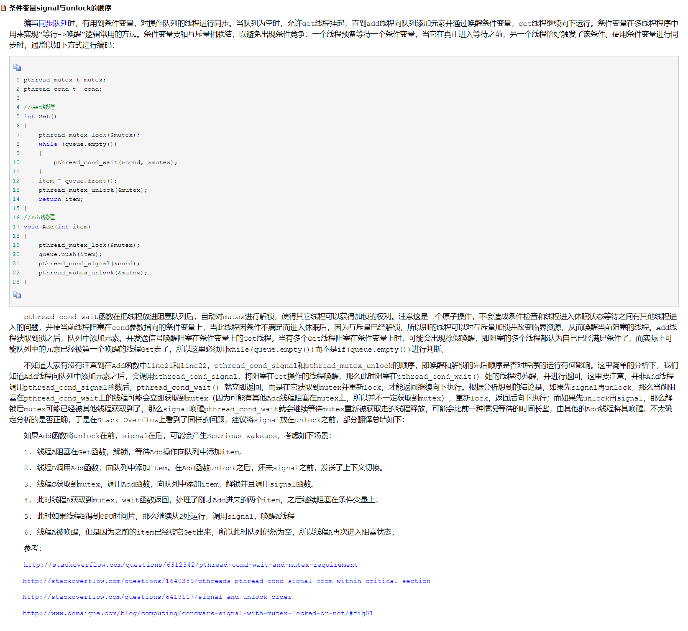

<!-- START doctoc generated TOC please keep comment here to allow auto update -->
<!-- DON'T EDIT THIS SECTION, INSTEAD RE-RUN doctoc TO UPDATE -->


- [线程同步](#%E7%BA%BF%E7%A8%8B%E5%90%8C%E6%AD%A5)
  - [一、线程同步背景](#%E4%B8%80%E7%BA%BF%E7%A8%8B%E5%90%8C%E6%AD%A5%E8%83%8C%E6%99%AF)
  - [二、互斥锁](#%E4%BA%8C%E4%BA%92%E6%96%A5%E9%94%81)
  - [三、死锁](#%E4%B8%89%E6%AD%BB%E9%94%81)
  - [四、读写锁](#%E5%9B%9B%E8%AF%BB%E5%86%99%E9%94%81)
  - [五、条件变量](#%E4%BA%94%E6%9D%A1%E4%BB%B6%E5%8F%98%E9%87%8F)
  - [六、信号量（信号灯）](#%E5%85%AD%E4%BF%A1%E5%8F%B7%E9%87%8F%E4%BF%A1%E5%8F%B7%E7%81%AF)
  - [七、自旋锁](#%E4%B8%83%E8%87%AA%E6%97%8B%E9%94%81)
  - [八、哲学家就餐问题求解](#%E5%85%AB%E5%93%B2%E5%AD%A6%E5%AE%B6%E5%B0%B1%E9%A4%90%E9%97%AE%E9%A2%98%E6%B1%82%E8%A7%A3)
  - [附录：自旋锁和互斥锁区别](#%E9%99%84%E5%BD%95%E8%87%AA%E6%97%8B%E9%94%81%E5%92%8C%E4%BA%92%E6%96%A5%E9%94%81%E5%8C%BA%E5%88%AB)

<!-- END doctoc generated TOC please keep comment here to allow auto update -->

## 线程同步

### 一、线程同步背景

下面这个例子试图使用两个线程对number变量不断增加，每个线程试图给number增量10000。理论上该程序停止后，number的值是20000。

pthread_uncle.c

```c
#include <stdio.h>
#include <unistd.h>
#include <stdlib.h>
#include <sys/types.h>
#include <sys/stat.h>
#include <string.h>
#include <pthread.h>

#define MAX 10000
// 全局变量
int number;

// 线程处理函数
void* funcA_num(void* arg)
{
    for(int i=0; i<MAX; ++i)
    {
        int cur = number;
        cur++;
        number = cur;
        printf("Thread A, id = %lu, number = %d\n", pthread_self(), number);
        usleep(10);
    }

    return NULL;
}

void* funcB_num(void* arg)
{
    for(int i=0; i<MAX; ++i)
    {
        int cur = number;
        cur++;
        number = cur;
        printf("Thread B, id = %lu, number = %d\n", pthread_self(), number);
        usleep(10);
    }

    return NULL;
}

int main(int argc, const char* argv[])
{
    pthread_t p1, p2;

    // 创建两个子线程
    pthread_create(&p1, NULL, funcA_num, NULL);
    pthread_create(&p2, NULL, funcB_num, NULL);

    // 阻塞，资源回收
    pthread_join(p1, NULL);
    pthread_join(p2, NULL);

    return 0;
}
```
运行最后结果如下:

    ...
    Thread B, id = 140151234418432, number = 19983
    Thread B, id = 140151234418432, number = 19984
    Thread B, id = 140151234418432, number = 19985
    Thread B, id = 140151234418432, number = 19986
    Thread B, id = 140151234418432, number = 19987

number结果并不是我们期待的20000。可以这样想，当A线程拿到了number，假设此时number的值是1，在A打算给number加一之前，线程A失去了CPU控制权，此时B线程也拿到了number，number的值也是1，然后B对number自加一，然后然后释放CPU控制权。A线程重新获取CPU控制权，但A线程不知道B线程已经将number值变成2了，A线程手上的number任然是1，A线程对number加一，A持有的number值变为2了。综上两个线程对number经过各自加一操作，number没有变成3，而是变成2。这就是不同步造成的困扰。常用加锁来实现线程同步：


### 二、互斥锁


下面这个案例使用互斥锁解决上一节的线程同步问题。

pthread_uncle2.c

```c
#include <stdio.h>
#include <unistd.h>
#include <stdlib.h>
#include <sys/types.h>
#include <sys/stat.h>
#include <string.h>
#include <pthread.h>

#define MAX 10000
// 全局变量
int number;

//创建一把互斥锁
pthread_mutex_t mutex;

// 线程处理函数
void* funcA_num(void* arg)
{
    for(int i=0; i<MAX; ++i)
    {
        //访问全局共享资源前加锁，如果资源被锁，则阻塞
        pthread_mutex_lock(&mutex);
        int cur = number;
        cur++;
        number = cur;
        printf("Thread A, id = %lu, number = %d\n", pthread_self(), number);
        //解锁
        pthread_mutex_unlock(&mutex);
        usleep(10);
    }

    return NULL;
}

void* funcB_num(void* arg)
{
    for(int i=0; i<MAX; ++i)
    {
        //访问全局共享资源前加锁，如果资源被锁，则阻塞
        pthread_mutex_lock(&mutex);
        int cur = number;
        cur++;
        number = cur;
        printf("Thread B, id = %lu, number = %d\n", pthread_self(), number);
        //解锁
        pthread_mutex_unlock(&mutex);
        usleep(10);
    }

    return NULL;
}

int main(int argc, const char* argv[])
{
    pthread_t p1, p2;
    //初始化互斥锁
    pthread_mutex_init(&mutex, NULL);

    // 创建两个子线程
    pthread_create(&p1, NULL, funcA_num, NULL);
    pthread_create(&p2, NULL, funcB_num, NULL);

    // 阻塞，资源回收
    pthread_join(p1, NULL);
    pthread_join(p2, NULL);
    
    //释放互斥锁资源
    pthread_mutex_destroy(&mutex);
    return 0;
}
```
运行结果如下：

    ...
    Thread B, id = 140588442392320, number = 19995
    Thread B, id = 140588442392320, number = 19996
    Thread B, id = 140588442392320, number = 19997
    Thread B, id = 140588442392320, number = 19998
    Thread B, id = 140588442392320, number = 19999
    Thread B, id = 140588442392320, number = 20000

使用互斥锁很好地解决了线程同步问题。使用互斥锁时需要注意的是临界区，这个案例的临界区是number操作，number是线程共享资源，在对number操作前使用加锁操作阻塞其他线程对number变量的读写操作，该线程结束对number的操作之后便释放锁，由此达到线程同步。

### 三、死锁


Linux下的互斥锁不是可重入锁，在一个线程中加锁后如果在不释放锁的情况下再加锁将导致死锁，自己锁死自己。

### 四、读写锁


下面是一个使用读写锁实现同步的案例：

rwlock.c

```c
#include <stdio.h>
#include <unistd.h>
#include <stdlib.h>
#include <sys/types.h>
#include <sys/stat.h>
#include <string.h>
#include <pthread.h>

// 全局变量
int number;
pthread_rwlock_t rwlock;

void* write_func(void* arg)
{
    while(1)
    {
        pthread_rwlock_wrlock(&rwlock);
        number++;
        printf("+++ write number: %d\n", number);
        pthread_rwlock_unlock(&rwlock);
        usleep(1000);
    }
    return NULL;
}

void* read_func(void* arg)
{
    while(1)
    {
        pthread_rwlock_rdlock(&rwlock);
        printf("--- read number: %d\n", number);
        pthread_rwlock_unlock(&rwlock);
        usleep(500);
    }
    return NULL;
}

int main(int argc, const char* argv[])
{
    pthread_t thid[8];

    pthread_rwlock_init(&rwlock, NULL);

    // 创建线程
    int i;
    for(i=0; i<3; ++i)
    {
        pthread_create(&thid[i], NULL, write_func, NULL);
    }
    for(i=3; i<8; ++i)
    {
        pthread_create(&thid[i], NULL, read_func, NULL);
    }

    // 回收
    int j;
    for(j=0; j<8; ++j)
    {
        pthread_join(thid[j], NULL);
    }

    pthread_rwlock_destroy(&rwlock);

    return 0;
}
```
运行结果如下：

    +++ write number: 3471
    --- read number: 3471
    --- read number: 3471
    +++ write number: 3472
    +++ write number: 3473
    +++ write number: 3474
    +++ write number: 3475
    +++ write number: 3476
    --- read number: 3476
    --- read number: 3476
    --- read number: 3476
    --- read number: 3476
    --- read number: 3476
    +++ write number: 3477
    +++ write number: 3478
    --- read number: 3478
    +++ write number: 3479
    --- read number: 3479
    --- read number: 3479

### 五、条件变量

条件变量通常和互斥锁一起使用，常用于生产者消费者编程模型。


下面这个案例中，生产者向链表中不断插入数据，这个插入方法是头插法，可以认为是一个栈，元素不断被生产者放入栈中。消费者则从链表中去除元素，可理解为从栈中弹出元素。当链表头为空时，消费者会通过条件变量阻塞等待并释放锁，生产者每向链表插入元素后便会发出信号让消费者接触阻塞。

```c
#include <stdio.h>
#include <unistd.h>
#include <stdlib.h>
#include <sys/types.h>
#include <sys/stat.h>
#include <string.h>
#include <pthread.h>

// 节点结构
typedef struct node
{
    int data;
    struct node* next;
}Node;

// 永远指向链表头部的指针
Node* head = NULL;

// 线程同步 - 互斥锁
pthread_mutex_t mutex;
// 阻塞线程 - 条件变量类型的变量
pthread_cond_t cond;

// 生产者
void* producer(void* arg)
{
   while(1)
    {
        // 使用互斥锁保护共享数据
        pthread_mutex_lock(&mutex);
               // 创建一个链表的节点
        Node* pnew = (Node*)malloc(sizeof(Node));
        // 节点的初始化
        pnew->data = rand() % 1000; // 0-999
        // 指针域
        pnew->next = head;
        head = pnew;
        printf("====== produce: %lu, %d\n", pthread_self(), pnew->data);
        // 通知阻塞的消费者线程，解除阻塞
        pthread_cond_signal(&cond);
        pthread_mutex_unlock(&mutex);
    }
    return NULL;
}

void* customer(void* arg)
{
    while(1)
    {
        pthread_mutex_lock(&mutex);
        // 判断链表是否为空
        while(head == NULL)
        {
            // 线程阻塞
            // 该函数会对互斥锁解锁
            pthread_cond_wait(&cond, &mutex);
            // 解除阻塞之后，对互斥锁做加锁操作
        }
        // 链表不为空 - 删掉一个节点 - 删除头结点
        Node* pdel = head;
        head = head->next;
        printf("------ customer: %lu, %d\n", pthread_self(), pdel->data);
        free(pdel);
        pthread_mutex_unlock(&mutex);
    }
    return NULL;
}

int main(int argc, const char* argv[])
{
    pthread_t p1, p2;
    // init
    pthread_mutex_init(&mutex, NULL);
    pthread_cond_init(&cond, NULL);

    // 创建生产者线程
    pthread_create(&p1, NULL, producer, NULL);
    // 创建消费者线程
    pthread_create(&p2, NULL, customer, NULL);

    // 阻塞回收子线程
    pthread_join(p1, NULL);
    pthread_join(p2, NULL);

    pthread_mutex_destroy(&mutex);
    pthread_cond_destroy(&cond);

    return 0;
}
```
运行结果如下：

    ====== produce: 140625348478720, 383
    ------ customer: 140625340086016, 383
    ====== produce: 140625348478720, 777
    ------ customer: 140625340086016, 777
    ====== produce: 140625348478720, 793
    ------ customer: 140625340086016, 793
    ====== produce: 140625348478720, 386
    ====== produce: 140625348478720, 649
    ------ customer: 140625340086016, 649
    ------ customer: 140625340086016, 386
    ====== produce: 140625348478720, 362
    ------ customer: 140625340086016, 362
    ====== produce: 140625348478720, 690
    ------ customer: 140625340086016, 690
    ====== produce: 140625348478720, 763
    ------ customer: 140625340086016, 763
    ====== produce: 140625348478720, 540
    ====== produce: 140625348478720, 172
    ------ customer: 140625340086016, 172
    ------ customer: 140625340086016, 540
    ====== produce: 140625348478720, 211
    ------ customer: 140625340086016, 211

关于条件变量更加细节的问题，例如pthread_cond_wait时是使用while等待（虚假唤醒，宁愿多发信号，也要避免不发信号导致信号丢失）还是if等待，生产者调用singal和unlock的顺序问题详见该文：

> https://www.cnblogs.com/Tour/p/4170839.html



### 六、信号量（信号灯）


同样是前面的链表消费者生产者问题，这里使用信号量的方法来解决。系统资源只有4，这里初始状态分配给生产者4个，消费者0个。生产者生产链表元素前会将自己的信号量减一，生产完成后让消费者信号量加一，这样一来消费者就有了资源，消费者消费完链表元素之后会将生产者信号量加一。就这样来回互动，保证资源只有4个，链表元素个数也在0和4之间动态变化。和前面的条件不同的是，信号量允许多个线程同时进入临界区。

```c
#include <stdio.h>
#include <unistd.h>
#include <stdlib.h>
#include <sys/types.h>
#include <sys/stat.h>
#include <string.h>
#include <pthread.h>
#include <semaphore.h>


sem_t produce_sem;
sem_t custom_sem;

typedef struct node
{
    int data;
    struct node* next;
}Node;

Node* head = NULL;

void* producer(void* arg)
{
    while(1)
    {
        sem_wait(&produce_sem);     // porduce_sem --  == 0, 阻塞
        Node * node = (Node*)malloc(sizeof(Node));
        node->data = rand() % 1000;
        node->next = head;
        head = node;
        printf("+++++ 生产者：%lu, %d\n", pthread_self(), node->data);
//        print();
        sem_post(&custom_sem);  // custom_sem++
        
        sleep(rand()%5);
    }

    return NULL;
}

void* customer(void* arg)
{
    while(1)
    {
        sem_wait(&custom_sem);
        Node* del = head;
        head = head->next;
        printf("----- 消费者：%lu, %d\n", pthread_self(), del->data);
        free(del);
        sem_post(&produce_sem);

        sleep(rand()%5);
    }
    return NULL;
}

int main(int argc, const char* argv[])
{
    pthread_t thid[2];

    // 初始化信号量
    sem_init(&produce_sem, 0, 4);   // 初始化生产者线程信号量
    sem_init(&custom_sem, 0, 0);    // 初始化消费者线程信号量

    pthread_create(&thid[0], NULL, producer, NULL);
    pthread_create(&thid[1], NULL, customer, NULL);

    for(int i=0; i<2; ++i)
    {
        pthread_join(thid[i], NULL);
    }

    sem_destroy(&produce_sem);
    sem_destroy(&custom_sem);

    return 0;
}
```
编译运行结果如下:

    +++++ 生产者：140582910252800, 383
    ----- 消费者：140582901860096, 383
    +++++ 生产者：140582910252800, 915
    ----- 消费者：140582901860096, 915
    +++++ 生产者：140582910252800, 386
    ----- 消费者：140582901860096, 386
    +++++ 生产者：140582910252800, 421
    ----- 消费者：140582901860096, 421
    +++++ 生产者：140582910252800, 690
    ----- 消费者：140582901860096, 690
    +++++ 生产者：140582910252800, 926
    +++++ 生产者：140582910252800, 426
    ----- 消费者：140582901860096, 426
    ----- 消费者：140582901860096, 926
    +++++ 生产者：140582910252800, 368
    ----- 消费者：140582901860096, 368

### 七、自旋锁

自旋锁是SMP架构中的一种low-level的同步机制。
当线程A想要获取一把自旋锁而该锁又被其它线程锁持有时，线程A会在一个循环中自旋以检测锁是不是已经可用了。对于自选锁需要注意：

* 由于自旋时不释放CPU，因而持有自旋锁的线程应该尽快释放自旋锁，否则等待该自旋锁的线程会一直在那里自旋，这就会浪费CPU时间。
* 持有自旋锁的线程在sleep之前应该释放自旋锁以便其它线程可以获得自旋锁。

所以自旋锁适用于等待时间较短的任务，否则会一直占用CPU资源。自旋锁使用API如下：

```cpp
int pthread_spin_destroy(pthread_spinlock_t *);
int pthread_spin_init(pthread_spinlock_t *, int);
int pthread_spin_lock(pthread_spinlock_t *);
int pthread_spin_trylock(pthread_spinlock_t *);
int pthread_spin_unlock(pthread_spinlock_t *);
```
使用方法和互斥锁类似。

自旋锁可分为用在单核处理器上和用在多核处理器上。

用在**单核处理器上**，又可分为两种：

**系统不支持内核抢占：**

此时自旋锁什么也不做，确实也不需要做什么，因为单核处理器只有一个线程在执行，又不支持内核抢占，因此资源不可能会被其他的线程访问到。

**系统支持内核抢占：**

这种情况下，自旋锁加锁仅仅是禁止了内核抢占，解锁则是启用了内核抢占。

在上述两种情况下，在获取自旋锁后可能会发生中断，若中断处理程序去访问自旋锁所保护的资源，则会发生死锁。因此，linux内核又提供了spin_lock_irq()和spin_lock_irqsave()，这两个函数会在获取自旋锁的同时（同时禁止内核抢占），禁止本地外部可屏蔽中断，从而保证自旋锁的原子操作。

**多核处理器**意味着有多个线程可以同时在不同的处理器上并行执行。举个例子：

四核处理器，若A处理器上的线程1获取了锁,B、C两个处理器恰好这个时候也要访问这个锁保护的资源，因此他俩CPU就一直自旋忙等待。D并不需要这个资源，因此它可以正常处理其他事情。

**自旋锁的几个特点：**

（1）被自旋锁保护的临界区代码执行时不能睡眠。单核处理器下，获取到锁的线程睡眠，若恰好此时CPU调度的另一个执行线程也需要获取这个锁，则会造成死锁；多核处理器下，若想获取锁的线程在同一个处理器下，同样会造成死锁，若位于另外的处理器，则会长时间占用CPU等待睡眠的线程释放锁，从而浪费CPU资源。

被自旋锁保护的临界区代码执行时不能被其他中断打断。原因同上类似。

（3）被自旋锁保护的临界区代码在执行时，内核不能被抢占，亦同上类似。

### 八、哲学家就餐问题求解

五个哲学家, 围着一张桌子吃饭,每个哲学家只有一根筷子, 需要使用旁边人的筷子才能把饭吃到嘴里.抢到筷子的吃饭, 没抢到的思考人生.使用多线程实现多线程实现哲学家交替吃饭的模型.


五个哲学家、五个筷子，每个哲学家都有左右两只手。可以一开始让前四个哲学家右手都握有自己的筷子，对应的程序里就是给这四个哲学家右手握筷子加锁，左手都尝试去抢其他相邻哲学家的筷子。至于第五个哲学家则相反，他会尝试右手拿0号哲学家右手筷子，但左手拿自己的筷子。

程序一开始创建五个线程，假设前面四个线程（四个哲学家）右手都拿到自己的筷子并加锁，那么第五个哲学家则无法对0号哲学家筷子加锁。接下来各个拿到自己筷子的哲学家将去尝试抢夺其他相邻哲学家的筷子，由于第五个哲学家的右手没有对第0号哲学家筷子加锁，也就无法去抢夺其他哲学家筷子，他左手的筷子也就没有加锁，资源空出来了，0号哲学家就可以拿到第五个哲学家的筷子吃饭了。吃完后他会将占有的两个筷子依次释放，让其他哲学家去使用。

假设第五个哲学家一开始先占用了0号哲学家的筷子，那么0号哲学家就无法抢占第五个哲学家的筷子，第五个哲学家就拿到两个筷子可以吃饭了。吃完后释放资源，其他哲学家也可以使用筷子。

people.dine.c

```c
#include <stdio.h>
#include <unistd.h>
#include <stdlib.h>
#include <sys/types.h>
#include <sys/stat.h>
#include <string.h>
#include <pthread.h>

pthread_mutex_t mutex[5];

void* dine(void* arg)
{
    int num = (int)arg;
    int left, right;

    if(num < 4)
    {
        // 前４个人，右手拿自己筷子
        right = num;
        left = num+1;
    }
    else if(num == 4)
    {
        // 最后一个人，右手拿别人筷子
        right = 0;
        left = num;
    }

    // 吃饭
    while(1)
    {
        // 右手加锁
        pthread_mutex_lock(&mutex[right]);
        // 尝试抢左手筷子
        if(pthread_mutex_trylock(&mutex[left]) == 0)
        {
            // 吃面。。。
            printf("%c 正在吃面。。。。。。\n", num+'A');
            // 吃完放筷子
            pthread_mutex_unlock(&mutex[left]);
        }
        // 解锁
        pthread_mutex_unlock(&mutex[right]);
        sleep(rand()%5);
    }
}

int main(int argc, const char* argv[])
{
    pthread_t p[5];

    for(int i=0; i<5; ++i)
    {
        pthread_mutex_init(&mutex[i], NULL);
    }

    for(int i=0; i<5; ++i)
    {
        pthread_create(&p[i], NULL, dine, (void*)i);
    }

    for(int i=0; i<5; ++i)
    {
        pthread_join(p[i], NULL);
    }
    
    for(int i=0; i<5; ++i)
    {
        pthread_mutex_destroy(&mutex[i]);
    }
    
    return 0;
}
```
运行结果如下：

    E 正在吃面。。。。。。
    D 正在吃面。。。。。。
    C 正在吃面。。。。。。
    B 正在吃面。。。。。。
    B 正在吃面。。。。。。
    A 正在吃面。。。。。。
    A 正在吃面。。。。。。
    D 正在吃面。。。。。。
    A 正在吃面。。。。。。
    C 正在吃面。。。。。。
    E 正在吃面。。。。。。
    B 正在吃面。。。。。。
    C 正在吃面。。。。。。
    C 正在吃面。。。。。。
    D 正在吃面。。。。。。
    E 正在吃面。。。。。。
    B 正在吃面。。。。。。
    B 正在吃面。。。。。。
    A 正在吃面。。。。。。
    E 正在吃面。。。。。。
    B 正在吃面。。。。。。
    D 正在吃面。。。。。。
    ...

每一轮抢夺总是有个哲学家会加锁失败而让出自己的筷子，所以该程序不会发生死锁。

### 附录：自旋锁和互斥锁区别

参考：http://www.51testing.com/html/63/524463-818249.html

自旋锁是一种互斥锁的实现方式而已，相比一般的互斥锁会在等待期间放弃cpu，自旋锁（spinlock）则是不断循环并测试锁的状态，这样就一直占着cpu。

**临界区**：每个进程中访问临界资源的那段程序称为临界区，每次只允许一个进程进入临界区，进入后不允许其他进程进入。

**互斥锁**：用于保护临界区，确保同一时间只有一个线程访问数据。对共享资源的访问，先对互斥量进行加锁，如果互斥量已经上锁，调用线程会阻塞，直到互斥量被解锁。在完成了对共享资源的访问后，要对互斥量进行解锁。

**自旋锁**：与互斥量类似，它不是通过休眠使进程阻塞，而是在获取锁之前一直处于忙等(自旋)阻塞状态。用在以下情况：锁持有的时间短，而且线程并不希望在重新调度上花太多的成本。"原地打转"。

**自旋锁与互斥锁的区别**：线程在申请自旋锁的时候，线程不会被挂起，而是处于忙等的状态。

**两种锁适用于不同场景：**
* 如果是多核处理器，如果预计**线程等待锁的时间很短**，短到比线程两次上下文切换时间要少的情况下，使用自旋锁是划算的。
* 如果是多核处理器，如果预计**线程等待锁的时间较长**，至少比两次线程上下文切换的时间要长，建议使用互斥量。
* 如果是**单核**处理器，一般建议**不要使用自旋锁**。因为，在同一时间只有一个线程是处在运行状态，那如果运行线程发现无法获取锁，只能等待解锁，但因为自身不挂起，所以那个获取到锁的线程没有办法进入运行状态，只能等到运行线程把操作系统分给它的时间片用完，才能有机会被调度。这种情况下使用自旋锁的代价很高。单CPU且不可抢占式的内核自旋锁的操作为空操作。
* 如果加锁的代码经常被调用，但竞争情况很少发生时，应该优先考虑使用自旋锁，自旋锁的开销比较小，互斥量的开销较大。