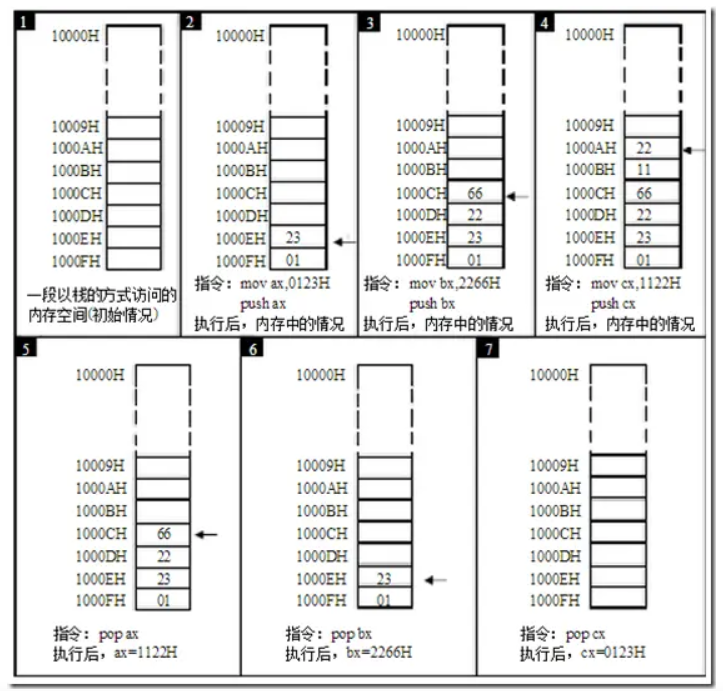
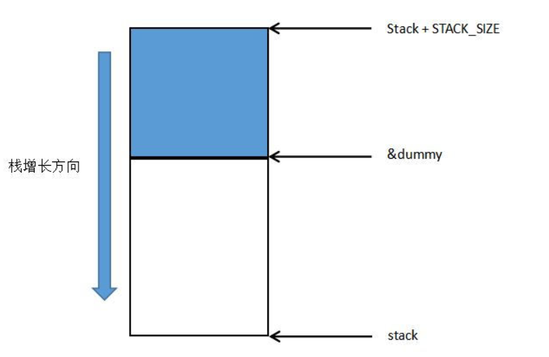

<!-- START doctoc generated TOC please keep comment here to allow auto update -->
<!-- DON'T EDIT THIS SECTION, INSTEAD RE-RUN doctoc TO UPDATE -->


- [协程](#%E5%8D%8F%E7%A8%8B)
  - [零、入栈出栈操作](#%E9%9B%B6%E5%85%A5%E6%A0%88%E5%87%BA%E6%A0%88%E6%93%8D%E4%BD%9C)
  - [一、ucontext 函数簇](#%E4%B8%80ucontext-%E5%87%BD%E6%95%B0%E7%B0%87)
    - [1、getcontext/setcontext 函数](#1getcontextsetcontext-%E5%87%BD%E6%95%B0)
    - [2、makecontext 和 swapcontext 函数](#2makecontext-%E5%92%8C-swapcontext-%E5%87%BD%E6%95%B0)
    - [3、使用案例](#3%E4%BD%BF%E7%94%A8%E6%A1%88%E4%BE%8B)
    - [4、ucontext 总结](#4ucontext-%E6%80%BB%E7%BB%93)
  - [二、协程库](#%E4%BA%8C%E5%8D%8F%E7%A8%8B%E5%BA%93)
    - [1、源码和注解](#1%E6%BA%90%E7%A0%81%E5%92%8C%E6%B3%A8%E8%A7%A3)
    - [2、从测试代码分析协程库](#2%E4%BB%8E%E6%B5%8B%E8%AF%95%E4%BB%A3%E7%A0%81%E5%88%86%E6%9E%90%E5%8D%8F%E7%A8%8B%E5%BA%93)
      - [（1）创建协程调度器](#1%E5%88%9B%E5%BB%BA%E5%8D%8F%E7%A8%8B%E8%B0%83%E5%BA%A6%E5%99%A8)
      - [（2）创建协程](#2%E5%88%9B%E5%BB%BA%E5%8D%8F%E7%A8%8B)
      - [（3）运行协程](#3%E8%BF%90%E8%A1%8C%E5%8D%8F%E7%A8%8B)
      - [（5）协程礼让](#5%E5%8D%8F%E7%A8%8B%E7%A4%BC%E8%AE%A9)
      - [（6）关闭协程](#6%E5%85%B3%E9%97%AD%E5%8D%8F%E7%A8%8B)

<!-- END doctoc generated TOC please keep comment here to allow auto update -->

## 协程

本文参考 [使用 setcontext 类函数实现 mini 协程库](https://blog.csdn.net/liushengxi_root/article/details/85142236)

协程的本质都是通过修改 ESP 和 EIP 指针来实现的。其理论上还是单线程在运行。

程序在CPU上运行时依赖3个寄存器：

* ESP寄存值指向当前栈顶地址，指向当前指令需要的数据
* EBP指向当前活动栈帧的基地址
* 指令寄存器IP，指向当前需要运行的指令

其中主要有（IP,ESP）寄存器最重要，这两个寄存器指针的改变可以修改当前需要加载到 CPU 运行的指令和数据，当某个操作陷入到耗时的等待中时，通过修改这两个指针即可让出CPU，交给其他的任务去使用，每个任务都必须主动的让出CPU，然后等待下一次的调度来继续未完成的任务，这样就可以最大程度的利用CPU，当一个任务等待过程非常短的时候，就出现了多个任务并行运行的效果，也就是协程。

实现协程的多种方法：

* 利用 glibc 的 ucontext 组件(云风的库)
* 使用汇编来切换上下文（实现miniC协程,腾讯libco)
* 利用C语言语法switch-case的奇淫技巧来实现（Protothreads)
* 利用了 C 语言的 setjmp 和 longjmp（ 一种协程的 C/C++ 实现,要求函数里面使用 static local 的变量来保存协程内部的数据）
* 利用Boost库提供的两种实现，分别是stackless与stackfull

当然了，最好的方法的还是去用汇编去实现，因为这样会避免许多跨平台等问题．比如在有些平台就会用不了setcontext等函数．有些函数可能也慢慢的废除了，所以用汇编实现是最有效的，也是腾讯公司经过多年的实践得出的。


### 零、入栈出栈操作

该部分参考[汇编学习-入栈和出栈](https://www.jianshu.com/p/b151620fd4b8)

栈有两个基本的操作：入栈和出栈。入栈就是将一个新的元素放到栈顶，出栈就是从栈顶取出一个元素。栈顶的元素总是最后入栈，需要出栈时，又最先被从栈中取出。栈的这种操作规则被称为：LIFO(Last In First Out，后进先出)。

8086CPU提供入栈和出栈指令，最基本的两个是 PUSH(入栈) 和 POP(出栈)。比如：push ax 表示将寄存器ax中的数据送入栈中，pop ax表示从栈顶取出数据送入ax。8086CPU的入栈和出栈操作都是以字为单位进行的。

CPU如何知道栈顶的位置？显然，也应该有相应的寄存器来存放栈顶的地址，8086CPU中，有两个寄存器，段寄存器SS和寄存器SP，栈顶的段地址存放在SS中，偏移地址存放在SP中。任意时刻，SS:SP指向栈顶元素。push指令和pop指令执行时，CPU从SS和SP中得到栈顶的地址。

假设有这样一个栈空间，地址10000H为栈底地址，1000FH为栈顶地址。下面演示入栈和出栈操作：



入栈时先移动栈指针，然后送入数据；出栈时先弹出数据，再移动栈指针。

8086CPU不保证我们对栈的操作不会超界。这也就是说，8086CPU只知道栈顶在何处(由SS:SP指示)，而不知道读者安排的栈空间有多大。这点就好像，CPU只知道当前要执行的指令在何处(由CS:IP指示)，而不知道读者要执行的指令有多少。

我们在编程的时候要自己操心栈顶超界的问题，要根据可能用到的最大栈空间，来安排栈的大小，防止入栈的数据太多而导致的超界；执行出栈操作的时候也要注意，以防栈空的时候继续出栈而导致的超界。

### 一、ucontext 函数簇

这里还是针对于Linux平台，不使用汇编。用这种方法实现协程需要用到一系列glibc库的“上下文操作函数”：

* getcontext()  : 获取当前context
* setcontext()  : 切换到指定context
* makecontext() : 设置 函数指针 和 堆栈 到对应context保存的 sp 和 pc 寄存器中,调用之前要先调用 getcontext()
* swapcontext() : 保存当前context，并且切换到指定context

下面将会具体介绍这些函数的使用方法。

#### 1、getcontext/setcontext 函数

函数原型如下：
```c
#include <ucontext.h>

int getcontext(ucontext_t *ucp);
int setcontext(const ucontext_t *ucp);
```
在类System-V环境中，定义在<ucontext.h>头文件中的mcontext_t和ucontext_t的两种数据类型，以及getcontext()，setcontext()，**makecontext()和swapcontext()**四个函数允许在一个进程不同的协程中用户级别的上下文切换。

mcontext_t数据结构是依赖机器和不透明的。ucontext_t数据结构至少包含下面的字段：

```c
typedef struct ucontext {
    struct ucontext *uc_link;
    sigset_t         uc_sigmask;
    stack_t          uc_stack;
    mcontext_t       uc_mcontext;
    ...
} ucontext_t;
```
其中：

* igset_t和stack_t定义在<signal.h>头文件中
* uc_link指向当前的上下文结束时要恢复到的上下文（只在当前上下文是由makecontext创建时，个人理解：只有makecontext创建新函数上下文时需要修改）
* uc_sigmask表示这个上下文要阻塞的信号集合（参见sigprocmask）
* uc_stack是这个上下文使用的栈（非makecontext创建的上下文不要修改）
* uc_mcontext是机器特定的保存上下文的表示，包括调用协程的机器寄存器

使用时：

* getcontext()函数初始化ucp所指向的结构体，填充当前有效的上下文。
* setcontext()函数恢复用户上下文为ucp所指向的上下文。成功调用不会返回。ucp所指向的上下文应该是getcontext()或者makeontext()产生的。
* 如果上下文是getcontext()产生的，切换到该上下文，程序在getcontext()后继续执行。
* 如果上下文被makecontext()产生的，切换到该上下文，程序切换到makecontext()调用所指定的第二个参数的函数上。当该函数返回时，我们继续传入makecontext()中的第一个参数的上下文中uc_link所指向的上下文。如果是NULL，程序结束。

函数调用成功时，getcontext()返回0，setcontext()不返回。错误时，都返回-1并且赋值合适的errno。

这个机制最早来源setjmp/longjmp机制。但是它们没有定义处理信号的上下文，下一步就出了sigsetjmp/siglongjmp。当前这套机制给予了更多的控制权。但是另一方面，没有简单的方法去探明getcontext()的返回是第一次调用还是通过setcontext()调用。用户不得不发明一套他自己的书签的数据，并且当寄存器恢复时，register声明的变量不会恢复（寄存器变量）。

当信号发生时，当前的用户上下文被保存，一个新的内核为信号处理器产生的上下文被创建。不要在信号处理器中使用longjmp:它是未定义的行为。使用**siglongjmp()或者setcontext()**替代。

#### 2、makecontext 和 swapcontext 函数

函数定义如下：
```c
#include <ucontext.h>

void makecontext(ucontext_t *ucp, void (*func)(void), int argc, ...);
int swapcontext(ucontext_t *restrict oucp, const ucontext_t *restrict ucp);
```

makecontext()函数修改ucp所指向的上下文，ucp是被getcontext()所初始化的上下文。当这个上下文采用swapcontext()或者setcontext()被恢复，程序的执行会切换到func的调用，通过makecontext()调用的argc传递func的参数。

在makecontext()产生一个调用前，应用程序必须确保上下文的栈分配已经被修改。应用程序应该确保argc的值跟传入func的一样（参数都是int值4字节）；否则会发生未定义行为。

当makecontext()修改过的上下文返回时，uc_link用来决定上下文是否要被恢复。应用程序需要在调用makecontext()前初始化uc_link。

swapcontext()函数保存当前的上下文到oucp所指向的数据结构，并且设置到ucp所指向的上下文。

调用成功，swapcontext 返回0。否则返回-1，并赋值合适的errno。

当ucp参数没有足够的栈空间去完成操作时，swapcontext() 函数可能会调用失败。

#### 3、使用案例

```c
#include <stdio.h>
#include <ucontext.h>

static ucontext_t ctx[3];

static void f1 (void)
{
    puts("start f1");
    swapcontext(&ctx[1], &ctx[2]);
    puts("finish f1");
}

static void f2 (void)
{
    puts("start f2");
    swapcontext(&ctx[2], &ctx[1]);
    puts("finish f2");
}

int main (void)
{
    char st1[8192];
    char st2[8192];

    getcontext(&ctx[1]);
    ctx[1].uc_stack.ss_sp = st1;
    ctx[1].uc_stack.ss_size = sizeof st1;
    ctx[1].uc_link = &ctx[0];
    makecontext(&ctx[1], f1, 0);

    getcontext(&ctx[2]);
    ctx[2].uc_stack.ss_sp = st2;
    ctx[2].uc_stack.ss_size = sizeof st2;
    ctx[2].uc_link = &ctx[1];
    makecontext(&ctx[2], f2, 0);


    swapcontext(&ctx[0], &ctx[2]);
    return 0;
}
```
需要注意的是：

* makecontext之前必须调用getcontext初始化context，否则会段错误core
* makecontext之前必须给uc_stack分配栈空间，否则也会段错误core
* makecontext之前如果需要上下文恢复到调用前，则必须设置uc_link以及通过swapcontext进行切换
* getcontext产生的context为当前整个程序的context，而makecontext切换到的context为新函数独立的context，但setcontext切换到getcontext的context时，getcontext所在的函数退出时，并不需要uc_link的管理，依赖于该函数是在哪被调用的，整个栈会向调用者层层剥离
* 不产生新函数的上下文切换指需要用到getcontext和setcontext
* 产生新函数的上下文切换需要用到getcontext，makecontext和swapcontext

#### 4、ucontext 总结

将getcontext，makecontext，swapcontext封装成一个类似于lua的协程，需要代码中主动yield释放出CPU。

协程的栈采用malloc进行堆分配，分配后的空间在64位系统中和栈的使用一致，地址递减使用，uc_stack.uc_size设置的大小好像并没有多少实际作用，使用中一旦超过已分配的堆大小，会继续向地址小的方向的堆去使用，这个时候就会造成堆内存的越界使用，更改之前在堆上分配的数据，造成各种不可预测的行为，coredump后也找不到实际原因。

对使用协程函数的栈大小的预估，协程函数中调用其他所有的api的中的局部变量的开销都会分配到申请给协程使用的内存上，会有一些不可预知的变量，比如调用第三方API，第三方API中有非常大的变量，实际使用过程中开始时可以采用mmap分配内存，对分配的内存设置GUARD_PAGE进行mprotect保护，对于内存溢出，准确判断位置，适当调整需要分配的栈大小。


### 二、协程库

这里采用了风云大佬的协程库，详情可见 [C 的 coroutine 库](https://blog.codingnow.com/2012/07/c_coroutine.html)

此外还参考了[云风协程库代码分析](https://blog.csdn.net/zhwenx3/article/details/88537643)

#### 1、源码和注解

协程库的代码和注解见src下的源码文件。

#### 2、从测试代码分析协程库

当然，该代码库也提供了测试函数来方便用户使用该库，测试代码如下所示：
```c
#include "coroutine.h"
#include <stdio.h>

struct args {
	int n;
};

// 协程需要执行的用户函数
static void
foo(struct schedule * S, void *ud) {
	struct args * arg = ud;// 用户传入数据
	int start = arg->n;// 获取args结构体中n
	int i;
	// 交替获取当前运行协程的索引号，并打印相关信息
	for (i=0;i<5;i++) {
		printf("coroutine %d : %d\n",coroutine_running(S) , start + i);
		coroutine_yield(S);
	}
}

static void
test(struct schedule *S) {
    // 传递给协程的参数
	struct args arg1 = { 0 };
	struct args arg2 = { 100 };

    // 创建协程，返回值即为协程在调度器协程数组中的索引
	int co1 = coroutine_new(S, foo, &arg1);
	int co2 = coroutine_new(S, foo, &arg2);
	printf("main start\n");
	// 保证两个协程都创建成功
	while (coroutine_status(S,co1) && coroutine_status(S,co2)) {
		coroutine_resume(S,co1);
		coroutine_resume(S,co2);
	} 
	printf("main end\n");
}

int 
main() {
	struct schedule * S = coroutine_open();// 创建协程调度器
	test(S);// 执行任务
	coroutine_close(S);// 关闭所有协程
	
	return 0;
}
```
下面将从测试代码开始具体分析协程库的内部细节。

##### （1）创建协程调度器

首先是创建一个协程调度器：
```c
struct schedule * S = coroutine_open();// 创建协程调度器
```
所有的协程都由该调度器结构管理，该结构定义如下：
```c
// 协程调度器结构
struct schedule {
	char stack[STACK_SIZE]; // 调度器栈
	ucontext_t main; // 主进程上下文
	int nco; // 当前程序中协程数量
	int cap; // 容量
	int running; // 运行状态
	struct coroutine **co; // 二级指针，保存并指向创建的协程结构
};
```
coroutine_open函数定义如下：
```c
// 创建一个调度器
struct schedule * 
coroutine_open(void) {
	struct schedule *S = malloc(sizeof(*S)); // 创建schedule结构
	S->nco = 0; // 设置当前调度器保存协程数量为0
	S->cap = DEFAULT_COROUTINE; // 设置默认创建协程容量为16
	S->running = -1;// 设置运行状态为 -1
	S->co = malloc(sizeof(struct coroutine *) * S->cap);// 创建一个用于保存coroutine指针的数组，数组初始化大小为16
	memset(S->co, 0, sizeof(struct coroutine *) * S->cap);// 将上一步创建数组内容清空（数组内不保存任何coroutine地址）
	return S; // 返回创建的调度器结构
}
```
其中struct coroutine定义如下：
```c
// 协程结构
struct coroutine {
	coroutine_func func; // 协程运行函数，typedef void (*coroutine_func)(struct schedule *, void *ud);
	void *ud; // 协程用户数据
	ucontext_t ctx; // 协程上下文
	struct schedule * sch; // 协程所属调度器结构
	ptrdiff_t cap; 
	ptrdiff_t size;
	int status; // 协程状态
	char *stack; // 协程程序栈
};
```
上面的status有如下几种状态：
```c
// 运行状态标识
#define COROUTINE_DEAD 0
#define COROUTINE_READY 1
#define COROUTINE_RUNNING 2
#define COROUTINE_SUSPEND 3
```

##### （2）创建协程

接下来回到main函数，继续执行该代码：
```c
test(S)
```
test定义如下：
```c
static void
test(struct schedule *S) {
    // 传递给协程的参数
	struct args arg1 = { 0 };
	struct args arg2 = { 100 };

    // 创建协程，返回值即为协程在调度器协程数组中的索引
	int co1 = coroutine_new(S, foo, &arg1);
	int co2 = coroutine_new(S, foo, &arg2);
	printf("main start\n");
	// 保证两个协程都创建成功
	while (coroutine_status(S,co1) && coroutine_status(S,co2)) {
		coroutine_resume(S,co1);
		coroutine_resume(S,co2);
	} 
	printf("main end\n");
}
```
在test函数中通过调用coroutine_new函数来创建协程，该函数接受三个参数：调度器、用户函数和用户参数。coroutine_new定义如下：
```c
// 创建一个协程，需要传入调度器地址、协程运行函数和用户数据
int 
coroutine_new(struct schedule *S, coroutine_func func, void *ud) {
	struct coroutine *co = _co_new(S, func , ud);// 调用__co_new创建一个协程结构
	// 检查当前调度器中协程数量是否大于调度器可保存协程容量
	if (S->nco >= S->cap) { // 如果当前创建的协程数量等于或者超出调度器容量
		int id = S->cap; // 获取当前调度器的容量大小
		S->co = realloc(S->co, S->cap * 2 * sizeof(struct coroutine *));// 重新分配调度器协程数组大小，为之前容量的两倍
		memset(S->co + S->cap , 0 , sizeof(struct coroutine *) * S->cap);// 清空新分配的协程数组
		S->co[S->cap] = co; // 将前面创建的协程放入调度器协程数组中
		S->cap *= 2; // 设置调度器协程容量为之前的两倍
		++S->nco; // 调度器中协程数量增加
		return id; // 返回先前调度器容量大小，该大小也是新创建协程在调度器协程数组中的下标位置
	} else {// 如果当前调度器中协程数量小于协程数组容量
		int i;
		// 在调度器协程数组中找到一块没有被使用的位置，然后将该位置保存为新创建的协程
		for (i=0;i<S->cap;i++) {
			int id = (i+S->nco) % S->cap;
			if (S->co[id] == NULL) {
				S->co[id] = co;
				++S->nco; // 调度器协程数量自增
				return id; // 返回新创建协程在调度器协程数组中的索引位置
			}
		}
	}
	// 前面要是失败了，程序运行到这里说明出现异常错误，正常情况下程序不可能运行到这一步
	assert(0);
	return -1;
}

// 创建并初始化一个协程结构，需要传入调度器地址、协程运行函数和用户数据
struct coroutine * 
_co_new(struct schedule *S , coroutine_func func, void *ud) {
	struct coroutine * co = malloc(sizeof(*co)); // 创建协程结构
	co->func = func; // 设置协程运行函数
	co->ud = ud; // 设置用户传入数据
	co->sch = S; // 设置协程所属调度器
	co->cap = 0;
	co->size = 0;
	co->status = COROUTINE_READY;// 设置协程当前状态为ready
	co->stack = NULL;// 协程当前分配栈空间为空
	return co;// 返回创建的协程结构
}
```
经过上面的步骤，一个协程便被创建出来了，需要注意的是，调度器中默认有一个动态数组管理创建的协程结构，该数组大小默认是16，一旦程序中创建的协程多余16个，那么coroutine_new函数便会对调度器中的协程数组进行扩容，扩容大小为之前容量的两倍。协程创建成功后，该数组便会将该协程结构加入其中，并且返回一个int类型的id来标识该协程，该id也就是协程在该数组中的位置，或者说是索引，通过该索引，调度器可以获取到该协程。

一个协程被创建后并不会马上执行，其内部的局部堆栈也为空，这时的协程处于COROUTINE_READY状态。

##### （3）运行协程

回到test函数中，前面说到该函数首先会创建两个协程：
```c
int co1 = coroutine_new(S, foo, &arg1);
int co2 = coroutine_new(S, foo, &arg2);
```
但是协程创建后并不会马上执行，通过coroutine_resume函数可以让协程处于运行状态：
```c
printf("main start\n");
// 保证两个协程都创建成功
while (coroutine_status(S,co1) && coroutine_status(S,co2)) {
    coroutine_resume(S,co1);
    coroutine_resume(S,co2);
} 
```
在调用coroutine_resume前，while循环条件中调用了coroutine_status函数，该函数定义如下：
```c
// 获取调度器中索引为id的协程状态
int 
coroutine_status(struct schedule * S, int id) {
	// 协程必须在调度器中能找到
	assert(id>=0 && id < S->cap);
	// 说明当前调度器协程数组中该位置没有指向有效协程地址，也就是说标号为id的协程不存在
	if (S->co[id] == NULL) {
		return COROUTINE_DEAD;
	}
	return S->co[id]->status;
}
```
当前状态下的协程是处于COROUTINE_READY状态，只要不是处于COROUTINE_DEAD（COROUTINE_DEAD 等于0）状态，该while条件总是满足的。所以下面可以运行coroutine_resume函数，该函数定义如下：
```c
void 
coroutine_resume(struct schedule * S, int id) {
	assert(S->running == -1);// 如果调度器当前在不处于运行状态（断言成立，没有协程在运行）
	assert(id >=0 && id < S->cap);// 确保该协程是合法正确的
	struct coroutine *C = S->co[id];// 获取到该协程结构
	if (C == NULL) // 确保该协程确实存在
		return;
	int status = C->status; // 获取到该协程的运行状态
	switch(status) {
	case COROUTINE_READY:// 第一次创建运行
		getcontext(&C->ctx);// 获取协程运行上下文
		C->ctx.uc_stack.ss_sp = S->stack;// 设置协程运行栈
		C->ctx.uc_stack.ss_size = STACK_SIZE;// 设置协程运行栈大小，默认1MB大小
		C->ctx.uc_link = &S->main;// 设置协程调度返回函数
		S->running = id;// 设置当前调度器中运行协程id
		C->status = COROUTINE_RUNNING;// 设置协程运行状态为“正在运行”
		uintptr_t ptr = (uintptr_t)S;// 获取调度器结构体
		// 设置协程运行函数为mainfunc，将调度器结构体传入协程运行函数mainfunc中
		makecontext(&C->ctx, (void (*)(void)) mainfunc, 2, (uint32_t)ptr, (uint32_t)(ptr>>32));
		swapcontext(&S->main, &C->ctx);// 替换协程映像，将函数程序空间main替换为当前协程运行函数，也就是mainfunc函数
		break;
	case COROUTINE_SUSPEND:// 如果当前协程处于挂起状态
		memcpy(S->stack + STACK_SIZE - C->size, C->stack, C->size);//恢复之前运行现场
		S->running = id;// 设置当前运行
		C->status = COROUTINE_RUNNING; // 设置当前协程运行状态为“运行态”
		swapcontext(&S->main, &C->ctx);// 替换协程映像，将函数程序空间main替换为当前协程运行函数，也就是mainfunc函数
		break;
	default:
		assert(0);
	}
}
```

在coroutine_resume中，通过协程的id获取到调度器中的协程结构体，然后根据协程的status来进行下一步操作。

如果当前协程的status是COROUTINE_READY，说明该协程是刚刚创1的，之前都没有投入运行

* 设置栈指针，也就是sp
* 设置协程status为COROUTINE_RUNNING
* 设置协程结束时，需要切换到S->main上下文
* 设置协程的入口函数mainfunc（mainfunc函数在后面会介绍，这里暂且提一下）
* 使用swapcontext函数运行协程函数

如果当前协程的状态为COROUTINE_SUSPEND，说明协程处于挂起状态，那么将当前协程私有栈空间保存到调度器的工友栈空间中，设置协程运行状态为COROUTINE_RUNNING。然后使用使用swapcontext函数运行协程函数。

协程运行函数mainfunc定义如下：

```c
// 协程调度运行函数
static void
mainfunc(uint32_t low32, uint32_t hi32) {
	uintptr_t ptr = (uintptr_t)low32 | ((uintptr_t)hi32 << 32);
	struct schedule *S = (struct schedule *)ptr;// 获取到协程调度器
	int id = S->running;// 获取当前运行协程id
	struct coroutine *C = S->co[id];
	C->func(S,C->ud);// 执行当前运行协程中保存的用户函数
	_co_delete(C);// 用户函数执行完毕，清除该协程运行栈等信息
	S->co[id] = NULL;// 将调度器协程数组中该协程位置清空
	--S->nco;// 调度器中活跃协程数目减一
	S->running = -1;// 调度器当前没有运行任何协程
}

// 清除一个协程结构中的数据
void
_co_delete(struct coroutine *co) {
	free(co->stack);
	free(co);
}
```
该函数中调用了协程的用户函数，该函数运行结束协程及其相关结构体内容就会被销毁，并设置当前调度器没有运行协程。

##### （5）协程礼让
回到test函数中，前面提到了协程中的“用户”函数，该函数时用户希望在协程中执行的，在该案例中，用户函数定义如下：
```c
// 协程需要执行的用户函数
static void
foo(struct schedule * S, void *ud) {
	struct args * arg = ud;// 用户传入数据
	int start = arg->n;// 获取args结构体中n
	int i;
	// 交替获取当前运行协程的索引号，并打印相关信息
	for (i=0;i<5;i++) {
		printf("coroutine %d : %d\n",coroutine_running(S) , start + i);
		coroutine_yield(S);
	}
}
```
其中该函数使用到了coroutine_yield函数，该函数目的是让当前协程放弃运行并挂起，将CPU的控制权被其他协程抢占。coroutine_yield函数定义如下：
```c
// 协程“礼让”，切换上下文
void
coroutine_yield(struct schedule * S) {
	int id = S->running; // 获取当前运行的协程
	assert(id >= 0);
	struct coroutine * C = S->co[id];
	assert((char *)&C > S->stack);
	_save_stack(C,S->stack + STACK_SIZE);// 保存当前运行现场
	C->status = COROUTINE_SUSPEND;// 将当前运行协程设置为挂起状态
	S->running = -1;// 当前没有处于运行状态的协程
	swapcontext(&C->ctx , &S->main); // 切换上下文空间，运行main函数（main函数上下文已经保存在某协程栈中，可以切换恢复）
}
```
在该函数中还调用了_save_stack函数来保存协程的堆栈信息，该函数定义如下：
```c

// 保存当前调度器运行main函数运行上下文到协程栈中
static void
_save_stack(struct coroutine *C, char *top) {
	char dummy = 0;
	assert(top - &dummy <= STACK_SIZE);
	if (C->cap < top - &dummy) {
		free(C->stack);
		C->cap = top-&dummy;
		C->stack = malloc(C->cap);
	}
	C->size = top - &dummy;
	memcpy(C->stack, &dummy, C->size);
}
```
要复制公有栈的内容到私有栈，就必须得到当前的栈指针sp指向位置，不然就会复制了无用的内容，而_save_stack通过定义一个局部变量dummy得到当前sp的指向位置，这样做的原理是局部变量是保存在栈上的，而栈又是从高地址往低地址增长的，那么dummy的位置到S -> stack + STACK_SIZE即是我们需要保存的内容，图解如下：



比较令人困惑的是每个协程都有自己的私有栈，那为什么还需要在调度器中定义一个公有栈呢？

其实这样做是为了节省空间，我们并不知道每个协程会用到多大的栈空间，如果给每个协程分配得太大，在协程数量较多的时候会造成严重的内存空间浪费；如果分配得太小，又会导致栈溢出。

因此，在调度器中定义一个足够大的公有栈空间，所有协程都在这个公有栈上运行，当挂起协程时，保存当前的公有栈内容到协程的私有栈；唤醒协程时，把协程私有栈保存的内容复制到公有栈。这样做的话，协程的私有栈的大小就可以是动态，即是说，在挂起协程时，如果私有栈的大小不足以保存当前公有栈的内容，就重新分配一个更大的私有栈。

这样就能给每个协程分配刚好满足需求的空间，就算开很多协程也不会造成大量的内存浪费。

总而言之，协程私有栈和公有栈（调度器）的设计原理是协程运行时使用的是公有栈，当协程需要被挂起时需要将当前协程公有栈，也就是运行时使用的栈的内容保存到协程的私有栈中；当协程处于运行状态时，需要将之前保存在私有栈中的上下文内容复制到运行栈，也就是公有栈中。

##### （6）关闭协程

回到main函数中，使用coroutine_close来关闭所有协程，该函数定义如下：

```c
// 关闭协程，也就是将协程调度器中的所有协程相关内容清空，然后释放调度器自身
void 
coroutine_close(struct schedule *S) {
	int i;
	for (i=0;i<S->cap;i++) {
		struct coroutine * co = S->co[i];
		if (co) {
			_co_delete(co);
		}
	}
	free(S->co);
	S->co = NULL;
	free(S);
}
```

最后测试程序的输出结果如下所示：
```
main start
coroutine 0 : 0
coroutine 1 : 100
coroutine 0 : 1
coroutine 1 : 101
coroutine 0 : 2
coroutine 1 : 102
coroutine 0 : 3
coroutine 1 : 103
coroutine 0 : 4
coroutine 1 : 104
main end
```