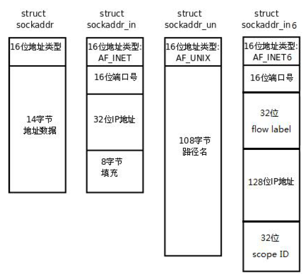
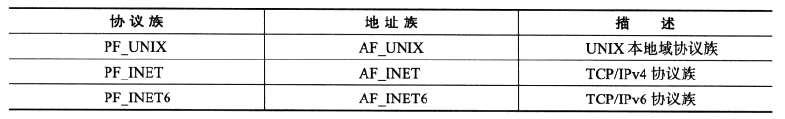
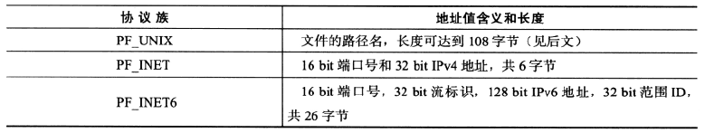
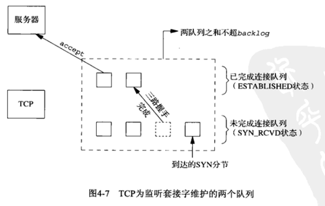
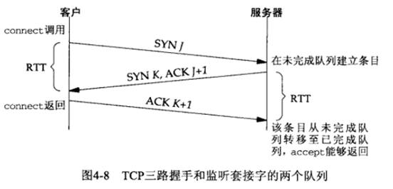
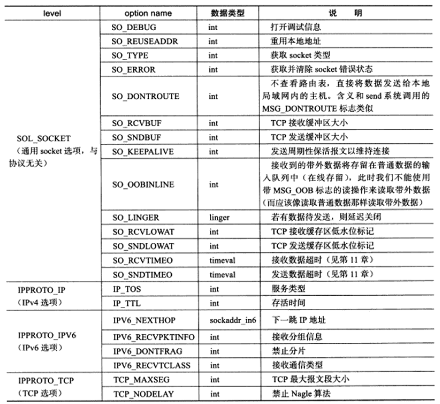
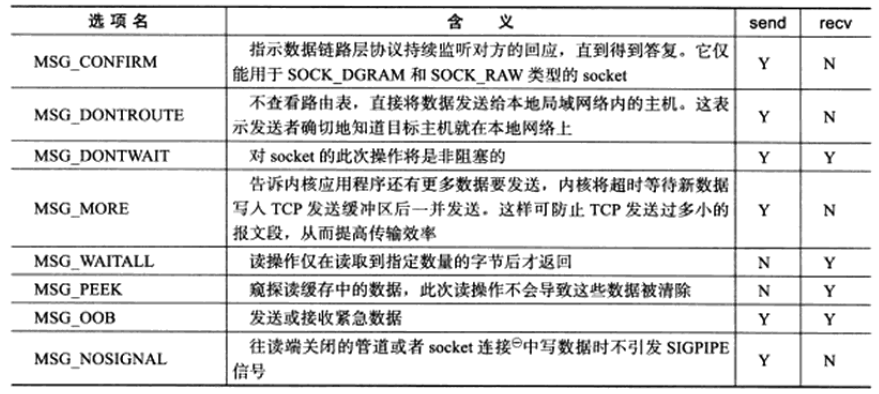

<!-- START doctoc generated TOC please keep comment here to allow auto update -->
<!-- DON'T EDIT THIS SECTION, INSTEAD RE-RUN doctoc TO UPDATE -->


- [基础API](#%E5%9F%BA%E7%A1%80api)
  - [一、套接字API](#%E4%B8%80%E5%A5%97%E6%8E%A5%E5%AD%97api)
    - [1、主机字节序和网络字节序](#1%E4%B8%BB%E6%9C%BA%E5%AD%97%E8%8A%82%E5%BA%8F%E5%92%8C%E7%BD%91%E7%BB%9C%E5%AD%97%E8%8A%82%E5%BA%8F)
    - [2、通用 socket 地址](#2%E9%80%9A%E7%94%A8-socket-%E5%9C%B0%E5%9D%80)
    - [3、IP 地址转换函数](#3ip-%E5%9C%B0%E5%9D%80%E8%BD%AC%E6%8D%A2%E5%87%BD%E6%95%B0)
    - [4、socket 函数](#4socket-%E5%87%BD%E6%95%B0)
    - [5、bind 函数](#5bind-%E5%87%BD%E6%95%B0)
    - [6、listen 函数](#6listen-%E5%87%BD%E6%95%B0)
    - [7、accept 函数](#7accept-%E5%87%BD%E6%95%B0)
    - [8、connect 函数](#8connect-%E5%87%BD%E6%95%B0)
    - [9、close 函数](#9close-%E5%87%BD%E6%95%B0)
    - [10、shutdown 函数](#10shutdown-%E5%87%BD%E6%95%B0)
    - [11、getsockname和getpeername函数](#11getsockname%E5%92%8Cgetpeername%E5%87%BD%E6%95%B0)
    - [12、sockatmark--带外标记](#12sockatmark--%E5%B8%A6%E5%A4%96%E6%A0%87%E8%AE%B0)
  - [二、套接字选项](#%E4%BA%8C%E5%A5%97%E6%8E%A5%E5%AD%97%E9%80%89%E9%A1%B9)
  - [三、IO函数](#%E4%B8%89io%E5%87%BD%E6%95%B0)
    - [1、recv和send函数](#1recv%E5%92%8Csend%E5%87%BD%E6%95%B0)
    - [2、sendto 和 recvfrom 函数](#2sendto-%E5%92%8C-recvfrom-%E5%87%BD%E6%95%B0)
    - [3、socketpair 函数](#3socketpair-%E5%87%BD%E6%95%B0)
    - [4、recvmsg 和 sendmsg 函数](#4recvmsg-%E5%92%8C-sendmsg-%E5%87%BD%E6%95%B0)
    - [5、dup 和 dup2 函数](#5dup-%E5%92%8C-dup2-%E5%87%BD%E6%95%B0)
    - [6、readv 和 writev 函数](#6readv-%E5%92%8C-writev-%E5%87%BD%E6%95%B0)
    - [7、sendfile 函数](#7sendfile-%E5%87%BD%E6%95%B0)
    - [8、splice函数](#8splice%E5%87%BD%E6%95%B0)
    - [9、tee 函数](#9tee-%E5%87%BD%E6%95%B0)

<!-- END doctoc generated TOC please keep comment here to allow auto update -->

## 基础API

### 一、套接字API
#### 1、主机字节序和网络字节序

现代PC大多采用小端字节序，因此小端字节序又被称为主机字节序。TCP/IP 协议规定，网络数据流应采用大端字节序。关于小端和大端字节序的讨论详见“计算机基础知识”的“操作系统部分”。

为使网络程序具有可移植性，使同样的C 代码在大端和小端计算机上编译后都能正常运行，可以调用以下库函
数做网络字节序和主机字节序的转换：

```c
#include <arpa/inet.h>
uint32_t htonl(uint32_t hostlong);
uint16_t htons(uint16_t hostshort);
uint32_t ntohl(uint32_t netlong);
uint16_t ntohs(uint16_t netshort);
```
h 表示host，n 表示network，l 表示32 位长整数，s 表示16 位短整数。如果主机是小端字节序，这些函数将参数做相应的大小端转换然后返回，如果主机是大端字节序，这些函数不做转换，将参数原封不动地返回。

这四个函数中，长整型函数通常用来转换IP地址，短整型函数用来转换端口号。当然，任何格式化的数据在网络传输时都应该使用这些函数来转换字节序。

#### 2、通用 socket 地址

很多网络编程函数诞生早于IPv4 协议，那时候都使用的是sockaddr 结构体,为了向前兼容，
现在sockaddr 退化成了（ void *） 的作用， 传递一个地址给函数， 至于这个函数是sockaddr_in 还是
sockaddr_in6，由地址族确定，然后函数内部再强制类型转化为所需的地址类型。



```c
struct sockaddr {
    sa_family_t sa_family; /* address family, AF_xxx */
    char sa_data[14]; /* 14 bytes of protocol address */
};
```
sa_family是地址族类型sa_family_t的变量。地址族类型通常与协议族类型对应：



不同的协议族的地址具有不同的含义和长度：



sa_data用于存放socket的地址值，但14字节的sa_data无法容纳多数协议族的地址值，所以Linux定义了下面这个新的通用socket地址结构体：
```c
struct sockaddr_storage
 {
     sa_family_t ss_family;      /* Address family */
     __ss_aligntype __ss_align;  /* Force desired alignment.  */
     char __ss_padding[_SS_PADSIZE];
};
```

然而，前面两个结构体不是很好使用，所以Linux为各个协议族提供了专门的socket地址结构体。

* UNIX本地域协议族使用下面的结构体：
```c
#define UNIX_PATH_MAX 108
struct sockaddr_un {
    sa_family_t sun_family; /* AF_UNIX */
    char sun_path[UNIX_PATH_MAX]; /* pathname */
};
```
* IPv4使用下面这个结构：

```c
struct sockaddr_in {
    sa_family_t sin_family; /* Address family */ 地址结构类型
    u_int16_t sin_port; /* Port number */ 端口号
    struct in_addr sin_addr; /* Internet address */ IP 地址
    /* Pad to size of `struct sockaddr'. */
    unsigned char __pad[__SOCK_SIZE__ - sizeof(short int) -
    sizeof(unsigned short int) - sizeof(struct in_addr)];
};

struct in_addr { /* Internet address. */
    u_int32_t s_addr;
};
```
* IPv6使用下面这个结构：

```c
struct sockaddr_in6 {
    sa_family_t sin6_family; /* AF_INET6 */
    u_int16_t sin6_port; /* Transport layer port # */
    u_int32_t sin6_flowinfo; /* IPv6 flow information */
    struct in6_addr sin6_addr; /* IPv6 address */
    u_int32_t sin6_scope_id; /* scope id (new in RFC2553) */
};

struct in6_addr {
    unsigned char sa_addr[16];
};
```

需要注意的是，所有专用socket地址类型的变量在实际使用中都要转化为sockaddr（强转），因为所有的socket编程接口使用的地址参数类型都是sockaddr，例如：
```c
struct sockaddr_in servaddr;
bind(listen_fd, (struct sockaddr *)&servaddr, sizeof(servaddr)); /* initialize servaddr */
```

#### 3、IP 地址转换函数
通常情况下，人们习惯于使用可读性好的点分十进制字符串来表示IPv4地址（116.56.143.2），以及使用十六进制字符串表示IPv6地址。但编程中需要将这些字符串转换为整数才能使用。然而日志却需要将整数表示的IP地址转换为可读的字符串，下面这三个函数便完成了这两种地址表示的转换：

```c
#include <sys/socket.h>
#include <netinet/in.h>
#include <arpa/inet.h>
in_addr_t inet_addr(const char *cp);
int inet_aton(const char *cp, struct in_addr *inp);
char *inet_ntoa(struct in_addr in);
```

* inet_addr将点分十进制IP字符串转换为网络字节序整数表示的IPv4地址。
* inet_aton和inet_add完成相同的功能，但将转换结果保存在inp指针指向的地址结构中。
* inet_ntoa将网络字节序整数表示的IPv4地址转换为点分十进制的字符串表示。需要注意的是，由于该函数内部使用了一个静态变量，所以**该函数是不可重入函数**。

上面几个函数只适用于IPv4，不能用于IPv6地址转换，下面这几个函数便兼容了IPv4和IPv6地址转换：

```c
#include <arpa/inet.h>
int inet_pton(int af, const char *src, void *dst);
const char *inet_ntop(int af, const void *src, char *dst, socklen_t size);
```

inet_pton将字符串表示的IP地址src转换为网络字节序整数表示的IP地址，并将结果存储于dst指向的地址空间中。其中,af表示地址族，可以是AF_INET和AF_INET6。该函数成功返回1，失败返回0。
inet_ntop功能和inet_pton相反，前三个参数含义也相同，最后的size指定了目标存储单元的大小，下面这两个宏可以为我们指定大小：

```c
#include <netinet/in.h>
#define INET_ADDRSTRLEN 16
#define INET6_ADDRSTRLEN 46
```
inet_ntop成功时返回目标存储单元地址，失败则返回NULL并设置errno。

#### 4、socket 函数
```c
#include <sys/types.h> 
#include <sys/socket.h>
int socket(int domain, int type, int protocol);
```
* domain:

    * PF_INET：这是大多数用来产生socket 的协议，使用TCP 或UDP 来传输，用IPv4 的地址
    * PF_INET6：与上面类似，不过是来用IPv6 的地址
    * PF_UNIX：本地协议，使用在Unix 和Linux 系统上，一般都是当客户端和服务器在同一台及其上的时候使用
* type:
    * SOCK_STREAM：这个协议是按照顺序的、可靠的、数据完整的基于字节流的连接。这是一个使用最多的socket 类型，这个socket 是使用TCP 来进行传输
    * SOCK_DGRAM：这个协议是无连接的、固定长度的传输调用。该协议是不可靠的，使用UDP 来进行它的连接。
    * SOCK_SEQPACKET：该协议是双线路的、可靠的连接，发送固定长度的数据包进行传输。必须把这个包完整的接受才能进行读取
    * SOCK_RAW socket：类型提供单一的网络访问，这个socket 类型使用ICMP 公共协议。（ping、traceroute 使用该协议）
    * SOCK_RDM：这个类型是很少使用的，在大部分的操作系统上没有实现，它是提供给数据链路层使用，不保证数据包的顺序
* protocol：传0 表示使用默认协议。
* 返回值：
    * 成功：返回指向新创建的socket 的文件描述符
    * 失败：返回-1，设置errno

socket()打开一个网络通讯端口，如果成功的话，就像open()一样返回一个文件描述符，应用程序可以像读
写文件一样用read/write 在网络上收发数据，如果socket()调用出错则返回-1。对于IPv4，domain 参数指定为
PF_INET。对于TCP 协议，type 参数指定为SOCK_STREAM，表示面向流的传输协议。如果是UDP 协议，则type
参数指定为SOCK_DGRAM，表示面向数据报的传输协议。protocol 参数的介绍从略，指定为0 即可。

**需要注意的是**，从Linux 2.6.17开始，type参数可以接受上述服务类型与下面两个重要的标志相对应的值：**SOCK_NONBLOCK和SOCK_CLOEXEC**。它们分别表示将新建的socket设置为非阻塞的，以及用fork调用创建子进程时在子进程中关闭该socket。在内核版本2.6.17之前的Linux中，文件描述符的这两个属性都需要使用额外的系统调用（比如fcntl）来设置。

#### 5、bind 函数
```c
#include <sys/types.h> /* See NOTES */
#include <sys/socket.h>
int bind(int sockfd, const struct sockaddr *addr, socklen_t addrlen);
```
* sockfd：socket 文件描述符
* addr：构造出IP 地址加端口号
* addrlen：sizeof(addr)长度
  返回值：成功返回0，失败返回-1, 设置errno。其中常见的erron有EACCES和EADDRINUSE，它们的含义分别是：

  * EACCES：被绑定的地址是受保护的地址，仅超级用户能够访问。例如普通用户将socket绑定到知名端口（0-1023）上时将返回该错误。
  * EADDRINUSE：被绑定的地址正在使用中。**比如将socket绑定到一个处于TIME_WAIT状态的socket地址**。

服务器程序所监听的网络地址和端口号通常是固定不变的，客户端程序得知服务器程序的地址和端口号后就可以向服务器发起连接，因此服务器需要调用bind 绑定一个固定的网络地址和端口号。客户端程序通常不需要调bind，而是采用匿名的方式，即使用操作系统自动分配的socket地址。

bind()的作用是将参数sockfd 和addr 绑定在一起，使sockfd 这个用于网络通讯的文件描述符监听addr 所描述的地址和端口号。前面讲过，struct sockaddr *是一个通用指针类型，addr 参数实际上可以接受多种协议的
sockaddr 结构体，而它们的长度各不相同，所以需要第三个参数addrlen 指定结构体的长度。如：

```c
struct sockaddr_in servaddr;
bzero(&servaddr, sizeof(servaddr));
servaddr.sin_family = AF_INET;
servaddr.sin_addr.s_addr = htonl(INADDR_ANY);
servaddr.sin_port = htons(6666);
```
首先将整个结构体清零，然后设置地址类型为AF_INET，网络地址为INADDR_ANY，这个宏表示本地的任意IP 地址，因为服务器可能有多个网卡，每个网卡也可能绑定多个IP 地址，这样设置可以在所有的IP 地址上监听，直到与某个客户端建立了连接时才确定下来到底用哪个IP 地址，端口号为6666。

#### 6、listen 函数
```c
#include <sys/types.h> /* See NOTES */
#include <sys/socket.h>
int listen(int sockfd, int backlog);
```
* sockfd：socket 文件描述符
* backlog：排队建立3 次握手队列和刚刚建立3 次握手队列的链接数和（**新版本为建立已建立连接队列和，不包括建立连接中的**），可设置为SOMAXCONN宏

典型的服务器程序可以同时服务于多个客户端，当有客户端发起连接时，服务器调用的accept()返回并接受
这个连接，如果有大量的客户端发起连接而服务器来不及处理，尚未accept 的客户端就处于连接等待状态，listen()声明sockfd 处于监听状态，并且最多允许有backlog 个客户端处于连接待状态，如果接收到更多的连接请求就忽略。listen()成功返回0，失败返回-1。

socket创建一个套接字时，它被假设为一个主动套接字，也就是说，它是一个将调用connect发起连接的一个客户套接字。listen函数把一个未连接的套接字转换为一个被动套接字，指示内核应接受指向该套接字的连接请求，调用listen函数将导致套接字从CLOSEE状态转换到LISTEN状态。第二个参数规定了内核应为相应套接字排队的最大连接个数。服务器通过listen调用来被动接受连接。

* 未完成连接队列：每一个这样的SYN分节对应其中一项：已由某个客户发出并到达服务器，而服务器正在等待完成相应的TCP三路握手过程。这些套接字处于SYN_RCVD状态。
* 已完成连接队列：每个完成TCP三路握手过程的客户对应其中一项，这些套接字处于ESTABLISHED状态。





图片来自《UNIX网络编程-卷一》

　　backlog参数在不同的系统中有不同的解释，不过大致类似。**UNP(第3版)给出的定义为：listen()的backlog应该指定某个给定套接字上内核为之排队的最大已完成连接数。**

　　当一个客户端SYN达到时，若这些队列是满的，TCP就忽略该分节，也即是不发送RST，这样做是暂时的，客户端将重新发送SYN，期望能得到服务。假如服务端响应一个RST，客户端的connect就会返回错误，而不是让重传机制来处理，这样客户无法区分SYN的RST是因为"该端口没有在监听"还是"该端口在监听，只不过它的队列满了"。

　　在三路握手完成之后，但在服务端调用accept之前到达的数据应由服务端TCP排队，最大数据量为相应已连接套接字的接收缓冲区大小。

　　在TCP服务端套接字编程中，执行完listen后，而没有执行accept，客户端是可以成功建立连接的，只不过是该连接被加入到了已连接队列中，当调用accept时会被提取出来。

参考 [深入理解基本套接字编程](https://www.cnblogs.com/luoxn28/p/5819798.html)
#### 7、accept 函数
```c
#include <sys/types.h> /* See NOTES */
#include <sys/socket.h>
int accept(int sockfd, struct sockaddr *addr, socklen_t *addrlen);
```
* sockdf：socket 文件描述符
* addr：传出参数，返回链接客户端地址信息，含IP 地址和端口号
* addrlen：传入传出参数（值-结果）,传入sizeof(addr)大小，函数返回时返回真正接收到地址结构体的大小
* 返回值：成功返回一个新的socket 文件描述符，用于和客户端通信，失败返回-1，设置errno

三方握手完成后，服务器调用accept()接受连接，如果服务器调用accept()时还没有客户端的连接请求，就
阻塞等待直到有客户端连接上来。addr 是一个传出参数，accept()返回时传出客户端的地址和端口号。addrlen
参数是一个传入传出参数（value-result argument），传入的是调用者提供的缓冲区addr 的长度以避免缓冲区
溢出问题，传出的是客户端地址结构体的实际长度（有可能没有占满调用者提供的缓冲区）。如果给addr 参数传
NULL，表示不关心客户端的地址。

```c
while (1) {
    cliaddr_len = sizeof(cliaddr);
    connfd = accept(listenfd, (struct sockaddr *)&cliaddr, &cliaddr_len);
    n = read(connfd, buf, MAXLINE);
    ......
    close(connfd);
}
```
整个是一个while 死循环，每次循环处理一个客户端连接。由于cliaddr_len 是传入传出参数，每次调用
accept()之前应该重新赋初值。accept()的参数listenfd 是先前的监听文件描述符，而accept()的返回值是另外
一个文件描述符connfd，之后与客户端之间就通过这个connfd 通讯，最后关闭connfd 断开连接，而不关闭
listenfd，再次回到循环开头listenfd 仍然用作accept 的参数。accept()成功返回一个文件描述符，出错返回-1。

需要注意的是，accept只是从监听队列中取出连接，而不论连接处于何种状态，更不关心网络状况的变化。

#### 8、connect 函数
```c
#include <sys/types.h> /* See NOTES */
#include <sys/socket.h>
int connect(int sockfd, const struct sockaddr *addr, socklen_t addrlen);
```
* sockdf：socket 文件描述符
* addr：传入参数，指定服务器端地址信息，含IP 地址和端口号
* addrlen：传入参数,传入sizeof(addr)大小
返回值：成功返回0，失败返回-1，设置errno。其中常见的两种错误是ECONNREFUSED和ETIMEOUT。
    * ECONNREFUSED：目标端口不存在，连接被拒绝
    * ETIMEOUT：连接超时

客户端需要调用connect()连接服务器，所以该addr结构体里封装的是目标服务器的地址和端口信息。connect 和bind 的参数形式一致，区别在于bind 的参数是自己的地址，而connect 的参数是对方的地址。

#### 9、close 函数
```c
#include <unistd.h>
int close(int fd);
```
fd参数是待关闭的socket。然而close系统调用并非总是关闭一个连接，而是将fd的引用计数减一。只有当fd的引用计数为0时才真正关闭连接。在多进程程序中，一次fork系统调用默认将父进程中打开的socket引用计数加一，因此必须在父进程和子进程中都对该socket进行close调用才能将连接关闭。

#### 10、shutdown 函数
使用close 中止一个连接，但它只是减少描述符的引用计数，并不直接关闭连接，只有当描述符的引用计数为 0 时才关闭连接。shutdown 不考虑描述符的引用计数，直接关闭描述符。也可选择中止一个方向的连接，只中止读或只中止写。

那么有了close函数为什么还需要shutdown呢？TCP是个全双工的协议，如果使用close关闭了某个文件套接字，那么该套接字上的所有读写操作都将关闭；假如服务端往这个已经close的套接字写入数据，那么对方将发送RST TCP分节，进而导致服务端出现SIGPIPE信号产生，如果不处理该信号，服务端程序将崩溃。如果采用shutdown函数只关闭该套接字的写端，而不关闭读端，那么通信双方的断开将变得“优雅”，而非“暴力”。

```c
#include <sys/socket.h>
int shutdown(int sockfd, int how);
```
* sockfd: 需要关闭的socket 的描述符
* how: 允许为shutdown 操作选择以下几种方式:
    * SHUT_RD(0)： 关闭sockfd 上的读功能，此选项将不允许sockfd 进行读操作
    该套接字不再接受数据，任何当前在套接字接受缓冲区的数据将被无声的丢弃掉
    * SHUT_WR(1): 关闭sockfd 的写功能，此选项将不允许sockfd 进行写操作。进程不能在对此套接字发出写操作
    * SHUT_RDWR(2): 关闭sockfd 的读写功能。相当于调用shutdown 两次：首先是SHUT_RD,然后SHUT_WR


注意:
1. 如果有多个进程共享一个套接字，close 每被调用一次，计数减1，直到计数为0 时，也就是所用进程都调用了close，套接字将被释放。
2. 在多进程中如果一个进程调用了shutdown(sfd, SHUT_RDWR)后，其它的进程将无法进行通信。但如果一个进程close(sfd)将不会影响到其它进程。

#### 11、getsockname和getpeername函数
```c
#include <sys/socket.h>
int getsockname(int sockfd, struct sockaddr *localaddr, &addrlen);
int getpeername(int sockfd, struct sockaddr *peeraddr, &addrlen); // 返回：成功为0， 出错为-1
```
* getsockname获取sockfd对应的本端socket地址，并将其存储于address参数指定的内存地址，该socket长度存储于addrlen指向的变量中。
* getpeername获取远端的socket地址。

UDP客户端如果调用connect之后也是可以使用getpeername的。

#### 12、sockatmark--带外标记 
```c
#include <sys/socket.h>
int sockatmark(int sockfd);
```
该函数用于判断sockfd是否处于带外标记，即下一个被读到的数据是否是带外数据。如果是则返回1，这时就可以用带MSG_OOB标志的recv调用来接收带外数据。如果不是则返回0.

### 二、套接字选项
如果说fcntl系统调用是控制文件描述符属性的通用POSIX方法，那么下面两个系统调用则是专门用来读取和设置socket文件描述符属性的方法：

```c
/**
 *头文件   #include <sys/types.h>
 *        #include <sys/socket.h>
 *函数说明:	获取套接字的属性
 *函数原型 int getsockopt(int socket, int level, int optname, void *optval, socklen_t *optlen)
 *参数列表 socket - socket文件描述符
 *         level  - SOL_SOCKET：通用套接字选项
 *                  IPPROTO_IP：IP选项
 *                  IPPROTO_TCP：TCP选项
 *         optname- 访问的选项名
 *         optval - 取得的属性值(传出参数)
 *         optlen - optval的长度
 * 函数返回值  成功: 0
 *           失败: -1，失败原因存于errno中
**/
int getsockopt(int socket, int level, int optname, void *optval, socklen_t *optlen);
```
```c
/**
 *头文件   #include <sys/types.h>
 *         #include <sys/socket.h>
 *函数说明:	设置套接字的属性
 *函数原型 int setsockopt(int socket, int level, int optname, const void *optval, socklen_t optlen)
 *参数列表 socket - socket文件描述符
 *         level  - SOL_SOCKET：通用套接字选项
 *                  IPPROTO_IP：IP选项
 *                  IPPROTO_TCP：TCP选项
 *         optname- 访问的选项名
 *         optval - 取得的属性值
 *         optlen - optval的长度
 *函数返回值  成功: 0
 *          失败: -1，失败原因存于errno中
**/
int setsockopt(int socket, int level, int optname, const void *optval, socklen_t optlen);
```
sockfd参数指定被操作的目标socket。level参数指定要操作哪个协议的选项（即属性），比如IPv4、IPv6、TCP等。optname参数则指定选项的名字。下面列举了socket通信中几个比较常用的socket选项。optval和optlen参数分别是被操作选项的值和长度，不同的选项具有不同类型的值：



在后续文档将讨论并使用这些重要的选项。
### 三、IO函数

#### 1、recv和send函数
```c
#include <sys/socket.h>
ssize recv(int sockfd, void *buff, size_t nbytes, int flags);
ssize send(int sockfd, void *buff, size_t nbytes, int flags); // 返回：成功为读入或写入的字节数，出错为-1
```
recv读取sockfd上的数据，send往sockfd上写数据，buff和nbytes分别指定读缓冲区的位置和大小，flages参数含义如下：



flages参数只对send和recv的当前调用生效，使用setsockopt系统调用可永久修改socket的某些属性。

案例详见oobrecv.cpp和oobsend.cpp。

#### 2、sendto 和 recvfrom 函数

这两个函数用于UDP数据包通信。

```c
#include <sys/types.h>
#include <sys/socket.h>
ssize_t sendto(int sockfd, const void *buf, size_t len, int flags,const struct sockaddr *dest_addr, socklen_t addrlen);
```
* 第一个参数sockfd:正在监听端口的套接口文件描述符，通过socket 获得
* 第二个参数buf：发送缓冲区，往往是使用者定义的数组，该数组装有要发送的数据
* 第三个参数len:发送缓冲区的大小，单位是字节
* 第四个参数flags:填0 即可
* 第五个参数dest_addr:指向接收数据的主机地址信息的结构体，也就是该参数指定数据要发送到哪个主机哪个进程
* 第六个参数addrlen:表示第五个参数所指向内容的长度
* 返回值：
    * 成功：返回发送成功的数据长度
    * 失败： -1
```c
#include <sys/types.h>
#include <sys/socket.h>
ssize_t recvfrom(int sockfd, void *buf, size_t len, int flags, struct sockaddr *src_addr, socklen_t *addrlen);
```
* 第一个参数sockfd:正在监听端口的套接口文件描述符，通过socket 获得
* 第二个参数buf：接收缓冲区，往往是使用者定义的数组，该数组装有接收到的数据
* 第三个参数len:接收缓冲区的大小，单位是字节
* 第四个参数flags:填0 即可
* 第五个参数src_addr:指向发送数据的主机地址信息的结构体，也就是我们可以从该参数获取到数据是谁发出的
* 第六个参数addrlen:表示第五个参数所指向内容的长度
* 返回值：
    * 成功：返回接收成功的数据长度
    * 失败： -1

需要注意的是，recvfrom返回0不代表连接关闭，因为UDP是无连接的。

#### 3、socketpair 函数

该函数创建一个全双工的流管道，其原型如下所示：

```cpp
#include <sys/types.h>
#include <sys/socket.h>
int socketpair(int domain, int type, int protocol, int sv[2])；
```
其中：

* domain: 协议家族
* type: 套接字类型
* protocol: 协议类型
* sv: 返回套接字对
* 返回值：成功返回0；失败返回-1

实际上socketpair 函数跟pipe 函数是类似的，也只能在同个主机上具有亲缘关系的进程间通信，但pipe 创建的匿名管道是半双工的，而socketpair 可以认为是创建一个全双工的管道。

可以使用socketpair 创建返回的套接字对进行父子进程通信。


#### 4、recvmsg 和 sendmsg 函数

这两组函数可用于TCP/UDP数据发送和接收。

```c
#include <sys/socket.h>
ssize_t recvmsg(int sockfd, struct msghdr *msg, int flags);
ssizt_t sendmsg(int sockfd, struct msghdr *msg, int flags);
```
sockfd参数指定被操作的目标socket。msg参数是msghdr结构体类型的指针，msghdr结构体的定义如下：

```c
struct msghdr {
    void          *msg_name;            /* protocol address */
    socklen_t     msg_namelen;          /* sieze of protocol address */
    struct iovec  *msg_iov;             /* scatter/gather array */
    int           msg_iovlen;           /* # elements in msg_iov */
    void          *msg_control;         /* ancillary data ( cmsghdr struct) */
    socklen_t     msg_conntrollen;      /* length of ancillary data */
    int           msg_flags;            /* flags returned by recvmsg() */
}
```
msg_name成员指向一个socket地址结构变量。它指定通信对方socket地址。对于面向连接的TCP协议，该成员没有意义，必须设置为NULL。这是因为对数据流socket而言，对方的地址已经知道。msg_namelen成员则指定了msg_name所指socket地址的长度。

msg_ivo成员是iovec结构体类型的指针，其定义如下：
```c
#include <sys/uio.h>
struct iovec {
    void    *iov_base;      /* starting address of buffer */
    size_t  iov_len;        /* size of buffer */
}
```

iovec结构体封装了一块内存的起始位置和长度。msg_iovlen指定这样的iovec结构对象有多少个。对于recvmsg而言，数据将被读取并存放在msg_iovlen块分散的内存中，这些内存的位置和长度则由msg_iov指向的数组指定，这称为分散读；对于sendmsg而言，msg_iovlen块分散内存中的数据将被一并发送，这称为是集中写。

msg_control和msg_controllen成员用于辅助数据的传送，可用于在进程间传递文件描述符，在后续的篇章中会用到。

msg_flages成员无须设定，它会复制recvmsg/sendmsg的flags参数内容以影响数据读写过程。recvmsg还会再调用结束前将某些更新后的标志设置到msg_flags中。

recvmsg/sendmsg的flags参数及其返回值的含义均和send/recv的flags参数及返回值相同。

#### 5、dup 和 dup2 函数

有时我们希望将标准输入重定向到一个文件，或者把标准输出重定向到一个网络连接（例如CGI编程）。这里可以使用下面的用于复制文件描述符的dup 或者dup2 函数来实现：

```c++
#include <unistd.h>
int dup(int oldfd);
int dup2(int oldfd, int newfd);
```

dup函数会创建并返回一个新的文件描述符，该文件描述符和原有文件描述符oldfd指向相同的文件、管道或者网络连接。dup返回的文件描述符总是取系统当前可用的最小整数值。dup2 和 dup类似，不过它返回第一个不小于newfd的整数值。dup和dup2系统调用失败时返回-1，并设置errno。

需要注意的是，dup和dup2创建的文件描述符并不继承原文件描述符的属性，比如close-on-exec（执行execve()时该描述符将被关闭）和non-blocking等。

假设现在有一个创建了连接的套接字connfd，然后这样做：

```cpp
close(STDOT_FILENO);
dup(connfd);
std::cout << "hello\n";
close(connfd);
```

在前面的代码中，我们先关闭标准输出文件描述符STDOUT_FILENO（值为1），然后复制socket文件描述符connfd。由于dup返回系统中最小可用文件描述符，所以返回内容为1，指向标准输出文件描述符。通过这种方法将服务器中printf标准输出的内容定向到了connfd中，输出内容直接发送给了客户端，而不是显示在服务器的终端上。这便是CGI的基本原理。

#### 6、readv 和 writev 函数

readv 函数将数据从文件描述符读到分散的内存块中，即分散读；writev 函数则将多块分散的内存数据一并写入文件描述符中，即集中写。数据是iovec 结构体。例如：

```cpp
struct iovec iv[2];
iv[ 0 ].iov_base = header_buf; // char header_buf[ BUFFER_SIZE ];
iv[ 0 ].iov_len = strlen( header_buf );
iv[ 1 ].iov_base = file_buf; // char* file_buf;
iv[ 1 ].iov_len = file_stat.st_size;
ret = writev( connfd, iv, 2 );
```

具体内容详见《Linux高性能服务器编程》第103页。

#### 7、sendfile 函数

sendfile 函数在两个文件描述符之间直接传递数据，完全在内核中操作，避免了内核缓冲区与用户缓冲区之间的数据拷贝，效率很高，被称为是零拷贝。

具体内容详见《Linux高性能服务器编程》第106页。

#### 8、splice函数

splice函数用于两个文件描述符之间移动数据，也是零拷贝操作。

具体内容详见 《Linux高性能服务器编程》第108页。

#### 9、tee 函数

tee 函数在两个管道文件描述符之间复制数据，也是零拷贝，不消耗数据，因此源文件描述符上的数据仍然可以用于后续的读操作。

具体内容详见 《Linux高性能服务器编程》第110页。