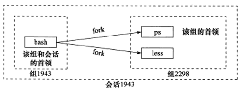
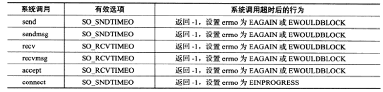

<!-- START doctoc generated TOC please keep comment here to allow auto update -->
<!-- DON'T EDIT THIS SECTION, INSTEAD RE-RUN doctoc TO UPDATE -->


- [TCP编程](#tcp%E7%BC%96%E7%A8%8B)
  - [一、信号处理](#%E4%B8%80%E4%BF%A1%E5%8F%B7%E5%A4%84%E7%90%86)
    - [1、SIGHUP信号](#1sighup%E4%BF%A1%E5%8F%B7)
      - [（1）会话和进程组](#1%E4%BC%9A%E8%AF%9D%E5%92%8C%E8%BF%9B%E7%A8%8B%E7%BB%84)
      - [（2）SIGHUP信号的触发及默认处理](#2sighup%E4%BF%A1%E5%8F%B7%E7%9A%84%E8%A7%A6%E5%8F%91%E5%8F%8A%E9%BB%98%E8%AE%A4%E5%A4%84%E7%90%86)
    - [2、SIGPIPE信号](#2sigpipe%E4%BF%A1%E5%8F%B7)
    - [3、SIGURG信号](#3sigurg%E4%BF%A1%E5%8F%B7)
      - [（1）带外数据](#1%E5%B8%A6%E5%A4%96%E6%95%B0%E6%8D%AE)
      - [（2）SIGURG信号的作用](#2sigurg%E4%BF%A1%E5%8F%B7%E7%9A%84%E4%BD%9C%E7%94%A8)
  - [二、套接字选项详解](#%E4%BA%8C%E5%A5%97%E6%8E%A5%E5%AD%97%E9%80%89%E9%A1%B9%E8%AF%A6%E8%A7%A3)
    - [1、SO_REUSEADDR选项](#1so_reuseaddr%E9%80%89%E9%A1%B9)
      - [（1）TIME_WAIT 状态与 2MSL](#1time_wait-%E7%8A%B6%E6%80%81%E4%B8%8E-2msl)
      - [（2）端口复用](#2%E7%AB%AF%E5%8F%A3%E5%A4%8D%E7%94%A8)
    - [2、SO_RECVBUF 和 SO_SNDBUF 选项](#2so_recvbuf-%E5%92%8C-so_sndbuf-%E9%80%89%E9%A1%B9)
    - [3、SO_RCVLOWAT 和 SO_SNDLOWAT 选项](#3so_rcvlowat-%E5%92%8C-so_sndlowat-%E9%80%89%E9%A1%B9)
    - [4、SO_LINGER 选项](#4so_linger-%E9%80%89%E9%A1%B9)
    - [5、SO_KEEPALIVE 选项与TCP_KEEPCNT、TCP_KEEPIDLE 和 TCP_KEEPINTVL选项](#5so_keepalive-%E9%80%89%E9%A1%B9%E4%B8%8Etcp_keepcnttcp_keepidle-%E5%92%8C-tcp_keepintvl%E9%80%89%E9%A1%B9)
      - [（1）心跳检测机制](#1%E5%BF%83%E8%B7%B3%E6%A3%80%E6%B5%8B%E6%9C%BA%E5%88%B6)
      - [（2）设置 SO_KEEPALIVE](#2%E8%AE%BE%E7%BD%AE-so_keepalive)
      - [（3）TCP_KEEPCNT、TCP_KEEPIDLE 和 TCP_KEEPINTVL](#3tcp_keepcnttcp_keepidle-%E5%92%8C-tcp_keepintvl)
    - [6、SO_SNDTIMEO 和 SO_RCVTIMEO 选项](#6so_sndtimeo-%E5%92%8C-so_rcvtimeo-%E9%80%89%E9%A1%B9)
    - [7、TCP_NODELAY 和 TCP_CORK 选项](#7tcp_nodelay-%E5%92%8C-tcp_cork-%E9%80%89%E9%A1%B9)
  - [三、封包、解包和粘包](#%E4%B8%89%E5%B0%81%E5%8C%85%E8%A7%A3%E5%8C%85%E5%92%8C%E7%B2%98%E5%8C%85)

<!-- END doctoc generated TOC please keep comment here to allow auto update -->

## TCP编程

### 一、信号处理
参考 [网络编程的三个重要信号（SIGHUP ，SIGPIPE，SIGURG）](https://blog.csdn.net/z_ryan/article/details/80952498)
#### 1、SIGHUP信号
##### （1）会话和进程组
在介绍SIGHUP信号之前，先来了解两个概念：进程组和会话。

* 进程组：进程组就是一系列相互关联的进程集合，系统中的每一个进程也必须从属于某一个进程组；每个进程组中都会有一个唯一的 ID(process group id)，简称 PGID；PGID 一般等同于进程组的创建进程的 Process ID，而这个进进程一般也会被称为进程组先导(process group leader)，同一进程组中除了进程组先导外的其他进程都是其子进程；进程组的存在，方便了系统对多个相关进程执行某些统一的操作，例如，我们可以一次性发送一个信号量给同一进程组中的所有进程。
　　
* 会话：会话（session）是一个若干进程组的集合，同样的，系统中每一个进程组也都必须从属于某一个会话；一个会话只拥有最多一个控制终端（也可以没有），该终端为会话中所有进程组中的进程所共用。一个会话中前台进程组只会有一个，只有其中的进程才可以和控制终端进行交互；除了前台进程组外的进程组，都是后台进程组；和进程组先导类似，会话中也有会话先导(session leader)的概念，用来表示建立起到控制终端连接的进程。在拥有控制终端的会话中，session leader 也被称为控制进程(controlling process)，一般来说控制进程也就是登入系统的 shell 进程(login shell)。

下面这个案例将演示进程间的关系：

    $ ps -o pid,ppid,pgid,sid,comm|less
    PID   PPID   PGID    SID  COMMAND
    1943  1942   1943    1943 bash
    2298  1943   2298    1943 ps
    2299  1943   2298    1943 less

我们是在bash shell下执行ps和less命令的，所以ps和less命令的父进程是bash命令，这可以从PPID（父进程PID）一列看出。这3条命令创建了1个会话(SID是1943）和2个进程组（PGID分别是1943和2298）。bash命令的PID、PGID和SID都相同，很明显它既是会话的首领，也是组1943的首领。ps命令则是组2298的首领，因为其PID也是2298。下图描述了此三者的关系：



##### （2）SIGHUP信号的触发及默认处理

在对会话的概念有所了解之后，我们现在开始正式介绍一下SIGHUP信号，**SIGHUP 信号在用户终端连接(正常或非正常)结束时发出, 通常是在终端的控制进程结束时**, 通知同一session内的各个作业, 这时它们与控制终端不再关联. 系统对SIGHUP信号的默认处理是终止收到该信号的进程。所以若程序中没有捕捉该信号，当收到该信号时，进程就会退出。

SIGHUP会在以下3种情况下被发送给相应的进程：
* 1、终端关闭时，该信号被发送到session首进程以及作为job提交的进程（即用 & 符号提交的进程）；
* 2、session首进程退出时，该信号被发送到该session中的前台进程组中的每一个进程；
* 3、若父进程退出导致进程组成为孤儿进程组，且该进程组中有进程处于停止状态（收到SIGSTOP或SIGTSTP信号），该信号会被发送到该进程组中的每一个进程。

　　例如：在我们登录Linux时，系统会分配给登录用户一个终端(Session)。在这个终端运行的所有程序，包括前台进程组和后台进程组，一般都属于这个 Session。当用户退出Linux登录时，前台进程组和后台有对终端输出的进程将会收到SIGHUP信号。这个信号的默认操作为终止进程，因此前台进 程组和后台有终端输出的进程就会中止。

此外，对于与终端脱离关系的守护进程，这个信号用于通知它重新读取配置文件。 比如xinetd超级服务程序。当xinetd程序在接收到SIGHUP信号之后调用hard_reconfig函数，它将循环读取/etc/xinetd.d/目录下的每个子配置文件，并检测其变化。如果某个正在运行的子服务的配置文件被修改以停止服务，则xinetd主进程讲给该子服务进程发送SIGTERM信号来结束它。如果某个子服务的配置文件被修改以开启服务，则xinetd将创建新的socket并将其绑定到该服务对应的端口上。

#### 2、SIGPIPE信号

在网络编程中，SIGPIPE这个信号是很常见的。当往一个写端关闭的管道或socket连接中连续写入数据时会引发SIGPIPE信号,引发SIGPIPE信号的写操作将设置errno为EPIPE。在TCP通信中，当通信的双方中的一方close一个连接时，若另一方接着发数据，根据TCP协议的规定，会收到一个RST响应报文，若再往这个服务器发送数据时，系统会发出一个SIGPIPE信号给进程，告诉进程这个连接已经断开了，不能再写入数据。

SIGPIPE信号的默认行为是结束进程，而我们绝对不希望因为写操作的错误而导致程序退出，尤其是作为服务器程序来说就更恶劣了。所以我们应该对这种信号加以处理，在这里，介绍两种处理SIGPIPE信号的方式：

* 1、给SIGPIPE设置SIG_IGN信号处理函数，忽略该信号:
```c
signal(SIGPIPE, SIG_IGN);
```
前文说过，引发SIGPIPE信号的写操作将设置errno为EPIPE,。所以，第二次往关闭的socket中写入数据时, 会返回-1, 同时errno置为EPIPE. 这样，便能知道对端已经关闭，然后进行相应处理，而不会导致整个进程退出。

* 2、使用send函数的MSG_NOSIGNAL 标志来禁止写操作触发SIGPIPE信号：
```c
send(sockfd , buf , size , MSG_NOSIGNAL);
```
同样，可以根据send函数反馈的errno来判断socket的读端是否已经关闭。此外，也可以通过IO复用函数来检测管道和socket连接的读端是否已经关闭。以POLL为例，当socket连接被对方关闭时，socket上的POLLRDHUP事件将被触发。

#### 3、SIGURG信号

##### （1）带外数据

带外数据用于迅速告知对方本端发生的重要的事件。它比普通的数据（带内数据）拥有更高的优先级，不论发送缓冲区中是否有排队等待发送的数据，它总是被立即发送。带外数据的传输可以使用一条独立的传输层连接，也可以映射到传输普通数据的连接中。实际应用中，带外数据是使用很少见，有，telnet和ftp等远程非活跃程序（例如，FTP协议中，如果用户正在从服务器获取大文件，但是突然点击取消获取该文件，这时数据传输已经开始，但可以利用OOB来发送紧急数据，中止该过程）。

UDP没有没有实现带外数据传输，TCP也没有真正的带外数据。不过TCP利用头部的紧急指针标志和紧急指针，为应用程序提供了一种紧急方式，含义和带外数据类似。TCP的紧急方式利用传输普通数据的连接来传输紧急数据。

##### （2）SIGURG信号的作用
　　内核通知应用程序带外数据到达的方式有两种：一种就是利用IO复用技术的系统调用（如select）在接受到带外数据时将返回，并向应用程序报告socket上的异常事件。

　　另一种方法就是使用SIGURG信号。

### 二、套接字选项详解

该部分内容参考《Linux高性能服务器编程》和后台开发核心技术与应用实践》相关章节。
#### 1、SO_REUSEADDR选项

##### （1）TIME_WAIT 状态与 2MSL

客户端连接在收到服务器的结束报文段之后并没有直接进入CLOSED状态，而是转移到TIME_WAIT状态。在这个状态，客户端连接要等待一段长为2MSL (Maximum Segment Life,报文段最大生存时间）的时间，才能完全关闭。MSL是TCP报文段在网络中的最大生存时间，标准文档RFC H22的建议值是2min。

TIME_WAIT状态存在的原因有两点：

* 可靠地终止TCP连接

  当TCP的一端发起主动关闭，在发出最后一个ACK包后，即第3次握手完成后发送了第四次握手的ACK包后就进入了TIME_WAIT状态，必须在此状态上停留两倍的MSL时间。等待2MSL时间主要目的是怕最后一个ACK包对方没收到，那么对方在超时后将重发第三次握手的FIN包，主动关闭端接到重发的FIN包后可以再发一个ACK应答包。

* 保证让迟来的TCP报文段有足够的时间被识别并丢弃

  TCP实现可能面临着先后两个相同的五元组。如果前一个连接处于TIME_WAIT状态，而允许另一个拥有相同五元组连接出现，可能处理TCP报文时，两个连接互相干扰。所以使用SO_REUSEADDR选项就需要考虑这种情况。
  
  如果有了TIME_WAIT状态，那么当前的程序的IP和端口就不能再用来建立新的连接，如果没有这个状态，那么程序可能会创建一个和之前一样的Ip和端口的连接，而上一个这样的连接已经关闭了，但是上一个这样的连接的数据还存在网络，这时候就会和现在的连接造成干扰，2MSL的时间足以让这些旧的数据丢弃。

更多关于TIME_WAIT的内容详见《高性能Linux服务端编程》TCP协议部分章节。

##### （2）端口复用

在server 的TCP 连接没有完全断开之前不允许重新监听是不合理的。因为，TCP 连接没有完全断开指的是
connfd（127.0.0.1:6666）没有完全断开，而我们重新监听的是listenfd（0.0.0.0:6666），虽然是占用同一
个端口，但IP 地址不同，connfd 对应的是与某个客户端通讯的一个具体的IP 地址，而listenfd 对应的是wildcard
address。解决这个问题的方法是使用setsockopt()设置socket 描述符的选项SO_REUSEADDR 为1，表示允
许创建端口号相同但IP 地址不同的多个socket 描述符。

在server 代码的socket()和bind()调用之间插入如下代码：
```c
int opt = 1;
setsockopt(listenfd, SOL_SOCKET, SO_REUSEADDR, &opt, sizeof(opt));
```
具体使用详见 reuse_address.cpp。

#### 2、SO_RECVBUF 和 SO_SNDBUF 选项

SO_RCVBUF和SO_SNDBUF选项分别表示TCP接收缓冲区和发送缓冲区的大小。不过，当我们用setsockopt来设置TCP的接收缓冲区和发送缓冲区的大小时，系统都会将其值加倍，并且不得小于某个最小值。TCP接收缓冲区的最小值是256字节，而发送缓冲区的最小值是2000字节（不过，不同的系统可能有不同的默认最小值）。

在set_recv_buffer.cpp中有：

```c
setsockopt( sock, SOL_SOCKET, SO_RCVBUF, &recvbuf, sizeof( recvbuf ) );
getsockopt( sock, SOL_SOCKET, SO_RCVBUF, &recvbuf, ( socklen_t* )&len );
printf( "the receive buffer size after settting is %d\n", recvbuf );
```
结果如下：

    $ ./recv 127.0.0.1 6666 50
    the receive buffer size after settting is 2304

在set_send_buffer.cpp中有：
```c
setsockopt( sock, SOL_SOCKET, SO_SNDBUF, &sendbuf, sizeof( sendbuf ) );
getsockopt( sock, SOL_SOCKET, SO_SNDBUF, &sendbuf, ( socklen_t* )&len );
printf( "the tcp send buffer size after setting is %d\n", sendbuf );
```
运行结果如下：

    $ ./send 127.0.0.1 6666 2000
    the tcp send buffer size after setting is 4608

这里的接收缓冲区最小值是2304 bytes，发送缓冲区为4608 bytes。

#### 3、SO_RCVLOWAT 和 SO_SNDLOWAT 选项

SO_RCVLOWAT和SO_SNDLOWAT选项分别表示TCP接收缓冲区和发送缓冲区的低水位标记。它们一般被I/O复用系统调用用来判断socket是否可读或可写。当TCP接收缓冲区中可读数据的总数大于其低水位标记时，I/O复用系统调用将通知应用程序可以从对应的socket上读取数据：当TCP发送缓冲区中的空闲空间（可以写入数据的空间）大于其低水位标记时，I/O复用系统调用将通知应用程序可以往对应的socke上写入数据。

默认情况下，TCP接收缓冲区的低水位标记和TCP发送缓冲区的低水位标记均为1字节。

#### 4、SO_LINGER 选项

SO_LINGER选项用于控制close系统调用在关团TCP连接时的行为。默认情况下，当我们使用close系统调用来关闭一个socket时，close将立即返回，TCP模块负责把该socket 对应的TCP发送缓冲区中残留的数据发送给对方。

设置（获取）SO_LINGER选项的值时，我们需要给setsockopt(getsockopt)系统调用传递一个linger类型的结构体，其定义如下：
```c
#include <sys/socket.h>
struct linger
{
    int l_onoff;// 开启（非0）还是关闭（0）该选项
    int l_linger;// 滞留时间
};
```
根据linger结构体中两个成员变量的不同值，close系统调用可能产生如下3种行为之一:

* l_onoff等于0。此时SO_LINGER选项不起作用，close用默认行为来关闭socket。
* l_onoff不为0，l_linger等于0 ·此时close系统调用立即返回，TCP模块将丢弃被关团的socket对应的TCP发送缓冲区中残留的数据，同时给对方发送一个复位报文段。因此，这种情况给服务器提供了异常终止一个连接的方法。
* l_onoff不为0，l_linger大于0。此时close的行为取决于两个条件：一是被关闭的socket对应的TCP发送缓冲区中是否还有残留的数据，二是该socket是阻塞的，还是非阻塞的。对于阻塞的soket，close将等待一段长为l_linger的时间，直到TCP模块发送完所有残留数据并得到对方的确认。如果这段时间内TCP模块没有发送完残留数据并得到对方的确认，那么close系统调用将返回，并设置errno为EWOULDBLOCK；如果socket是非阻塞的，close将立即返回，此时我们需要根据其返回值和errno来判断残留数据是否已经发送完毕。

#### 5、SO_KEEPALIVE 选项与TCP_KEEPCNT、TCP_KEEPIDLE 和 TCP_KEEPINTVL选项

##### （1）心跳检测机制
在TCP 网络通信中，经常会出现客户端和服务器之间的非正常断开，需要实时检测查询链接状态。常用的解决方法就是在程序中加入心跳机制。Heart-Beat 线程是最常用的简单方法。在接收和发送数据时个人设计一个守护进程(线程)，定时发送Heart-Beat 包，客户端/服务器收到该小包后，立刻返回相应的包即可检测对方是否实时在线。

该方法的好处是通用，但缺点就是会改变现有的通讯协议！大家一般都是使用业务层心跳来处理，主要是灵活可控。

UNIX 网络编程不推荐使用SO_KEEPALIVE 来做心跳检测，还是在业务层以心跳包做检测比较好，也方便控制。

##### （2）设置 SO_KEEPALIVE

SO_KEEPALIVE 保持连接检测对方主机是否崩溃，避免（服务器）永远阻塞于TCP 连接的输入。设置该选项后，如果2 小时内在此套接口的任一方向都没有数据交换，TCP 就自动给对方发一个保持存活探测分节(keepaliveprobe)。这是一个对方必须响应的TCP 分节.它会导致以下三种情况：

* 对方接收一切正常：以期望的ACK 响应；2小时后，TCP 将发出另一个探测分节。
* 对方已崩溃且已重新启动：以RST 响应；套接口的待处理错误被置为ECONNRESET，套接口本身则被关闭。
* 对方无任何响应：源自berkeley 的TCP 发送另外8 个探测分节，相隔75 秒一个，试图得到一个响应。在发出第一个探测分节11 分钟15 秒后若仍无响应就放弃。套接口的待处理错误被置为ETIMEOUT，套接口本身则被关闭。如ICMP 错误是“host unreachable(主机不可达)”，说明对方主机并没有崩溃，但是不可达，这种情况下待处理错误被置为EHOSTUNREACH。

根据上面的介绍我们可以知道对端以一种非优雅的方式断开连接的时候，我们可以设置SO_KEEPALIVE 属性使得我们在2 小时以后发现对方的TCP 连接是否依然存在。
```c
keepAlive = 1;
setsockopt(listenfd, SOL_SOCKET, SO_KEEPALIVE, (void*)&keepAlive, sizeof(keepAlive));
```

##### （3）TCP_KEEPCNT、TCP_KEEPIDLE 和 TCP_KEEPINTVL

SO_KEEPALIVE 设置空闲2小时才发送一个“保持存活探测分节”，不能保证实时检测。对于判断网络断开时间太长，对于需要及时响应的程序不太适应。如果我们不能接受如此之长的等待时间，从TCP-Keepalive-HOWTO 上可以知道一共有两种方式可以设置，一种是修改内核关于网络方面的配置参数，另外一种就是SOL_TCP 字段的TCP_KEEPIDLE， TCP_KEEPINTVL，TCP_KEEPCNT 三个选项：

* The tcp_keepidle(开始首次KeepAlive 探测前的TCP 空闭时间) parameter specifies the interval of inactivity that causes TCP to generate a KEEPALIVE transmission for an application that requests them. tcp_keepidle defaults to 14400 (two hours).
* The tcp_keepintvl(两次KeepAlive 探测间的时间间隔) parameter specifies the interval between the nine retriesthat are attempted if a KEEPALIVE transmission is not acknowledged. tcp_keep ntvldefaults to 150 (75 seconds).
* The tcp_keepcnt(判定断开前的KeepAlive 探测次数) option specifies the maximum number of keepalive probes tobe sent. The value of TCP_KEEPCNT is an integer value between 1 and n, where n s the value of the systemwide tcp_keepcnt parameter.

```c
int keepIdle = 1000;
int keepInterval = 10;
int keepCount = 10;
Setsockopt(listenfd, SOL_TCP, TCP_KEEPIDLE, (void *)&keepIdle, sizeof(keepIdle));
Setsockopt(listenfd, SOL_TCP,TCP_KEEPINTVL, (void *)&keepInterval, sizeof(keepInterval));
Setsockopt(listenfd,SOL_TCP, TCP_KEEPCNT, (void *)&keepCount, sizeof(keepCount));
```
上述设置后，1000s后将启动第一个探测，然后每隔10s发送一个探测，如果探测连续十次都无法收到对等方回应，那么确认对等方断开连接。

当然也可以通过修改内核相关参数来达到目的，但这样做会影响所有的socket，因此推荐使用setsockopt设置。

#### 6、SO_SNDTIMEO 和 SO_RCVTIMEO 选项

SO_RCVTIMEO和SO_SNDTIMEO,它们分别用来设置socket接收数据超时时间和发送数据超时时间。因此，这两个选项仅对与数据接收和发送相关的socket专用系统用有效，这些系统调用包括send、sendmsg、recv、recvmsg、accept和connect.我们将选项SO_RCVTIMEO和SO_SNDTIMEO对这些系统调用的影响总结于下表中：



关于连接超时、读写数据超时的具体用法详见connect_timeout.cpp、timeout_client.cpp和timeout_server.cpp

#### 7、TCP_NODELAY 和 TCP_CORK 选项

在网络拥塞控制领域，有一个非常有名的算法叫作Nagle算法(Nagle algorithm)，这是使用它的发明人John Nagle的名字来命名的。John Nagle在1984年首次用这个算法来尝试解决福特汽车公司的网络拥塞问题（RFC 896）。该问题的具体描述是：如果应用程序一次产生1 Byte的数据，而这个1 Byte数据又以网络数据包的形式发送到远端服务器，那么就很容易导致网络由于太多的数据包而过载。比如，当用户使用Telnet连接到远程服务器时，每一次按键操作就会产生1 Byte数据，进而发送出去一个数据包，所以在典型情况下，传送一个只拥有1 Byte有效数据的数据包，却要发费40 Byte长包头（即IP头20 Byte+TCP头20 Byte)的额外开销，这种有效载荷(payload)利用率极其低下的情况被统称之为愚蠢窗口症候群（Silly Window Syndrome)。可以看到，这种情况对于轻负载的网络来说，可能还可以接受，但是对于重负载的网络而言，就极有可能承载不了而轻易发生拥塞瘫痪。

针对上面提到的这个状况，Nagle算法的改进在于：如果发送端欲多次发送包含少量字符的数据包（一般情况下，后面统一称长度小于MSS的数据包为小包；与此相对，称长度等于MSS的数据包为大包；为了某些对比说明，还有中包，即长度比小包长，但又不足一个 MSS的包），则发送端会先将第一个小包发送出去，而将后面到达的少量字符数据都缓存起来而不立即发送，直到收到接收端对前一个数据包报文段的ACK确认为止，或当前字符属于紧急数据，或者积攒到了一定数量的数据（比如缓存的字符数据已经达到数据包报文段的最大长度）等多种情况才将其组成一个较大的数据包发送出去。

TCP中的Nagle算法默认是启用的，但是它并不是适合任何情况，对于telnet或rlogin 这样的远程登录应用的确比较适合（原本就是为此而设计），但是在某些应用场景下却又需要关闭它，有需要发送的就立即发送。

TCP_NODELAY和TCP_CORK基本上控制了包的“ Nagle化"，Nagle化在这里的含义是采用Nagle算法把较小的包组装为更大的帧。

TCP_NODELAY和TCP_CORK都禁掉了 Nagle算法，只不过它们的行为需求不同而已。

TCP_NODELAY不使用Nagle算法，不会将小包进行拼接成大包再进行发送，而是直接将小包发送出去，这会使得用户体验要好。

当在传送大量数据的时候，为了提高TCP发送效率，可以设置TCP_CORK, CORK就是“塞子"的意思，它会尽量在每次发送最大的数据量。当设置了TCP_CORK后，会有200ms阻塞，当阻塞时间过后，数据就会自动传送。


### 三、封包、解包和粘包

TCP是个“流"协议，所谓流，就是没有界限的一串数据。大家可以将其想象河里的流水，是连成一片的，其间是没有分界线的。但一般通信程序开发是需要定义一个个相互独立的数据包的，比如用于登录的数据包、用于注销的数据包等。由于TCP “流"的特性以及网络状况，在进行数据传输时假设我们连续调用两次send分别发送两段数据datal和data2,在接收端有以下几种接收情况（当然不止这几种情况，这里只列出了有代表性的情况）。
* （1）先接收到datal，然后接收到data2。
* （2）先接收到datal的部分数据，然后接收到datal余下的部分以及data2的全部。
* （3）先接收到了datal的全部数据和data2的部分数据，然后接收到了data2的余下的数据。
* （4）一次性接收到了datal和data2的全部数据。

对于（1）这种情况正是我们需要的，不再做讨论。对于（2）、（3）和（4）的情况就是常说的“粘包"，就需要把接收到的数据进行拆包，拆成一个个独立的数据包；而为了拆包就必须在发送端进行封包。

对于UDP来说就不存在拆包的问题，因为UDP是个"数据包"协议，也就是两段数据间是有界限的，在接收端要么接收不到数据要么就是接收一段完整的数据，不会少接收也不会多接收。

为什么会出现（2）、（3）和（4）的情况呢，有以下几点原因：

* 1）由Nagle算法造成的发送端的粘包。前面有提到Nagle算法是一种改善网络传输效率的算法，但也可能造成困扰。简单来说，当要提交一段数据给TCP发送时，TCP并不立刻发送此段数据，而是等待一小段时间，看看在等待期间是否还有要发送的数据，若有则会一次把多段数据发送出去。像（3）和（4）的情况就有可能是Nagle算法造成的。
* 2）接收端接收不及时造成的接收端粘包。TCP会把接收到的数据存在自己的缓冲区中，然后通知应用层取数据。当应用层由于某些原因不能及时取出TCP的数据，就会造成TCP 缓冲区中存放了多段数据。

“粘包"可发生在发送端也可发生在接收端。

最初遇到"粘包"的问题时，大家可能觉得可以在两次send之间调用ep来休眠一小段时间，以此来解决。这个解决方法的缺点是显而易见的：使传输效率大大降低，而且也并不可靠。对数据包进行封包和拆包，就能解决这个问题。

封包就是给一段数据加上包头，这样一来数据包就分为包头和包体两部分内容了（以后讲过滤非法包时会加上“包尾"内容）。包头其实上是个大小固定的结构体，其中有个结构体成员变量表示包体的长度，这是个很重要的变量，其他的结构体成员可根据需要自己定义。根据固定的包头长度以及包头中含有的包体长度的变量值就能正确的拆分出一个完整的数据包。

利用底层的缓冲区来进行拆包时，由于TCP也维护了一个缓冲区，所以可以利用TCP 的缓冲区来缓存发送的数据，这样一来就不需要为每一个连接分配一个缓冲区了，对于利用缓冲区来拆包，也就是循环不停地接收包头给出的数据，直到收够为止，这就是一个完整的 TCP包。

为了解决“粘包"的问题，大家通常会在所发送的内容前加上发送内容的长度，所以对方就会先收4 Byte，解析获得接下来需要接收的长度，再进行收包。muduo网络库中精心设计了一块发送和接收缓冲区Buffer，该Buffer的前两个字节内容可以用于保存所接收数据大小。

package_server.cpp 和package_client.cpp 演示了如何使用“数据长度+数据”的方法来解决粘包问题。需要注意的是，无论是发送方还是接收方，发送数据的前四个字节由于是数字，所以需要使用网络字节序转换函数发送或获取。

package_struct_server.cpp 和package_struct_client.cpp 演示了如何在网络上发送一个结构体。其实并非真的直接发送和接收该结构体。发送时将该结构体内容依次展开拷贝到发送字符缓冲区，该缓冲区前4个字节是该结构体的长度；接收时也按照这样的顺序将收到数据读出并还原为结构体。