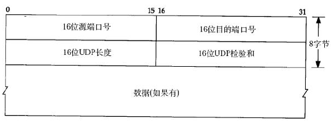
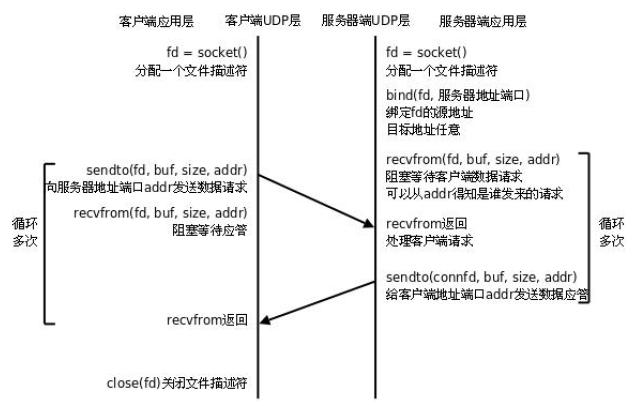

<!-- START doctoc generated TOC please keep comment here to allow auto update -->
<!-- DON'T EDIT THIS SECTION, INSTEAD RE-RUN doctoc TO UPDATE -->


- [UDP 编程](#udp-%E7%BC%96%E7%A8%8B)
  - [一、UDP 协议](#%E4%B8%80udp-%E5%8D%8F%E8%AE%AE)
  - [二、UDP 服务器编程](#%E4%BA%8Cudp-%E6%9C%8D%E5%8A%A1%E5%99%A8%E7%BC%96%E7%A8%8B)
    - [（1）UDP 服务器](#1udp-%E6%9C%8D%E5%8A%A1%E5%99%A8)
    - [（2）C/S 模型-UDP](#2cs-%E6%A8%A1%E5%9E%8B-udp)
    - [（3）ICPM 异步错误与connect](#3icpm-%E5%BC%82%E6%AD%A5%E9%94%99%E8%AF%AF%E4%B8%8Econnect)
    - [（4）UDP 客户端程序使用bind()函数](#4udp-%E5%AE%A2%E6%88%B7%E7%AB%AF%E7%A8%8B%E5%BA%8F%E4%BD%BF%E7%94%A8bind%E5%87%BD%E6%95%B0)
  - [三、广播](#%E4%B8%89%E5%B9%BF%E6%92%AD)
  - [四、组播（多播）](#%E5%9B%9B%E7%BB%84%E6%92%AD%E5%A4%9A%E6%92%AD)
    - [1、多播](#1%E5%A4%9A%E6%92%AD)
    - [2、多播编程](#2%E5%A4%9A%E6%92%AD%E7%BC%96%E7%A8%8B)
      - [（1）ip_mreqn 结构体](#1ip_mreqn-%E7%BB%93%E6%9E%84%E4%BD%93)
      - [（2）if_nametoindex 函数](#2if_nametoindex-%E5%87%BD%E6%95%B0)

<!-- END doctoc generated TOC please keep comment here to allow auto update -->

## UDP 编程

### 一、UDP 协议
UDP是传输层的协议，功能即为在IP的数据报服务之上增加了最基本的服务：复用和分用以及差错检测。

UDP提供不可靠服务，具有TCP所没有的优势：

* UDP无连接，时间上不存在建立连接需要的时延。空间上，TCP需要在端系统中维护连接状态，需要一定的开销。此连接装入包括接收和发送缓存，拥塞控制参数和序号与确认号的参数。UCP不维护连接状态，也不跟踪这些参数，开销小。空间和时间上都具有优势。
举个例子：

  DNS如果运行在TCP之上而不是UDP，那么DNS的速度将会慢很多。
HTTP使用TCP而不是UDP，是因为对于基于文本数据的Web网页来说，可靠性很重要。
同一种专用应用服务器在支持UDP时，一定能支持更多的活动客户机。

* 分组首部开销小，TCP首部20字节，UDP首部8字节。

* UDP没有拥塞控制，应用层能够更好的控制要发送的数据和发送时间，网络中的拥塞控制也不会影响主机的发送速率。某些实时应用要求以稳定的速度发送，能容 忍一些数据的丢失，但是不能允许有较大的时延（比如实时视频，直播等）

* UDP提供尽最大努力的交付，不保证可靠交付。所有维护传输可靠性的工作需要用户在应用层来完成。没有TCP的确认机制、重传机制。如果因为网络原因没有传送到对端，UDP也不会给应用层返回错误信息

* UDP是面向报文的，对应用层交下来的报文，添加首部后直接乡下交付为IP层，既不合并，也不拆分，保留这些报文的边界。对IP层交上来UDP用户数据报，在去除首部后就原封不动地交付给上层应用进程，报文不可分割，是UDP数据报处理的最小单位。

  正是因为这样，UDP显得不够灵活，不能控制读写数据的次数和数量。比如我们要发送100个字节的报文，我们调用一次sendto函数就会发送100字节，对端也需要用recvfrom函数一次性接收100字节，不能使用循环每次获取10个字节，获取十次这样的做法。

* UDP常用一次性传输比较少量数据的网络应用，如DNS,SNMP等，因为对于这些应用，若是采用TCP，为连接的创建，维护和拆除带来不小的开销。UDP也常用于多媒体应用（如IP电话，实时视频会议，流媒体等）数据的可靠传输对他们而言并不重要，TCP的拥塞控制会使他们有较大的延迟，也是不可容忍的。

UDP数据报分为首部和用户数据部分，整个UDP数据报作为IP数据报的数据部分封装在IP数据报中，UDP数据报文结构如图所示：



UDP首部有8个字节，由4个字段构成，每个字段都是两个字节：

* 源端口： 源端口号，需要对方回信时选用，不需要时全部置0.
* 目的端口：目的端口号，在终点交付报文的时候需要用到。
* 长度：UDP的数据报的长度（包括首部和数据）其最小值为8（只有首部）
* 校验和：检测UDP数据报在传输中是否有错，有错则丢弃。

该字段是可选的，当源主机不想计算校验和，则直接令该字段全为0。当传输层从IP层收到UDP数据报时，就根据首部中的目的端口，把UDP数据报通过相应的端口，上交给应用进程。

如果接收方UDP发现收到的报文中的目的端口号不正确（不存在对应端口号的应用进程0,），就丢弃该报文，并由ICMP发送“端口不可达”差错报文给对方。

参考 [UDP协议的详细解析](https://blog.csdn.net/aa1928992772/article/details/85240358)

### 二、UDP 服务器编程

#### （1）UDP 服务器

传输层主要应用的协议模型有两种，一种是TCP 协议，另外一种则是UDP 协议。TCP 协议在网络通信中占主导地位，绝大多数的网络通信借助TCP 协议完成数据传输。但UDP 也是网络通信中不可或缺的重要通信手段。

相较于TCP 而言，UDP 通信的形式更像是发短信。不需要在数据传输之前建立、维护连接。只专心获取数据就好。省去了三次握手的过程，通信速度可以大大提高，但与之伴随的通信的稳定性和正确率便得不到保证。因此，我们称UDP 为“无连接的不可靠报文传递”。

由于无需创建连接，所以UDP 开销较小，数据传输速度快，实时性较强。多用于对实时性要求较高的通信场合，如视频会议、电话会议等。但随之也伴随着数据传输不可靠，传输数据的正确率、传输顺序和流量都得不到控制和保证。所以，通常情况下，使用UDP 协议进行数据传输，为保证数据的正确性，我们需要在应用层添加辅助校验协议来弥补UDP 的不足，以达到数据可靠传输的目的。

与TCP 类似的，UDP 也有可能出现缓冲区被填满后，再接收数据时丢包的现象。由于它没有TCP 滑动窗口的机制，通常采用如下两种方法解决：
* 服务器应用层设计流量控制，控制发送数据速度。
* 借助setsockopt 函数改变接收缓冲区大小，如：

    ```c
    #include <sys/socket.h>
    int setsockopt(int sockfd, int level, int optname, const void *optval, socklen_t optlen);
    int n = 220x1024
    setsockopt(sockfd, SOL_SOCKET, SO_RCVBUF, &n, sizeof(n));
    ```

#### （2）C/S 模型-UDP



由于UDP 不需要维护连接，程序逻辑简单了很多，但是UDP 协议是不可靠的，保证通讯可靠性的机制需要在应用层实现。

发送和接收函数的介绍见“基础API”章节。

UDP编程案例见src/udp_socket。在该案例是个UDP的“回射服务器”模型，服务器阻塞等待接收客户端发来的数据，一旦接收到数据便打印客户端的IP，然后将数据转换为大写字符发送给客户端。客户端阻塞读取终端输入，终端回车换行后发送数据给服务器，然后阻塞等待服务器的数据。

#### （3）ICPM 异步错误与connect

如果一个UDP客户端向一个不存在或者已经关闭了的UPD服务器发送（sendto）数据，而且该客户端也在发送数据后阻塞等待（recvfrom）服务的数据返回，那么客户端将一直阻塞在recvfrom调用上。

**UDP规定，向一个没有建立连接的套接字上发送消息将导致一个ICMP异步错误，但这个错误将不会通过函数的返回值返回，所以即使服务端不存在，客户端的recvfrom也不会有任何的返回，将一直阻塞。**

为了解决这个问题，可在UDP中使用connect函数，像TCP那样向服务端建立连接，如果连接失败，那么将返回一个错误。如果connect连接成功，那么该UDP的套接字将只能向connect成功的那个服务器发送和接收数据，不能和其他服务器程序通信。

如果connect成功，那么后续的sendto和recvfrom将不需要填写指定的通信对等方地址，也可以使用TCP的send和recv函数。

实际上，无连接UDP调用1次sendto( )发送UDP包，系统要做3件事：连接=>发送=>断开连接。而有连接UDP的send( )由于已经连接好了，只需完成"发送"这一步，故有连接UDP在性能上要由于无连接UDP。

tcp socket调用connect()的时候，实际上是TCP/IP协议栈“3次握手”建立连接的过程。但是对于udpSocket，调用connect( )只是在进程绑定目的地址而已，不会向目的地址发送任何数据。实际上，udpocket调用connect( )之后，其只是在TCP/IP协议栈内绑定一个（协议/源IP/源端口/目的IP/目的端口）的五元组，一直维护到连接结束。

#### （4）UDP 客户端程序使用bind()函数

udp服务器调用了bind()函数为服务器套接字绑定本地地址/端口，这样使得客户端的能知道它发数据的目的地址/端口，服务器如果单单接收客户端的数据，或者先接收客户端的数据(此时通过recvfrom()函数获取到了客户端的地址信息/端口)再发送数据，客户端的套接字可以不绑定自身的地址/端口，因为udp在创建套接字后直接使用sendto()，隐含操作是，在发送数据之前操作系统会为该套接字随机分配一个合适的udp端口，将该套接字和本地地址信息绑定。

但是，如果服务器程序就绪后一上来就要发送数据给客户端，那么服务器就需要知道客户端的地址信息和端口，那么就不能让客户端的地址信息和端口号由客户端所在操作系统分配，而是要在客户端程序指定了。怎么指定，那就是用bind()函数。

### 三、广播

* 广播域：广播域是网络中能接收任一台主机发出的广播帧的所有主机集合。也就是说，如果广播域内的其中一台主机发出一个广播帧，同一广播域内所有的其它主机都可以收到该广播帧。

* 广播域的计算：如何知道一台主机是属于哪一个广播域呢？其实计算很简单，只要用主机的IP 地址与子网掩码进行与运算即可知道该主机属于哪一个广播域。例如：一台主机的IP 地址为192.168.23.150，子网掩码为255.255.255.0，那么它所属的广播域就是192.168.23.150&255.255.255.0=192.168.23.0。那么其它的在广播域192.168.23.0 内的所有主机就可以到该设备发送的广播包。如果把子网掩码改为255.255.0.0，那么它所属的广播域就是192.168.23.150&255.255.0.0=192.168.0.0。那么其它的在广播域192.168.0.0 内的所有主机都可以收到该设备发送的广播包。

* 广播地址的计算：要想相同广播域内的其它主机能收到的广播帧，还需要在发送广播包的时候指定当前所属广播域
内的广播地址。广播地址的计算方法为子网掩码取反再与广播域进行或运算。

    例如： 如果主机当前所属广播域为192.168.0.0，子网掩码为255.255.0.0，那么广播地址则为192.168.255.255。

* 使用UDP 进行跨网段广播：要使主机A 发送的广播包能够被另一网段的主机B 收到，那么只需要更改主机A 的子网掩码使得与主机B 在同一个广播域内，再使用新的广播域的广播地址发送广播包即可。

    例如：要使用192.168.23.150 发送广播包让192.168.27.135 收到，只需要设置192.168.23.150 的子网掩码为255.255.0.0，然后再使用广播地址192.168.255.255 即可。

src\broadcast文件夹下有一个使用广播的案例。

对于server，创建套接字时需要设置SOCK_DGRAM而不是SOCK_STREAM，必须使用UDP协议：
```c
sockfd = socket(AF_INET, SOCK_DGRAM, 0);
```
而且需要设置打开广播选项：
```c
int flag = 1;
setsockopt(sockfd, SOL_SOCKET, SO_BROADCAST, &flag, sizeof(flag));
```
构建客户端的地址结构体时需要将广播的地址和端口设置好：
```c
bzero(&clientaddr, sizeof(clientaddr));
clientaddr.sin_family = AF_INET;
inet_pton(AF_INET, BROADCAST_IP, &clientaddr.sin_addr.s_addr);
clientaddr.sin_port = htons(CLIENT_PORT);
```
其中：
```c
#define BROADCAST_IP "192.168.224.255"
#define CLIENT_PORT 9000 

#define SERVER_PORT 8000 
```
这个BROADCAST_IP需要计算得出，我的实验机器IP是192.168.224.4，子网掩码是255.255.255.0。计算过程如下：

    (192.168.224.255) = (~(255.255.255.0)) | (192.168.224.4)

子网掩码取反后按位与上机器的IP地址即可。

广播的端口是最重要的，服务器端口无所谓。

发送广播的一方可以不适用bind函数，但接收的一方要使用bind绑定地址，否则会失败。
### 四、组播（多播）

#### 1、多播

组播组可以是永久的也可以是临时的。组播组地址中，有一部分由官方分配的，称为永久组播组。永久组播组
保持不变的是它的ip 地址，组中的成员构成可以发生变化。永久组播组中成员的数量都可以是任意的，甚至可以
为零。那些没有保留下来供永久组播组使用的ip 组播地址，可以被临时组播组利用。

    224.0.0.0～224.0.0.255 为预留的组播地址（永久组地址），地址224.0.0.0 保留不做分配，其它地址供路由协议使用；
    224.0.1.0～224.0.1.255 是公用组播地址，可以用于Internet；欲使用需申请。
    224.0.2.0～238.255.255.255 为用户可用的组播地址（临时组地址），全网范围内有效；
    239.0.0.0～239.255.255.255 为本地管理组播地址，仅在特定的本地范围内有效。

可使用ip ad 命令查看网卡编号，如：

    $ ip ad
    1: lo: <LOOPBACK,UP,LOWER_UP> mtu 65536 qdisc noqueue state UNKNOWN group default qlen 1
        link/loopback 00:00:00:00:00:00 brd 00:00:00:00:00:00
        inet 127.0.0.1/8 scope host lo
          valid_lft forever preferred_lft forever
        inet6 ::1/128 scope host 
          valid_lft forever preferred_lft forever
    2: eth0: <BROADCAST,MULTICAST,UP,LOWER_UP> mtu 1500 qdisc pfifo_fast state UP group default qlen 1000
        link/ether 00:0c:29:cf:19:21 brd ff:ff:ff:ff:ff:ff
        inet 192.168.224.139/24 brd 192.168.224.255 scope global eth0
          valid_lft forever preferred_lft forever
        inet6 fe80::20c:29ff:fecf:1921/64 scope link 
          valid_lft forever preferred_lft forever

#### 2、多播编程

##### （1）ip_mreqn 结构体
```c
struct ip_mreqn
{
  struct in_addr imr_multiaddr; /*多播组的IP 地址*/
  struct in_addr imr_address; /*本地址网络接口的IP 地址*/
  int imr_ifindex; /*网络接口序号*/
}
```
该结构体的两个成员分别用于指定所加入的多播组的组IP 地址，和所要加入组的那个本地接口的IP 地址。该命令字没有源过滤的功能，它相当于实现IGMPv1 的多播加入服务接口。

##### （2）if_nametoindex 函数

```c
unsigned if_nametoindex(const char *ifname);
```

if_nametoindex 可以根据网卡名，获取网卡序号。指定网络接口名称字符串作为参数；若该接口存在，则返回相应的索引，否则返回0。

src\multicast有一个组播的案例。