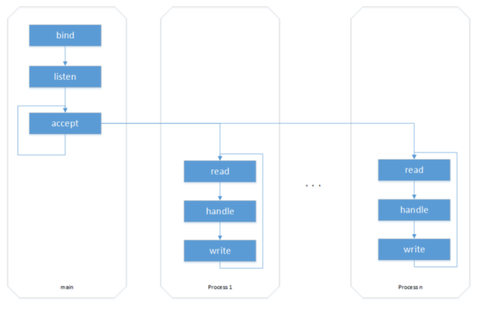
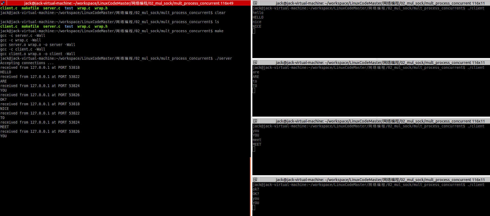
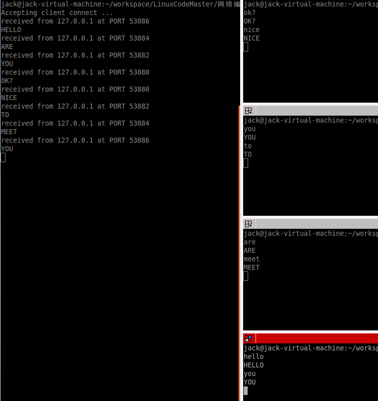

<!-- START doctoc generated TOC please keep comment here to allow auto update -->
<!-- DON'T EDIT THIS SECTION, INSTEAD RE-RUN doctoc TO UPDATE -->

- [多进程与多线程服务器](#%E5%A4%9A%E8%BF%9B%E7%A8%8B%E4%B8%8E%E5%A4%9A%E7%BA%BF%E7%A8%8B%E6%9C%8D%E5%8A%A1%E5%99%A8)
  - [一、多进程服务器](#%E4%B8%80%E5%A4%9A%E8%BF%9B%E7%A8%8B%E6%9C%8D%E5%8A%A1%E5%99%A8)
    - [1、SIGCHLD 信号处理](#1sigchld-%E4%BF%A1%E5%8F%B7%E5%A4%84%E7%90%86)
    - [2、设置端口复用](#2%E8%AE%BE%E7%BD%AE%E7%AB%AF%E5%8F%A3%E5%A4%8D%E7%94%A8)
    - [3、处理关闭事件与套接字](#3%E5%A4%84%E7%90%86%E5%85%B3%E9%97%AD%E4%BA%8B%E4%BB%B6%E4%B8%8E%E5%A5%97%E6%8E%A5%E5%AD%97)
  - [二、多线程服务器](#%E4%BA%8C%E5%A4%9A%E7%BA%BF%E7%A8%8B%E6%9C%8D%E5%8A%A1%E5%99%A8)

<!-- END doctoc generated TOC please keep comment here to allow auto update -->

## 多进程与多线程服务器



无论是多线程还是多进程服务器都可以套用上面的模型。在主进程/线程中不断监听并接收客户端连接，然后一旦有客户端连接则将连接后需要处理的业务逻辑放到子进程/子线程中处理。

### 一、多进程服务器

src\mul_process 目录下案例演示了多进程服务器。该服务器父进程接收客户端连接，一旦客户端连接则开启子线程接收客户端发来数据，将接收到的数据转为大写输出到终端并回写到客户端。

下面是一些多进程服务器编程需要注意的地方。

#### 1、SIGCHLD 信号处理

多进程环境中需要避免僵尸进程，因为父进程一直是在阻塞等待接收客户端连接，如果有子进程退出也需要处理。当子进程终止或者停止时，将SIGCHLD信号发送给其父进程，父进程注册了这个信号的处理函数便会等待该子进程退出。

下面是处理SIGCHLD信号的代码：

```c
struct sigaction newact;

newact.sa_handler = do_sigchild;
sigemptyset(&newact.sa_mask);
newact.sa_flags = 0;
sigaction(SIGCHLD, &newact, NULL)
```

```c
void do_sigchild(int num)
{
    while (waitpid(0, NULL, WNOHANG) > 0)
        ;
}
```
#### 2、设置端口复用

```c
int opt = 1;
setsockopt(listenfd, SOL_SOCKET, SO_REUSEADDR, &opt, sizeof(opt));
```
#### 3、处理关闭事件与套接字

子进程拥有父进程的资源拷贝，套接字也拥有一份拷贝。由于多进程服务器编程模型指定了父进程负责接受连接，子进程负责处理连接套接字的业务逻辑，所以对于父进程来说，已经accept到的connfd不是它所关注的，它只需要关注监听套接字listenf，所以要在父进程中关闭connfd连接套接字。同样的，子进程中只关注连接套接字connfd，而不关注监听套接字listenfd，所以在子进程中要将监听套接字listenfd关闭。

当客户端关闭连接时，Read返回为0，这时子进程将关闭连接套接字connfd，并退出。

```c
while (1) {
    cliaddr_len = sizeof(cliaddr);
    connfd = Accept(listenfd, (struct sockaddr *)&cliaddr, &cliaddr_len);
    pid = fork();
    if (pid == 0) {
        Close(listenfd);
        while (1) {
            n = Read(connfd, buf, MAXLINE);
            if (n == 0) {
                printf("the other side has been closed.\n");
                break;
            }
            printf("received from %s at PORT %d\n",
                    inet_ntop(AF_INET, &cliaddr.sin_addr, str, sizeof(str)),
                    ntohs(cliaddr.sin_port));

            for (i = 0; i < n; i++)
                buf[i] = toupper(buf[i]);

            Write(STDOUT_FILENO, buf, n);
            Write(connfd, buf, n);
        }
        Close(connfd);
        return 0;
    } else if (pid > 0) {
        Close(connfd);
    }  else
        perr_exit("fork");
}
```

运行结果如下：



### 二、多线程服务器

src\mul_thread 下有一个多线程服务器的案例，该案例的业务逻辑和前面多进程的是完全一样的。

服务器主线程阻塞等待接收客户端连接，一旦有连接则将客户端的连接套接字connfd和sockaddr结构（地址信息）保存到结构体s_info中：
```c
struct s_info { //定义一个结构体, 将地址结构跟cfd捆绑
    struct sockaddr_in cliaddr;
    int connfd;
};
```
然后将该结构体传递给新创建的线程：
```c
pthread_create(&tid, NULL, do_work, (void*)&ts[i]);
```
并将该线程设置为分离状态：
```c
pthread_detach(tid);
```
整体流程如下：

```c
while (1) {
    cliaddr_len = sizeof(cliaddr);
    connfd = Accept(listenfd, (struct sockaddr *)&cliaddr, &cliaddr_len);   //阻塞监听客户端链接请求
    ts[i].cliaddr = cliaddr;
    ts[i].connfd = connfd;

    /* 达到线程最大数时，pthread_create出错处理, 增加服务器稳定性 */
    pthread_create(&tid, NULL, do_work, (void*)&ts[i]);
    pthread_detach(tid);    //子线程分离,防止僵线程产生.
    i++;
}
```
运行结果：

