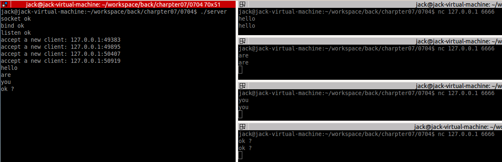

<!-- START doctoc generated TOC please keep comment here to allow auto update -->
<!-- DON'T EDIT THIS SECTION, INSTEAD RE-RUN doctoc TO UPDATE -->


- [I/O 复用](#io-%E5%A4%8D%E7%94%A8)
  - [一、select](#%E4%B8%80select)
    - [1、API](#1api)
    - [2、文件描述符就绪条件](#2%E6%96%87%E4%BB%B6%E6%8F%8F%E8%BF%B0%E7%AC%A6%E5%B0%B1%E7%BB%AA%E6%9D%A1%E4%BB%B6)
    - [3、使用案例](#3%E4%BD%BF%E7%94%A8%E6%A1%88%E4%BE%8B)
      - [案例一--读取终端输入](#%E6%A1%88%E4%BE%8B%E4%B8%80--%E8%AF%BB%E5%8F%96%E7%BB%88%E7%AB%AF%E8%BE%93%E5%85%A5)
      - [案例二--网络编程](#%E6%A1%88%E4%BE%8B%E4%BA%8C--%E7%BD%91%E7%BB%9C%E7%BC%96%E7%A8%8B)
  - [二、poll](#%E4%BA%8Cpoll)
    - [1、API](#1api-1)
    - [2、使用案例](#2%E4%BD%BF%E7%94%A8%E6%A1%88%E4%BE%8B)
  - [三、epoll](#%E4%B8%89epoll)
    - [1、API](#1api-2)
    - [（1）epoll_create](#1epoll_create)
      - [（2）epoll_ctl](#2epoll_ctl)
      - [（3）epoll_wait](#3epoll_wait)
    - [2、ET和LT模式](#2et%E5%92%8Clt%E6%A8%A1%E5%BC%8F)
      - [（1）LT模式实例分析](#1lt%E6%A8%A1%E5%BC%8F%E5%AE%9E%E4%BE%8B%E5%88%86%E6%9E%90)
      - [（2）ET模式实例分析](#2et%E6%A8%A1%E5%BC%8F%E5%AE%9E%E4%BE%8B%E5%88%86%E6%9E%90)
      - [（3）EPOLLONESHOT事件](#3epolloneshot%E4%BA%8B%E4%BB%B6)
      - [（4）使用ET的情况](#4%E4%BD%BF%E7%94%A8et%E7%9A%84%E6%83%85%E5%86%B5)
    - [3、使用案例--回射服务器](#3%E4%BD%BF%E7%94%A8%E6%A1%88%E4%BE%8B--%E5%9B%9E%E5%B0%84%E6%9C%8D%E5%8A%A1%E5%99%A8)
    - [4、epoll实现原理](#4epoll%E5%AE%9E%E7%8E%B0%E5%8E%9F%E7%90%86)
    - [5、信号与统一事件源](#5%E4%BF%A1%E5%8F%B7%E4%B8%8E%E7%BB%9F%E4%B8%80%E4%BA%8B%E4%BB%B6%E6%BA%90)
    - [6、关于LT模式下EPOLLOUT的讨论](#6%E5%85%B3%E4%BA%8Elt%E6%A8%A1%E5%BC%8F%E4%B8%8Bepollout%E7%9A%84%E8%AE%A8%E8%AE%BA)
  - [四、三种I/O复用方法对比](#%E5%9B%9B%E4%B8%89%E7%A7%8Dio%E5%A4%8D%E7%94%A8%E6%96%B9%E6%B3%95%E5%AF%B9%E6%AF%94)
  - [附加--修改系统的文件描述符数量](#%E9%99%84%E5%8A%A0--%E4%BF%AE%E6%94%B9%E7%B3%BB%E7%BB%9F%E7%9A%84%E6%96%87%E4%BB%B6%E6%8F%8F%E8%BF%B0%E7%AC%A6%E6%95%B0%E9%87%8F)

<!-- END doctoc generated TOC please keep comment here to allow auto update -->

## I/O 复用

I/O复用使得程序能同时监听多个文件描述符，这对提高程序的性能至关重要。通常，网络程序在下列情况下需要使用I/O复用技术：

* 客户端程序要同时处理多个socket，比如非阻塞connect技术。
* 客户端程序要同时处理用户输人和网络连接，比如聊天室程序。
* TCP服务器要同时处理监听socket和连接socket，这是I/O复用使用最多的场合。
* 服务器要同时处理TCP请求和UDP请求，比如回射服务器。
* 服务器要同时监听多个端口，或者处理多种服务，比如xinetd服务器。

需要指出的是，I/O复用虽然能同时监听多个文件描述符，但它本身是阻塞的，并且当多个文件描述符同时就绪时，如果不采取额外的措施，程序就只能按顺序依次处理其中的每一个文件描述符，这使得服务器程序看起来像是串行工作的。如果要实现并发，只能使用多进程或多线程等编程手段。

Linux下实现I/O复用的系统调用主要有select、poll和epoll。


### 一、select
select系统调用的用途是：在一段指定时间内，监听用户感兴趣的文件描述符上的可读、可写和异常等事件。

#### 1、API

操作的API如下所示：
```c
#include <sys/select.h>
/* According to earlier standards */
#include <sys/time.h>
#include <sys/types.h>
#include <unistd.h>
int select(int nfds, fd_set *readfds, fd_set *writefds, fd_set *exceptfds, struct timeval *timeout);

    nfds: 监控的文件描述符集里最大文件描述符加1，因为此参数会告诉内核检测前多少个文件描述符的状态
    readfds： 监控有读数据到达文件描述符集合，传入传出参数
    writefds： 监控写数据到达文件描述符集合，传入传出参数
    exceptfds： 监控异常发生达文件描述符集合,如带外数据到达异常，传入传出参数
    timeout： 定时阻塞监控时间，3种情况
        1.NULL，永远等下去
        2.设置timeval，等待固定时间
        3.设置timeval 里时间均为0，检查描述字后立即返回，轮询
        struct timeval {
            long tv_sec; /* seconds */
            long tv_usec; /* microseconds */
        };
    返回值：准备就绪的描述符数量，超时返回0，出错返回-1
```
其中的fd_set 结构如下所示：
```c
#define __FD_SETSIZE 1024

/* The fd_set member is required to be an array of longs.  */
typedef long int __fd_mask;

/* Some versions of <linux/posix_types.h> define this macros.  */
#undef	__NFDBITS
/* It's easier to assume 8-bit bytes than to get CHAR_BIT.  */
#define __NFDBITS	(8 * (int) sizeof (__fd_mask))
#define	__FD_ELT(d)	((d) / __NFDBITS)
#define	__FD_MASK(d)	((__fd_mask) (1UL << ((d) % __NFDBITS)))

/* fd_set for select and pselect.  */
typedef struct
  {
    /* XPG4.2 requires this member name.  Otherwise avoid the name
       from the global namespace.  */
#ifdef __USE_XOPEN
    __fd_mask fds_bits[__FD_SETSIZE / __NFDBITS];
# define __FDS_BITS(set) ((set)->fds_bits)
#else
    __fd_mask __fds_bits[__FD_SETSIZE / __NFDBITS];
# define __FDS_BITS(set) ((set)->__fds_bits)
#endif
  } fd_set;

/* Maximum number of file descriptors in `fd_set'.  */
#define	FD_SETSIZE		__FD_SETSIZE
```
从上面的定义可见，fd_set结构体仅仅包含一个整型数组，该数组的每个元素的每一个位(bit)标记了一个文件描述符。fd_set能容纳的文件描述符数量由__FD_SETSIZE 指定，而且默认是1024，这就限制了select能同时处理的文件描述符的总量。

位运算操作过于繁琐，下面这组宏定义了操作fd_set中的位：
```c
/* Access macros for `fd_set'.  */
#define	FD_SET(fd, fdsetp)	__FD_SET (fd, fdsetp) //把文件描述符集合里fd 位置1
#define	FD_CLR(fd, fdsetp)	__FD_CLR (fd, fdsetp) //把文件描述符集合里fd 清0
#define	FD_ISSET(fd, fdsetp)	__FD_ISSET (fd, fdsetp) //测试文件描述符集合里fd 是否置1
#define	FD_ZERO(fdsetp)		__FD_ZERO (fdsetp) //把文件描述符集合里所有位清0
```

#### 2、文件描述符就绪条件

哪些情况下文件描述符可以被认为是可读、可写或者出现异常，对于select的使用非常关键。在网络编程中，下列情下socket可读：

* socket内核接收缓存区中的字节数大于或等于其低水位标记SO_RCVLOWAT。此时我们可以无阻塞地读该socket，并且读操作返回的字节数大于0。
* socket通信的对方关闭连接。此时对该socket的读操作将返回0。
* 监听socket上有新的连接请求。
* socket上有未处理的错误。此时我们可以使用getsockopt来读取和清除该错误。

下列情况下socket可写：

* socket内核发送缓存区中的可用字节数大于或等于其低水位标记SO_SNDLOWAT。此时我们可以无阻塞地写该socket，并且写操作返回的字节数大于0。
* socket的写操作被关闭。对写操作被关团的socket执行写操作将触发一个SIGPIPE信号。
* socket使用非阻塞connect连接成功或者失败（超时）之后。
* socket上有未处理的错误。此时我们可以使用getsockopt来读取和清除该错误。

#### 3、使用案例

##### 案例一--读取终端输入

src\select\keyboard.c 和src\select\keyboard_timeout.c 分别展示了使用select监听终端输入及其超时等待用法。

select 函数网络编程原理如下：

##### 案例二--网络编程


使用select时，需要关注监听套接字及其读事件。当监听套接字上有读事件发生时，即可使用accept获取到连接套接字，并关注该套接字及其读事件。当这些连接套接字开始活跃时，循环遍历这些套接字，使用read系统调用获取连接客户端发来数据，并作其他业务逻辑。

该案例代码在src\select\server.c中，具体分析见该案例的相关注解。客户端连接使用

    nc 127.0.0.1 6666

运行结果如下：


### 二、poll

poll 的机制与select 类似，与select 在本质上没有多大差别，管理多个描述符也是进行轮询，根据描述符的
状态进行处理，但是poll 没有最大文件描述符数量的限制。poll 和select 同样存在一个缺点就是，包含大量文件
描述符的数组被整体复制于用户态和内核的地址空间之间，而不论这些文件描述符是否就绪，它的开销随着文件描
述符数量的增加而线性增大。

#### 1、API
```c
#include <poll.h>
int poll(struct pollfd fd[], nfds_t nfds, int timeout);
```
fds参数是一个pollfd结构类型的数组，它指定所有我们感兴趣的文件描述符上发生的可读、可写和异常等事件。pollfd结构体的定义如下：
```c
struct pollfd{
　　int fd;          //文件描述符
　　short events;    //注册的事件
　　short revents;   //实际发生的事件，由内核填充
};
```
其中，fd成员指定文件描述符：events成员告诉p监听fd上的哪些事件，它是一系列事件的按位或：revents成员则由内核修改，以通知应用程序fd上实际发生了哪些事件。poll 支持的事件类型如下表所示：

事件|描述|是否可作为输入|是否可作为输出
---|---|---|---|
POLLIN	    | 数据（包括普通数据和优先数据）可读                             | 是    |是
POLLRDNORM	| 普通数据可读                                                   |是   | 是
POLLRDBAND	| 优先级带数据可读（Linux不支持）                                |是      |   是
POLLPRI	    | 高优先级数据可读，比如TCP带外数据                              |是     | 是
POLLOUT	    | 普通数据/优先数据可写                                          |是    | 是
POLLWRNORM	| 普通数据可写                                                   |是     |是
POLLWRBAND	| 优先级带数据可写                                               | 是    |是
POLLRDHUP   | TCP连接被对方关闭，或者对方关闭了写操作，它由GNU引入           | 是    |是                 
POLLERR	    | 发生错误                                                       |   否 |是
POLLHUP	    | 发生挂起，比如管道的写端被关团后，读端描述符上将收到POLLHUP事件 | 否     | 是               
POLLNVAL	| 文件描述符没有打开                                             |     否|是

其中，POLLRDNORM、POLLRDBAND、POLLWRNORM、POLLWRBAND由 XOPEN规范定义。它们实际上是将POLLIN事件和POLLOUT事件分得更细致，以区别对待普通数据和优先数据。但Linux并不完全支持它们。

通常，应用程序需要根据recv调用的返回值来区分socket上接收到的是有效数据还是对方关闭连接的请求，并做相应的处理。不过，自Linux内核2.6.17开始，GNU为poll系统用增加了一个POLLRDHUP事件，它在socket上接收到对方关团连接的请求之后触发。这为我们区分上述两种情况提供了一种更简单的方式。但使用POLLRDHUP事件时，我们需要在代码最开始处定义_GNU_SOURCE。

参数指定被监听事件集合fds的大小。其类型nfds_t的定义如下：
```c
typedef unsigned long int nfds_t;
```

timeout参数指定poll的超时值，单位是毫秒。当timeout为-1时，poll调用将永远阻塞，直到某个事件发生；当timeout为0时，poll调用将立即返回。

poll系统调用的返回值的含义与select相同。

#### 2、使用案例

src\poll\server.c 中是一个回射服务器案例。有了前面select的基础之后再看这部分代码应该不难，运行结果如下：



### 三、epoll

epoll 是Linux 下多路复用IO 接口select/poll 的增强版本，它能显著提高程序在大量并发连接中只有少量活跃的情况下的系统CPU 利用率，因为它会复用文件描述符集合来传递结果而不用迫使开发者每次等待事件之前都必须重新准备要被侦听的文件描述符集合，另一点原因就是获取事件的时候，它无须遍历整个被侦听的描述符集，只要遍历那些被内核IO 事件异步唤醒而加入Ready 队列的描述符集合就行了。

目前epell 是linux 大规模并发网络程序中的热门首选模型

#### 1、API

#### （1）epoll_create
epoll是Linux特有的I/O复用函数。它在实现和使用上与select、poll有很大差异。首先，epoll使用一组函数来完成任务，而不是单个函数。其次，epoll把用户关心的文件描述符上的事件放在内核里的一个事件表中，从而无须像select和poll那样每次调用都要重复传入文件描述符集或事件集。但epoll需要使用一个额外的文件描述符，来唯一标识内核中的这个事件表。这个文件描述符使用如下epoll_create函数来创建：
```c
#include <sys/epoll.h>
int epoll_create(int size) // size：监听数目
```
size参数现在并不起作用，只是给内核一个提示，告诉它事件表需要多大。该函数返回的文件描述符将用作其他所有epoll系统调用的第一个参数，以指定要访问的内核事件表。

##### （2）epoll_ctl
下面这个函数用于控制某个epoll 监控的文件描述符上的事件：注册、修改、删除：
```c
#include <sys/epoll.h>
int epoll_ctl(int epfd, int op, int fd, struct epoll_event *event)
```
参数介绍如下：

* epfd： 为epoll_create 的句柄
* op： 表示动作，用3 个宏来表示：
    EPOLL_CTL_ADD (注册新的fd 到epfd)，
    EPOLL_CTL_MOD (修改已经注册的fd 的监听事件)，
    EPOLL_CTL_DEL (从epfd 删除一个fd)；
* event： 告诉内核需要监听的事件
    ```c
    struct epoll_event {
        __uint32_t events; /* Epoll events */
        epoll_data_t data; /* User data variable */
    };
    ```
    其中 events常用有如下几种：
    * EPOLLIN ： 表示对应的文件描述符可以读（包括对端SOCKET 正常关闭）
    * EPOLLOUT： 表示对应的文件描述符可以写
    * EPOLLPRI： 表示对应的文件描述符有紧急的数据可读（这里应该表示有带外数据到来）
    * EPOLLERR： 表示对应的文件描述符发生错误
    * EPOLLHUP： 表示对应的文件描述符被挂断；
    * EPOLLET： 将EPOLL 设为边缘触发(Edge Triggered)模式，这是相对于水平触发(Level Triggered)而言的
    * EPOLLONESHOT：只监听一次事件，当监听完这次事件之后，如果还需要继续监听这个socket 的话，需要再次把这个socket 加入到EPOLL 队列里。
    
    epoll_data_t data结构如下：
    ```c
    typedef union epoll_data {
        void *ptr;
        int fd;
        uint32_t u32;
        uint64_t u64;
    } epoll_data_t;
    ```
    epoll_data是一个联合体，其4个成员中使用最多的是fd,它指定事件所从属的目标文件描述符。ptr成员可用来指定与fd相关的用户数据。但由于epoll_data_t是一个联合体，我们不能同时使用其ptr成员和fd成员，因此，如果要将文件描述符和用户数据关联起来，以实现快速的数据访问，只能使用其他手段，比如放弃使用epoll_data_t的fd成员，而在ptr指向的用户数据中包含fd（自定义一个结构体，将fd和数据封装在该结构中并赋值给ptr指针）。
    
* epoll_ctl成功时返回0，失敷则返回-1并设置errno。

##### （3）epoll_wait
```c
#include <sys/epoll.h>
int epoll_wait(int epfd, struct epoll_event *events, int maxevents, int timeout)
```

* events： 用来存内核得到事件的集合，
* maxevents： 告之内核这个events 有多大，这个maxevents 的值不能大于创建epoll_create()时的size，
* timeout： 是超时时间
    * -1： 阻塞
    * 0： 立即返回，非阻塞
    * \>0： 指定毫秒
* 返回值： 成功返回有多少文件描述符就绪，时间到时返回0，出错返回-1

#### 2、ET和LT模式

epoll对文件描述符的操作有两种模式：LT（Level Trigger,电平触发）模式和ET（Edge Trtgger•边沿触发）模式。LT模式是默认的工作模式，这种模式下。epoll相当于一个效率较高的poll。当往epoll内核事件表中注册一个文件描述符上的EPOLLET事件时，epoll将以 ET模式来操作该文件描述符。ET模式是epoll的高效工作模式。

对于采用LT工作模式的文件描述符，当epoll_wait检测到其上有事件发生并将此事件通知应用程序后，应用程序可以不立即处理该事件。这样，当应用程序下一次调用 epoll_wait时，epoll_wait还会再次向应用程序通告此事件，直到该事件被处理。而对于采用ET工作模式的文件描述符，当epoll_wait检测到其上有事件发生并将此事件通知应用程序后，应用程序必绠立即处理该事件，因为后续的epoll_wait调用将不再向应用程序通知这一事件。可见，ET模式在很大程度上降低了同一个epoll事件被重复触发的次数，因此效率要比LT模式高。

然而ET的高效率有个前提，那就是ET模式下数据必须及时完整地从内核缓冲区中读走。如果使用了非阻塞IO，数据一次性没有全部读走的话，下一次epoll将不再通知文件描述符该事件，数据将有丢失。如果使用了阻塞IO，在大量数据需要读取情况下会阻塞处理其他文件描述符事件，这将导致由于一个文件句柄的阻塞读/阻塞写操作把处理多个文件描述符的任务饿死。muduo网络库为了达到接收数据完整性使用的是LT模式。

在\src\epoll\lt_et下有个使用lt和et模式的案例。

##### （1）LT模式实例分析

lt模式是epoll的默认工作模式，其处理“读”事件的主要业务逻辑代码如下：
```c
else if ( events[i].events & EPOLLIN )
{
    printf( "event trigger once\n" );
    memset( buf, '\0', BUFFER_SIZE );
    int ret = recv( sockfd, buf, BUFFER_SIZE-1, 0 );
    if( ret <= 0 )
    {
        close( sockfd );
        continue;
    }
    printf( "get %d bytes of content: %s\n", ret, buf );
}
```
这个buf的定义如下：
```c
char buf[ BUFFER_SIZE ];
#define BUFFER_SIZE 10
```
也就是说一次只能读10bytes数据，可以推测，当客户端发送过来数据超过10bytes时，epoll会再次通知该文件描述符的“读事件”，会多次触发。测试结果如下所示：


不出所料，果然触发多次“读”操作。

##### （2）ET模式实例分析

与LT模式不同的是，如果要对套接字使用ET模式，那么还需要对该套接字的监听事件加上EPOLLET：
```c
int connfd = accept( listenfd, ( struct sockaddr* )&client_address, &client_addrlength );
addfd( epollfd, connfd, true );

void addfd( int epollfd, int fd, bool enable_et )
{
    epoll_event event;
    event.data.fd = fd;
    event.events = EPOLLIN;
    if( enable_et )
    {
        event.events |= EPOLLET;
    }
    epoll_ctl( epollfd, EPOLL_CTL_ADD, fd, &event );
    setnonblocking( fd );
}
```
ET模式的主要处理业务逻辑代码如下：
```c
else if ( events[i].events & EPOLLIN )
{
    printf( "event trigger once\n" );
    while( 1 )
    {
        memset( buf, '\0', BUFFER_SIZE );
        int ret = recv( sockfd, buf, BUFFER_SIZE-1, 0 );
        if( ret < 0 )
        {
            if( ( errno == EAGAIN ) || ( errno == EWOULDBLOCK ) )
            {
                printf( "read later\n" );
                break;
            }
            close( sockfd );
            break;
        }
        else if( ret == 0 )
        {
            close( sockfd );
        }
        else
        {
            printf( "get %d bytes of content: %s\n", ret, buf );
        }
    }
}
```
ET模式使用了非阻塞IO，而且又要保证一次性将内核缓冲区数据读完，所以使用了while循环读取，但是在数据读取完之后再使用非阻塞的recv函数将返回-1，并触发EAGAIN/EWOULDBLOCK错误，当触发该错误时，说明内核缓冲区数据已经全部读完了。运行结果如下：


接下来做个实验，将while(1)循环去掉，看会有什么结果：


不出所料，客户端数据超过10bytes时会有数据丢失！所以epoll的ET模式的高效需要健壮的代码来保证。

##### （3）EPOLLONESHOT事件

即使我们使用ET模式，一个socket上的某个事件还是可能被触发多次。这在并发程序中就会引起一个问题。比如一个线程（或进程，下同）在读取完某个socket上的数据后开始处理这些数据，而在数据的处理过程中该socket上又有新数据可读（EPOLLIN再次被触发），此时另外一个线程被唤醒来读取这些新的数据，于是就出现了两个线程同时操作一个 socket的局面。这当然不是我们期望的，我们期望的是一个socket连接在任一时刻都只被一个线程处理。这一点可以使用epoll的EPOLLONESHOT事件实现。

对于注册了EPOLLONESHOT事件的文件描述符，操作系统最多触发其上注册的一个可读、可写或者异常事件，且只触发一次，除非我们使用epoll_ctl函数置该文件描述符上注册的EPOLLONESHOT事件。这样，当一个线程在处理某个socket时，其他线程是不可能有机会操作该socket的。但反过来思考，注册了EPOLLONESHOT事件的socket—旦被某个线程处理完毕，该线程就应该立即重置这个socket上的EPOLLONESHOT事件，以确保这个 socket下一次可读时，其EPOLLIN事件能被触发，进而让其他工作线程有机会继续处理这个socket。

src\epoll\onshot 目录下有一个使用EPOLLONSHOT的案例。

从工作线程函数worker来看，如果一个工作线程处理完某个socket上的一次请求（我们用休眠5s来模拟这个过程）之后，又接收到该socket上新的客户请求，则该线程将继续为这个socket服务。并且因为该socket上注册了EPOLLONESHOT事件，其他线程没有机会接触这个socket，如果工作线程等待5 s后仍然没收到该socket上的下一批客户数据，则它将放弃为该socket服务。同时，它调用reset_oneshot函数来重置该socket上的注册事件，这将使epoll有机会再次检测到该socket上的EPOLLIN事件，进而使得其他线程有机会为该 socket服务。

不使用EPOLLONSHOT的结果如下：


从测试案例中可以看到，由于这里模拟一个线程处理一个客户端请求时间为5s，如果客户端在一个线程没有处理完上一次请求的情况下再次发送请求，那么服务器将再次开启一个线程来处理该客户端套接字的新请求。下面是开启了EPOLLONSHOT的结果：


客户端连续发送三次请求，服务器只开启了一个线程来处理。

##### （4）使用ET的情况

Web服务器nginx使用ET模式的epoll。

使用ET模式，可以便捷的处理EPOLLOUT事件，省去打开与关闭EPOLLOUT的epoll_ctl（EPOLL_CTL_MOD）调用。从而有可能让你的性能得到一定的提升。例如你需要写出1M的数据，写出到socket 256k时，返回EAGAIN，ET模式下，当再次返回EPOLLOUT时，继续写出待写出的数据，当没有数据需要写出时，不处理直接略过即可。而LT模式则需要先打开EPOLLOUT，当没有数据需要写出时，再关闭EPOLLOUT（否则会一直会返回EPOLLOUT事件）当nginx处理大并发大流量的请求时，LT模式会出现较多的epoll_ctl调用用于开关EPOLLOUT，因此ET模式就更合适了。

针对容易触发LT开关EPOLLOUT事件的情景（让服务器返回1M大小的数据），我用ab做了性能测试，测试的结果显示ET的性能稍好，详情如下：

```shell
LT 启动命令 ./epoll a
ET 启动命令 ./epoll-et a
ab 命令：ab -n 1000 -k 127.0.0.1/
LT 结果：Requests per second:    42.56 [#/sec] (mean)
ET 结果：Requests per second:    48.55 [#/sec] (mean)
```

当我把服务器返回的数据大小改为48576时，开关EPOLLOUT更加频繁，性能的差异更大

```shell
ab 命令：ab -n 5000 -k 127.0.0.1/
LT 结果：Requests per second:    745.30 [#/sec] (mean)
ET 结果：Requests per second:    927.56 [#/sec] (mean)
```

对于nginx这种高性能服务器，ET模式是很好的，而其他的通用网络库，更多是使用LT，避免使用的过程中出现bug。

**一句话：高并发、大流量情况下使用ET模式可减少EPOLLOUT事件频发触发，效率比LT高。**

引用自 ：

https://blog.csdn.net/dongfuye/article/details/50880251

https://www.zhihu.com/question/21202701/answer/89395742


#### 3、使用案例--回射服务器

epoll\echo\server.cpp是一个使用epoll的回射服务器案例。服务端发送和接收缓冲区都是同一个，当接收到客户端传来数据后，如果数据没有读完（读出来的数据都放在buf缓冲区中），便修改监听该客户端套接字的写事件，由于读事件还没有返回0，也就是说内核读缓冲区中还有数据等待读取，但这时候关注的是EPOLLOUT事件，所以写时间触发，于是将读到buf中的数据发送给客户端，实现回射，然后将该套接字的关注时间修改为EPOLLIN事件，继续读缓冲区内容。效果如下：


#### 4、epoll实现原理

参考：

[epoll原理详解及epoll反应堆模型](./img/epoll1.png)
> https://blog.csdn.net/daaikuaichuan/article/details/83862311

[Epoll原理解析](./img/epoll2.png)
> https://blog.csdn.net/armlinuxww/article/details/92803381

当某一进程调用epoll_create方法时，Linux内核会创建一个eventpoll结构体，这个结构体中有两个成员与epoll的使用方式密切相关，如下所示：

```cpp
struct eventpoll {
　　...
　　/*红黑树的根节点，这棵树中存储着所有添加到epoll中的事件，
　　也就是这个epoll监控的事件*/
　　struct rb_root rbr;
　　/*双向链表rdllist保存着将要通过epoll_wait返回给用户的、满足条件的事件*/
　　struct list_head rdllist;
　　...
};
```
程序员在调用epoll_create时，内核除了帮调用者在epoll文件系统里建了个file结点，在内核cache里建了个红黑树用于存储以后epoll_ctl传来的socket外，还会再建立一个rdllist双向链表，用于存储准备就绪的事件，当epoll_wait调用时，仅仅观察这个rdllist双向链表里有没有数据即可。有数据就返回，没有数据就sleep，等到timeout时间到后即使链表没数据也返回。所以，epoll_wait非常高效。

所有添加到epoll中的事件都会与设备(如网卡)驱动程序建立回调关系，也就是说相应事件的发生时会调用这里的回调方法。这个回调方法在内核中叫做ep_poll_callback，它会把这样的事件放到上面的rdllist双向链表中。

在epoll中对于每一个事件都会建立一个epitem结构体，如下所示：

```cpp
struct epitem {
　　...
　　//红黑树节点
　　struct rb_node rbn;
　　//双向链表节点
　　struct list_head rdllink;
　　//事件句柄等信息
　　struct epoll_filefd ffd;
　　//指向其所属的eventepoll对象
　　struct eventpoll *ep;
　　//期待的事件类型
　　struct epoll_event event;
　　...
}; // 这里包含每一个事件对应着的信息。
```

当调用epoll_wait检查是否有发生事件的连接时，只是检查eventpoll对象中的rdllist双向链表是否有epitem元素而已，如果rdllist链表不为空，则这里的事件复制到用户态内存中，同时将事件数量返回给用户。因此epoll_wait效率非常高。epoll_ctl在向epoll对象中添加、修改、删除事件时，从rbr红黑树中查找事件也非常快，也就是说epoll是非常高效的，它可以轻易地处理百万级别的并发连接。


总结：

* 一棵红黑树，一张准备就绪句柄链表，少量的内核cache，就帮我们解决了大并发下的socket处理问题。
* 执行epoll_create()时，创建了红黑树和就绪链表；
* 执行epoll_ctl()时，如果增加socket句柄，则检查在红黑树中是否存在，存在立即返回，不存在则添加到树干上，然后向内核注册回调函数，用于当中断事件来临时向准备就绪链表中插入数据；
* 执行epoll_wait()时立刻返回准备就绪链表里的数据即可。

    

#### 5、信号与统一事件源

信号是一种异步事件：信号处理函数和程序的主循环是两条不同的执行路线。很显然，信号处理函数需要尽可能快地执行完毕，以确保该信号不被屏蔽（前面提到过，为了避免一些竟态条件，信母在处理期间，系统不会再次触发它）太久。一种典型的解决方案是：把信号的主要处理逻辑放到程序的主循环中，当信号处理函数被触发时，它只是简单地通知主循环程序接收到信号，并把信号值传递给主循环，主循环再根据接收到的信号值执行目标信号对应的逻辑代码。信号处理压数通常使用管道来将信号“传递”给主循环：信号处理函数往管道的写端写入信号值，主循环则从管道的读端读出该信号值。那么主循环怎么知道管道上何时有数据可读呢？这很简单，我们只需要使用I/O复用系统调用来监听管道的读端文件描述符上的可读事件，如此一来，信号事件就能和其他I/O事件一样被处理，即统一事件源。

**具体实现可见 src/signal/unievent.cpp**

#### 6、关于LT模式下EPOLLOUT的讨论

什么时候会用到EPOLLOUT？当服务端有少量数据需要发送到客户端时，使用write即可，但是如果服务的有大量数据（夸张一点，1个G）需要发送给客户端时，内核发送缓冲区肯定不够用，一次write不够，这时如果注册EPOLLOUT事件即可触发继续发送。

**ET模式**
  每次EPOLL_CTL_ADD或EPOLL_CTL_MOD时，如果加入前，就是可写状态，那么加入后会触发1次。如果EPOLLOUT与EPOLLIN一起注册，不管sock发送缓冲是否从满变不满，只要socket发送是不满的，那么每次EPOLLIN触发时，都会触发EPOLLOUT。

**LT模式**

只要socket可写，就会一直触发EPOLLOUT。

**下面我们来总结下epollout产生的原因：**

**1. 建立tcp连接。**

**2. 一直write，直到返回EAGAIN，然后等到write的数据发送完到一定程度后（内核缓冲区可写）。**

下面这个例子的源码在src/epolle/epollout/echosrv_epoll.cpp中，这里分析只截取部分。

首先看接收客户端连接部分代码：

```c++
event.data.fd = connfd;
event.events = EPOLLIN|EPOLLOUT/* | EPOLLET*/;
epoll_ctl(epollfd, EPOLL_CTL_ADD, connfd, &event);
```

这里关注了每个客户端套接字的读和写事件。如果发生写事件则：

```c++
else if (events[i].events & EPOLLOUT)
{
    std::cout << "EPOLLOUT interval ...." << std::endl;
    event = events[i];
    event.events = EPOLLIN;
    epoll_ctl(epollfd, EPOLL_CTL_MOD, connfd, &event);
}
```

发生写事件时打印一句话，然后取消关注EPOLLOUT，为什么要取消EPOLLOUT，后面会讨论。

对于读事件：

```c++
else if (events[i].events & EPOLLIN)
{
    connfd = events[i].data.fd;
    if (connfd < 0)
    	continue;

    char buf[1024] = {0};
    int ret = read(connfd, buf, 1024);
    if (ret == -1)
    ERR_EXIT("read");
    
    ...

    std::cout<<buf;
    write(connfd, buf, strlen(buf));
    event = events[i];
    event.events = EPOLLIN|EPOLLOUT;
    epoll_ctl(epollfd, EPOLL_CTL_MOD, connfd, &event);
}
```

先将客户端内容回射回去，然后设置了关注EPOLLOUT。好的，这里就解析完了，下面看看结果：

```bash
$ ./server                 | $ nc 127.0.0.1 5188
ip=127.0.0.1 port=50332    |
EPOLLOUT interval ....     |
nice                       |nice
EPOLLOUT interval ....     |nice
to                         |to
EPOLLOUT interval ....     |to
meet                       |meet
EPOLLOUT interval ....     |meet
you                        |you
EPOLLOUT interval ....     |you
```

**在客户端建立连接时，EPOLLOUT事件触发一次**。从前面知道，EPOLLOUT事件一旦触发，将会被取消关注，然后接下来客户端发送数据，每次发送数据后再关注EPOLLOUT事件，从结果可以看出，即使服务端没有数据可写，该事件也会一直触发，所以EPOLLOUT事件只有在需要的时候（大量数据需要发送，但一次无法发送完）才进行关注，其他时刻，**只要套接字可写（发送缓冲区未满）便会一直触发，即使没有数据需要发送**，在数据全部发送完后还需要取消该事件关注。

### 四、三种I/O复用方法对比

前面讨论了select、poll和epoll三组I/O复用系统调用，这3组系统调用都能同时监听多个文件描述符。它们将等待由timeout参数指定的超时时间，直到一个或者多个文件描述符上有事件发生时返回，返回值是就绪的文件描述符的数量。返回0表示没有事件发生。下面将从事件集、最大支持文件描述符数、工作模式和具体实现等四个方面进一步比较它们的异同，以明确在实际应用中应该选择使用哪个（或哪些）。

这3组函数都通过某种结构体变量来告诉内核监听哪些文件描述符上的哪些事件，并使用该结构体类型的参数来获取内核处理的结果。select的参数类型fd_set没有将文件描述符和事件绑定，它仅仅是一个文件描述符集合，因此select需要提供3个这种类型的参数来分别传人和输出可读、可写及异常等事件。这一方而使得select不能处理更多类型的事件，另一方面由于内核对fd_set集合的在线修改，应用程序下次调用select前不得不重置这3个fd set集合。poll的参数类型pollfd则多少“聪明"一些。它把文件描述符和事件都定义其中，任何事件都被统一处理，从而使得编程接口简洁得多。并且内核每次修改的是pollfd结构体的revents成员，而events成员保持不变，因此下次调用poll时应用程序无须重置pollfd类型的事件集参数。由于每次select和poll调用都返回整个用户注册的事件集合（其中包括就绪的和未就绪的），所以应用程序索引就绪文件描述符的时间复杂度为O(n)。epoll则采用与select和poll完全不同的方式来管理用户注册的事件。它在内核中维护一个事件表，并提供了一个独立的系统调用epoll_ctl来控往其中添加、删除、修改事件。这样，每次epoll_wait调用都直接从该内核事件表中取得用户注册的事件，而无须反复从用户空间读人这些事件。epoll_walt系统调用的events参数仅用来返回就绪的事件，这使得应用程序索引就绪文件描述符的时间复杂度达到O(l)。

poll和epoll_walt分别用nfds和maxevents参数指定最多监听多少个文件描述符和事件。这两个数值都能达到系统允许打开的最大文件描述符数目，即65535。而select允许监听的最大文件描述符数量通有限制（通常是1024）。虽然用户可以修改这个限制，但这可能导致不可预期的后果。

select和poll都只能工作在相对低效的LT模式，而epoll则可以工作在ET高效模式。并且epoll还支持EPOLLONESHOT事件。该事件能进一步减少可读、可写和异常等事件被触发的次数。

从实现原理上来说，select和poll采用的都是轮询的方式，即每次调用都要扫描整个注册文件描述符集合，并将其中就绪的文件描述符返回给用户程序，因此它们检测就绪事件的算法的时间复杂度是O(n)。epoll_wait则不同，它采用的是回调的方式。内核检测到就绪的文件描述符时，将触发回调函数，回调函数就将该文件描述符上对应的事件插人内核就绪事件队列。内核最后在适当的时机将该绪事件队列中的内容拷贝到用户空间。因此epoll_wit无须轮询整个文件描述符集合来检测哪些事件已经就绪，其算法时间复杂度是O(1)。但是，当活动连接比较多的时候，epoll_wait的效率未必比select和poll高，因为此时回调函数被触发得过于频繁。所以epoll_wait适用于连接数量多，但活动连接较少的情况。最后，为了便于阅读，将这3组I/O复用系统调用的区别总结于下表中：


### 附加--修改系统的文件描述符数量

linux默认最大文件句柄数是1024个，在linux服务器文件并发量比较大的情况下，系统会报"too many open files"的错误。故在linux服务器高并发调优时，往往需要预先调优Linux参数，修改Linux最大文件句柄数。

这里介绍两种方法：

* ulimit -n

    ulimit -n <可以同时打开的文件数>，将当前进程的最大句柄数修改为指定的参数（注：该方法只针对当前进程有效，重新打开一个shell或者重新开启一个进程，参数还是之前的值）。

    首先用ulimit -a查询Linux相关的参数，如下所示：

    ```
    core file size          (blocks, -c) 0
    ...
    open files                      (-n) 1024
    ...
    file locks                      (-x) unlimited
    ```

    其中，open files就是最大文件句柄数，默认是1024个。于是修改Linux最大文件句柄数：  
    ```
    ulimit -n 2048
    ```
    将最大句柄数修改为 2048个。

* 修改Linux系统参数

    vi /etc/security/limits.conf，添加
    ```
    *　　soft　　nofile　　65536

    *　　hard　　nofile　　65536
    ```
    将最大句柄数改为65536。修改以后保存，注销当前用户，重新登录，修改后的参数就生效了