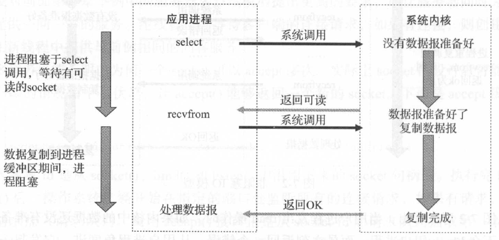

<!-- START doctoc generated TOC please keep comment here to allow auto update -->
<!-- DON'T EDIT THIS SECTION, INSTEAD RE-RUN doctoc TO UPDATE -->

- [并发模型总结](#%E5%B9%B6%E5%8F%91%E6%A8%A1%E5%9E%8B%E6%80%BB%E7%BB%93)
  - [一、四种网络IO模型](#%E4%B8%80%E5%9B%9B%E7%A7%8D%E7%BD%91%E7%BB%9Cio%E6%A8%A1%E5%9E%8B)
    - [1、阻塞IO模型](#1%E9%98%BB%E5%A1%9Eio%E6%A8%A1%E5%9E%8B)
    - [2、非阻塞IO模型](#2%E9%9D%9E%E9%98%BB%E5%A1%9Eio%E6%A8%A1%E5%9E%8B)
    - [3、多路IO复用模型](#3%E5%A4%9A%E8%B7%AFio%E5%A4%8D%E7%94%A8%E6%A8%A1%E5%9E%8B)
    - [4、异步IO模型](#4%E5%BC%82%E6%AD%A5io%E6%A8%A1%E5%9E%8B)
    - [5、四种IO模型对比](#5%E5%9B%9B%E7%A7%8Dio%E6%A8%A1%E5%9E%8B%E5%AF%B9%E6%AF%94)
  - [二、两种高效事件处理模式--Reactor和Proactor](#%E4%BA%8C%E4%B8%A4%E7%A7%8D%E9%AB%98%E6%95%88%E4%BA%8B%E4%BB%B6%E5%A4%84%E7%90%86%E6%A8%A1%E5%BC%8F--reactor%E5%92%8Cproactor)
  - [三、两种高效的并发模式](#%E4%B8%89%E4%B8%A4%E7%A7%8D%E9%AB%98%E6%95%88%E7%9A%84%E5%B9%B6%E5%8F%91%E6%A8%A1%E5%BC%8F)
  - [四、常见并发网络服务程序设计方案](#%E5%9B%9B%E5%B8%B8%E8%A7%81%E5%B9%B6%E5%8F%91%E7%BD%91%E7%BB%9C%E6%9C%8D%E5%8A%A1%E7%A8%8B%E5%BA%8F%E8%AE%BE%E8%AE%A1%E6%96%B9%E6%A1%88)

<!-- END doctoc generated TOC please keep comment here to allow auto update -->

## 并发模型总结

### 一、四种网络IO模型
#### 1、阻塞IO模型

阻塞和非阻塞的概念描述的是用户线程调用内核IO 操作的方式：阻塞是指IO 操作需要彻底完成后才返回到用户空间；而非阻塞是指IO 操作被调用后立即返回给用户一个状态值，不需要等到IO 操作彻底完成。

在Linux 中，默认情况下所有的socket 都是阻塞的，一个典型的读操作流程如下图所示：


#### 2、非阻塞IO模型

在Linux 下，可以通过设置socket 使IO 变为非阻塞状态。当对一个非阻塞的socket 执行read 操作时，流程如下图所示：


当用户进程发出read 操作时，如果内核中的数据还没有准备好，那么它并不会block 用户进程，而是立刻返回一个错误。从用户进程角度讲，它发起一个read操作后，并不需要等待，而是马上就得到了一个结果。当用户进程判断结果是一个错误时，它就知道数据还没有准备好，于是它可以再次发送read 操作。一旦内核中的数据准备好了，并且又再次收到了用户进程的系统调用，那么它马上就将数据复制到了用户内存中，然后返回正确的返回值。

所以，在非阻塞式IO 中，用户进程其实需要不断地主动询问kernel 数据是否准备好。非阻塞的接口相比于阻塞型接口的显著差异在于被调用之后立即返回。

可以使用：
```c
fcntl(fd, F_SETFL, O_NONBLOCK);
```
设置某个文件描述符为非阻塞。

当把套接字设置成非阻塞的IO，则对每次请求，内核都不会阻塞，会立即返回；当没有数据到的时候，会返回一个错误（EMOULDBLOCK），直到有数据到来。相当于有个循环，一直在测试文件描述符是否可读，这显然是一种极度浪费cpu资源的IO操作模式。

在linux进行非阻塞的socket接收数据时经常出现Resource temporarily unavailable(may be the same value as EWOULDBLOCK, POSIX.1)，errno代码为11(EAGAIN)，这表明在非阻塞模式下调用了阻塞操作，在该操作没有完成就返回这个错误，这个错误不会破坏socket的同步，不用管它，下次循环接着recv就可以。 对非阻塞socket而言，EAGAIN不是一种错误。

#### 3、多路IO复用模型

多路IO 复用，有时也称为事件驱动IO。它的基本原理就是有个函数（如select ）会不断地轮询所负责的所有socket，当某个socket 有数据到达了，就通知用户进程，多路IO 复用模型的流程如下图所示：



当用户进程调用了select ，那么整个进程会被阻塞，而同时，内核会“监视”所有select 负责的socket ，当任何一个socket 中的数据准备好了， select 就会返回。这个时候用户进程再调用read 操作，将数据从内核拷贝到用户进程。

下图描述了多路IO 复用模型中的一个执行周期：


这种模型的特征在于每一个执行周期都会探测一次或一组事件，一个特定的事件会触发某个特定的响应，这里可以将这种模型归类为“事件驱动模型” 。

#### 4、异步IO模型

异步IO 模型的流程如下图所示：


用户进程发起read 操作之后，立刻就可以开始去做其他的事；而另一方面，从内核的角度，当它收到一个异步的read 请求操作之后，首先会立刻返回，所以不会对用户进程产生任何阻塞。然后，内核会等待数据准备完成，然后将数据拷贝到用户内存中，当这一切都完成之后，内核会给用户进程发送一个信号，返回read 操作已完成的信息。

调用阻塞IO 会一直阻塞住对应的进程直到操作完成，而非阻塞IO 在内核还在准备数据的情况下会立刻返回。两者的区别就在于同步IO 进行IO 操作时会阻塞进程。按照这个定义，之前所述的阻塞IO 、非阻塞IO 及多路IO 复用都属于同步IO 。实际上，真实的IO操作，就是例子中的recvfrom 这个系统调用。非阻塞IO 在执行recvfrom 这个系统调用的时候，如果内核的数据没有准备好，这时候不会阻塞进程。但是当内核中数据准备好时，recvfrom 会将数据从内核拷贝到用户内存中，这个时候进程则被阻塞。而异步IO 则不一样，当进程发起IO 操作之后，就直接返回，直到内核发送一个信号，告诉进程IO 已完成，则在这整个过程中，进程完全没有被阻塞。

#### 5、四种IO模型对比


非阻塞IO 和异步IO 的区别还是很明显的。在非阻塞IO中，虽然进程大部分时间都不会被阻塞，但是它仍然要求进程去主动检查，并且当数据准备完成以后，也需要进程主动地再次调用r ecvfrom 来将数据拷贝到用户内存中。而异步IO 则完全不同，它就像是用户进程将整个IO 操作交给了他人（内核）完成，然后内核做完后发信号通知。在此期间，用户进程不需要去检查IO 操作的状态，也不需要主动地拷贝数据。

### 二、两种高效事件处理模式--Reactor和Proactor

见《Linux高性能服务器编程》第127页

### 三、两种高效的并发模式

见《Linux高性能服务器编程》第130页

### 四、常见并发网络服务程序设计方案

该部分参考陈硕的《Linux多线程服务端编程--使用muduo C++网络库》第160页。


