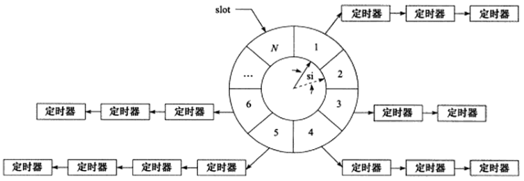

<!-- START doctoc generated TOC please keep comment here to allow auto update -->
<!-- DON'T EDIT THIS SECTION, INSTEAD RE-RUN doctoc TO UPDATE -->

- [定时事件](#%E5%AE%9A%E6%97%B6%E4%BA%8B%E4%BB%B6)
  - [一、处理超时读写](#%E4%B8%80%E5%A4%84%E7%90%86%E8%B6%85%E6%97%B6%E8%AF%BB%E5%86%99)
  - [二、时间轮原理](#%E4%BA%8C%E6%97%B6%E9%97%B4%E8%BD%AE%E5%8E%9F%E7%90%86)
  - [三、最小堆实现定时器](#%E4%B8%89%E6%9C%80%E5%B0%8F%E5%A0%86%E5%AE%9E%E7%8E%B0%E5%AE%9A%E6%97%B6%E5%99%A8)

<!-- END doctoc generated TOC please keep comment here to allow auto update -->

## 定时事件

**该部分详细内容可参考《Linux高性能服务器编程》**

### 一、处理超时读写

可通过设置socket选项SO_RCVTIMEO和SO_SNDTIMEO来控制某个套接字上读写事件的超时处理：

```cpp
    struct timeval timeout;
    timeout.tv_sec = 3;
    timeout.tv_usec = 0;
    socklen_t len = sizeof( timeout );
    ret = setsockopt( sockfd, SOL_SOCKET, SO_SNDTIMEO, &timeout, len );
    assert( ret != -1 );

    ret = connect( sockfd, ( struct sockaddr* )&address, sizeof( address ) );
    if ( ret == -1 )
    {
        if( errno == EINPROGRESS )// 超时事件处理
        {
            printf( "connecting timeout\n" );
            return -1;
        }
        printf( "error occur when connecting to server\n" );
        return -1;
    }
```

### 二、时间轮原理

一个简单的时间轮如下图所示：



一个时间轮可以是一个首尾相连的链表，时间轮上的每一个格子代表某一时刻需要处理的定时器集合，每个格子都指向一条由定时器组成的链表。

时间轮中的si指针每过一个单位时间会移向下一个槽位，当当该槽位中有定时器时，则依次遍历该槽位中的定时器链表，处理定时器任务。

如果需要添加一个定时任务，那么可以以当前si指针位置为基础，加上定时任务时间作为偏移加入定时器。举个例子，上图中的si指针实线指向1这个定时器槽位，如果我想让一个任务在2s后执行，那么该任务则需要放入3这个槽位，等si指针经过2s之后指向3槽位，定时任务便会执行。

### 三、最小堆实现定时器

一个最小堆的示意如下：


每个定时器都有一个超时时间，该超时时间为一个时间戳，时间戳越小意味着该定时器执行会更早。通过这种方法，让定时器都插入到一个最小堆中，堆顶元素永远是最近要执行的定时器任务。于是可以采用timerfd（muduo方案）的方式，将该定时器超时时间与timerfd绑定，timerfd也通过select/poll/epoll函数监听，等定时事件发生时，从堆顶取出超时定时器并执行任务。执行完任务之后，堆顶元素更新，timerfd的超时时间也更新为新的堆顶超时时间。

