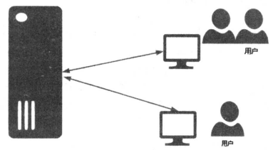
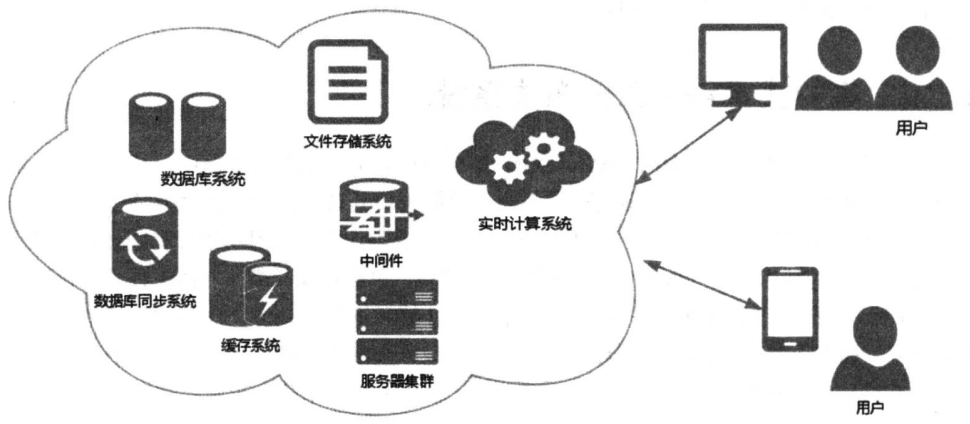
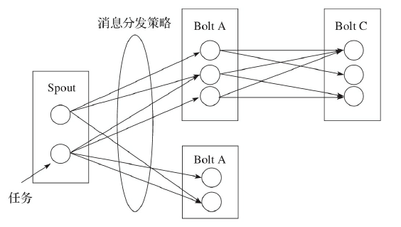
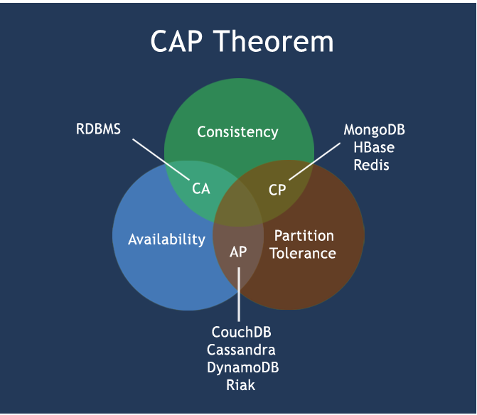

<!-- START doctoc generated TOC please keep comment here to allow auto update -->
<!-- DON'T EDIT THIS SECTION, INSTEAD RE-RUN doctoc TO UPDATE -->

- [分布式介绍](#%E5%88%86%E5%B8%83%E5%BC%8F%E4%BB%8B%E7%BB%8D)
  - [一、分布式概念](#%E4%B8%80%E5%88%86%E5%B8%83%E5%BC%8F%E6%A6%82%E5%BF%B5)
  - [二、集中式系统与分布式系统](#%E4%BA%8C%E9%9B%86%E4%B8%AD%E5%BC%8F%E7%B3%BB%E7%BB%9F%E4%B8%8E%E5%88%86%E5%B8%83%E5%BC%8F%E7%B3%BB%E7%BB%9F)
  - [三、分布式计算及其原理](#%E4%B8%89%E5%88%86%E5%B8%83%E5%BC%8F%E8%AE%A1%E7%AE%97%E5%8F%8A%E5%85%B6%E5%8E%9F%E7%90%86)
  - [四、分布式系统特性](#%E5%9B%9B%E5%88%86%E5%B8%83%E5%BC%8F%E7%B3%BB%E7%BB%9F%E7%89%B9%E6%80%A7)
    - [1、容错性](#1%E5%AE%B9%E9%94%99%E6%80%A7)
    - [2、高可扩展性](#2%E9%AB%98%E5%8F%AF%E6%89%A9%E5%B1%95%E6%80%A7)
    - [3、开放性](#3%E5%BC%80%E6%94%BE%E6%80%A7)
    - [4、并发处理能力](#4%E5%B9%B6%E5%8F%91%E5%A4%84%E7%90%86%E8%83%BD%E5%8A%9B)
    - [5、透明性](#5%E9%80%8F%E6%98%8E%E6%80%A7)
  - [五、CAP 理论](#%E4%BA%94cap-%E7%90%86%E8%AE%BA)
    - [1、什么是CAP 理论](#1%E4%BB%80%E4%B9%88%E6%98%AFcap-%E7%90%86%E8%AE%BA)
    - [2、CAP 常见模型](#2cap-%E5%B8%B8%E8%A7%81%E6%A8%A1%E5%9E%8B)
    - [3、CAP 意义](#3cap-%E6%84%8F%E4%B9%89)
    - [4、CAP 最新发展](#4cap-%E6%9C%80%E6%96%B0%E5%8F%91%E5%B1%95)
    - [5、BASE](#5base)
  - [六、分布式和集群的区别](#%E5%85%AD%E5%88%86%E5%B8%83%E5%BC%8F%E5%92%8C%E9%9B%86%E7%BE%A4%E7%9A%84%E5%8C%BA%E5%88%AB)

<!-- END doctoc generated TOC please keep comment here to allow auto update -->

## 分布式介绍
本文参考《分布式系统常用技术及案例分析》和《分布式实时处理系统 原理、架构和实现》

《分布式系统原理与范型》一书中是这样定义分布式系统的：“分布式系统是若干独立计算机的集合，这些计算机对于用户来说就像单个相关系统”。

这里面包含了2个含义:
* 硬件独立
* 软件统一

什么是硬件独立？所谓硬件独立，是指计算机机器本身是独立的。一个大型的分布式系统，会由若干台计算机来组成系统的基础设施。而软件统一，是指对于用户来说，用户就像是跟单个系统打交道。就好比我们每天上网看视频，视频网站对我们来说就是一个系统软件，它们背后是如何运作的，部署了几台服务器，每台服务器是干什么的，这些对用户来说是透不可见的。用户不关心背后的这些服务器，用户所关心的是今天访问的这个网站能提供什么样的节目，视频运行是否流畅，卡不卡帧、清晰度如何等。

而软件统一的另外一个方面是指，分布式系统的扩展和升级都比较容易。分布式系统中的某些节点发生故障也不会影响整体系统的可用性。用户和应用程序交互时不会察觉哪些部分正在替换或者维修，也不会感知到新加入的部分。

### 一、分布式概念

由计算机组成的网络无处不在，现如今我们的日常生活已经被各种不同类型的网络包围，如电话网络、企业网络、家庭网络以及各种类型的局域网，共同构成了我们称之为Internet的网络。因此，我们可以断言Internet是由各种不同类型、不同地区、不同领域的网络构成的互联网。我们可以发现，互联网并没有集中式的控制中心，而是由大量分离且互联
的节点组成的。这正是一个分散式的模型。我们可以把这个概念类比到即将讲解的分布式概念上。

分布式概念是在网络这个大前提下诞生的。传统的计算是集中式的计算，使用计算能力强大的服务器处理大量的计算任务，但这种超级计算机的建造和维护成本极高，且明显存在很大的瓶颈。与之相对，如果一套系统可以将需要海量计算能力才能处理的问题拆分成许多小块，然后将这些小块分配给同一套系统中不同的计算节点进行处理，最后如有必要将分开计算的结果合并得到最终结果，那么就将这种系统称为分布式系统。对于这种系统来说，我们会采用多种方式在不同节点之间进行数据通信和协调，而网络消息则是常用手段之一。

通过以上描述，我们基本可以认为，一套分布式系统会使用网络上的硬件资源和软件组件进行计算，而各个计算节点间通过一定方式进行通信。这是从计算机科学的角度简单概述了分布式系统的概念。

如果我们从网络这个关键因素考虑，我们可以将计算分摊到网络中不同的计算节点，充分利用网络中的计算资源，而这些节点可能存在于不同的区域中，在空间上存在一定距离。虽说这种解释不那么正式，但也从另一个角度上生动地阐述了分布式的基本特性，即节点分布。

### 二、集中式系统与分布式系统

集中式系统主要部署在 HP、IBM、SUN 等小型机以上档次的服务器中，把所有的功能都集成到主服务器上，这样对服务器的要求很高，性能也极其苛刻。它们的主要特色在于年宕机时间只有几小时，所以又统称为z系列(zero，零）。AS400主要应用在银行和制造业，还用于Domino，主要的技术在于 TIMI（技术独立机器界面)、单级存储，有了TIMI 技术可以做到硬件与软件相互独立。RS6000比较常见，用于科学计算和事务处理等。这类主机的单机性能一般都很强，带多个终端。终端没有数据处理能力，运算全部在主机上进行。现在的银行系统大部分都是这种集中式的系统，此外，在大型企业、科研单位、军队、政府等也有应用。集中式系统主要流行于20世纪。现在还在使用集中式系统的，很大一部分原因是为了沿用原来的软件，而这些软件往往很昂贵。优点是便于维护，操作简单。但这样的系统也有缺陷，就是不出问题还好，一出问题，就会造成单点故障，所有功能就都不能正常工作了。由于集中式的系统相关的技术只被少数厂商所掌握，个人要对这些系统进行扩展和升级往往也比较麻烦，一般的企业级应用很少会用到集中式系统。下面是一个典型的集中式系统的示意图：

而分布式系统恰恰相反。分布式系统是通过中间软件来对现有计算机的硬件能力和相应的软件功能进行重新配置和整合。它是一种多处理器的计算机系统，各处理器通过互连网络构成统一的系统。系统采用分布式计算结构，即把原来系统内中央处理器处理的任务分散给相应的处理器，实现不同功能的各个处理器相互协调，共享系统的外设与软件。这样就加快了系统的处理速度，简化了主机的逻辑结构。它甚至不需要很高的配置，一些低配置“退休”下来的机器也能被重新纳入分布式系统中使用，这样无疑就降低了成本，而且还易于维护。同时，分布式系统往往由多个主机组成，任何一台主机宕机都不影响整体系统的使用，所以分布式系统的可用性往往比较高。下面是一个典型的分布式系统的示意：

正是由于分布式系统的这些优点，使得分布式系统的应用越来越广泛，也代表了未来应用的发展趋势。

### 三、分布式计算及其原理

前文提到分布式计算就是将计算任务分摊到大量的计算节点上，一起完成海量的计算任务。

而分布式计算的原理和并行计算类似，就是将一个复杂庞大的计算任务适当划分为一个一个小任务，并让任务并行执行，只不过分布式计算会将这些任务分配到不同的计算节点上，每个计算节点只需要完成自己的计算任务即可，可以有效分担海量的计算任务。而每个计算节点也可以并行处理自身的任务，更加充分利用机器的CPU资源。最后我们想方设法将每个节点计算结果汇总，得到最后的计算结果。

很多时候，划分计算任务以支持分布式计算看起来较为困难，但人们逐渐发现确实也是可行的。而且随着计算任务量增加与计算节点增加，这种划分体现出来的价值会越来越大。分布式计算一般分为以下几步：

1）设计分布式计算模型：首先我们要规定分布式系统的计算模型。计算模型决定了系统中各个组件应该如何运行，组件之间应该如何进行消息通信，组件和节点应该如何管理等。

2）分布式任务分配：分布式算法不同于普通算法。普通算法通常是按部就班，一步接着一步完成任务。而分布式计算中计算任务是分摊到各个节点上的。该算法着重解决的是能否分配任务，或如何分配任务的问题。

3）编写并执行分布式程序：使用特定的分布式计算框架与计算模型，将分布式算法转化为实现，并尽量保证整个集群的高效运行。其中有一些难点。

* ①计算任务的划分

    分布式计算的特点就是多个节点同时运算，因此如何将复杂算法优化分解成适用于每个节点计算的小任务，并回收节点的计算结果就成了问题。尤其是并行计算的最大特点是希望节点之间的计算互不相干，这样可以保证各节点以最快速度完成计算，一旦出现节点之间的等待，往
    往就会拖慢整个系统的速度。

* ②多节点之间的通信方式

    另一个难点是节点之间如何高效通信。虽然在划分计算任务时，计算任务最好确保互不相干，这样每个节点可以各自为政。但大多数时候节点之间还是需要互相通信，比如获取对方的计算结果等。一般有两种解决方案：一种是利用消息队列，将节点之间的依赖变成节点之间的消息传递；第二种是利用分布式存储系统，我们可以将节点的执行结果暂时存放在数据库中，其他节点等待或从数据库中获取数据。无论哪种方式只要符合实际需求都是可行的。

### 四、分布式系统特性

G.Coulouris（《Distributed Systems-Concepts and Design》的作者，曾是剑桥大学的高级研究员）曾经对分布式系统下了一个简单的定义：你会知道系统当中的某台电脑崩溃或停止运行了，但是你的软件却永远不会。这句话虽然简单，但是却道出了分布式系统的关键特性。分布式系统的特性包括容错性、高可扩展性、开放性、并发处理能力和透明性。

#### 1、容错性

我们可能永远也制造不出永不出现故障的机器。类似的，我们更加难以制造出永不出错的软件，毕竟软件的运行还在一定程度上依赖于硬件的可靠性。那么在互联网上有那么多的应用程序和服务，它们都有可能出现故障，但在很多时候，我们几乎都不能发现这些服务中断的情况，这时分布式系统的特点之一容错性就凸显出来了。在大规模分布式系统中，检测和避免所有可能发生的故障（包括硬件故障、软件故障或不可抗力，如停电）往往是不太现实的。因此，我们在设计分布式系统的过程中，就会把容错性作为开发系统的首要目标之一。这样一来，一旦在分布式系统中某个节点发生故障，利用容错机制来避免整套系统服务不可用。

那么问题来了，在考虑容错性的同时，我们是否也需要具备检测、恢复和避免故障的能力呢？没错，在设计与开发分布式系统的过程中，这些问题都需要我们进行认真的思考。对于检测故障来说，最直接的方法是校验消息或数据是否有效，但是这种方法能够覆盖的故障面很窄。而有些问题，如服务器应用程序崩溃，通过普通方法很难检测，这时我们可能就需要一套复杂完整的流程来检测服务器是否真的宕机以及服务器的节点信息，这当中涉及很多因素，如网络延迟、消息乱序等，最后，采用合适的方法通知运维人员。

故障恢复对于分布式系统设计与开发来说极其重要。当服务器崩溃后，我们需要通过一种方法来回滚永久数据的状态，确保尚未处理完成的数据不被传递到下一个状态继续处理，并解决多个节点数据可能存在的不一致性问题，这往往涉及事务性。

常见的避免故障的方法包括消息重发、冗余等。考虑到分布式系统的特性，很多计算任务被分布在不同的节点之间进行，那么其中一个难以避免的问题就是消息丢失，消息丢失的情况屡见不鲜，这几乎成为了设计分布式系统必须解决的问题，我们通常的做法是在一定超时范围内，消息不可达时对消息进行重传，在重新尝试多次后如果消息仍然不可达，才认为节点出现问题。数据冗余存储可以在一定程度上降低数据出错的概率。例如，同一份数据，我们将其存储为A和B两份，那么当单点故障发生时，A存储的数据部分丢失或全部丢失，而B存储的数据完好无损，这时候，我们就可以利用B存储的数据对数据进行恢复，避免单点故障导致的数据丢失。当然，这里我们只考虑到数据，如果把分布式系统中其他组件也考虑进来，我们就能看到更多冗余应用的案例，例如，访问某一特定节点的路由器应当还有一份冗余备份，确保当一个路由器发生故障时，消息仍然可以通过备份的路由器送达。数据库中的数据也可以利用类似的思想存储多份冗余数据，以便在某个节点数据丢失的情况下恢复数据。在消息通信的过程中，将相同的消息派发给两个以上的节点存储或处理，以避免某个节点单点故障导致消息丢失等。

冗余是设计分布式系统时必须考虑的特性之一，也是系统对外提供服务的质量的重要保证，提高用户体验，尽可能减少服务不可用时间是非常重要的。

#### 2、高可扩展性

高可扩展性是指系统能够在运行过程中自由地对系统内部节点或现有功能进行扩充，而不影响现有服务的运行。传统的软件系统或单机软件在更新过程中，往往会先停机，然后升级，当一切更新配置都结束后，最后重新启动应用程序。另外，很多传统的系统是“闭环系统”(这里的闭环系统指的是那些完全通过内部通信，而不需要和外部通过协议进行数据交换的系统)，其扩展能力非常有限，它们绝大多数使用私有协议进行消息通信，缺乏开放的API也是导致系统扩展能力低下的主要原因之一。因此，在对现有系统进行扩展的过程中，由于私有接口的局限性和不完善性，扩展工作变得异常复杂，有时甚至需要对接口进行更新和定义，才能满足需求，而与其他系统进行集成则变得更加困难：没有开放接口，需要中间层做转换。这些原因都导致了系统在扩展性方面存在难度大和成本高的问题。

我们来看一个现代分布式系统设计的案例：Storm实时处理系统（以下简称Storm）。在Storm中，节点主要由Spout和Bolt两大类组成，我们可以把这种关系类比到MapReduce过程，Spout作为消息源会将搜集到的数据发送到Storm计算拓扑中，再通过一系列消息处理单元Bolt进行分布式处理，最终将处理结果合并得到最终结果。在这里，消息处理单元Bolt是分布式数据处理的核心组件，每当消息处理单元的数据处理完成后，它就会把当前阶段处理的数据发送给下一级消息处理单元做进一步处理。那么，这些消息处理单元之间的元组数据则主要通过开源JSON格式进行传递。利用这种机制，我们看到了一个很好的现象，那就是我们可以随意在消息处理单元后进行扩充，如果数据处理的结果还达不到我们的需求，只需在Storm计算拓扑中继续追加新的消息处理单元，直至满足我们的需求。Storm使用JSON作为节点之间元组数据发送的纽带，一方面解决了私有接口难以扩展和集成的问题，另一方面解决了Storm拓扑结构的后续节点扩充问题。下图所示为基本的Storm实时处理系统拓扑结构图，其中每个方框都是一个节点。

因此，在设计和开发我们自己的实时处理系统的过程中，高可扩展性是必须考虑的问题之一，

#### 3、开放性

分布式系统的开放性决定了一个系统是否具备自我扩展和与其他系统集成的能力。我们可以通过对外提供开放应用程序编程接口（Open API）的方式来提高分布式系统的开放性，提供哪些接口以及如何提供决定了我们开发的系统的开放程度，以及与现有系统和其他系统集成、扩展的能力。有很多开源产品在这一方面做得非常好，一方面是因为开源的特性导致系统的开放程度很高，另一方面是因为现代软件开发过程都十分重视开放应用编程接口，以求与更多系统进行集成。当然，只有开放应用编程接口还不够，如果我们提供的接口能够遵循某种协议，那么势必会进一步增加系统的开放性，为未来发展带来更多可能。

#### 4、并发处理能力

可能读者已经想到了，分布式系统引发的一个问题就是并发导致的一致性该如何处理？我们举个例子这个问题就比较清楚了。在分布式系统中，我们假设有两个节点A和B同时操作一条数据仓库的记录，那么数据仓库中的最终结果是由节点A操作产生的，还是由节点B操作产生的呢？这样看来，并发请求处理对对象的操作可能相互冲突，产生不一致的结果。我们设计的分布式系统必须确保对象的操作在并发环境中能够安全使用。因此，对象的并发或同步操作必须确保数据的一致性。

除了一致性之外，我们还希望可以一直对系统进行读写，这就是所谓的可用性。而为了一致性，读取或写入操作可能需要等待，常常需要缓冲等处理方式，这又是一件非常讨厌的事情，因为它牺牲了可用性。

数据库系统还有另一个性质——分区容错性，许多人都阐述过，这是数据库系统必须保证的特性，而在此情况下，从传统上来讲，一致性和可用性我们只能二选其一。分布式存储具有以下特性（CAP）。

1）Consistency（一致性）：同一个数据在集群中的所有节点，同一时刻
是否都是同样的值。

2）Availability（可用性）：集群中一部分节点故障后，集群整体是否还
能处理客户端的更新请求。

3）Partition Tolerance（分区容错性）：是否允许数据的分区，分区是指
是否允许集群中的节点之间无法通信。

在理论计算机科学中，CAP定理（CAP Theorem）又被称作布鲁尔定理（Brewer’s Theorem），它指出对于一个分布式计算系统来说，不可能同时满足CAP 3个条件。

而由于当前的网络硬件肯定会出现延迟丢包等问题，所以分区容忍性是我们必须要实现的。所以我们只能在一致性和可用性之间进行权衡，没有NoSQL系统能同时满足这三点。有关CAP理论的更多具体解释可以参阅：https://en.wikipedia.org/wiki/CAP_theorem。

在一个分布式系统中，CAP定理会使得整个系统变得非常复杂，而且会严重影响整个系统的并发性能。如何在尽量满足CAP定理的前提下提升系统的并发计算与存储能力，值得我们思考。有关CAP的详细讨论，我们会在本文后续章节呈现。

#### 5、透明性

在分布式系统内部，可能有成千上万个节点在同时工作，对用户的一个请求进行处理，最终得出结果。虽说如此，但我们设计的系统内部细节应该对用户保持一定程度的透明，我们可以为用户提供资源定位符（URL）来访问分布式系统服务，但用户对分布式系统内部的组件是无从了解的。我们应该把分布式系统当做一个整体来看待，而不是多个微型服务节点构成的集合。

### 五、CAP 理论

在单机的数据库系统中，我们很容易就可以实现一套满足ACID特性的事务处理系统，事务的一致性不存在问题。但是在分布式系统中，由于数据分布在不同的主机节点上，如何对这些数据进行分布式的事务处理具有非常大的挑战。CAP理论的出现，让我们对于分布式事务的一致性有了另外一种看法。

#### 1、什么是CAP 理论

在计算机科学理论，CAP理论（也称为 Brewer 定理）是由计算机科学家 Eric Brewer 在2000年提出的，其理论观点是，在分布式计算机系统中不可能同时提供以下全部三个保证：

* 一致性（Consistency):所有节点同一时间看到的是相同的数据。
* 可用性（Availability):不管是否成功，确保每一个请求都能接收到响应。
* 分区容错性（Partition tolerance):系统任意分区后，在网络故障时，仍能操作。

CAP定理如下图所示：

在2003年的时候，Gilbert和Lynch 就正式证明了这三个特征确实是不可以兼得的。Gilbert认为这里所说的一致性（Consistency)其实就是数据库系统中提到的ACID的另一种表述:一个用户请求要么成功、要么失败，不能处于中间状态（Atomic);一旦一个事务完成，将来的所有事务都必须基于这个完成后的状态（Consistent);未完成的事务不会互相影响（Isolated);一旦一个事务完成，就是持久的（Durable）。对于可用性（Availability），其概念没有变化，指的是对于一个系统而言，所有的请求都应该"成功"并且收到"返回"。分区容错性（Partition tolerance）指就是分布式系统的容错性。节点 crash 或者网络分片都不应该导致一个分布式系统停止服务。

CAP只能三选二，无法全部满足。

#### 2、CAP 常见模型

既然CAP理论已经证明了一致性、可用性、分区容错性三者不可能同时达成。那么在实际应用中，可以在其中的某一些方面来放松条件，从而达到妥协。下面是常见的三种模型。

* 1.牺牲分区（CA 模型）

   牺牲分区容错性意味着把所有的机器搬到一台机器内部，或者放到一个"要死大家一起死"的机架上（当然机架也可能出现部分失效)，这明显违背了我们希望的可伸缩性。
    
   CA 模型常见的例子：
    * 单站点数据库
    * 集群数据库
    * LDAP
    * xFS 文件系统

   实现方式:
    * 两阶段提交
    * 缓存验证协议

* 2.牺牲可用性（CP模型）

  牺牲可用性意味着一旦系统中出现分区这样的错误，系统直接就停止服务。

  CP模型常见的例子：
    * 分布式数据库
    * 分布式锁定
    * 绝大部分协议

  实现方式：
    * 悲观锁
    * 少数分区不可用

* 3.牺牲一致性（AP 模型）

   AP模型常见的例子：
    * Coda
    * Web 缓存
    * DNS

   实现方式：
    * 到期/租赁
    * 解决冲突
    * 乐观锁

#### 3、CAP 意义

在系统架构时，应该根据具体的业务场景来权衡CAP。比如，对于大多数互联网应用来说（如门户网站)，因为机器数量庞大，部署节点分散，网络故障是常态的，可用性是必须要保证的，所以只有舍弃一致性来保证服务的AP。而对于银行等需要确保一致性的场景，通常会权衡CA和CP模型，CA模型网络故障时完全不可用，CP模型具备部分可用性。

#### 4、CAP 最新发展

Eric Brewer在2012年发表文章（htps://www.infoq com/articlescap-twelve-years-later-how-the-rules- have-changed），指出了CAP里面"三选二"的做法存在一定的误导性，其主要体现在:

* 由于分区很少发生，那么在系统不存在分区的情况下没什么理由牺牲C或A

* C 与A 之间的取舍可以在同一系统内以非常细小的粒度反复发生，而每一次的决策可能因为具体的操作，乃至因为牵涉特定的数据或用户而有所不同

* 这三种性质都可以在一定程度上衡量，并不是非黑即白的有或无。可用性显然是在0%到100%之间连续变化的，一致性分很多级别，连分区也可以细分为不同含义，如系统内的不同部分对于是否存在分区可以有不一样的认知

理解CAP理论最简单的方式是想象两个节点分处分区两侧。允许至少一个节点更新状态会导致数据不一致，即丧失了C 性质。如果为了保证数据一致性，将分区一侧的节点设置为不可用，那么又丧失了A 性质。除非两个节点可以互相通信，才能既保证C 又保证 A，但这又会导致丧失P性质。一般来说跨区域的系统，设计师无法舍弃P性质，那么就只能在数据一致性和可用性上做一个艰难选择。不确切地说，NoSQL运动的主题其实是创造各种可用性优先、数据一致性其次的方案;而传统数据库坚守ACID特性，做的是相反的事情。

#### 5、BASE

BASE(Basically Available、Soft state、Eventual consistency）来自于互联网的电子商务领域的实践，它是基于CAP理论逐步演化而来的，核心思想是即便不能达到强一致性（Strong consistency），但可以根据应用特点采用适当的方式来达到最终一致性（Eventual consistency）的效果。BASE 是对CAP中C和A的延伸。BASE的含义如下所示：

* Basically Available：基本可用
* Soft state：软状态/柔性事务，即状态可以有一段时间的不同步
* Eventual consistency：最终一致性

BASE是反 ACID的，它的思想是通过让系统放松对某一时刻数据一致性的要求来换取系统整体伸缩性和性能上改观。为什么这么说呢，缘由就在于大型系统往往由于地域分布和极高性能的要求，不可能采用分布式事务来完成这些指标，要想获得这些指标，我们必须采用另外一种方式来完成，这里BASE就是解决这个问题的办法。

### 六、分布式和集群的区别

简单来讲：

* 分布式：不同的多台服务器上面部署不同的服务模块（工程），他们之间通过RPC/RMI之间通信和调用，对外提供服务和组内协作。

* 集群：不同的多台服务器上面部署相同的服务模块，通过分布式调度软件进行统一的调度，对外提供服务和访问。