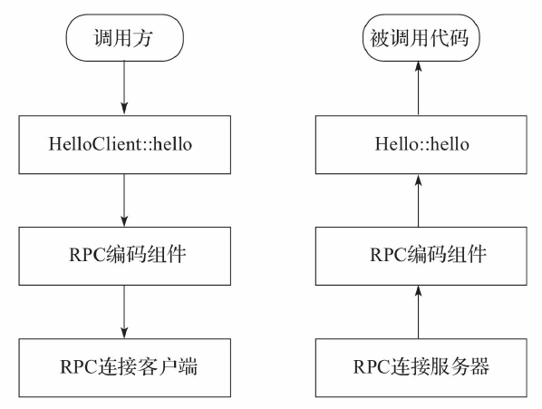
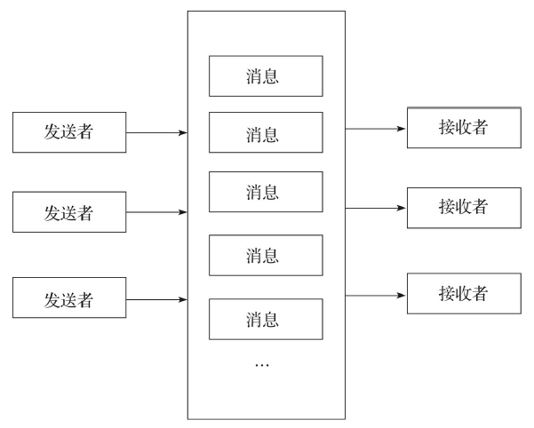

<!-- START doctoc generated TOC please keep comment here to allow auto update -->
<!-- DON'T EDIT THIS SECTION, INSTEAD RE-RUN doctoc TO UPDATE -->

- [分布式通信系统高层抽象](#%E5%88%86%E5%B8%83%E5%BC%8F%E9%80%9A%E4%BF%A1%E7%B3%BB%E7%BB%9F%E9%AB%98%E5%B1%82%E6%8A%BD%E8%B1%A1)
  - [一、RPC](#%E4%B8%80rpc)
  - [二、RESTful](#%E4%BA%8Crestful)
    - [1、资源和表现层](#1%E8%B5%84%E6%BA%90%E5%92%8C%E8%A1%A8%E7%8E%B0%E5%B1%82)
    - [2、状态转移](#2%E7%8A%B6%E6%80%81%E8%BD%AC%E7%A7%BB)
    - [3、RESTful总结](#3restful%E6%80%BB%E7%BB%93)
  - [三、消息队列](#%E4%B8%89%E6%B6%88%E6%81%AF%E9%98%9F%E5%88%97)
  - [四、序列化](#%E5%9B%9B%E5%BA%8F%E5%88%97%E5%8C%96)

<!-- END doctoc generated TOC please keep comment here to allow auto update -->

## 分布式通信系统高层抽象

本文内容摘自 《分布式实时处理系统 原理、架构和实现》

### 一、RPC 

在开发纯粹的本地应用程序时，我们会将庞大的系统划分为子系统，然后再将子系统划分为更小的模块，接着再对模块不断细分，而系统中最细粒度的抽象单位就是“函数”（Function），或者是“过程”（Procedure）。函数和过程同时也是模块之间的“通信接口”，如果A模块想要调用B模块的服务，一般直接调用B模块对外公开的函数或过程接口。对于一个程序员来讲，这种过程调用是非常直观，易于理解与维护的。

但是在分布式系统中，不同的子系统可能分布在不同的服务器上，也就是说如果子系统A想要调用子系统B的服务，无法通过过程调用来实现，而是需要利用网络通信，由子系统A服务器向子系统B服务器发送特定的网络请求，由子系统B接受请求并指向相应服务，最后再次通过网络将执行结果返回给A服务器。

当模块之间的调用变成大量的网络请求之后，整个代码的可读性和可维护性势必会受到不利影响。为了模拟对程序员来说最简单直观的过程调用，RPC（Remote Procedure Call），即远程过程调用应运而生。

所谓远程过程调用就是开发者在不需要了解底层网络技术的情况下（无论是基础协议还是Socket），可以像调用本地方法一样调用远程服务器提供的函数或过程。假设我们在服务器B上编写一个名为Hello的类，代码如下所示：
```c
// Hello类的定义
class Hello : public RPCModule
{
    public:
    void hello();
};

// HelloClient的实现
int test()
{
    Hello::Client helloClient(host, port);
    helloClient.hello();
}
```

可以发现，在使用RPC技术后，我们并不需要关心如何和服务器通信，如何构建协议，如何解析数据，而只需要指定目标服务器（通过主机地址和端口号），并直接像调用本地成员函数一样调用远程服务器的成员函数。在本例中，直接在服务器A中构造了Hello类的一个“客户端”，并直接通过该客户端调用服务器B中Hello类的hello成员函数。

RPC的基本思想其实非常简单，我们可以用下图来描述整个RPC的架构：



架构中的各个组件如下：

1）调用方：调用远程过程的代码，如代码中的test成员函数。

2）客户端成员函数（HelloClient：：hello）：RPC对过程的封装。调用方调用hello时并不是直接执行hello的代码，因为hello的实际代码在服务器B中，客户端成员函数的任务是解析客户端需要调用的成员函数，并解析参数，将需要调用的成员函数和参数传入下一层。

3）RPC编码组件：众所周知，数据如果想要在服务器之间通信，需要进行编码和解码（当然也可以直接传送原始二进制数据，如果是简单的数据，这样是没问题的）。所以客户端会使用编码组件对函数的参数进行编码，并将需要调用的成员函数与编码后的参数传入下一层。

4）RPC连接客户端：该层负责使用Socket维护底层连接，将生成的函数调用请求转化成对应的网络请求，通过Socket连接将数据发送到服务器B。客户端需要知道服务器端RPC服务的主机号和端口号。这应该是唯一对用户不透明的部分。

5）RPC连接服务器：该层负责使用Socket维护底层连接，接受客户端请求，并将获取到的数据转换成函数调用请求（包括需要调用的函数与编码后的参数），并发到上一层。

6）RPC解码组件：既然客户端需要编码，那么服务器就需要解码。服务器这里需要将编码后的参数解码还原成本地语言可以理解并正确处理的数据，例如，这里就是将数据转换成C++的二进制数据。这就是解码层的作用。接着解码组件就将请求传入上一层。

7）服务器成员函数（Hello：：hello）：RPC服务器启动时，所有成员函数都会将自己的信息注册到服务器中，服务器就可以通过客户端想要调用的成员函数名找到服务器上对应的成员函数，这里就是调用服务器端的成员函数，并将解码后的参数传递给该成员函数。

8）被调用代码：即Hello类中的hello成员函数，也就是真正执行的代码。

这里我们可以清晰地看出，RPC的架构其实就是分层和封装，将底层的网络通信通过客户端的成员函数隐藏起来，让底层通信对用户透明（除了对方服务器的地址和端口号）。同时这也印证了分层在网络通信系统设计中的重要性。

同时，这里我们调用的是无返回值的函数，如果函数包含返回值，则服务器需要将返回发送回客户端，那么服务器端就需要编码工作，而客户端则需要解码工作。此外，这里的RPC调用是同步调用，也就是客户端必须等到服务器执行任务返回后才能继续执行。实际情况中，我们常常会使用异步调用——客户端执行之后继续执行其他代码，通过回调函数对服务器的响应进行处理。这两种方式各有利弊，需要根据实际情况取舍。

### 二、RESTful

REST（Representational State Transfer）指的是一种架构设计风格，而满足这种设计风格的应用程序或设计就被认为是RESTful的。这也是目前互联网中最流行的一种软件架构风格，它结构清晰、符合标准、易于理解，越来越多的应用服务开始使用RESTful这种架构风格，尤其是那些基于HTTP协议的网络服务。

REST是2000年由Roy Thomas Fielding在他的博士论文中提出的。Fielding是HTTP协议的主要设计者、Apache服务器软件作者之一，因此他的论文对互联网软件开发产生了深远影响。

他认为他的目的是“在符合架构原理的前提下，理解和评估以网络为基础的应用软件的架构设计，得到一个功能强、性能好、适宜通信的架构”。最后他提出了RESTful架构。

Fielding在论文中规定了一系列的互联网软件架构原则，将其命名为REST，翻译成中文是“表现层状态转移”。这些原则统称为REST原则，而符合这些原则的架构就是RESTful架构。注意，这里并没有强调具体的实现技术，也就是说实现RESTful不一定要使用HTTP协议，只不过HTTP协议确实是目前实现RESTful服务的常用技术方案。接下来我们来解释一下到底什么叫“表现层状态转移”。

#### 1、资源和表现层

首先解释一下资源（Resource）的概念。资源是REST中的核心概念，所谓资源指的是网络上的某一个实体（Entity）。资源可以是文本、图片、视频、音频，这类资源比较具体，容易呈现，容易理解；也可以是一种特定服务，这种资源比较抽象。我们可以和面向对象类比，在面向对象中，一切皆对象，而在REST中，一切都是资源。

每一个资源都有一个唯一标识，就是所谓URI（Uniform Resource Identifier，统一资源标识符），顾名思义就是资源的标识符，保证在整个网络中每个资源都有唯一的URI。如果我们想要访问某个资源，只需要访问相应的URI即可。例如，在浏览器中访问http://test.com/content/1.txt，就是在访问这个URI对应的资源，也就是1.txt这个文本文件。那么，所有对网络的访问都可以抽象成对资源的“访问”，也就是说调用资源对应的URI。

而与资源相对，还有一个概念就是表现层（Representation）。顾名思义，表现层就是资源的一种表现方式。例如，同样一段文字，可以使用纯文本（txt）展示，也可以使用HTML、XML和JSON来表示，无论什么表现形式，最后表示的都是相同的内容。同样，相同的一张图片，可以是BMP格式，也可以是JPG格式，还可以是PNG格式，等等。

既然URI代表的是资源，而非资源的表现层，因此从严格意义上来讲，URI里其实不需要包含资源的格式信息，如果使用HTTP协议，那么这些格式信息应该写在HTTP请求头的Accept和Content-Type中。但是出于对静态资源访问性能上的妥协，我们一般会直接将静态资源后缀名（相当于资源的表现形式）写到URI中，以直接访问对应的静态资源。

#### 2、状态转移

对资源的访问，肯定牵涉到对资源的“修改”，而在REST中，将修改资源抽象成资源的“状态转移”。换言之，REST中认为资源有各种状态，而我们需要使用某种手段改变资源的状态，也就是从某个状态转移到另一个状态（如资源存在和资源删除）。

REST使用的基本技术是无状态的（如HTTP），因此所有状态都保存在服务器，所以REST的核心就是使用某种方式完成资源的状态转移，而这种转移则是基于资源的表现层（无论是用户传递的数据，还是服务器反馈的数据，都属于资源的某种表现层），因此我们将其称为“表现层状态转移”。

那么如何实现状态转移呢？以HTTP为例，我们通常会使用HTTP的方法来实现。常用的方法有GET、POST、PUT和DELETE。这几种方法的具体含义如下：

* GET：获取资源。该方法只是获取特定资源的某种表现层。GET方法有幂等性，也就是无论多少次访问同一个资源，只要资源状态不因其他动作产生变化，其返回结果必须是一样的。也就是说GET不能产生资源的状态转移。

* POST：投递数据，创建资源。该方法一般用来创建资源。和GET方法不同，POST方法允许请求携带请求体，因此可以在请求体中插入资源的表现层。当然这也是创建资源所必需的。此外，POST还常常用来表示执行某种会产生状态转移的特定服务（当URI表示某种服务资源时）。

* PUT：更新资源，该方法和POST一样，不同之处在于PUT严格意义上是用来更新已经存在的资源，也就是改变已存在资源的状态。

* DELETE：删除资源，顾名思义，就是将已存在的资源转变成不存在，完成删除的状态转移。

#### 3、RESTful总结

因此，我们可以把RESTful风格的核心设计原则总结为以下几条：

* RESTful风格使用URI表示每个资源。
* RESTful风格使用特定方式（如HTTP的方法）操作服务器资源，完成服务器资源的“状态转移”。
* 客户端和服务器之间通信的数据表示资源的某种表现层。
* 读者要学会通过这些原则区分什么是真正的RESTful设计，什么
是“挂羊头卖狗肉”的设计。

### 三、消息队列

前文介绍了RPC和RESTful两种对网络通信的高层抽象。无论这两种方式有何不同，其过程都是一样的，如下所示：

1）调用（RPC里直接调用过程，RESTful调用URI）

2）客户端向服务器传输数据

3）服务器向客户端返回数据

也就是说调用方和被调用方是直接的耦合关系。而有一种与众不同的通信抽象，这种抽象方式可以形成“松耦合”，这就是消息队列。

消息队列是一种消息投递的抽象。这种概念认为模块之间互相调用可以分解成互相投递消息，而模块可以是一个进程中的两个线程，可以是同一台机器上的两个进程，可以是不同的两台机器上的服务，甚至可以是从一个集群到另一个集群，其概念非常广泛。

消息队列原本在操作系统中得到了广泛运用。如Windows这种微内核操作系统，整个操作系统的运转方式就是基于消息队列，任何行为都可以抽象为向某个进程或模块发送消息。这种方式成功地将内核中的不同部分独立成不同的进程，从物理上完成了模块之间的隔离，避免出现宏内核设计不良时牵一发而动全身的问题。哪怕是在Linux这种宏内核操作系统中，消息队列也是进程间通信（IPC）的一种主要方式。而这种天生的隔离性也使得这种抽象可以应用于不同的领域。

消息队列模型如下图所示：



可以看到，发送方和接收方之间是一种“松耦合”关系，也就是说发送者并不是将消息直接发送到接收者，而是通过一个名为消息队列的服务，由消息队列帮助发送方完成消息的投递。而接收者则负责主动去消息队列获取消息，当获取到消息之后执行相应服务，并通过消息队列向发送方投递一个“回执”，表示服务执行结果。

如果是在一个大系统中的几个小系统之间通信，消息队列将是一种非常好的方式，因为消息队列可以扩展到任何范围内。在现在的分布式系统中，往往会有一个“分布式消息队列”来处理不同机器之间的消息通信。此外，消息队列也可以成为一种实现RPC的技术，所以消息队列适用性非常广泛。

将消息队列应用到网络通信中时，常常需要一台独立的消息队列服务器或一个消息队列服务器集群专门处理消息的转发。这也是一种模块化与分离式的设计，让消息队列专注于消息的快速投送，而让其他服务更加专注于实现业务功能。

### 四、序列化

在介绍各种通信抽象时，可以发现，无论什么抽象方式，都需要借助底层网络将数据从一个节点传输到另一个节点。但是，网络中只能传输二进制数据，因此我们在传输数值之间必须进行编码和解码。在高层的通信抽象中，我们将这种编码和解码称之为“序列化”和“反序列化”。

序列化就是将某种语言运行时数据转化成可以传输的二进制数据或文本数据，而反序列化就是将序列化后的二进制数据或文本数据逆向恢复成运行时数据。

现在很多语言自身提供了序列化和反序列化功能，如Java、C#、Python等。但是这些语言的序列化/反序列化功能往往和语言自身的二进制存储布局有关，因此一种语言产生的序列化结果很难在另一种语言中反序列化。

为了解决这个问题，目前已经出现了许多跨语言跨平台的序列化解决方案。其中分为两类：一类专注于数据的序列化和反序列化，只负责对“对象”的内部数据进行序列化和反序列化；另一类则希望构建一个完整的跨平台RPC服务体系，不仅是数据，连功能接口都是与语言无关的。

第一类解决方案包括各种语言的XML、JSON库，这类库可以将对象序列化成XML文档或JSON文档。另一种语言内可以直接使用XML、JSON库将这些序列化后的内容反序列化。这类解决方案的优点如下：

* 所有数据都使用纯文本传输，序列化后的内容人类可以理解，方便检查错误
* 得到所有语言的广泛支持

其缺点如下：

* 不同语言的解析库种类繁多，接口不一，往往在不同语言中迁移需要学习新的库和新的接口，哪怕有些接口相似，学习成本也是无法估计的。
* 纯文本传输数据冗余严重，在对数据传输量要求比较高的场景下无法使用。

第一类解决方案也可以使用一些自定协议的序列化/反序列化方案。这类方案都会自己定义序列化的协议，而且支持广泛的数据类型，普遍采用二进制编码，如Google的Protobuf以及Apache Avro。其优点如下：

* 采用二进制协议，数据冗余少，体积小，性能普遍更好
* 对支持的语言提供的接口一致，不同语言之间迁移的学习成本很低

其缺点如下:

* 二进制协议自身很难理解，一旦出现问题很难发现。
* 支持语言种类较少。如果使用的语言不受支持，常常需要自己开发库来进行解析，可能会在无意中提高成本。

第二类解决方案不仅提供了序列化的能力，还提供了跨平台的统一接口（此类产品以Apache Thrift为代表）。