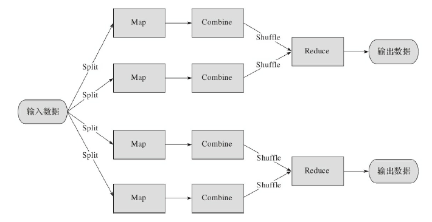
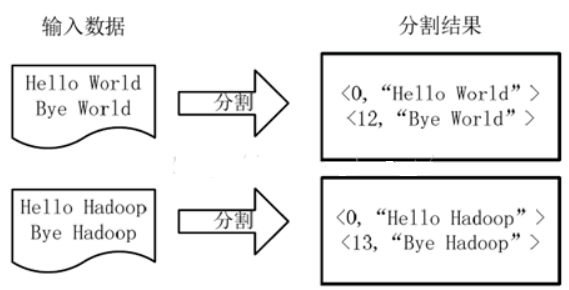
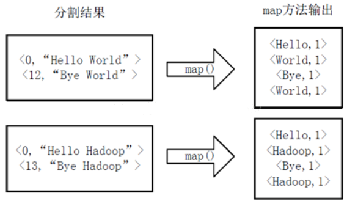
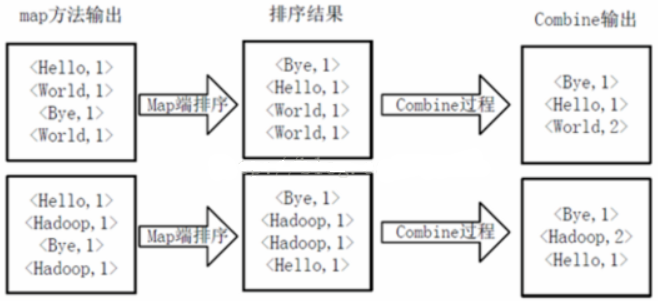
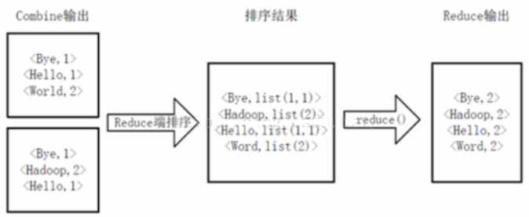

<!-- START doctoc generated TOC please keep comment here to allow auto update -->
<!-- DON'T EDIT THIS SECTION, INSTEAD RE-RUN doctoc TO UPDATE -->


- [Apache Hadoop 介绍](#apache-hadoop-%E4%BB%8B%E7%BB%8D)
  - [一、Apache Hadoop 的历史](#%E4%B8%80apache-hadoop-%E7%9A%84%E5%8E%86%E5%8F%B2)
  - [二、HDFS分布式文件系统](#%E4%BA%8Chdfs%E5%88%86%E5%B8%83%E5%BC%8F%E6%96%87%E4%BB%B6%E7%B3%BB%E7%BB%9F)
  - [三、Apache Hadoop特性](#%E4%B8%89apache-hadoop%E7%89%B9%E6%80%A7)
  - [四、安装 Apache Hadoop](#%E5%9B%9B%E5%AE%89%E8%A3%85-apache-hadoop)
    - [1、Hadoop 安装](#1hadoop-%E5%AE%89%E8%A3%85)
    - [2、HDFS 安装](#2hdfs-%E5%AE%89%E8%A3%85)
    - [3、HBase 安装](#3hbase-%E5%AE%89%E8%A3%85)
  - [五、MapReduce 使用介绍](#%E4%BA%94mapreduce-%E4%BD%BF%E7%94%A8%E4%BB%8B%E7%BB%8D)
  - [六、 MapReduce 模型详解](#%E5%85%AD-mapreduce-%E6%A8%A1%E5%9E%8B%E8%AF%A6%E8%A7%A3)
    - [1、模型介绍](#1%E6%A8%A1%E5%9E%8B%E4%BB%8B%E7%BB%8D)
    - [2、词频统计案例](#2%E8%AF%8D%E9%A2%91%E7%BB%9F%E8%AE%A1%E6%A1%88%E4%BE%8B)
    - [3、案例实现](#3%E6%A1%88%E4%BE%8B%E5%AE%9E%E7%8E%B0)

<!-- END doctoc generated TOC please keep comment here to allow auto update -->

##  Apache Hadoop 介绍

本文内容参考 《分布式实时处理系统 原理、架构和实现》  和 [MapReduce工作原理](https://blog.csdn.net/tanggao1314/article/details/51275812)

Hadoop是由Apache基金会开发的分布式存储与计算框架。用户不需要了解底层的分布式计算原理就可以轻松开发出分布式计算程序，可以充分利用集群中闲置的计算资源，将集群的真正威力调动起来。

Hadoop由两个重要模块组成。一个是Hadoop分布式文件系统（Hadoop Distributed File System），顾名思义，就是一个分布式的文件系统，可以将文件数据分布式地存储在集群中的不同节点上。另一个是MapReduce系统，是一个针对大量数据的分布式计算系统。而当前版本的Hadoop中加入了一个名为YARN的模块，这是一个用于任务调度和资源管理的框架，而目前MapReduce便是基于YARN开发的。

### 一、Apache Hadoop 的历史

Hadoop的思路来自谷歌提出的MapReduce分布式计算框架。谷歌的MapReduce框架可以把一个应用程序分解为许多并行计算指令，跨跃大量的计算节点运行非常巨大的数据集。而Hadoop的MapReduce则是对谷歌MapReduce的开源实现。另一方面其分布式文件系统则是谷歌的GFS的开源实现。

Hadoop原本是Apache Nutch中的一个子项目。后来Apache将MapReduce模块与Nutch Distributed File System（NDFS）单独抽离出来成为一个顶级项目。

Hadoop已经成为目前世界上最流行的分布式计算框架，Apache也建立了不少与Hadoop相关的项目，如HBase、Cassandra、Avro、Hive、Mahout等项目。

### 二、HDFS分布式文件系统

Hadoop分布式文件系统（HDFS）是一个主从式的分布式文件系统，是GFS的一种开源实现。

HDFS可以利用大量廉价存储器组成分布式存储集群，取代昂贵的集中式磁盘存储阵列。而HDFS集群由一个NameNode和多个DataNode组成，除此之外还有用于热备份的Secondary NameNode，防止集群出现单点故障。

接下来介绍HDFS的各个组成部分：

* NameNode

  NameNode是整个集群的管理者。它并不存储数据本身，而负责存储文件系统的元数据。它负责管理文件系统名称空间，并控制外部客户端对文件系统的访问。

  NameNode决定如何将文件内容映射到DataNode的数据块上。此外，实际数据传输并不会经过NameNode，而会让对应的DataNode接收实际数据，并处理分布式存储系统的负载均衡问题。

  整个文件系统只有一个NameNode，因此很明显集群可能会出现单点故障，这点我们需要利用Secondary NameNode来解决问题。

* Secondary NameNode

   Secondary NameNode是NameNode的备份节点，HDFS会将NameNode的数据实时备份到Secondary NameNode上，当NameNode宕机需要重启时，则可以利用Secondary NameNode中的数据加快NameNode的重启恢复速度。

* DataNode

   DataNode是实际的数据存储节点，负责相应NameNode创建、删除和复制块的命令。NameNode会读取来自DataNode的心跳信息，以此判断DataNode是否存活。同一份数据会以多份副本存储在不同的DataNode上，一旦某一个DataNode宕机，NameNode会立即采取手段来处理问题。

* MapReduce模型

  MapReduce既是Hadoop中的模块，也是一个计算模型。用户需要自己将算法划分成Map和Reduce两个阶段。首先将数据划分为小块的数据，将数据分配到不同计算节点的Map任务中计算，然后将计算结果汇总到Reduce节点中进行合并，得出最终结果。MapReduce系统也是主从式的计算系统。在使用YARN后，每个集群有一个Resource-Manager，用于管理整个集群。集群中每个计算节点都有一个NodeManager，负责管理某个节点的容器并监视其资源使用。每个应用程序由一个MRAppMaster进行管理。

### 三、Apache Hadoop特性

Apache Hadoop具有以下几个特点：

* 高可靠性：Apache Hadoop可以可靠地将数据存储到节点上。
* 高可扩展性：Apache Hadoop的存储和计算节点可以快速扩展，并自动进行负载均衡。
* 高效性：一方面Apache Hadoop会自动在各个节点之间动态调动数据，保证每个节点存储均衡，另一方面读取数据时我们可以从不同节点并行读取，提高数据读取的速度。
* 高容错性：Apache Hadoop会将数据冗余存储在不同节点上，保证数据容错性，计算任务失败时也会自动重新分配任务。
* 低成本：一方面，Apache Hadoop是开源软件，可以节省商业软件的购买成本。同时，Apache Hadoop可以用廉价节点组成的集群取代昂贵的超级计算机，从而可以节省硬件成本。

Apache Hadoop虽然是异常可靠的分布式计算框架，但其计算存储模型也导致它的严重缺陷——实时性较差。首先MapReduce计算模型本身是一种批处理的计算模型，也就是积累一批数据，然后启动MapReduce任务处理完这一批数据，等到下次积累到一定程度，再定时或手动启动一轮新任务，而不是随着数据到来即时处理。

此外，HDFS不是一个高实时性的分布式文件系统。为了提高其实时性我们还需要自己加上很多缓存优化。而致命问题在于MapReduce各个任务之间的通信完全使用HDFS完成，这也就从根本上导致MapReduce不可能具有极高的实时性。

### 四、安装 Apache Hadoop

参考 [林子雨编著《大数据技术原理与应用》教材配套大数据软件安装和编程实践指南](http://dblab.xmu.edu.cn/post/5663/)

#### 1、Hadoop 安装

参考 [大数据处理架构Hadoop 学习指南](http://dblab.xmu.edu.cn/blog/285/)

参考 [Hadoop安装教程_单机/伪分布式配置_Hadoop2.6.0/Ubuntu14.04](http://dblab.xmu.edu.cn/blog/install-hadoop/)

参考 [Hadoop安装教程_伪分布式配置_CentOS6.4/Hadoop2.6.0](http://dblab.xmu.edu.cn/blog/install-hadoop-in-centos/)

#### 2、HDFS 安装

参考 [分布式文件系统HDFS 学习指南](http://dblab.xmu.edu.cn/blog/290-2/)

参考 [查看HDFS文件系统数据的三种方法](http://dblab.xmu.edu.cn/blog/893-2/)

#### 3、HBase 安装

参考 [分布式数据库HBase 学习指南](http://dblab.xmu.edu.cn/blog/install-hbase/)

### 五、MapReduce 使用介绍

参考 [MapReduce 学习指南](http://dblab.xmu.edu.cn/blog/631-2/)

参考 [使用Eclipse编译运行MapReduce程序_Hadoop2.6.0_Ubuntu/CentOS](http://dblab.xmu.edu.cn/blog/hadoop-build-project-using-eclipse/)

参考 [使用命令行编译打包运行自己的MapReduce程序 Hadoop2.6.0](http://dblab.xmu.edu.cn/blog/hadoop-build-project-by-shell/)

### 六、 MapReduce 模型详解

本文参考 《分布式实时处理系统 原理、架构和实现》 和 [MapReduce工作原理](https://blog.csdn.net/tanggao1314/article/details/51275812)

MapReduce模型是Google于2004年公开的一个用于处理分布式计算的计算模型。而Nutch为了解决网页文件的处理问题也迅速实现了这个模型。后来Nutch就将NDFS和MapReduce独立出来，成立了现在的Hadoop项目，随后也成为了Apache的一个顶级项目。

#### 1、模型介绍

MapReduce的模型其实非常简单，其核心思想就是分治。首先，Hadoop会分割输入数据，交给Map任务进行计算，接着将Map的计算结果通过HDFS传递给Reduce任务，由Reduce任务对Map的计算结果进行合并，并将结果输出，得到最后的输出。但这只是一种最简单的描述，其实整个MapReduce的过程中包含了更多的部分，我们可以利用这套机制完成很多类型的计算工作。我们可以用下图来描述完整的MapReduce模型：



首先，Hadoop会从数据源中读取数据。这个数据源类型非常多，可以是文本数据，可以是从HBase或者Cassandra这类数据库中提取的数据，也可以是Avro这种序列化格式。Hadoop提供了一个数据处理类的接口InputFormat，只要用户实现该类，理论上就可以从任何数据源中读取输入，我们常用的有TextInputFormat、KeyValueTextInputFormat、SequenceFileInputFormat等。

接着，Hadoop会对输入进行分割，并将输入分别传送到不同的计算节点上。每个计算节点可以运行多个Map任务，Hadoop会将分割后的结果传送到对应的Map任务中。Hadoop会帮助我们合理安排每台机器上
Map任务的运行数量（但是我们需要设定一个最大值），并且做好计算的负载均衡，以提高整个计算集群的吞吐量。

执行完Map任务之后，Hadoop会将Map的输出结果以用户指定的格式存放在HDFS的特定目录中。在输出之前，Map会将多个任务的执行结果先使用Combine进行一次合并，这样可以减少Reduce的工作负担，很多
时候也可以减少输出的数据量，更充分地提高系统吞吐量。接下来，Hadoop就会调度Reduce任务对Map的数据进行最后的合并操作。在执行Reduce之前，Hadoop会进行一个Shuffle操作，对Map的输出
结果进行特殊处理，比如默认会进行排序。也就是说每一个Reduce任务的输入都是确保有序的。这样我们就可以利用MapReduce进行海量数据的排序工作。

最后，Reduce会将数据输出到用户指定的目的地。和输入数据源一样，输出的目的地和输出格式都是可以指定的。与InputFormat类似，这里Hadoop提供了一个OutputFormat类，用户只要实现这个OutputFormat就可以将数据输出到任意位置，无论是HDFS、数据库还是网络上。

#### 2、词频统计案例

下面通过一个单词计数案例来理解各个过程。

首先将文件拆分成splits(片)，并将每个split按行分割形成<key,value>对，如下图所示。这一步由MapReduce框架自动完成，其中偏移量即key值：



将分割好的<key,value>对交给用户定义的map方法进行处理，生成新的<key,value>对，如下图所示：



得到map方法输出的<key,value>对后，Mapper会将它们按照key值进行Shuffle（排序），并执行Combine过程，将key至相同value值累加，得到Mapper的最终输出结果。如下图所示：



Reducer先对从Mapper接收的数据进行排序，再交由用户自定义的reduce方法进行处理，得到新的<key,value>对，并作为WordCount的输出结果，如下图所示:



#### 3、案例实现

下面看怎么用Java来实现WordCount单词计数的功能。

首先看Map过程，Map过程需要继承org.apache.hadoop.mapreduce.Mapper包中 Mapper 类，并重写其map方法：

```java
package org.apache.hadoop.examples;
 
import java.io.IOException;
 
import org.apache.hadoop.conf.Configuration;
import org.apache.hadoop.fs.Path;
import org.apache.hadoop.io.IntWritable;
import org.apache.hadoop.io.LongWritable;
 
import org.apache.hadoop.io.Text;
import org.apache.hadoop.mapreduce.Job;
import org.apache.hadoop.mapreduce.Mapper;
import org.apache.hadoop.mapreduce.Reducer;
import org.apache.hadoop.mapreduce.lib.input.FileInputFormat;
import org.apache.hadoop.mapreduce.lib.output.FileOutputFormat;
import org.apache.hadoop.util.GenericOptionsParser;
 
public class WordCount {
    //计数变量
    private static final IntWritable ONE = new IntWritable(1);
    /**
     *
     * @author 汤高
     *    Mapper<LongWritable, Text, Text, IntWritable>中  LongWritable,IntWritable是Hadoop数据类型表示长整型和整形
     *
     *    LongWritable, Text表示输入类型 (比如本应用单词计数输入是 偏移量(字符串中的第一个单词的其实位置),对应的单词(值))
     *    Text, IntWritable表示输出类型  输出是单词  和他的个数
     *  注意：map函数中前两个参数LongWritable key, Text value和输出类型不一致
     *      所以后面要设置输出类型 要使他们一致
     */
    //Map过程
    // Reduce过程需要继承org.apache.hadoop.mapreduce包中 Reducer 类，并 重写 其reduce方法。Map过程输出<key,values>中key为单个单词，
    // 而values是对应单词的计数值所组成的列表，Map的输出就是Reduce的输入，所以reduce方法只要遍历values并求和，即可得到某个单词的总次数。
    public static class WordCountMapper extends Mapper<LongWritable, Text, Text, IntWritable> {
        /***
         *
         */
        @Override
        protected void map(LongWritable key, Text value, Mapper<LongWritable, Text, Text, IntWritable>.Context context)
                throws IOException, InterruptedException {
            //默认的map的value是每一行,我这里自定义的是以空格分割
            String[] vs = value.toString().split("\\s");
            for (String v : vs) {
                //写出去
                context.write(new Text(v), ONE);
            }
 
        }
    }
    //Reduce过程
    /***
     * @author 汤高
     * Text, IntWritable输入类型,从map过程获得 既map的输出作为Reduce的输入
     * Text, IntWritable输出类型
     */
    public static class WordCountReducer extends Reducer<Text, IntWritable, Text, IntWritable>{
        @Override
        protected void reduce(Text key, Iterable<IntWritable> values,
                Reducer<Text, IntWritable, Text, IntWritable>.Context context) throws IOException, InterruptedException {
            int count=0;
            for(IntWritable v:values){
                count+=v.get();//单词个数加一
            }
            
            context.write(key, new IntWritable(count));
        }
        
    }
    
    public static void main(String[] args) {
        
        Configuration conf=new Configuration();
        try {
            //args从控制台获取路径 解析得到域名
            String[] paths=new GenericOptionsParser(conf,args).getRemainingArgs();
            if(paths.length<2){
                throw new RuntimeException("必須輸出 輸入 和输出路径");
            }
            //得到一个Job 并设置名字
            Job job=Job.getInstance(conf,"wordcount");
            //设置Jar 使本程序在Hadoop中运行
            job.setJarByClass(WordCount.class);
            //设置Map处理类
            job.setMapperClass(WordCountMapper.class);
            //设置map的输出类型,因为不一致,所以要设置
            job.setMapOutputKeyClass(Text.class);
            job.setOutputValueClass(IntWritable.class);
            //设置Reduce处理类
            job.setReducerClass(WordCountReducer.class);
            //设置输入和输出目录
            FileInputFormat.addInputPath(job, new Path(paths[0]));
            FileOutputFormat.setOutputPath(job, new Path(paths[1]));
            //启动运行
            System.exit(job.waitForCompletion(true) ? 0:1);
        } catch (IOException e) {
            e.printStackTrace();
        } catch (ClassNotFoundException e) {
            e.printStackTrace();
        } catch (InterruptedException e) {
            e.printStackTrace();
        }
    }
}
```
输入文件内容如下：
```
China is my motherland
I love China
```
输出文件内容如下：
```
China	2
I	1
is	1
love	1
motherland	1
my	1
```