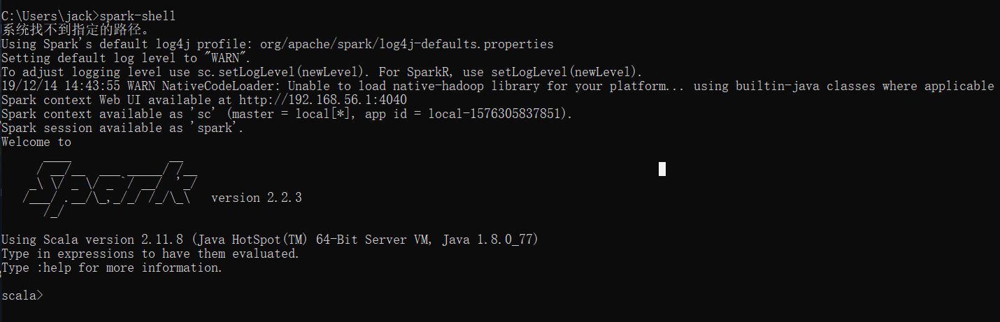
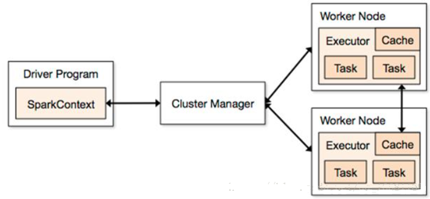
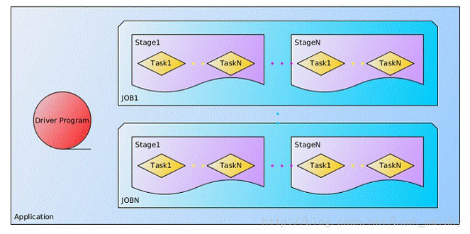
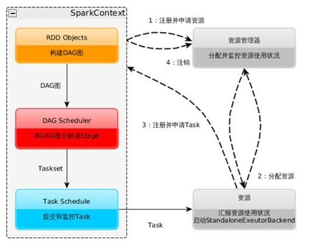
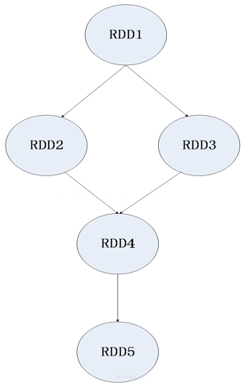
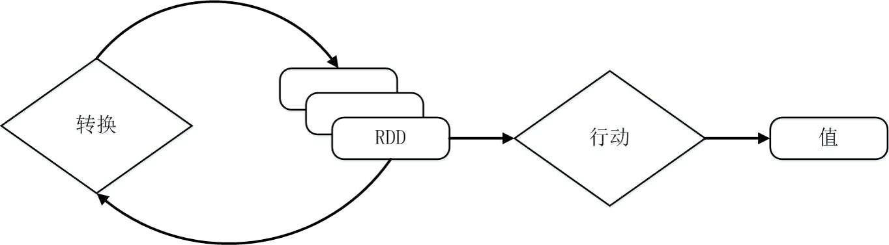
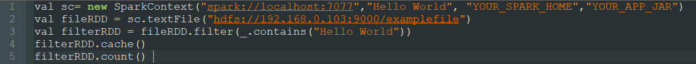
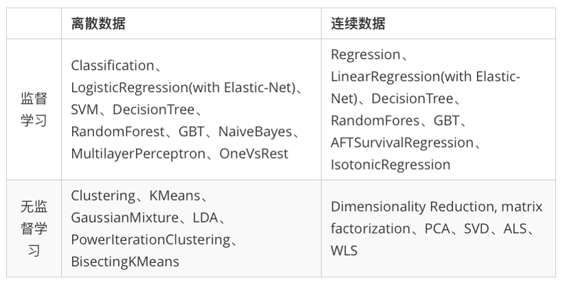

<!-- START doctoc generated TOC please keep comment here to allow auto update -->
<!-- DON'T EDIT THIS SECTION, INSTEAD RE-RUN doctoc TO UPDATE -->

- [Apache Spark](#apache-spark)
  - [一、安装 Apache Spark](#%E4%B8%80%E5%AE%89%E8%A3%85-apache-spark)
  - [二、Spark 基础知识](#%E4%BA%8Cspark-%E5%9F%BA%E7%A1%80%E7%9F%A5%E8%AF%86)
    - [1、基本概念](#1%E5%9F%BA%E6%9C%AC%E6%A6%82%E5%BF%B5)
    - [2、架构设计](#2%E6%9E%B6%E6%9E%84%E8%AE%BE%E8%AE%A1)
  - [三、Spark 运作流程](#%E4%B8%89spark-%E8%BF%90%E4%BD%9C%E6%B5%81%E7%A8%8B)
  - [四、RDD设计与运行原理](#%E5%9B%9Brdd%E8%AE%BE%E8%AE%A1%E4%B8%8E%E8%BF%90%E8%A1%8C%E5%8E%9F%E7%90%86)
    - [1、概念](#1%E6%A6%82%E5%BF%B5)
    - [2、RDD执行过程](#2rdd%E6%89%A7%E8%A1%8C%E8%BF%87%E7%A8%8B)
    - [3、RDD案例](#3rdd%E6%A1%88%E4%BE%8B)
  - [五、Spark机器学习介绍](#%E4%BA%94spark%E6%9C%BA%E5%99%A8%E5%AD%A6%E4%B9%A0%E4%BB%8B%E7%BB%8D)

<!-- END doctoc generated TOC please keep comment here to allow auto update -->

## Apache Spark

为了解决Apache Hadoop计算速度较慢的问题，Apache Spark应运而生。我们可以将Apache Spark看成一种“高层”分布式计算框架。它具有以下特点:

1）执行速度极快：首先它支持将计算任务的中间结果放在内存中而不是HDFS上，这样可以加快速度，根据评测最高可以提升100倍。

2）支持多种运行模式：除了可以独立在集群上执行任务以外，Spark还支持将任务执行在EC2或Apache Hadoop的YARN上，也可以从HDFS、Cassandra、HBase、Hive等各种数据存储系统中读取数据。

3）更多更通用的计算模型：Hadoop只提供了较为底层的MapReduce模型，编程人员往往需要大量编码来解决简单的任务。而Spark则提供了SQL接口、Apache Spark流模型接口、MLib机器学习接口以及GraphX图形计算接口等多种接口，可以方便应用于多种场合，提高开发人员的开发效率。

### 一、安装 Apache Spark

在安装Spark 前需要安装好Java环境。笔者是在Windows 10 环境，Java 8 环境下安装Spark的。
Spark 依赖Scala 环境，所以在安装Spark 前还需要安装Scala。

Spark 和 Scala可直接到官网下载，需要注意的是Spark 的版本对Scala版本有要求，笔者使用的是Scala 2.12.5 和 Spark 2.2.3。安装好Spark后还需要注意配置环境变量。具体的安装过程可参考该文章：[window10安装spark](https://blog.csdn.net/qq_39290225/article/details/99332056)

安装好Spark 后可在cmd中运行命令spark-shell，成功运行结果如下：

### 二、Spark 基础知识

#### 1、基本概念

* RDD：弹性分布式数据集（Resilient Distributed Dataset）,分布式内存的一个抽象概念，提供了一种高度受限的共享内存模型
* DAG：有向无环图（Directed Acyclic Graph）,反映RDD之间的依赖关系（比如：一个RDD生成两个RDD，RDD2 = RDD1.filter(xxxxx) RDD3 = RDD1.filter(yyyy)）
* Executor：运行在工作节点(Worker Node)上的一个进程，负责运行任务，并为应用程序存储数据
* 应用：用户编写的Spark应用程序
* 任务：运行在Executor上的工作单元
* 作业：一个作业包含多个RDD及其作用于相应RDD上的各种操作
* 阶段：作业的基本调度单位，一个作业会分为多组任务，每组任务被称为“阶段”，或者也被称为“任务集”

#### 2、架构设计

Spark的架构如下图所示：

其中：

* Cluster Manager：集群资源管理器
* Worker Node：运行作业任务的工作节点
* Driver：每个应用的任务控制节点

在Spark中：

* 一个应用（Application）由一个任务控制节点（Driver）和若干个作业（Job）构成
* 一个作业由多个阶段（Stage）构成
* 一个阶段由多个任务（Task）组成

它们的关系如下所示：

### 三、Spark 运作流程

如下图所示：

* 1、当一个Spark应用被提交时，首先要为这个应用构建基本的运行环境，即由任务控制节点（Driver）构建一个SparkContext，由SparkContext负责和资源管理器（Cluster Manager）通信、资源申请、任务分配和监控等。SparkContext会向资源管理器注册并申请运行Executor的资源。

* 2、资源管理器为Executor分配资源，并启动Executor进程，Executor运行情况将随着“心跳”发送到资源管理器上。

* 3、SparkContext根据RDD的依赖关系构建DAG图，DAG图提交给DAG调度器（DAGScheduler）进行解析，将DAG图分解为多个“阶段”（每个阶段都是一个任务集），并且计算出各个阶段之间的依赖关系，然后把一个个“任务集”提交给底层的任务调度器（TaskScheduler）进行处理；Executor向SparkContex申请任务，任务调度器将任务分发给Executor进行，同时SparkContext将应用程序代码发放给Executor。

* 4、任务在Executor上运行，把执行结果反馈给任务调度器，然后反馈给DAG调度器，运行完毕后写入数据并释放所有资源。

### 四、RDD设计与运行原理

#### 1、概念

如下图所示：

一个RDD就是一个分布式对象集合，本质上是一个只读的分区记录集合，每个RDD可以分成多个分区，每个分区就是一个数据集片段，并且一个RDD的不同分区可以被保持到集群中不同节点上，从而可以在集群中的不同节点上进行并行计算。

RDD提供了一种高度受限的共享内存模型，即RDD是只读的记录分区的集合，不能直接修改，只能基于稳定的物理存储中的数据集来创建RDD，或者通过在其他RDD上执行确定的转换操作（如map、join和groupBy）而创建得到新的RDD。

#### 2、RDD执行过程

如下图所示：

* 1、RDD读入外部数据源（或者内存中的集合）进行创建
* 2、RDD经过一系列的“转换操作”，每一次都会产生不同的RDD，提供给下一个“转换”使用
* 3、最后一个RDD经“行动”操作进行处理，并输出到外部数据源（或者变成Scala集合或标量）

注意：RDD采用了惰性调用，即在RDD的执行过程中，真正的计算发生在RDD的“行动”操作，对于“行动”之前的所有“转换”操作，Spark只是记录下“转换”操作应用的一些基础数据集以及RDD生成的轨迹，即相互之间的依赖关系，而不会触发真正的计算。

#### 3、RDD案例

这里以一个“Hello World”入门级Spark程序来解释RDD执行过程，这个程序的功能是读取一个HDFS文件，计算出包含字符串“Hello World”的行数。可以看出，一个Spark应用程序，基本是基于RDD的一系列计算操作。

* 第1行：创建这个Spark程序的执行上下文，即创建SparkContext对象；
* 第2行：从外部数据源（即HDFS文件）中读取数据创建fileRDD对象；
* 第3行：构建起fileRDD和filterRDD之间的依赖关系，形成DAG图，这时候并没有发生真正的计算，只是记录转换的轨迹；
* 第4行：对filterRDD进行持久化，把它保存在内存或磁盘中，这里采用cache接口把数据集保存在内存中，方便后续重复使用。
* 执行到第5行代码时，count()是一个行动类型的操作，触发真正的计算，开始实际执行从fileRDD到filterRDD的转换操作，并把结果持久化到内存中，最后计算出filterRDD中包含的元素个数。

### 五、Spark机器学习介绍

MLlib是Spark的机器学习（Machine Learning）库，旨在简化机器学习的工程实践工作，并方便扩展到更大规模。MLlib由一些通用的学习算法和工具组成，包括分类、回归、聚类、协同过滤、降维等，同时还包括底层的优化原语和高层的管道API。具体来说，其主要包括以下几方面的内容：
* 算法工具：常用的学习算法，如分类、回归、聚类和协同过滤；
* 特征化公交：特征提取、转化、降维，和选择公交；
* 管道(Pipeline)：用于构建、评估和调整机器学习管道的工具;
* 持久性：保存和加载算法，模型和管道;
* 实用工具：线性代数，统计，数据处理等工具。

更多内容详见《Spark 机器学习》