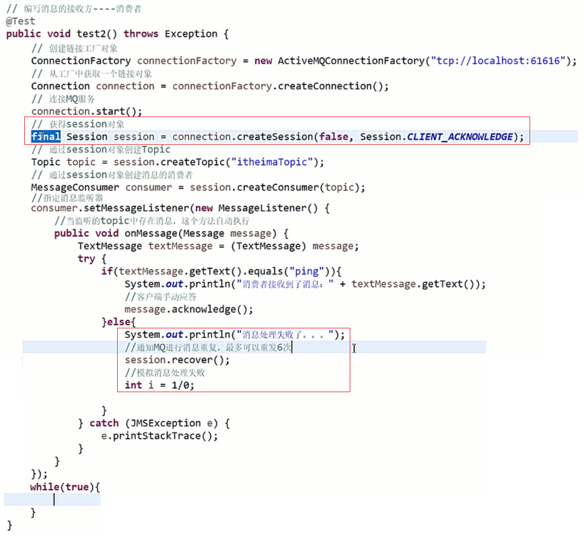

<!-- START doctoc generated TOC please keep comment here to allow auto update -->
<!-- DON'T EDIT THIS SECTION, INSTEAD RE-RUN doctoc TO UPDATE -->

- [ActiveMQ](#activemq)
  - [一、消息队列应用场景](#%E4%B8%80%E6%B6%88%E6%81%AF%E9%98%9F%E5%88%97%E5%BA%94%E7%94%A8%E5%9C%BA%E6%99%AF)
  - [二、JMS消息模型](#%E4%BA%8Cjms%E6%B6%88%E6%81%AF%E6%A8%A1%E5%9E%8B)
  - [三、ActiveMQ消息失败重发](#%E4%B8%89activemq%E6%B6%88%E6%81%AF%E5%A4%B1%E8%B4%A5%E9%87%8D%E5%8F%91)
  - [四、ActiveMQ 消息持久化订阅](#%E5%9B%9Bactivemq-%E6%B6%88%E6%81%AF%E6%8C%81%E4%B9%85%E5%8C%96%E8%AE%A2%E9%98%85)
  - [五、Zookeeper + ActiveMQ 实现高可用](#%E4%BA%94zookeeper--activemq-%E5%AE%9E%E7%8E%B0%E9%AB%98%E5%8F%AF%E7%94%A8)

<!-- END doctoc generated TOC please keep comment here to allow auto update -->

## ActiveMQ

### 一、消息队列应用场景

### 二、JMS消息模型

### 三、ActiveMQ消息失败重发

可以看到，前面所有的确认方式都是让JMS自动确认接管的，如果消息接收失败或者处理异常也看不到，所以这里可以设置消费者手动确认。修改消费者代码如下：

消息处理异常效果如下：

### 四、ActiveMQ 消息持久化订阅

在前面的案例中，一般都是先开消息消费者，消费者阻塞等待生产者生产消息。如果生产者先于消费者开启，那么消费者将获取不到消息。那么如何解决这个问题呢？这里可以采用持久化的策略，可以将消息放在某个文件或者数据库中，这样即使生产者已经结束了，但消费者还是可以从这些持久化文件或者数据库中获取消息消费。下面会介绍策略。

### 五、Zookeeper + ActiveMQ 实现高可用

