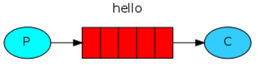
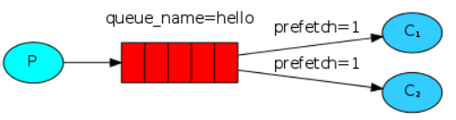
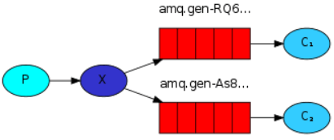
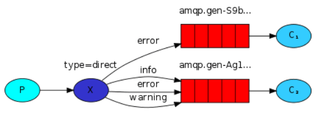
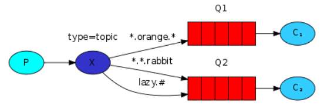
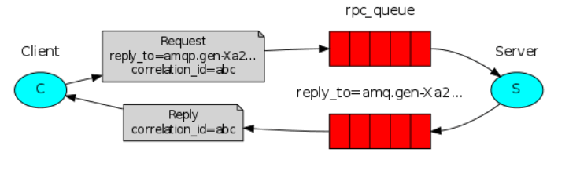

## RabbitMQ 的六种工作模式

参考 [rabbitmq 几种应用模式解释](https://msd.misuland.com/pd/2884250137616455578)    [RabbitMQ的5种模式与实例](https://blog.csdn.net/u010753907/article/details/72902453)

### 零、JMS和AMQP的区别

### 一、Hello World（简单模式）

功能：一个生产者P发送消息到队列Q，一个消费者C接收。

生产者实现思路：

* 创建连接工厂ConnectionFactory
* 设置服务地址127.0.0.1，端口号5672
* 设置用户名、密码、virtual host
* 从连接工厂中获取连接connection
* 使用连接创建通道channel，使用通道channel创建队列queue，使用通道channel向队列中发送消息
* 关闭通道和连接

消费者实现思路：

* 创建连接工厂ConnectionFactory
* 设置服务地址127.0.0.1，端口号5672
* 设置用户名、密码、virtual host
* 从连接工厂中获取连接connection
* 使用连接创建通道channel，使用通道channel创建队列queue, 创建消费者并监听队列，从队列中读取消息。

例如：

### 二、Work Queue（工作队列模式）

功能：一个生产者，多个消费者，每个消费者获取到的消息唯一，多个消费者只有一个队列

任务队列：避免立即做一个资源密集型任务，必须等待它完成，而是把这个任务安排到稍后再做。我们将任务封装为消息并将其发送给队列。后台运行的工作进程将弹出任务并最终执行作业。当有多个worker同时运行时，任务将在它们之间共享。

生产者实现思路：

* 创建连接工厂ConnectionFactory
* 设置服务地址127.0.0.1，端口号5672
* 设置用户名、密码、virtual host
* 从连接工厂中获取连接connection
* 使用连接创建通道channel，使用通道channel创建队列queue，使用通道* channel向队列中发送消息，2条消息之间间隔一定时间
关闭通道和连接。

消费者实现思路：

* 创建连接工厂ConnectionFactory
* 设置服务地址127.0.0.1，端口号5672
* 设置用户名、密码、virtual host
* 从连接工厂中获取连接connection，使用连接创建通道channel，使用通道channel创建队列queue，创建消费者C1并监听队列，获取消息并暂停10ms，另外一个消费者C2暂停1000ms，由于消费者C1消费速度快，所以C1可以执行更多的任务。

### 三、Publish/Subscribe（发布/订阅模式）

功能：一个生产者发送的消息会被多个消费者获取。一个生产者、一个交换机、多个队列、多个消费者

生产者：可以将消息发送到队列或者是交换机。

消费者：只能从队列中获取消息。

如果消息发送到没有队列绑定的交换机上，那么消息将丢失。交换机不能存储消息，消息存储在队列中

生产者实现思路：

* 创建连接工厂ConnectionFactory
* 设置服务地址127.0.0.1，端口号5672
* 设置用户名、密码、virtual host
* 从连接工厂中获取连接connection
* 使用连接创建通道channel
* 使用通道channel创建队列queue
* 使用通道channel创建交换机并指定交换机类型为fanout
* 使用通道向交换机发送消息
* 关闭通道和连接。

消费者实现思路：

* 创建连接工厂ConnectionFactory
* 设置服务地址127.0.0.1，端口号5672
* 设置用户名、密码、virtual host
* 从连接工厂中获取连接connection
* 使用连接创建通道channel，使用通道channel创建队列queue
* 绑定队列到交换机，设置Qos=1
* 创建消费者并监听队列，使用手动方式返回完成。
* 可以有多个队列绑定到交换机，多个消费者进行监听。

案例如下：

### 四、Routing（路由模式）

说明：生产者发送消息到交换机并且要指定路由key，消费者将队列绑定到交换机时需要指定路由key

生产者实现思路：

* 创建连接工厂ConnectionFactory
* 设置服务地址127.0.0.1，端口号5672
* 设置用户名、密码、virtual host
* 从连接工厂中获取连接connection
* 使用连接创建通道channel
* 使用通道channel创建队列queue
* 使用通道channel创建交换机并指定交换机类型为direct
* 使用通道向交换机发送消息并指定key=b
* 关闭通道和连接。

消费者实现思路：

* 创建连接工厂ConnectionFactory
* 设置服务地址127.0.0.1，端口号5672
* 设置用户名、密码、virtual host
* 从连接工厂中获取连接connection
* 使用连接创建通道channel
* 使用通道channel创建队列queue
* 绑定队列到交换机
* 设置Qos=1，创建消费者并监听队列，使用手动方式返回完成。可以有多个队列绑定到交换机,但只要绑定key=b的队列key接收到消息
* 多个消费者进行监听。

### 五、Topics（通配符模式）

说明：生产者P发送消息到交换机X，type=topic，交换机根据绑定队列的routing key的值进行通配符匹配；符号#：匹配一个或者多个词lazy.# 可以匹配lazy.irs或者lazy.irs.cor

符号*：只能匹配一个词lazy.* 可以匹配lazy.irs或者lazy.cor

生产者实现思路：

创建连接工厂ConnectionFactory，设置服务地址127.0.0.1，端口号5672，设置用户名、密码、virtual host，从连接工厂中获取连接connection，使用连接创建通道channel，使用通道channel创建队列queue，使用通道channel创建交换机并指定交换机类型为topic，使用通道向交换机发送消息并指定key=key.1，关闭通道和连接。

消费者实现思路：

创建连接工厂ConnectionFactory，设置服务地址127.0.0.1，端口号5672，设置用户名、密码、virtual host，从连接工厂中获取连接connection，使用连接创建通道channel，使用通道channel创建队列queue，绑定队列到交换机，设置Qos=1，创建消费者并监听队列，使用手动方式返回完成。可以有多个队列绑定到交换机,凡是绑定规则符合通配符规则的队列均可以接收到消息，比如key.*,key.#，多个消费者进行监听。

### 六、RPC模式

