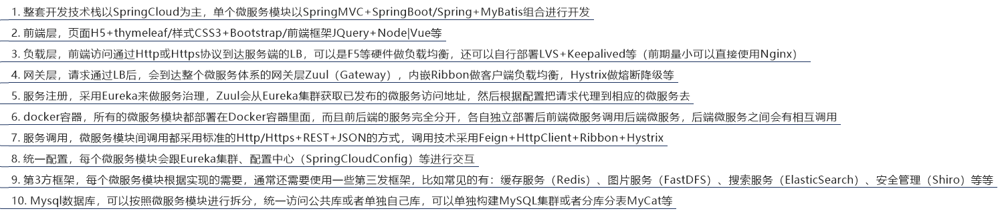

<!-- START doctoc generated TOC please keep comment here to allow auto update -->
<!-- DON'T EDIT THIS SECTION, INSTEAD RE-RUN doctoc TO UPDATE -->


- [Spring Cloud 微服务](#spring-cloud-%E5%BE%AE%E6%9C%8D%E5%8A%A1)
  - [一、Eureka 服务注册与发现](#%E4%B8%80eureka-%E6%9C%8D%E5%8A%A1%E6%B3%A8%E5%86%8C%E4%B8%8E%E5%8F%91%E7%8E%B0)
      - [（1）构建注册中心](#1%E6%9E%84%E5%BB%BA%E6%B3%A8%E5%86%8C%E4%B8%AD%E5%BF%83)
      - [（2）将服务提供者注册到服务中心](#2%E5%B0%86%E6%9C%8D%E5%8A%A1%E6%8F%90%E4%BE%9B%E8%80%85%E6%B3%A8%E5%86%8C%E5%88%B0%E6%9C%8D%E5%8A%A1%E4%B8%AD%E5%BF%83)
      - [（3）Eureka 自我保护](#3eureka-%E8%87%AA%E6%88%91%E4%BF%9D%E6%8A%A4)
      - [（4）Eureka 注册中心集群配置](#4eureka-%E6%B3%A8%E5%86%8C%E4%B8%AD%E5%BF%83%E9%9B%86%E7%BE%A4%E9%85%8D%E7%BD%AE)
  - [二、Ribbon 客户端负载均衡](#%E4%BA%8Cribbon-%E5%AE%A2%E6%88%B7%E7%AB%AF%E8%B4%9F%E8%BD%BD%E5%9D%87%E8%A1%A1)
    - [1、构建步骤](#1%E6%9E%84%E5%BB%BA%E6%AD%A5%E9%AA%A4)
    - [2、测试](#2%E6%B5%8B%E8%AF%95)
  - [三、Feign 负载均衡](#%E4%B8%89feign-%E8%B4%9F%E8%BD%BD%E5%9D%87%E8%A1%A1)
  - [四、Hystrix 熔断器](#%E5%9B%9Bhystrix-%E7%86%94%E6%96%AD%E5%99%A8)
    - [1、概述](#1%E6%A6%82%E8%BF%B0)
    - [2、服务熔断](#2%E6%9C%8D%E5%8A%A1%E7%86%94%E6%96%AD)
    - [3、服务降级](#3%E6%9C%8D%E5%8A%A1%E9%99%8D%E7%BA%A7)
    - [4、调用监控面板](#4%E8%B0%83%E7%94%A8%E7%9B%91%E6%8E%A7%E9%9D%A2%E6%9D%BF)
  - [五、Zuul 路由网关](#%E4%BA%94zuul-%E8%B7%AF%E7%94%B1%E7%BD%91%E5%85%B3)
  - [六、配置中心](#%E5%85%AD%E9%85%8D%E7%BD%AE%E4%B8%AD%E5%BF%83)
  - [七、总结](#%E4%B8%83%E6%80%BB%E7%BB%93)

<!-- END doctoc generated TOC please keep comment here to allow auto update -->

## Spring Cloud 微服务

### 一、Eureka 服务注册与发现

Eureka是Netflix的一个子模块，也是核心模块之一。Eureka是一个基于REST的服务，用于定位服务，以实现云端中间层服务发现和故障转移。

服务注册与发现对于微服务架构来说是非常重要的，有了服务发现与注册，只需要使用服务的标识符，就可以访问到服务，而不需要修改服务调用的配置文件了。功能类似于dubbo的注册中心，比如Zookeeper。

Spring Cloud 封装了 Netflix 公司开发的 Eureka 模块来实现服务注册和发现(请对比Zookeeper)。Eureka 采用了 C-S 的设计架构。Eureka Server 作为服务注册功能的服务器，它是服务注册中心。而系统中的其他微服务，使用 Eureka 的客户端连接到 Eureka Server并维持心跳连接。这样系统的维护人员就可以通过 Eureka Server 来监控系统中各个微服务是否正常运行。SpringCloud 的一些其他模块（比如Zuul）就可以通过 Eureka Server 来发现系统中的其他微服务，并执行相关的逻辑。请注意和Dubbo的架构对比：


##### （1）构建注册中心

需要在主启动类里加上@EnableEurekaServer标签，需要在配置的yml文件中加入
```
defaultZone: http://${eureka.instance.hostname}:${server.port}/eureka/ 
```

这是为了设置与Eureka Server交互的地址，客户端查询服务和注册服务都需要依赖这个地址。

成功输入服务器的地址即可看到：


其配置文件如下：

```yml
server: 
  port: 7001

eureka:
  instance:
    hostname: localhost #eureka服务端的实例名称
  client:
    register-with-eureka: false #false表示不向注册中心注册自己。
    fetch-registry: false #false表示自己端就是注册中心，我的职责就是维护服务实例，并不需要去检索服务
    service-url:
      defaultZone: http://${eureka.instance.hostname}:${server.port}/eureka/        #设置与Eureka Server交互的地址查询服务和注册服务都需要依赖这个地址。
```

##### （2）将服务提供者注册到服务中心

服务提供者的启动类前要加@EnableEurekaClient，配置文件中要添加：

```yml
...
spring:
   application:
    name: microservicecloud-dept 
...
eureka:
  client: #客户端注册进eureka服务列表内
    service-url: 
      defaultZone: http://localhost:7001/eureka

  instance:
    instance-id: microservicecloud-dept8001   #自定义服务名称信息
    prefer-ip-address: true     #访问路径可以显示IP地址

info:
  app.name: atguigu-microservicecloud
  company.name: www.atguigu.com
  build.artifactId: $project.artifactId$
  build.version: $project.version$
```
如果一切顺利，那么在服务注册中心会看到如下：


服务已经注册进中心了，其他的服务调用者可以看到这个服务。

##### （3）Eureka 自我保护

有时注册中心页面会出现下面情况：


这便是Eureka的自我保护模式。

默认情况下，如果EurekaServer在一定时间内没有接收到某个微服务实例的心跳，EurekaServer将会注销该实例（默认90秒）。但是当网络分区故障发生时，微服务与EurekaServer之间无法正常通信，以上行为可能变得非常危险了——因为微服务本身其实是健康的，此时本不应该注销这个微服务。Eureka通过“自我保护模式”来解决这个问题——当EurekaServer节点在短时间内丢失过多客户端时（可能发生了网络分区故障），那么这个节点就会进入自我保护模式。一旦进入该模式，EurekaServer就会保护服务注册表中的信息，不再删除服务注册表中的数据（也就是不会注销任何微服务）。当网络故障恢复后，该Eureka Server节点会自动退出自我保护模式。

在自我保护模式中，Eureka Server会保护服务注册表中的信息，不再注销任何服务实例。当它收到的心跳数重新恢复到阈值以上时，该Eureka Server节点就会自动退出自我保护模式。它的设计哲学就是宁可保留错误的服务注册信息，也不盲目注销任何可能健康的服务实例。一句话讲解：好死不如赖活着

综上，自我保护模式是一种应对网络异常的安全保护措施。它的架构哲学是宁可同时保留所有微服务（健康的微服务和不健康的微服务都会保留），也不盲目注销任何健康的微服务。使用自我保护模式，可以让Eureka集群更加的健壮、稳定。

在Spring Cloud中，可以使用eureka.server.enable-self-preservation = false 禁用自我保护模式。

一句话，某时刻某个微服务不可用了，eureka不会立刻清理，依旧会对该服务的信息进行保存。

##### （4）Eureka 注册中心集群配置


之前只有一个注册中心，服务端口为7001，接下来配置多个注册中心，端口分别为7002和7003。

首先修改Hosts文件，将映射加入到hosts中：

```
127.0.0.1 eureka7001.com
127.0.0.1 eureka7002.com
127.0.0.1 eureka7003.com
```
这样就可以直接用.com路径访问注册中心，避免使用IP。

接下来修改三个注册中心的yml配置文件：

```yml
server: 
  port: 7001

eureka: 
  instance:
    hostname: eureka7001.com #eureka服务端的实例名称
  client: 
    register-with-eureka: false     #false表示不向注册中心注册自己。
    fetch-registry: false     #false表示自己端就是注册中心，我的职责就是维护服务实例，并不需要去检索服务
    service-url: 
      #单机 defaultZone: http://${eureka.instance.hostname}:${server.port}/eureka/       #设置与Eureka Server交互的地址查询服务和注册服务都需要依赖这个地址（单机）。
      defaultZone: http://eureka7002.com:7002/eureka/,http://eureka7003.com:7003/eureka/
```
```yml
server: 
  port: 7002
eureka: 
  instance:
    hostname: eureka7002.com #eureka服务端的实例名称
  client: 
    register-with-eureka: false     #false表示不向注册中心注册自己。
    fetch-registry: false     #false表示自己端就是注册中心，我的职责就是维护服务实例，并不需要去检索服务
    service-url: 
      #defaultZone: http://${eureka.instance.hostname}:${server.port}/eureka/       #设置与Eureka Server交互的地址查询服务和注册服务都需要依赖这个地址。
      defaultZone: http://eureka7001.com:7001/eureka/,http://eureka7003.com:7003/eureka/
```
```yml
server: 
  port: 7003
eureka: 
  instance:
    hostname: eureka7003.com #eureka服务端的实例名称
  client: 
    register-with-eureka: false     #false表示不向注册中心注册自己。
    fetch-registry: false     #false表示自己端就是注册中心，我的职责就是维护服务实例，并不需要去检索服务
    service-url: 
      #defaultZone: http://${eureka.instance.hostname}:${server.port}/eureka/       #设置与Eureka Server交互的地址查询服务和注册服务都需要依赖这个地址。
      defaultZone: http://eureka7001.com:7001/eureka/,http://eureka7002.com:7002/eureka/
```

由于注册中心变成了集群，所以客户端的yml文件中关于注册中心地址部分也要修改：

```yml
eureka:
  client: #客户端注册进eureka服务列表内
    service-url: 
      defaultZone: http://eureka7001.com:7001/eureka/,http://eureka7002.com:7002/eureka/,http://eureka7003.com:7003/eureka/
  instance:
    instance-id: microservicecloud-dept8001   #自定义服务名称信息
    prefer-ip-address: true     #访问路径可以显示IP地址
```
注册中心地址设置为三个。


### 二、Ribbon 客户端负载均衡

LB，即负载均衡(Load Balance)，在微服务或分布式集群中经常用的一种应用。负载均衡简单的说就是将用户的请求平摊的分配到多个服务上，从而达到系统的HA。常见的负载均衡有软件Nginx，LVS，硬件 F5等。相应的在中间件，例如：dubbo和SpringCloud中均给我们提供了负载均衡，SpringCloud的负载均衡算法可以自定义。

* 集中式LB

    即在服务的消费方和提供方之间使用独立的LB设施(可以是硬件，如F5, 也可以是软件，如nginx), 由该设施负责把访问请求通过某种策略转发至服务的提供方。
* 进程内LB

    将LB逻辑集成到消费方，消费方从服务注册中心获知有哪些地址可用，然后自己再从这些地址中选择出一个合适的服务器。Ribbon就属于进程内LB，它只是一个类库，集成于消费方进程，消费方通过它来获取到服务提供方的地址。

Spring Cloud Ribbon是基于Netflix Ribbon实现的一套客户端负载均衡的工具。

简单的说，Ribbon是Netflix发布的开源项目，主要功能是提供客户端的软件负载均衡算法，将Netflix的中间层服务连接在一起。Ribbon客户端组件提供一系列完善的配置项如连接超时，重试等。简单的说，就是在配置文件中列出Load Balancer（简称LB）后面所有的机器，Ribbon会自动的帮助你基于某种规则（如简单轮询，随机连接等）去连接这些机器。我们也很容易使用Ribbon实现自定义的负载均衡算法。

#### 1、构建步骤

假设某服务消费者使用RestTemplate来发起对服务提供者的Rest请求，那么该服务消费者也需要向服务中心注册：

```yml
server:
  port: 80
eureka:
  client:
    register-with-eureka: false
    service-url: 
      defaultZone: http://eureka7001.com:7001/eureka/,http://eureka7002.com:7002/eureka/,http://eureka7003.com:7003/eureka/
```

还需要对配置的RestTemplate bean前加入@LoadBalanced注解，以此作为客户端负载均衡：
```java
@Configuration
public class ConfigBean
{
  @Bean
  @LoadBalanced
  public RestTemplate getRestTemplate()
  {
   return new RestTemplate();
  }
}
```
启动类上也要添加@EnableEurekaClient：
```java
@SpringBootApplication
@EnableEurekaClient
public class DeptConsumer80_App
{
  public static void main(String[] args)

  {
   SpringApplication.run(DeptConsumer80_App.class, args);
  }
}
```
Ribbon和Eureka整合后Customer可以直接调用服务名，而不用关系地址和端口号：
```java
//private static final String REST_URL_PREFIX = "http://localhost:8001";
private static final String REST_URL_PREFIX = "http://MICROSERVICECLOUD-DEPT";
```

#### 2、测试

假设现在又三个服务提供者，也有三个数据库，每个服务提供者分别连接对应的数据库（一对一）。三个服务提供者都注册进了Eureka注册中心。

现在如果有一个使用了Ribbon的服务消费者请求提供者的数据，那么每次请求数据时Ribbon都会使用负载均衡策略，所以每次服务消费者获取到的数据可能是来自不同数据库的。

Ribbon使用了IRule组件，该组件提供了一系列负载均衡方法。当然用户也可以使用自己的负载均衡方法。

### 三、Feign 负载均衡

Feign是一个声明式WebService客户端。使用Feign能让编写Web Service客户端更加简单, 它的使用方法是定义一个接口，然后在上面添加注解，同时也支持JAX-RS标准的注解。Feign也支持可拔插式的编码器和解码器。Spring Cloud对Feign进行了封装，使其支持了Spring MVC标准注解和HttpMessageConverters。Feign可以与Eureka和Ribbon组合使用以支持负载均衡。

 Feign是一个声明式的Web服务客户端，使得编写Web服务客户端变得非常容易，只需要创建一个接口，然后在上面添加注解即可。

Feign旨在使编写Java Http客户端变得更容易。前面在使用Ribbon+RestTemplate时，利用RestTemplate对http请求的封装处理，形成了一套模版化的调用方法。但是在实际开发中，由于对服务依赖的调用可能不止一处，往往一个接口会被多处调用，所以通常都会针对每个微服务自行封装一些客户端类来包装这些依赖服务的调用。所以，Feign在此基础上做了进一步封装，由他来帮助我们定义和实现依赖服务接口的定义。在Feign的实现下，我们只需创建一个接口并使用注解的方式来配置它(以前是Dao接口上面标注Mapper注解,现在是一个微服务接口上面标注一个Feign注解即可)，即可完成对服务提供方的接口绑定，简化了使用Spring cloud Ribbon时，自动封装服务调用客户端的开发量。

Feign集成了Ribbon。利用Ribbon维护了MicroServiceCloud-Dept的服务列表信息，并且通过轮询实现了客户端的负载均衡。而与Ribbon不同的是，通过feign只需要定义服务绑定接口且以声明式的方法，优雅而简单的实现了服务调用。

### 四、Hystrix 熔断器

#### 1、概述

有必要先说说分布式系统面临的问题。复杂分布式体系结构中的应用程序有数十个依赖关系，每个依赖关系在某些时候将不可避免地失败。


服务雪崩：多个微服务之间调用的时候，假设微服务A调用微服务B和微服务C，微服务B和微服务C又调用其它的微服务，这就是所谓的“扇出”。如果扇出的链路上某个微服务的调用响应时间过长或者不可用，对微服务A的调用就会占用越来越多的系统资源，进而引起系统崩溃，所谓的“雪崩效应”。

对于高流量的应用来说，单一的后端依赖可能会导致所有服务器上的所有资源都在几秒钟内饱和。比失败更糟糕的是，这些应用程序还可能导致服务之间的延迟增加，备份队列，线程和其他系统资源紧张，导致整个系统发生更多的级联故障。这些都表示需要对故障和延迟进行隔离和管理，以便单个依赖关系的失败，不能取消整个应用程序或系统。

Hystrix是一个用于处理分布式系统的延迟和容错的开源库，在分布式系统里，许多依赖不可避免的会调用失败，比如超时、异常等，Hystrix能够保证在一个依赖出问题的情况下，不会导致整体服务失败，避免级联故障，以提高分布式系统的弹性。

“断路器”本身是一种开关装置，当某个服务单元发生故障之后，通过断路器的故障监控（类似熔断保险丝），向调用方返回一个符合预期的、可处理的备选响应（FallBack），而不是长时间的等待或者抛出调用方无法处理的异常，这样就保证了服务调用方的线程不会被长时间、不必要地占用，从而避免了故障在分布式系统中的蔓延，乃至雪崩。

#### 2、服务熔断

熔断机制是应对雪崩效应的一种微服务链路保护机制。

当扇出链路的某个微服务不可用或者响应时间太长时，会进行服务的降级，进而熔断该节点微服务的调用，快速返回"错误"的响应信息。当检测到该节点微服务调用响应正常后恢复调用链路。在SpringCloud框架里熔断机制通过Hystrix实现。Hystrix会监控微服务间调用的状况，当失败的调用到一定阈值，缺省是5秒内20次调用失败就会启动熔断机制。熔断机制的注解是@HystrixCommand：
```java
@RequestMapping(value="/dept/get/{id}",method=RequestMethod.GET)
@HystrixCommand(fallbackMethod = "processHystrix_Get")
public Dept get(@PathVariable("id") Long id)
{
    Dept dept =  this.service.get(id);
    if(null == dept)
    {
        throw new RuntimeException("该ID："+id+"没有没有对应的信息");
    }
    return dept;
}

public Dept processHystrix_Get(@PathVariable("id") Long id)
{
    return new Dept().setDeptno(id)
            .setDname("该ID："+id+"没有没有对应的信息,null--@HystrixCommand")
            .setDb_source("no this database in MySQL");
}
```

一旦调用服务方法失败并且抛出了错误信息之后会自动调用@HystrixCommand标注好的fallbackMethod调用类中指定的方法。

当然，主启动类里也需要添加@EnableCircuitBreaker 以提供hystrixR熔断机制的支持。

#### 3、服务降级

整体资源快不够了，忍痛将某些服务先关掉，待渡过难关，再开启回来。

需要注意的是，这里的服务降级是服务消费者上处理的，与服务端没有关系。

如果服务提供者已经down了，由于做了服务降级处理，服务消费者在服务端不可用时也会获得信息而不会挂起耗死服务器。

#### 4、调用监控面板

除了隔离依赖服务的调用以外，Hystrix还提供了准实时的调用监控（Hystrix Dashboard），Hystrix会持续地记录所有通过Hystrix发起的请求的执行信息，并以统计报表和图形的形式展示给用户，包括每秒执行多少请求多少成功，多少失败等。Netflix通过hystrix-metrics-event-stream项目实现了对以上指标的监控。Spring Cloud也提供了Hystrix Dashboard的整合，对监控内容转化成可视化界面。

### 五、Zuul 路由网关

Zuul包含了对请求的路由和过滤两个最主要的功能。

其中路由功能负责将外部请求转发到具体的微服务实例上，是实现外部访问统一入口的基础，而过滤器功能则负责对请求的处理过程进行干预，是实现请求校验、服务聚合等功能的基础。

Zuul和Eureka进行整合，将Zuul自身注册为Eureka服务治理下的应用，同时从Eureka中获得其他微服务的消息，也即以后的访问微服务都是通过Zuul跳转后获得。

注意：Zuul服务最终还是会注册进Eureka，提供代理+路由+过滤三大功能。

在启用Zuul前需要将Zuul的地址映射写到Hosts文件中：
```
127.0.0.1 myzuul.com
```
之后的访问直接通过myzuul.com即可。

主启动了要添加@EnableZuulProxy。

在没有使用Zuul情况下访问一个服务可采用
```
http://localhost:8001/dept/get/2
```
方式。如果使用了路由那么可采用：
```
http://myzuul.com:9527/microservicecloud-dept/get/2
```
这种方式。

### 六、配置中心


操作时可以在gitHub上保存一些配置文件，然后创建一个配置中心，其他的一些服务通过该配置中心间接从github获取自己对应的配置文件。

### 七、总结




