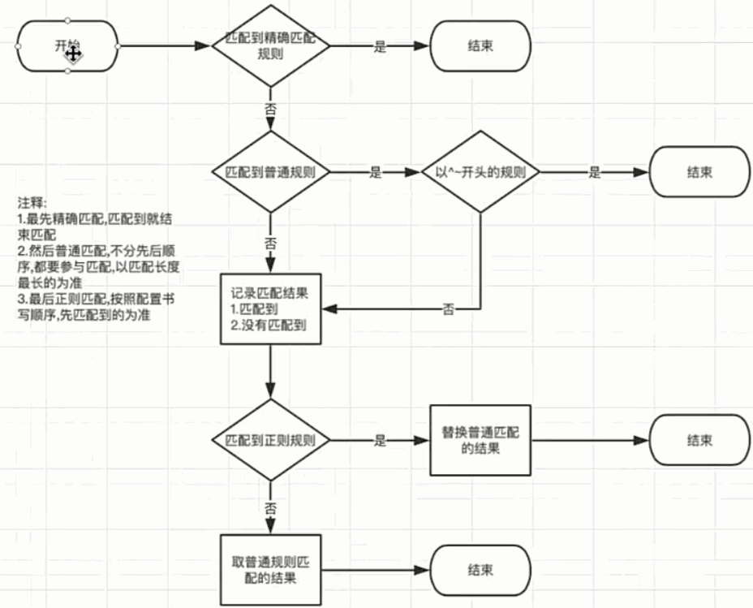
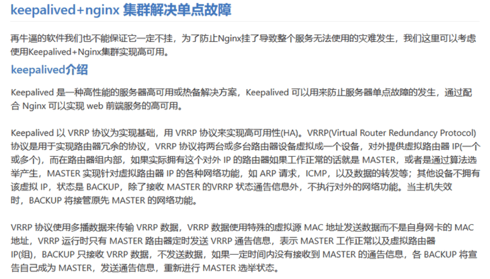

<!-- START doctoc generated TOC please keep comment here to allow auto update -->
<!-- DON'T EDIT THIS SECTION, INSTEAD RE-RUN doctoc TO UPDATE -->


- [Nginx 反向代理与负载均衡](#nginx-%E5%8F%8D%E5%90%91%E4%BB%A3%E7%90%86%E4%B8%8E%E8%B4%9F%E8%BD%BD%E5%9D%87%E8%A1%A1)
  - [一、配置详解](#%E4%B8%80%E9%85%8D%E7%BD%AE%E8%AF%A6%E8%A7%A3)
  - [二、路由匹配规则](#%E4%BA%8C%E8%B7%AF%E7%94%B1%E5%8C%B9%E9%85%8D%E8%A7%84%E5%88%99)
  - [三、反向代理](#%E4%B8%89%E5%8F%8D%E5%90%91%E4%BB%A3%E7%90%86)
  - [四、负载均衡](#%E5%9B%9B%E8%B4%9F%E8%BD%BD%E5%9D%87%E8%A1%A1)
  - [五、Nginx + Tomcat 实现集群](#%E4%BA%94nginx--tomcat-%E5%AE%9E%E7%8E%B0%E9%9B%86%E7%BE%A4)
  - [六、keepalived + nginx 集群解决单点故障](#%E5%85%ADkeepalived--nginx-%E9%9B%86%E7%BE%A4%E8%A7%A3%E5%86%B3%E5%8D%95%E7%82%B9%E6%95%85%E9%9A%9C)

<!-- END doctoc generated TOC please keep comment here to allow auto update -->

## Nginx 反向代理与负载均衡

该部分参考 [nginx之项目部署实战](http://yun.itheima.com/open/456.html?jingjiahmpz-pz-pc-biaoti)    [高可用的并发解决方案nginx+keepalived](http://yun.itheima.com/course/477.html)

该实验的测试环境为：windows 10、nginx-1.12.2。

### 一、配置详解

可参考 [Nginx 配置详解](./img/conf.png)
> https://www.runoob.com/w3cnote/nginx-setup-intro.html

例如：
```
server {
    listen       8000;
    # listen       somename:8080;
        server_name  localhost;

    location / {
        root   html/test;
        index  index.html index.htm;
    }
}
```

监听端口为8000，可通过localhost:8000访问该路由。一旦匹配则到html/test下找index.html等文件。

### 二、路由匹配规则

规则设定如下：




下面根据这个来搭建一个图片服务器。

在我的D:/Distribute/nginx/img文件夹里有一些图片，下面做如下配置：
```
server {
    listen       8002;
    server_name  localhost;

    location / {
        root   D:/Distribute/nginx/img;
    }
}
```
当我在浏览器中输入 http://localhost:8002/1.jpg ，浏览器内容如下：


### 三、反向代理

例如这个配置：
```
server {
    listen       8001;
    # listen       somename:8080;
        server_name  localhost;

    location / {
        proxy_pass http://localhost:8000; # 发送请求到其他的服务
    }
}
```
浏览器访问 http://localhost:8001/ 将访问到 http://localhost:8000/。

### 四、负载均衡

假设现在有两个路由：

```
server {
    listen       8000;
    server_name  localhost;

    location / {
        root   html/test;
        index  index.html index.htm;
    }
}

server {
    listen       8004;
    server_name  localhost;

    location / {
        root   html/test4;
        index  index.html index.htm;
    }
}
```

设置反向代理如下：

```
upstream mysvr { 
    server 127.0.0.1:8000;
    server 127.0.0.1:8004;
}

server {
    listen       8003;
    server_name  localhost;

    location / {
        proxy_pass http://mysvr;
    }
}
```
当在浏览器输入 http://localhost:8003/ 时，访问内容将转向 127.0.0.1:8000 和 127.0.0.1:8004 中的其中一个，这里是轮询方式的负载均衡。访问内容如下所示：


常用负载均衡算法如下：


### 五、Nginx + Tomcat 实现集群


配置如下：
```
upstream Tomcats { 
    server 127.0.0.1:8081;
    server 127.0.0.1:8082;
    server 127.0.0.1:8083;
}

server {
    listen       8006;
    server_name  localhost;

    location / {
        proxy_pass http://Tomcats;
    }
}
```
效果如下：


注意：事先要配置好三台tomcat并启动。

### 六、keepalived + nginx 集群解决单点故障



下面是设计思路：


可让keepalived来管理Nginx的健康状况。使用一主一从keepalived服务。用户从外部访问keepalived地址，通常情况下是通过Master keepalived来访问Nginx的，keepalived可以看作是一个路由网关。当Master keepalived中的Nginx挂了之后，slave keepalived的Ngeix就可以替换上了，这样可以做到一定的高可用。

