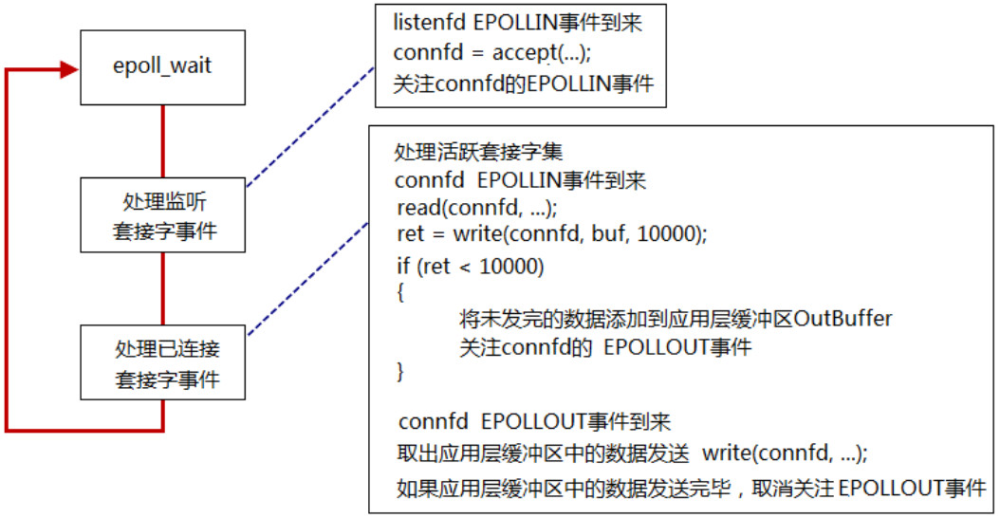
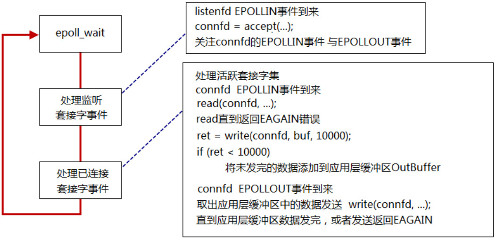
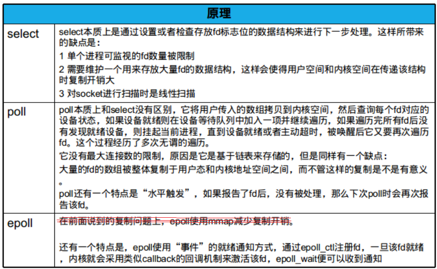
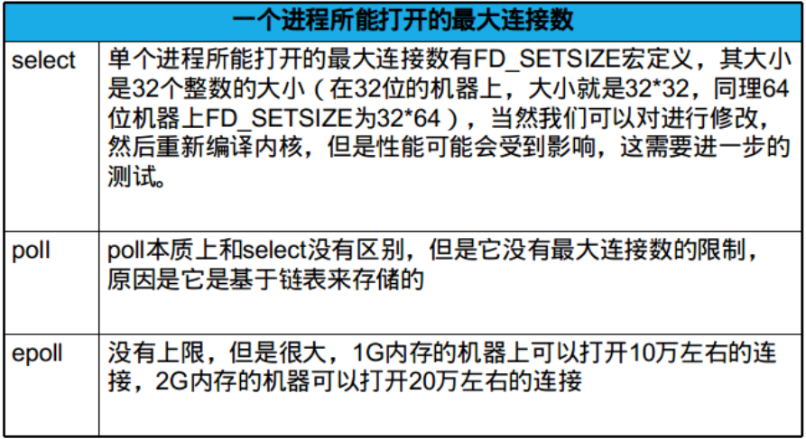
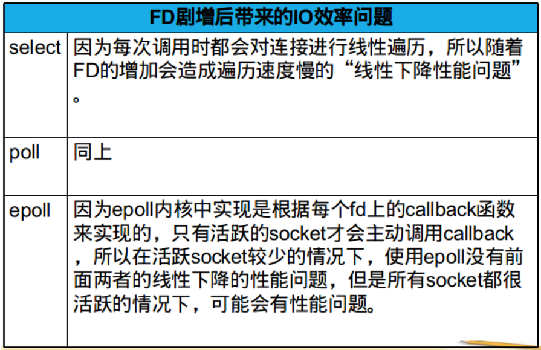
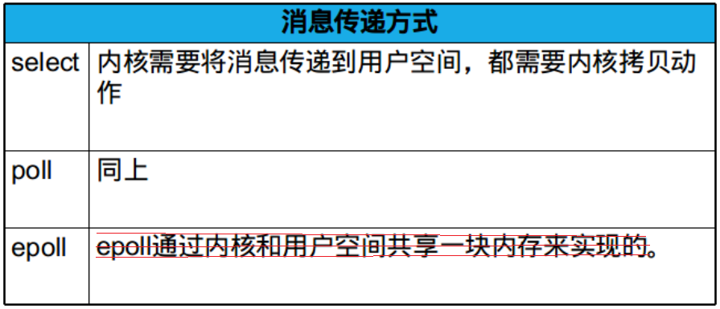

<!-- START doctoc generated TOC please keep comment here to allow auto update -->
<!-- DON'T EDIT THIS SECTION, INSTEAD RE-RUN doctoc TO UPDATE -->

- [EPOLL回顾](#epoll%E5%9B%9E%E9%A1%BE)
  - [一、操作函数](#%E4%B8%80%E6%93%8D%E4%BD%9C%E5%87%BD%E6%95%B0)
  - [二、两种触发模式](#%E4%BA%8C%E4%B8%A4%E7%A7%8D%E8%A7%A6%E5%8F%91%E6%A8%A1%E5%BC%8F)
    - [1、Level-Triggered](#1level-triggered)
    - [2、Edge-Triggered](#2edge-triggered)
  - [三、使用案例](#%E4%B8%89%E4%BD%BF%E7%94%A8%E6%A1%88%E4%BE%8B)
  - [四、select/poll/epoll对比](#%E5%9B%9Bselectpollepoll%E5%AF%B9%E6%AF%94)

<!-- END doctoc generated TOC please keep comment here to allow auto update -->

## EPOLL回顾

### 一、操作函数

```c
#include <sys/epoll.h>
int epoll_create(int size);
int epoll_create1(int flags);

int epoll_ctl(int epfd, int op, int fd, struct epoll_event *event);
int epoll_wait(int epfd, struct epoll_event *events, int maxevents, int timeout);

typedef union epoll_data {
	void    *ptr;
	int      fd;
	uint32_t u32;
	uint64_t u64;
} epoll_data_t;

struct epoll_event {
	uint32_t     events;	/* Epoll events */
	epoll_data_t data;	/* User data variable */
};
```

### 二、两种触发模式

* Level-Triggered
* Edge-Triggered

需要注意的是EPOLLIN和EPOLLOUT事件来临的时机：

* EPOLLIN事件：当内核中的socket接收缓冲区为空，则为低电平；内核中的socket接收缓冲区不为空，则为高电平。
* EPOLLOUT事件：内核中的socket发送缓冲区满了则为高电平，否则为低电平

epoll的LT为高电平触发；ET为边缘触发。

#### 1、Level-Triggered

工作模式和poll类似，工作方式如下图所示：



#### 2、Edge-Triggered



### 三、使用案例

epoll\src下有有一个C++风格的使用案例，有了前面《网络编程》和前章的poll回顾，理解该代码应该不难。

### 四、select/poll/epoll对比







