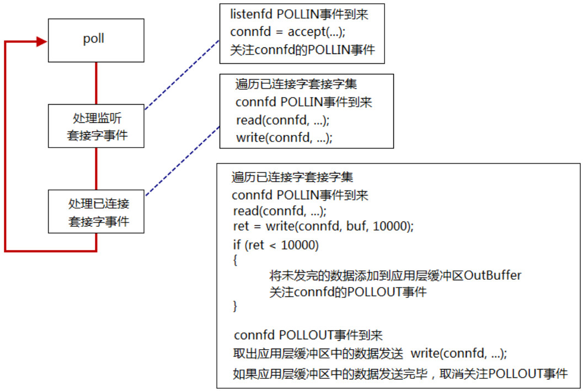
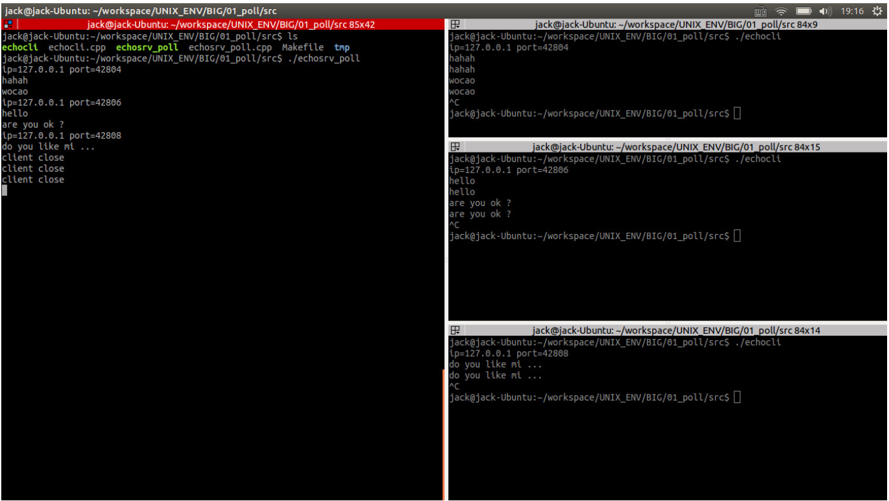

<!-- START doctoc generated TOC please keep comment here to allow auto update -->
<!-- DON'T EDIT THIS SECTION, INSTEAD RE-RUN doctoc TO UPDATE -->


- [POLL 回顾](#poll-%E5%9B%9E%E9%A1%BE)
  - [一、函数原型](#%E4%B8%80%E5%87%BD%E6%95%B0%E5%8E%9F%E5%9E%8B)
  - [二、poll使用基本流程](#%E4%BA%8Cpoll%E4%BD%BF%E7%94%A8%E5%9F%BA%E6%9C%AC%E6%B5%81%E7%A8%8B)
  - [三、使用案例（基于C++）](#%E4%B8%89%E4%BD%BF%E7%94%A8%E6%A1%88%E4%BE%8B%E5%9F%BA%E4%BA%8Ec)
  - [四、TIME_WAIT状态对大并发服务器的影响](#%E5%9B%9Btime_wait%E7%8A%B6%E6%80%81%E5%AF%B9%E5%A4%A7%E5%B9%B6%E5%8F%91%E6%9C%8D%E5%8A%A1%E5%99%A8%E7%9A%84%E5%BD%B1%E5%93%8D)

<!-- END doctoc generated TOC please keep comment here to allow auto update -->

## POLL 回顾

### 一、函数原型

```c
#include <poll.h>
int poll(struct pollfd *fds, nfds_t nfds, int timeout);

struct pollfd {
	int   fd;	/* file descriptor */
	short events;	/* requested events */
	short revents;	/* returned events */
};
```

### 二、poll使用基本流程



### 三、使用案例（基于C++）

在poll\src下里面有一个使用poll的回射服务器案例，业务逻辑和之前《网络编程》部分介绍的是一样，但与之不同的是使用c++风格来编写的，此外也做了一些“额外的增强”。下面将着重介绍这些不同的地方。

这要从poll的函数参数说起，poll的第一个参数是pollfd结构体的集合，该集合保存了注册被关注文件描述符及其事件，使用c语言风格一般是使用一个静态的数组来保存，第二个参数则注册的文件描述符数量，等于该数组的长度。

如果使用C++编程风格则可以使用vector替代静态数组，C++保证vector的内部和C语言风格静态数组是一样的，该案例的做法如下：
```c
typedef std::vector<struct pollfd> PollFdList;

nready = poll(&*pollfds.begin(), pollfds.size(), -1);
```
如果需要添加新的pollfd结构，则：
```c
...

struct pollfd pfd;
pfd.fd = listenfd;
pfd.events = POLLIN;

PollFdList pollfds;
pollfds.push_back(pfd);

...

pfd.fd = connfd;
pfd.events = POLLIN;
pfd.revents = 0;
pollfds.push_back(pfd);

...
```

如果需要遍历所有文件描述符，则：

```c
for (PollFdList::iterator it=pollfds.begin()+1; it != pollfds.end() && nready >0; ++it)
{
	if (it->revents & POLLIN)
	{
		--nready;
		connfd = it->fd;
		char buf[1024] = {0};
		int ret = read(connfd, buf, 1024);
		if (ret == -1)
			ERR_EXIT("read");
		if (ret == 0)
		{
			std::cout<<"client close"<<std::endl;
			it = pollfds.erase(it);
			--it;

			close(connfd);
			continue;
		}

		std::cout<<buf;
		write(connfd, buf, strlen(buf));
		
	}
}
```
由于vector是动态增长的，所以不用向之前C语言那样为数组预先定义一个固定的长度。但是如果vector长度增长过快，也就是说系统内文件描述符有被耗尽的风险，这是可以使用该策略来避免发生错误：
```c
int idlefd = open("/dev/null", O_RDONLY | O_CLOEXEC);
...
connfd = accept4(listenfd, (struct sockaddr*)&peeraddr, &peerlen, SOCK_NONBLOCK | SOCK_CLOEXEC);

if (connfd == -1)
{
	if (errno == EMFILE)
	{
		close(idlefd);
		idlefd = accept(listenfd, NULL, NULL);
		close(idlefd);
		idlefd = open("/dev/null", O_RDONLY | O_CLOEXEC);
		continue;
	}
	else
		ERR_EXIT("accept4");
}
```
可以在初始化程序时便创建一个文件描述符idlefd，该文件描述符指向"/dev/null"黑洞。当系统文件描述符耗尽时accetp/accetp4将返回-1，并设置errno为EMFILE。accept(2)返回EMFILE的处理有如下几种方法：

* 调高进程文件描述符数目
* 死等
* 退出程序
* 关闭监听套接字。那什么时候重新打开呢？
* 如果是epoll模型，可以改用edge trigger。问题是如果漏掉了一次accept(2)，程序再也不会收到新连接。
* 准备一个空闲的文件描述符。遇到这种情况，先关闭这个空闲文件，获得一个文件描述符名额;再accept(2)拿到socket连接的文件描述符；随后立刻close(2)，这样就优雅地断开了与客户端的连接；最后重新打开空闲文件，把“坑”填上，以备再次出现这种情况时使用。

这里选择最后一种方法。这时一开始创建的idlefd便开始发挥作用了，它相当于一个“占位符”作用，程序会在文件描述符耗尽时关闭idlefd，这样系统又就又有了一个可用的文件描述符，这时可以接受客户端的连接。但是，该连接将马上被关闭，然后idlefd还原开始状态，指向"/dev/null"，以此优雅地断开与客户端连接。

除了上面提到的内容以外，该程序还使用了：
```c
if ((listenfd = socket(PF_INET, SOCK_STREAM | SOCK_NONBLOCK | SOCK_CLOEXEC, IPPROTO_TCP)) < 0)
		ERR_EXIT("socket");
```
和
```c
connfd = accept4(listenfd, (struct sockaddr*)&peeraddr, &peerlen, SOCK_NONBLOCK | SOCK_CLOEXEC);
```
socket函数可在创建是设置监听套接字非阻塞和自动关闭；accetp4系统调用也可以在连接成功时给连接套接字设置非阻塞和自动关闭。

该案例运行结果如下：



### 四、TIME_WAIT状态对大并发服务器的影响

应该尽可能在服务器端避免TIME_WAIT状态。如果服务器端主动断开连接（先于client调用close），服务器就会进入TIME_WAIT状态。

协议设计上应该让客户端主动断开连接，这样就把TIME_WAIT状态分散到大量的客户端，如果客户端不活跃了，一些（恶意的）客户端不断开连接，这样就会占用服务器的连接资源，所以服务器端也需要有一种机制来踢掉不活跃的连接。