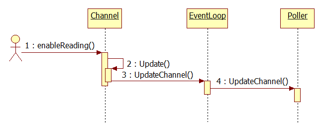
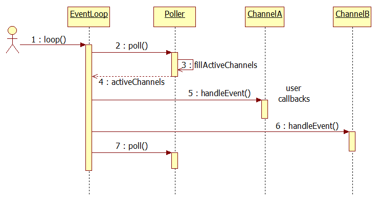
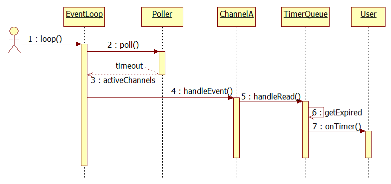
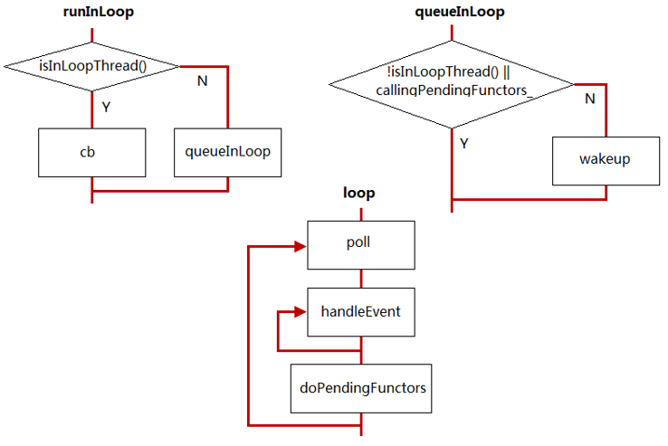

<!-- START doctoc generated TOC please keep comment here to allow auto update -->
<!-- DON'T EDIT THIS SECTION, INSTEAD RE-RUN doctoc TO UPDATE -->

- [muduo 事件监听总结](#muduo-%E4%BA%8B%E4%BB%B6%E7%9B%91%E5%90%AC%E6%80%BB%E7%BB%93)
  - [1、Channel及其文件描述符如何加入到Poller中](#1channel%E5%8F%8A%E5%85%B6%E6%96%87%E4%BB%B6%E6%8F%8F%E8%BF%B0%E7%AC%A6%E5%A6%82%E4%BD%95%E5%8A%A0%E5%85%A5%E5%88%B0poller%E4%B8%AD)
  - [2、EventLoop如何获取活跃的Channel并处理相关事件](#2eventloop%E5%A6%82%E4%BD%95%E8%8E%B7%E5%8F%96%E6%B4%BB%E8%B7%83%E7%9A%84channel%E5%B9%B6%E5%A4%84%E7%90%86%E7%9B%B8%E5%85%B3%E4%BA%8B%E4%BB%B6)
  - [3、EventLoop如何处理定时器](#3eventloop%E5%A6%82%E4%BD%95%E5%A4%84%E7%90%86%E5%AE%9A%E6%97%B6%E5%99%A8)
  - [4、EventLoop与跨线程调用函数](#4eventloop%E4%B8%8E%E8%B7%A8%E7%BA%BF%E7%A8%8B%E8%B0%83%E7%94%A8%E5%87%BD%E6%95%B0)

<!-- END doctoc generated TOC please keep comment here to allow auto update -->

## muduo 事件监听总结

### 1、Channel及其文件描述符如何加入到Poller中

### 2、EventLoop如何获取活跃的Channel并处理相关事件

### 3、EventLoop如何处理定时器

### 4、EventLoop与跨线程调用函数

* 调用queueInLoop的线程不是当前IO线程需要唤醒
* 或者调用queueInLoop的线程是当前IO线程，并且此时正在调用pending functor，需要唤醒
* 只有IO线程的事件回调中调用queueInLoop才不需要唤醒
