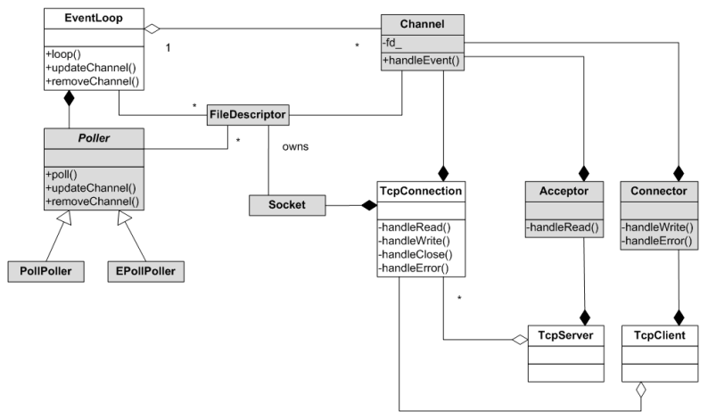

## 阶段性总结

到这一篇，说明Muduo的核心（也是绝大部分）代码就分析完了，如果想要从更细节了解这些代码之间的调用关系，可以参考 [图解Muduo网络库
](https://github.com/hujiese/Graphical-Muduo-).

在后续的篇章将介绍muduo的一些使用案例，例如HTTP服务器，消息中间件等。

一张图总结服务/客户端调用关系：

* TcpConnection负责一个客户端连接成功套接字
* Acceptor负责一个服务器listen套接字
* Connector负责一个客户端connect套接字
* TcpServer中持有Acceptor，通过Acceptor获取新的连接套接字，然后TcpServer会为该连接套接字建立一个TcpConnection，然后往该TcpConnection中传递用户需要TcpServer相应事件对应的函数，用户传入的函数其实是和TcpConnection中的Channel间接绑定，然后在事件触发后被Channel间接执行。
* TcpClient中持有Connector，通过Connector里的Channel绑定一个连接套接字，在连接成功后，Connector会将该套接字转让给TcpClient，TcpClient中会为该连接套接字建立一个TcpConnection，然后往该TcpConnection中传递用户需要TcpClient相应事件对应的函数，用户传入的函数其实是和TcpConnection中的Channel间接绑定，然后在事件触发后被Channel间接执行。