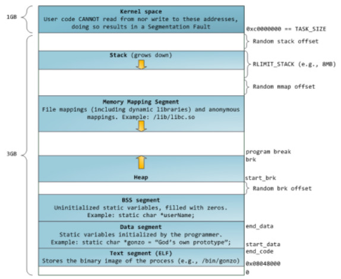

<!-- START doctoc generated TOC please keep comment here to allow auto update -->
<!-- DON'T EDIT THIS SECTION, INSTEAD RE-RUN doctoc TO UPDATE -->

- [牛客网C/C++语言基础面经整理](#%E7%89%9B%E5%AE%A2%E7%BD%91cc%E8%AF%AD%E8%A8%80%E5%9F%BA%E7%A1%80%E9%9D%A2%E7%BB%8F%E6%95%B4%E7%90%86)
  - [一、语言基础](#%E4%B8%80%E8%AF%AD%E8%A8%80%E5%9F%BA%E7%A1%80)
    - [static关键字的作用](#static%E5%85%B3%E9%94%AE%E5%AD%97%E7%9A%84%E4%BD%9C%E7%94%A8)
    - [C++和C的区别](#c%E5%92%8Cc%E7%9A%84%E5%8C%BA%E5%88%AB)
    - [c++中四种cast转换](#c%E4%B8%AD%E5%9B%9B%E7%A7%8Dcast%E8%BD%AC%E6%8D%A2)
    - [C/C++ 中指针和引用的区别](#cc-%E4%B8%AD%E6%8C%87%E9%92%88%E5%92%8C%E5%BC%95%E7%94%A8%E7%9A%84%E5%8C%BA%E5%88%AB)
    - [c++中的四个智能指针](#c%E4%B8%AD%E7%9A%84%E5%9B%9B%E4%B8%AA%E6%99%BA%E8%83%BD%E6%8C%87%E9%92%88)
    - [数组和指针的区别](#%E6%95%B0%E7%BB%84%E5%92%8C%E6%8C%87%E9%92%88%E7%9A%84%E5%8C%BA%E5%88%AB)
    - [野指针是什么](#%E9%87%8E%E6%8C%87%E9%92%88%E6%98%AF%E4%BB%80%E4%B9%88)
    - [智能指针有没有内存泄露的情况](#%E6%99%BA%E8%83%BD%E6%8C%87%E9%92%88%E6%9C%89%E6%B2%A1%E6%9C%89%E5%86%85%E5%AD%98%E6%B3%84%E9%9C%B2%E7%9A%84%E6%83%85%E5%86%B5)
    - [为什么析构函数必须是虚函数](#%E4%B8%BA%E4%BB%80%E4%B9%88%E6%9E%90%E6%9E%84%E5%87%BD%E6%95%B0%E5%BF%85%E9%A1%BB%E6%98%AF%E8%99%9A%E5%87%BD%E6%95%B0)
    - [为什么C++默认的析构函数不是虚函数](#%E4%B8%BA%E4%BB%80%E4%B9%88c%E9%BB%98%E8%AE%A4%E7%9A%84%E6%9E%90%E6%9E%84%E5%87%BD%E6%95%B0%E4%B8%8D%E6%98%AF%E8%99%9A%E5%87%BD%E6%95%B0)
    - [函数指针](#%E5%87%BD%E6%95%B0%E6%8C%87%E9%92%88)
    - [C++中析构函数的作用](#c%E4%B8%AD%E6%9E%90%E6%9E%84%E5%87%BD%E6%95%B0%E7%9A%84%E4%BD%9C%E7%94%A8)
    - [静态函数和虚函数的区别](#%E9%9D%99%E6%80%81%E5%87%BD%E6%95%B0%E5%92%8C%E8%99%9A%E5%87%BD%E6%95%B0%E7%9A%84%E5%8C%BA%E5%88%AB)
    - [重载和覆盖](#%E9%87%8D%E8%BD%BD%E5%92%8C%E8%A6%86%E7%9B%96)
    - [strcpy和strlen](#strcpy%E5%92%8Cstrlen)
    - [虚函数和多态](#%E8%99%9A%E5%87%BD%E6%95%B0%E5%92%8C%E5%A4%9A%E6%80%81)
    - [++i和i++的区别与实现](#i%E5%92%8Ci%E7%9A%84%E5%8C%BA%E5%88%AB%E4%B8%8E%E5%AE%9E%E7%8E%B0)
    - [写个函数在main函数执行前先运行](#%E5%86%99%E4%B8%AA%E5%87%BD%E6%95%B0%E5%9C%A8main%E5%87%BD%E6%95%B0%E6%89%A7%E8%A1%8C%E5%89%8D%E5%85%88%E8%BF%90%E8%A1%8C)
    - [有段代码写成了下边这样，如果在只修改一个字符的前提下，使代码输出20个hello](#%E6%9C%89%E6%AE%B5%E4%BB%A3%E7%A0%81%E5%86%99%E6%88%90%E4%BA%86%E4%B8%8B%E8%BE%B9%E8%BF%99%E6%A0%B7%E5%A6%82%E6%9E%9C%E5%9C%A8%E5%8F%AA%E4%BF%AE%E6%94%B9%E4%B8%80%E4%B8%AA%E5%AD%97%E7%AC%A6%E7%9A%84%E5%89%8D%E6%8F%90%E4%B8%8B%E4%BD%BF%E4%BB%A3%E7%A0%81%E8%BE%93%E5%87%BA20%E4%B8%AAhello)
    - [智能指针shared_ptr的实现](#%E6%99%BA%E8%83%BD%E6%8C%87%E9%92%88shared_ptr%E7%9A%84%E5%AE%9E%E7%8E%B0)
    - [以下四行代码的区别是什么？](#%E4%BB%A5%E4%B8%8B%E5%9B%9B%E8%A1%8C%E4%BB%A3%E7%A0%81%E7%9A%84%E5%8C%BA%E5%88%AB%E6%98%AF%E4%BB%80%E4%B9%88)
    - [C++里是怎么定义常量的？常量存放在内存的哪个位置？](#c%E9%87%8C%E6%98%AF%E6%80%8E%E4%B9%88%E5%AE%9A%E4%B9%89%E5%B8%B8%E9%87%8F%E7%9A%84%E5%B8%B8%E9%87%8F%E5%AD%98%E6%94%BE%E5%9C%A8%E5%86%85%E5%AD%98%E7%9A%84%E5%93%AA%E4%B8%AA%E4%BD%8D%E7%BD%AE)
    - [const修饰成员函数的目的](#const%E4%BF%AE%E9%A5%B0%E6%88%90%E5%91%98%E5%87%BD%E6%95%B0%E7%9A%84%E7%9B%AE%E7%9A%84)
    - [同时定义了两个函数，一个带const，一个不带，会有问题吗](#%E5%90%8C%E6%97%B6%E5%AE%9A%E4%B9%89%E4%BA%86%E4%B8%A4%E4%B8%AA%E5%87%BD%E6%95%B0%E4%B8%80%E4%B8%AA%E5%B8%A6const%E4%B8%80%E4%B8%AA%E4%B8%8D%E5%B8%A6%E4%BC%9A%E6%9C%89%E9%97%AE%E9%A2%98%E5%90%97)
    - [隐式类型转换](#%E9%9A%90%E5%BC%8F%E7%B1%BB%E5%9E%8B%E8%BD%AC%E6%8D%A2)
    - [C++函数栈空间的最大值](#c%E5%87%BD%E6%95%B0%E6%A0%88%E7%A9%BA%E9%97%B4%E7%9A%84%E6%9C%80%E5%A4%A7%E5%80%BC)
    - [extern“C”](#externc)
    - [new/delete与malloc/free的区别是什么](#newdelete%E4%B8%8Emallocfree%E7%9A%84%E5%8C%BA%E5%88%AB%E6%98%AF%E4%BB%80%E4%B9%88)
    - [RTTI](#rtti)
    - [虚函数表具体是怎样实现运行时多态](#%E8%99%9A%E5%87%BD%E6%95%B0%E8%A1%A8%E5%85%B7%E4%BD%93%E6%98%AF%E6%80%8E%E6%A0%B7%E5%AE%9E%E7%8E%B0%E8%BF%90%E8%A1%8C%E6%97%B6%E5%A4%9A%E6%80%81)
    - [C语言是怎么进行函数调用的](#c%E8%AF%AD%E8%A8%80%E6%98%AF%E6%80%8E%E4%B9%88%E8%BF%9B%E8%A1%8C%E5%87%BD%E6%95%B0%E8%B0%83%E7%94%A8%E7%9A%84)
    - [C语言参数压栈顺序](#c%E8%AF%AD%E8%A8%80%E5%8F%82%E6%95%B0%E5%8E%8B%E6%A0%88%E9%A1%BA%E5%BA%8F)
    - [C++中拷贝赋值函数的形参能否进行值传递](#c%E4%B8%AD%E6%8B%B7%E8%B4%9D%E8%B5%8B%E5%80%BC%E5%87%BD%E6%95%B0%E7%9A%84%E5%BD%A2%E5%8F%82%E8%83%BD%E5%90%A6%E8%BF%9B%E8%A1%8C%E5%80%BC%E4%BC%A0%E9%80%92)
    - [C++中类成员的访问权限](#c%E4%B8%AD%E7%B1%BB%E6%88%90%E5%91%98%E7%9A%84%E8%AE%BF%E9%97%AE%E6%9D%83%E9%99%90)
    - [struct和class的区别](#struct%E5%92%8Cclass%E7%9A%84%E5%8C%BA%E5%88%AB)
    - [C++类内可以定义引用数据成员吗](#c%E7%B1%BB%E5%86%85%E5%8F%AF%E4%BB%A5%E5%AE%9A%E4%B9%89%E5%BC%95%E7%94%A8%E6%95%B0%E6%8D%AE%E6%88%90%E5%91%98%E5%90%97)
  - [二、STL容器与算法](#%E4%BA%8Cstl%E5%AE%B9%E5%99%A8%E4%B8%8E%E7%AE%97%E6%B3%95)
    - [map和set有什么区别](#map%E5%92%8Cset%E6%9C%89%E4%BB%80%E4%B9%88%E5%8C%BA%E5%88%AB)
    - [STL的allocator](#stl%E7%9A%84allocator)
    - [STL迭代器删除元素](#stl%E8%BF%AD%E4%BB%A3%E5%99%A8%E5%88%A0%E9%99%A4%E5%85%83%E7%B4%A0)
    - [map数据存放形式](#map%E6%95%B0%E6%8D%AE%E5%AD%98%E6%94%BE%E5%BD%A2%E5%BC%8F)
    - [STL基本组成](#stl%E5%9F%BA%E6%9C%AC%E7%BB%84%E6%88%90)
    - [STL中map与unordered_map](#stl%E4%B8%ADmap%E4%B8%8Eunordered_map)
    - [vector和list的区别](#vector%E5%92%8Clist%E7%9A%84%E5%8C%BA%E5%88%AB)
    - [STL中迭代器的作用，有指针为何还要迭代器](#stl%E4%B8%AD%E8%BF%AD%E4%BB%A3%E5%99%A8%E7%9A%84%E4%BD%9C%E7%94%A8%E6%9C%89%E6%8C%87%E9%92%88%E4%B8%BA%E4%BD%95%E8%BF%98%E8%A6%81%E8%BF%AD%E4%BB%A3%E5%99%A8)
    - [STL迭代器如何删除元素](#stl%E8%BF%AD%E4%BB%A3%E5%99%A8%E5%A6%82%E4%BD%95%E5%88%A0%E9%99%A4%E5%85%83%E7%B4%A0)
    - [STL里resize和reserve的区别](#stl%E9%87%8Cresize%E5%92%8Creserve%E7%9A%84%E5%8C%BA%E5%88%AB)
  - [三、编译与底层](#%E4%B8%89%E7%BC%96%E8%AF%91%E4%B8%8E%E5%BA%95%E5%B1%82)
    - [一个C++源文件从文本到可执行文件经历的过程](#%E4%B8%80%E4%B8%AAc%E6%BA%90%E6%96%87%E4%BB%B6%E4%BB%8E%E6%96%87%E6%9C%AC%E5%88%B0%E5%8F%AF%E6%89%A7%E8%A1%8C%E6%96%87%E4%BB%B6%E7%BB%8F%E5%8E%86%E7%9A%84%E8%BF%87%E7%A8%8B)
    - [include头文件的顺序以及双引号””和尖括号<>的区别](#include%E5%A4%B4%E6%96%87%E4%BB%B6%E7%9A%84%E9%A1%BA%E5%BA%8F%E4%BB%A5%E5%8F%8A%E5%8F%8C%E5%BC%95%E5%8F%B7%E5%92%8C%E5%B0%96%E6%8B%AC%E5%8F%B7%E7%9A%84%E5%8C%BA%E5%88%AB)
    - [malloc的原理，brk系统调用和mmap系统调用的作用](#malloc%E7%9A%84%E5%8E%9F%E7%90%86brk%E7%B3%BB%E7%BB%9F%E8%B0%83%E7%94%A8%E5%92%8Cmmap%E7%B3%BB%E7%BB%9F%E8%B0%83%E7%94%A8%E7%9A%84%E4%BD%9C%E7%94%A8)
    - [C++/C的内存分配](#cc%E7%9A%84%E5%86%85%E5%AD%98%E5%88%86%E9%85%8D)
    - [如何判断内存泄漏](#%E5%A6%82%E4%BD%95%E5%88%A4%E6%96%AD%E5%86%85%E5%AD%98%E6%B3%84%E6%BC%8F)
    - [段错误](#%E6%AE%B5%E9%94%99%E8%AF%AF)
    - [内存泄漏](#%E5%86%85%E5%AD%98%E6%B3%84%E6%BC%8F)

<!-- END doctoc generated TOC please keep comment here to allow auto update -->

# 牛客网C/C++语言基础面经整理

## 一、语言基础

**看该部分面经前，强烈推荐看《三、C_C++语言基础》部分的基础部分，不然很多答案会无法理解。**

### static关键字的作用

**1、全局静态变量**

在全局变量前加上关键字static，全局变量就定义成一个全局静态变量。

静态存储区，在整个程序运行期间一直存在。

初始化：未经初始化的全局静态变量会被自动初始化为0（自动对象的值是任意的，除非他被显式初始化）。

作用域：全局静态变量在声明他的文件之外是不可见的，准确地说是从定义之处开始，到文件结尾。

**2、 局部静态变量**

在局部变量之前加上关键字static，局部变量就成为一个局部静态变量。

内存中的位置：静态存储区。

初始化：未经初始化的全局静态变量会被自动初始化为0（自动对象的值是任意的，除非他被显式初始化）。

作用域：作用域仍为局部作用域，当定义它的函数或者语句块结束的时候，作用域结束。但是当局部静态变量离开作用域后，并没有销毁，而是仍然驻留在内存当中，只不过我们不能再对它进行访问，直到该函数再次被调用，并且值不变。

**3、 静态函数**

在函数返回类型前加static，函数就定义为静态函数。函数的定义和声明在默认情况下都是extern的，但静态函数只是在声明他的文件当中可见，不能被其他文件所用。

函数的实现使用static修饰，那么这个函数只可在本cpp内使用，不会同其他cpp中的同名函数引起冲突。

warning：不要再头文件中声明static的全局函数，不要在cpp内声明非static的全局函数，如果你要在多个cpp中复用该函数，就把它的声明提到头文件里去，否则cpp内部声明需加上static修饰。

**4、类的静态成员**

在类中，静态成员可以实现多个对象之间的数据共享，并且使用静态数据成员还不会破坏隐藏的原则，即保证了安全性。因此，静态成员是类的所有对象中共享的成员，而不是某个对象的成员。对多个对象来说，静态数据成员只存储一处，供所有对象共用。

**5、类的静态函数**

静态成员函数和静态数据成员一样，它们都属于类的静态成员，它们都不是对象成员。因此，对静态成员的引用不需要用对象名。

在静态成员函数的实现中不能直接引用类中说明的非静态成员，可以引用类中说明的静态成员（这点非常重要）。如果静态成员函数中要引用非静态成员时，可通过对象来引用。从中可看出，调用静态成员函数使用如下格式：<类名>::<静态成员函数名>(<参数表>)。

### C++和C的区别

**设计思想上：**

C++是面向对象的语言，而C是面向过程的结构化编程语言

**语法上：**

C++具有封装、继承和多态三种特性。

C++相比C，增加多许多类型安全的功能，比如强制类型转换。

C++支持范式编程，比如模板类、函数模板等。

### c++中四种cast转换

C++中四种类型转换是：static_cast, dynamic_cast, const_cast, reinterpret_cast

**1、const_cast**

用于将const变量转为非const（**只能是指针或者引用** const_cast<A*>(&a)）。

**2、static_cast**

用于各种隐式转换，比如非const转const，void*转指针等, static_cast能用于多态向上转化，如果向下转能成功但是不安全，结果未知。

**3、dynamic_cast**

用于动态类型转换。只能用于含有虚函数的类，用于类层次间的向上和向下转化。只能转指针或引用。向下转化时，如果是非法的对于指针返回NULL，对于引用抛异常。要深入了解内部转换的原理。

向上转换：指的是子类向基类的转换

向下转换：指的是基类向子类的转换

它通过判断在执行到该语句的时候变量的运行时类型和要转换的类型是否相同来判断是否能够进行向下转换。

**4、reinterpret_cast**

几乎什么都可以转，比如将int转指针，可能会出问题，尽量少用（将A类的内存空间强行转换为B类）。

**为什么不使用C的强制转换**

C的强制转换表面上看起来功能强大什么都能转，但是转化不够明确，不能进行错误检查，容易出错。

### C/C++ 中指针和引用的区别

**引用**

C++是C语言的继承，它可进行过程化程序设计，又可以进行以抽象数据类型为特点的基于对象的程序设计，还可以进行以继承和多态为特点的面向对象的程序设计。引用就是C++对C语言的重要扩充。引用就是某一变量的一个别名，对引用的操作与对变量直接操作完全一样。引用的声明方法：类型标识符 &引用名=目标变量名；引用引入了对象的一个同义词。定义引用的表示方法与定义指针相似，只是用&代替了*。

**指针**

指针利用地址，它的值直接指向存在电脑存储器中另一个地方的值。由于通过地址能找到所需的变量单元，可以说，地址指向该变量单元。因此，将地址形象化的称为“指针”。意思是通过它能找到以它为地址的内存单元。

**区别：**

1、指针有自己的一块空间，而引用只是一个别名；

2、使用sizeof看一个指针的大小是4，而引用则是被引用对象的大小；

3、指针可以被初始化为NULL，而引用必须被初始化且必须是一个已有对象 的引用；

4、作为参数传递时，指针需要被解引用才可以对对象进行操作，而直接对引 用的修改都会改变引用所指向的对象；

5、可以有const指针，但是没有const引用；

6、指针在使用中可以指向其它对象，但是引用只能是一个对象的引用，不能 被改变；

7、指针可以有多级指针（**p），而引用至于一级；

8、指针和引用使用++运算符的意义不一样；

9、如果返回动态内存分配的对象或者内存，必须使用指针，引用可能引起内存泄露。

### c++中的四个智能指针

**更多详细的关于这四个指针的细节和用法请务必参考《3、C_C++语言》中C++11智能指针相关专题。**

C++里面的四个智能指针: auto_ptr, shared_ptr, weak_ptr, unique_ptr 其中后三个是c++11支持，并且第一个已经被11弃用。

**为什么要使用智能指针**

智能指针的作用是管理一个指针，因为存在以下这种情况：申请的空间在函数结束时忘记释放，造成内存泄漏。使用智能指针可以很大程度上的避免这个问题，因为智能指针就是一个类，当超出了类的作用域是，类会自动调用析构函数，析构函数会自动释放资源。所以智能指针的作用原理就是在函数结束时自动释放内存空间，不需要手动释放内存空间。

1、auto_ptr（c++98的方案，cpp11已经抛弃）

采用所有权模式。

```cpp
auto_ptr< string> p1 (new string ("I reigned lonely as a cloud.”));
auto_ptr<string> p2;
p2 = p1; //auto_ptr不会报错.
```

此时不会报错，p2剥夺了p1的所有权，但是当程序运行时访问p1将会报错。所以auto_ptr的缺点是：存在潜在的内存崩溃问题！

2、 unique_ptr（替换auto_ptr）

unique_ptr实现独占式拥有或严格拥有概念，保证同一时间内只有一个智能指针可以指向该对象。它对于避免资源泄露(例如“以new创建对象后因为发生异常而忘记调用delete”)特别有用。

采用所有权模式，还是上面那个例子

```cpp
unique_ptr<string> p3 (new string ("auto"));   
unique_ptr<string> p4;           
p4 = p3;//此时会报错！！
```

编译器认为p4=p3非法，避免了p3不再指向有效数据的问题。因此，unique_ptr比auto_ptr更安全。

另外unique_ptr还有更聪明的地方：当程序试图将一个 unique_ptr 赋值给另一个时，如果源 unique_ptr 是个临时右值，编译器允许这么做；如果源 unique_ptr 将存在一段时间，编译器将禁止这么做，比如：

```cpp
unique_ptr<string> pu1(new string ("hello world"));
unique_ptr<string> pu2;
pu2 = pu1;                                      // #1 not allowed
unique_ptr<string> pu3;
pu3 = unique_ptr<string>(new string ("You"));   // #2 allowed
```

其中#1留下悬挂的unique_ptr(pu1)，这可能导致危害。而#2不会留下悬挂的unique_ptr，因为它调unique_ptr 的构造函数，该构造函数创建的临时对象在其所有权让给 pu3 后就会被销毁。这种随情况而已的行为表明，unique_ptr 优于允许两种赋值的auto_ptr 。

注：如果确实想执行类似与#1的操作，要安全的重用这种指针，可给它赋新值。C++有一个标准库函数**std::move()，让你能够将一个unique_ptr赋给另一个**。例如：

```cpp
unique_ptr<string> ps1, ps2;
ps1 = demo("hello");
ps2 = move(ps1);
ps1 = demo("alexia");
cout << *ps2 << *ps1 << endl;
```

**3、shared_ptr**

shared_ptr实现共享式拥有概念。多个智能指针可以指向相同对象，该对象和其相关资源会在“最后一个引用被销毁”时候释放。从名字share就可以看出了资源可以被多个指针共享，它使用计数机制来表明资源被几个指针共享。可以通过成员函数use_count()来查看资源的所有者个数。除了可以通过new来构造，还可以通过传入auto_ptr, unique_ptr,weak_ptr来构造。当我们调用release()时，当前指针会释放资源所有权，计数减一。当计数等于0时，资源会被释放。

shared_ptr 是为了解决 auto_ptr 在对象所有权上的局限性(auto_ptr 是独占的), 在使用引用计数的机制上提供了可以共享所有权的智能指针。

**4、weak_ptr**

weak_ptr 是一种不控制对象生命周期的智能指针, 它指向一个 shared_ptr 管理的对象. 进行该对象的内存管理的是那个强引用的 shared_ptr. weak_ptr只是提供了对管理对象的一个访问手段。weak_ptr 设计的目的是为配合 shared_ptr 而引入的一种智能指针来协助 shared_ptr 工作, 它只可以从一个 shared_ptr 或另一个 weak_ptr 对象构造, 它的构造和析构不会引起引用记数的增加或减少。

weak_ptr是用来解决shared_ptr相互引用时的死锁问题,如果说两个shared_ptr相互引用,那么这两个指针的引用计数永远不可能下降为0,资源永远不会释放。它是对对象的一种弱引用，不会增加对象的引用计数，和shared_ptr之间可以相互转化，shared_ptr可以直接赋值给它，它可以通过调用lock函数来获得shared_ptr。

```cpp
class B;
class A
{
public:
shared_ptr<B> pb_;
    ~A()
    {
        cout<<"A delete\n";
    }
};
class B
{
public:
shared_ptr<A> pa_;
    ~B()
    {
        cout<<"B delete\n";
    }
};
void fun()
{
    shared_ptr<B> pb(new B());
    shared_ptr<A> pa(new A());
    pb->pa_ = pa;
    pa->pb_ = pb;
    cout<<pb.use_count()<<endl;
    cout<<pa.use_count()<<endl;
}
int main()
{
    fun();
    return 0;
}
```

可以看到fun函数中pa ，pb之间互相引用，两个资源的引用计数为2，当要跳出函数时，智能指针pa，pb析构时两个资源引用计数会减一，但是两者引用计数还是为1，导致跳出函数时资源没有被释放（A B的析构函数没有被调用），如果把其中一个改为weak_ptr就可以了，我们把类A里面的shared_ptr pb_; 改为weak_ptr pb_; 运行结果如下，这样的话，资源B的引用开始就只有1，当pb析构时，B的计数变为0，B得到释放，B释放的同时也会使A的计数减一，同时pa析构时使A的计数减一，那么A的计数为0，A得到释放。

注意的是我们不能通过weak_ptr直接访问对象的方法，比如B对象中有一个方法print(),我们不能这样访问，pa->pb_->print(); 英文pb_是一个weak_ptr，应该先把它转化为shared_ptr,如：shared_ptr p = pa->pb_.lock(); p->print();

### 数组和指针的区别

指针和数组的主要区别如下：

| 指针                                                         | 数组                                 |
| ------------------------------------------------------------ | ------------------------------------ |
| 保存数据的地址                                               | 保存数据                             |
| 间接访问数据，首先获得指针的内容，然后将其作为地址，从该地址中提取数据 | 直接访问数据，                       |
| 通常用于动态的数据结构                                       | 通常用于固定数目且数据类型相同的元素 |
| 通过Malloc分配内存，free释放内存                             | 隐式的分配和删除                     |
| 通常指向匿名数据，操作匿名函数                               | 自身即为数据名                       |

**补充：**

当然，一个指针也可以指向一个数组。数组定义好之后，数组的地址就确定了。指针是个变量，和int之类的一样，指针也是在栈上分配空间，但其空间里的内容是一个地址，该地址可能是指向一块栈上的空间，也可能是堆上的空间。

### 野指针是什么

野指针就是指向一个已删除的对象或者未申请访问受限内存区域的指针。

例如：

```cpp
delete p;
```

此时p指向的空间被释放了，但是p里的那个空间地址却还在，所以p的值并不为nullptr，所以要这样：

```cpp
delete p;
p = nullptr;
```

### 智能指针有没有内存泄露的情况

循环引用，**具体详见《3、C_C++语言》中C++11智能指针相关专题**。

为了解决循环引用导致的内存泄漏，引入了weak_ptr弱指针，weak_ptr的构造函数不会修改引用计数的值，从而不会对对象的内存进行管理，其类似一个普通指针，但不指向引用计数的共享内存，但是其可以检测到所管理的对象是否已经被释放，从而避免非法访问。

### 为什么析构函数必须是虚函数

将可能会被继承的父类的析构函数设置为虚函数，可以保证当我们new一个子类，然后使用基类指针指向该子类对象，释放基类指针时可以释放掉子类的空间，防止内存泄漏。

### 为什么C++默认的析构函数不是虚函数

C++默认的析构函数不是虚函数是因为虚函数需要额外的虚函数表和虚表指针，占用额外的内存。而对于不会被继承的类来说，其析构函数如果是虚函数，就会**浪费内存**。因此C++默认的析构函数不是虚函数，而是只有当需要当作父类时，设置为虚函数。

### 函数指针

**定义**

函数指针是指向函数的指针变量。

函数指针本身首先是一个指针变量，该指针变量指向一个具体的函数。这正如用指针变量可指向整型变量、字符型、数组一样，这里是指向函数。

C在编译时，每一个函数都有一个入口地址，该入口地址就是函数指针所指向的地址。有了指向函数的指针变量后，可用该指针变量调用函数，就如同用指针变量可引用其他类型变量一样，在这些概念上是大体一致的。

**用途**

调用函数和做函数的参数，比如回调函数。

**示例**

```cpp
char * fun(char * p)  {…}    // 函数fun
char * (*pf)(char * p);       // 函数指针pf
pf = fun;            // 函数指针pf指向函数fun
pf(p);            // 通过函数指针pf调用函数fun
```

### C++中析构函数的作用

析构函数与构造函数对应，当对象结束其生命周期，如对象所在的函数已调用完毕时，系统会自动执行析构函数。

析构函数名也应与类名相同，只是在函数名前面加一个位取反符~，例如~stud( )，以区别于构造函数。它不能带任何参数，也没有返回值（包括void类型）。只能有一个析构函数，不能重载。

如果用户没有编写析构函数，编译系统会自动生成一个缺省的析构函数（即使自定义了析构函数，编译器也总是会为我们合成一个析构函数，并且如果自定义了析构函数，编译器在执行时会先调用自定义的析构函数再调用合成的析构函数），它也不进行任何操作。所以许多简单的类中没有用显式的析构函数。

如果一个类中有指针，且在使用的过程中动态的申请了内存，那么最好显示构造析构函数在销毁类之前，释放掉申请的内存空间，避免内存泄漏。

**类析构顺序**：1）派生类本身的析构函数；2）对象成员析构函数；3）基类析构函数。

### 静态函数和虚函数的区别

静态函数在编译的时候就已经确定运行时机，虚函数在运行的时候动态绑定。虚函数因为用了虚函数表机制，调用的时候会增加一次内存开销。

### 重载和覆盖

**重载**：两个函数名相同，但是参数列表不同（个数，类型），返回值类型没有要求，在同一作用域中。
**重写**：子类继承了父类，父类中的函数是虚函数，在子类中重新定义了这个虚函数，这种情况是重写。

### strcpy和strlen

strcpy是字符串拷贝函数，原型：

```cpp
char *strcpy(char* dest, const char *src);
```

从src逐字节拷贝到dest，直到遇到'\0'结束，因为没有指定长度，可能会导致拷贝越界，造成缓冲区溢出漏洞,安全版本是strncpy函数。

而strlen函数是计算字符串长度的函数，返回从开始到'\0'之间的字符个数。

### 虚函数和多态

多态的实现主要分为静态多态和动态多态，静态多态主要是重载，在编译的时候就已经确定；动态多态是用虚函数机制实现的，在运行期间动态绑定。举个例子：一个父类类型的指针指向一个子类对象时候，使用父类的指针去调用子类中重写了的父类中的虚函数的时候，会调用子类重写过后的函数，在父类中声明为加了virtual关键字的函数，在子类中重写时候不需要加virtual也是虚函数。
虚函数的实现：在有虚函数的类中，类的最开始部分是一个虚函数表的指针，这个指针指向一个虚函数表，表中放了虚函数的地址，实际的虚函数在代码段(.text)中。当子类继承了父类的时候也会继承其虚函数表，当子类重写父类中虚函数时候，会将其继承到的虚函数表中的地址替换为重新写的函数地址。使用了虚函数，会增加访问内存开销，降低效率。

### ++i和i++的区别与实现

++i先自增1，再返回，i++先返回i，再自增1。

**++i 实现**

```cpp
int&  int::operator++（）
{
    *this +=1;
    return *this;
}
```

 **i++ 实现**

```cpp
const int  int::operator（int）
{
    int oldValue = *this;
    ++(*this);
    return oldValue;
}
```

### 写个函数在main函数执行前先运行

```cpp
__attribute((constructor))void before()
{
	printf("before main\n");
}
```

###  有段代码写成了下边这样，如果在只修改一个字符的前提下，使代码输出20个hello

原先：

```cpp
for(int i = 0; i < 20; i--) 
    cout << "hello" << endl;
```

修改后：

```cpp
for(int i = 0; i + 20; i--)
	cout << "hello" << endl;
```

### 智能指针shared_ptr的实现

详见 《三、C_C++语言》中的C++11智能指针相关部分。

### 以下四行代码的区别是什么？ 

```cpp
const char * arr = "123"; 
char * brr = "123"; 
const char crr[] = "123";
char drr[] = "123";
```

解析：

```c++
const char * arr = "123";//字符串123保存在常量区，const本来是修饰arr指向的值不能通过arr去修改，但是字符串“123”在常量区，本来就不能改变，所以加不加const效果都一样
char * brr = "123";//字符串123保存在常量区，这个arr指针指向的是同一个位置，同样不能通过brr去修改"123"的值
const char crr[] = "123";//这里123本来是在栈上的，但是编译器可能会做某些优化，将其放到常量区
char drr[] = "123";//字符串123保存在栈区，可以通过drr去修改
```

### C++里是怎么定义常量的？常量存放在内存的哪个位置？

常量在C++里的定义就是一个top-level const加上对象类型，常量定义必须初始化。对于局部对象，常量存放在栈区，对于全局对象，常量存放在全局/静态存储区。对于字面值常量，常量存放在常量存储区。

### const修饰成员函数的目的

const修饰的成员函数表明函数调用不会对对象做出任何更改，事实上，如果确认不会对对象做更改，就应该为函数加上const限定，这样无论const对象还是普通对象都可以调用该函数。

### 同时定义了两个函数，一个带const，一个不带，会有问题吗

不会，这相当于函数的重载。

### 隐式类型转换

首先，对于内置类型，低精度的变量给高精度变量赋值会发生隐式类型转换，其次，对于只存在单个参数的构造函数的对象构造来说，函数调用可以直接使用该参数传入，编译器会自动调用其构造函数（隐式）生成对象。

### C++函数栈空间的最大值

默认是1M，不过可以调整

### extern“C”

C++调用C函数需要extern C，因为C语言没有函数重载。

### new/delete与malloc/free的区别是什么

首先，new/delete是C++的关键字，而malloc/free是C语言的库函数，后者使用必须指明申请内存空间的大小，对于类类型的对象，后者不会调用构造函数和析构函数。

1、new分配内存按照数据类型进行分配，malloc分配内存按照指定的大小分配；

2、new返回的是指定对象的指针，而malloc返回的是void*，因此malloc的返回值一般都需要进行类型转化。

3、new不仅分配一段内存，而且会调用构造函数，malloc不会。

4、new分配的内存要用delete销毁，malloc要用free来销毁；delete销毁的时候会调用对象的析构函数，而free则不会。

5、new是一个操作符可以重载，malloc是一个库函数。

6、malloc分配的内存不够的时候，可以用realloc扩容。扩容的原理？new没用这样操作。

7、new如果分配失败了会抛出bad_malloc的异常，而malloc失败了会返回NULL。

8、申请数组时： new[]一次分配所有内存，多次调用构造函数，搭配使用delete[]，delete[]多次调用析构函数，销毁数组中的每个对象。而malloc则只能sizeof(int) * n。

### RTTI

运行时类型检查，在C++层面主要体现在dynamic_cast和typeid，VS中虚函数表的-1位置存放了指向type_info的指针。对于存在虚函数的类型，typeid和dynamic_cast都会去查询type_info。

### 虚函数表具体是怎样实现运行时多态

子类若重写父类虚函数，虚函数表中，该函数的地址会被替换，对于存在虚函数的类的对象，在VS中，对象的对象模型的头部存放指向虚函数表的指针，通过该机制实现多态。

### C语言是怎么进行函数调用的

每一个函数调用都会分配函数栈，在栈内进行函数执行过程。调用前，先把返回地址压栈，然后把当前函数的esp指针压栈。

### C语言参数压栈顺序

从右到左，例如：

```cpp
int main(int argc, int* argv[])
```

先压参数，后压参数个数，不然无法知道传入了多少个参数。

### C++中拷贝赋值函数的形参能否进行值传递

不能。如果是这种情况下，调用拷贝构造函数的时候，首先要将实参传递给形参，这个传递的时候又要调用拷贝构造函数。如此循环，无法完成拷贝，栈也会满。

### C++中类成员的访问权限

C++通过 public、protected、private 三个关键字来控制成员变量和成员函数的访问权限，它们分别表示公有的、受保护的、私有的，被称为成员访问限定符。在类的内部（定义类的代码内部），无论成员被声明为 public、protected 还是 private，都是可以互相访问的，没有访问权限的限制。在类的外部（定义类的代码之外），只能通过对象访问成员，并且通过对象只能访问 public 属性的成员，不能访问 private、protected 属性的成员。

### struct和class的区别

在C++中，可以用struct和class定义类，都可以继承。区别在于：structural的默认继承权限和默认访问权限是public，而class的默认继承权限和默认访问权限是private。

另外，class是模板的一个关键字（还有typename），比如template <class T, int i>。

### C++类内可以定义引用数据成员吗

可以，但是必须通过构造函数初始化列表初始化。**引用和const修饰成员变量必须在初始化列表中进行初始化**。

## 二、STL容器与算法

### map和set有什么区别

map和set都是C++的关联容器，其底层实现都是红黑树（RB-Tree）。由于 map 和set所开放的各种操作接口，RB-tree 也都提供了，所以几乎所有的 map 和set的操作行为，都只是转调 RB-tree 的操作行为。

**map和set区别在于：**

（1）map中的元素是key-value（关键字—值）对：关键字起到索引的作用，值则表示与索引相关联的数据；Set与之相对就是关键字的简单集合，set中每个元素只包含一个关键字。

（2）set的迭代器是const的，不允许修改元素的值；map允许修改value，但不允许修改key。其原因是因为map和set是根据关键字排序来保证其有序性的，如果允许修改key的话，那么首先需要删除该键，然后调节平衡，再插入修改后的键值，调节平衡，如此一来，严重破坏了map和set的结构，导致iterator失效，不知道应该指向改变前的位置，还是指向改变后的位置。所以STL中将set的迭代器设置成const，不允许修改迭代器的值；而map的迭代器则不允许修改key值，允许修改value值。

（3）map支持下标操作，set不支持下标操作。map可以用key做下标，map的下标运算符[ ]将关键码作为下标去执行查找，如果关键码不存在，则插入一个具有该关键码和mapped_type类型默认值的元素至map中，因此下标运算符[ ]在map应用中需要慎用，const_map不能用，只希望确定某一个关键值是否存在而不希望插入元素时也不应该使用，mapped_type类型没有默认值也不应该使用。如果find能解决需要，尽可能用find。

### STL的allocator

STL的分配器用于封装STL容器在内存管理上的底层细节。在C++中，其内存配置和释放如下：

new运算分两个阶段：(1)调用::operator new配置内存;(2)调用对象构造函数构造对象内容

delete运算分两个阶段：(1)调用对象析构函数；(2)调用::operator delete释放内存

为了精密分工，STL allocator将两个阶段操作区分开来：内存配置有alloc::allocate()负责，内存释放由alloc::deallocate()负责；对象构造由::construct()负责，对象析构由::destroy()负责。

同时为了提升内存管理的效率，减少申请小内存造成的内存碎片问题，SGI STL采用了两级配置器，当分配的空间大小超过128B时，会使用第一级空间配置器；当分配的空间大小小于128B时，将使用第二级空间配置器。第一级空间配置器直接使用malloc()、realloc()、free()函数进行内存空间的分配和释放，而第二级空间配置器采用了内存池技术，通过空闲链表来管理内存。

### STL迭代器删除元素

这个主要考察的是迭代器失效的问题。

1、对于序列容器vector,deque来说，使用erase(itertor)后，后边的每个元素的迭代器都会失效，但是后边每个元素都会往前移动一个位置，但是erase会返回下一个有效的迭代器。

2、对于关联容器map set来说，使用了erase(iterator)后，当前元素的迭代器失效，但是其结构是红黑树，删除当前元素的，不会影响到下一个元素的迭代器，所以在调用erase之前，记录下一个元素的迭代器即可。

3、对于list来说，它使用了不连续分配的内存，并且它的erase方法也会返回下一个有效的iterator，因此上面两种正确的方法都可以使用。

### map数据存放形式

map为红黑树。unordered map底层结构是哈希表。

### STL基本组成

STL主要由：以下几部分组成：
容器、迭代器、仿函数、算法、分配器和适配器。
他们之间的关系：分配器给容器分配存储空间，算法通过迭代器获取容器中的内容，仿函数可以协助算法完成各种操作，适配器用来套接适配仿函数。

### STL中map与unordered_map

1、Map映射，map 的所有元素都是 pair，同时拥有实值（value）和键值（key）。pair 的第一元素被视为键值，第二元素被视为实值。所有元素都会根据元素的键值自动被排序。不允许键值重复。

底层实现：红黑树

适用场景：有序键值对不重复映射

2、Multimap

多重映射。multimap 的所有元素都是 pair，同时拥有实值（value）和键值（key）。pair 的第一元素被视为键值，第二元素被视为实值。所有元素都会根据元素的键值自动被排序。允许键值重复。

底层实现：红黑树

适用场景：有序键值对可重复映射

### vector和list的区别

**1、概念**

**vector**

连续存储的容器，动态数组，在堆上分配空间

底层实现：数组

两倍容量增长：

vector 增加（插入）新元素时，如果未超过当时的容量，则还有剩余空间，那么直接添加到最后（插入指定位置），然后调整迭代器。

如果没有剩余空间了，则会重新配置原有元素个数的两倍空间，然后将原空间元素通过复制的方式初始化新空间，再向新空间增加元素，最后析构并释放原空间，之前的迭代器会失效。

**性能**

访问：O(1)

插入：在最后插入（空间够）：很快

在最后插入（空间不够）：需要内存申请和释放，以及对之前数据进行拷贝。

在中间插入（空间够）：内存拷贝

在中间插入（空间不够）：需要内存申请和释放，以及对之前数据进行拷贝。

删除：在最后删除：很快

在中间删除：内存拷贝

适用场景：经常随机访问，且不经常对非尾节点进行插入删除。

**list**

动态链表，在堆上分配空间，每插入一个元数都会分配空间，每删除一个元素都会释放空间。

底层：双向链表

性能：

访问：随机访问性能很差，只能快速访问头尾节点。

插入：很快，一般是常数开销

删除：很快，一般是常数开销

适用场景：经常插入删除大量数据

**2、区别**

1）vector底层实现是数组；list是双向 链表。

2）vector支持随机访问，list不支持。

3）vector是顺序内存，list不是。

4）vector在中间节点进行插入删除会导致内存拷贝，list不会。

5）vector一次性分配好内存，不够时才进行2倍扩容；list每次插入新节点都会进行内存申请。

6）vector随机访问性能好，插入删除性能差；list随机访问性能差，插入删除性能好。

**3、应用**

vector拥有一段连续的内存空间，因此支持随机访问，如果需要高效的随即访问，而不在乎插入和删除的效率，使用vector。

list拥有一段不连续的内存空间，如果需要高效的插入和删除，而不关心随机访问，则应使用list。

### STL中迭代器的作用，有指针为何还要迭代器

**1、迭代器**

Iterator（迭代器）模式又称Cursor（游标）模式，用于提供一种方法顺序访问一个聚合对象中各个元素, 而又不需暴露该对象的内部表示。或者这样说可能更容易理解：Iterator模式是运用于聚合对象的一种模式，通过运用该模式，使得我们可以在不知道对象内部表示的情况下，按照一定顺序（由iterator提供的方法）访问聚合对象中的各个元素。

由于Iterator模式的以上特性：与聚合对象耦合，在一定程度上限制了它的广泛运用，一般仅用于底层聚合支持类，如STL的list、vector、stack等容器类及ostream_iterator等扩展iterator。

**2、迭代器和指针的区别**

迭代器不是指针，是类模板，表现的像指针。他只是模拟了指针的一些功能，通过重载了指针的一些操作符，->、*、++、--等。迭代器封装了指针，是一个“可遍历STL（ Standard Template Library）容器内全部或部分元素”的对象， 本质是封装了原生指针，是指针概念的一种提升（lift），提供了比指针更高级的行为，相当于一种智能指针，他可以根据不同类型的数据结构来实现不同的++，--等操作。

迭代器返回的是对象引用而不是对象的值，所以cout只能输出迭代器使用*取值后的值而不能直接输出其自身。

**3、迭代器产生原因**

Iterator类的访问方式就是把不同集合类的访问逻辑抽象出来，使得不用暴露集合内部的结构而达到循环遍历集合的效果。

### STL迭代器如何删除元素

这个主要考察的是迭代器失效的问题。

1、对于序列容器vector,deque来说，使用erase(itertor)后，后边的每个元素的迭代器都会失效，但是后边每个元素都会往前移动一个位置，但是erase会返回下一个有效的迭代器。

2、对于关联容器map set来说，使用了erase(iterator)后，当前元素的迭代器失效，但是其结构是红黑树，删除当前元素的，不会影响到下一个元素的迭代器，所以在调用erase之前，记录下一个元素的迭代器即可。

3、对于list来说，它使用了不连续分配的内存，并且它的erase方法也会返回下一个有效的iterator，因此上面两种正确的方法都可以使用。

### STL里resize和reserve的区别

**resize()：**改变当前容器内含有元素的数量(size())，eg: vector<int>v; v.resize(len);v的size变为len,如果原来v的size小于len，那么容器新增（len-size）个元素，元素的值为默认为0.当v.push_back(3);之后，则是3是放在了v的末尾，即下标为len，此时容器是size为len+1。
**reserve()：**改变当前容器的最大容量（capacity）,它不会生成元素，只是确定这个容器允许放入多少对象，如果reserve(len)的值大于当前的capacity()，那么会重新分配一块能存len个对象的空间，然后把之前v.size()个对象通过copy construtor复制过来，销毁之前的内存。

## 三、编译与底层

### 一个C++源文件从文本到可执行文件经历的过程

对于C++源文件，从文本到可执行文件一般需要四个过程：

**预处理阶段**：对源代码文件中文件包含关系（头文件）、预编译语句（宏定义）进行分析和替换，生成预编译文件。

**编译阶段**：将经过预处理后的预编译文件转换成特定汇编代码，生成汇编文件。

**汇编阶段**：将编译阶段生成的汇编文件转化成机器码，生成可重定位目标文件。

**链接阶段**：将多个目标文件及所需要的库连接成最终的可执行目标文件。

### include头文件的顺序以及双引号””和尖括号<>的区别

Include头文件的顺序：对于include的头文件来说，如果在文件a.h中声明一个在文件b.h中定义的变量，而不引用b.h。那么要在a.c文件中引用b.h文件，并且要先引用b.h，后引用a.h,否则汇报变量类型未声明错误。

**双引号和尖括号的区别：编译器预处理阶段查找头文件的路径不一样。**

对于使用**双引号**包含的头文件，查找头文件路径的顺序为：当前头文件目录 --> 编译器设置的头文件路径（编译器可使用-I显式指定搜索路径） --> 系统变量CPLUS_INCLUDE_PATH/C_INCLUDE_PATH指定的头文件路径。

对于使用**尖括号**包含的头文件，查找头文件的路径顺序为：编译器设置的头文件路径（编译器可使用-I显式指定搜索路径） --> 系统变量CPLUS_INCLUDE_PATH/C_INCLUDE_PATH指定的头文件路径

### malloc的原理，brk系统调用和mmap系统调用的作用

Malloc函数用于动态分配内存。为了减少内存碎片和系统调用的开销，malloc其采用内存池的方式，先申请大块内存作为堆区，然后将堆区分为多个内存块，以块作为内存管理的基本单位。当用户申请内存时，直接从堆区分配一块合适的空闲块。Malloc采用隐式链表结构将堆区分成连续的、大小不一的块，包含已分配块和未分配块；同时malloc采用显示链表结构来管理所有的空闲块，即使用一个双向链表将空闲块连接起来，每一个空闲块记录了一个连续的、未分配的地址。

当进行内存分配时，Malloc会通过隐式链表遍历所有的空闲块，选择满足要求的块进行分配；当进行内存合并时，malloc采用边界标记法，根据每个块的前后块是否已经分配来决定是否进行块合并。

Malloc在申请内存时，一般会通过brk或者mmap系统调用进行申请。其中当申请内存小于128K时，会使用系统函数brk在堆区中分配；而当申请内存大于128K时，会使用系统函数mmap在映射区分配。

### C++/C的内存分配



32bitCPU可寻址4G线性空间，每个进程都有各自独立的4G逻辑地址，其中0~3G是用户态空间，3~4G是内核空间，不同进程相同的逻辑地址会映射到不同的物理地址中。其逻辑地址其划分如下：

各个段说明如下：

**3G用户空间和1G内核空间**

**静态区域**：

text segment(代码段):包括只读存储区和文本区，其中只读存储区存储字符串常量，文本区存储程序的机器代码。

data segment(数据段)：存储程序中已初始化的全局变量和静态变量

bss segment：存储未初始化的全局变量和静态变量（局部+全局），以及所有被初始化为0的全局变量和静态变量，对于未初始化的全局变量和静态变量，程序运行main之前时会统一清零。即未初始化的全局变量编译器会初始化为0

**动态区域**：

heap（堆）： 当进程未调用malloc时是没有堆段的，只有调用malloc时采用分配一个堆，并且在程序运行过程中可以动态增加堆大小(移动break指针)，从低地址向高地址增长。分配小内存时使用该区域。  堆的起始地址由mm_struct 结构体中的start_brk标识，结束地址由brk标识。

memory mapping segment(映射区):存储动态链接库等文件映射、申请大内存（malloc时调用mmap函数）。

stack（栈）：使用栈空间存储函数的返回地址、参数、局部变量、返回值，从高地址向低地址增长。在创建进程时会有一个最大栈大小，Linux可以通过ulimit命令指定。

### 如何判断内存泄漏

内存泄漏通常是由于调用了malloc/new等内存申请的操作，但是缺少了对应的free/delete。为了判断内存是否泄露，我们一方面可以使用linux环境下的内存泄漏检查工具Valgrind,另一方面我们在写代码时可以添加内存申请和释放的统计功能，统计当前申请和释放的内存是否一致，以此来判断内存是否泄露。

### 段错误

段错误通常发生在访问非法内存地址的时候，具体来说分为以下几种情况：

**使用野指针**

**试图修改字符串常量的内容**

### 内存泄漏

内存泄漏(memory leak)是指由于疏忽或错误造成了程序未能释放掉不再使用的内存的情况。内存泄漏并非指内存在物理上的消失，而是应用程序分配某段内存后，由于设计错误，失去了对该段内存的控制，因而造成了内存的浪费。

内存泄漏的分类：

1、堆内存泄漏 （Heap leak）。对内存指的是程序运行中根据需要分配通过malloc,realloc new等从堆中分配的一块内存，再是完成后必须通过调用对应的 free或者delete 删掉。如果程序的设计的错误导致这部分内存没有被释放，那么此后这块内存将不会被使用，就会产生Heap Leak.

2、 系统资源泄露（Resource Leak）。主要指程序使用系统分配的资源比如 Bitmap,handle ,SOCKET等没有使用相应的函数释放掉，导致系统资源的浪费，严重可导致系统效能降低，系统运行不稳定。

3、没有将基类的析构函数定义为虚函数。当基类指针指向子类对象时，如果基类的析构函数不是virtual，那么子类的析构函数将不会被调用，子类的资源没有正确是释放，因此造成内存泄露。