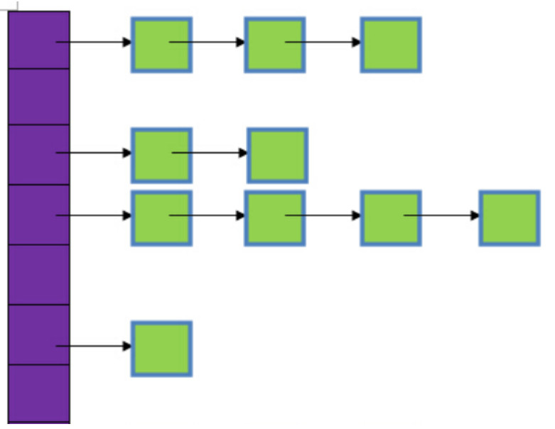

<!-- START doctoc generated TOC please keep comment here to allow auto update -->
<!-- DON'T EDIT THIS SECTION, INSTEAD RE-RUN doctoc TO UPDATE -->

- [牛客网数据结构面经问题](#%E7%89%9B%E5%AE%A2%E7%BD%91%E6%95%B0%E6%8D%AE%E7%BB%93%E6%9E%84%E9%9D%A2%E7%BB%8F%E9%97%AE%E9%A2%98)
  - [一、数组](#%E4%B8%80%E6%95%B0%E7%BB%84)
    - [1、请你回答一下Array&List， 数组和链表的区别](#1%E8%AF%B7%E4%BD%A0%E5%9B%9E%E7%AD%94%E4%B8%80%E4%B8%8Barraylist-%E6%95%B0%E7%BB%84%E5%92%8C%E9%93%BE%E8%A1%A8%E7%9A%84%E5%8C%BA%E5%88%AB)
  - [二、树](#%E4%BA%8C%E6%A0%91)
    - [1、请你来说一说红黑树和AVL树的定义，特点，以及二者区别](#1%E8%AF%B7%E4%BD%A0%E6%9D%A5%E8%AF%B4%E4%B8%80%E8%AF%B4%E7%BA%A2%E9%BB%91%E6%A0%91%E5%92%8Cavl%E6%A0%91%E7%9A%84%E5%AE%9A%E4%B9%89%E7%89%B9%E7%82%B9%E4%BB%A5%E5%8F%8A%E4%BA%8C%E8%80%85%E5%8C%BA%E5%88%AB)
    - [2、请你说一下哈夫曼编码](#2%E8%AF%B7%E4%BD%A0%E8%AF%B4%E4%B8%80%E4%B8%8B%E5%93%88%E5%A4%AB%E6%9B%BC%E7%BC%96%E7%A0%81)
    - [3、请你介绍一下B+树](#3%E8%AF%B7%E4%BD%A0%E4%BB%8B%E7%BB%8D%E4%B8%80%E4%B8%8Bb%E6%A0%91)
    - [4、请你说一说map和unordered_map的底层实现](#4%E8%AF%B7%E4%BD%A0%E8%AF%B4%E4%B8%80%E8%AF%B4map%E5%92%8Cunordered_map%E7%9A%84%E5%BA%95%E5%B1%82%E5%AE%9E%E7%8E%B0)
    - [5、请你回答一下map和unordered_map优点和缺点](#5%E8%AF%B7%E4%BD%A0%E5%9B%9E%E7%AD%94%E4%B8%80%E4%B8%8Bmap%E5%92%8Cunordered_map%E4%BC%98%E7%82%B9%E5%92%8C%E7%BC%BA%E7%82%B9)
    - [6、请你说一说Top(K)问题](#6%E8%AF%B7%E4%BD%A0%E8%AF%B4%E4%B8%80%E8%AF%B4topk%E9%97%AE%E9%A2%98)
  - [三、堆栈](#%E4%B8%89%E5%A0%86%E6%A0%88)
    - [1、请说一说你理解的stack overflow，并举个简单例子导致栈溢出](#1%E8%AF%B7%E8%AF%B4%E4%B8%80%E8%AF%B4%E4%BD%A0%E7%90%86%E8%A7%A3%E7%9A%84stack-overflow%E5%B9%B6%E4%B8%BE%E4%B8%AA%E7%AE%80%E5%8D%95%E4%BE%8B%E5%AD%90%E5%AF%BC%E8%87%B4%E6%A0%88%E6%BA%A2%E5%87%BA)
    - [2、请你回答一下栈和堆的区别，以及为什么栈要快](#2%E8%AF%B7%E4%BD%A0%E5%9B%9E%E7%AD%94%E4%B8%80%E4%B8%8B%E6%A0%88%E5%92%8C%E5%A0%86%E7%9A%84%E5%8C%BA%E5%88%AB%E4%BB%A5%E5%8F%8A%E4%B8%BA%E4%BB%80%E4%B9%88%E6%A0%88%E8%A6%81%E5%BF%AB)
    - [3、请你说一说小根堆特点](#3%E8%AF%B7%E4%BD%A0%E8%AF%B4%E4%B8%80%E8%AF%B4%E5%B0%8F%E6%A0%B9%E5%A0%86%E7%89%B9%E7%82%B9)
  - [四、哈希](#%E5%9B%9B%E5%93%88%E5%B8%8C)
    - [1、请你来说一说hash表的实现，包括STL中的哈希桶长度常数](#1%E8%AF%B7%E4%BD%A0%E6%9D%A5%E8%AF%B4%E4%B8%80%E8%AF%B4hash%E8%A1%A8%E7%9A%84%E5%AE%9E%E7%8E%B0%E5%8C%85%E6%8B%ACstl%E4%B8%AD%E7%9A%84%E5%93%88%E5%B8%8C%E6%A1%B6%E9%95%BF%E5%BA%A6%E5%B8%B8%E6%95%B0)
    - [2、请你回答一下hash表如何rehash，以及怎么处理其中保存的资源](#2%E8%AF%B7%E4%BD%A0%E5%9B%9E%E7%AD%94%E4%B8%80%E4%B8%8Bhash%E8%A1%A8%E5%A6%82%E4%BD%95rehash%E4%BB%A5%E5%8F%8A%E6%80%8E%E4%B9%88%E5%A4%84%E7%90%86%E5%85%B6%E4%B8%AD%E4%BF%9D%E5%AD%98%E7%9A%84%E8%B5%84%E6%BA%90)
    - [3、请你说一下哈希表的桶个数为什么是质数，合数有何不妥？](#3%E8%AF%B7%E4%BD%A0%E8%AF%B4%E4%B8%80%E4%B8%8B%E5%93%88%E5%B8%8C%E8%A1%A8%E7%9A%84%E6%A1%B6%E4%B8%AA%E6%95%B0%E4%B8%BA%E4%BB%80%E4%B9%88%E6%98%AF%E8%B4%A8%E6%95%B0%E5%90%88%E6%95%B0%E6%9C%89%E4%BD%95%E4%B8%8D%E5%A6%A5)
    - [4、请你说一下解决hash冲突的方法](#4%E8%AF%B7%E4%BD%A0%E8%AF%B4%E4%B8%80%E4%B8%8B%E8%A7%A3%E5%86%B3hash%E5%86%B2%E7%AA%81%E7%9A%84%E6%96%B9%E6%B3%95)

<!-- END doctoc generated TOC please keep comment here to allow auto update -->

## 牛客网数据结构面经问题

整理于：https://www.nowcoder.com/tutorial/93/2f895548adc24f0b88ffcb01c7973f23

### 一、数组

#### 1、请你回答一下Array&List， 数组和链表的区别

**数组的特点：**

​		数组是将元素在内存中连续存放，由于每个元素占用内存相同，可以通过下标迅速访问数组中任何元素。数组的插入数据和删除数据效率低，插入数据时，这个位置后面的数据在内存中都要向后移。删除数据时，这个数据后面的数据都要往前移动。但数组的随机读取效率很高。因为数组是连续的，知道每一个数据的内存地址，可以直接找到给地址的数据。如果应用需要快速访问数据，很少或不插入和删除元素，就应该用数组。数组需要预留空间，在使用前要先申请占内存的大小，可能会浪费内存空间。并且数组不利于扩展，数组定义的空间不够时要重新定义数组。

**链表的特点：**

​		链表中的元素在内存中不是顺序存储的，而是通过存在元素中的指针联系到一起。比如：上一个元素有个指针指到下一个元素，以此类推，直到最后一个元素。如果要访问链表中一个元素，需要从第一个元素开始，一直找到需要的元素位置。但是增加和删除一个元素对于链表数据结构就非常简单了，只要修改元素中的指针就可以了。如果应用需要经常插入和删除元素你就需要用链表数据结构了。不指定大小，扩展方便。链表大小不用定义，数据随意增删。

**数组的优点：**

1. 随机访问性强

2. 查找速度快

**数组的缺点:**

1. 插入和删除效率低

2. 可能浪费内存

3. 内存空间要求高，必须有足够的连续内存空间。

4. 数组大小固定，不能动态拓展

**链表的优点:**

1. 插入删除速度快

2. 内存利用率高，不会浪费内存

3. 大小没有固定，拓展很灵活。

**链表的缺点:**

不能随机查找，必须从第一个开始遍历，查找效率低

### 二、树

#### 1、请你来说一说红黑树和AVL树的定义，特点，以及二者区别

**红黑树是重点内容，关于红黑树的概念和旋转操作请务必参考**：[浅析红黑树（RBTree）原理及实现](./img/rbtree.png)

> https://blog.csdn.net/tanrui519521/article/details/80980135

**平衡二叉树（AVL树）：**

平衡二叉树又称为AVL树，是一种特殊的二叉排序树。其左右子树都是平衡二叉树，且左右子树高度之差的绝对值不超过1。一句话表述为：以树中所有结点为根的树的左右子树高度之差的绝对值不超过1。将二叉树上结点的左子树深度减去右子树深度的值称为平衡因子BF，那么平衡二叉树上的所有结点的平衡因子只可能是-1、0和1。只要二叉树上有一个结点的平衡因子的绝对值大于1，则该二叉树就是不平衡的。

**红黑树：**

红黑树是一种二叉查找树，但在每个节点增加一个存储位表示节点的颜色，可以是红或黑（非红即黑）。通过对任何一条从根到叶子的路径上各个节点着色的方式的限制，红黑树确保没有一条路径会比其它路径长出两倍，因此，红黑树是一种弱平衡二叉树，相对于要求严格的AVL树来说，它的旋转次数少，所以对于搜索，插入，删除操作较多的情况下，通常使用红黑树。

**红黑树性质：**

1. 每个节点非红即黑

2. 根节点是黑的;

3. 每个叶节点（叶节点即树尾端NULL指针或NULL节点）都是黑的;

4. 如果一个节点是红色的，则它的子节点必须是黑色的。

5. 对于任意节点而言，其到叶子点树NULL指针的每条路径都包含相同数目的黑节点;

**区别：**

AVL 树是高度平衡的，频繁的插入和删除，会引起频繁的rebalance，导致效率下降；红黑树不是高度平衡的，算是一种折中，插入最多两次旋转，删除最多三次旋转。

#### 2、请你说一下哈夫曼编码

哈夫曼编码是哈夫曼树的一种应用，广泛用于数据文件压缩。哈夫曼编码算法用字符在文件中出现的频率来建立使用0，1表示个字符的最优表示方式，其具体算法如下：

(1)哈夫曼算法以自底向上的方式构造表示最优前缀码的二叉树T。

(2)算法以|C|个叶结点开始，执行|C|－1次的“合并”运算后产生最终所要求的树T。

(3)假设编码字符集中每一字符c的频率是f(c)。以f为键值的优先队列Q用在贪心选择时有效地确定算法当前要合并的2棵具有最小频率的树。一旦2棵具有最小频率的树合并后，产生一棵新的树，其频率为合并的2棵树的频率之和，并将新树插入优先队列Q。经过n－1次的合并后，优先队列中只剩下一棵树，即所要求的树T。

#### 3、请你介绍一下B+树

B+是一种多路搜索树，**主要为磁盘或其他直接存取辅助设备而设计**的一种平衡查找树，在B+树中，每个节点的可以有多个孩子，并且按照关键字大小有序排列。所有记录节点都是按照键值的大小顺序存放在同一层的叶节点中。相比B树，其具有以下几个特点：

（1）每个节点上的指针上限为2d而不是2d+1（d为节点的出度）

（2）内节点不存储data,只存储key

（3）叶子节点不存储指针

#### 4、请你说一说map和unordered_map的底层实现

map底层是基于红黑树实现的，因此map内部元素排列是有序的。而unordered_map底层则是基于哈希表实现的，因此其元素的排列顺序是杂乱无序的。

#### 5、请你回答一下map和unordered_map优点和缺点

**map是基于红黑树实现的**，**优点**如下：

（1）有序性，这是map结构最大的优点，其元素的有序性在很多应用中都会简化很多的操作

（2）map的查找、删除、增加等一系列操作时间复杂度稳定，都为log(n)

**缺点**如下：

查找、删除、增加等操作平均时间复杂度较慢，与n相关

**unordered_map底层是一个哈希表**，**优点**如下：

查找、删除、添加的速度快，时间复杂度为常数级O(c)

**缺点**如下：

因为unordered_map内部基于哈希表，以（key,value）对的形式存储，因此空间占用率高。unordered_map的查找、删除、添加的时间复杂度不稳定，平均为O(c)，取决于哈希函数。极端情况下可能为O(n)。

#### 6、请你说一说Top(K)问题

**（1）直接全部排序（只适用于内存够的情况）**

当数据量较小的情况下，内存中可以容纳所有数据。则最简单也是最容易想到的方法是将数据全部排序，然后取排序后的数据中的前K个。

这种方法对数据量比较敏感，当数据量较大的情况下，内存不能完全容纳全部数据，这种方法便不适应了。即使内存能够满足要求，该方法将全部数据都排序了，而题目只要求找出top K个数据，所以该方法并不十分高效，不建议使用。

**（2）快速排序的变形 （只使用于内存够的情况）**

这是一个基于快速排序的变形，因为第一种方法中说到将所有元素都排序并不十分高效，只需要找出前K个最大的就行。

这种方法类似于快速排序，首先选择一个划分元，将比这个划分元大的元素放到它的前面，比划分元小的元素放到它的后面，此时完成了一趟排序。如果此时这个划分元的序号index刚好等于K，那么这个划分元以及它左边的数，刚好就是前K个最大的元素；如果index  > K，那么前K大的数据在index的左边，那么就继续递归的从index-1个数中进行一趟排序；如果index < K，那么再从划分元的右边继续进行排序，直到找到序号index刚好等于K为止。再将前K个数进行排序后，返回Top K个元素。这种方法就避免了对除了Top K个元素以外的数据进行排序所带来的不必要的开销。

**（3）最小堆法**

这是一种局部淘汰法。先读取前K个数，建立一个最小堆。然后将剩余的所有数字依次与最小堆的堆顶进行比较，如果小于或等于堆顶数据，则继续比较下一个；否则，删除堆顶元素，并将新数据插入堆中，重新调整最小堆。当遍历完全部数据后，最小堆中的数据即为最大的K个数。

**（4）分治法**

将全部数据分成N份，前提是每份的数据都可以读到内存中进行处理，找到每份数据中最大的K个数。此时剩下N*K个数据，如果内存不能容纳N*K个数据，则再继续分治处理，分成M份，找出每份数据中最大的K个数，如果M*K个数仍然不能读到内存中，则继续分治处理。直到剩余的数可以读入内存中，那么可以对这些数使用快速排序的变形或者归并排序进行处理。

**（5）Hash法**

如果这些数据中有很多重复的数据，可以先通过hash法，把重复的数去掉。这样如果重复率很高的话，会减少很大的内存用量，从而缩小运算空间。处理后的数据如果能够读入内存，则可以直接排序；否则可以使用分治法或者最小堆法来处理数据。

**常见的有快排和最小堆两种。**

### 三、堆栈

#### 1、请说一说你理解的stack overflow，并举个简单例子导致栈溢出

**栈溢出概念：**

栈溢出指的是程序向栈中某个变量中写入的字节数超过了这个变量本身所申请的字节数，因而导致栈中与其相邻的变量的值被改变。

**栈溢出的原因：**

1. 局部数组过大。当函数内部的数组过大时，有可能导致堆栈溢出。局部变量是存储在栈中的，因此这个很好理解。解决这类问题的办法有两个，一是增大栈空间,二是改用动态分配，使用堆（heap）而不是栈（stack）。

2. 递归调用层次太多。递归函数在运行时会执行压栈操作，当压栈次数太多时，也会导致堆栈溢出。

3. 指针或数组越界。这种情况最常见，例如进行字符串拷贝，或处理用户输入等等。

栈溢出例子：

```c
int array[5];
for (int i = 0; i <= 5; ++i)
    array[i] = i;
```

数组越界导致错误。

#### 2、请你回答一下栈和堆的区别，以及为什么栈要快

**堆和栈的区别：**

（1）堆是由低地址向高地址扩展；栈是由高地址向低地址扩展

（2）堆中的内存需要手动申请和手动释放；栈中内存是由OS自动申请和自动释放，存放着参数、局部变量等内存

（3）堆中频繁调用malloc和free,会产生内存碎片，降低程序效率；而栈由于其先进后出的特性，不会产生内存碎片

（4）堆的分配效率较低，而栈的分配效率较高

**栈的效率高的原因：**

​		栈是操作系统提供的数据结构，计算机底层对栈提供了一系列支持：分配专门的寄存器存储栈的地址，压栈和入栈有专门的指令执行；而堆是由C/C++函数库提供的，机制复杂，需要一些列分配内存、合并内存和释放内存的算法，因此效率较低。

#### 3、请你说一说小根堆特点

堆是一棵完全二叉树（如果一共有h层，那么1~h-1层均满，在h层可能会连续缺失若干个右叶子）。

**小根堆**：根节点的值小于孩子的值（根节点的值是整棵树中最小的）

**大根堆**：根节点的值大于孩子的值（根节点的值是整棵树中最大的）

### 四、哈希

**哈希部分的内容强烈推荐参考《Redis设计与实现》中hash的设计。**

#### 1、请你来说一说hash表的实现，包括STL中的哈希桶长度常数

hash表的实现主要包括构造哈希和处理哈希冲突两个方面：

对于构造哈希来说，主要包括直接地址法、平方取中法、除留余数法等。

对于处理哈希冲突来说，最常用的处理冲突的方法有开放定址法、再哈希法、链地址法、建立公共溢出区等方法。SGL版本使用链地址法，使用一个链表保持相同散列值的元素。

虽然链地址法并不要求哈希桶长度必须为质数，但SGI STL仍然以质数来设计哈希桶长度，并且将28个质数（逐渐呈现大约两倍的关系）计算好，以备随时访问，同时提供一个函数，用来查询在这28个质数之中，“最接近某数并大于某数”的质数。

**哈希算法常用除留余数法。**

#### 2、请你回答一下hash表如何rehash，以及怎么处理其中保存的资源

C++的hash表中有一个负载因子loadFactor，当loadFactor<=1时，hash表查找的期望复杂度为O(1). 因此，每次往hash表中添加元素时，我们必须保证是在loadFactor <1的情况下，才能够添加。

因此，当Hash表中loadFactor==1时，Hash就需要进行rehash。rehash过程中，会模仿C++的vector扩容方式，Hash表中每次发现loadFactor ==1时，就开辟一个原来桶数组的两倍空间，称为新桶数组，然后把原来的桶数组中元素全部重新哈希到新的桶数组中。

#### 3、请你说一下哈希表的桶个数为什么是质数，合数有何不妥？

哈希表的桶个数使用质数，可以最大程度减少冲突概率，使哈希后的数据分布的更加均匀。如果使用合数，可能会造成很多数据分布会集中在某些点上，从而影响哈希表效率。

#### 4、请你说一下解决hash冲突的方法

**（1）开放定址**

开放地址法有个非常关键的特征，就是所有输入的元素全部存放在哈希表里，也就是说，位桶的实现是不需要任何的链表来实现的，换句话说，也就是这个哈希表的装载因子不会超过1。它的实现是在插入一个元素的时候，先通过哈希函数进行判断，若是发生哈希冲突，就以当前地址为基准，根据再寻址的方法（探查序列），去寻找下一个地址，若发生冲突再去寻找，直至找到一个为空的地址为止。所以这种方法又称为再散列法。

有几种常用的探查序列的方法：

① 线性探查

dii=1，2，3，…，m-1；这种方法的特点是：冲突发生时，顺序查看表中下一单元，直到找出一个空单元或查遍全表。

② 二次探查

di=12，-12，22，-22，…，k2，-k2   ( k<=m/2 )；这种方法的特点是：冲突发生时，在表的左右进行跳跃式探测，比较灵活。

③ 伪随机探测

di=伪随机数序列；具体实现时，应建立一个伪随机数发生器，（如i=(i+p) % m），生成一个位随机序列，并给定一个随机数做起点，每次去加上这个伪随机数++就可以了。

**（2）链地址**

每个位桶实现的时候，采用链表或者树的数据结构来去存取发生哈希冲突的输入域的关键字，也就是被哈希函数映射到同一个位桶上的关键字。



紫色部分即代表哈希表，也称为哈希数组，数组的每个元素都是一个单链表的头节点，链表是用来解决冲突的，如果不同的key映射到了数组的同一位置处，就将其放入单链表中，即链接在桶后。

**（3）公共溢出区**

建立一个公共溢出区域，把hash冲突的元素都放在该溢出区里。查找时，如果发现hash表中对应桶里存在其他元素，还需要在公共溢出区里再次进行查找。

**（4）再hash**

再散列法其实很简单，就是再使用哈希函数去散列一个输入的时候，输出是同一个位置就再次散列，直至不发生冲突位置。缺点：每次冲突都要重新散列，计算时间增加。

**常用链地址法。**