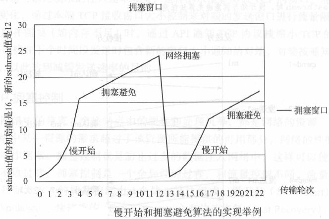
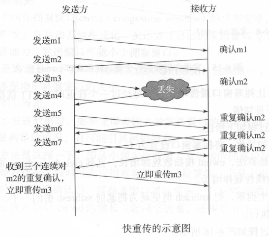
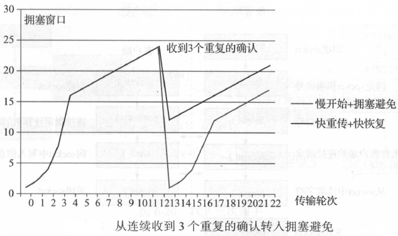
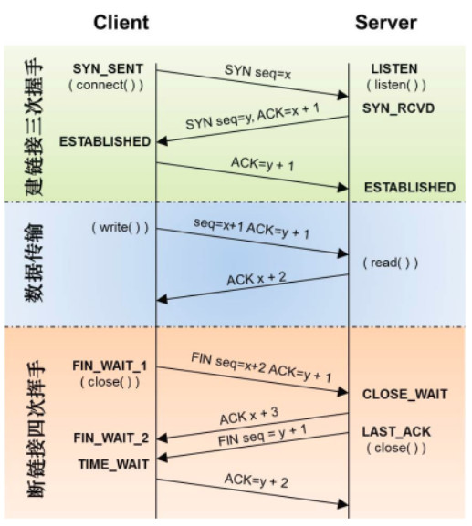
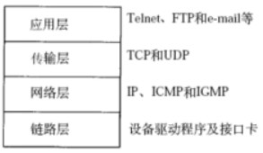
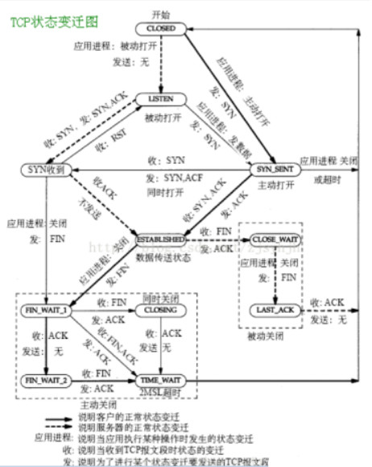
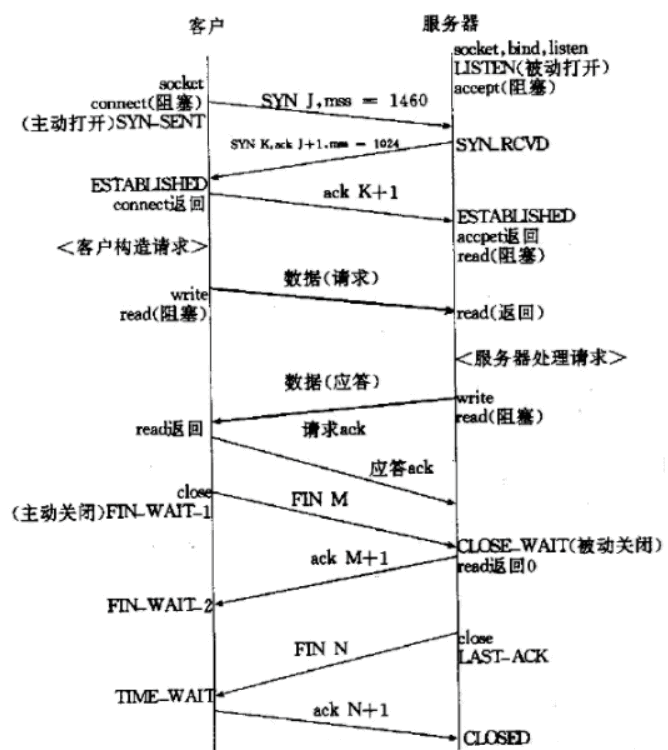
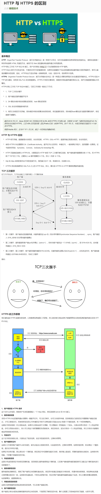
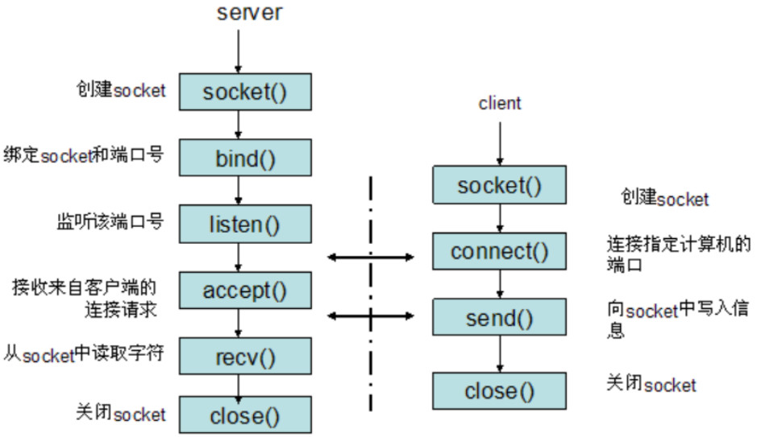
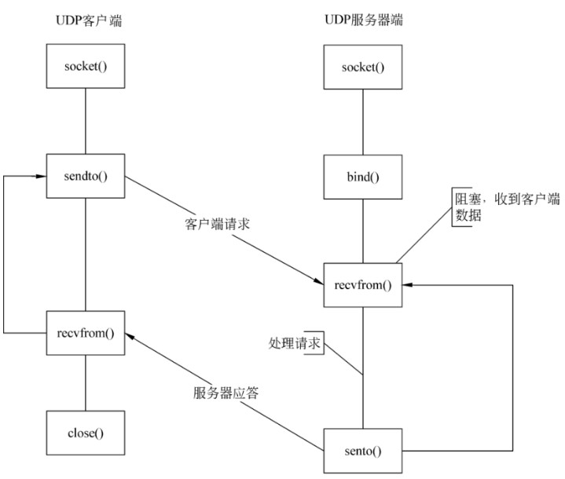

<!-- START doctoc generated TOC please keep comment here to allow auto update -->
<!-- DON'T EDIT THIS SECTION, INSTEAD RE-RUN doctoc TO UPDATE -->

- [牛客网计算机网络面经整理](#%E7%89%9B%E5%AE%A2%E7%BD%91%E8%AE%A1%E7%AE%97%E6%9C%BA%E7%BD%91%E7%BB%9C%E9%9D%A2%E7%BB%8F%E6%95%B4%E7%90%86)
  - [一、TCP/IP常见面试题](#%E4%B8%80tcpip%E5%B8%B8%E8%A7%81%E9%9D%A2%E8%AF%95%E9%A2%98)
    - [TCP怎么保证可靠性](#tcp%E6%80%8E%E4%B9%88%E4%BF%9D%E8%AF%81%E5%8F%AF%E9%9D%A0%E6%80%A7)
    - [TCP拥塞控制](#tcp%E6%8B%A5%E5%A1%9E%E6%8E%A7%E5%88%B6)
    - [TCP建立连接和断开连接的过程](#tcp%E5%BB%BA%E7%AB%8B%E8%BF%9E%E6%8E%A5%E5%92%8C%E6%96%AD%E5%BC%80%E8%BF%9E%E6%8E%A5%E7%9A%84%E8%BF%87%E7%A8%8B)
    - [TCP的模型，状态转移](#tcp%E7%9A%84%E6%A8%A1%E5%9E%8B%E7%8A%B6%E6%80%81%E8%BD%AC%E7%A7%BB)
    - [TCP的三次握手和四次挥手的原因](#tcp%E7%9A%84%E4%B8%89%E6%AC%A1%E6%8F%A1%E6%89%8B%E5%92%8C%E5%9B%9B%E6%AC%A1%E6%8C%A5%E6%89%8B%E7%9A%84%E5%8E%9F%E5%9B%A0)
    - [IP地址、MAC地址作用](#ip%E5%9C%B0%E5%9D%80mac%E5%9C%B0%E5%9D%80%E4%BD%9C%E7%94%A8)
    - [OSI七层模型和TCP/IP四层模型，每层列举2个协议](#osi%E4%B8%83%E5%B1%82%E6%A8%A1%E5%9E%8B%E5%92%8Ctcpip%E5%9B%9B%E5%B1%82%E6%A8%A1%E5%9E%8B%E6%AF%8F%E5%B1%82%E5%88%97%E4%B8%BE2%E4%B8%AA%E5%8D%8F%E8%AE%AE)
    - [TCP/IP数据链路层的交互过程](#tcpip%E6%95%B0%E6%8D%AE%E9%93%BE%E8%B7%AF%E5%B1%82%E7%9A%84%E4%BA%A4%E4%BA%92%E8%BF%87%E7%A8%8B)
    - [IP层怎么知道报文该给哪个应用程序，它怎么区分UDP报文还是TCP报文](#ip%E5%B1%82%E6%80%8E%E4%B9%88%E7%9F%A5%E9%81%93%E6%8A%A5%E6%96%87%E8%AF%A5%E7%BB%99%E5%93%AA%E4%B8%AA%E5%BA%94%E7%94%A8%E7%A8%8B%E5%BA%8F%E5%AE%83%E6%80%8E%E4%B9%88%E5%8C%BA%E5%88%86udp%E6%8A%A5%E6%96%87%E8%BF%98%E6%98%AFtcp%E6%8A%A5%E6%96%87)
    - [TCP和UDP的区别和各自适用的场景](#tcp%E5%92%8Cudp%E7%9A%84%E5%8C%BA%E5%88%AB%E5%92%8C%E5%90%84%E8%87%AA%E9%80%82%E7%94%A8%E7%9A%84%E5%9C%BA%E6%99%AF)
  - [二、HTTP与应用层协议](#%E4%BA%8Chttp%E4%B8%8E%E5%BA%94%E7%94%A8%E5%B1%82%E5%8D%8F%E8%AE%AE)
    - [http协议](#http%E5%8D%8F%E8%AE%AE)
    - [GET和POST的区别](#get%E5%92%8Cpost%E7%9A%84%E5%8C%BA%E5%88%AB)
    - [HTTP和HTTPS的区别](#http%E5%92%8Chttps%E7%9A%84%E5%8C%BA%E5%88%AB)
    - [HTTP返回码](#http%E8%BF%94%E5%9B%9E%E7%A0%81)
  - [三、网络套接字相关](#%E4%B8%89%E7%BD%91%E7%BB%9C%E5%A5%97%E6%8E%A5%E5%AD%97%E7%9B%B8%E5%85%B3)
    - [网络编程的基本步骤](#%E7%BD%91%E7%BB%9C%E7%BC%96%E7%A8%8B%E7%9A%84%E5%9F%BA%E6%9C%AC%E6%AD%A5%E9%AA%A4)
      - [A、基于TCP的socket](#a%E5%9F%BA%E4%BA%8Etcp%E7%9A%84socket)
      - [B、基于UDP的socket](#b%E5%9F%BA%E4%BA%8Eudp%E7%9A%84socket)
    - [udp调用connect函数](#udp%E8%B0%83%E7%94%A8connect%E5%87%BD%E6%95%B0)
  - [四、其他](#%E5%9B%9B%E5%85%B6%E4%BB%96)
    - [搜索baidu，会用到计算机网络中的什么层？每层是干什么的](#%E6%90%9C%E7%B4%A2baidu%E4%BC%9A%E7%94%A8%E5%88%B0%E8%AE%A1%E7%AE%97%E6%9C%BA%E7%BD%91%E7%BB%9C%E4%B8%AD%E7%9A%84%E4%BB%80%E4%B9%88%E5%B1%82%E6%AF%8F%E5%B1%82%E6%98%AF%E5%B9%B2%E4%BB%80%E4%B9%88%E7%9A%84)
    - [数字证书](#%E6%95%B0%E5%AD%97%E8%AF%81%E4%B9%A6)

<!-- END doctoc generated TOC please keep comment here to allow auto update -->

# 牛客网计算机网络面经整理

**该部分更多细节内容补充可见《一、计算机基础知识》中的《计算机网络》部分。**

## 一、TCP/IP常见面试题

### TCP怎么保证可靠性

**1、序列号、确认应答、超时重传**

数据到达接收方，接收方需要发出一个确认应答，表示已经收到该数据段，并且确认序号会说明了它下一次需要接收的数据序列号。如果发送发迟迟未收到确认应答，那么可能是发送的数据丢失，也可能是确认应答丢失，这时发送方在等待一定时间后会进行重传。这个时间一般是2*RTT(报文段往返时间）+一个偏差值。

**2、窗口控制与高速重发控制/快速重传（重复确认应答）**

TCP会利用窗口控制来提高传输速度，意思是在一个窗口大小内，不用一定要等到应答才能发送下一段数据，窗口大小就是无需等待确认而可以继续发送数据的最大值。如果不使用窗口控制，每一个没收到确认应答的数据都要重发。

使用窗口控制，如果数据段1001-2000丢失，后面数据每次传输，确认应答都会不停地发送序号为1001的应答，表示我要接收1001开始的数据，发送端如果收到3次相同应答，就会立刻进行重发；但还有种情况有可能是数据都收到了，但是有的应答丢失了，这种情况不会进行重发，因为发送端知道，如果是数据段丢失，接收端不会放过它的，会疯狂向它提醒。

**3、拥塞控制**

如果把窗口定的很大，发送端连续发送大量的数据，可能会造成网络的拥堵（大家都在用网，你在这狂发，吞吐量就那么大，当然会堵），甚至造成网络的瘫痪。所以TCP在为了防止这种情况而进行了拥塞控制。

**慢启动**：定义拥塞窗口，一开始将该窗口大小设为1，之后每次收到确认应答（经过一个rtt），将拥塞窗口大小*2。

**拥塞避免**：设置慢启动阈值，一般开始都设为65536。拥塞避免是指当拥塞窗口大小达到这个阈值，拥塞窗口的值不再指数上升，而是加法增加（每次确认应答/每个rtt，拥塞窗口大小+1），以此来避免拥塞。将报文段的超时重传看做拥塞，则一旦发生超时重传，我们需要先将阈值设为当前窗口大小的一半，并且将窗口大小设为初值1，然后重新进入慢启动过程。

**快速重传和快恢复**：在遇到3次重复确认应答（高速重发控制）时，代表收到了3个报文段，但是这之前的1个段丢失了，便对它进行立即重传。然后，先将阈值设为当前窗口大小的一半，然后将拥塞窗口大小设为慢启动阈值+3的大小。

这样可以达到：在TCP通信时，网络吞吐量呈现逐渐的上升，并且随着拥堵来降低吞吐量，再进入慢慢上升的过程，网络不会轻易的发生瘫痪。

### TCP拥塞控制

拥塞控制是防止过多的数据注入网络，使得网络中的路由器或者链路过载。流量控制是点对点的通信量控制，而拥塞控制是全局的网络流量整体性的控制。发送双方都有一个拥塞窗口——cwnd。

**1、慢开始**

最开始发送方的拥塞窗口为1，由小到大逐渐增大发送窗口和拥塞窗口。每经过一个传输轮次，拥塞窗口cwnd加倍。当cwnd超过慢开始门限，则使用拥塞避免算法，避免cwnd增长过大。

**2、拥塞避免**

每经过一个往返时间RTT，cwnd就增长1。

在慢开始和拥塞避免的过程中，一旦发现网络拥塞，就把慢开始门限设为当前值的一半，并且重新设置cwnd为1，重新慢启动。（乘法减小，加法增大）

**3、快重传**

接收方每次收到一个失序的报文段后就立即发出重复确认，发送方只要连续收到三个重复确认就立即重传（尽早重传未被确认的报文段）。

**4、快恢复**

当发送方连续收到了三个重复确认，就乘法减半（慢开始门限减半），将当前的cwnd设置为慢开始门限，并且采用拥塞避免算法（连续收到了三个重复请求，说明当前网络可能没有拥塞）。采用快恢复算法时，慢开始只在建立连接和网络超时才使用。

达到什么情况的时候开始减慢增长的速度？

**采用慢开始和拥塞避免算法的时候：**

1、一旦cwnd>慢开始门限，就采用拥塞避免算法，减慢增长速度

2、一旦出现丢包的情况，就重新进行慢开始，减慢增长速度

**采用快恢复和快重传算法的时候：**

1、 一旦cwnd>慢开始门限，就采用拥塞避免算法，减慢增长速度

\2. 一旦发送方连续收到了三个重复确认，就采用拥塞避免算法，减慢增长速度

### TCP建立连接和断开连接的过程

**三次握手**

1、Client将标志位SYN置为1，随机产生一个值seq=x，并将该数据包发送给Server，Client进入SYN_SENT状态，等待Server确认。

2、Server收到数据包后由标志位SYN=1知道Client请求建立连接，Server将标志位SYN和ACK都置为1，ack=x+1，随机产生一个值seq=y，并将该数据包发送给Client以确认连接请求，Server进入SYN_RCVD状态。

3、Client收到确认后，检查ack是否为x+1，ACK是否为1，如果正确则将标志位ACK置为1，ack=y+1，并将该数据包发送给Server，Server检查ack是否为y+1，ACK是否为1，如果正确则连接建立成功，Client和Server进入ESTABLISHED状态，完成三次握手，随后Client与Server之间可以开始传输数据了。

**四次挥手**

由于TCP连接时全双工的，因此，每个方向都必须要单独进行关闭，这一原则是当一方完成数据发送任务后，发送一个FIN来终止这一方向的连接，收到一个FIN只是意味着这一方向上没有数据流动了，即不会再收到数据了，但是在这个TCP连接上仍然能够发送数据，直到这一方向也发送了FIN。首先进行关闭的一方将执行主动关闭，而另一方则执行被动关闭。

1、数据传输结束后，客户端的应用进程发出连接释放报文段，并停止发送数据，客户端进入FIN_WAIT_1状态，此时客户端依然可以接收服务器发送来的数据。

2、服务器接收到FIN后，发送一个ACK给客户端，确认序号为收到的序号+1，服务器进入CLOSE_WAIT状态。客户端收到后进入FIN_WAIT_2状态。

3、当服务器没有数据要发送时，服务器发送一个FIN报文，此时服务器进入LAST_ACK状态，等待客户端的确认

4、客户端收到服务器的FIN报文后，给服务器发送一个ACK报文，确认序列号为收到的序号+1。此时客户端进入TIME_WAIT状态，等待2MSL（MSL：报文段最大生存时间），然后关闭连接。

### TCP的模型，状态转移

**四层TCP/IP模型如下：**

**其状态转移图如下：**

**上面的图可能有点乱，这里给出一个清晰的流程：**

**CLOSED：**初始状态，表示TCP连接是“关闭着的”或“未打开的”。

**LISTEN ：**表示服务器端的某个SOCKET处于监听状态，可以接受客户端的连接。

**SYN_RCVD ：**表示服务器接收到了来自客户端请求连接的SYN报文。在正常情况下，这个状态是服务器端的SOCKET在建立TCP连接时的三次握手会话过程中的一个中间状态，很短暂，基本上用netstat很难看到这种状态，除非故意写一个监测程序，将三次TCP握手过程中最后一个ACK报文不予发送。当TCP连接处于此状态时，再收到客户端的ACK报文，它就会进入到ESTABLISHED 状态。

**SYN_SENT ：**这个状态与SYN_RCVD 状态相呼应，当客户端SOCKET执行connect()进行连接时，它首先发送SYN报文，然后随即进入到SYN_SENT 状态，并等待服务端的发送三次握手中的第2个报文。SYN_SENT 状态表示客户端已发送SYN报文。

**ESTABLISHED ：**表示TCP连接已经成功建立。

**FIN_WAIT_1 ：**这个状态得好好解释一下，其实FIN_WAIT_1 和FIN_WAIT_2 两种状态的真正含义都是表示等待对方的FIN报文。而这两种状态的区别是：FIN_WAIT_1状态实际上是当SOCKET在ESTABLISHED状态时，它想主动关闭连接，向对方发送了FIN报文，此时该SOCKET进入到FIN_WAIT_1 状态。而当对方回应ACK报文后，则进入到FIN_WAIT_2 状态。当然在实际的正常情况下，无论对方处于任何种情况下，都应该马上回应ACK报文，所以FIN_WAIT_1 状态一般是比较难见到的，而FIN_WAIT_2 状态有时仍可以用netstat看到。

**FIN_WAIT_2 ：**上面已经解释了这种状态的由来，实际上FIN_WAIT_2状态下的SOCKET表示半连接，即有一方调用close()主动要求关闭连接。注意：FIN_WAIT_2 是没有超时的（不像TIME_WAIT 状态），这种状态下如果对方不关闭（不配合完成4次挥手过程），那这个 FIN_WAIT_2 状态将一直保持到系统重启，越来越多的FIN_WAIT_2 状态会导致内核crash。

**TIME_WAIT ：**表示收到了对方的FIN报文，并发送出了ACK报文。 TIME_WAIT状态下的TCP连接会等待2*MSL（Max Segment Lifetime，最大分段生存期，指一个TCP报文在Internet上的最长生存时间。每个具体的TCP协议实现都必须选择一个确定的MSL值，RFC 1122建议是2分钟，但BSD传统实现采用了30秒，Linux可以cat /proc/sys/net/ipv4/tcp_fin_timeout看到本机的这个值），然后即可回到CLOSED 可用状态了。如果FIN_WAIT_1状态下，收到了对方同时带FIN标志和ACK标志的报文时，可以直接进入到TIME_WAIT状态，而无须经过FIN_WAIT_2状态。（这种情况应该就是四次挥手变成三次挥手的那种情况）

**CLOSING ：**这种状态在实际情况中应该很少见，属于一种比较罕见的例外状态。正常情况下，当一方发送FIN报文后，按理来说是应该先收到（或同时收到）对方的ACK报文，再收到对方的FIN报文。但是CLOSING 状态表示一方发送FIN报文后，并没有收到对方的ACK报文，反而却也收到了对方的FIN报文。什么情况下会出现此种情况呢？那就是**当双方几乎在同时close()一个SOCKET的话，就出现了双方同时发送FIN报文的情况**，这是就会出现CLOSING 状态，表示双方都正在关闭SOCKET连接。产生的原因是客户端和服务端同时关闭。

**CLOSE_WAIT ：**表示正在等待关闭。怎么理解呢？当对方close()一个SOCKET后发送FIN报文给自己，你的系统毫无疑问地将会回应一个ACK报文给对方，此时TCP连接则进入到CLOSE_WAIT状态。接下来呢，你需要检查自己是否还有数据要发送给对方，如果没有的话，那你也就可以close()这个SOCKET并发送FIN报文给对方，即关闭自己到对方这个方向的连接。有数据的话则看程序的策略，继续发送或丢弃。简单地说，当你处于CLOSE_WAIT 状态下，需要完成的事情是等待你去关闭连接。

**LAST_ACK ：**当被动关闭的一方在发送FIN报文后，等待对方的ACK报文的时候，就处于LAST_ACK 状态。当收到对方的ACK报文后，也就可以进入到CLOSED 可用状态了。

### TCP的三次握手和四次挥手的原因

**三次握手的原因**：三次握手可以防止已经失效的连接请求报文突然又传输到服务器端导致的服务器资源浪费（**通过seq序列号**）。例如，客户端先发送了一个SYN，但是由于网络阻塞，该SYN数据包在某个节点长期滞留。然后客户端又重传SYN数据包并正确建立TCP连接，然后传输完数据后关闭该连接。该连接释放后失效的SYN数据包才到达服务器端。在二次握手的前提下，服务器端会认为这是客户端发起的又一次请求，然后发送SYN ，并且在服务器端创建socket套接字，一直等待客户端发送数据。但是由于客户端并没有发起新的请求，所以会丢弃服务端的SYN 。此时服务器会一直等待客户端发送数据从而造成资源浪费。

【*三次握手是为了防止，客户端的请求报文在网络滞留，客户端超时重传了请求报文，服务端建立连接，传输数据，释放连接之后，服务器又收到了客户端滞留的请求报文，建立连接一直等待客户端发送数据。*

*服务器对客户端的请求进行回应(第二次握手)后，就会理所当然的认为连接已建立，而如果客户端并没有收到服务器的回应呢？此时，客户端仍认为连接未建立，服务器会对已建立的连接保存必要的资源，如果大量的这种情况，服务器会崩溃。*】

**四次挥手的原因**：由于连接的关闭控制权在应用层，所以被动关闭的一方在接收到FIN包时，TCP协议栈会直接发送一个ACK确认包，优先关闭一端的通信。然后通知应用层，由应用层决定什么时候发送FIN包。应用层可以使用系统调用函数read==0来判断对端是否关闭连接。

1、当客户端确认发送完数据且知道服务器已经接收完了，想要关闭发送数据口（当然确认信号还是可以发），就会发FIN给服务器。

2、服务器收到客户端发送的FIN，表示收到了，就会发送ACK回复。

3、但这时候服务器可能还在发送数据，没有想要关闭数据口的意思，所以服务器的FIN与ACK不是同时发送的，而是等到服务器数据发送完了，才会发送FIN给客户端。

4、客户端收到服务器发来的FIN，知道服务器的数据也发送完了，回复ACK， 客户端等待2MSL以后，没有收到服务器传来的任何消息，知道服务器已经收到自己的ACK了，客户端就关闭链接，服务器也关闭链接了。

**2MSL意义：**

1、保证最后一次握手报文能到对方，能进行超时重传。

2、2MSL后，这次连接的所有报文都会消失，不会影响下一次连接。

### IP地址、MAC地址作用

MAC地址是一个硬件地址，用来定义网络设备的位置，主要由数据链路层负责。而IP地址是IP协议提供的一种统一的地址格式，为互联网上的每一个网络和每一台主机分配一个逻辑地址，以此来屏蔽物理地址的差异。

### OSI七层模型和TCP/IP四层模型，每层列举2个协议

**OSI七层模型协议**

**物理层**: 通过媒介传输比特,确定机械及电气规范,传输单位为bit，主要包括的协议为：IEE802.3 CLOCK RJ45

**数据链路层**: 将比特组装成帧和点到点的传递,传输单位为帧,主要包括的协议为MAC VLAN PPP

**网络层**：负责数据包从源到宿的传递和网际互连，传输单位为包,主要包括的协议为IP ARP ICMP

**传输层**：提供端到端的可靠报文传递和错误恢复，传输单位为报文,主要包括的协议为TCP UDP

**会话层**：建立、管理和终止会话，传输单位为SPDU，主要包括的协议为RPC NFS

**表示层**: 对数据进行翻译、加密和压缩,传输单位为PPDU，主要包括的协议为JPEG ASII

**应用层**: 允许访问OSI环境的手段,传输单位为APDU，主要包括的协议为FTP HTTP DNS

**TCP/IP 4层模型**

**网络接口层**：MAC VLAN

**网络层**:IP ARP ICMP

**传输层**:TCP UDP

**应用层**:HTTP DNS SMTP

### TCP/IP数据链路层的交互过程

网络层等到数据链层用mac地址作为通信目标，数据包到达网络等准备往数据链层发送的时候，首先会去自己的**arp**缓存表(存着ip-mac对应关系)去查找改目标ip的mac地址，如果查到了，就讲目标ip的mac地址封装到链路层数据包的包头。如果缓存中没有找到，会发起一个广播：who is ip XXX tell ip XXX,所有收到的广播的机器看这个ip是不是自己的，如果是自己的，则以单拨的形式将自己的mac地址回复给请求的机器。

### IP层怎么知道报文该给哪个应用程序，它怎么区分UDP报文还是TCP报文

IP层只负责传递数据给目标机器，IP报文里面的TCP/UDP报文里有应用的目标端口号，通过该目标端口号来确定应用程序。

IP头中有协议标识字段，17是udp，6是tcp。

### TCP和UDP的区别和各自适用的场景

**1、TCP和UDP区别**

**连接**

TCP是面向连接的传输层协议，即传输数据之前必须先建立好连接；UDP无连接。

**服务对象**

TCP是点对点的两点间服务，即一条TCP连接只能有两个端点；UDP支持一对一，一对多，多对一，多对多的交互通信（广播、组播）。

**可靠性**

TCP是可靠交付：无差错，不丢失，不重复，按序到达；UDP是尽最大努力交付，不保证可靠交付。

**拥塞控制，流量控制**

TCP有拥塞控制和流量控制保证数据传输的安全性；UDP没有拥塞控制，网络拥塞不会影响源主机的发送效率。

**报文长度**

TCP是动态报文长度，即TCP报文长度是根据接收方的窗口大小和当前网络拥塞情况决定的；UDP面向报文，不合并，不拆分，保留上面传下来报文的边界。

 **首部开销**

TCP首部开销大，首部20个字节；UDP首部开销小，8字节。（源端口，目的端口，数据长度，校验和）

2、TCP和UDP适用场景

从特点上我们已经知道，TCP 是可靠的但传输速度慢，UDP 是不可靠的但传输速度快。因此在选用具体协议通信时，应该根据通信数据的要求而决定。

若通信数据完整性需让位与通信实时性，则应该选用TCP 协议（如文件传输、重要状态的更新等）；反之，则使用 UDP 协议（如视频传输、实时通信等）。

## 二、HTTP与应用层协议

### http协议

**1、HTTP协议**

HTTP协议是Hyper Text Transfer Protocol（超文本传输协议）的缩写，是用于从万维网（WWW:World Wide Web）服务器传输超文本到本地浏览器的传送协议。

HTTP是一个基于TCP/IP通信协议来传递数据（HTML 文件，图片文件，查询结果等）。

HTTP是一个属于应用层的面向对象的协议，由于其简捷、快速的方式，适用于分布式超媒体信息系统。它于1990年提出，经过几年的使用与发展，得到不断地完善和扩展。目前在WWW中使用的是HTTP/1.0的第六版，HTTP/1.1的规范化工作正在进行之中，而且HTTP-NG（Next Generation of HTTP）的建议已经提出。

HTTP协议工作于客户端-服务端架构为上。浏览器作为HTTP客户端通过URL向HTTP服务端即WEB服务器发送所有请求。Web服务器根据接收到的请求后，向客户端发送响应信息。

**2、HTTP协议特点**

**简单快速**

客户向服务器请求服务时，只需传送请求方法和路径。请求方法常用的有GET、HEAD、POST。每种方法规定了客户与服务器联系的类型不同。由于HTTP协议简单，使得HTTP服务器的程序规模小，因而通信速度很快。

**灵活**

HTTP允许传输任意类型的数据对象。正在传输的类型由Content-Type加以标记。

**无连接**

无连接的含义是限制每次连接只处理一个请求。服务器处理完客户的请求，并收到客户的应答后，即断开连接。采用这种方式可以节省传输时间。

**无状态**

HTTP协议是无状态协议。无状态是指协议对于事务处理没有记忆能力。缺少状态意味着如果后续处理需要前面的信息，则它必须重传，这样可能导致每次连接传送的数据量增大。另一方面，在服务器不需要先前信息时它的应答就较快。

**支持B/S及C/S模式**

**默认端口80**

**基于TCP协议**

**3、HTTP过程概述**

HTTP协议定义Web客户端如何从Web服务器请求Web页面，以及服务器如何把Web页面传送给客户端。HTTP协议采用了请求/响应模型。客户端向服务器发送一个请求报文，请求报文包含请求的方法、URL、协议版本、请求头部和请求数据。服务器以一个状态行作为响应，响应的内容包括协议的版本、成功或者错误代码、服务器信息、响应头部和响应数据。

HTTP 请求/响应的步骤如下：

**（1）客户端连接到Web服务器**

一个HTTP客户端，通常是浏览器，与Web服务器的HTTP端口（默认为80）建立一个TCP套接字连接。例如，[http://www.baidu.com](http://www.baidu.com/)。

**（2）发送HTTP请求**

通过TCP套接字，客户端向Web服务器发送一个文本的请求报文，一个请求报文由**请求行**、**请求头部**、空行和**请求体**4部分组成。

**（3）服务器接受请求并返回HTTP响应**

Web服务器解析请求，定位请求资源。服务器将资源复本写到TCP套接字，由客户端读取。一个响应由状态行、响应头部、空行和响应数据4部分组成。

**（4）释放连接TCP连接**

若connection 模式为close，则服务器主动关闭TCP连接，客户端被动关闭连接，释放TCP连接;若connection 模式为keepalive，则该连接会保持一段时间，在该时间内可以继续接收请求。

**（5）客户端浏览器解析HTML内容**

客户端浏览器首先解析状态行，查看表明请求是否成功的状态代码。然后解析每一个响应头，响应头告知以下为若干字节的HTML文档和文档的字符集。客户端浏览器读取响应数据HTML，根据HTML的语法对其进行格式化，并在浏览器窗口中显示。

**举例：**

在浏览器地址栏键入URL，按下回车之后会经历以下流程：

1、浏览器向 **DNS** 服务器请求解析该 URL 中的域名所对应的 IP 地址；

2、解析出 IP 地址后，根据该 IP 地址和默认端口80，和服务器建立**TCP连接**；

3、浏览器发出读取文件（URL中域名后面部分对应的文件）的**HTTP 请求**，该请求报文作为 TCP 三次握手的第三个报文的数据发送给服务器；

4、**服务器**对浏览器请求作出**响应**，并把对应的 html 文本发送给浏览器；

5、释放 TCP连接；

6、浏览器将该 html 文本并显示内容；

### GET和POST的区别

**1、概括**

对于GET方式的请求，浏览器会把http header和data一并发送出去，服务器响应200（返回数据）；

【*而对于POST，浏览器先发送header，服务器响应100 continue，浏览器再发送data，服务器响应200 ok（返回数据）*】（**有待商榷，似乎和浏览器有关，标准里没有定义该规则**）

**2、区别**：

（1）get参数通过url传递，post放在request body中。

（2）get请求在url中传递的参数是有长度限制的，而post没有。

（3）get比post更不安全，因为参数直接暴露在url中，所以不能用来传递敏感信息。

（4）get请求只能进行url编码，而post支持多种编码方式。

（5）get请求会浏览器主动cache，而post支持多种编码方式。

（6）get请求参数会被完整保留在浏览历史记录里，而post中的参数不会被保留。

（7）GET和POST本质上就是TCP链接，并无差别。但是由于HTTP的规定和浏览器/服务器的限制，导致他们在应用过程中体现出一些不同。

*（8）GET产生一个TCP数据包；POST产生两个TCP数据包。***【有待商榷】**

**主要区别还是在于请求发送的参数是在请求路径上还是请求体中。**

### HTTP和HTTPS的区别

**HTTPS协议**

来源： [HTTP 与 HTTPS 的区别](https://www.runoob.com/w3cnote/http-vs-https.html) 

**HTTP协议和HTTPS协议区别**

1、HTTP协议是以明文的方式在网络中传输数据，而HTTPS协议传输的数据则是经过TLS加密后的，HTTPS具有更高的安全性

2、HTTPS在TCP三次握手阶段之后，还需要进行SSL 的handshake，协商加密使用的对称加密密钥

3）HTTPS协议需要服务端申请证书，浏览器端安装对应的根证书

4、HTTP协议端口是80，HTTPS协议端口是443

**HTTPS优点**：

* HTTPS传输数据过程中使用密钥进行加密，所以安全性更高

* HTTPS协议可以认证用户和服务器，确保数据发送到正确的用户和服务器

**HTTPS缺点**

* HTTPS握手阶段延时较高：由于在进行HTTP会话之前还需要进行SSL握手，因此HTTPS协议握手阶段延时增加
* HTTPS部署成本高：一方面HTTPS协议需要使用证书来验证自身的安全性，所以需要购买CA证书；另一方面由于采用HTTPS协议需要进行加解密的计算，占用CPU资源较多，需要的服务器配置或数目高

### HTTP返回码

HTTP协议的响应报文由状态行、响应头部和响应包体组成，其响应状态码总体描述如下：

1xx：指示信息--表示请求已接收，继续处理。

2xx：成功--表示请求已被成功接收、理解、接受。

3xx：重定向--要完成请求必须进行更进一步的操作。

4xx：客户端错误--请求有语法错误或请求无法实现。

5xx：服务器端错误--服务器未能实现合法的请求。

常见状态代码、状态描述的详细说明如下：

| 状态码 | 含义                                                         |
| :----: | :----------------------------------------------------------- |
|  100   | 客户端应当继续发送请求。这个临时响应是用来通知客户端它的部分请求已经被服务器接收，且仍未被拒绝。客户端应当继续发送请求的剩余部分，或者如果请求已经完成，忽略这个响应。 |
|  200   | 请求已成功，请求所希望的响应头或数据体将随此响应返回。       |
|  302   | 请求重定向                                                   |
|  304   | 请求资源没有改变，访问本地缓存                               |
|  400   | 1、语义有误，当前请求无法被服务器理解。除非进行修改，否则客户端不应该重复提交这个请求。 2、请求参数有误。 |
|  403   | Forbidden，服务器收到请求，但是拒绝提供服务                  |
|  404   | 请求资源不存在。通常是用户路径编写错误，也可能是服务器资源已删除 |
|  500   | 服务器内部错误。通常程序抛异常                               |
|  503   | 服务器当前不能处理客户端的请求，一段时间后可能恢复正常       |

更多可见 [常用对照表](./img/http_state_code.png)

> https://tool.oschina.net/commons?type=5

## 三、网络套接字相关

### 网络编程的基本步骤

#### A、基于TCP的socket

**1、服务器端程序**

（1）创建一个socket，用函数socket()

（2）绑定IP地址、端口等信息到socket上，用函数bind()

（3）设置允许的最大连接数，用函数listen()

（4）接收客户端上来的连接，用函数accept()

（5）收发数据，用函数send()和recv()，或者read()和write()

（6）关闭网络连接

**2、客户端程序**

（1）创建一个socket，用函数socket()

（2）设置要连接的对方的IP地址和端口等属性

（3）连接服务器，用函数connect()

（4）收发数据，用函数send()和recv()，或read()和write()

（5）关闭网络连接

#### B、基于UDP的socket

**1、服务器端流程**

（1）建立套接字文件描述符，使用函数socket()，生成套接字文件描述符

（2）设置服务器地址和侦听端口，初始化要绑定的网络地址结构

（3）绑定侦听端口，使用bind()函数，将套接字文件描述符和一个地址类型变量进行绑定

（4）接收客户端的数据，使用recvfrom()函数接收客户端的网络数据

（5）向客户端发送数据，使用sendto()函数向服务器主机发送数据

（6）关闭套接字，使用close()函数释放资源。UDP协议的客户端流程

**2、客户端流程**

（1）建立套接字文件描述符，socket()

（2）设置服务器地址和端口，struct sockaddr

（3）向服务器发送数据，sendto()

（4）接收服务器的数据，recvfrom()

（5）关闭套接字，close()

### udp调用connect函数

**我给出的答案：**

如果一个UDP客户端向一个不存在或者已经关闭了的UPD服务器发送（sendto）数据，而且该客户端也在发送数据后阻塞等待（recvfrom）服务的数据返回，那么客户端将一直阻塞在recvfrom调用上。

**UDP规定，向一个没有建立连接的套接字上发送消息将导致一个ICMP异步错误，但这个错误将不会通过函数的返回值返回，所以即使服务端不存在，客户端的recvfrom也不会有任何的返回，将一直阻塞。**

为了解决这个问题，可在UDP中使用connect函数，像TCP那样向服务端建立连接，如果连接失败，那么将返回一个错误。如果connect连接成功，那么该UDP的套接字将只能向connect成功的那个服务器发送和接收数据，不能和其他服务器程序通信。

如果connect成功，那么后续的sendto和recvfrom将不需要填写指定的通信对等方地址，也可以使用TCP的send和recv函数。

实际上，无连接UDP调用1次sendto( )发送UDP包，系统要做3件事：连接=>发送=>断开连接。而有连接UDP的send( )由于已经连接好了，只需完成"发送"这一步，故有连接UDP在性能上要由于无连接UDP。

tcp socket调用connect()的时候，实际上是TCP/IP协议栈“3次握手”建立连接的过程。但是对于udpSocket，调用connect( )只是在进程绑定目的地址而已，不会向目的地址发送任何数据。实际上，udpocket调用connect( )之后，其只是在TCP/IP协议栈内绑定一个（协议/源IP/源端口/目的IP/目的端口）的五元组，一直维护到连接结束。

**下面是牛客网答案：**

除非套接字已连接，否则异步错误是不会返回到UDP套接字的。我们确实可以给UDP套接字调用connect，然而这样做的结果却与TCP连接不同的是没有三路握手过程。内核只是检查是否存在立即可知的错误，记录对端的IP地址和端口号，然后立即返回调用进程。

对于已连接UDP套接字，与默认的未连接UDP套接字相比，发生了三个变化。

其实一旦UDP套接字调用了connect系统调用，那么这个UDP上的连接就变成一对一的连接，但是通过这个UDP连接传输数据的性质还是不变的，仍然是不可靠的UDP连接。一旦变成一对一的连接，在调用系统调用发送和接受数据时也就可以使用TCP那一套系统调用了。

1、我们再也不能给输出操作指定目的IP地址和端口号。也就是说，我们不使用sendto，而改用write或send。写到已连接UDP套接字上的任何内容都自动发送到由connect指定的协议地址。可以给已连接的UDP套接字调用sendto，但是不能指定目的地址。sendto的第五个参数必须为空指针，第六个参数应该为0。

2、不必使用recvfrom以获悉数据报的发送者，而改用read、recv或recvmsg。在一个已连接UDP套接字上，由内核为输入操作返回的数据报只有那些来自connect指定协议地址的数据报。这样就限制一个已连接UDP套接字能且仅能与一个对端交换数据报。

3、由已连接UDP套接字引发的异步错误会返回给它们所在的进程，而未连接的UDP套接字不接收任何异步错误。

来自任何其他IP地址或断开的数据报不投递给这个已连接套接字，因为它们要么源IP地址要么源UDP端口不与该套接字connect到的协议地址相匹配。

UDP客户进程或服务器进程只在使用自己的UDP套接字与确定的唯一对端进行通信时，才可以调用connect。调用connect的通常是UDP客户，不过有些网络应用中的UDP服务器会与单个客户长时间通信TFTP，这种情况下，客户和服务器都可能调用connect。

## 四、其他

### 搜索baidu，会用到计算机网络中的什么层？每层是干什么的

​		浏览器中输入URL，浏览器要将URL解析为IP地址，解析域名就要用到DNS协议，首先主机会查询DNS的缓存，如果没有就给本地DNS发送查询请求。DNS查询分为两种方式，一种是递归查询，一种是迭代查询。如果是迭代查询，本地的DNS服务器，向根域名服务器发送查询请求，根域名服务器告知该域名的一级域名服务器，然后本地服务器给该一级域名服务器发送查询请求，然后依次类推直到查询到该域名的IP地址。DNS服务器是基于UDP的，因此会用到UDP协议。

​		得到IP地址后，浏览器就要与服务器建立一个http连接。因此要用到http协议，http协议报文格式上面已经提到。http生成一个get请求报文，将该报文传给TCP层处理，所以还会用到TCP协议。如果采用https还会使用https协议先对http数据进行加密。TCP层如果有需要先将HTTP数据包分片，分片依据路径MTU和MSS。TCP的数据包然后会发送给IP层，用到IP协议。IP层通过路由选路，一跳一跳发送到目的地址。当然在一个网段内的寻址是通过以太网协议实现(也可以是其他物理层协议，比如PPP，SLIP)，以太网协议需要直到目的IP地址的物理地址，有需要ARP协议。

其中：

**1、DNS协议，http协议，https协议属于应用层**

应用层是体系结构中的最高层。应用层确定进程之间通信的性质以满足用户的需要。这里的进程就是指正在运行的程序。应用层不仅要提供应用进程所需要的信息交换和远地操作，而且还要作为互相作用的应用进程的用户代理，来完成一些为进行语义上有意义的信息交换所必须的功能。应用层直接为用户的应用进程提供服务。

**2、TCP/UDP属于传输层**

传输层的任务就是负责主机中两个进程之间的通信。因特网的传输层可使用两种不同协议：即面向连接的传输控制协议TCP，和无连接的用户数据报协议UDP。面向连接的服务能够提供可靠的交付，但无连接服务则不保证提供可靠的交付，它只是“尽最大努力交付”。这两种服务方式都很有用，备有其优缺点。在分组交换网内的各个交换结点机都没有传输层。

**3、IP协议，ARP协议属于网络层**

网络层负责为分组交换网上的不同主机提供通信。在发送数据时，网络层将运输层产生的报文段或用户数据报封装成分组或包进行传送。在TCP/IP体系中，分组也叫作IP数据报，或简称为数据报。网络层的另一个任务就是要选择合适的路由，使源主机运输层所传下来的分组能够交付到目的主机。

**4、数据链路层**

当发送数据时，数据链路层的任务是将在网络层交下来的IP数据报组装成帧，在两个相邻结点间的链路上传送以帧为单位的数据。每一帧包括数据和必要的控制信息（如同步信息、地址信息、差错控制、以及流量控制。控制信息使接收端能够知道—个帧从哪个比特开始和到哪个比特结束。控制信息还使接收端能够检测到所收到的帧中有无差错。
**5、物理层**

物理层的任务就是透明地传送比特流。在物理层上所传数据的单位是比特。传递信息所利用的一些物理媒体，如双绞线、同轴电缆、光缆等，并不在物理层之内而是在物理层的下面。因此也有人把物理媒体当做第0层。

### 数字证书

**1、概念**

数字证书是数字证书在一个身份和该身份的持有者所拥有的公/私钥对之间建立了一种联系，由认证中心（CA）或者认证中心的下级认证中心颁发的。根证书是认证中心与用户建立信任关系的基础。在用户使用数字证书之前必须首先下载和安装。

认证中心是一家能向用户签发数字证书以确认用户身份的管理机构。为了防止数字凭证的伪造，认证中心的公共密钥必须是可靠的，认证中心必须公布其公共密钥或由更高级别的认证中心提供一个电子凭证来证明其公共密钥的有效性，后一种方法导致了多级别认证中心的出现。

**2、数字证书颁发过程**

数字证书颁发过程如下：用户产生了自己的密钥对，并将公共密钥及部分个人身份信息传送给一家认证中心。认证中心在核实身份后，将执行一些必要的步骤，以确信请求确实由用户发送而来，然后，认证中心将发给用户一个数字证书，该证书内附了用户和他的密钥等信息，同时还附有对认证中心公共密钥加以确认的数字证书。当用户想证明其公开密钥的合法性时，就可以提供这一数字证书。

**3、内容**

数字证书的格式普遍采用的是X.509V3国际标准，一个标准的X.509数字证书包含以下一些内容：

* 证书的版本信息；

* 证书的序列号，每个证书都有一个唯一的证书序列号；

* 证书所使用的签名算法；

* 证书的发行机构名称，命名规则一般采用X.500格式；

* 证书的有效期，通用的证书一般采用UTC时间格式；

* 证书所有人的名称，命名规则一般采用X.500格式；

* 证书所有人的公开密钥；

* 证书发行者对证书的签名。