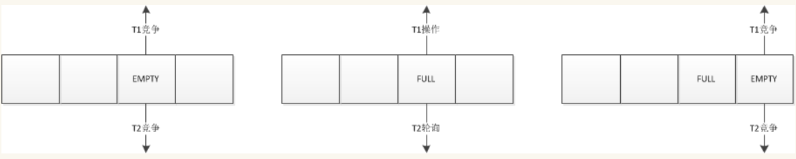
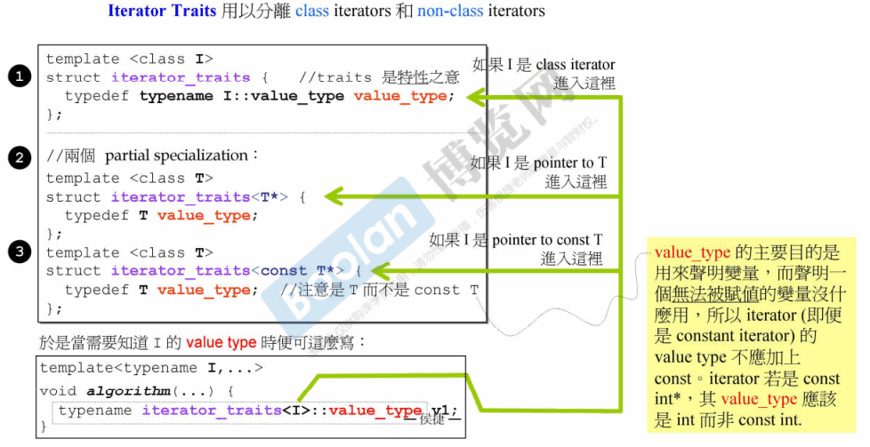
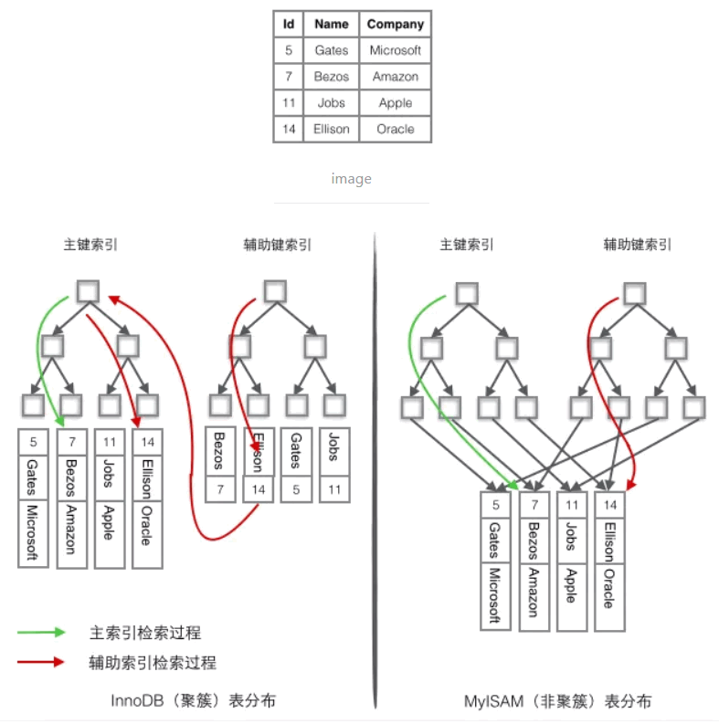

<!-- START doctoc generated TOC please keep comment here to allow auto update -->
<!-- DON'T EDIT THIS SECTION, INSTEAD RE-RUN doctoc TO UPDATE -->


- [面经题扩充](#%E9%9D%A2%E7%BB%8F%E9%A2%98%E6%89%A9%E5%85%85)
  - [一、计算机网络](#%E4%B8%80%E8%AE%A1%E7%AE%97%E6%9C%BA%E7%BD%91%E7%BB%9C)
    - [1、http与https的区别，SSL握手的过程](#1http%E4%B8%8Ehttps%E7%9A%84%E5%8C%BA%E5%88%ABssl%E6%8F%A1%E6%89%8B%E7%9A%84%E8%BF%87%E7%A8%8B)
    - [2、如果第三次ack没有收到怎么办，四次握手可以吗](#2%E5%A6%82%E6%9E%9C%E7%AC%AC%E4%B8%89%E6%AC%A1ack%E6%B2%A1%E6%9C%89%E6%94%B6%E5%88%B0%E6%80%8E%E4%B9%88%E5%8A%9E%E5%9B%9B%E6%AC%A1%E6%8F%A1%E6%89%8B%E5%8F%AF%E4%BB%A5%E5%90%97)
    - [3、怎么保证消息的可靠性](#3%E6%80%8E%E4%B9%88%E4%BF%9D%E8%AF%81%E6%B6%88%E6%81%AF%E7%9A%84%E5%8F%AF%E9%9D%A0%E6%80%A7)
    - [4、消息过期机制是怎么实现的](#4%E6%B6%88%E6%81%AF%E8%BF%87%E6%9C%9F%E6%9C%BA%E5%88%B6%E6%98%AF%E6%80%8E%E4%B9%88%E5%AE%9E%E7%8E%B0%E7%9A%84)
    - [5、秒传，断点续传，重传，断点下载怎么做](#5%E7%A7%92%E4%BC%A0%E6%96%AD%E7%82%B9%E7%BB%AD%E4%BC%A0%E9%87%8D%E4%BC%A0%E6%96%AD%E7%82%B9%E4%B8%8B%E8%BD%BD%E6%80%8E%E4%B9%88%E5%81%9A)
    - [6、怎么探查网络数据带宽，在不占满的情况下](#6%E6%80%8E%E4%B9%88%E6%8E%A2%E6%9F%A5%E7%BD%91%E7%BB%9C%E6%95%B0%E6%8D%AE%E5%B8%A6%E5%AE%BD%E5%9C%A8%E4%B8%8D%E5%8D%A0%E6%BB%A1%E7%9A%84%E6%83%85%E5%86%B5%E4%B8%8B)
    - [7、计算机网络中的https能详细说一下吗](#7%E8%AE%A1%E7%AE%97%E6%9C%BA%E7%BD%91%E7%BB%9C%E4%B8%AD%E7%9A%84https%E8%83%BD%E8%AF%A6%E7%BB%86%E8%AF%B4%E4%B8%80%E4%B8%8B%E5%90%97)
    - [8、get和post最多能发多大的数据量](#8get%E5%92%8Cpost%E6%9C%80%E5%A4%9A%E8%83%BD%E5%8F%91%E5%A4%9A%E5%A4%A7%E7%9A%84%E6%95%B0%E6%8D%AE%E9%87%8F)
    - [9、浏览器输入url的传输过程，dns是怎么解析的。DNS的查询方式(递归和迭代)](#9%E6%B5%8F%E8%A7%88%E5%99%A8%E8%BE%93%E5%85%A5url%E7%9A%84%E4%BC%A0%E8%BE%93%E8%BF%87%E7%A8%8Bdns%E6%98%AF%E6%80%8E%E4%B9%88%E8%A7%A3%E6%9E%90%E7%9A%84dns%E7%9A%84%E6%9F%A5%E8%AF%A2%E6%96%B9%E5%BC%8F%E9%80%92%E5%BD%92%E5%92%8C%E8%BF%AD%E4%BB%A3)
    - [10、怎么知道HTTP报文体长度](#10%E6%80%8E%E4%B9%88%E7%9F%A5%E9%81%93http%E6%8A%A5%E6%96%87%E4%BD%93%E9%95%BF%E5%BA%A6)
    - [11、SYN Flood攻击](#11syn-flood%E6%94%BB%E5%87%BB)
    - [12、traceroute的过程](#12traceroute%E7%9A%84%E8%BF%87%E7%A8%8B)
    - [13、ping有没有端口](#13ping%E6%9C%89%E6%B2%A1%E6%9C%89%E7%AB%AF%E5%8F%A3)
    - [14、计算机网络体系为什么要按照现有体系进行分层](#14%E8%AE%A1%E7%AE%97%E6%9C%BA%E7%BD%91%E7%BB%9C%E4%BD%93%E7%B3%BB%E4%B8%BA%E4%BB%80%E4%B9%88%E8%A6%81%E6%8C%89%E7%85%A7%E7%8E%B0%E6%9C%89%E4%BD%93%E7%B3%BB%E8%BF%9B%E8%A1%8C%E5%88%86%E5%B1%82)
    - [15、如何查看当前网络和磁盘是否跑满](#15%E5%A6%82%E4%BD%95%E6%9F%A5%E7%9C%8B%E5%BD%93%E5%89%8D%E7%BD%91%E7%BB%9C%E5%92%8C%E7%A3%81%E7%9B%98%E6%98%AF%E5%90%A6%E8%B7%91%E6%BB%A1)
    - [16、TCP 握手中的ACK和Seq](#16tcp-%E6%8F%A1%E6%89%8B%E4%B8%AD%E7%9A%84ack%E5%92%8Cseq)
    - [17、网络延时优化](#17%E7%BD%91%E7%BB%9C%E5%BB%B6%E6%97%B6%E4%BC%98%E5%8C%96)
    - [18、如何实现RDUP（可靠UDP）](#18%E5%A6%82%E4%BD%95%E5%AE%9E%E7%8E%B0rdup%E5%8F%AF%E9%9D%A0udp)
    - [19、说下常见的HTTP状态码](#19%E8%AF%B4%E4%B8%8B%E5%B8%B8%E8%A7%81%E7%9A%84http%E7%8A%B6%E6%80%81%E7%A0%81)
    - [20、NAT的原理](#20nat%E7%9A%84%E5%8E%9F%E7%90%86)
    - [21、为何 tcp 中的 time_wait 状态持续 2msl 而不是 msl 呢](#21%E4%B8%BA%E4%BD%95-tcp-%E4%B8%AD%E7%9A%84-time_wait-%E7%8A%B6%E6%80%81%E6%8C%81%E7%BB%AD-2msl-%E8%80%8C%E4%B8%8D%E6%98%AF-msl-%E5%91%A2)
    - [22、为何TCP采用随机序列号](#22%E4%B8%BA%E4%BD%95tcp%E9%87%87%E7%94%A8%E9%9A%8F%E6%9C%BA%E5%BA%8F%E5%88%97%E5%8F%B7)
    - [23、服务端出现大量time_wait](#23%E6%9C%8D%E5%8A%A1%E7%AB%AF%E5%87%BA%E7%8E%B0%E5%A4%A7%E9%87%8Ftime_wait)
    - [24、cookie被禁用了怎么办](#24cookie%E8%A2%AB%E7%A6%81%E7%94%A8%E4%BA%86%E6%80%8E%E4%B9%88%E5%8A%9E)
    - [25、TCP 四次挥手last ack 报文没有收到ack怎么办](#25tcp-%E5%9B%9B%E6%AC%A1%E6%8C%A5%E6%89%8Blast-ack-%E6%8A%A5%E6%96%87%E6%B2%A1%E6%9C%89%E6%94%B6%E5%88%B0ack%E6%80%8E%E4%B9%88%E5%8A%9E)
    - [26、TCP/IP 协议栈有哪些协议，为什么要设计为分层式的？](#26tcpip-%E5%8D%8F%E8%AE%AE%E6%A0%88%E6%9C%89%E5%93%AA%E4%BA%9B%E5%8D%8F%E8%AE%AE%E4%B8%BA%E4%BB%80%E4%B9%88%E8%A6%81%E8%AE%BE%E8%AE%A1%E4%B8%BA%E5%88%86%E5%B1%82%E5%BC%8F%E7%9A%84)
    - [27、TCP三次握手和socket族函数怎么对应的？没有accept 会导致连接建立失败吗？](#27tcp%E4%B8%89%E6%AC%A1%E6%8F%A1%E6%89%8B%E5%92%8Csocket%E6%97%8F%E5%87%BD%E6%95%B0%E6%80%8E%E4%B9%88%E5%AF%B9%E5%BA%94%E7%9A%84%E6%B2%A1%E6%9C%89accept-%E4%BC%9A%E5%AF%BC%E8%87%B4%E8%BF%9E%E6%8E%A5%E5%BB%BA%E7%AB%8B%E5%A4%B1%E8%B4%A5%E5%90%97)
    - [28、MySQL如何实现ACID的？原理是什么？](#28mysql%E5%A6%82%E4%BD%95%E5%AE%9E%E7%8E%B0acid%E7%9A%84%E5%8E%9F%E7%90%86%E6%98%AF%E4%BB%80%E4%B9%88)
    - [29、使用Redis时，对热点key怎么解决？](#29%E4%BD%BF%E7%94%A8redis%E6%97%B6%E5%AF%B9%E7%83%AD%E7%82%B9key%E6%80%8E%E4%B9%88%E8%A7%A3%E5%86%B3)
    - [30、使用Redis时，遇到一个很大的Value怎么办？](#30%E4%BD%BF%E7%94%A8redis%E6%97%B6%E9%81%87%E5%88%B0%E4%B8%80%E4%B8%AA%E5%BE%88%E5%A4%A7%E7%9A%84value%E6%80%8E%E4%B9%88%E5%8A%9E)
  - [二、操作系统](#%E4%BA%8C%E6%93%8D%E4%BD%9C%E7%B3%BB%E7%BB%9F)
    - [1、线程池中线程异常或者死循环了，该如何解决](#1%E7%BA%BF%E7%A8%8B%E6%B1%A0%E4%B8%AD%E7%BA%BF%E7%A8%8B%E5%BC%82%E5%B8%B8%E6%88%96%E8%80%85%E6%AD%BB%E5%BE%AA%E7%8E%AF%E4%BA%86%E8%AF%A5%E5%A6%82%E4%BD%95%E8%A7%A3%E5%86%B3)
    - [2、某个协程coredump或发生异常了，该如何解决](#2%E6%9F%90%E4%B8%AA%E5%8D%8F%E7%A8%8Bcoredump%E6%88%96%E5%8F%91%E7%94%9F%E5%BC%82%E5%B8%B8%E4%BA%86%E8%AF%A5%E5%A6%82%E4%BD%95%E8%A7%A3%E5%86%B3)
    - [3、Linux openlog函数是什么？](#3linux-openlog%E5%87%BD%E6%95%B0%E6%98%AF%E4%BB%80%E4%B9%88)
    - [4、为什么要有字节对齐](#4%E4%B8%BA%E4%BB%80%E4%B9%88%E8%A6%81%E6%9C%89%E5%AD%97%E8%8A%82%E5%AF%B9%E9%BD%90)
    - [5、函数调用步骤](#5%E5%87%BD%E6%95%B0%E8%B0%83%E7%94%A8%E6%AD%A5%E9%AA%A4)
    - [6、GDB调试程序的使用](#6gdb%E8%B0%83%E8%AF%95%E7%A8%8B%E5%BA%8F%E7%9A%84%E4%BD%BF%E7%94%A8)
    - [7、查看程序运行所需的共享库：ldd命令](#7%E6%9F%A5%E7%9C%8B%E7%A8%8B%E5%BA%8F%E8%BF%90%E8%A1%8C%E6%89%80%E9%9C%80%E7%9A%84%E5%85%B1%E4%BA%AB%E5%BA%93ldd%E5%91%BD%E4%BB%A4)
    - [8、查看cpu使用情况：top命令](#8%E6%9F%A5%E7%9C%8Bcpu%E4%BD%BF%E7%94%A8%E6%83%85%E5%86%B5top%E5%91%BD%E4%BB%A4)
    - [9、介绍一下grep, cat, sed, awk命令](#9%E4%BB%8B%E7%BB%8D%E4%B8%80%E4%B8%8Bgrep-cat-sed-awk%E5%91%BD%E4%BB%A4)
    - [10、页面为什么是4KB，可以更大吗？](#10%E9%A1%B5%E9%9D%A2%E4%B8%BA%E4%BB%80%E4%B9%88%E6%98%AF4kb%E5%8F%AF%E4%BB%A5%E6%9B%B4%E5%A4%A7%E5%90%97)
    - [11、线程的私有数据有哪些，公有有哪些](#11%E7%BA%BF%E7%A8%8B%E7%9A%84%E7%A7%81%E6%9C%89%E6%95%B0%E6%8D%AE%E6%9C%89%E5%93%AA%E4%BA%9B%E5%85%AC%E6%9C%89%E6%9C%89%E5%93%AA%E4%BA%9B)
    - [12、多线程创建、切换的过程](#12%E5%A4%9A%E7%BA%BF%E7%A8%8B%E5%88%9B%E5%BB%BA%E5%88%87%E6%8D%A2%E7%9A%84%E8%BF%87%E7%A8%8B)
    - [13、多进程创建、切换的过程，怎么保留断点信息](#13%E5%A4%9A%E8%BF%9B%E7%A8%8B%E5%88%9B%E5%BB%BA%E5%88%87%E6%8D%A2%E7%9A%84%E8%BF%87%E7%A8%8B%E6%80%8E%E4%B9%88%E4%BF%9D%E7%95%99%E6%96%AD%E7%82%B9%E4%BF%A1%E6%81%AF)
    - [14、其他线程怎么找到互斥锁被上锁了？互斥锁底层原理](#14%E5%85%B6%E4%BB%96%E7%BA%BF%E7%A8%8B%E6%80%8E%E4%B9%88%E6%89%BE%E5%88%B0%E4%BA%92%E6%96%A5%E9%94%81%E8%A2%AB%E4%B8%8A%E9%94%81%E4%BA%86%E4%BA%92%E6%96%A5%E9%94%81%E5%BA%95%E5%B1%82%E5%8E%9F%E7%90%86)
    - [15、epoll是怎么找到连接上有事件发生的](#15epoll%E6%98%AF%E6%80%8E%E4%B9%88%E6%89%BE%E5%88%B0%E8%BF%9E%E6%8E%A5%E4%B8%8A%E6%9C%89%E4%BA%8B%E4%BB%B6%E5%8F%91%E7%94%9F%E7%9A%84)
    - [16、ET和LT的区别](#16et%E5%92%8Clt%E7%9A%84%E5%8C%BA%E5%88%AB)
    - [17、对服务器怎么进行压测的，压测指标是什么](#17%E5%AF%B9%E6%9C%8D%E5%8A%A1%E5%99%A8%E6%80%8E%E4%B9%88%E8%BF%9B%E8%A1%8C%E5%8E%8B%E6%B5%8B%E7%9A%84%E5%8E%8B%E6%B5%8B%E6%8C%87%E6%A0%87%E6%98%AF%E4%BB%80%E4%B9%88)
    - [18、多台服务器的扩容方案](#18%E5%A4%9A%E5%8F%B0%E6%9C%8D%E5%8A%A1%E5%99%A8%E7%9A%84%E6%89%A9%E5%AE%B9%E6%96%B9%E6%A1%88)
    - [19、防止硬盘上数据丢失](#19%E9%98%B2%E6%AD%A2%E7%A1%AC%E7%9B%98%E4%B8%8A%E6%95%B0%E6%8D%AE%E4%B8%A2%E5%A4%B1)
    - [20、主机上正在接受数据，挂掉了，如何处理来保护数据](#20%E4%B8%BB%E6%9C%BA%E4%B8%8A%E6%AD%A3%E5%9C%A8%E6%8E%A5%E5%8F%97%E6%95%B0%E6%8D%AE%E6%8C%82%E6%8E%89%E4%BA%86%E5%A6%82%E4%BD%95%E5%A4%84%E7%90%86%E6%9D%A5%E4%BF%9D%E6%8A%A4%E6%95%B0%E6%8D%AE)
    - [21、负数二进制表示，浮点数二进制表示](#21%E8%B4%9F%E6%95%B0%E4%BA%8C%E8%BF%9B%E5%88%B6%E8%A1%A8%E7%A4%BA%E6%B5%AE%E7%82%B9%E6%95%B0%E4%BA%8C%E8%BF%9B%E5%88%B6%E8%A1%A8%E7%A4%BA)
    - [22、tcp和udp能同时监听一个端口号吗，为什么](#22tcp%E5%92%8Cudp%E8%83%BD%E5%90%8C%E6%97%B6%E7%9B%91%E5%90%AC%E4%B8%80%E4%B8%AA%E7%AB%AF%E5%8F%A3%E5%8F%B7%E5%90%97%E4%B8%BA%E4%BB%80%E4%B9%88)
    - [23、惊群问题](#23%E6%83%8A%E7%BE%A4%E9%97%AE%E9%A2%98)
    - [24、RST报文和哪个信号相关](#24rst%E6%8A%A5%E6%96%87%E5%92%8C%E5%93%AA%E4%B8%AA%E4%BF%A1%E5%8F%B7%E7%9B%B8%E5%85%B3)
    - [25、Linux内核是怎么实现定时器的](#25linux%E5%86%85%E6%A0%B8%E6%98%AF%E6%80%8E%E4%B9%88%E5%AE%9E%E7%8E%B0%E5%AE%9A%E6%97%B6%E5%99%A8%E7%9A%84)
    - [26、解释top命令右上角的三个数字，top命令怎么查看线程，怎么查看进程，你会关注top命令的哪些字段](#26%E8%A7%A3%E9%87%8Atop%E5%91%BD%E4%BB%A4%E5%8F%B3%E4%B8%8A%E8%A7%92%E7%9A%84%E4%B8%89%E4%B8%AA%E6%95%B0%E5%AD%97top%E5%91%BD%E4%BB%A4%E6%80%8E%E4%B9%88%E6%9F%A5%E7%9C%8B%E7%BA%BF%E7%A8%8B%E6%80%8E%E4%B9%88%E6%9F%A5%E7%9C%8B%E8%BF%9B%E7%A8%8B%E4%BD%A0%E4%BC%9A%E5%85%B3%E6%B3%A8top%E5%91%BD%E4%BB%A4%E7%9A%84%E5%93%AA%E4%BA%9B%E5%AD%97%E6%AE%B5)
    - [27、怎么按照内存使用大小对进程排序](#27%E6%80%8E%E4%B9%88%E6%8C%89%E7%85%A7%E5%86%85%E5%AD%98%E4%BD%BF%E7%94%A8%E5%A4%A7%E5%B0%8F%E5%AF%B9%E8%BF%9B%E7%A8%8B%E6%8E%92%E5%BA%8F)
    - [28、Linux进程调度算法内存调度算法](#28linux%E8%BF%9B%E7%A8%8B%E8%B0%83%E5%BA%A6%E7%AE%97%E6%B3%95%E5%86%85%E5%AD%98%E8%B0%83%E5%BA%A6%E7%AE%97%E6%B3%95)
    - [29、在一台内存为2G的机器上，malloc(20G)会怎么样？new 20G呢？](#29%E5%9C%A8%E4%B8%80%E5%8F%B0%E5%86%85%E5%AD%98%E4%B8%BA2g%E7%9A%84%E6%9C%BA%E5%99%A8%E4%B8%8Amalloc20g%E4%BC%9A%E6%80%8E%E4%B9%88%E6%A0%B7new-20g%E5%91%A2)
    - [30、如何查看内存空间？如何查看磁盘空间？(free; df -h)](#30%E5%A6%82%E4%BD%95%E6%9F%A5%E7%9C%8B%E5%86%85%E5%AD%98%E7%A9%BA%E9%97%B4%E5%A6%82%E4%BD%95%E6%9F%A5%E7%9C%8B%E7%A3%81%E7%9B%98%E7%A9%BA%E9%97%B4free-df--h)
    - [31、cache一致性](#31cache%E4%B8%80%E8%87%B4%E6%80%A7)
    - [32、管道命令如何实现？](#32%E7%AE%A1%E9%81%93%E5%91%BD%E4%BB%A4%E5%A6%82%E4%BD%95%E5%AE%9E%E7%8E%B0)
    - [33、写脚本杀死指定名称的进程](#33%E5%86%99%E8%84%9A%E6%9C%AC%E6%9D%80%E6%AD%BB%E6%8C%87%E5%AE%9A%E5%90%8D%E7%A7%B0%E7%9A%84%E8%BF%9B%E7%A8%8B)
    - [34、文件读经历了哪些过程](#34%E6%96%87%E4%BB%B6%E8%AF%BB%E7%BB%8F%E5%8E%86%E4%BA%86%E5%93%AA%E4%BA%9B%E8%BF%87%E7%A8%8B)
    - [35、有哪些死锁避免的解决方法](#35%E6%9C%89%E5%93%AA%E4%BA%9B%E6%AD%BB%E9%94%81%E9%81%BF%E5%85%8D%E7%9A%84%E8%A7%A3%E5%86%B3%E6%96%B9%E6%B3%95)
    - [36、对于大文件，为什么CP比MV慢很多](#36%E5%AF%B9%E4%BA%8E%E5%A4%A7%E6%96%87%E4%BB%B6%E4%B8%BA%E4%BB%80%E4%B9%88cp%E6%AF%94mv%E6%85%A2%E5%BE%88%E5%A4%9A)
    - [37、哪些时候会发生上下文切换，上下文切换过程中经历了什么](#37%E5%93%AA%E4%BA%9B%E6%97%B6%E5%80%99%E4%BC%9A%E5%8F%91%E7%94%9F%E4%B8%8A%E4%B8%8B%E6%96%87%E5%88%87%E6%8D%A2%E4%B8%8A%E4%B8%8B%E6%96%87%E5%88%87%E6%8D%A2%E8%BF%87%E7%A8%8B%E4%B8%AD%E7%BB%8F%E5%8E%86%E4%BA%86%E4%BB%80%E4%B9%88)
    - [38、如果父进程没有调用wait、waitpid，怎么杀死僵尸进程](#38%E5%A6%82%E6%9E%9C%E7%88%B6%E8%BF%9B%E7%A8%8B%E6%B2%A1%E6%9C%89%E8%B0%83%E7%94%A8waitwaitpid%E6%80%8E%E4%B9%88%E6%9D%80%E6%AD%BB%E5%83%B5%E5%B0%B8%E8%BF%9B%E7%A8%8B)
    - [39、如果rm以及rm -f一个正在被使用的文件，会发生什么](#39%E5%A6%82%E6%9E%9Crm%E4%BB%A5%E5%8F%8Arm--f%E4%B8%80%E4%B8%AA%E6%AD%A3%E5%9C%A8%E8%A2%AB%E4%BD%BF%E7%94%A8%E7%9A%84%E6%96%87%E4%BB%B6%E4%BC%9A%E5%8F%91%E7%94%9F%E4%BB%80%E4%B9%88)
    - [40、gdb断点的原理是什么](#40gdb%E6%96%AD%E7%82%B9%E7%9A%84%E5%8E%9F%E7%90%86%E6%98%AF%E4%BB%80%E4%B9%88)
    - [41、coredump情况，如何用gdb调试coredump](#41coredump%E6%83%85%E5%86%B5%E5%A6%82%E4%BD%95%E7%94%A8gdb%E8%B0%83%E8%AF%95coredump)
    - [43、strace 可以做什么](#43strace-%E5%8F%AF%E4%BB%A5%E5%81%9A%E4%BB%80%E4%B9%88)
    - [44、ulimit命令用过吗](#44ulimit%E5%91%BD%E4%BB%A4%E7%94%A8%E8%BF%87%E5%90%97)
    - [45、valgrind 工具用过吗](#45valgrind-%E5%B7%A5%E5%85%B7%E7%94%A8%E8%BF%87%E5%90%97)
    - [46、谈谈无锁队列的实现](#46%E8%B0%88%E8%B0%88%E6%97%A0%E9%94%81%E9%98%9F%E5%88%97%E7%9A%84%E5%AE%9E%E7%8E%B0)
    - [47、int类型的全局变量读、写、自增哪些是原子性的](#47int%E7%B1%BB%E5%9E%8B%E7%9A%84%E5%85%A8%E5%B1%80%E5%8F%98%E9%87%8F%E8%AF%BB%E5%86%99%E8%87%AA%E5%A2%9E%E5%93%AA%E4%BA%9B%E6%98%AF%E5%8E%9F%E5%AD%90%E6%80%A7%E7%9A%84)
    - [48、如何测试网络库的性能](#48%E5%A6%82%E4%BD%95%E6%B5%8B%E8%AF%95%E7%BD%91%E7%BB%9C%E5%BA%93%E7%9A%84%E6%80%A7%E8%83%BD)
    - [49、进程控制块](#49%E8%BF%9B%E7%A8%8B%E6%8E%A7%E5%88%B6%E5%9D%97)
    - [50、exit、_exit、abort和return区别](#50exit_exitabort%E5%92%8Creturn%E5%8C%BA%E5%88%AB)
    - [51、LRU算法如何实现](#51lru%E7%AE%97%E6%B3%95%E5%A6%82%E4%BD%95%E5%AE%9E%E7%8E%B0)
    - [52、为什么线程的崩溃会导致这个进程的崩溃](#52%E4%B8%BA%E4%BB%80%E4%B9%88%E7%BA%BF%E7%A8%8B%E7%9A%84%E5%B4%A9%E6%BA%83%E4%BC%9A%E5%AF%BC%E8%87%B4%E8%BF%99%E4%B8%AA%E8%BF%9B%E7%A8%8B%E7%9A%84%E5%B4%A9%E6%BA%83)
    - [53、多线程编程要注意哪些方面](#53%E5%A4%9A%E7%BA%BF%E7%A8%8B%E7%BC%96%E7%A8%8B%E8%A6%81%E6%B3%A8%E6%84%8F%E5%93%AA%E4%BA%9B%E6%96%B9%E9%9D%A2)
    - [54、如何判断一个线程挂掉](#54%E5%A6%82%E4%BD%95%E5%88%A4%E6%96%AD%E4%B8%80%E4%B8%AA%E7%BA%BF%E7%A8%8B%E6%8C%82%E6%8E%89)
    - [55、有epoll了，select还有存在的价值吗](#55%E6%9C%89epoll%E4%BA%86select%E8%BF%98%E6%9C%89%E5%AD%98%E5%9C%A8%E7%9A%84%E4%BB%B7%E5%80%BC%E5%90%97)
    - [56、如何查看耗时最大的函数？使用什么工具？](#56%E5%A6%82%E4%BD%95%E6%9F%A5%E7%9C%8B%E8%80%97%E6%97%B6%E6%9C%80%E5%A4%A7%E7%9A%84%E5%87%BD%E6%95%B0%E4%BD%BF%E7%94%A8%E4%BB%80%E4%B9%88%E5%B7%A5%E5%85%B7)
    - [57、有两个进程，有同名变量，这个变量是共享的吗？如果是动态库呢？](#57%E6%9C%89%E4%B8%A4%E4%B8%AA%E8%BF%9B%E7%A8%8B%E6%9C%89%E5%90%8C%E5%90%8D%E5%8F%98%E9%87%8F%E8%BF%99%E4%B8%AA%E5%8F%98%E9%87%8F%E6%98%AF%E5%85%B1%E4%BA%AB%E7%9A%84%E5%90%97%E5%A6%82%E6%9E%9C%E6%98%AF%E5%8A%A8%E6%80%81%E5%BA%93%E5%91%A2)
    - [58、全局变量未初始化时为什么是随机值](#58%E5%85%A8%E5%B1%80%E5%8F%98%E9%87%8F%E6%9C%AA%E5%88%9D%E5%A7%8B%E5%8C%96%E6%97%B6%E4%B8%BA%E4%BB%80%E4%B9%88%E6%98%AF%E9%9A%8F%E6%9C%BA%E5%80%BC)
    - [59、线程让步（yield）和线程睡眠(sleep)区别](#59%E7%BA%BF%E7%A8%8B%E8%AE%A9%E6%AD%A5yield%E5%92%8C%E7%BA%BF%E7%A8%8B%E7%9D%A1%E7%9C%A0sleep%E5%8C%BA%E5%88%AB)
    - [60、说下快表](#60%E8%AF%B4%E4%B8%8B%E5%BF%AB%E8%A1%A8)
    - [61、银行家算法](#61%E9%93%B6%E8%A1%8C%E5%AE%B6%E7%AE%97%E6%B3%95)
    - [62、如何控制客户端的并发数](#62%E5%A6%82%E4%BD%95%E6%8E%A7%E5%88%B6%E5%AE%A2%E6%88%B7%E7%AB%AF%E7%9A%84%E5%B9%B6%E5%8F%91%E6%95%B0)
    - [63、线程数应该设置为多大](#63%E7%BA%BF%E7%A8%8B%E6%95%B0%E5%BA%94%E8%AF%A5%E8%AE%BE%E7%BD%AE%E4%B8%BA%E5%A4%9A%E5%A4%A7)
    - [64、共享内存在哪创建的](#64%E5%85%B1%E4%BA%AB%E5%86%85%E5%AD%98%E5%9C%A8%E5%93%AA%E5%88%9B%E5%BB%BA%E7%9A%84)
    - [66、如何检查死锁](#66%E5%A6%82%E4%BD%95%E6%A3%80%E6%9F%A5%E6%AD%BB%E9%94%81)
    - [67、CAS的缺点](#67cas%E7%9A%84%E7%BC%BA%E7%82%B9)
    - [68、kill 和 kill -9 区别](#68kill-%E5%92%8C-kill--9-%E5%8C%BA%E5%88%AB)
    - [69、如何让接受到的信号挂起（SIGHUP），并不是忽略](#69%E5%A6%82%E4%BD%95%E8%AE%A9%E6%8E%A5%E5%8F%97%E5%88%B0%E7%9A%84%E4%BF%A1%E5%8F%B7%E6%8C%82%E8%B5%B7sighup%E5%B9%B6%E4%B8%8D%E6%98%AF%E5%BF%BD%E7%95%A5)
    - [70、内存屏障（Memory barrier）](#70%E5%86%85%E5%AD%98%E5%B1%8F%E9%9A%9Cmemory-barrier)
    - [71、共享内存中能否传递指针](#71%E5%85%B1%E4%BA%AB%E5%86%85%E5%AD%98%E4%B8%AD%E8%83%BD%E5%90%A6%E4%BC%A0%E9%80%92%E6%8C%87%E9%92%88)
    - [72、线程会与进程进行内存共享，请问可以共享哪些段](#72%E7%BA%BF%E7%A8%8B%E4%BC%9A%E4%B8%8E%E8%BF%9B%E7%A8%8B%E8%BF%9B%E8%A1%8C%E5%86%85%E5%AD%98%E5%85%B1%E4%BA%AB%E8%AF%B7%E9%97%AE%E5%8F%AF%E4%BB%A5%E5%85%B1%E4%BA%AB%E5%93%AA%E4%BA%9B%E6%AE%B5)
    - [73、分段和分页的具体区别，现代操作系统怎么做的](#73%E5%88%86%E6%AE%B5%E5%92%8C%E5%88%86%E9%A1%B5%E7%9A%84%E5%85%B7%E4%BD%93%E5%8C%BA%E5%88%AB%E7%8E%B0%E4%BB%A3%E6%93%8D%E4%BD%9C%E7%B3%BB%E7%BB%9F%E6%80%8E%E4%B9%88%E5%81%9A%E7%9A%84)
    - [74、为进程分配单独空间的好处](#74%E4%B8%BA%E8%BF%9B%E7%A8%8B%E5%88%86%E9%85%8D%E5%8D%95%E7%8B%AC%E7%A9%BA%E9%97%B4%E7%9A%84%E5%A5%BD%E5%A4%84)
    - [75、系统抖动](#75%E7%B3%BB%E7%BB%9F%E6%8A%96%E5%8A%A8)
    - [76、errno是什么（错误码），放在哪里（全局变量位置），errno是线程安全的吗？](#76errno%E6%98%AF%E4%BB%80%E4%B9%88%E9%94%99%E8%AF%AF%E7%A0%81%E6%94%BE%E5%9C%A8%E5%93%AA%E9%87%8C%E5%85%A8%E5%B1%80%E5%8F%98%E9%87%8F%E4%BD%8D%E7%BD%AEerrno%E6%98%AF%E7%BA%BF%E7%A8%8B%E5%AE%89%E5%85%A8%E7%9A%84%E5%90%97)
    - [77、进程的内存、内核空间是什？有哪些区？栈为什么是向下生长的？](#77%E8%BF%9B%E7%A8%8B%E7%9A%84%E5%86%85%E5%AD%98%E5%86%85%E6%A0%B8%E7%A9%BA%E9%97%B4%E6%98%AF%E4%BB%80%E6%9C%89%E5%93%AA%E4%BA%9B%E5%8C%BA%E6%A0%88%E4%B8%BA%E4%BB%80%E4%B9%88%E6%98%AF%E5%90%91%E4%B8%8B%E7%94%9F%E9%95%BF%E7%9A%84)
    - [78、线程的栈共享吗？堆呢？进程的内核栈呢？](#78%E7%BA%BF%E7%A8%8B%E7%9A%84%E6%A0%88%E5%85%B1%E4%BA%AB%E5%90%97%E5%A0%86%E5%91%A2%E8%BF%9B%E7%A8%8B%E7%9A%84%E5%86%85%E6%A0%B8%E6%A0%88%E5%91%A2)
    - [79、Linux 下，程序从静态文件到在内存中运行起来，经过了哪些步骤？](#79linux-%E4%B8%8B%E7%A8%8B%E5%BA%8F%E4%BB%8E%E9%9D%99%E6%80%81%E6%96%87%E4%BB%B6%E5%88%B0%E5%9C%A8%E5%86%85%E5%AD%98%E4%B8%AD%E8%BF%90%E8%A1%8C%E8%B5%B7%E6%9D%A5%E7%BB%8F%E8%BF%87%E4%BA%86%E5%93%AA%E4%BA%9B%E6%AD%A5%E9%AA%A4)
    - [80、cas为什么开销小？为什么互斥锁开销大？开销具体指什么？](#80cas%E4%B8%BA%E4%BB%80%E4%B9%88%E5%BC%80%E9%94%80%E5%B0%8F%E4%B8%BA%E4%BB%80%E4%B9%88%E4%BA%92%E6%96%A5%E9%94%81%E5%BC%80%E9%94%80%E5%A4%A7%E5%BC%80%E9%94%80%E5%85%B7%E4%BD%93%E6%8C%87%E4%BB%80%E4%B9%88)
    - [81、shutdown和close区别](#81shutdown%E5%92%8Cclose%E5%8C%BA%E5%88%AB)
    - [82、介绍一下页表。页表的数据结构，除了有地址相关的参数还有什么？](#82%E4%BB%8B%E7%BB%8D%E4%B8%80%E4%B8%8B%E9%A1%B5%E8%A1%A8%E9%A1%B5%E8%A1%A8%E7%9A%84%E6%95%B0%E6%8D%AE%E7%BB%93%E6%9E%84%E9%99%A4%E4%BA%86%E6%9C%89%E5%9C%B0%E5%9D%80%E7%9B%B8%E5%85%B3%E7%9A%84%E5%8F%82%E6%95%B0%E8%BF%98%E6%9C%89%E4%BB%80%E4%B9%88)
    - [83、伙伴系统？](#83%E4%BC%99%E4%BC%B4%E7%B3%BB%E7%BB%9F)
    - [84、阻塞IO和非阻塞IO，哪个性能更好？](#84%E9%98%BB%E5%A1%9Eio%E5%92%8C%E9%9D%9E%E9%98%BB%E5%A1%9Eio%E5%93%AA%E4%B8%AA%E6%80%A7%E8%83%BD%E6%9B%B4%E5%A5%BD)
    - [85、linux的一些常用命令：查看cpu网络磁盘内存的命令都知道哪些？](#85linux%E7%9A%84%E4%B8%80%E4%BA%9B%E5%B8%B8%E7%94%A8%E5%91%BD%E4%BB%A4%E6%9F%A5%E7%9C%8Bcpu%E7%BD%91%E7%BB%9C%E7%A3%81%E7%9B%98%E5%86%85%E5%AD%98%E7%9A%84%E5%91%BD%E4%BB%A4%E9%83%BD%E7%9F%A5%E9%81%93%E5%93%AA%E4%BA%9B)
    - [86、段页式管理](#86%E6%AE%B5%E9%A1%B5%E5%BC%8F%E7%AE%A1%E7%90%86)
    - [87、实现阻塞队列](#87%E5%AE%9E%E7%8E%B0%E9%98%BB%E5%A1%9E%E9%98%9F%E5%88%97)
    - [88、无锁队列实现细节](#88%E6%97%A0%E9%94%81%E9%98%9F%E5%88%97%E5%AE%9E%E7%8E%B0%E7%BB%86%E8%8A%82)
  - [三、C++相关](#%E4%B8%89c%E7%9B%B8%E5%85%B3)
    - [1、C++STL容器的使用方法和底层原理](#1cstl%E5%AE%B9%E5%99%A8%E7%9A%84%E4%BD%BF%E7%94%A8%E6%96%B9%E6%B3%95%E5%92%8C%E5%BA%95%E5%B1%82%E5%8E%9F%E7%90%86)
    - [2、虚函数的使用场景和底层原理](#2%E8%99%9A%E5%87%BD%E6%95%B0%E7%9A%84%E4%BD%BF%E7%94%A8%E5%9C%BA%E6%99%AF%E5%92%8C%E5%BA%95%E5%B1%82%E5%8E%9F%E7%90%86)
    - [3、虚函数表中放什么，虚函数表是子类和父类共用一份吗？](#3%E8%99%9A%E5%87%BD%E6%95%B0%E8%A1%A8%E4%B8%AD%E6%94%BE%E4%BB%80%E4%B9%88%E8%99%9A%E5%87%BD%E6%95%B0%E8%A1%A8%E6%98%AF%E5%AD%90%E7%B1%BB%E5%92%8C%E7%88%B6%E7%B1%BB%E5%85%B1%E7%94%A8%E4%B8%80%E4%BB%BD%E5%90%97)
    - [4、构造函数可以是虚函数吗](#4%E6%9E%84%E9%80%A0%E5%87%BD%E6%95%B0%E5%8F%AF%E4%BB%A5%E6%98%AF%E8%99%9A%E5%87%BD%E6%95%B0%E5%90%97)
    - [5、weak_ptr为什么可以解决循环引用](#5weak_ptr%E4%B8%BA%E4%BB%80%E4%B9%88%E5%8F%AF%E4%BB%A5%E8%A7%A3%E5%86%B3%E5%BE%AA%E7%8E%AF%E5%BC%95%E7%94%A8)
    - [6、unique_lock和lock_guard的区别](#6unique_lock%E5%92%8Clock_guard%E7%9A%84%E5%8C%BA%E5%88%AB)
    - [7、构造函数怎么做可以减少内存拷贝次数，与C++11无关，不要讲移动拷贝构造函数](#7%E6%9E%84%E9%80%A0%E5%87%BD%E6%95%B0%E6%80%8E%E4%B9%88%E5%81%9A%E5%8F%AF%E4%BB%A5%E5%87%8F%E5%B0%91%E5%86%85%E5%AD%98%E6%8B%B7%E8%B4%9D%E6%AC%A1%E6%95%B0%E4%B8%8Ec11%E6%97%A0%E5%85%B3%E4%B8%8D%E8%A6%81%E8%AE%B2%E7%A7%BB%E5%8A%A8%E6%8B%B7%E8%B4%9D%E6%9E%84%E9%80%A0%E5%87%BD%E6%95%B0)
    - [8、vector的push_back()方法的实现](#8vector%E7%9A%84push_back%E6%96%B9%E6%B3%95%E7%9A%84%E5%AE%9E%E7%8E%B0)
    - [9、malloc(0)会怎么样](#9malloc0%E4%BC%9A%E6%80%8E%E4%B9%88%E6%A0%B7)
    - [10、vector和list中，删除末尾的元素，其指针和迭代器如何变化？若删除的是中间的元素呢。](#10vector%E5%92%8Clist%E4%B8%AD%E5%88%A0%E9%99%A4%E6%9C%AB%E5%B0%BE%E7%9A%84%E5%85%83%E7%B4%A0%E5%85%B6%E6%8C%87%E9%92%88%E5%92%8C%E8%BF%AD%E4%BB%A3%E5%99%A8%E5%A6%82%E4%BD%95%E5%8F%98%E5%8C%96%E8%8B%A5%E5%88%A0%E9%99%A4%E7%9A%84%E6%98%AF%E4%B8%AD%E9%97%B4%E7%9A%84%E5%85%83%E7%B4%A0%E5%91%A2)
    - [11、Zero Copy的实现机制](#11zero-copy%E7%9A%84%E5%AE%9E%E7%8E%B0%E6%9C%BA%E5%88%B6)
    - [12、main函数执行前后会执行什么代码](#12main%E5%87%BD%E6%95%B0%E6%89%A7%E8%A1%8C%E5%89%8D%E5%90%8E%E4%BC%9A%E6%89%A7%E8%A1%8C%E4%BB%80%E4%B9%88%E4%BB%A3%E7%A0%81)
    - [13、为什么multiset和multimap能做到插入重复元素](#13%E4%B8%BA%E4%BB%80%E4%B9%88multiset%E5%92%8Cmultimap%E8%83%BD%E5%81%9A%E5%88%B0%E6%8F%92%E5%85%A5%E9%87%8D%E5%A4%8D%E5%85%83%E7%B4%A0)
    - [14、有了vector为什么还要stack](#14%E6%9C%89%E4%BA%86vector%E4%B8%BA%E4%BB%80%E4%B9%88%E8%BF%98%E8%A6%81stack)
    - [15、STL中的迭代器为什么需要模板萃取](#15stl%E4%B8%AD%E7%9A%84%E8%BF%AD%E4%BB%A3%E5%99%A8%E4%B8%BA%E4%BB%80%E4%B9%88%E9%9C%80%E8%A6%81%E6%A8%A1%E6%9D%BF%E8%90%83%E5%8F%96)
    - [16、STL 线程安全吗](#16stl-%E7%BA%BF%E7%A8%8B%E5%AE%89%E5%85%A8%E5%90%97)
    - [17、谈谈malloc的底层实现](#17%E8%B0%88%E8%B0%88malloc%E7%9A%84%E5%BA%95%E5%B1%82%E5%AE%9E%E7%8E%B0)
    - [18、allocator内存分配器](#18allocator%E5%86%85%E5%AD%98%E5%88%86%E9%85%8D%E5%99%A8)
    - [19、vector 的resize和reserve](#19vector-%E7%9A%84resize%E5%92%8Creserve)
    - [20、如何释放vector占用内存](#20%E5%A6%82%E4%BD%95%E9%87%8A%E6%94%BEvector%E5%8D%A0%E7%94%A8%E5%86%85%E5%AD%98)
    - [21、如果只给你一个对象的指针，你怎么才能够调用构造函数](#21%E5%A6%82%E6%9E%9C%E5%8F%AA%E7%BB%99%E4%BD%A0%E4%B8%80%E4%B8%AA%E5%AF%B9%E8%B1%A1%E7%9A%84%E6%8C%87%E9%92%88%E4%BD%A0%E6%80%8E%E4%B9%88%E6%89%8D%E8%83%BD%E5%A4%9F%E8%B0%83%E7%94%A8%E6%9E%84%E9%80%A0%E5%87%BD%E6%95%B0)
    - [22、说下C++代码重用的机制有哪些](#22%E8%AF%B4%E4%B8%8Bc%E4%BB%A3%E7%A0%81%E9%87%8D%E7%94%A8%E7%9A%84%E6%9C%BA%E5%88%B6%E6%9C%89%E5%93%AA%E4%BA%9B)
    - [23、类的构造函数中赋值和初始化列表有什么区别？初始化列表一般用在哪里？](#23%E7%B1%BB%E7%9A%84%E6%9E%84%E9%80%A0%E5%87%BD%E6%95%B0%E4%B8%AD%E8%B5%8B%E5%80%BC%E5%92%8C%E5%88%9D%E5%A7%8B%E5%8C%96%E5%88%97%E8%A1%A8%E6%9C%89%E4%BB%80%E4%B9%88%E5%8C%BA%E5%88%AB%E5%88%9D%E5%A7%8B%E5%8C%96%E5%88%97%E8%A1%A8%E4%B8%80%E8%88%AC%E7%94%A8%E5%9C%A8%E5%93%AA%E9%87%8C)
    - [24、拷贝构造函数和operator=赋值操作区别](#24%E6%8B%B7%E8%B4%9D%E6%9E%84%E9%80%A0%E5%87%BD%E6%95%B0%E5%92%8Coperator%E8%B5%8B%E5%80%BC%E6%93%8D%E4%BD%9C%E5%8C%BA%E5%88%AB)
    - [25、vector的erase和algorithm中的reomve区别](#25vector%E7%9A%84erase%E5%92%8Calgorithm%E4%B8%AD%E7%9A%84reomve%E5%8C%BA%E5%88%AB)
    - [26、int* a=new int[10];delete a;会出现啥问题](#26int-anew-int10delete-a%E4%BC%9A%E5%87%BA%E7%8E%B0%E5%95%A5%E9%97%AE%E9%A2%98)
    - [27、C++模板的原理](#27c%E6%A8%A1%E6%9D%BF%E7%9A%84%E5%8E%9F%E7%90%86)
    - [28、C++的动态多态性和静态多态性](#28c%E7%9A%84%E5%8A%A8%E6%80%81%E5%A4%9A%E6%80%81%E6%80%A7%E5%92%8C%E9%9D%99%E6%80%81%E5%A4%9A%E6%80%81%E6%80%A7)
    - [29、RAII是什么，unique_ptr是什么， unique_ptr可以用=号赋值吗？可以拷贝构造吗？为什么不可以？那unique_ptr怎么赋值？](#29raii%E6%98%AF%E4%BB%80%E4%B9%88unique_ptr%E6%98%AF%E4%BB%80%E4%B9%88-unique_ptr%E5%8F%AF%E4%BB%A5%E7%94%A8%E5%8F%B7%E8%B5%8B%E5%80%BC%E5%90%97%E5%8F%AF%E4%BB%A5%E6%8B%B7%E8%B4%9D%E6%9E%84%E9%80%A0%E5%90%97%E4%B8%BA%E4%BB%80%E4%B9%88%E4%B8%8D%E5%8F%AF%E4%BB%A5%E9%82%A3unique_ptr%E6%80%8E%E4%B9%88%E8%B5%8B%E5%80%BC)
    - [30、shared_ptr的拷贝构造和赋值过程会发生什么](#30shared_ptr%E7%9A%84%E6%8B%B7%E8%B4%9D%E6%9E%84%E9%80%A0%E5%92%8C%E8%B5%8B%E5%80%BC%E8%BF%87%E7%A8%8B%E4%BC%9A%E5%8F%91%E7%94%9F%E4%BB%80%E4%B9%88)
    - [31、map模板在定义的时候需要什么东西](#31map%E6%A8%A1%E6%9D%BF%E5%9C%A8%E5%AE%9A%E4%B9%89%E7%9A%84%E6%97%B6%E5%80%99%E9%9C%80%E8%A6%81%E4%BB%80%E4%B9%88%E4%B8%9C%E8%A5%BF)
    - [32、unordered_map 模板在定义的时候需要什么](#32unordered_map-%E6%A8%A1%E6%9D%BF%E5%9C%A8%E5%AE%9A%E4%B9%89%E7%9A%84%E6%97%B6%E5%80%99%E9%9C%80%E8%A6%81%E4%BB%80%E4%B9%88)
    - [33、多继承、虚函数表的内存分布情况，虚函数表中是什么？（函数指针）函数指针是地址还是偏移？C<-B<-A的继承关系，现在new一个A的指针，dynamic_cast成C类型指针，c和a的地址是否一样？](#33%E5%A4%9A%E7%BB%A7%E6%89%BF%E8%99%9A%E5%87%BD%E6%95%B0%E8%A1%A8%E7%9A%84%E5%86%85%E5%AD%98%E5%88%86%E5%B8%83%E6%83%85%E5%86%B5%E8%99%9A%E5%87%BD%E6%95%B0%E8%A1%A8%E4%B8%AD%E6%98%AF%E4%BB%80%E4%B9%88%E5%87%BD%E6%95%B0%E6%8C%87%E9%92%88%E5%87%BD%E6%95%B0%E6%8C%87%E9%92%88%E6%98%AF%E5%9C%B0%E5%9D%80%E8%BF%98%E6%98%AF%E5%81%8F%E7%A7%BBc-b-a%E7%9A%84%E7%BB%A7%E6%89%BF%E5%85%B3%E7%B3%BB%E7%8E%B0%E5%9C%A8new%E4%B8%80%E4%B8%AAa%E7%9A%84%E6%8C%87%E9%92%88dynamic_cast%E6%88%90c%E7%B1%BB%E5%9E%8B%E6%8C%87%E9%92%88c%E5%92%8Ca%E7%9A%84%E5%9C%B0%E5%9D%80%E6%98%AF%E5%90%A6%E4%B8%80%E6%A0%B7)
    - [34、shared_ptr的引用是不是线程安全的](#34shared_ptr%E7%9A%84%E5%BC%95%E7%94%A8%E6%98%AF%E4%B8%8D%E6%98%AF%E7%BA%BF%E7%A8%8B%E5%AE%89%E5%85%A8%E7%9A%84)
  - [四、数据库相关](#%E5%9B%9B%E6%95%B0%E6%8D%AE%E5%BA%93%E7%9B%B8%E5%85%B3)
    - [1、mysql和redis数据怎么同步](#1mysql%E5%92%8Credis%E6%95%B0%E6%8D%AE%E6%80%8E%E4%B9%88%E5%90%8C%E6%AD%A5)
    - [2、数据库的聚簇索引，为什么叫聚簇索引，讲讲辅助索引？](#2%E6%95%B0%E6%8D%AE%E5%BA%93%E7%9A%84%E8%81%9A%E7%B0%87%E7%B4%A2%E5%BC%95%E4%B8%BA%E4%BB%80%E4%B9%88%E5%8F%AB%E8%81%9A%E7%B0%87%E7%B4%A2%E5%BC%95%E8%AE%B2%E8%AE%B2%E8%BE%85%E5%8A%A9%E7%B4%A2%E5%BC%95)
    - [3、abc三个列，用where a=xx and c=xx，能用到联合索引吗？为什么？怎么用的？](#3abc%E4%B8%89%E4%B8%AA%E5%88%97%E7%94%A8where-axx-and-cxx%E8%83%BD%E7%94%A8%E5%88%B0%E8%81%94%E5%90%88%E7%B4%A2%E5%BC%95%E5%90%97%E4%B8%BA%E4%BB%80%E4%B9%88%E6%80%8E%E4%B9%88%E7%94%A8%E7%9A%84)
    - [4、数据库查行数](#4%E6%95%B0%E6%8D%AE%E5%BA%93%E6%9F%A5%E8%A1%8C%E6%95%B0)
    - [5、幻读是怎么解决的呢](#5%E5%B9%BB%E8%AF%BB%E6%98%AF%E6%80%8E%E4%B9%88%E8%A7%A3%E5%86%B3%E7%9A%84%E5%91%A2)
    - [6、redis和数据库双写怎么保持一致](#6redis%E5%92%8C%E6%95%B0%E6%8D%AE%E5%BA%93%E5%8F%8C%E5%86%99%E6%80%8E%E4%B9%88%E4%BF%9D%E6%8C%81%E4%B8%80%E8%87%B4)
    - [7、redis怎么做持久化，会阻塞吗，子进程在做持久化的过程中又产生的新数据怎么保证完整性](#7redis%E6%80%8E%E4%B9%88%E5%81%9A%E6%8C%81%E4%B9%85%E5%8C%96%E4%BC%9A%E9%98%BB%E5%A1%9E%E5%90%97%E5%AD%90%E8%BF%9B%E7%A8%8B%E5%9C%A8%E5%81%9A%E6%8C%81%E4%B9%85%E5%8C%96%E7%9A%84%E8%BF%87%E7%A8%8B%E4%B8%AD%E5%8F%88%E4%BA%A7%E7%94%9F%E7%9A%84%E6%96%B0%E6%95%B0%E6%8D%AE%E6%80%8E%E4%B9%88%E4%BF%9D%E8%AF%81%E5%AE%8C%E6%95%B4%E6%80%A7)
    - [8、MVCC](#8mvcc)
    - [9、给个高配物理机，Redis不足以完全发挥性能优势，怎么办](#9%E7%BB%99%E4%B8%AA%E9%AB%98%E9%85%8D%E7%89%A9%E7%90%86%E6%9C%BAredis%E4%B8%8D%E8%B6%B3%E4%BB%A5%E5%AE%8C%E5%85%A8%E5%8F%91%E6%8C%A5%E6%80%A7%E8%83%BD%E4%BC%98%E5%8A%BF%E6%80%8E%E4%B9%88%E5%8A%9E)
    - [10、Mysql如何实现主从一致性](#10mysql%E5%A6%82%E4%BD%95%E5%AE%9E%E7%8E%B0%E4%B8%BB%E4%BB%8E%E4%B8%80%E8%87%B4%E6%80%A7)
    - [11、Redis的底层数据类型，zset的实现，使用场景](#11redis%E7%9A%84%E5%BA%95%E5%B1%82%E6%95%B0%E6%8D%AE%E7%B1%BB%E5%9E%8Bzset%E7%9A%84%E5%AE%9E%E7%8E%B0%E4%BD%BF%E7%94%A8%E5%9C%BA%E6%99%AF)
    - [12、各种日志的理解（头条，小米）](#12%E5%90%84%E7%A7%8D%E6%97%A5%E5%BF%97%E7%9A%84%E7%90%86%E8%A7%A3%E5%A4%B4%E6%9D%A1%E5%B0%8F%E7%B1%B3)
    - [13、怎么看哪一个查询是慢查询](#13%E6%80%8E%E4%B9%88%E7%9C%8B%E5%93%AA%E4%B8%80%E4%B8%AA%E6%9F%A5%E8%AF%A2%E6%98%AF%E6%85%A2%E6%9F%A5%E8%AF%A2)
    - [14、什么是三大范式](#14%E4%BB%80%E4%B9%88%E6%98%AF%E4%B8%89%E5%A4%A7%E8%8C%83%E5%BC%8F)
    - [15、数据库出现写性能瓶颈如何解决](#15%E6%95%B0%E6%8D%AE%E5%BA%93%E5%87%BA%E7%8E%B0%E5%86%99%E6%80%A7%E8%83%BD%E7%93%B6%E9%A2%88%E5%A6%82%E4%BD%95%E8%A7%A3%E5%86%B3)
    - [16、为什么MongoDB使用B树，而Mysql使用B+树](#16%E4%B8%BA%E4%BB%80%E4%B9%88mongodb%E4%BD%BF%E7%94%A8b%E6%A0%91%E8%80%8Cmysql%E4%BD%BF%E7%94%A8b%E6%A0%91)
    - [17、redis为什么采用跳表而不是红黑树](#17redis%E4%B8%BA%E4%BB%80%E4%B9%88%E9%87%87%E7%94%A8%E8%B7%B3%E8%A1%A8%E8%80%8C%E4%B8%8D%E6%98%AF%E7%BA%A2%E9%BB%91%E6%A0%91)
    - [18、mysql redo日志、undo日志、二进制日志](#18mysql-redo%E6%97%A5%E5%BF%97undo%E6%97%A5%E5%BF%97%E4%BA%8C%E8%BF%9B%E5%88%B6%E6%97%A5%E5%BF%97)
    - [19、MySQL中的KEY和INDEX区别](#19mysql%E4%B8%AD%E7%9A%84key%E5%92%8Cindex%E5%8C%BA%E5%88%AB)
  - [五、数据结构与手写代码](#%E4%BA%94%E6%95%B0%E6%8D%AE%E7%BB%93%E6%9E%84%E4%B8%8E%E6%89%8B%E5%86%99%E4%BB%A3%E7%A0%81)
    - [1、满二叉树是什么，如何判断是否是满二叉树，如何在二叉排序树中找到第三大节点](#1%E6%BB%A1%E4%BA%8C%E5%8F%89%E6%A0%91%E6%98%AF%E4%BB%80%E4%B9%88%E5%A6%82%E4%BD%95%E5%88%A4%E6%96%AD%E6%98%AF%E5%90%A6%E6%98%AF%E6%BB%A1%E4%BA%8C%E5%8F%89%E6%A0%91%E5%A6%82%E4%BD%95%E5%9C%A8%E4%BA%8C%E5%8F%89%E6%8E%92%E5%BA%8F%E6%A0%91%E4%B8%AD%E6%89%BE%E5%88%B0%E7%AC%AC%E4%B8%89%E5%A4%A7%E8%8A%82%E7%82%B9)
    - [2、AVL，红黑树插入删除是如何旋转的](#2avl%E7%BA%A2%E9%BB%91%E6%A0%91%E6%8F%92%E5%85%A5%E5%88%A0%E9%99%A4%E6%98%AF%E5%A6%82%E4%BD%95%E6%97%8B%E8%BD%AC%E7%9A%84)
    - [3、哪些排序算法是稳定的？哪些不稳定？](#3%E5%93%AA%E4%BA%9B%E6%8E%92%E5%BA%8F%E7%AE%97%E6%B3%95%E6%98%AF%E7%A8%B3%E5%AE%9A%E7%9A%84%E5%93%AA%E4%BA%9B%E4%B8%8D%E7%A8%B3%E5%AE%9A)
    - [4、红黑树](#4%E7%BA%A2%E9%BB%91%E6%A0%91)
    - [5、时间轮原理](#5%E6%97%B6%E9%97%B4%E8%BD%AE%E5%8E%9F%E7%90%86)
    - [6、手写快速排序](#6%E6%89%8B%E5%86%99%E5%BF%AB%E9%80%9F%E6%8E%92%E5%BA%8F)
    - [7、手写memcpy函数](#7%E6%89%8B%E5%86%99memcpy%E5%87%BD%E6%95%B0)
    - [8、手写算法题：用两个栈实现一个队列 & 用两个队列模拟一个栈](#8%E6%89%8B%E5%86%99%E7%AE%97%E6%B3%95%E9%A2%98%E7%94%A8%E4%B8%A4%E4%B8%AA%E6%A0%88%E5%AE%9E%E7%8E%B0%E4%B8%80%E4%B8%AA%E9%98%9F%E5%88%97--%E7%94%A8%E4%B8%A4%E4%B8%AA%E9%98%9F%E5%88%97%E6%A8%A1%E6%8B%9F%E4%B8%80%E4%B8%AA%E6%A0%88)
    - [9、手写算法题：查找二叉树中任意两个节点的最底层公共父节点](#9%E6%89%8B%E5%86%99%E7%AE%97%E6%B3%95%E9%A2%98%E6%9F%A5%E6%89%BE%E4%BA%8C%E5%8F%89%E6%A0%91%E4%B8%AD%E4%BB%BB%E6%84%8F%E4%B8%A4%E4%B8%AA%E8%8A%82%E7%82%B9%E7%9A%84%E6%9C%80%E5%BA%95%E5%B1%82%E5%85%AC%E5%85%B1%E7%88%B6%E8%8A%82%E7%82%B9)
    - [10、手写算法题：找出两个链表的第一个公共结点（提示：有没有发现和上面那道题的共同点）](#10%E6%89%8B%E5%86%99%E7%AE%97%E6%B3%95%E9%A2%98%E6%89%BE%E5%87%BA%E4%B8%A4%E4%B8%AA%E9%93%BE%E8%A1%A8%E7%9A%84%E7%AC%AC%E4%B8%80%E4%B8%AA%E5%85%AC%E5%85%B1%E7%BB%93%E7%82%B9%E6%8F%90%E7%A4%BA%E6%9C%89%E6%B2%A1%E6%9C%89%E5%8F%91%E7%8E%B0%E5%92%8C%E4%B8%8A%E9%9D%A2%E9%82%A3%E9%81%93%E9%A2%98%E7%9A%84%E5%85%B1%E5%90%8C%E7%82%B9)
    - [11、定义一个不能被继承的类](#11%E5%AE%9A%E4%B9%89%E4%B8%80%E4%B8%AA%E4%B8%8D%E8%83%BD%E8%A2%AB%E7%BB%A7%E6%89%BF%E7%9A%84%E7%B1%BB)
    - [12、最长上升子序列](#12%E6%9C%80%E9%95%BF%E4%B8%8A%E5%8D%87%E5%AD%90%E5%BA%8F%E5%88%97)
    - [13、淘宝有20亿个商品信息，每个商品信息包括卖家信息和价格，设计一种方法找到价格最高的100种商品的信息？如果系统要经常找到价格最高的100种商品，那么怎么优化？](#13%E6%B7%98%E5%AE%9D%E6%9C%8920%E4%BA%BF%E4%B8%AA%E5%95%86%E5%93%81%E4%BF%A1%E6%81%AF%E6%AF%8F%E4%B8%AA%E5%95%86%E5%93%81%E4%BF%A1%E6%81%AF%E5%8C%85%E6%8B%AC%E5%8D%96%E5%AE%B6%E4%BF%A1%E6%81%AF%E5%92%8C%E4%BB%B7%E6%A0%BC%E8%AE%BE%E8%AE%A1%E4%B8%80%E7%A7%8D%E6%96%B9%E6%B3%95%E6%89%BE%E5%88%B0%E4%BB%B7%E6%A0%BC%E6%9C%80%E9%AB%98%E7%9A%84100%E7%A7%8D%E5%95%86%E5%93%81%E7%9A%84%E4%BF%A1%E6%81%AF%E5%A6%82%E6%9E%9C%E7%B3%BB%E7%BB%9F%E8%A6%81%E7%BB%8F%E5%B8%B8%E6%89%BE%E5%88%B0%E4%BB%B7%E6%A0%BC%E6%9C%80%E9%AB%98%E7%9A%84100%E7%A7%8D%E5%95%86%E5%93%81%E9%82%A3%E4%B9%88%E6%80%8E%E4%B9%88%E4%BC%98%E5%8C%96)
    - [14、手写线程池](#14%E6%89%8B%E5%86%99%E7%BA%BF%E7%A8%8B%E6%B1%A0)
    - [15、找到超过数组长度一半的数](#15%E6%89%BE%E5%88%B0%E8%B6%85%E8%BF%87%E6%95%B0%E7%BB%84%E9%95%BF%E5%BA%A6%E4%B8%80%E5%8D%8A%E7%9A%84%E6%95%B0)
    - [16、日志文件10亿条，每条记录 用户账号 上线时间 下线时间。时间从0---86400s，最小时间复杂度和最小空间复杂度  得出每一秒在线人数的统计情况](#16%E6%97%A5%E5%BF%97%E6%96%87%E4%BB%B610%E4%BA%BF%E6%9D%A1%E6%AF%8F%E6%9D%A1%E8%AE%B0%E5%BD%95-%E7%94%A8%E6%88%B7%E8%B4%A6%E5%8F%B7-%E4%B8%8A%E7%BA%BF%E6%97%B6%E9%97%B4-%E4%B8%8B%E7%BA%BF%E6%97%B6%E9%97%B4%E6%97%B6%E9%97%B4%E4%BB%8E0---86400s%E6%9C%80%E5%B0%8F%E6%97%B6%E9%97%B4%E5%A4%8D%E6%9D%82%E5%BA%A6%E5%92%8C%E6%9C%80%E5%B0%8F%E7%A9%BA%E9%97%B4%E5%A4%8D%E6%9D%82%E5%BA%A6--%E5%BE%97%E5%87%BA%E6%AF%8F%E4%B8%80%E7%A7%92%E5%9C%A8%E7%BA%BF%E4%BA%BA%E6%95%B0%E7%9A%84%E7%BB%9F%E8%AE%A1%E6%83%85%E5%86%B5)
    - [17、手写shared_ptr](#17%E6%89%8B%E5%86%99shared_ptr)
    - [18、手写两个线程交叉打印A和B](#18%E6%89%8B%E5%86%99%E4%B8%A4%E4%B8%AA%E7%BA%BF%E7%A8%8B%E4%BA%A4%E5%8F%89%E6%89%93%E5%8D%B0a%E5%92%8Cb)
    - [19、定时器为什么要用最小堆](#19%E5%AE%9A%E6%97%B6%E5%99%A8%E4%B8%BA%E4%BB%80%E4%B9%88%E8%A6%81%E7%94%A8%E6%9C%80%E5%B0%8F%E5%A0%86)
    - [20、手写单例模式](#20%E6%89%8B%E5%86%99%E5%8D%95%E4%BE%8B%E6%A8%A1%E5%BC%8F)
    - [21、定时器除了小根堆，还可以怎么做](#21%E5%AE%9A%E6%97%B6%E5%99%A8%E9%99%A4%E4%BA%86%E5%B0%8F%E6%A0%B9%E5%A0%86%E8%BF%98%E5%8F%AF%E4%BB%A5%E6%80%8E%E4%B9%88%E5%81%9A)
    - [22、手写代码，链表反转](#22%E6%89%8B%E5%86%99%E4%BB%A3%E7%A0%81%E9%93%BE%E8%A1%A8%E5%8F%8D%E8%BD%AC)
    - [23、手写代码，跳台阶](#23%E6%89%8B%E5%86%99%E4%BB%A3%E7%A0%81%E8%B7%B3%E5%8F%B0%E9%98%B6)
    - [24、手写代码，有一个无序数组，找到子数组使得子数组所有元素之和大于给定的数，并且子数组是最短的那个](#24%E6%89%8B%E5%86%99%E4%BB%A3%E7%A0%81%E6%9C%89%E4%B8%80%E4%B8%AA%E6%97%A0%E5%BA%8F%E6%95%B0%E7%BB%84%E6%89%BE%E5%88%B0%E5%AD%90%E6%95%B0%E7%BB%84%E4%BD%BF%E5%BE%97%E5%AD%90%E6%95%B0%E7%BB%84%E6%89%80%E6%9C%89%E5%85%83%E7%B4%A0%E4%B9%8B%E5%92%8C%E5%A4%A7%E4%BA%8E%E7%BB%99%E5%AE%9A%E7%9A%84%E6%95%B0%E5%B9%B6%E4%B8%94%E5%AD%90%E6%95%B0%E7%BB%84%E6%98%AF%E6%9C%80%E7%9F%AD%E7%9A%84%E9%82%A3%E4%B8%AA)
    - [25、让你实现一个哈希表，怎么做（当时按照Redis中哈希表的实现原理回答）](#25%E8%AE%A9%E4%BD%A0%E5%AE%9E%E7%8E%B0%E4%B8%80%E4%B8%AA%E5%93%88%E5%B8%8C%E8%A1%A8%E6%80%8E%E4%B9%88%E5%81%9A%E5%BD%93%E6%97%B6%E6%8C%89%E7%85%A7redis%E4%B8%AD%E5%93%88%E5%B8%8C%E8%A1%A8%E7%9A%84%E5%AE%9E%E7%8E%B0%E5%8E%9F%E7%90%86%E5%9B%9E%E7%AD%94)
    - [26、布隆过滤器](#26%E5%B8%83%E9%9A%86%E8%BF%87%E6%BB%A4%E5%99%A8)
    - [27、跳表插入删除过程](#27%E8%B7%B3%E8%A1%A8%E6%8F%92%E5%85%A5%E5%88%A0%E9%99%A4%E8%BF%87%E7%A8%8B)
    - [28、判断大小端，int的大端转小端](#28%E5%88%A4%E6%96%AD%E5%A4%A7%E5%B0%8F%E7%AB%AFint%E7%9A%84%E5%A4%A7%E7%AB%AF%E8%BD%AC%E5%B0%8F%E7%AB%AF)
    - [29、去掉字符串开头和末尾的空格](#29%E5%8E%BB%E6%8E%89%E5%AD%97%E7%AC%A6%E4%B8%B2%E5%BC%80%E5%A4%B4%E5%92%8C%E6%9C%AB%E5%B0%BE%E7%9A%84%E7%A9%BA%E6%A0%BC)
    - [30、大数相加](#30%E5%A4%A7%E6%95%B0%E7%9B%B8%E5%8A%A0)
    - [31、最长公共子序列LCS](#31%E6%9C%80%E9%95%BF%E5%85%AC%E5%85%B1%E5%AD%90%E5%BA%8F%E5%88%97lcs)
    - [31.2 最长公共子串](#312-%E6%9C%80%E9%95%BF%E5%85%AC%E5%85%B1%E5%AD%90%E4%B8%B2)
    - [32、最小编辑距离](#32%E6%9C%80%E5%B0%8F%E7%BC%96%E8%BE%91%E8%B7%9D%E7%A6%BB)
    - [33、二叉树中两个节点的最近公共父节点](#33%E4%BA%8C%E5%8F%89%E6%A0%91%E4%B8%AD%E4%B8%A4%E4%B8%AA%E8%8A%82%E7%82%B9%E7%9A%84%E6%9C%80%E8%BF%91%E5%85%AC%E5%85%B1%E7%88%B6%E8%8A%82%E7%82%B9)
    - [34、数据流的中位数](#34%E6%95%B0%E6%8D%AE%E6%B5%81%E7%9A%84%E4%B8%AD%E4%BD%8D%E6%95%B0)
    - [35、场景：在微博上关注了1k个大v，大v们每人有1w条微博，要想快速的访问前100条，应该怎么做？(排序+堆)](#35%E5%9C%BA%E6%99%AF%E5%9C%A8%E5%BE%AE%E5%8D%9A%E4%B8%8A%E5%85%B3%E6%B3%A8%E4%BA%861k%E4%B8%AA%E5%A4%A7v%E5%A4%A7v%E4%BB%AC%E6%AF%8F%E4%BA%BA%E6%9C%891w%E6%9D%A1%E5%BE%AE%E5%8D%9A%E8%A6%81%E6%83%B3%E5%BF%AB%E9%80%9F%E7%9A%84%E8%AE%BF%E9%97%AE%E5%89%8D100%E6%9D%A1%E5%BA%94%E8%AF%A5%E6%80%8E%E4%B9%88%E5%81%9A%E6%8E%92%E5%BA%8F%E5%A0%86)
    - [36、最长回文子串](#36%E6%9C%80%E9%95%BF%E5%9B%9E%E6%96%87%E5%AD%90%E4%B8%B2)
    - [37、查找有重复元素的非降序列中第一次出现的数字；(变形的二分查找)](#37%E6%9F%A5%E6%89%BE%E6%9C%89%E9%87%8D%E5%A4%8D%E5%85%83%E7%B4%A0%E7%9A%84%E9%9D%9E%E9%99%8D%E5%BA%8F%E5%88%97%E4%B8%AD%E7%AC%AC%E4%B8%80%E6%AC%A1%E5%87%BA%E7%8E%B0%E7%9A%84%E6%95%B0%E5%AD%97%E5%8F%98%E5%BD%A2%E7%9A%84%E4%BA%8C%E5%88%86%E6%9F%A5%E6%89%BE)
    - [38、为什么说二叉搜索树有时会不稳定，如何改进？](#38%E4%B8%BA%E4%BB%80%E4%B9%88%E8%AF%B4%E4%BA%8C%E5%8F%89%E6%90%9C%E7%B4%A2%E6%A0%91%E6%9C%89%E6%97%B6%E4%BC%9A%E4%B8%8D%E7%A8%B3%E5%AE%9A%E5%A6%82%E4%BD%95%E6%94%B9%E8%BF%9B)
    - [39、字符串转化为数字](#39%E5%AD%97%E7%AC%A6%E4%B8%B2%E8%BD%AC%E5%8C%96%E4%B8%BA%E6%95%B0%E5%AD%97)
    - [40、二叉树的直径](#40%E4%BA%8C%E5%8F%89%E6%A0%91%E7%9A%84%E7%9B%B4%E5%BE%84)
    - [41、剪绳子](#41%E5%89%AA%E7%BB%B3%E5%AD%90)
    - [42、两个并发线程T1和T2，分别只能打印A和B，要求写一段代码，可以一直打印序列"AABBAABB..."](#42%E4%B8%A4%E4%B8%AA%E5%B9%B6%E5%8F%91%E7%BA%BF%E7%A8%8Bt1%E5%92%8Ct2%E5%88%86%E5%88%AB%E5%8F%AA%E8%83%BD%E6%89%93%E5%8D%B0a%E5%92%8Cb%E8%A6%81%E6%B1%82%E5%86%99%E4%B8%80%E6%AE%B5%E4%BB%A3%E7%A0%81%E5%8F%AF%E4%BB%A5%E4%B8%80%E7%9B%B4%E6%89%93%E5%8D%B0%E5%BA%8F%E5%88%97aabbaabb)
    - [43、海量数据，怎么统计出字符串出现的个数?（假设1000G数据，只有4G内存大小)](#43%E6%B5%B7%E9%87%8F%E6%95%B0%E6%8D%AE%E6%80%8E%E4%B9%88%E7%BB%9F%E8%AE%A1%E5%87%BA%E5%AD%97%E7%AC%A6%E4%B8%B2%E5%87%BA%E7%8E%B0%E7%9A%84%E4%B8%AA%E6%95%B0%E5%81%87%E8%AE%BE1000g%E6%95%B0%E6%8D%AE%E5%8F%AA%E6%9C%894g%E5%86%85%E5%AD%98%E5%A4%A7%E5%B0%8F)
    - [44、荷兰国旗问题](#44%E8%8D%B7%E5%85%B0%E5%9B%BD%E6%97%97%E9%97%AE%E9%A2%98)
    - [45、链表切分问题](#45%E9%93%BE%E8%A1%A8%E5%88%87%E5%88%86%E9%97%AE%E9%A2%98)
    - [46、20个数组，每个数组有500个元素，从大到小排序好，找出前20个最大的数](#4620%E4%B8%AA%E6%95%B0%E7%BB%84%E6%AF%8F%E4%B8%AA%E6%95%B0%E7%BB%84%E6%9C%89500%E4%B8%AA%E5%85%83%E7%B4%A0%E4%BB%8E%E5%A4%A7%E5%88%B0%E5%B0%8F%E6%8E%92%E5%BA%8F%E5%A5%BD%E6%89%BE%E5%87%BA%E5%89%8D20%E4%B8%AA%E6%9C%80%E5%A4%A7%E7%9A%84%E6%95%B0)
    - [47、写一个环形缓冲区](#47%E5%86%99%E4%B8%80%E4%B8%AA%E7%8E%AF%E5%BD%A2%E7%BC%93%E5%86%B2%E5%8C%BA)
    - [48、手写LRU/LFU页面置换算法](#48%E6%89%8B%E5%86%99lrulfu%E9%A1%B5%E9%9D%A2%E7%BD%AE%E6%8D%A2%E7%AE%97%E6%B3%95)
    - [49、定义一个类T，使得vector<T>和T a[10]这两个定义，一个成功，一个失败](#49%E5%AE%9A%E4%B9%89%E4%B8%80%E4%B8%AA%E7%B1%BBt%E4%BD%BF%E5%BE%97vectort%E5%92%8Ct-a10%E8%BF%99%E4%B8%A4%E4%B8%AA%E5%AE%9A%E4%B9%89%E4%B8%80%E4%B8%AA%E6%88%90%E5%8A%9F%E4%B8%80%E4%B8%AA%E5%A4%B1%E8%B4%A5)
    - [50、写一个程序，使它编译成功，链接失败](#50%E5%86%99%E4%B8%80%E4%B8%AA%E7%A8%8B%E5%BA%8F%E4%BD%BF%E5%AE%83%E7%BC%96%E8%AF%91%E6%88%90%E5%8A%9F%E9%93%BE%E6%8E%A5%E5%A4%B1%E8%B4%A5)
    - [51、算法：1、2、3、4、5、6输出一个随机排列（洗牌算法）](#51%E7%AE%97%E6%B3%95123456%E8%BE%93%E5%87%BA%E4%B8%80%E4%B8%AA%E9%9A%8F%E6%9C%BA%E6%8E%92%E5%88%97%E6%B4%97%E7%89%8C%E7%AE%97%E6%B3%95)
    - [52、在二叉树中查找某值，返回所在层数](#52%E5%9C%A8%E4%BA%8C%E5%8F%89%E6%A0%91%E4%B8%AD%E6%9F%A5%E6%89%BE%E6%9F%90%E5%80%BC%E8%BF%94%E5%9B%9E%E6%89%80%E5%9C%A8%E5%B1%82%E6%95%B0)
    - [53、部分旋转链表](#53%E9%83%A8%E5%88%86%E6%97%8B%E8%BD%AC%E9%93%BE%E8%A1%A8)
    - [54、求给定二叉树，求其中距离最远的两个节点的距离值](#54%E6%B1%82%E7%BB%99%E5%AE%9A%E4%BA%8C%E5%8F%89%E6%A0%91%E6%B1%82%E5%85%B6%E4%B8%AD%E8%B7%9D%E7%A6%BB%E6%9C%80%E8%BF%9C%E7%9A%84%E4%B8%A4%E4%B8%AA%E8%8A%82%E7%82%B9%E7%9A%84%E8%B7%9D%E7%A6%BB%E5%80%BC)
    - [55、判断一个单向链表是否为回文链表](#55%E5%88%A4%E6%96%AD%E4%B8%80%E4%B8%AA%E5%8D%95%E5%90%91%E9%93%BE%E8%A1%A8%E6%98%AF%E5%90%A6%E4%B8%BA%E5%9B%9E%E6%96%87%E9%93%BE%E8%A1%A8)
    - [56、快排空间复杂度](#56%E5%BF%AB%E6%8E%92%E7%A9%BA%E9%97%B4%E5%A4%8D%E6%9D%82%E5%BA%A6)
    - [57、重复数字组合](#57%E9%87%8D%E5%A4%8D%E6%95%B0%E5%AD%97%E7%BB%84%E5%90%88)
    - [58、 AVL 树和红黑树介绍一下，比较一下各自优劣](#58-avl-%E6%A0%91%E5%92%8C%E7%BA%A2%E9%BB%91%E6%A0%91%E4%BB%8B%E7%BB%8D%E4%B8%80%E4%B8%8B%E6%AF%94%E8%BE%83%E4%B8%80%E4%B8%8B%E5%90%84%E8%87%AA%E4%BC%98%E5%8A%A3)
    - [59、接雨水](#59%E6%8E%A5%E9%9B%A8%E6%B0%B4)
    - [60、实现ntohl函数](#60%E5%AE%9E%E7%8E%B0ntohl%E5%87%BD%E6%95%B0)
  - [六、信息安全。](#%E5%85%AD%E4%BF%A1%E6%81%AF%E5%AE%89%E5%85%A8)
    - [1、公钥和私钥的原理是什么](#1%E5%85%AC%E9%92%A5%E5%92%8C%E7%A7%81%E9%92%A5%E7%9A%84%E5%8E%9F%E7%90%86%E6%98%AF%E4%BB%80%E4%B9%88)
    - [2、DNS劫持如何实现](#2dns%E5%8A%AB%E6%8C%81%E5%A6%82%E4%BD%95%E5%AE%9E%E7%8E%B0)
  - [七、其他](#%E4%B8%83%E5%85%B6%E4%BB%96)
    - [1、如何用1-6的随机发生器生成1-8的数字](#1%E5%A6%82%E4%BD%95%E7%94%A81-6%E7%9A%84%E9%9A%8F%E6%9C%BA%E5%8F%91%E7%94%9F%E5%99%A8%E7%94%9F%E6%88%901-8%E7%9A%84%E6%95%B0%E5%AD%97)
    - [2、1000瓶药，死老鼠问题 15min内随机死  给1h，怎么抉择？](#21000%E7%93%B6%E8%8D%AF%E6%AD%BB%E8%80%81%E9%BC%A0%E9%97%AE%E9%A2%98-15min%E5%86%85%E9%9A%8F%E6%9C%BA%E6%AD%BB--%E7%BB%991h%E6%80%8E%E4%B9%88%E6%8A%89%E6%8B%A9)
    - [3、有1—5的随机数均匀发生器，如何生成1—7的均匀随机数](#3%E6%9C%8915%E7%9A%84%E9%9A%8F%E6%9C%BA%E6%95%B0%E5%9D%87%E5%8C%80%E5%8F%91%E7%94%9F%E5%99%A8%E5%A6%82%E4%BD%95%E7%94%9F%E6%88%9017%E7%9A%84%E5%9D%87%E5%8C%80%E9%9A%8F%E6%9C%BA%E6%95%B0)
    - [4、说说日志的几种级别](#4%E8%AF%B4%E8%AF%B4%E6%97%A5%E5%BF%97%E7%9A%84%E5%87%A0%E7%A7%8D%E7%BA%A7%E5%88%AB)
    - [5、海盗分金](#5%E6%B5%B7%E7%9B%97%E5%88%86%E9%87%91)
    - [6、三个火枪手](#6%E4%B8%89%E4%B8%AA%E7%81%AB%E6%9E%AA%E6%89%8B)
    - [7、判断3进制数的一个数是奇数还是偶数](#7%E5%88%A4%E6%96%AD3%E8%BF%9B%E5%88%B6%E6%95%B0%E7%9A%84%E4%B8%80%E4%B8%AA%E6%95%B0%E6%98%AF%E5%A5%87%E6%95%B0%E8%BF%98%E6%98%AF%E5%81%B6%E6%95%B0)
    - [8、代理模式和装饰器模式的区别](#8%E4%BB%A3%E7%90%86%E6%A8%A1%E5%BC%8F%E5%92%8C%E8%A3%85%E9%A5%B0%E5%99%A8%E6%A8%A1%E5%BC%8F%E7%9A%84%E5%8C%BA%E5%88%AB)

<!-- END doctoc generated TOC please keep comment here to allow auto update -->

## 面经题扩充

### 一、计算机网络
#### 1、http与https的区别，SSL握手的过程

可参考 [HTTP 与 HTTPS 的区别](https://www.runoob.com/w3cnote/http-vs-https.html) 

SSL：（Secure Socket Layer，安全套接字层），位于可靠的面向连接的网络层协议和应用层协议之间的一种协议层。SSL通过互相认证、使用数字签名确保完整性、使用加密确保私密性，以实现客户端和服务器之间的安全通讯。该协议由两层组成：SSL记录协议和SSL握手协议。

TLS：(Transport Layer Security，传输层安全协议)，用于两个应用程序之间提供保密性和数据完整性。该协议由两层组成：TLS记录协议和TLS握手协议。

　　SSL是Netscape开发的专门用户保护Web通讯的，目前版本为3.0。最新版本的TLS 1.0是IETF(工程任务组)制定的一种新的协议，它建立在SSL 3.0协议规范之上，是SSL 3.0的后续版本。**两者差别极小**，可以理解为SSL 3.1，它是写入了RFC的。 

#### 2、如果第三次ack没有收到怎么办，四次握手可以吗

* Server 端

第三次的ACK在网络中丢失，那么Server 端该TCP连接的状态为SYN_RECV,并且会根据 TCP的超时重传机制，会等待3秒、6秒、12秒后重新发送SYN+ACK包，以便Client重新发送ACK包。而Server重发SYN+ACK包的次数，可以通过设置/proc/sys/net/ipv4/tcp_synack_retries修改，默认值为5。

如果重发指定次数之后，仍然未收到 client 的ACK应答，那么一段时间后，Server自动关闭这个连接。

* Client 端

在linux C 中，client 一般是通过 connect() 函数来连接服务器的，而connect()是在 TCP的三次握手的第二次握手完成后就成功返回值。也就是说 client 在接收到 SYN+ACK包，它的TCP连接状态就为 established （已连接），表示该连接已经建立。那么如果 第三次握手中的ACK包丢失的情况下，Client 向 server端发送数据，Server端将以 RST包响应，能感知到Server的错误。

#### 3、怎么保证消息的可靠性

* 设置交换机、队列和消息都为持久化
* 生产者消息确认机制
* 消费者消息确认机制

可参考 [分布式消息队列：如何保证消息的可靠性传输](./img/1.3.png)

> https://www.jianshu.com/p/14840a334084

#### 4、消息过期机制是怎么实现的

#### 5、秒传，断点续传，重传，断点下载怎么做

参考 [断点续传、秒传究竟是如何实现的](./img/1.5.png)

> https://blog.csdn.net/csdnnews/article/details/101596362

* 断点续传

断点续传说白了就是将一个文件按照一定的规则人为的分割成多个小文件，然后客户端每次只上传一个小文件（当然我们也可以利用多线程技术每次上传多个小文件），服务器接收到上传过来的小文件后根据一定的规则来组合这些小文件。如果在上传过程中出现网络中断等意外情况，下次再次上传时可以从已经上传的部分继续上传，而不是重新上传。

从 HTTP1.1 协议开始就已经支出获取文件的部分内容，断点续传技术就是利用 HTTP1.1 协议的这个特点在 Header 里添加两个参数来实现的。这两个参数分别是客户端请求时发送的 Range 和服务器返回信息时返回的 Content-Range - Range，Range 用于指定第一个字节和最后一个字节的位置。

* 秒传

秒传利文件的MD5，首先将文件的MD5发送个服务器，服务器传输过来的MD5判断服务器上是否存在相同类型的文件，如果存在就将文件复制一份，而不是本地上传。这样就是先的秒传功能。

#### 6、怎么探查网络数据带宽，在不占满的情况下

100M带宽，就是100M bit,而平常我们下载软件所显示的单位都是byte，1byte=8bit，所以100M带宽的最大传输速率为100/8M Byte，但这个速度是不可能达到的。

可通过下面命令查看网卡：
```
$ ethtool eth0 | grep Speed
	Speed: 1000Mb/s
```
通过iperf工具可以做到在不占满情况下测试网络数据带宽。具体可参考：

 [使用iPerf进行网络吞吐量测试](./img/1.6.png)

> https://www.jianshu.com/p/15f888309c72

例如，在一个终端中输入（服务端）：
```
$ iperf -s
------------------------------------------------------------
Server listening on TCP port 5001
TCP window size: 85.3 KByte (default)
------------------------------------------------------------
[  4] local 127.0.0.1 port 5001 connected with 127.0.0.1 port 37120
[ ID] Interval       Transfer     Bandwidth
[  4]  0.0-10.0 sec  46.7 GBytes  40.1 Gbits/sec
```
重新打开一个终端作为客户端，测试本地回环：
```
$ iperf -c 127.0.0.1
------------------------------------------------------------
Client connecting to 127.0.0.1, TCP port 5001
TCP window size: 2.50 MByte (default)
------------------------------------------------------------
[  3] local 127.0.0.1 port 37120 connected with 127.0.0.1 port 5001
[ ID] Interval       Transfer     Bandwidth
[  3]  0.0-10.0 sec  46.7 GBytes  40.1 Gbits/sec
```
#### 7、计算机网络中的https能详细说一下吗
同问题1

#### 8、get和post最多能发多大的数据量

参考 [POST 和GET传输的最大容量分别是多少?](https://blog.csdn.net/riverflowrand/article/details/63275168)

get 是通过URL提交数据，因此GET可提交的数据量就跟URL所能达到的最大长度有直接关系。很多文章都说GET方式提交的数据最多只能是1024字节，而实际上，URL不存在参数上限的问题，HTTP协议规范也没有对URL长度进行限制。这个限制是特定的浏览器及服务器对它的限制。IE对URL长度的限制 是2083字节(2K+35字节)。对于其他浏览器，如FireFox，Netscape等，则没有长度限制，这个时候其限制取决于服务器的操作系统。即如果url太长，服务器可能会因为安全方面的设置从而拒绝请求或者发生不完整的数据请求。

post 理论上讲是没有大小限制的，HTTP协议规范也没有进行大小限制，但实际上post所能传递的数据量大小取决于服务器的设置和内存大小。因为我们一般 post的数据量很少超过MB的，所以我们很少能感觉的到post的数据量限制，但实际中如果你上传文件的过程中可能会发现这样一个问题，即上传个头比较 大的文件到服务器时候，可能上传不上去，以php语言来说，查原因的时候你也许会看到有说PHP上传文件涉及到的参数PHP默认的上传有限定，一般这个值是2MB，更改这个值需要更改php.conf的post_max_size这个值。这就很明白的说明了这个问题了。

#### 9、浏览器输入url的传输过程，dns是怎么解析的。DNS的查询方式(递归和迭代)

参考 [浏览器输入 URL 后发生了什么](https://zhuanlan.zhihu.com/p/43369093)

首先，浏览器向本地 DNS 服务器发起请求，由于本地 DNS 服务器没有缓存不能直接将域名转换为 IP 地址，需要采用递归或者迭代查询的方式（图 3）依次向根域名服务器、顶级域名服务器、权威域名服务器发起查询请求，直至找到一个或一组 IP 地址，返回给浏览器。一般本地 DNS 地址由 ISP（Internet Service Provider，互联网服务提供商）通过 DHCP 协议动态分配，我们仍可以手动把它修改为公共 DNS，比如 Google 提供的 8.8.8.8，国内的 114.114.114.114，它们分布在不同的地理位置上，借助 Anycast 技术，将请求路由到离用户最近的 DNS 服务器上。为了让 DNS 解析更加精确，客户端还需在请求包里带上自己的源 IP 地址，否则类似 GSLB 的 DNS 服务器不能够精准地匹配判断离用户最近的目标 IP 地址。

#### 10、怎么知道HTTP报文体长度
请求和相应头中都会有Content-Length字段。

但是，有一种情况，使用持久连接（长连接）时可以没有Content-Length首部。即采用分块编码（chunk）的时候。使用分块编码的时候，数据是分块发送的，每块都有大小说明。有些动态内容生成可能比较耗时，服务器希望提高响应速度，就会选择边生成响应内容边发送的方式。但是，内容没有完全生成之前是无法计算Content-Length的，所以，取而代之的就是分块的方法。

每个chunk有两部分组成，第一部分是该chunk的长度，第二部分就是指定长度的内容，每个部分用CRLF隔开。在最后一个长度为0的chunk中的内容是称为footer的内容，是一些没有写的头部内容。

如果报文使用了multipart/byteranges（多部分/字节范围）媒体类型，没有使用Content-Length首部指出实体主体长度，那么报文中的每部分都要说明它自己的大小。然而这里的多部分类型是唯一的一种自定界的实体主体类型，因此，除非发送方知道接收方可以解析它，否则就不能发送这种媒体类型。

#### 11、SYN Flood攻击

SYN Flood攻击正是利用了TCP连接的三次握手，假设一个用户向服务器发送了SYN报文(第一次握手)后突然死机或掉线，那么服务器在发出SYN+ACK应答报文(第二次握手)后是无法收到客户端的ACK报文的(第三次握手无法完成)，这种情况下服务器端一般会重试(再次发送SYN+ACK给客户端)并等待一段时间后丢弃这个未完成的连接，这段时间的长度我们称为SYN Timeout，一般来说这个时间是分钟的数量级(大约为30秒-2分钟)；一个用户出现异常导致服务器的一个线程等待1分钟并不会对服务器端造成什么大的影响，但如果有大量的等待丢失的情况发生，服务器端将为了维护一个非常大的半连接请求而消耗非常多的资源。我们可以想象大量的保存并遍历也会消耗非常多的CPU时间和内存，再加上服务器端不断对列表中的IP进行SYN+ACK的重试，服务器的负载将会变得非常巨大。如果服务器的TCP/IP栈不够强大，最后的结果往往是堆栈溢出崩溃。相对于攻击数据流，正常的用户请求就显得十分渺小，服务器疲于处理攻击者伪造的TCP连接请求而无暇理睬客户的正常请求，此时从正常客户会表现为打开页面缓慢或服务器无响应，这种情况就是我们常说的服务器端SYN Flood攻击(SYN洪水攻击)。

从防御角度来讲，存在几种的解决方法：

第一种是缩短SYN Timeout时间，由于SYN Flood攻击的效果取决于服务器上保持的SYN半连接数，这个值=SYN攻击的频度 x SYN Timeout，所以通过缩短从接收到SYN报文到确定这个报文无效并丢弃改连接的时间，例如设置为20秒以下，可以成倍的降低服务器的负荷。但过低的SYN Timeout设置可能会影响客户的正常访问。

第二种方法是设置SYN Cookie，就是给每一个请求连接的IP地址分配一个Cookie，如果短时间内连续受到某个IP的重复SYN报文，就认定是受到了攻击，并记录地址信息，以后从这个IP地址来的包会被一概丢弃。这样做的结果也可能会影响到正常用户的访问。

　　上述的两种方法只能对付比较原始的SYN Flood攻击，缩短SYN Timeout时间仅在对方攻击频度不高的情况下生效，SYN Cookie更依赖于对方使用真实的IP地址，如果攻击者以数万/秒的速度发送SYN报文，同时利用SOCK_RAW随机改写IP报文中的源地址，以上的方法将毫无用武之地。

#### 12、traceroute的过程

通过traceroute我们可以知道信息从你的计算机到互联网另一端的主机是走的什么路径。当然每次数据包由某一同样的出发点（source）到达某一同样的目的地(destination)走的路径可能会不一样，但基本上来说大部分时候所走的路由是相同的。linux系统中，我们称之为traceroute,在MS Windows中为tracert。 traceroute通过发送小的数据包到目的设备直到其返回，来测量其需要多长时间。一条路径上的每个设备traceroute要测3次。输出结果中包括每次测试的时间(ms)和设备的名称（如有的话）及其IP地址。

在大多数情况下，我们会在linux主机系统下，直接执行命令行：

```
traceroute hostname
```

**有时我们traceroute 一台主机时，会看到有一些行是以星号表示的。出现这样的情况，可能是防火墙封掉了ICMP的返回信息，所以我们得不到什么相关的数据包返回数据。**

#### 13、ping有没有端口

Ping用到的是ICMP协议。不是端口。ICMP没有端口号可言。

#### 14、计算机网络体系为什么要按照现有体系进行分层

1、各层是独立的每层自扫门前雪，不需要知道上层或者下层是如何工作的，只要做好自己的事情就好。所以问题简化了不少。

2、灵活性好对任一层的改动不会造成系统的问题，因上下层都是靠端口进行通信。甚至有些层的功能不需要了可以删除它。

3、结构上易分割各层都能用最合适的方式实现。

4、易于实现和维护大问题简化为小问题，大系统简化为小层次，当然简单了。

5、能促进标准化工作。

#### 15、如何查看当前网络和磁盘是否跑满

dstat 非常强大，可以实时的监控 cpu、磁盘、网络、IO、内存等使用情况。更多可参考[dstat命令](./img/dstat.png)  http://lnmp.ailinux.net/dstat

使用工具dstat：

```shell
$ dstat
You did not select any stats, using -cdngy by default.
----total-cpu-usage---- -dsk/total- -net/total- ---paging-- ---system--
usr sys idl wai hiq siq| read  writ| recv  send|  in   out | int   csw 
  0   0  99   0   0   0|8424B 6724B|   0     0 |  17B   70B|  69   147 
  0   0 100   0   0   0|   0     0 | 432B    0 |   0     0 |  93   232 
  0   0 100   0   0   0|   0     0 |  92B    0 |   0     0 |  66   186 
  0   0 100   0   0   0|   0     0 |  92B    0 |   0     0 |  85   208 
  0   0 100   0   0   0|   0   236k|   0     0 |   0     0 |  87   210 
  1   0  99   0   0   0|   0     0 |   0     0 |   0     0 |  69   181 
  0   0 100   0   0   0|   0     0 |   0     0 |   0     0 |  79   219 
  0   1  99   0   0   0|   0     0 |   0     0 |   0     0 | 111   410 
  1   1  99   0   0   0|   0     0 |   0     0 |   0     0 |  89   267 
```

#### 16、TCP 握手中的ACK和Seq

* Seq

一次TCP通信（从TCP连接建立到断开）过程中某一个传输方向上的字节流的每个字节的编号。假设主机A和主机B进行TCP通信，A发送给B的第一个TCP报文段中，序号值被系统初始化为某个随机值ISN ( Initial Sequence Number，初始序号值）。那么在该传输方向上（从A到B），后续的TCP报文段中序号值将被系统设置成 ISN 加上该报文段所携带数据的第一个字节在整个字节流中的偏移。例如，某个TCP报文段传送的数据是字节流中的第1025~2048字节，那么该报文段的序号值就是ISN + 1025。另外一个传输方向（从B到A）的TCP报文段的序号值也具有相同的含义。

* ACK

该值在同步和结束报文阶段是对方发来seq值加一，表示收到；在发送数据阶段返回的是Seq的值加上实际报文内容大小，表示这部分已经收到，希望发送下一部分的报文。

#### 17、网络延时优化

**考虑情境**：一般现在的网络延迟100ms到200ms的样子，也就是说用户屏幕点击事件0.1s之后才会有响应，其实还是会被用户察觉，说下怎么优化？

* **对于客户端：**

可使用**缓存技术**，在第一次加载内容后将内容缓存到某个文件目录，这些内容都是重复的内容，通过这种方法可以一定程度上减缓延时。

* **对于服务端：**

**增强服务器**的并发能力，增加服务器数量。

采用redis或者memcache**缓存技术**（或者一个代理服务器里缓存静态资源）。

* **对于通信协议：**

可尝试使用UDP协议构建可靠的RUDP传输，而非需要握手连接的TCP协议。

此外，对于一些数据内容，可采取**压缩编码**的方法在网络上传输，然后在本地解压加载。

* **使用CDN加速**

#### 18、如何实现RDUP（可靠UDP）

#### 19、说下常见的HTTP状态码

| 状态码 | 含义                                                         |
| :----: | :----------------------------------------------------------- |
|  100   | 客户端应当继续发送请求。这个临时响应是用来通知客户端它的部分请求已经被服务器接收，且仍未被拒绝。客户端应当继续发送请求的剩余部分，或者如果请求已经完成，忽略这个响应。 |
|  200   | 请求已成功，请求所希望的响应头或数据体将随此响应返回。       |
|  302   | 请求重定向                                                   |
|  304   | 请求资源没有改变，访问本地缓存                               |
|  400   | 1、语义有误，当前请求无法被服务器理解。除非进行修改，否则客户端不应该重复提交这个请求。 2、请求参数有误。 |
|  403   | Forbidden，服务器收到请求，但是拒绝提供服务                  |
|  404   | 请求资源不存在。通常是用户路径编写错误，也可能是服务器资源已删除 |
|  500   | 服务器内部错误。通常程序抛异常                               |
|  503   | 服务器当前不能处理客户端的请求，一段时间后可能恢复正常       |

更多可见 [常用对照表](./img/http_state_code.png)

> https://tool.oschina.net/commons?type=5

#### 20、NAT的原理

NAT英文全称是“Network Address Translation”，中文意思是“网络地址转换”，它是一个IETF(Internet Engineering Task Force, Internet工程任务组)标准，允许一个整体机构以一个公用IP（Internet Protocol）地址出现在Internet上。顾名思义，它是一种把内部私有网络地址（IP地址）翻译成合法网络IP地址的技术，如下图所示。因此我们可以认为，NAT在一定程度上，能够有效的解决公网地址不足的问题。

**简单地说，NAT就是在局域网内部网络中使用内部地址，而当内部节点要与外部网络进行通讯时，就在网关（可以理解为出口，打个比方就像院子的门一样）处，将内部地址替换成公用地址，从而在外部公网（internet）上正常使用，NAT可以使多台计算机共享Internet连接，这一功能很好地解决了公共 IP地址紧缺的问题。**通过这种方法，可以只申请一个合法IP地址，就把整个局域网中的计算机接入Internet中。这时，NAT屏蔽了内部网络，所有内部网计算机对于公共网络来说是不可见的，而内部网计算机用户通常不会意识到NAT的存在。如下图所示。这里提到的内部地址，是指在内部网络中分配给节点的私有IP地址，这个地址只能在内部网络中使用，不能被路由转发。

参考[NAT技术基本原理与应用](./img/NAT.png)

> https://www.cnblogs.com/mefj/p/10578639.html

21、聊下TCP的四种定时器

参考  [解读TCP 四种定时器](./img/TCP_Timer.png)

> https://blog.csdn.net/xiaofei0859/article/details/52794576

* **重传定时器**（Retransmission Timer）

用于TCP超时重传的一个定时器，超过一定时间没有接收到确认报文则认为报文丢失，重传报文。

* **坚持定时器**（Persistent Timer）

如果接收方当前的滑动窗口为0，那么发送方就不该发送数据，发送方定时会向接收方发送一个一个字节的探测报文，用于确认接收方的窗口是否大于0，便于后续继续发送数据。

* **保活定时器**（Keeplive Timer）

setsockopt函数的KEEPALIVE选项便是如此，如果服务端没有收到客户端消息，2小时后服务端向客户端发送探测指针，用于确认客户端是否断开。

* **时间等待定时器**（Time_Wait Timer）

TIME_WAIT和2MSL。

#### 21、为何 tcp 中的 time_wait 状态持续 2msl 而不是 msl 呢

 **MSL（maximum segment lifetime），即最长分节生命期。**

假设客户端C在第三次挥手结束后向服务端S发送了last ACK，此时客户端C处于time_wait状态，如果此时的last ACK过了1msl之后还没有被服务器收到，那么服务端那边会要求客户端重发，在这一过程就浪费了1msl的时间，如果time_wait状态只维持1msl，客户端此时已经是close状态了，那么last ACK就不可能发给服务器，第四次挥手就会失败。如果设置为2msl，客户端在前面的last ACK丢失后也还有1msl时间将last ACK重发给服务器。

所以时间为2msl恰到好处，1ms太短了，3msl太长了。

#### 22、为何TCP采用随机序列号

1、**防止接受网络上粘滞的TCP包**。如果都从0开始的话，极其容易接受之前断开连接发送的粘滞包。虽然可以采用每次TCP会话都使用一个UUID作为标记，但是考虑到每次都要携带UUID，比较浪费流量，所以就采用随机序列号的方法。

2、**防止黑客进攻**。如果不是随机产生初始序列号，黑客将会以很容易的方式获取到你与其他主机之间通信的初始化序列号，并且伪造序列号进行攻击。

#### 23、服务端出现大量time_wait

对于基于TCP的HTTP协议，关闭TCP连接的是Server端，这样，Server端会进入TIME_WAIT状态，可 想而知，对于访 问量大的Web Server，会存在大量的TIME_WAIT状态，假如server一秒钟接收1000个请求，那么就会积压 240*1000=240,000个 TIME_WAIT的记录，维护这些状态给Server带来负担。当然现代操作系统都会用快速的查找算法来管理这些 TIME_WAIT，所以对于新的 TCP连接请求，判断是否hit中一个TIME_WAIT不会太费时间，但是有这么多状态要维护总是不好。

**解决思路很简单，就是让服务器能够快速回收和重用那些TIME_WAIT的资源。**

可通过修改/etc/sysctl.conf文件的相关配置完成：

```shell
#表示开启重用。允许将TIME-WAIT sockets重新用于新的TCP连接，默认为0，表示关闭  
net.ipv4.tcp_tw_reuse = 1  
#表示开启TCP连接中TIME-WAIT sockets的快速回收，默认为0，表示关闭  
net.ipv4.tcp_tw_recycle = 1  

#表示当keepalive起用的时候，TCP发送keepalive消息的频度。缺省是2小时，改为300秒  
net.ipv4.tcp_keepalive_time=1200  
#表示如果套接字由本端要求关闭，这个参数决定了它保持在FIN-WAIT-2状态的时间  
net.ipv4.tcp_fin_timeout=30
##减少超时前的探测次数   
net.ipv4.tcp_keepalive_probes=5  
```

具体可参考 [服务器http连接出现大量TIME_WAIT问题的解决方法](./img/time_wait.png)

> https://blog.csdn.net/welcome66/article/details/84908239

#### 24、cookie被禁用了怎么办

服务器可重写客户请求的 URL，**把 Session ID 添加到 URL 信息中**，保证在客户端禁用或不支持COOKIE时，仍然可以使用Session。可以在url后加入一大串乱七八糟的字符串。例如：

```
https://bbs.csdn.net/topics/110073350?rsv_t=537dbPJNY46xoAGBfjyzE4ihDjQtwjK9qDcCW1bcUkCPociobAHJypcwF90
```

其中https://bbs.csdn.net/topics/110073350才是真实的url，后面的rsv_t=537dbPJNY46xoAGBfjyzE4ihDjQtwjK9qDcCW1bcUkCPociobAHJypcwF90是sesion id。

#### 25、TCP 四次挥手last ack 报文没有收到ack怎么办

**该题目有点像前面的“题目2”。**

如果主动关闭那端处于TIME_WAIT状态，会有2MSL等待新的last ack报文，然后返回ack，如果主动关闭那端已经close了，那么被动关闭方将继续发送报文，一定时间后close这个连接。

fin包跟其他数据包一样，是有重传定时器的，超时后会重传，重传后仍然没收到，会再次超时。超时是有最大次数的，多次后，会进入closed状态，连接释放。

#### 26、TCP/IP 协议栈有哪些协议，为什么要设计为分层式的？ 

HTTP/HTTPS/FTP/DNS/TCP/IP/ICMP/ARP

便于网络的设计和故障排除通过网络组件标准化，允许多个供应商进行开发通过定义在模型的每一层实现什么功能，鼓励产业的标准化允许各种类型的网络硬件和软件互相通讯防止对某一层所作的改动影响到其他层，有利于开发。

常见HTTP状态码：

- 100("Continue")
  重要程度：中等，但（写操作时）很少用。

这是对HTTP LBYL（look-before-you-leap）请求的一个可能的响应。该响应代码表明：客户端应重新发送初始请求，并在请求中附上第一次请求时未提供的（可能很大或者包含敏感信息的）表示。客户端这次发送的请求不会被拒绝。对LBYL请求的另一个可能的响应是417("Expectation Failed")。

请求报头：要做一个LBYL请求，客户端必须把Expect请求报头设为字符串"100-continue"。除此以外，客户端还需要设置其他一些报头，服务器将根据这些报头决定是响应100还是417。

- 200("OK")
  重要程度：非常高。

一般来说，这是客户端希望看到的响应代码。它表示服务器成功执行了客户端所请求的动作，并且在2XX系列里没有其他更适合的响应代码了。

实体主体：对于GET请求，服务器应返回客户端所请求资源的一个表示。对于其他请求，服务器应返回当前所选资源的一个表示，或者刚刚执行的动作的一个描述。

- 301("Moved Permanently")
  重要程度：中等。

服务器知道客户端试图访问的是哪个资源，但它不喜欢客户端用当前URI来请求该资源。它希望客户端记住另一个URI，并在今后的请求中使用那个新的URI。你可以通过这个响应代码来防止由于URI变更而导致老URI失效。

响应报头：服务器应当把规范URI放在Location响应报头里。
实体主体：服务器可以发送一个包含新URI的信息，不过这不是必需的。

- 302("Found")
  重要程度：应该了解，特别市编写客户端时。但我不推荐使用它。

这个响应代码市造成大多数重定向方面的混乱的最根本原因。它应该是像307那样被处理。实际上，在HTTP 1.0中，响应代码302的名称是”Moved Temporarily”，不幸的是，在实际生活中，绝大多数客户端拿它像303一样处理。它的不同之处在于当服务器为客户端的PUT，POST或者DELETE请求返回302响应代码时，客户端要怎么做。
为了消除这一混淆，在HTTP 1.1中，该响应代码被重命名为"Found"，并新加了一个响应代码307。这个响应代码目前仍在广泛使用，但它的含义市混淆的，所以我建议你的服务发送307或者303，而不要发送302.除非你知道正在与一个不能理解303或307的HTTP 1.0客户端交互。

响应报头：把客户端应重新请求的那个URI放在Location报头里。
实体主体：一个包含指向新URI的链接的超文本文档（就像301一样）。

- 303("See Other")
  重要程度：高。

请求已经被处理，但服务器不是直接返回一个响应文档，而是返回一个响应文档的URI。该响应文档可能是一个静态的状态信息，也可能是一个更有趣的资源。对于后一种情况，303是一种令服务器可以“发送一个资源的表示，而不强迫客户端下载其所有数据”的方式。客户端可以向Location报头里的URI发送GET请求，但它不是必须这么做。
303响应代码是一种规范化资源URI的好办法。一个资源可以有多个URIs，但每个资源的规范URI只有一个，该资源的所有其他URIs都通过303指向该资源的规范URI，例如：303可以把一个对http://www.example.com/software/current.tar.gz的请求重定向到http://www.example.com/software/1.0.2.tar.gz。

响应报头：Location报头里包含资源的URI。
实体主体：一个包含指向新URI的链接的超文本文档。

- 304("Not Modified")
  重要程度：高。

这个响应代码跟204("No Content")类似：响应实体主体都必须为空。但204用于没有主体数据的情况，而304用于有主体数据，但客户端已拥有该数据，没必要重复发送的情况。这个响应代码可用于条件HTTP请求（conditional HTTP request).如果客户端在发送GET请求时附上了一个值为Sunday的If-Modified-Since报头，而客户端所请求的表示在服务器端自星期日（Sunday）以来一直没有改变过，那么服务器可以返回一个304响应。服务器也可以返回一个200响应，但由于客户端已拥有该表示，因此重复发送该表示只会白白浪费宽带。

响应报头：需要提供Date报头。Etag与Content-Location报头的值，应该跟返回200响应时的一样。若Expires, Cache-Control及Vary报头的值自上次发送以来已经改变，那么就要提供这些报头。
实体主体：不允许。

- 400("Bad Request")
  重要程度：高。

这是一个通用的客户端错误状态，当其他4XX响应代码不适用时，就采用400。此响应代码通常用于“服务器收到客户端通过PUT或者POST请求提交的表示，表示的格式正确，但服务器不懂它什么意思”的情况。

实体主体：可以包含一个错误的描述文档。

- 403("Forbidden")
  重要程度：中等。

客户端请求的结构正确，但是服务器不想处理它。这跟证书不正确的情况不同--若证书不正确，应该发送响应代码401。该响应代码常用于一个资源只允许在特定时间段内访问，
或者允许特定IP地址的用户访问的情况。403暗示了所请求的资源确实存在。跟401一样，若服务器不想透露此信息，它可以谎报一个404。既然客户端请求的结构正确，那为什么还要把本响应代码放在4XX系列（客户端错误），而不是5XX系列（服务端错误）呢？因为服务器不是根据请求的结构，而是根据请求的其他方面（比如说发出请求的时间）作出的决定的。

实体主体：一个描述拒绝原因的文档（可选）。

- 404("Not Found")
  重要程度：高。

这也许是最广为人知的HTTP响应代码了。404表明服务器无法把客户端请求的URI转换为一个资源。相比之下，410更有用一些。web服务可以通过404响应告诉客户端所请求的URI是空的，然后客户端就可以通过向该URI发送PUT请求来创建一个新资源了。但是404也有可能是用来掩饰403或者401.

- 500("Internal Server Error")
  重要程度：高。

这是一个通用的服务器错误响应。对于大多数web框架，如果在执行请求处理代码时遇到了异常，它们就发送此响应代码。

- 502("Bad Gateway")
  重要程度：低。

只有HTTP代理会发送这个响应代码。它表明代理方面出现问题，或者代理与上行服务器之间出现问题，而不是上行服务器本身有问题。若代理根本无法访问上行服务器，响应代码将是504。

- 503("Service Unavailable")
  重要程度：中等到高。

此响应代码表明HTTP服务器正常，只是下层web服务服务不能正常工作。最可能的原因是资源不足：服务器突然收到太多请求，以至于无法全部处理。由于此问题多半由客户端反复发送请求造成，因此HTTP服务器可以选择拒绝接受客户端请求而不是接受它，并发送503响应代码。

响应报头：服务器可以通过Retry-After报头告知客户端何时可以重试。

- 504("Gateway Timeout")
  重要程度：低。

跟502类似，只有HTTP代理会发送此响应代码。此响应代码表明代理无法连接上行服务器。

#### 27、TCP三次握手和socket族函数怎么对应的？没有accept 会导致连接建立失败吗？ 

略。

不会，accept从已完成队列中取出连接，没有accept不代表连接建立失败。

#### 28、MySQL如何实现ACID的？原理是什么？ 

MVCC中，通过undo log、回滚指针和上一次事务id以及“读快照”来实现“可重复读”。

采用next-key lock，通过锁定一行和间隙锁解决“幻读”。

#### 29、使用Redis时，对热点key怎么解决？ 

发现热点key：

在客户端进行收集

这个方式就是在操作redis之前，加入一行代码进行数据统计。那么这个数据统计的方式有很多种，也可以是给外部的通讯系统发送一个通知信息。缺点就是对客户端代码造成入侵。

解决方法：

利用二级缓存

比如利用 ehcache ，或者一个 HashMap 都可以。在你发现热key以后，把热key加载到系统的JVM中。

针对这种热key请求，会直接从jvm中取，而不会走到redis层。

假设此时有十万个针对同一个key的请求过来,如果没有本地缓存，这十万个请求就直接怼到同一台redis上了。

现在假设，你的应用层有50台机器，OK，你也有jvm缓存了。这十万个请求平均分散开来，每个机器有2000个请求，会从JVM中取到value值，然后返回数据。避免了十万个请求怼到同一台redis上的情形。

#### 30、使用Redis时，遇到一个很大的Value怎么办？ 

该对象需要每次都整存整取: 可以尝试将对象分拆成几个key-value， 使用multiGet获取值，这样分拆的意义在于分拆单次操作的压力，将操作压力平摊到多个redis实例中，降低对单个redis的IO影响；该对象每次只需要存取部分数据: 可以像第一种做法一样，分拆成几个key-value，也可以将这个存储在一个hash中，每个field代表一个具体的属性，使用hget,hmget来获取部分的value，使用hset，hmset来更新部分属性。


### 二、操作系统

#### 1、线程池中线程异常或者死循环了，该如何解决

* 死循环

线程对象里做一个更新时间的timestamp，然后每次循环的时候更新这个时间，这样就知道线程是不是死循环或者终止。

* 发生异常

使用try...catch来捕获异常。

#### 2、某个协程coredump或发生异常了，该如何解决

使用try...catch来捕获异常。

#### 3、Linux openlog函数是什么？

在Linux 中可以用syslog 函数向系统日志文件中写入日志记录，日志记录正常在/var/log/messages文件里，在syslog使用时在哪里需要记录日志的地方调用该函数即可。 

openlog用于指定些特定log 输出，譬如用来制定日志由那个程序产生。使用syslog直接按照级别输出日志：

```cpp
#include <syslog.h>
int main(int argc, char **argv)
{
   openlog("MyMsgMARK", LOG_CONS | LOG_PID, 0);
   syslog(LOG_DEBUG,
          "This is a syslog test message generated by program ‘%s‘\n",
          argv[0]);
   closelog();
   return0;
}
```

#### 4、为什么要有字节对齐

各个硬件平台对存储空间的处理上有很大的不同。一些平台对某些特定类型的数据只能从某些特定地址开始存取。比如有些架构的CPU在访问一个没有进行对齐的变量的时候会发生错误,那么在这种架构下编程必须保证字节对齐。

其他平台可能没有这种情况，但是最常见的是如果不按照适合其平台要求对数据存放进行对齐，会在存取效率上带来损失。比如有些平台每次读都是从偶地址开始，如果一个int型（假设为32位系统）如果存放在偶地址开始的地方，那么一个读周期就可以读出这32bit，而如果存放在奇地址开始的地方，就需要2个读周期，并对两次读出的结果的高低字节进行拼凑才能得到该32bit数据。显然在读取效率上下降很多。

这个问题其实就是问一双筷子，一根放在一个柜子，另一根放在另外一个柜子，打开两次柜子才能吃饭。

#### 5、函数调用步骤

* 这些操作均在main函数中进行

  1、参数拷贝（参数实例化）
  2、保存当前指令的下一条指令，并跳转到被调函数

* 接下来是调用Add函数并执行的一些操作（这些操作在Add函数中进行），包括： 
  1、移动ebp、esp形成新的栈帧结构
  2、压栈（push）形成临时变量并执行相关操作
  3、return一个值

* 被调函数完成相关操作后需返回到原函数中执行下一条指令（这些操作也在Add函数中进行），操作如下： 
  1、出栈（pop）
  2、回复main函数的栈帧结构（pop ） 
  3、返回main函数 

  至此，在main函数中调用Add函数的整个过程已经完成，总结起来整个过程就三步： 
  1）根据调用的函数名找到函数入口；
  2）在栈中审请调用函数中的参数及函数体内定义的变量的内存空间 
  3）函数执行完后，释放函数在栈中的审请的参数和变量的空间，最后返回值（如果有的话）

函数参数从后向前依次压入栈中，最后压入参数个数，调用call命令直接调用函数。

#### 6、GDB调试程序的使用

见《二、开发相关》中的《高级编程》部分。

#### 7、查看程序运行所需的共享库：ldd命令

见《二、开发相关》中的《高级编程》中动静态库部分。

#### 8、查看cpu使用情况：top命令

top命令内容如下：

```
top - 16:15:36 up 1 day, 58 min,  4 users,  load average: 0.04, 0.07, 0.03
Tasks: 258 total,   1 running, 257 sleeping,   0 stopped,   0 zombie
%Cpu(s):  0.5 us,  1.7 sy,  0.0 ni, 97.8 id,  0.0 wa,  0.0 hi,  0.0 si,  0.0 st
KiB Mem:   2030820 total,  1701424 used,   329396 free,   133684 buffers
KiB Swap:  1046524 total,     7804 used,  1038720 free.   735580 cached Mem
```

除了显示当前cpu和内存使用情况，程序情况外，还会显示当前占用cpu较多的进程信息。

#### 9、介绍一下grep, cat, sed, awk命令

见《二、开发相关》中的相关部分。

#### 10、页面为什么是4KB，可以更大吗？

默认页面大小由CPU的MMU（内存管理单元）支持。在32位保护模式下，x86支持两种页面：

- 正常的，4 KB
- 巨大的，4 MB

并非所有x86处理器都支持大页面。需要具有页面大小扩展（PSE）功能的CPU。这不包括奔腾前处理器。实际上，所有当前的x86 CPU都实现了它。

4 KB在其他架构中也是广泛的popuplar页面粒度。有人可能会争辩说，这个大小来自于将32位虚拟地址划分为页目录/表中的两个10位索引，其余12位表示4 KB页面大小（2的12次方就是4KB）。

#### 11、线程的私有数据有哪些，公有有哪些

* **线程共享的环境包括**：

    1.进程代码段 

    2.进程的公有数据(利用这些共享的数据，线程很容易的实现相互之间的通讯) 

    3.进程打开的文件描述符、信号的处理器、进程的当前目录和进程用户ID与进程组ID。

* **线程独立的资源包括**：

  1.线程ID

  ​	每个线程都有自己的线程ID，这个ID在本进程中是唯一的。进程用此来标识线程。

  2.寄存器组的值

  ​	由于线程间是并发运行的，每个线程有自己不同的运行线索，当从一个线程切换到另一个线程上 时，必须将原有的线程的寄存器集合的状态保存，以便将来该线程在被重新切换到时能得以恢复。

  3.线程的堆栈

  ​	堆栈是保证线程独立运行所必须的。线程函数可以调用函数，而被调用函数中又是可以层层嵌套的，所以线程必须拥有自己的函数堆栈， 使得函数调用可以正常执行，不受其他线程的影响。

  4.错误返回码

  ​	由于同一个进程中有很多个线程在同时运行，可能某个线程进行系统调用后设置了errno值，而在该 线程还没有处理这个错误，另外一个线程就在此时被调度器投入运行，这样错误值就有可能被修改。所以，不同的线程应该拥有自己的错误返回码变量。

  5.线程的信号屏蔽码

  ​	由于每个线程所感兴趣的信号不同，所以线程的信号屏蔽码应该由线程自己管理。但所有的线程都 共享同样的信号处理器。

  6.线程的优先级

  ​	由于线程需要像进程那样能够被调度，那么就必须要有可供调度使用的参数，这个参数就是线程的优先级。

#### 12、多线程创建、切换的过程

参考下面问题。

#### 13、多进程创建、切换的过程，怎么保留断点信息

参考 [linux线程切换和进程切换的方法](https://www.jb51.net/article/102004.htm)

**进程切换分两步：**

**1.切换页目录以使用新的地址空间**

**2.切换内核栈和硬件上下文**

对于linux来说，线程和进程的最大区别就在于地址空间，对于线程切换，第1步是不需要做的，第2是进程和线程切换都要做的。

**切换的性能消耗：**

1、线程上下文切换和进程上下问切换一个最主要的区别是线程的切换虚拟内存空间依然是相同的，但是进程切换是不同的。这两种上下文切换的处理都是通过操作系统内核来完成的。内核的这种切换过程伴随的最显著的性能损耗是将寄存器中的内容切换出。

2、另外一个隐藏的损耗是上下文的切换会扰乱处理器的缓存机制。简单的说，一旦去切换上下文，处理器中所有已经缓存的内存地址一瞬间都作废了。还有一个显著的区别是当你改变虚拟内存空间的时候，处理的页表缓冲（processor's Translation Lookaside Buffer (TLB)）或者相当的神马东西会被全部刷新，这将导致内存的访问在一段时间内相当的低效。但是在线程的切换中，不会出现这个问题。

#### 14、其他线程怎么找到互斥锁被上锁了？互斥锁底层原理

参考 [计算机原理-互斥锁实现原理以及使用注意点](https://blog.csdn.net/pyf09/article/details/94024520)

Futex 是fast userspace mutex的缩写，意思是快速用户空间互斥体。Linux内核把它们作为快速的用户空间的锁和信号量的预制构件提供给开发者。Futex非常基础，借助其自身的优异性能，构建更高级别的锁的抽象，如POSIX互斥体。大多数程序员并不需要直接使用Futex，它一般用来实现像NPTL这样的系统库。


Futex 由一块能够被多个进程共享的内存空间（一个对齐后的整型变量）组成；这个整型变量的值能够通过汇编语言调用CPU提供的原子操作指令来增加或减少，并且一个进程可以等待直到那个值变成正数。Futex 的操作几乎全部在应用程序空间完成；只有当操作结果不一致从而需要仲裁时，才需要进入操作系统内核空间执行。这种机制允许使用 futex 的锁定原语有非常高的执行效率：由于绝大多数的操作并不需要在多个进程之间进行仲裁，所以绝大多数操作都可以在应用程序空间执行，而不需要使用（相对高代价的）内核系统调用。

futex保存在用户空间的共享内存中，并且通过原子操作进行操作。在大部分情况下，资源不存在争用的情况下，进程或者线程可以立刻获得资源成功，实际上就没有必要调用系统调用，陷入内核了。实际上，futex的作用就在于减少系统调用的次数，来提高系统的性能。

总结：

​	**1、一块多个线程共享的内存空间**

​	**2、对该空间的处理器级别的原子操作**

#### 15、epoll是怎么找到连接上有事件发生的

更多可见《网络编程》中《IO复用》中有关epoll实现的讨论。

* 一颗红黑树，一张准备就绪句柄链表，少量的内核cache，就帮我们解决了大并发下的socket处理问题。
* 执行epoll_create()时，创建了红黑树和就绪链表；
* 执行epoll_ctl()时，如果增加socket句柄，则检查在红黑树中是否存在，存在立即返回，不存在则添加到树干上，然后向内核注册回调函数，用于当中断事件来临时向准备就绪链表中插入数据；
* 执行epoll_wait()时立刻返回准备就绪链表里的数据即可。

#### 16、ET和LT的区别

可见《网络编程》中《IO复用》中相关内容。

#### 17、对服务器怎么进行压测的，压测指标是什么

**1）测试通信处理能力：**  

* 多连接，小数据量测试  
   客户端采用多线程与SERVER连接，采用多台终端同时与SERVER连接，每台终端同时建立不少于1000个连接，观察SERVER通信是否正常 
*   长连接、大数据量测试  
   每个客户端与SERVER建立一条长连接，同时发送大数据量数据（如每次1M数据），观察SERVER能否正确接收  

 **2）数据处理能力**  

* 每次连接时启动计时，在一定的时间内观察SERVER是否正确返回，统计交易成功率  
* 碎片包测试：客户端把一个完整交易包分割成多个碎片包发送，观察SERVER能否正确组合和响应  

 **3）可靠性测试**  
 多台客户端同时与SERVER连接并自动发送交易数据，交易数据有单包，多包，碎片等模式，连接通信7X24小时，统计SERVER的交易成功率。

**4) 吞吐率**

所谓吞吐率，指的是服务器处理并发请求的能力，计算公式为

> 总请求数 / 完成所有请求花费的总时间

#### 18、多台服务器的扩容方案

不懂。。。

#### 19、防止硬盘上数据丢失

定期备份到光盘等存储介质中。如果是数据丢失了，磁道有问题，可以请第三方数据恢复机构来解决。

#### 20、主机上正在接受数据，挂掉了，如何处理来保护数据

对于小量数据，可尝试使用校验方式判断数据是否完整，如果不完整则尝试再次请求数据。

对于大批量数据，可使用分片方式发送，接收方自动组装成整体，如果中间有分片丢失，可请求其中丢失的分片。

#### 21、负数二进制表示，浮点数二进制表示

整数部分不断除二取余数；小数部分不断乘二取整数部分。

#### 22、tcp和udp能同时监听一个端口号吗，为什么

能。

IP数据包首部有个叫做协议的字段，指出了上层协议是TCP还是UDP还是其他P。协议字段（报头检验和前面那个），其值为6，则为TCP；其值为17，则为UDP。

TCP和UDP传输协议监听同一个端口后，接收数据互不影响，不冲突。因为数据接收时时根据五元组{**传输协议，源IP，目的IP，源端口，目的端口**}判断接收者的。

#### 23、惊群问题

惊群现象（thundering herd）就是当多个进程和线程在同时阻塞等待同一个事件时，如果这个事件发生，会唤醒所有的进程，但最终只可能有一个进程/线程对该事件进行处理，其他进程/线程会在失败后重新休眠，这种性能浪费就是惊群。

考虑一个场景，父进程通过socket、bind、listen创建了一个监听描述符，然后fork出多个子进程，所有进程都accept这个监听描述符，并在没有新连接到来时陷入阻塞。每当有新连接到来时，所有阻塞在accept的进程都会被唤醒，然后其中一个进程accept成功返回，其它进程返回EAGAIN错误。上面的场景就是经典的accept惊群问题
现在的Linux版本已经不存在这样的accept惊群问题了，也就是说，在多个进程阻塞在accept时，新连接的到来只会唤醒一个进程。但是，这不意味着惊群问题已经解决了。

如上所述，accept系统调用已经不存在惊群问题，但是epoll上还存在惊群问题。

考虑一个场景，父进程创建了一个监听描述符，通过epoll_ctl将该监听套接字加入到epoll中，然后fork出多个子进程，每个子进程都在epoll_wait中阻塞等待监听描述符的可读事件（新连接到来），当有新连接到来时，所有子进程都会被唤醒。Linux内核处理了accept惊群现象，但是没处理epoll惊群现象，可能是因为accept只能被一个进程处理；而epoll监听的描述符也许可以被多个进程处理，比如一个文件可能会由多个进程进行读写。因此内核无法判断是否需要处理epoll的惊群现象。

Nginx规定了同一时刻只能有唯一一个worker子进程监听Web端口，此时新连接事件只能唤醒一个进程，不会有惊群现象。Nginx中使用mutex互斥锁解决这个问题，具体措施有使用全局互斥锁，每个子进程在epoll_wait()之前先去申请锁，申请到则继续处理，获取不到则等待。

#### 24、RST报文和哪个信号相关

对一个已经收到FIN包的socket调用read方法， 如果接收缓冲已空，则返回0，这就是常说的表示连接关闭。但第一次对其调用write方法时，如果发送缓冲没问题, 会返回正确写入(发送)。但发送的报文会导致对端发送RST报，因为对端的socket已经调用了close,完全关闭，既不发送，也不接收数据。所以 第二次调用write方法(假设在收到RST之后)，会生成SIGPIPE信号，导致进程退出。

#### 25、Linux内核是怎么实现定时器的

通过将高精度时钟硬件的下次中断触发时间设置为红黑树中最早到期的Timer 的时间，时钟到期后从红黑树中得到下一个 Timer 的到期时间，并设置硬件，如此循环反复。新内核定时器框架采用了**基于事件触发**，而不是以前的**周期性触发**。

#### 26、解释top命令右上角的三个数字，top命令怎么查看线程，怎么查看进程，你会关注top命令的哪些字段

load average: 1.15, 1.42, 1.44 — load average后面的三个数分别是1分钟、5分钟、15分钟的负载情况。

load average数据是每隔5秒钟检查一次活跃的进程数，然后按特定算法计算出的数值。一般来说，负载在0-1.00是正常的，超过了1.00就要注意了，在多核处理器中系统均值不应该高于处理核心总数。

我会关注CPU占有率，内存占有率和当前消耗资源较多的进程。

#### 27、怎么按照内存使用大小对进程排序

```shell
ps aux --sort -rss
```

#### 28、Linux进程调度算法内存调度算法

**进程调度算法**

* FIFO

  如果早就绪的进程排在就绪队列的前面，迟就绪的进程排在就绪队列的后面，那么先来先服务(FCFS: first come first service)总是把当前处于就绪队列之首的那个进程调度到运行状态。也就说，它只考虑进程进入就绪队列的先后，而不考虑它的下一个CPU周期的长短及其他因素。

  按照进程进入就绪队列的先后顺序调度并分配处理机执行。先来先服务调度算法是一种非抢占式的算法，先进入就绪队列的进程，先分配处理机运行。一旦一个进程占有了处理机，它就一直运行下去，直到该进程完成工作或者因为等待某事件发生而不能继续运行时才释放处理机。

* 短作业(进程)优先调度算法SJ(P)F

  对预计执行时间短的作业（进程）优先分派处理机.通常后来的短作业不抢先正在执行的作业。

  优点：比FCFS改善平均周转时间和平均带权周转时间，缩短作业的等待时间；提高系统的吞吐量；

  缺点：对长作业非常不利，可能长时间得不到执行；未能依据作业的紧迫程度来划分执行的优先级；难以准确估计作业（进程）的执行时间，从而影响调度性能。

* 轮转法

  每个进程被分配一个时间段,称作它的时间片，时间片进程允许运行的时间,如果在时间片结束时进程还在运行，cpu将被剥夺并分配到另一个进程，如果进程在时间片结束或者阻塞，cpu当即就行切换。调度程序所要做的就是维护一张就绪进程列表，当进程用完它的时间片后，它被移到队列的末尾。

  根据先来先服务的原则，将需要执行的所有进程按照到达时间的大小排成一个升序的序列，每次都给一个进程同样大小的时间片，在这个时间片内如果进程执行结束了，那么把进程从进程队列中删去，如果进程没有结束，那么把该进程停止然后改为等待状态，放到进程队列的尾部，直到所有的进程都已执行完毕。

* 多级反馈队列算法

  设置多个就绪队列，分别赋予不同的优先级，如逐级降低，队列1的优先级最高。每个队列执行时间片的长度也不同，规定优先级越低则时间片越长，如逐级加倍。

**缺页置换算法**

当访问一个内存中不存在的页，并且内存已满，则需要从内存中调出一个页或将数据送至磁盘对换区，替换一个页，这种现象叫做缺页置换。当前操作系统最常采用的缺页置换算法如下：

* 先进先出(FIFO)算法：置换最先调入内存的页面，即置换在内存中驻留时间最久的页面。按照进入内存的先后次序排列成队列，从队尾进入，从队首删除。

* 最近最少使用（LRU）算法: 置换最近一段时间以来最长时间未访问过的页面。根据程序局部性原理，刚被访问的页面，可能马上又要被访问；而较长时间内没有被访问的页面，可能最近不会被访问。

当前最常采用的就是LRU算法。

#### 29、在一台内存为2G的机器上，malloc(20G)会怎么样？new 20G呢？

首先，malloc和new申请的都是虚拟内存。和物理内存没有直接关系。

每个进程允许的虚拟内存是4G，如果是20G的话，已经超出了4G这个上限，无法申请，返回NULL。

new的话，底层实现还是malloc，在分配失败的时候会抛出bad_alloc类型的异常。

#### 30、如何查看内存空间？如何查看磁盘空间？(free; df -h)

```powershell
jack@jack-virtual-machine:~/workspace/sed$ free
             total       used       free     shared    buffers     cached
Mem:       2030820    1705664     325156       9024     134548     735692
-/+ buffers/cache:     835424    1195396
Swap:      1046524       7796    1038728

jack@jack-virtual-machine:~/workspace/sed$ df -h
Filesystem      Size  Used Avail Use% Mounted on
udev            981M  4.0K  981M   1% /dev
tmpfs           199M  1.5M  197M   1% /run
/dev/sda1        19G  9.1G  8.6G  52% /
none            4.0K     0  4.0K   0% /sys/fs/cgroup
none            5.0M     0  5.0M   0% /run/lock
none            992M  152K  992M   1% /run/shm
none            100M   48K  100M   1% /run/user
vmhgfs-fuse     331G  284G   47G  86% /mnt/hgfs
/dev/sr0        1.1G  1.1G     0 100% /media/jack/Ubuntu 14.04.5 LTS amd64
```

#### 31、cache一致性

即使内存区域满足了cache的使用条件，要正确的使用cache，仍然可能会碰到cache一致性的问题，由于cache会使得某一确定的时刻，cpu看到的储存内容和内存中的实际内容不一致，如果仅仅只是CPU来操作这片区域，这不会产生任何问题，担当有其他外设也参与读写的时候，就会产生以下两种情况的cache一致性问题。

**1、储存位置被其它外设修改**

以网卡为例，网卡会将接收到的数据包写入到指定的内存中（A处地址），而如果此内存带cache，且cache中刚刚存A处地址内存的缓存，此时，CPU访问这段内存的时候cache并不知道这段内存已经被网卡更新，CPU获得的数据还是cache中缓存的内容，也就是说获取的不是最新数据包的内容。

**2、外设需要看到CPU对某块区域储存的修改**

以网卡发送为例，CPU将要发送的数据包写入指定的内存，然后通知网卡将此内存中的数据发送出去，如果此内存带cache，CPU写入到此内存的数据可能还停留在cache中，内存的数据还未更新，网卡就发送了错误的数据。

对应于产生cache一致性问题的两种情况，确保cache一致性的操作主要有：

1、cache 无效：cache无效是将cache中指定的区域的缓存标记为无效，当CPU再次访问这个区域时，将强制cache从这个区域重新缓存数据。

2、cache 刷新：cache刷新时指立即将cache中指定区域的内容写入到内存。

#### 32、管道命令如何实现？

以ps -aux|grep xxx为例。

命令shell解析到|时会分割出两个命令，ps -aux和grep xxx，然后fork两个进程，每个都调用execvp函数，其中将ps -aux的标准输出定向到grep xxx的标准输入，这样一来ps -aux里的内容就可以被grep读取并查找了。

可借助管道使两个子进程相互通信：

- 一个子进程调用execvp函数，将执行结果写入管道
- 另外一个子进程也是调用execvp函数，从管道中读取命令结果进行过滤。
- 涉及改变标准输入输出，重定向。

可参考该文章 [[IPC 进程间通信方式——管道](https://www.cnblogs.com/SeekHit/p/6709383.html)](./img/pipe.png)

> https://www.cnblogs.com/SeekHit/p/6709383.html

#### 33、写脚本杀死指定名称的进程

linux下可使用pkill命令，这里以前面的iperf程序为例：

```shell
pkill -9 iperf
```

当然也可以使用awk：

```shell
sudo kill `(ps -ef|grep iperf | awk {'if(NR == 1){print $2}'})`
```

#### 34、文件读经历了哪些过程

简答地说，就是发动系统调用read，然后陷入内核，再调用磁盘驱动程序将文件描述符对应的文件内容拷贝到用户空间缓冲区。

#### 35、有哪些死锁避免的解决方法

* 资源一次性分配，从而剥夺请求和保持条件

* 可剥夺资源：即当进程新的资源未得到满足时，释放已占有的资源，从而破坏不可剥夺的条件

* 资源有序分配法：系统给每类资源赋予一个序号，每个进程按编号递增的请求资源，释放则相反，从而破坏环路等待的条件

陈硕认为，如果在代码中出现了多个程序互相抢占多个共有互斥资源，如哲学家就餐问题，那么程序的逻辑就有问题，应该从程序的角度来避免这种情况。

#### 36、对于大文件，为什么CP比MV慢很多

mv只是移动了文件，文件的一切都没有改变，而cp是在目标文件夹中创建了新的文件。

#### 37、哪些时候会发生上下文切换，上下文切换过程中经历了什么

​      在三种情况下可能会发生上下文切换：中断处理，多任务处理，用户态切换。在中断处理中，其他程序”打断”了当前正在运行的程序。当CPU接收到中断请求时，会在正在运行的程序和发起中断请求的程序之间进行一次上下文切换。在多任务处理中，CPU会在不同程序之间来回切换，每个程序都有相应的处理时间片，CPU在两个时间片的间隔中进行上下文切换。对于一些操作系统，当进行用户态切换时也会进行一次上下文切换，虽然这不是必须的。

​	    在上下文切换过程中，CPU会停止处理当前运行的程序，并保存当前程序运行的具体位置以便之后继续运行。从这个角度来看，上下文切换有点像我们同时阅读几本书，在来回切换书本的同时我们需要记住每本书当前读到的页码。在程序中，上下文切换过程中的“页码”信息是保存在进程控制块（PCB）中的。PCB还经常被称作“切换桢”（switchframe）。“页码”信息会一直保存到CPU的内存中，直到他们被再次使用。

#### 38、如果父进程没有调用wait、waitpid，怎么杀死僵尸进程

僵尸进程用kill命令是无法杀掉的，但是我们可以结果掉僵尸进程的爸爸，僵尸daddy挂了之后，僵尸进程就成了孤儿进程，孤儿进程不会占用系统资源，会被init程序收养，然后init程序将其回收。

#### 39、如果rm以及rm -f一个正在被使用的文件，会发生什么

假设现在我现在用gedit打开了一个文本文件test.txt，然后在终端输入rm test.txt。

这时候终端中的test.txt文件是不存在的，但是gedit中仍然有该文件打开，如果此时我们关闭gedit，gedit会提示我们是否保存该文件，如果选择保存，那么该文件没有被rm掉，否则消失。

#### 40、gdb断点的原理是什么

有一个程序出错了，大致猜出可能在某处会出错，就在那里下一个断点。调试程序，执行到那里，程序会停下来，这时可以检查各种变量的值，然后按步调试运行，观察程序的流向及各个变量的变化，便于快速排错。

断点是一个信号，它通知调试器，在某个特定点上暂时将程序执行挂起。当执行在某个断点处挂起时，我们称程序处于中断模式， 进入中断模式并不会终止或结束程序的执行，执行可以在任何时候继续。

软件断点在X86系统中就是指令INT 3，它的二进制代码opcode是0xCC。当程序执行到INT 3指令时，会引发软件中断。操作系统的INT 3中断处理器会寻找注册在该进程上的调试处理程序。从而像Windbg和VS等等调试器就有了上下其手的机会。

#### 41、coredump情况，如何用gdb调试coredump

下面这个程序向一个空指针指向的地址空间中写入一个数，于是发生了coredump：

```c
#include<stdio.h>
int main(void)
{
    int* num;
    printf("---------------\n");
    *num = 10;
    printf("%d/n", *num);
    return 0;
}

```

执行结果如下：

```shell
Segmentation fault (core dumped)
```

使用gdb调试没有用：

```shell
Type "apropos word" to search for commands related to "word"...
Reading symbols from app...(no debugging symbols found)...done.
(gdb) l
No symbol table is loaded.  Use the "file" command.
(gdb) 
```

无法加载符号表，无法调试该程序。

这里需要使用**coredump文件来结合gdb**调试，首先要开启生成coredump文件：

```shell
ulimit -c unlimited
```

默认情况下是在当前运行目录下生成该文件。接下来就是编译了，上面那个程序需要加入-g调试选项，不然接下来调试时看不到信息：

```shell
gcc coredump.c -o app -g
```

最后执行gdb：

```shell
$ gdb app core
GNU gdb (Ubuntu 7.7.1-0ubuntu5~14.04.2) 7.7.1
Copyright (C) 2014 Free Software Foundation, Inc.
...
Type "apropos word" to search for commands related to "word"...
Reading symbols from app...done.

warning: exec file is newer than core file.
[New LWP 25008]
Core was generated by `./app'.
Program terminated with signal SIGSEGV, Segmentation fault.
#0  0x0000000000400593 in main () at coredump.c:14
14	    *num = 10;
(gdb) 
```

这里一下就定位到了第14行出错，非常厉害。

除此之外，请参考《后台开发 核心技术与事件》该书相关章节。

#### 43、strace 可以做什么

strace 可以用来查看程序系统调用过程、查看系统调用次数、跟踪信号传递过程。

#### 44、ulimit命令用过吗

ulimit -a 用于查看或修改当前会话中文件描述符个数

ulimit -s 用于查看或修改当前会话中栈的大小

ulimit -c unlimited 用于生产coredump文件

#### 45、valgrind 工具用过吗

valgrind的有很多工具组成，默认是使用memcheck，在使用时也可加上--tool=tool name来指定工具。

该工具可用于：

* 检查非法内存使用，例如越界数组写入数据
* 检查内存溢出情况
* 检查内存泄漏
* 检查是否使用未初始化的内存，例如int a，a没有初始化，所以里面的值是不确定的
* 检测内存覆盖，例如两段数组出现交集
* 动态内存错误
  	*  申请和释放内存不一致 ，例如使用了new申请内存，但使用free释放内存
  	*  申请和释放内存次数不一致，例如new了一次，却delete多次
  	*  在释放的内存上进行读写操作，free掉后指针指向空间是未知的，不可访问的

#### 46、谈谈无锁队列的实现

如下图所示：



1、定义一个数组（模拟循环队列）

2、采用CAS原子操作来操作每个元素

3、需要插入元素时，判断当前位置是否为空，如果为空那么就设置新的元素，判断和设置都是原子操作；如果不满足条件，那么下移指针，判断下一个位置。

4、需要取出元素是，判断当前是否为满，如果当前位置不为空，那么取出元素，这些同样在一个原子操作中完成；如果不满足条件则移动指针判断下一个位置。

我个人也用过共享内存在进程间传递数据，都使用了进程间互斥锁和信号通知的方法完成通迅。在这种场合中，没有用过无锁队列在这种比较特殊的结构。如果仅仅为了效率而用无锁队列，并不是好的选择，原因如下:

* 进程间的通讯模块比较复杂，涉及多进程的同步和通讯。使用无锁队列可能会预设某些运行条件状态，这样做容易让这部分代码复杂，滋生bug。我个人更倾向于使用标准的锁和信号量完成这部分。

* 正确实现的进程间通讯模块很少成为程序的性能瓶颈。

* 我接触过的服务器程序大部分都没有使用无锁队。

参考 [java轻松实现无锁队列](https://www.cnblogs.com/linlinismine/p/9263426.html)  、[基于共享内存的无锁队列是怎么做到数据同步的？](https://www.zhihu.com/question/301106004)

#### 47、int类型的全局变量读、写、自增哪些是原子性的

1. 在单处理器下，一个操作只包括一个cpu指令可以保证是原子操作。如果一个操作包含多个cpu指令不是原子操作。
2. 在多处理器下，由于一个cpu指令周期可能包含多个总线周期，就有可能出现其他处理器在一个指令执行期间访问了其相关的状态。因此，多处理器下，指令执行期间还必须锁总线，才能保证CPU指令的原子性。

原子操作和硬件、编译器实现都紧密相关，因此，单纯的在高级语言的层次讨论原子操作，没有太大的意义。

#### 48、如何测试网络库的性能

* 吞吐量（MB/s）

  1、使用echo（或者pingpong）模型，服务器和客户端不断互相收发数据，数据块的大小较小（如16kB）

  2、分别测量在连接数达到100/1000/10000时服务器的吞吐量

  3、更换大数据（如4096KB），分别测量在连接数达到100/1000/10000时服务器的吞吐量

  4、绘制曲线观察曲线的变化，看在大量连接时吞吐量维持在多少

* 事件处理效率

  测量单位时间内，（连接数为1/10/100/1000/10000时）服务器处理连接事件的总和。

#### 49、进程控制块

参考 [PCB（进程控制块）讲解](https://blog.csdn.net/IT_10/article/details/89819138)

PCB：进程控制块，实际是一个结构体，放在sched.h文件中，Linux下可以通过whereis sched.h命令查看具体路径
该结构体主要包含：

| 条目                                    | 描述                                                         |
| --------------------------------------- | ------------------------------------------------------------ |
| 进程id                                  | 用于区别进程                                                 |
| 进程的状态                              | 就绪、运行、挂起、停止                                       |
| 进程切换时需要保存和恢复的一些CPU寄存器 | 寄存器放在CUP中，A程序和B程序分时执行的时候，A占用CPU执行一定时间，CPU便被B占用了，然后又轮到A执行，A的资源如寄存器如何恢复到挂起时的状态，这时候就需要PCB来记住A停止运行时的寄存器状态，恢复后继续执行。 |
| 描述虚拟地址空间的信息                  | 虚拟地址和物理地址的对应关系                                 |
| 描述控制终端的信息                      | 如xshell打开两个终端连接同一个linux主机，在两个终端中执行同一个程序，这个终端的信息都分别存在PCB中 |
| 当前工作目录                            | 如分别在/home和/etc目录下分别执行pwd命令，shell进程输出的结果是不一样的，这个工作目录就记录在PCB中 |
| umask掩码                               | 保护文件创建和修改的权限。如输入umask命令，默认输出是0022，表示创建一个文件的时候，默认去掉组用户和其他用户对该文件的写权限，如果把umask改为0000，则用户创建的文件可以被文件的所属用户，所属组，其他用户具有可写可读可执行权限。 |
| 文件描述符                              |                                                              |
| 和信号相关的信息                        |                                                              |
| 用户id和组id                            |                                                              |
| 会话和进程组                            |                                                              |
| 进程可以使用的资源上限                  | 如输入命令ulimit -a                                          |

#### 50、exit、_exit、abort和return区别

* exit和return的区别
  * exit 是一个函数，带有参数，exit 执行完后把控制权交给系统
  * return 是函数执行完后的返回，return 执行完后把控制权交给调用函数

* exit 和abort 的区别

  * exit是正常终止进程
  * abort 是异常终止

* exit 和 _exit 区别

  * exit 和 \_exit 函数都是用来终止进程的。当程序运行到exit或者\_exit时，系统无条件停止剩下所有操作，包括清除包括PCB在内的各种数据结构，并终止本进程1的运行。

  * exit() 是头文件stdlib.h 中声明，而_exit() 声明在头文件unistd.h中声明。exit() 中的参数exit_code为0时，代表程正常终止，若为其他值，表示程序执行过程中有错误发生。
  * _exit() 执行后立即返回内核，而exit() 要先执行一些清除操作，然后将控制权交给内核。
  * 在调用exit函数时，其会关闭进程所有的文件描述符，清理内存以及其他一些内核清理函数，但不会刷新流（stdin、stdout、stderr...）的数据。
  * exit 函数是在\_exit 函数之上的一个封装，其会自动调用_exit并在调用之前先刷新流数据。
  *  exit 与 _exit 函数最大区别就在于exit() 函数在调用\_exit 系统之前要检查文件的打开情况，把文件缓冲区的内容写回文件。

  例如：

  ```cpp
  #include <stdio.h>
  #include <stdlib.h>
  int main()
  {
      printf("using exit.\n"); // using exit.
      printf (" This  is  the  content in buffer"); // This  is  the  content in buffer
      exit(O);
  }
  ```

  然而：

  ```cpp
  #include <stdio.h>
  #include <unistd.h>
  int main()
  {
      printf("using exit.\n"); // using exit.
      printf (" This  is  the  content in buffer"); // 改行不会打印
      _exit(O);
  }
  ```

  printf函数在遇到"\n"换行符时会自动从缓冲区将记录读出，所以第二个printf由于没有"\n"，在调用_exit(0)时将不会被读出。

#### 51、LRU算法如何实现

LRU是什么？按照英文的直接原义就是Least Recently Used,最近最久未使用法，它是按照一个非常著名的计算机操作系统基础理论得来的：**最近使用的页面数据会在未来一段时期内仍然被使用,已经很久没有使用的页面很有可能在未来较长的一段时间内仍然不会被使用**。基于这个思想,会存在一种缓存淘汰机制，每次从内存中找到最久未使用的数据然后置换出来，从而存入新的数据！它的主要衡量指标是使用的时间，附加指标是使用的次数。在计算机中大量使用了这个机制，它的合理性在于优先筛选热点数据，所谓热点数据，就是最近最多使用的数据。利用LRU可以解决很多实际开发中的问题，并且很符合业务场景。

**LRU 可以利用双向链表实现**。双向链表有一个特点就是它的链表是双路的，我们定义好头节点和尾节点，然后利用先进先出（FIFO），最近被放入的数据会最早被获取。其中主要涉及到添加、访问、修改、删除操作。首先是添加，如果是新元素，直接放在链表头上面，其他的元素顺序往下移动；访问的话，在头节点的可以不用管，如果是在中间位置或者尾巴，就要将数据移动到头节点；修改操作也一样，修改原值之后，再将数据移动到头部；删除的话，直接删除，其他元素顺序移动。

#### 52、为什么线程的崩溃会导致这个进程的崩溃

**一般崩溃肯定伴随栈溢出、读取或者访问了非法地址。**

线程有自己的 stack，但是没有单独的 heap，也没有单独的 address space。只有进程有自己的 address space，而这个 space 中经过合法申请的部分叫做 process space。Process space 之外的地址都是非法地址。当一个线程向非法地址读取或者写入，无法确认这个操作是否会影响同一进程中的其它线程，所以只能是整个进程一起崩溃。

此外，线程没有自己单独的内存地址空间。在一个线程中把另外一个线程的栈空间写坏是再正常不过的事情了。这与进程有没有自己的栈空间无关，因为无论他们有没有自己的栈空间，都可以通过内存地址访问到其他线程的栈空间，所以指针数据的错误可以导致任何同地址空间内其他线程的崩溃，当然也可以导致进程崩溃。

一般而言，没有绝对必要的共享内存空间的需求就不要使用线程，用进程会安全很多。

#### 53、多线程编程要注意哪些方面

* 如何控制线程的调度和阻塞，例如利用事件的触发来控制线程的调度和阻塞，也有用消息来控制的。
* 线程中如果用到公共资源，一定要考虑公共资源的线程安全性。一般用LOCK锁机制来控制线程安全性。一定要保证不要发生死锁。
* 线程的终止一般要使线程体在完成一件工作的情况下终止，一般不要直接使用抛出线程异常的方式终止线程。
* 伪共享和使用volatile，让线程从内存中存取变量值，而非一个从内存，一个从寄存器中，否则会出现同一变量的读取值在不同线程中不同的问题。

#### 54、如何判断一个线程挂掉

参考：[如何查看一个进程中的某个线程是否存活](https://blog.csdn.net/chencheng126/article/details/45194381)

```c
   int pthread_kill(pthread_t thread, int sig);
```

pthread_kill函数可以向一个线程发送信号，sig是信号的值。如果sig大于0，向指定ID的线程发送sig信号，如果线程代码内不做处理，则按照信号默认的行为影响整个进程，也就是说，如果你给一个线程发送了SIGQUIT，但线程却没有实现signal处理函数，则整个进程退出。

如果要获得正确的行为，就需要在线程内实现signal(SIGKILL,sig_handler)了。

如果int sig是0，这是一个保留信号，一个作用是用来判断线程是不是还活着。

pthread_kill的返回值：

* 成功:0
* 线程不存在：ESRCH
*  信号不合法：EINVAL

  所以，pthread_kill(threadid,0)就很有用：

```cpp
  int kill_rc = pthread_kill(thread_id,0);

  if(kill_rc == ESRCH)
  	printf("the specified thread did not exists or already quit/n");
  else if(kill_rc == EINVAL)
 	 printf("signal is invalid/n");
  else
 	 printf("the specified thread is alive/n");
```

  通过上述的代码就可以判断线程是不是还活着。

#### 55、有epoll了，select还有存在的价值吗

* 如果不考虑高并发，最多就几个连接，都活跃，用select写起来简单
* epoll只是linux专用的并发管理手段，select 足够简单、跨平台在Linux和UNIX上都有实现

#### 56、如何查看耗时最大的函数？使用什么工具？

使用gprof工具，工具的使用方法详见《二、系统与网络编程》中的"Linux常见命令和工具"部分。

#### 57、有两个进程，有同名变量，这个变量是共享的吗？如果是动态库呢？

这两个变量读时共享，写时不共享，每个进程有该变量的属于自己的一份副本。

如果是动态库，也一样，每个进程有自己的副本。

**总结：试图使用动态库在进程间共享全局变量的方法是行不通的。**

#### 58、全局变量未初始化时为什么是随机值

定义一个变量就是给它分配了一块内存，但是因为没有初始化，所以这块内存里的值你是不知道的，该内存里的内容可能是你以前赋过的值，也可能是某些程序运行是产生的，所以一般都认为其值是无法预料的。总之，**变量使用的这块区间可能是别人之前用过的，也可能是没用过的，里面的东西就不得以而为知了。**

#### 59、线程让步（yield）和线程睡眠(sleep)区别

* **线程睡眠(sleep)**
  让当前正在执行的线程暂停一段时间，并进入**阻塞状态**，则可以通过调用sleep()函数来实现。当前线程调用sleep()方法进入阻塞状态后，**在其睡眠时间内，该线程不会获得执行的机会**，而其它任何优先级的线程都可以得到执行的机会，即使系统中没有其它可执行的线程，处于sleep()的线程也不会执行，sleep()是用来暂停线程的执行。

* **线程让步（yield）**
  yield()方法是一个和sleep()方法有点相似的函数，它可以让当前正在执行的线程暂停，但它不会阻塞该线程，只是将该线程转入**就绪状态**。yeild()只是让当前线程暂停一下，让系统的线程调度器重新调度一次，完全可能的情况是：**当某个线程调用了yield()线程暂停之后，线程调度器又将其调度出来重新执行**。当某个线程调用了yield()方法暂停之后，只有优先级与当前线程相同，或者优先级比当前线程更高的处于就绪状态的线程才会获得执行机会。

**简而言之，sleep函数让线程处于阻塞态，yield让线程处于就绪态。**

#### 60、说下快表

页表指出逻辑地址中的页号与所占主存物理块号的对应关系。页式存储管理在用动态重定位方式装入作业时，要利用页表做地址转换工作。

**快表就是存放在高速缓冲存储器的部分页表**。作为页表的Cache，它的作用与页表相似，但是提高了访问速率。由于采用页表做地址转换，读写内存数据时CPU要访问两次主存。有了快表，有时只要访问一次高速缓冲存储器，一次主存，这样可加速查找并提高指令执行速度。

查询顺序如下：

1. 按照逻辑地址中的页号查快表
2. 若该页已**存在**快表中，则由页架号和单元号形成绝对地址
3. 若该页**不在**快表中，则再查主存页表，与单元号形成绝对地址，同时将该页登记到快表中
4. 当快表填满后，又要登记新页时，则需要按照一定替换策略淘汰一个旧的登记项

#### 61、银行家算法

我们可以把操作系统看作是银行家，操作系统管理的资源相当于银行家管理的资金，进程向操作系统请求分配资源相当于用户向银行家贷款。

为保证资金的安全，银行家规定：

(1) 当一个顾客对资金的最大需求量不超过银行家现有的资金时就可接纳该顾客；

(2) 顾客可以分期贷款，但贷款的总数不能超过最大需求量；

(3) 当银行家现有的资金不能满足顾客尚需的贷款数额时，对顾客的贷款可推迟支付，但总能使顾客在有限的时间里得到贷款；

(4) 当顾客得到所需的全部资金后，一定能在有限的时间里归还所有的资金.

操作系统按照银行家制定的规则为进程分配资源，当进程首次申请资源时，要测试该进程对资源的最大需求量，如果系统现存的资源可以满足它的最大需求量则按当前的申请量分配资源，否则就推迟分配。当进程在执行中继续申请资源时，先测试该进程本次申请的资源数是否超过了该资源所剩余的总量。若超过则拒绝分配资源，若能满足则按当前的申请量分配资源，否则也要推迟分配。

#### 62、如何控制客户端的并发数

服务器需要统计当前的连接数量，如果新的连接num超过了最大连接数阈值，那么直接关闭这个连接。

#### 63、线程数应该设置为多大

最佳线程数目=((线程等待时间+线程cpu时间)/线程cpu时间)*cpu数目。

这只是个参考值，对于IO密集型和CPU密集型还需要分别进行实际测试调优。

#### 64、共享内存在哪创建的

共享内存在内存空间堆和栈之间的共享内存区创建。

#### 66、如何检查死锁

pstack工具+gdb。具体可见《二、系统与网络编程》中 Linux常用命令和工具部分。

#### 67、CAS的缺点

CAS是英文单词Compare And Swap的缩写，翻译过来就是比较并替换。

CAS机制当中使用了3个基本操作数：内存地址V，旧的预期值A，要修改的新值B。

CAS的缺点：

**1、CPU开销较大**

在并发量比较高的情况下，如果许多线程反复尝试更新某一个变量，却又一直更新不成功，循环往复，会给CPU带来很大的压力。

**2、不能保证代码块的原子性**

**CAS机制所保证的只是一个变量的原子性操作**，而不能保证整个代码块的原子性。比如需要保证3个变量共同进行原子性的更新，就不得不使用Synchronized了。

**3、ABA问题**

这是CAS机制最大的问题所在。什么是ABA问题？

如果在算法中的节点可以被循环使用，那么在使用“比较并交换”指令就可能出现这种问题，在CAS操作中将判断“V的值是否仍然为A？”，并且如果是的话就继续执行更新操作，在某些算法中，如果V的值首先由A变为B，再由B变为A，那么CAS将会操作成功。

这个时候可能就会有个疑问，即使变量中间变化了，但是最终还是把变量值给改成期待的值，并不会有影响，这种想法只是在修改一个Int类型时，可能中间修改过多少次并没有太大的影响，但是如果是链表的话，那么这个影响是很大的，比如单向链表，A-->B--->null；此时加入线程1 ，想要把栈顶A 替换为B；该操作还没有执行成功前线程2 进入，将链表当中A后面的元素成功设置成了C和D，此时链表为A-->C-->D-->null；线程1 回来执行compareAndSwap操作，发现链表首元素还是A ，然后执行成功，但是此时链表变成了B （C-->D-->null这部分断了）。

在CAS算法中，需要取出内存中某时刻的数据(由用户完成)，在下一时刻比较并交换(CPU保证原子操作)，这个时间差会导致数据的变化。 假设有以下顺序事件： 

1、线程1从内存位置V中取出A ；

2、线程2从内存位置V中取出A；

3、线程2进行了写操作，将B写入内存位置V；

4、线程2将A再次写入内存位置V；

5、线程1进行CAS操作，发现V中仍然是A，交换成功；

尽管线程1的CAS操作成功，但线程1并不知道内存位置V的数据发生过改变。

对于前面的链表问题，本来链表是一个整体的，两个线程也同样拿到相同的首节点A，但是和明显，A的值虽然不变但A节点的next指向已经发生改变，本质上A已经不是之前的那个A了，所以不应该继续执行。

**解决方法：**

在原有数据的基础上维护了一个对象，及一个int类型的值（可以理解为版本号），在每次进行对比修改时，都会先判断要修改的值，和内存中的值是否相同，以及版本号是否相同；在创建一个数据对象时，同时会出传递一个时间戳或者版本号，在每次修改该数据对象时时，都会修改原来数据的时间戳或者版本号。

例如：线程1拿到数据，打算修改，此时线程1拿到的版本号为0；线程二进入，也打算修改，此时线程2拿到的版本号也为0；线程2修改数据（a->b->a），此时数据最新版本为1；线程1进入，再次判断数据是否发生变化，数据没有变化（还是a），再看看版本号，发现版本已经变成1了，与之前的0不一样。

#### 68、kill 和 kill -9 区别

两个命令会有区别是因为所发送的信号(Signal)是不同的：默认情况下**kill命令的参数为-15**。kill -15代表的信号为SIGTERM，这是告诉进程你**需要被关闭，请自行停止运行并退出**；而**kill -9代表的信号是SIGKILL**，表示进程被终止，需要**立即退出**。因此**kill -9表示强制杀死该进程，这个信号不能被捕获也不能被忽略。**

#### 69、如何让接受到的信号挂起（SIGHUP），并不是忽略

nohup可以使程序能够忽略挂起信号，继续运行。用户退出时会挂载，而nohup可以保证用户退出后程序继续运行。如果标准输入是终端，请将其从/dev/null重定向。如果标准输出是终端，则将输出附加到“nohup.out”(如果可能的话)，否则追加到“$home/nohup.out”。如果标准错误是终端，请将其重定向到标准输出。若要将输出保存到文件中，请使用“nohup COMMAND > FILE”。

nohup 可以让一个执行程序或者脚本处于后台运行状态，具体使用方法详见《二、系统与网络编程》的linux环境编程部分相关章节。

#### 70、内存屏障（Memory barrier）

参考：

https://www.zhihu.com/question/20228202    

https://blog.csdn.net/caoshangpa/article/details/78853919

程序在运行起来，内存访问的顺序和程序员编写的顺序不一定一致，基于这个前提下，Memory barrier 就有存在的必要了。看一个例子：

```cpp
x = r;
y = 1;
```

**这里，y = 1 在实际运行中可能先于 x = r 进行。**实际上，在单线程环境中，这两句谁先执行谁后执行都没有任何关系，它们之间不存在依赖关系，但是如果在多线程中 x 和 y 的赋值存在隐式依赖时：

```cpp
// thread 1
while (!x);
// memory barrier
assert(y == r);

// thread 2
y = r;
// memory barrier
x = 1;
```

此代码断言就可能失败。

Memory barrier 能够保证其之前的内存访问操作先于其后的完成。如果说到 Memory barrier 常用的地方，那么包括：

1. 实现锁机制
2. 用于驱动程序
3. 编写无锁的代码

#### 71、共享内存中能否传递指针

答案是不能。

首先不同程序都有各自的内存分配堆栈，在不同程序的共享内存中最好不要用指针，举个例子，在你家客厅里有个抽屉，你在里面放一个纸条，写着，床下面有个保险柜，而你的家人看到纸条后，会到他们自己的床底下找保险柜，那是肯定找不到的，最好的方法就是你直接把保险柜放在客厅抽屉里，回来 你的共享内存，不同进程之间的内存可能完全不同， 就算相同的指针指向的内容也未必一样，所以不同进程的共享内存里一般不用指针。

共享内存中的指针值是对首地址偏移，不同程序将该段共享内存映射到本程序时，共享内存地址可能不一样，从而造成相对首地址偏移不一样，最终导致指针指向的地址不一样。

#### 72、线程会与进程进行内存共享，请问可以共享哪些段

线程**共享**的环境包括：**进程代码段**、**进程的公有数据**(利用这些共享的数据，线程很容易的实现相互之间的通讯)、**进程打开的文件描述符**、**信号的处理器**、**进程的当前目录**和**进程用户ID**与**进程组ID**。

**非共享**的包括：线程ID，寄存器组的值，线程的堆栈，错误返回码， 线程的信号屏蔽码， 线程的优先级

#### 73、分段和分页的具体区别，现代操作系统怎么做的

更多可见：[分段和分页内存管理](./img/page_segment.png)  https://blog.csdn.net/beyond_2016/article/details/81358067 https://blog.csdn.net/daaikuaichuan/article/details/88649113

分页存储管理：分页存储管理是将一个进程的逻辑地址空间分成**若干个大小相等的片**，称为页面或页，并为各页加以编号，从0开始，如第0页、第1页等。相应地，也把内存空间分成与页面相同大小的若干个存储块，称为(物理)块或页框(frame)，也同样为它们加以编号，如0#块、1#块等等。在为进程分配内存时，以块为单位将进程中的若干个页分别装入到多个可以**不相邻接的物理块**中。由于进程的最后一页经常装不满一块而形成了不可利用的碎片，称之为“页内碎片”。

分段存储管理：在分段存储管理方式中，作业的地址空间被划分为**若干个段，每个段定义了一组逻辑信息**。例如，有主程序段MAIN、子程序段X、数据段D及栈段S等。每个段都有自己的名字。为了实现简单起见，通常可用一个段号来代替段名，每个段都从0开始编址，并采用一段**连续的地址空间**。段的长度由相应的逻辑信息组的长度决定，因而各段**长度不等**。整个作业的地址空间由于是分成多个段，因而是二维的，亦即，其**逻辑地址由段号(段名)和段内地址所组成。**

#### 74、为进程分配单独空间的好处

独立的地址空间对于编程人员和用户来说都是非常有利的。对于编程人员来说，系统更容易捕获随意的内存读取和写入操作。对于用户来说，操作系统将变得更加健壮，因为**一个应用程序无法破坏另一个进程或操作系统的运行**。

当然，操作系统的这个健壮特性是要付出代价的，因为要编写能够与其他进程进行通信，或者能够对其他进程进行操作的应用程序将要困难得多。

#### 75、系统抖动

页面调度算法实际上是用来确定应该淘汰那页的算法。算法的选择是很重要的，选用了一个不合适的算法，就会出现这样的现象：**刚被淘汰的页面又立即要用，因而又要把它调入，而调入不久再被淘汰，淘汰不久在被调入。如此反复，使得整个系统的页面调度非常频繁以至于大部分时间都在来回调度上。**这种现象叫做“抖动”，又称“颠簸”，一个好的调度算法应该减少和避免抖动现象。

实际上，抖动及其导致的交换对性能的负面影响很大。目前处理这一问题的最佳实践是，**在可能的情况下提供足够物理内存以避免抖动和交换**。从智能手机到大型机，提供足够内存，可以保持所有工作集都并发地处在内存中，并且提供最好的用户体验（除非在极端条件下）。

#### 76、errno是什么（错误码），放在哪里（全局变量位置），errno是线程安全的吗？

参考 https://www.cnblogs.com/shijingxiang/articles/5234871.html

 errno是全局变量，但是在多线程环境下，就会变得很恐怖。当你调用一个函数时，发现这个函数发生了错误，但当你使用错误原因时，他却变成了另外一个线程的错误提示。想想就会觉得是件可怕的事情。将errno设置为线程局部变量是个不错的主意，事实上，GCC中就是这么干的。他保证了线程之间的错误原因不会互相串改，当你在一个线程中串行执行一系列过程，那么得到的errno仍然是正确的。

```cpp
static pthread_key_t key;
static pthread_once_t key_once = PTHREAD_ONCE_INIT;
static void make_key()
{
    (void) pthread_key_create(&key, NULL);
}
int *_errno()
{
    int *ptr ;
    (void) pthread_once(&key_once, make_key);
    if ((ptr = pthread_getspecific(key)) == NULL) 
    {
        ptr = malloc(sizeof(int));        
        (void) pthread_setspecific(key, ptr);
    }
    return ptr ;
}
```

#### 77、进程的内存、内核空间是什？有哪些区？栈为什么是向下生长的？

可参考 https://www.cnblogs.com/youxin/p/3313288.html

“这个问题与虚拟地址空间的分配规则有关，每一个可执行C程序，从低地址到高地址依次是：text，data，bss，堆，栈，环境参数变量；其中堆和栈之间有很大的地址空间空闲着，在需要分配空间的时候，堆向上涨，栈往下涨。”
这样设计可以使得堆和栈能够充分利用空闲的地址空间。如果栈向上涨的话，我们就必须得指定栈和堆的一个严格分界线，但这个分界线怎么确定呢？平均分？但是有的程序使用的堆空间比较多，而有的程序使用的栈空间比较多。所以就可能出现这种情况：一个程序因为栈溢出而崩溃的时候，其实它还有大量闲置的堆空间呢，但是我们却无法使用这些闲置的堆空间。所以呢，最好的办法就是让堆和栈一个向上涨，一个向下涨，这样它们就可以最大程度地共用这块剩余的地址空间，达到利用率的最大化。

#### 78、线程的栈共享吗？堆呢？进程的内核栈呢？

参考 https://www.cnblogs.com/jingzhishen/p/4433466.html
首先，我们知道所有线程共享主线程的虚拟地址空间（current->mm指向同一个地址），且都有自己的用户态堆栈（共享父进程的地址空间，再在里面分配自己的独立栈，默认2M）。这是毫无疑问的，但还有一点我没搞明白，内核栈是共享还是独立的？

猜测：**独立的**。理由：要不然内核栈对应的thread_info中的tast_struct没有办法与每个线程对应起来，因为现在已经有多个task_struct了，但保存内核栈的thread_info（其实是thread_union联合体）中只能保存一个task_struct。所以理论上分析，虽然可以共享地址空间，但每个线程还是需要一个单独的内核栈的。看代码：
分析创建线程最终肯定会走到内核函数do_fork()中来的，所以从此函数看起。

Linux实现线程的机制非常独特。从内核的角度来说，它并没有线程这个概念。Linux把所有的线程都当作进程来实现。内核并没有准备特别的调度 算法或是定义特别的数据结构来表征线程。相反，线程仅仅被视为一个与其他进程共享某些资源的进程。**每个线程都拥有惟一隶属于自己的 task_struct**，所以在内核中，它看起来就像是一个普通的进程（只是该进程和其他一些进程共享某些资源，如地址空间）。

#### 79、Linux 下，程序从静态文件到在内存中运行起来，经过了哪些步骤？

参考 https://www.cnblogs.com/tsingke/p/9747141.html 

https://www.cnblogs.com/fr-ruiyang/p/11196858.html

#### 80、cas为什么开销小？为什么互斥锁开销大？开销具体指什么？ 

可参考 https://www.cnblogs.com/cposture/p/10761396.html

现在锁的机制一般使用 futex（fast Userspace mutexes），内核态和用户态的混合机制。还没有futex的时候，内核是如何维护同步与互斥的呢？系统内核维护一个对象，这个对象对所有进程可见，这个对象是用来管理互斥锁并且通知阻塞的进程。如果进程A要进入临界区，先去内核查看这个对象，有没有别的进程在占用这个临界区，出临界区的时候，也去内核查看这个对象，有没有别的进程在等待进入临界区，然后根据一定的策略唤醒等待的进程。这些不必要的系统调用(或者说内核陷入)造成了大量的性能开销。为了解决这个问题，Futex就应运而生。

Futex是一种用户态和内核态混合的同步机制。首先，同步的进程间通过mmap共享一段内存，futex变量就位于这段共享的内存中且操作是**原子**的，当进程尝试进入互斥区或者退出互斥区的时候，先去查看共享内存中的futex变量，如果没有竞争发生，则只修改futex,而不用再执行系统调用了。当通过访问futex变量告诉进程有竞争发生，则还是得执行系统调用去完成相应的处理(wait 或者 wake up)。简单的说，futex就是通过在用户态的检查，（motivation）如果了解到没有竞争就不用陷入内核了，大大提高了low-contention时候的效率。

mutex 是在 futex 的基础上用的内存共享变量来实现的，如果共享变量建立在进程内，它就是一个线程锁，如果它建立在进程间共享内存上，那么它是一个进程锁。pthread_mutex_t 中的 _lock 字段用于标记占用情况，先使用CAS判断_lock是否占用，若未占用，直接返回。否则，通过__lll_lock_wait_private 调用SYS_futex 系统调用迫使线程进入沉睡。 CAS是用户态的 CPU 指令，若无竞争，简单修改锁状态即返回，非常高效，只有发现竞争，才通过系统调用陷入内核态。所以，FUTEX是一种用户态和内核态混合的同步机制，它保证了低竞争情况下的锁获取效率。

**所以如果锁不存在冲突，每次获得锁和释放锁的处理器开销仅仅是CAS指令的开销。**

我们大致可以把锁冲突的开销分成三部分，“纯上下文切换”开销，大概是 381.2ns，调度器开销（把线程从睡眠变成就绪或者反过来）大概是1622.2ns，在多核系统上，还存在跨处理器调度的开销，那部分开销很大。在真实的应用场景里，还要考虑上下文切换带来的cache不命中和TLB不命中的开销，开销只会进一步加大。

从上面可以知道，真正消耗时间的不是上锁的次数，而是锁冲突的次数。减少锁冲突的次数才是提升性能的关键。使用更细粒度的锁，可以减少锁冲突。这里说的粒度包括时间和空间，比如哈希表包含一系列哈希桶，为每个桶设置一把锁，空间粒度就会小很多－－哈希值相互不冲突的访问不会导致锁冲突，这比为整个哈希表维护一把锁的冲突机率低很多。减少时间粒度也很容易理解，加锁的范围只包含必要的代码段，尽量缩短获得锁到释放锁之间的时间，最重要的是，绝对不要在锁中进行任何可能会阻塞的操作。使用读写锁也是一个很好的减少冲突的方式，读操作之间不互斥，大大减少了冲突。

假设单向链表中的插入/删除操作很少，主要操作是搜索，那么基于单一锁的方法性能会很差。在这种情况下，应该考虑使用读写锁，即 pthread_rwlock_t，这么做就允许多个线程同时搜索链表。插入和删除操作仍然会锁住整个链表。假设执行的插入和搜索操作数量差不多相同，但是删除操作很少，那么在插入期间锁住整个链表是不合适的，在这种情况下，最好允许在链表中的分离点（disjoint point）上执行并发插入，同样使用基于读写锁的方式。在两个级别上执行锁定，链表有一个读写锁，各个节点包含一个互斥锁，在插入期间，写线程在链表上建立读锁，然后继续处理。在插入数据之前，锁住要在其后添加新数据的节点，插入之后释放此节点，然后释放读写锁。删除操作在链表上建立写锁。不需要获得与节点相关的锁；互斥锁只建立在某一个操作节点之上，大大减少锁冲突的次数。

锁本身的行为也存在进一步优化的可能性，**sys_futex系统调用的作用在于让被锁住的当前线程睡眠，让出处理器供其它线程使用，既然这个过程的消耗很高，也就是说如果被锁定的时间不超过这个数值的话，根本没有必要进内核加锁——释放的处理器时间还不够消耗的。**sys_futex的时间消耗够跑很多次 CAS 的，也就是说，对于一个锁冲突比较频繁而且平均锁定时间比较短的系统，一个值得考虑的优化方式是先循环调用 CAS 来尝试获得锁（这个操作也被称作自旋锁），在若干次失败后再进入内核真正加锁。当然这个优化只能在多处理器的系统里起作用（得有另一个处理器来解锁，否则自旋锁无意义）。在glibc的pthread实现里，通过对pthread_mutex设置PTHREAD_MUTEX_ADAPTIVE_NP属性就可以使用这个机制。

#### 81、shutdown和close区别

当所有的数据操作结束以后，你可以调用close()函数来释放该socket，从而停止在该socket上的任何数据操作。

使用close中止一 个连接，但它只是减少描述符的参考数，并不直接关闭连接，只有当描述符的参考数为0时才关闭连接。

调用shutdown()函数来关闭该socket。该函数允许你只停止在某个方向上的数据传输，而一个方向上的数据传输继续进行。如你可以关闭某socket的写操作而允许继续在该socket上接受数据，直至读入所有数据。

shutdown可直接关闭描述符，不考虑描述 符的参考数，可选择中止一个方向的连接。

#### 82、介绍一下页表。页表的数据结构，除了有地址相关的参数还有什么？

可参考 https://zhuanlan.zhihu.com/p/108425561?utm_source=wechat_timeline

页表一般都很大，并且存放在内存中，所以处理器引入MMU后，读取指令、数据需要访问两次内存：首先通过查询页表得到物理地址，然后访问该物理地址读取指令、数据。为了减少因为MMU导致的处理器性能下降，引入了TLB，TLB是Translation Lookaside Buffer的简称，可翻译为“地址转换后援缓冲器”，也可简称为“快表”。简单地说，TLB就是页表的Cache，其中存储了当前最可能被访问到的页表项，其内容是部分页表项的一个副本。只有在TLB无法完成地址翻译任务时，才会到内存中查询页表，这样就减少了页表查询导致的处理器性能下降。

#### 83、伙伴系统？

可参考 https://blog.csdn.net/vanbreaker/article/details/7605367

将一块大内存不断分割，知道分割粒度满足程序所申请的内存大小，最小化分配内存。

伙伴系统，可参考 http://ilinuxkernel.com/?p=1029

#### 84、阻塞IO和非阻塞IO，哪个性能更好？

阻塞IO模型是最传统的一种IO模型，即在读写数据过程中会发生阻塞现象。当用户线程发出IO请求之后，内核会去查看数据是否就绪，如果没有就绪就会等待数据就绪，而用户线程就会处于阻塞状态，用户线程交出CPU。当数据就绪之后，内核会将数据拷贝到用户线程，并返回结果给用户线程，用户线程才解除block状态。

非阻塞IO模型，当用户线程发起一个read操作后，并不需要等待，而是马上就得到了一个结果。如果结果是一个error时，它就知道数据还没有准备好，于是它可以再次发送read操作。一旦内核中的数据准备好了，并且又再次收到了用户线程的请求，那么它马上就将数据拷贝到了用户线程，然后返回。所以事实上，在非阻塞IO模型中，用户线程需要不断地询问内核数据是否就绪，也就说非阻塞IO不会交出CPU，而会一直占用CPU。

但是对于非阻塞IO就有一个非常严重的问题，在while循环中需要不断地去询问内核数据是否就绪，这样会导致CPU占用率非常高，因此一般情况下很少使用while循环这种方式来读取数据。

#### 85、linux的一些常用命令：查看cpu网络磁盘内存的命令都知道哪些？ 

top

free

df -h

dstat

ethtool ethx

#### 86、段页式管理

参考 https://blog.csdn.net/daaikuaichuan/article/details/88649113

#### 87、实现阻塞队列

条件变量+互斥锁+队列，可参考Muduo网络库中的实现。

#### 88、无锁队列实现细节

### 三、C++相关

#### 1、C++STL容器的使用方法和底层原理
#### 2、虚函数的使用场景和底层原理
#### 3、虚函数表中放什么，虚函数表是子类和父类共用一份吗？

类和父类对象各有一个虚函数表，并且虚函数指针也是指向各自的。

子类先是从父类复制了一个虚函数表，如果子类对父类的虚函数进行了覆盖，则在子类的虚函数表将会用子类重写的虚函数地址覆盖父类的，如果没有覆盖，则还是使用父类的函数地址，这样就实现了多态。

#### 4、构造函数可以是虚函数吗

从C++之父Bjarne的回答我们应该知道C++为什么不支持构造函数是虚函数了，简单讲就是没有意义。虚函数的作用在于通过子类的指针或引用来调用父类的那个成员函数。而构造函数是在创建对象时自己主动调用的，不可能通过子类的指针或者引用去调用。

网络上还有一个很普遍的解释是这样的：虚函数相应一个指向vtable虚函数表的指针，但是这个指向vtable的指针事实上是存储在对象的内存空间的。假设构造函数是虚的，就须要通过 vtable来调用，但是对象还没有实例化，也就是内存空间还没有，怎么找vtable呢？所以构造函数不能是虚函数。

#### 5、weak_ptr为什么可以解决循环引用

**更多可见《三、C_C++语言》部分的《02.C++11》的《智能指针》部分。**

循环引用的原因是shared_ptr管理的对象互相持有对方，而shared_ptr要想被析构必须等到其管理对象的引用计数为零，然而循环引用的结果导致双方都无法让shared_ptr计数归零，所以对象就无法析构了。weak_ptr本身并不会增加对象的引用计数，但可以提升为shared_ptr，这样便打破了这样的死锁。

#### 6、unique_lock和lock_guard的区别

**更多可见《三、C_C++语言》部分的《02.C++11》的《并发编程/02.线程同步》部分。**

互斥锁保证了线程间的同步，但是却将并行操作变成了串行操作，这对性能有很大的影响，所以我们要尽可能的减小锁定的区域，也就是使用细粒度锁。

这一点lock_guard做的不好，不够灵活，lock_guard只能保证在析构的时候执行解锁操作，lock_guard本身并没有提供加锁和解锁的接口。但unique_lock提供了。

所以，使用condition_variable时必须用unique_lock，否则会报错。

#### 7、构造函数怎么做可以减少内存拷贝次数，与C++11无关，不要讲移动拷贝构造函数

通过引用或者使用&&右值拷贝。

#### 8、vector的push_back()方法的实现

需要注意如下几点：

* push_back()函数是浅拷贝，会将对象的复制到vector中。

* push_back()函数调用过程中，如果当前vector的长度等于其容量，那么会导致扩容，容量变为之前的两倍。

* 在新增数据的时候，就要分配一块更大的内存，将原来的数据复制过来，释放之前的内存，在插入新增的元素。

* 对vector的任何操作，一旦引起空间重新配置，指向原vector的所有迭代器就都失效了。

#### 9、malloc(0)会怎么样

在C99的标准里面解释到，如果给malloc传递0参数，其返回值是依赖于编译器的实现，但是不管返回何值，该指针指向的对象是不可以访问的。在VC6编译环境下，输出“got a Valid pointer”。

linux系统中malloc(0)是允许的，并且返回一个非NULL的指针。

当malloc分配内存时它除了分配我们指定SIZE的内存块，还会分配额外的内存来存储我们的内存块信息，用于维护该内存块。因此，malloc（0）返回一个合法的指针并指向存储内存块信息的额外内存，我们当然可以在该内存上进行读写操作，但是这样做了会破坏该内存块的维护信息，因此当我们调用free(ptr)时就会出现错误。

即使该内存可以读写内容，这块内存它并不属于当前用户，所以没有当前用户没有权限调用free来释放该资源，所以会报错；换言之，如果哪天这块内存被malloc内存池分配器分配给其他程序，那么看到的内容可能就不一样了。

#### 10、vector和list中，删除末尾的元素，其指针和迭代器如何变化？若删除的是中间的元素呢。

vector和list都是左闭又开区间 **[**begin, end**)**；

删除末尾元素，返回end()位置迭代器位置；

删除中间元素，返回该元素的下一个元素位置迭代器。

#### 11、Zero Copy的实现机制

可使用mmap共享内存实现零拷贝，内核空间和用户空间映射到同一块内存区域，通过同步的手段（生产消费）来对该区域进行读写。

#### 12、main函数执行前后会执行什么代码

* main结束不代表整个进程结束。

* 全局对象的构造函数会在main 函数之前执行。

* 全局对象的析构函数会在main函数之后执行。

* 用atexit注册的函数也会在main之后执行。

* 一些全局变量、对象和静态变量、对象的空间分配和赋初值就是在执行main函数之前，而main函数执行完后，还要去执行一些诸如释放空间、释放资源使用权等操作。

* 进程启动后，要执行一些初始化代码（如设置环境变量等），然后跳转到main执行。全局对象的构造也在main之前。

* main()之后执行的代码，用atexit注册的函数也会在main之后执行。

* C++中，全局对象的构造函数会在main 函数之前执行。

在大多数的实现方式里，核心会运行专门的启动代码，启动代码会在启动main()之前完成所有的初始化工作，这其中当然包括了全局对象的初始化。这个所谓的启动代码就是Runtime函数库的Startup代码。在程序执行时，系统会先调用Startup，完成函数库初始化、进程信息设立、I/O stream产生，以及对static对象的初始化等动作。然后Startup调用main()函数，把控制权交给main()函数。main()函数执行完毕，控制权交回给Startup，进行反初始化动作。

#### 13、为什么multiset和multimap能做到插入重复元素

multiset和multimap的底层数据结构是红黑树，其中set的key和value是同一个值。

STL中的rb_tree提供了insert_unique()和insert_equal()两个函数。前者表示节点的Key一定在整个tree中独一无二，否则插入失败；后者表示节点的key可以重复。

#### 14、有了vector为什么还要stack

* stack默认使用的容器是deque，stack的底层容器可以使用vector和list

* stack不提供迭代器

stack下可以使用vector做容器，是zero-overhead abstraction。 屏蔽了一些vector不必要的接口，充分维护了stack这一先入后出容器的概念。 容器配接器(container adapter)和容器分离是STL做的比较好的一点，这给予了我们根据不同需要切换内部容器的自由。

#### 15、STL中的迭代器为什么需要模板萃取

因为迭代器需要知道该序列中的元素是否是class类型的。

STL中算法需要传入迭代器，由于是泛型编程，所以可以传入各种不同的迭代器。

然而，不同类型的迭代器里面的数据和类型（int类型或者class类型）是不相同的，操作方式也是不相同的（例如前向、后向迭代器）。算法需要迭代器声明它到底是哪种类型，长度多少，指向元素的类型：

```cpp
typedef Category category ; // 迭代器的类型
typedef Value value_type ; // 迭代器指向元素类型
typedef Distance difference_type ; // 迭代器指向空间长度
typedef Pointer pointer ;
typedef Reference reference ;
```

对于一个正统的Iterator来说，提供这些是非常容易的，Iterator是一个类，可以在类中定义这些东西。但是对于Int*这类指针来说就不好处理了，原生的指针也是一种迭代器，也可以遍历和访问。要解决这个问题就要采取模板萃取的方法了，通过萃取方式来获取到迭代器的类型：



**算法algorithm需要知道迭代器指向元素类型，但int*这类指针无法提供value_type，于是使用模板特化的方式来间接获取到其类型，经过萃取后可以直接拿到int类型。**

这便是萃取的作用。

#### 16、STL 线程安全吗

一般说来，stl对于多线程的支持仅限于下列两点：

1、多个读取者是安全的。即多个线程可以同时读取一个容器中的内容。 即此时多个线程调用 容器的不涉及到写的接口都可以 eg find, begin, end 等.

2、对不同容器的多个写入者是安全的。即多个线程对不同容器的同时写入合法。 但是对于同一容器当有线程写,有线程读时,如何保证正确? 需要程序员自己来控制，比如：线程A读容器某一项时，线程B正在移除该项。这会导致一下无法预知的错误。 通常的解决方式是用开销较小的临界区（CRITICAL_SECTION）来做同步。

#### 17、谈谈malloc的底层实现

请务必看这两篇文章 ：

[linux-malloc底层实现原理](./img/malloc.png)   https://blog.csdn.net/wz1226864411/article/details/77934941

[malloc底层实现原理](./img/malloc2.png)   https://www.cnblogs.com/zpcoding/p/10808969.html#_label3

​		在已经映射的内存空间结尾有一个break指针，这个指针下面是映射好的内存，可以访问，上面则是未映射的访问，不能访问。可以通过系统调用sbrk(位移量)能一定brk指针的位置，同时返回brk指针的位置，达到申请内存的目。brk(void *addr)系统调用可以直接将brk设置为某个地址，成功返回0，不成功返回-1。而rlimit则是限制进程堆内存容量的指针。
​		在操作系统角度来看，分配内存有两种方式，一种是采用推进brk指针来增加堆的有效区域来申请内存空间，还有一种是采用mmap是在进程的虚拟地址空间中（堆和栈中间，称为文件映射区域的地方）找一块空闲的虚拟内存。这两种方式都是分配虚拟内存，只有当第一次访问虚拟地址空间时，操作系统给分配物理内存空间。
malloc**默认采用brk**的方式来动态分配内存。然而**请求内存大于128K（可由M_MMAP_THRESHOLD选项调节），那就不是去推_edata指针了，而是利用mmap系统调用，从堆和栈的中间分配一块虚拟内存**。这样做主要是因为brk分配的内存需要等到高地址内存释放以后才能释放，而mmap分配的内存可以单独释放。

​		那么来谈一下空间内配的实现问题。其中一种是隐式链表，实际上是数组，malloc分配空间必然有一个数据结构，允许它来区分边界，区分已分配和空间的空间，数据结构中包含一个头部信息和有效载荷，有效载荷的首地址就是malloc返回的地址，可能在尾部还有填充，为了保持内存对齐。头部相当于该数据结构的元数据，其中包含了块大小和是否是空闲空间的信息，这样可以根据头地址和块大小的地址推出下一个内存块的地址，这就是隐式链表。

#### 18、allocator内存分配器

​		对于当下流行的STL allocator分配器，其本质上也是调用了malloc函数。

​		SGI STL和GCC2.9，对于大于128B的空间直接就是malloc()和free()了，没有什么特殊的；不过它还是仿造C++的new handler形式设置了一个malloc exception handler；这样就和C++的new行为相一致了，你可以设置malloc失败时的exception handler。

​		对于小于128B的请求采用了次级分配器；说白了就是SGI维护一个内存池来处理这些请求，以保证效率。它会将请求的字节数n圆整到8的倍数，比如如果请求的是14B的空间，其实获得的是16B；从这也可以得出SGI一共有16个链表需要维护，每个链表对应一个分配级别，对应的内存块大小分别是：8、16、24、…、128。

​		前面的SGI分配器的目的其实是为了减少cookie，malloc分配的空间头尾都有带有一块cookie，用于标记该块的长度，malloc内存块越多，那么cookie也越多，这对程序员来说是一笔没有必要的开销和浪费，所以SGI打算自己管理这块空间，通过一次性malloc大块内存的方式来减少cookie。但是当下流行的STL allocator并没有采用该方案，而是简单地封装了malloc函数。个人认为，当下的计算机内存和资源都非常管用，这些cookie带来的额外的开销几乎可以忽略，malloc内部其实也做了类似的“内存池”管理，如果使用SGI的方法显得有些多余，毕竟带来了复杂。

#### 19、vector 的resize和reserve

* resize不会引起迭代器失效，但reserve会
* resize只是改变容器中元素数量，如果resize大小比先前大，那么将填充新元素，否则将截断后面元素
* 在添加新元素（例如push_back）时可能会导致扩容，引起迭代器失效
* 调用resize时，如果超过容量也会调用reserve扩容。

实验可见 [](./src/121.vector_resize_reverse.cpp)

#### 20、如何释放vector占用内存

参考 [vector释放内存之swap方法](https://www.cnblogs.com/xiaobingqianrui/p/9092051.html)

一般，我们都会通过vector中成员函数clear进行一些清除操作，但它清除的是所有的元素，使vector的大小减少至0，却不能减小vector占用的内存。要避免vector持有它不再需要的内存，这就需要一种方法来使得它从曾经的容量减少至它现在需要的容量，这样减少容量的方法被称为“收缩到合适（shrink to fit）”。（节选自《[Effective STL](http://blog.csdn.net/jerryjbiao/article/details/7358796)》）如果做到“收缩到合适”，就要使用“swap”，即通过如下代码进行释放过剩的容量，详细代码见[](./src/123.vector_swap.cpp)：

```c++
...
vec.reserve(16);
cout << vec.size() << "----" << vec.capacity() << endl; // 7----16

//vector<int>().swap(vec); // 释放vector内存
//cout << vec.size() << "----" << vec.capacity() << endl; // 0----0

vector<int>(vec).swap(vec);
cout << vec.size() << "----" << vec.capacity() << endl; // 7----7
```

swap交换技巧实现内存释放思想：vector()使用vector的默认构造函数建立临时vector对象，再在该临时对象上调用swap成员，swap调用之后对象myvector占用的空间就等于一个默认构造的对象的大小，临时对象就具有原来对象v的大小，而该临时对象随即就会被析构，从而其占用的空间也被释放。就前面案例而言，vector<int>(vec)临时对象拷贝构造函数拷贝了vec的size和元素，该部分的size和capacity都是7，然后该临时对象和vec交换，vec的size和capacity变成7，临时对象的size为7，capacity为16，然后被析构了。

注意：并不是所有的STL容器的clear成员函数的行为都和vector一样。事实上，其他容器的clear成员函数都会释放其内存。比如另一个和vector类似的顺序容器deque。

#### 21、如果只给你一个对象的指针，你怎么才能够调用构造函数

使用placement new操作：

```cpp
// 1、分配内存
char* buff = new char[ sizeof(Foo) * N ];
memset( buff, 0, sizeof(Foo)*N );

// 2|构建对象
Foo* pfoo = new (buff)Foo;

// 3、使用对象
pfoo->print();
pfoo->set_f(1.0f);
pfoo->get_f();

// 4、析构对象，显式的调用类的析构函数。
pfoo->~Foo();

// 5、销毁内存
delete [] buff;
```

#### 22、说下C++代码重用的机制有哪些

继承、多态、模板、组合。

#### 23、类的构造函数中赋值和初始化列表有什么区别？初始化列表一般用在哪里？

C++规定，**对象的成员变量的初始化动作发生在进入构造函数本体之前**。

初始化列表用在构造函数中，**引用和const修饰成员变量必须在初始化列表中进行初始化**。父类继承下来的变量也可以在初始化列表初始化。

```cpp
class A
{
public:
	/* 必须在构造函数列表中初始化常量和引用，否则报如下错误：*/
	// 	1	IntelliSense:  "A::A(int d)" 未提供初始值设定项: 
	// 常量 成员 "A::c"
	// 引用 成员 "A::k"	
	A(int d) : c(2), k(d){};

	const int c;
	int& k;
};
//--------------------------------------------------------------
class B
{
public:
	B(){};
	B(int k) : a(k){};
	int a;
};

class BB : public B
{
public:
	BB(int k, int ss) : B(k), s(ss){};
	BB(int ss) : s(ss){}; // 该方式必须让父类提供一个无参构造函数，否则报错
	int s;
};
```

#### 24、拷贝构造函数和operator=赋值操作区别

**来源 ：**[复制构造函数与赋值运算符的区别是什么](https://blog.csdn.net/summer00072/java/article/details/81915915)

拷贝构造函数是一种特殊的构造函数，在生成一个实例的时候，一般会同时生成一个默认的拷贝构造函数，拷贝构造函数完成一些基于同一类的其他对象的构建及初始化工作。

* 拷贝构造函数的特点

  1、该函数名与类名同名，因为它也是一种构造函数，并且该函数不指定返回类型。

  2、该函数只有 一个参数，并且是对某个对象的引用。

  3、每个类都必须有一个复制构造函数。

  4、如果程序员没有显式地定义一个复制构造函数，那么，C++编译器会自动生产一个缺省的拷贝构造函数
  复制构造函数的目的是建立一个新的对象实体，所以一定要保证新创建的对象有独立的内存空间，而不是与先前的对象共用。

* 赋值操作符

  用已存在的对象来创建另一个对象，给对象赋予一个新的值，由于赋予的是新值，反过来说，该对象原来就有值，所以赋值函数只能被已经存在了的对象调用，而不能凭空产生。

* 复制构造函数与赋值运算符的不同

  1、复制构造函数生成新的类对象，而赋值运算符不能。

  2、由于复制构造函数是直接构造一个新的类对象，所以在初始化这个对象之前不用检验源对象是否和新建对象相同。而赋值运算符则需要这个操作，另外赋值运算中如果原来的对象中有内存分配，要先把内存释放掉。

  3、当类中有指针类型的成员变量时，一定要重写复制构造函数和重载赋值运算符，不能使用默认的。

#### 25、vector的erase和algorithm中的reomve区别

* erase()删除指定元素，元素个数减1，即size--
*  remove()同时删除所有指定值的元素，其它元素前移补位，但元素总个数不变(size不变)

假设vector中元素为 [1, 2, 3, 3, 4, 5, 6, 7]，调用remove(vec.begin(), vec.end(), 3) 后元素变为 [1, 2, 4, 5, 6, 7, 6, 7]。测试代码可见 [](./src/085.remove_erase.cpp)。

#### 26、int* a=new int[10];delete a;会出现啥问题

没有内存泄漏，具体对比详见《三、C_C++语言》的基础部分。

#### 27、C++模板的原理

编译器并不是把函数模板处理成能够处理任意类的函数；编译器是根据函数模板调用时的具体类型产生不同的函数；编译器会对函数模板进行两次编译：在声明的地方对模板代码本身进行编译（这次只进行简单纠错，替换），在调用的时候还会进行一次编译，这次会产生具体的函数体，并调用之。

#### 28、C++的动态多态性和静态多态性

1、多态是指同一个名称可以代表不同自的含义，多态可以分为静态多态和动态多态

2、**静态多态是编译时的多态**，通过**函数重载、运算符重载**实现

3、**动态多态是运行度时的多态**，动态多态是通过**虚函数**实现

#### 29、RAII是什么，unique_ptr是什么， unique_ptr可以用=号赋值吗？可以拷贝构造吗？为什么不可以？那unique_ptr怎么赋值？

unique_ptr不可以赋值，要复制只能使用move函数。

```cpp
unique_ptr(const unique_ptr&) = delete;
unique_ptr& operator=(const unique_ptr&) = delete;
```

#### 30、shared_ptr的拷贝构造和赋值过程会发生什么

```cpp
SmartPointer(T* ptr = nullptr) :
		_ptr(ptr) {
		if (_ptr) {
			_count = new size_t(1);
		}
		else {
			_count = new size_t(0);
		}
	}

	SmartPointer(const SmartPointer& ptr) {
		this->_ptr = ptr._ptr;
		this->_count = ptr._count;
		(*this->_count)++;
	}

	SmartPointer& operator=(const SmartPointer& ptr) {
		if (this->_ptr == ptr._ptr) {
			return *this;
		}

		if (this->_ptr) {
			(*this->_count)--;
			if (this->_count == 0) {
				delete this->_ptr;
				delete this->_count;
			}
		}

		this->_ptr = ptr._ptr;
		this->_count = ptr._count;
		(*this->_count)++;
		return *this;
	}
```

#### 31、map模板在定义的时候需要什么东西

参考 https://www.cnblogs.com/lsgxeva/p/11222986.html

map底层定义如下：

```c++
template <class _Key, class _Tp, class _Compare, class _Alloc>
class map {
              ......
              }
```

其中_Key表示比较的键(key)，_Tp表示值(value)，_Compare表示比较方式，_Alloc表示内存分配器。

一般我们在写map的时候总是类似于写出如下代码：

```c++
map<int, char*>* my_map = new map<int, char*>;
```

表示键为int类型，值为字符串类型。这里之所以不对_Compare和_Alloc加以限制，是因为int是C++内置类型，有默认比较方式，_Alloc也采用STL的

默认的内存方案。但是如果有如下结构体：

```c++
struct Term{
    char* str;
    int   hashCode;
};
```

现在我们要将该Term作为map的键，并假设Term所对应的值为Term出现的频率(int型)，那么能不能这样写：

```c++
map<Term, int>* my_map = new map<Term, int>;
```

显然这样写map是无法正常运作的，原因是struct Term并非C++的内置类型，默认不知道如何去比较它。这时候就需要修改map的默认比较方式：

```c++
template <class T>
struct Compare
{
  int operator()(const T& x, const T& k) const{
    if(x.hashCode >= k.hashCode) return 0;
    else return 1;
  }
};
```

这里采用的是函数对象(function object)的方式去加载map的比较方式，表示使用Term的hashCode作为比较方式，以对红黑树进行查找、插入等操作。

这样我们就可以把map写成下面的形式：

```c++
map<Term, int, Compare<Term> >* my_map = new map<Term, int, Compare<Term> >;
```

这样map就可以正常运作了，比如进行插入操作：

```cpp
Term my_term;
my_map->insert(make_pair(my_term, 1));
```

#### 32、unordered_map 模板在定义的时候需要什么 

参考 https://www.cnblogs.com/wanghui-garcia/p/11683668.html

https://www.cnblogs.com/depend-wind/articles/10021040.html

```c++
template < class Key,                                    // unordered_map::key_type
           class T,                                      // unordered_map::mapped_type
           class Hash = hash<Key>,                       // unordered_map::hasher
           class Pred = equal_to<Key>,                   // unordered_map::key_equal
           class Alloc = allocator< pair<const Key,T> >  // unordered_map::allocator_type
           > class unordered_map;
```

**key：**

键值的类型。unordered_map中的每个元素都由其键值唯一标识。
别名为成员类型unordered_map::key_type。

**T:**

映射值的类型。unordered_map中的每个元素都用于将一些数据存储为其映射值。
别名为成员类型unordered_map::mapped_type。注意，这与unordered_map::value_type(参见下面)不同。

**Hash（哈希函数）:**
一个一元函数对象类型，它接受一个key类型的对象作为参数，并基于它返回一个类型size_t的唯一值。它可以是实现函数调用操作符的类，也可以是指向函数的指针(参见构造函数的示例)。默认值是hash<key>，它返回一个散列值，碰撞概率接近1.0/std::numeric_limits<size_t>::max()。
unordered_map对象使用此函数返回的散列值在内部组织其元素，从而加快了定位单个元素的过程。
别名为成员类型unordered_map::hasher。
**Pred:（判断两个键值是否相同，用于判断是否发生哈希碰撞）**
一个二进制谓词，它接受两个键key类型的参数并返回一个bool。表达式pred (a, b), pred是这种类型的一个对象,a和b是键值,如果a应考虑相当于b则返回true。这可以是一个实现一个函数调用操作符或指向函数的指针(见构造函数为例)的类。这默认为equal_to<key>，它返回的结果与应用equal-to操作符相同(a==b)。
unordered_map对象使用这个表达式来确定两个元素键是否相等。使用此谓词，unordered_map容器中的任何两个元素都不能具有产生true的键。
别名为成员类型unordered_map::key_equal。
**Alloc：**
用于定义存储分配模型的分配器对象的类型。默认情况下，使用的是分配器类模板，它定义了最简单的内存分配模型，并且是与值无关的。
别名为成员类型unordered_map::allocator_type。
在unordered_map成员函数的引用中，模板参数使用相同的名称(Key、T、Hash、Pred和Alloc)。
unordered_map容器元素的迭代器同时访问键和映射值。为此，该类定义了一个名为value_type的类，它是一个pair类，它的第一个值对应于键类型的const版本(模板参数键)，第二个值对应于映射的值(模板参数T):
typedef pair<const Key, T> value_type;

#### 33、多继承、虚函数表的内存分布情况，虚函数表中是什么？（函数指针）函数指针是地址还是偏移？C<-B<-A的继承关系，现在new一个A的指针，dynamic_cast成C类型指针，c和a的地址是否一样？

虚函数表中是一些虚函数的地址，调用某个虚函数可以：

```c++
pFun5 = (Fun)*((int*)*(int*)base + 1);
pFun5 = (Fun)((int*)*(int*)base)[1];
```

例如：

```c++
Base* base = new Base;
cout << "对象的起始地址为：" << base << endl; // 对象的起始地址为：00956848
cout << "对象obj的大小为:  " << sizeof(*base) << endl; // 虚函数表指针地址：00956848

typedef void(*Fun)(void);  //定义函数指针类型
Fun pFun = NULL;           //定义函数指针
cout << "虚函数表指针地址：" << (int*)base << endl;  // 虚函数表指针地址：00956848
cout << "虚函数表 — 第一个函数地址：" << *((int*)*(int*)base + 1) << endl; // 虚函数表 — 第一个函数地址：2167456
pFun = (Fun)*((int*)*(int*)base + 1);
pFun(); // virtual func
```

dynamic_cast成C类型指针，地址都是一样的，例如：

```c++
Animal* base = NULL;
Cat* cat = new Cat();
std::cout << cat << std::endl; // 00B28138
base = cat;
std::cout << base << std::endl; // 00B28138
Cat* pCat = dynamic_cast<Cat*>(base); //此时转换成功，成功将父类指针转换成子类指针
std::cout << pCat << std::endl; // 00B28138
```

#### 34、shared_ptr的引用是不是线程安全的

参考 https://my.oschina.net/costaxu/blog/103119

一般问shared_ptr都会问维护的对象是不是线程安全的，然后问引用计数是不是线程安全的。引用计数源码使用原子操作实现，肯定是线程安全的。

当一个shared_ptr拷贝复制时， _M_pi指针调用_M_add_ref_copy（）函数将引用计数+1。 当shared_ptr析构时，_M_pi指针调用_M_release()函数将引用计数-1。 _M_release()函数中会判断引用计数是否为0. 如果引用计数为0， 则将shared_ptr引用的对象内存释放掉。

```c++
__shared_count(const __shared_count& __r) 
      : _M_pi(__r._M_pi) // nothrow
      {    
    if (_M_pi != 0)
      _M_pi->_M_add_ref_copy();
      COSTA_DEBUG_REFCOUNT;
      }
```

这是__shared_count拷贝复制时的代码。首先将参数__r的_M_pi指针赋值给自己， 然后判断指针是否为NULL， 如果不为null 则增加引用计数。COSTA_DEBUG_REFCOUNT和COSTA_DEBUG_SHAREDPTR是我为了打印引用计数的调试代码，会打印文件行号和当前引用计数的值。

### 四、数据库相关

#### 1、mysql和redis数据怎么同步

**mysql 主从复制**

作为主服务器角色的数据库服务器必须开启二进制日志。

1. 主服务器上面的任何修改都会通过自己的 I/O tread(I/O 线程)保存在二进制日志 `Binary log` 里面。
2. 从服务器上面也启动一个 I/O thread，通过配置好的用户名和密码, 连接到主服务器上面请求读取二进制日志，然后把读取到的二进制日志写到本地的一个`Realy log`（中继日志）里面。
3. 从服务器上面同时开启一个 SQL thread 定时检查 `Realy log`(这个文件也是二进制的)，如果发现有更新立即把更新的内容在本机的数据库上面执行一遍。

每个从服务器都会收到主服务器二进制日志的全部内容的副本。

从服务器设备负责决定应该执行二进制日志中的哪些语句。

除非另行指定，否则主从二进制日志中的所有事件都在从站上执行。

**Redis 主从复制**

Redis全量复制一般发生在Slave初始化阶段，这时Slave需要将Master上的所有数据都复制一份。具体步骤如下： 
1.从服务器连接主服务器，发送SYNC命令； 
2.主服务器接收到SYNC命名后，开始执行BGSAVE命令生成RDB文件并使用缓冲区记录此后执行的所有写命令； 
3.主服务器BGSAVE执行完后，向所有从服务器发送快照文件，并在发送期间继续记录被执行的写命令； 
4.从服务器收到快照文件后丢弃所有旧数据，载入收到的快照； 
5.主服务器快照发送完毕后开始向从服务器发送缓冲区中的写命令； 
6.从服务器完成对快照的载入，开始接收命令请求，并执行来自主服务器缓冲区的写命令；

主从复制中主节点和从节点都会有一个文件偏移指针，该指针用于定位当前命令缓冲区中的位置。如果复制过程中出现断开连接，那么从节点也可以通过该偏移指针向主节点获取缓冲区中该指针（偏移）之后的内容，而不是获取全部内容。

#### 2、数据库的聚簇索引，为什么叫聚簇索引，讲讲辅助索引？

参考 https://www.jianshu.com/p/fa8192853184

**聚簇索引**：将数据存储与索引放到了一块，找到索引也就找到了数据。由于聚簇索引是将数据跟索引结构放到一块，每张表只能建一个聚簇索引。

**非聚簇索引**：将数据存储于索引分开结构，索引结构的叶子节点指向了数据的对应行，myisam通过key_buffer把索引先缓存到内存中，当需要访问数据时（通过索引访问数据），在内存中直接搜索索引，然后通过索引找到磁盘相应数据，这也就是为什么索引不在key buffer命中时，速度慢的原因。

澄清一个概念：innodb中，在聚簇索引之上创建的索引称之为辅助索引，辅助索引访问数据总是需要二次查找，非聚簇索引都是辅助索引，像复合索引、前缀索引、唯一索引，辅助索引叶子节点存储的不再是行的物理位置，而是主键值。

**聚簇索引性能最好而且具有唯一性，所以非常珍贵**，必须慎重设置。**聚簇索引默认是主键**，如果表中没有定义主键，InnoDB 会选择一个唯一的非空索引代替。如果没有这样的索引，InnoDB 会隐式定义一个主键来作为聚簇索引。InnoDB 只聚集在同一个页面中的记录。包含相邻健值的页面可能相距甚远。

下面演示一个使用聚簇索引和辅助索引查询的案例：



InnoDB使用的是聚簇索引，将主键组织到一棵B+树中，而行数据就储存在叶子节点上，若使用"where id = 14"这样的条件查找主键，则按照B+树的检索算法即可查找到对应的叶节点，之后获得行数据。

若对Name列进行条件搜索，则需要两个步骤：**第一步**在辅助索引B+树中检索Name，到达其叶子节点获取对应的主键。**第二步**使用主键在主索引B+树种再执行一次B+树检索操作，最终到达叶子节点即可获取整行数据。（重点在于通过其他键需要建立辅助索引）

MyISM使用的是非聚簇索引，非聚簇索引的两棵B+树看上去没什么不同，节点的结构完全一致只是存储的内容不同而已，主键索引B+树的节点存储了主键，辅助键索引B+树存储了辅助键。表数据存储在独立的地方，这两颗B+树的叶子节点都使用一个地址指向真正的表数据，对于表数据来说，这两个键没有任何差别。由于索引树是独立的，通过辅助键检索无需访问主键的索引树。

#### 3、abc三个列，用where a=xx and c=xx，能用到联合索引吗？为什么？怎么用的？

用到了，建立abc联合索引相当于建立了a, ab, abc三个索引，而 a 没有丢失，符合最佳左前缀法则。

#### 4、数据库查行数

```sql
SELECT COUNT(*) FROM table_unions;
```

#### 5、幻读是怎么解决的呢

幻读是读到了其他事务提交的行。MVCC只能解决读快照时“可重复读”，对于幻读还需要使用Next-Key Lock。Next-Key Lock是Gap Lock（间隙锁）和Record Lock（行锁）的结合版。通过锁定一行和一定范围内的行来加锁，防止新的数据插入该范围。

#### 6、redis和数据库双写怎么保持一致

见问题一。

#### 7、redis怎么做持久化，会阻塞吗，子进程在做持久化的过程中又产生的新数据怎么保证完整性
#### 8、MVCC

见《二、开发相关》中数据库中的《MySQL高级》末尾。

#### 9、给个高配物理机，Redis不足以完全发挥性能优势，怎么办

在该高配物理机中部署多个Redis。

#### 10、Mysql如何实现主从一致性

见问题一。

#### 11、Redis的底层数据类型，zset的实现，使用场景

zset可以使用跳跃表、压缩列表和字典实现。详见《redis设计与实现》

#### 12、各种日志的理解（头条，小米）

见题18。

#### 13、怎么看哪一个查询是慢查询

更多可见《二、开发相关》中数据库中的《MySQL高级》。

MySQL的慢查询日志是MySQL提供的一种日志记录，它用来记录在MySQL中响应时间超过阀值的语句，具体指运行时间超过long_query_time值的SQL，则会被记录到慢查询日志中。

具体指运行时间超过long_query_time值的SQL，则会被记录到慢查询日志中。long_query_time的默认值为10，意思是运行10秒以上的语句。

通过慢查询日志来查看哪些SQL超出了我们的最大忍耐时间值，比如一条sql执行超过5秒钟，我们就算慢SQL，希望能收集超过5秒的sql，结合之前explain进行全面分析。

默认情况下，MySQL数据库没有开启慢查询日志，需要我们手动来设置这个参数。

当然，如果不是调优需要的话，一般不建议启动该参数，因为开启慢查询日志会或多或少带来一定的性能影响。慢查询日志支持将日志记录写入文件。

如果是手动设置开启慢查询日志，则只在当前有效，数据库重启则失败。如果想永久开启需要修改配置文件（配置文件中可设置多少秒执行的sql是慢查询，以及慢查询日志的地址）。手动在终端中开启慢查询日志后在当前终端看不到，需要重开一个新的会话。

也可以使用show profile来查看该语句的资源占用率以分析瓶颈。

#### 14、什么是三大范式

**第一范式（1NF）**：要求数据库表的每一列都是不可分割的原子数据项（sum可以，但sum_id不可以，sum_id可以拆成sum和id）

**第二范式（2NF）**：在1NF的基础上，非码属性必须完全依赖于候选码（在1NF基础上消除非主属性对主码的部分函数依赖）。第二范式需要确保数据库表中的每一列都和主键相关，而不能只与主键的某一部分相关（主要针对联合主键而言）。（如果数据库中很多列，但只有一部分列和主键相关，其他列不大相关，那么其他列就应该从该表中分离，作为一个新的表存在）

**第三范式（3NF）**：在2NF基础上，任何非主属性不依赖于其它非主属性（在2NF基础上消除传递依赖）。第三范式需要确保数据表中的每一列数据都和主键直接相关，而不能间接相关。（可以将某张表拆分成多张表，通过主外键的方式来引用）。

#### 15、数据库出现写性能瓶颈如何解决

1、采用master-salve模式，master负责写数据，slave负责读数据

2、采用数据库分片的方法，将对些数据的访问分摊到多个数据库中

3、分库可采用取模的方式映射

具体的方案也可以参考《二、开发相关》中《6、数据库》中的mongodb高级部分。

#### 16、为什么MongoDB使用B树，而Mysql使用B+树

请务必参考该文章：[为什么Mongodb索引用B树，而Mysql用B+树?](./img/index_cp.png)

> https://www.cnblogs.com/rjzheng/p/12316685.html

#### 17、redis为什么采用跳表而不是红黑树

在做范围查找的时候，平衡树比skiplist操作要复杂。平衡树需要以中序遍历的顺序继续寻找其它不超过大值的节点。skiplist进行范围查找非常简单，只需要在找到小值之后，对第1层链表进行若干步的遍历就可以实现。

平衡树的插入和删除操作可能引发子树的调整，逻辑复杂，而skiplist的插入和删除只需要修改相邻节点的指针，操作简单又快速。

skiplist需要更少的指针内存。平均每个节点包含1.33个指针，比平衡树更有优势。

从算法实现难度上来比较，skiplist比平衡树要简单得多。

#### 18、mysql redo日志、undo日志、二进制日志

**（1）重做日志（redo log）**

**作用：**确保事务的持久性。防止在发生故障的时间点，尚有脏页未写入磁盘，在重启mysql服务的时候，根据redo log进行重做，从而达到事务的持久性这一特性。
**内容：**物理格式的日志，记录的是物理数据页面的修改的信息，其redo log是顺序写入redo log file的物理文件中去的。
**产生时刻：**事务开始之后就产生redo log，redo log的落盘并不是随着事务的提交才写入的，而是在事务的执行过程中，便开始写入redo log文件中。
**释放时刻：**当对应事务的脏页写入到磁盘之后，redo log的使命也就完成了，重做日志占用的空间就可以重用（被覆盖）。

**（2）回滚日志（undo log）**

**作用：**保存了事务发生之前的数据的一个版本，可以用于回滚，同时可以提供多版本并发控制下的读（MVCC），也即非锁定读。

**内容：**逻辑格式的日志，在执行undo的时候，仅仅是将数据从逻辑上恢复至事务之前的状态，而不是从物理页面上操作实现的，这一点是不同于redo log的。

**产生时刻：**事务开始之前，将当前是的版本生成undo log，undo 也会产生 redo 来保证undo log的可靠性

**释放时刻：**当事务提交之后，undo log并不能立马被删除，而是放入待清理的链表，由purge线程判断是否由其他事务在使用undo段中表的上一个事务之前的版本信息，决定是否可以清理undo log的日志空间。

**二进制日志（binlog）：**

**作用：**
　　1，用于复制，在主从复制中，从库利用主库上的binlog进行重播，实现主从同步。
　　2，用于数据库的基于时间点的还原。

**内容：**
　　逻辑格式的日志，可以简单认为就是执行过的事务中的sql语句。但又不完全是sql语句这么简单，而是包括了执行的sql语句（增删改）反向的信息，也就意味着delete对应着delete本身和其反向的insert；update对应着update执行前后的版本的信息；insert对应着delete和insert本身的信息。在使用mysqlbinlog解析binlog之后一些都会真相大白。因此可以基于binlog做到类似于oracle的闪回功能，其实都是依赖于binlog中的日志记录。

**产生时刻：**事务提交的时候，一次性将事务中的sql语句（一个事物可能对应多个sql语句）按照一定的格式记录到binlog中。这里与redo log很明显的差异就是redo log并不一定是在事务提交的时候刷新到磁盘，redo log是在事务开始之后就开始逐步写入磁盘。因此对于事务的提交，即便是较大的事务，提交（commit）都是很快的，但是在开启了bin_log的情况下，对于较大事务的提交，可能会变得比较慢一些。这是因为binlog是在事务提交的时候一次性写入的造成的，这些可以通过测试验证。

**释放时刻：**binlog的默认是保持时间由参数expire_logs_days配置，也就是说对于非活动的日志文件，在生成时间超过expire_logs_days配置的天数之后，会被自动删除。

**其他：**
　　二进制日志的作用之一是还原数据库的，这与redo log很类似，很多人混淆过，但是两者有本质的不同
　　1、作用不同：redo log是保证事务的持久性的，是事务层面的，binlog作为还原的功能，是数据库层面的（当然也可以精确到事务层面的），虽然都有还原的意思，但是其保护数据的层次是不一样的。
　　2、内容不同：redo log是物理日志，是数据页面的修改之后的物理记录，binlog是逻辑日志，可以简单认为记录的就是sql语句
　　3、另外，两者日志产生的时间，可以释放的时间，在可释放的情况下清理机制，都是完全不同的。
　　4、恢复数据时候的效率，基于物理日志的redo log恢复数据的效率要高于语句逻辑日志的binlog

　　关于事务提交时，redo log和binlog的写入顺序，为了保证主从复制时候的主从一致（当然也包括使用binlog进行基于时间点还原的情况），是要严格一致的，MySQL通过两阶段提交过程来完成事务的一致性的，也即redo log和binlog的一致性的，理论上是先写redo log，再写binlog，两个日志都提交成功（刷入磁盘），事务才算真正的完成。

#### 19、MySQL中的KEY和INDEX区别

创建key和创建index是一样的，在sql的体现上都是KEY。**key和index通常是一样的**，这样是为了和其他数据库的兼容性而实现的。但是并不是所有的key和index都是一样的，如果创建的是约束，比如PRIMARY KEY，FOREIGN KEY这种表示约束的，只能用key。

### 五、数据结构与手写代码
#### 1、满二叉树是什么，如何判断是否是满二叉树，如何在二叉排序树中找到第三大节点

满二叉树值一棵二叉树中所有非叶子节点外都有两个节点，叶子节点的左右孩子为空，满二叉树是一个三角形的样子。满二叉树的节点与深度关系 nodes = dept^2 - 1，利用这层关系可以求解一棵树是否是满二叉树问题，可分别获取该树的深度和节点数，然后利用该公式来计算判断。代码可参考[070.isAfullTree.cpp](./src/070.isAfullTree.cpp)

完全二叉树则不然，完全二叉树从层次来看，最后一层叶子节点从左到右依次排列，中间无断开，但最后一层并不完整，看起来像一个三角形，最底层哪一行的右边有缺失，但左边一直是连续的。该题解法有两种，详见[071.isAFullTree2.cpp](./src/071.isAFullTree2.cpp)

#### 2、AVL，红黑树插入删除是如何旋转的
#### 3、哪些排序算法是稳定的？哪些不稳定？
#### 4、红黑树

1、每个节点不是红色就是黑色。

2、根节点为黑色。

3、每个叶子节点都是黑色的。

4、每个红色节点的子节点都是黑色。

5、任意节点，到其任意叶节点的所有路径都包含相同的黑色节点。

#### 5、时间轮原理
#### 6、手写快速排序

略

#### 7、手写memcpy函数

参考[077.memcpy.cpp](./src/077.memcpy.cpp)

#### 8、手写算法题：用两个栈实现一个队列 & 用两个队列模拟一个栈

略，见《剑指Offer 第二版》面试题9

#### 9、手写算法题：查找二叉树中任意两个节点的最底层公共父节点

略，见《剑指Offer 第二版》面试题68

#### 10、手写算法题：找出两个链表的第一个公共结点（提示：有没有发现和上面那道题的共同点）

略，见《剑指Offer 第二版》面试题52

#### 11、定义一个不能被继承的类

可见 [076.nocopyable.cpp](./src/076.nocopyable.cpp)

c++11推荐将一个类修饰为final类：

```cpp
class nocopyable2 final 
{
public:
	nocopyable2();
	~nocopyable2();
};
```

#### 12、最长上升子序列

可参考 [最长上升子序列 (LIS) 详解+例题模板 (全)](./img/ILS.png)

> https://blog.csdn.net/lxt_Lucia/article/details/81206439

代码可见 [](./src/082.LIS.cpp)

#### 13、淘宝有20亿个商品信息，每个商品信息包括卖家信息和价格，设计一种方法找到价格最高的100种商品的信息？如果系统要经常找到价格最高的100种商品，那么怎么优化？

1、构建一个小顶堆，前100个商品任意插入，100个商品之后的商品，如果数据价格大于堆顶，则将移除堆顶元素，插入该商品，一直做下去。总时间复杂度为O(nlogk)，其中n=20亿，k=100。

2、找到这些商品消息后，为了加快查找速度可以将这些商品信息缓存到redis中，如果商品信息一直有更新，也可以同步。

#### 14、手写线程池

略

#### 15、找到超过数组长度一半的数

略，见《剑指Offer 第二版》面试题39

#### 16、日志文件10亿条，每条记录 用户账号 上线时间 下线时间。时间从0---86400s，最小时间复杂度和最小空间复杂度  得出每一秒在线人数的统计情况

一个hashmap（或者数组），长度固定，864001个槽（对应0---86400），初始值全部为0，开始读取日志文件，分析某条记录中某个用户的上线下线时间段，然后让该段对应的hashmap槽位自增1，一次类推即可统计出每一秒在线人数。

再之也可以将这10亿条数据分散开，开启多个线程或者多态机器完成前面的步骤，最后汇总。

#### 17、手写shared_ptr

略

#### 18、手写两个线程交叉打印A和B

同42题。

#### 19、定时器为什么要用最小堆
#### 20、手写单例模式

见 [072.singleton.cpp](./src/072.singleton.cpp)

#### 21、定时器除了小根堆，还可以怎么做
#### 22、手写代码，链表反转

略，见《剑指Offer 第二版》面试题24

#### 23、手写代码，跳台阶

略，见《剑指Offer 第二版》面试题10

#### 24、手写代码，有一个无序数组，找到子数组使得子数组所有元素之和大于给定的数，并且子数组是最短的那个
#### 25、让你实现一个哈希表，怎么做（当时按照Redis中哈希表的实现原理回答）

哈希表有两个表组成，一个用于普通的操作（h[0]），一个用于rehash（h[1]）；

哈希函数使用除留余数法，哈希碰撞使用链地址法；

当哈希表碰撞过多，单个链长度过大时，采取rehash操作；

rehash操作将计算当前哈希表h[0]大小，在rehash表h[1]上扩容，将当前哈希表h[0]中的内容转移到新的哈希表h[1]中；

rehash过程中，如果有新的数据插入则直接插入到h[1]中，如果需要查询数据，那么先查[0]，如果没有查到则查h[1];

rehash完成后，将h[0]替换为h[1]，h[0]则变成h[1]，用作rehash。

#### 26、布隆过滤器

假设有这样的一个业务场景，判断某个访问网站的IP是否被加入了黑名单。

通常情况下，使用redis缓存数据可以达到比较好的效果，通过将IP作为Key，是否加入黑名单作为value即可，存取都很快。然而当数据量非常大时（10个亿），一来存储消耗很大，二来查找消耗也大，这时布隆过滤器就排上用场了。

布隆过滤器可以看作是一个**位图**，当有一个IP要加入黑名单时，通过某些特定的hash函数将该IP转换为一些索引值，然后将位图的对应的索引位置设置为1，这样就将该IP加入了黑名单。下次如果要看该IP是否在黑名单中，也只需要将hash算一遍，看看看看位图对应的那些索引位是否被置为1，如果**全部**置为了1，那么说明是在黑名单中。

当然，随着加入黑名单的IP越来越多，这个位图某些位为1的个数也越来越多，很容易产生冲突和误判。所以bit array空间大小很重要，有一个公式可以用于计算该位图的大小。然而实际证明，误判率是很低的，布隆过滤器需要一定的误判容忍率。

至于删除，删除是不可能的，查找和插入很快，内存消耗也小。

更多请参考：

 [大白话布隆过滤器](./img/boolen.png)     https://www.cnblogs.com/CodeBear/p/10911177.html

[数学之美：布隆过滤器](./img/boolen2.png)    https://zhuanlan.zhihu.com/p/72378274

#### 27、跳表插入删除过程
#### 28、判断大小端，int的大端转小端

更多内容详见《一、计算机基础知识/操作系统》部分，测试代码可见[073.BigSmall.cpp](./src/073.BigSmall.cpp)

#### 29、去掉字符串开头和末尾的空格

参考测试代码[074.escapeSpace.cpp](./src/074.escapeSpace.cpp)

#### 30、大数相加
#### 31、最长公共子序列LCS

参考 [LCS](./img/LCS.png)

> https://blog.csdn.net/someone_and_anyone/article/details/81044153

代码可见 [](./src/090.LCS.cpp)

#### 31.2 最长公共子串

参考 [求两个字符串的最长公共子串](./img/LCS2.png)

> https://blog.csdn.net/qq_25800311/article/details/81607168
>
> https://www.cnblogs.com/chenleideblog/p/10457320.html

代码可见 [](./src/091.LCS_str.cpp)

#### 32、最小编辑距离

#### 33、二叉树中两个节点的最近公共父节点

见题目9。

#### 34、数据流的中位数

略，见《剑指Offer 第二版》面试题41

#### 35、场景：在微博上关注了1k个大v，大v们每人有1w条微博，要想快速的访问前100条，应该怎么做？(排序+堆)

前100条应该是指时间上的前100条，这里可以分别取每个大V的前100条，然后按照每条微博发布时间的时间戳构建一个小顶堆，前100条数据随便插，100条之后的数据和堆顶比较，如果大于堆顶则移除堆顶，将新的数据插入其中。

#### 36、最长回文子串

可见[](./src/092.maxHuiWen.cpp)

#### 37、查找有重复元素的非降序列中第一次出现的数字；(变形的二分查找)
#### 38、为什么说二叉搜索树有时会不稳定，如何改进？

可能会退化为链表；改进为平衡二叉查找树。

#### 39、字符串转化为数字

略，见《剑指Offer 第二版》面试题67。

#### 40、二叉树的直径
#### 41、剪绳子

略

#### 42、两个并发线程T1和T2，分别只能打印A和B，要求写一段代码，可以一直打印序列"AABBAABB..."

使用互斥锁和条件变量循环打印，代码可见 [119.crossPrintAB.cpp](./src/119.crossPrintAB.cpp)

#### 43、海量数据，怎么统计出字符串出现的个数?（假设1000G数据，只有4G内存大小)

将该1000G数据拆分为多个文件，一个文件1-2G大小，然后分别对这些小块数据采用hashmap统计词频。

**（如果内存足够则可以用trie树统计词频）**

#### 44、荷兰国旗问题

**问题描述：**

给一个数组，而且数组里面元素的值仅仅可能是0,1,2，然后如今把这个数组排序。
第二种表述： 现有n个红白蓝三种不同颜色的小球，乱序排列在一起，请通过两两交换随意两个球，使得从左至右，依次是一些红球、一些白球、一些蓝球。

**解题思路：**

采用高速排序partition的思想，用两个指针将三种颜色间隔开。

以下引用此处内容 July 编程艺术系列中荷兰国旗问题。

一个前指针begin，一个中指针current，一个后指针end，current指针遍历整个数组序列，当

current指针所指元素为0时，与begin指针所指的元素交换，而后current++，begin++ 。
current指针所指元素为1时，不做不论什么交换（即球不动），而后current++ 。
current指针所指元素为2时，与end指针所指的元素交换，而后，current指针不动，end-- 。

为什么上述第3点中，current指针所指元素为2时，与end指针所指元素交换之后，current指针不能动呢？由于第三步中current指针所指元素与end指针所指元素交换之前，假设end指针之前指的元素是0，那么与current指针所指元素交换之后。current指针此刻所指的元素是0，此时。current指针能动么？不能动，由于如上述第1点所述。
假设current指针所指的元素是0，还得与begin指针所指的元素交换。

代码可见 [](./src/081helan.cpp)

#### 45、链表切分问题

一个链表，value里面存了公司里所有人的年龄，希望你对这个链表做切分，切分出来的section越多越好，但是有一个条件：同一个年龄的人只允许分配到用一个section中，返回所有section的长度的数组；输入：29 -> 30 -> 31 -> 32 -> 31 -> NULL，输出：[1, 1, 3]；(滑动窗口)

可以这样，从第一个元素开始，让该元素和链表最后一个元素比较，看是否相等，如果不相等，那么和倒数第二比较，以此类推，直到找到一个与之相等的元素，然后截取这部分内容作为一段，记住这个位置，让下一个元素也这样比较，直到到达这个位置，如果下一个元素重复的位置比当前这个位置下标还大，那么重新设定该位置。

#### 46、20个数组，每个数组有500个元素，从大到小排序好，找出前20个最大的数

1、直接暴力求解，将20个数组合并，然后排序，取出500个数。

2、使用归并。 对于排好序的 序列，我们要注意使用归并。先将第1个和第2个归并，得到500个数据（注意，我们不是归并得到100个数）。然后再加结果和第3个归并，得到500个数据，再与第4个归并，等等。

3、从20个数组中各取一个数，并记录每个数的来源数组，建立一个含20个元素的大根堆。此时堆顶就是最大的数，取出堆顶元素，并从堆顶元素的来源数组中取下一个数加入堆，再取最大值，一直这样进行500次即可。时间复杂度：500*log2(20)。

#### 47、写一个环形缓冲区

#### 48、手写LRU/LFU页面置换算法

**LRU：**通过一个链表和一个哈希表完成，链表里负责插入和删除元素，哈希表负责查找元素，如果不用哈希表，那么将要遍历链表所有元素查找，然后再调整位置，效率不高。

代码可见[](./src/086.LRU.cpp)

**LFU：**代码可见[](./src/086.LFU.cpp)

#### 49、定义一个类T，使得vector<T>和T a[10]这两个定义，一个成功，一个失败

构造函数私有化或者将构造函数设置为=delete可达到效果，代码可见 [](./src/083.T.cpp)。T a[10]需要创建10个T类对象，但如果构造函数私有化了或者被删除了就无法创建对象了，就会报错。

#### 50、写一个程序，使它编译成功，链接失败

链接失败往往是找不到符号表导致的，不初始化某个类的静态变量将导致编译成功链接失败。代码可见[](./src/084.linkerror.cpp)。

#### 51、算法：1、2、3、4、5、6输出一个随机排列（洗牌算法）

其实非常简单，具体可见 [](./src/088.shuffle.cpp)

#### 52、在二叉树中查找某值，返回所在层数

可以看作是二叉树的层次遍历，可以通过一个变量来记录层数，具体代码可见 [](./src/087.getTreeNodeLevel.cpp)

#### 53、部分旋转链表

截取需要旋转的链表部分的起始，通过调用反转整个链表的方法反转这部分链表，然后将这部分反转后的链表插入到之前的空位中。代码可见 [](./src/089.reverseSubList.cpp)

#### 54、求给定二叉树，求其中距离最远的两个节点的距离值

见[](./src/093.distance_tree.cpp)

#### 55、判断一个单向链表是否为回文链表

首先，遍历该链表，得到该链表的长度。

然后，从表头开始遍历链表，直到移动到该链表的一半长度之前，反转该部分链表。

最后，将链表一分为二，开始遍历这两个链表，判断链表对应的元素是否相等。

代码可见[](./src/094.huiwen_list.cpp)

#### 56、快排空间复杂度

快排平均空间复杂度为O(log2n)，最坏为O(n)，最坏情况下退化为了冒泡排序。

#### 57、重复数字组合

给定一个int数组A，数组中元素互不重复，给定一个数x，求所有求和能得到x的数字组合，组合中的元素来自A，可重复使用。当 A={7,2,3,6} , x = 7 ，求所有数字组合。

深度优先，详见[](./src/095.coins.cpp)

#### 58、 AVL 树和红黑树介绍一下，比较一下各自优劣 

参考 https://blog.csdn.net/mmshixing/article/details/51692892

https://blog.csdn.net/Gosick_Geass_Gate/article/details/88556840

#### 59、接雨水

可百度、动态规划、双指针方法。

#### 60、实现ntohl函数

首先判断当前系统环境是大端还是小端，然后通过位移+按位或操作来完成大小端转换。

### 六、信息安全。

#### 1、公钥和私钥的原理是什么

#### 2、DNS劫持如何实现

攻击者架设一个DNS服务器，把你路由器的DNS地址更改成攻击者架设的DNS，所以你机器的域名解析都会去到攻击者的DNS服务器，根据这个DNS服务器给出域名对应的服务器IP，这就是一个DNS劫持过程，不是劫持你的路由器。

**步骤：**

1、架设一个钓鱼网站。

2、架设自己的假DNS服务器。

3、进入目标路由后台管理界面（可破解密码），并修改DNS地址，使其指向我们的假DNS服务器

4、使用这台路由器的用户访问的DNS服务器是我们的假服务器，假服务器中存放假的IP地址，访问目标URL地址将会访问到我们的钓鱼网站。

### 七、其他
#### 1、如何用1-6的随机发生器生成1-8的数字
#### 2、1000瓶药，死老鼠问题 15min内随机死  给1h，怎么抉择？

死老鼠问题。

先看该文章 [1000瓶药10只老鼠问题](./img/mouse.png)  https://www.kancloud.cn/ichenpeng/blog/1134194

再看该扩展文章 [1000瓶药水，1瓶有毒药，几只小白鼠能够找出](./img/mouse2.bmp)  https://zhuanlan.zhihu.com/p/24375080

#### 3、有1—5的随机数均匀发生器，如何生成1—7的均匀随机数

这三个问题的解答可以参考这个问题：

参考 [由均匀随机数发生器1-7生产出1-10](https://blog.csdn.net/a763470525/article/details/82015006)

**假设我们拥有一个随机数发生器rand7均匀产生1-7之间随机整数，如何构造rand10均匀产生1-10之间的整数。**


第一步：将1-7数字中的7移除掉，剩下1-6分别为一半奇数一半偶数，奇偶概率相同

第二步：将1-6数据分别于1进行按位与操作，将1-6转换成0-1

第三步：4次循环，每次由1-6数字产生0-1数字，生成0-15范围数字

第四步：由于0-15生成概率相同，丢弃掉0与11-15保留1-10

代码实现详见  [069.random.cpp](./src/069.random.cpp)

代码中放弃了产生7，只留下了1-6六个数字，这六个数字有三个奇数三个偶数，所以随机数产生奇数和偶数的概率是一样的。奇数最低为为1，偶数最低为为0，所以产生1和0的概率是相等的。由于10的二进制数是1010，需要有四位保存该数字，于是我们给每个位随机产生1和0，以此可以构建0-15，总共16个数字，然后认为去掉0和大于十的数字，这样就可以得到1-10的数字了。

类似的，用1-5产生1-7也可以使用同样的方法，将5去除，留下1-4，然后奇数和偶数各占一半。7的二进制表示是111，需要三位来保存，所以这里循环三次来产生，然后去除0，这样便可以产生1-7。

#### 4、说说日志的几种级别

日志记录器(Logger)是日志处理的核心组件。log4j具有5种正常级别(Level)。日志记录器(Logger)的可用级别Level (不包括自定义级别 Level)， 以下内容就是摘自log4j API (http://jakarta.apache.org/log4j/docs/api/index.html):

WARN：WARN level表明会出现潜在错误的情形。

ERROR：ERROR level指出虽然发生错误事件，但仍然不影响系统的继续运行。

FATAL：FATAL level指出每个严重的错误事件将会导致应用程序的退出。

INFO ：消息在粗粒度级别上突出强调应用程序的运行过程。打印一些你感兴趣的或者重要的信息，这个可以用于生产环境中输出程序运行的一些重要信息，但是不能滥用，避免打印过多的日志。

DEBUG： 指出细粒度信息事件对调试应用程序是非常有帮助的，主要用于开发过程中打印一些运行信息。

另外，还有两个可用的特别的日志记录级别: (以下描述来自log4j APIhttp://jakarta.apache.org/log4j/docs/api/index.html):

static Level ALL：ALL Level是最低等级的，用于打开所有日志记录。

static Level OFF：OFF Level是最高等级的，用于关闭所有日志记录。

日志记录器（Logger）的行为是分等级的。如下所示：

分为OFF、FATAL、ERROR、WARN、INFO、DEBUG、ALL或者您定义的级别。**Log4j建议只使用四个级别，优先级从高到低分别是 ERROR、WARN、INFO、DEBUG**。通过在这里定义的级别，您可以控制到应用程序中相应级别的日志信息的开关。**比如在这里定义了INFO级别，则应用程序中所有DEBUG级别的日志信息将不被打印出来，也是说大于等于的级别的日志才输出。**

#### 5、海盗分金

参考：https://blog.csdn.net/y990041769/java/article/details/22858781

**描述：**

有n个海盗劫得了窖藏的m块金子，并准备瓜分这些战利品。按照古老流传下来的分金法则，由最厉害的一名海盗提出一个分金方案，假如有不小于一半的海盗（包括自己）支持这个方案，则按这个方案分，否则把这个海盗扔进海里，重复由下一个厉害的海盗提出方案。        

大家都知道，所有海盗都是贪婪的，虽然他们都乐于看到自己的同伴被扔进海里，但是他们还是希望在保命的前提下分的最多的金子，现在已经按海盗的厉害程度进行了编号，最厉害的海盗为最大号，依次到小，那么第 k 号海盗能分的多少金。

**解决方法：**

我们的出发点应当是游戏进行到只剩两名海盗——即1号和2号——的时候。这时最厉害的海盗是2号，而他的最佳分配方案是一目了然 的：100块金子全归他一人所有，1号海盗什么也得不到。由于他自己肯定为这个方案投赞成票，这样就占了总数的50%，因此方案获得通过。 

现在加上3号海盗。1号海盗知道，如果3号的方案被否决，那么最后将只剩2个海盗，而1号将肯定一无所获——此外，3号也明白1号了解这一形势。因此，只 要3号的分配方案给1号一点甜头使他不至于空手而归，那么不论3号提出什么样的分配方案，1号都将投赞成票。因此3号需要分出尽可能少的一点金子来贿赂1 号海盗，这样就有了下面的分配方案： 3号海盗分得99块金子，2号海盗一无所获，1号海盗得1块金子。 
4号海盗的策略也差不多。他需要有50%的支持票，因此同3号一样也需再找一人做同党。他可以给同党的最低贿赂是1块金子，而他可以用这块金子来收买2号 海盗。因为如果4号被否决而3号得以通过，则2号将一文不名。因此，4号的分配方案应是：99块金子归自己，3号一块也得不到，2号得1块金子，1号也是 一块也得不到。

5号海盗的策略稍有不同。他需要收买另两名海盗，因此至少得用2块金子来贿赂，才能使自己的方案得到采纳。他的分配方案应该是：98块金子归自己，1块金子给3号，1块金子给1号。

这一分析过程可以照着上述思路继续进行下去。每个分配方案都是唯一确定的，它可以使提出该方案的海盗获得尽可能多的金子，同时又保证该方案肯定能通过。照 这一模式进行下去，10号海盗提出的方案将是96块金子归他所有，其他编号为偶数的海盗各得1块金子，而编号为奇数的海盗则什么也得不到。这就解决了10 名海盗的分配难题。

#### 6、三个火枪手

参考：https://bbs.pinggu.org/thread-1060301-1-1.html

**描述：**

在古英国曾有这样一个故事：三个火枪手同时看上了一个姑娘，这个姑娘不好选择，提出让他们以枪法一较高低。谁胜出她就嫁给谁。第一个火枪手的枪法准确率是40%，第二个火枪手的准确率是70%，第三个火枪手的准确率是百分之百。由于谁都知道对方的实力，他们想出了一个自认为公平的方法：第一个火枪手先对其他两个火枪手开枪，然后是第二个，最后才是第三个火枪手。按照这样的顺序循环，直至剩下一个人。那么这三个人中谁胜出的
机率最大？他们应采取什么策略？

**解决方法：**

作为第一个火枪手，第一枪故意不打中，因为最弱的一个，发动攻击应该在倒下一个人以后，那样可以获得先手优势。因为其他两个都不会先杀你，如果你打中了别人，将损失一次进攻的机会。第二个火枪手必须开枪，否则到第三个动则他没命，到这里可以推算出第三个火枪手第一轮生存下来的概率也就是第二个火枪手的MISS率=30%
最好算的也是第三个火枪手，所以先算他，他的决策不会变。活下后第二轮，躲过第一个火枪手的射击就成功存活，所以第三个火枪手存活几率=30%*60%=18%。
接下来算第二个火枪手，他的决策也就定了下来，第一枪杀死3几率70%。然后设第一个为甲，第二个为乙，甲乙对决有以下情况：1.甲直接命中 40%
2.甲不中乙中 （1-40%）*70%
3.甲不中乙不中甲中（1-40%）*（1-70%）*40%
4.甲不中乙不中甲不中乙中（1-40%）*（1-70%）*（1-40%）*70%
。。。。
可见1357为甲获胜情况，2468为乙获胜情况。寻找规律的“甲不中乙不中“为数列中的等比Q，Q=（1-40%）*（1-70%）=18%，甲获胜的a1=40%,乙获胜的a1=（1-40%）*70%

因为Q＜1最后LIM甲=a1/(1-q)=40%/(1-18%)≈48.78% LIM乙=（1-40%）*70%/(1-18%)≈51.22% 加起来等于1说明没算错。然后分别乘以第三个火枪手第一轮死亡的概率即1-18%=82%
最后得第一个存活概率40%
第二个存活概率42%
第三个存活概率18%

#### 7、判断3进制数的一个数是奇数还是偶数

三进制每个位只能是0、1和2。所有位加起来如果是偶数，那么该三进制数便是偶数，否则就是奇数。

#### 8、代理模式和装饰器模式的区别

让别人帮助你做你并不关心的事情，叫**代理模式**，为让自己的能力增强，使得增强后的自己能够使用更多的方法，拓展在自己基础之上的功能的，叫**装饰器模式**。

对装饰器模式来说，装饰者（decorator）和被装饰者（decoratee）都实现同一个 接口。对代理模式来说，代理类（proxy class）和真实处理的类（real class）都实现同一个接口。他们之间的边界确实比较模糊，两者都是对类的方法进行扩展，具体区别如下：

1、装饰器模式强调的是增强自身，在被装饰之后你能够在被增强的类上使用增强后的功能。增强后你还是你，只不过能力更强了而已；代理模式强调要让别人帮你去做一些本身与你业务没有太多关系的职责（记录日志、设置缓存）。代理模式是为了实现对象的控制，因为被代理的对象往往难以直接获得或者是其内部不想暴露出来。

2、装饰模式是以对客户端透明的方式扩展对象的功能，是继承方案的一个替代方案；代理模式则是给一个对象提供一个代理对象，并由代理对象来控制对原有对象的引用；

3、装饰模式是为装饰的对象增强功能；而代理模式对代理的对象施加控制，但不对对象本身的功能进行增强；